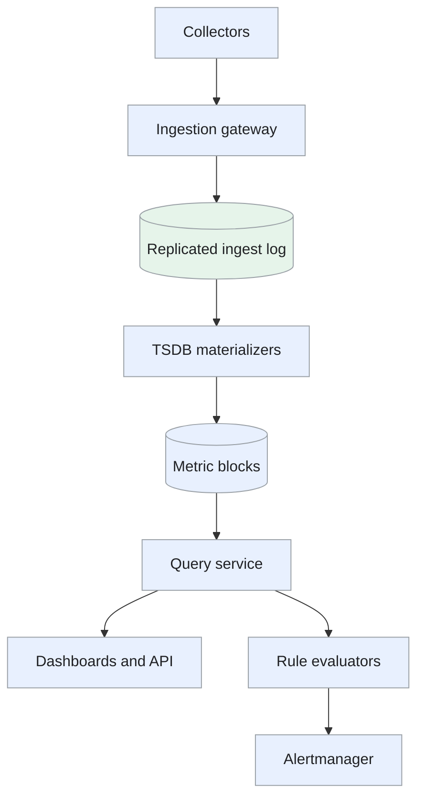
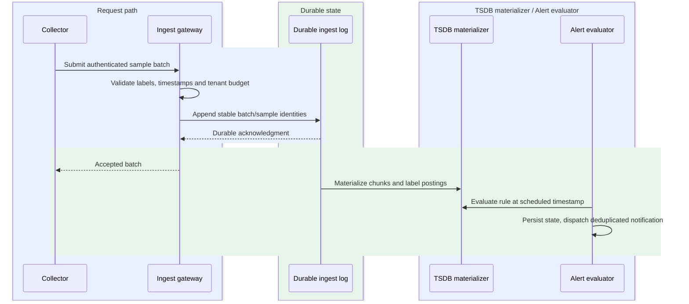
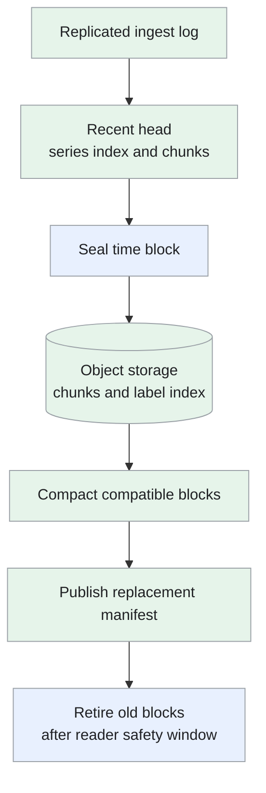
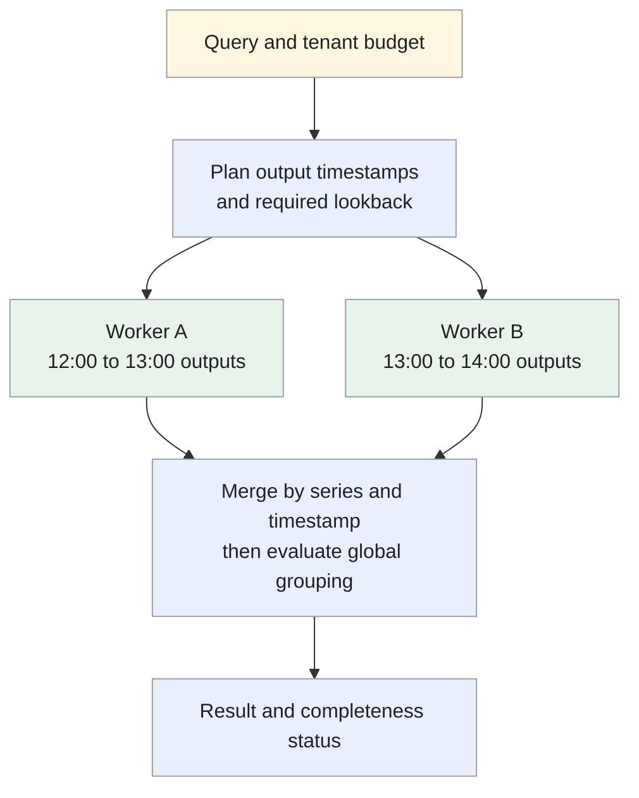

Design of a metrics platform that stores operational time series, serves dashboards and delivers alerts.

<!--more-->

## Problem

An engineer opens a dashboard to check a service's error rate, latency or resource usage. When a threshold stays exceeded, the platform sends an actionable alert to the responsible team.

Metrics arrive continuously from many hosts. The storage path needs efficient append throughput, while dashboard and alert queries need predictable access to recent data. Unbounded label combinations and broad queries can consume capacity faster than raw sample volume.

## Requirements

### Functional requirements

- **Collect metrics:** accept batched samples from collectors and Prometheus-compatible remote write.
- **Query time series:** filter by metric name, labels and time range; evaluate PromQL expressions.
- **Serve dashboards:** return recent data and longer-range summaries at a suitable resolution.
- **Evaluate alerts:** support threshold/duration rules and recording rules.
- **Deliver notifications:** group related alerts, deduplicate HA senders and support silences and routing.

### Non-functional requirements

- **Scale:** assume 100K hosts, 10M active series, 1M samples/s on average and 5M/s at peak.
- **Durability:** acknowledged writes survive a single ingest-node failure.
- **Availability:** target 99.9% for ingestion and the supported query workload.
- **Freshness:** expose ingested samples within 60 seconds; measure consumer lag separately.
- **Latency:** target sub-second dashboards for bounded, indexed queries with explicit series/sample limits.
- **Retention:** retain raw data for 30 days, with longer-lived recording-rule aggregates where appropriate.
- **Isolation:** authenticate tenants and enforce sample, active-series and query-work budgets.

## Back-of-the-envelope calculations

- `100K hosts × 100 metrics / 10s = 1M samples/s`; provision ingestion for a fivefold burst.
- Average traffic produces 86.4B samples/day. At an assumed 2 bytes/sample, compressed chunks add about 173GB/day or 5.2TB over 30 days before indexes, WAL, replicas and compaction headroom.
- A seven-day query over 10K series sampled every 15 seconds scans about 403M points. Use narrower selectors, recording rules or coarser resolution for predictable response times.

## Core entities

- **Series:** metric name plus a canonical label set within a tenant.
- **Sample:** a timestamped value belonging to a series.
- **Block:** immutable chunks and an index for a bounded time interval.
- **Alert rule:** an expression, duration and notification metadata.
- **Alert instance:** the rule/label combination and its current evaluation state.

```protobuf
message Series {
  string tenant_id;
  string metric_name;
  map<string, string> labels; // Canonical ordering defines identity
}

message Sample {
  string series_id;
  Timestamp timestamp;
  double value;
}

message Block {
  string block_id;
  Timestamp min_time;
  Timestamp max_time;
  string chunks_ref;
  string label_index_ref;
}

message AlertRule {
  string rule_id;
  string expression;
  Duration for_duration;
  map<string, string> labels;
}

message AlertInstance {
  string rule_id;
  map<string, string> labels;
  string state; // Inactive, pending or firing
  Timestamp active_since;
}
```

Use the canonical label set to check identity rather than relying on a hash alone. Sample conflicts at an existing series/timestamp receive a documented rejection policy.

## API

```yaml
POST /api/v1/write:
  headers:
    Content-Type: application/x-protobuf
    Content-Encoding: snappy
  body: Prometheus Remote Write batch
```

```yaml
GET /api/v1/query_range:
  query:
    query: 'sum(rate(http_requests_total[5m]))'
    start: timestamp
    end: timestamp
    step: 30s
  response: time-series matrix, warnings

GET /api/v1/series:
  query:
    match[]: 'http_requests_total{job="frontend"}'

PUT /v1/rule-groups/{group_id}:
  body: versioned alert and recording rules
```

Tenant identity comes from authentication. Rule-management endpoints are part of this platform's control plane, separate from Prometheus's query/remote-write protocol.

## High-level design

Collectors scrape local targets and push batches to the ingestion gateway. A durable log separates accepted writes from TSDB materialization. Queries combine recent chunks and historical blocks; alert evaluation uses the same query semantics.


```mermaid
flowchart TB
    C["Collectors"] --> G["Ingestion gateway"]
    G --> LOG[("Replicated ingest log")]
    LOG --> I["TSDB materializers"]
    I --> B[("Metric blocks")]
    B --> Q["Query service"]
    Q --> D["Dashboards and API"]
    Q --> R["Rule evaluators"]
    R --> A["Alertmanager"]
  classDef request fill:#e8f0fe,stroke:#9aa0a6,color:#202124,stroke-width:1px
  classDef background fill:#e6f4ea,stroke:#9aa0a6,color:#202124,stroke-width:1px
  classDef control fill:#fef7e0,stroke:#9aa0a6,color:#202124,stroke-width:1px
  class C,G,I,B,Q,D,R,A request
  class LOG background
```

This separation follows the ingest-storage option in [Mimir's architecture](https://grafana.com/docs/mimir/latest/get-started/about-grafana-mimir-architecture/). The operating budgets above remain design targets.

## Storage

- **[Kafka](/designs/tech-kafka/):** replicated ingest partitions keyed by tenant and series identity. Acknowledge only after the configured durable replication condition; retain enough history to replay a failed materializer.
- **[Prometheus](/designs/tech-prometheus-grafana/)-style TSDB blocks:** maintain recent chunks locally, then publish immutable chunks and label indexes to object storage. [Prometheus storage](https://prometheus.io/docs/prometheus/latest/storage/) documents WAL-backed heads, time blocks and background compaction.
- **Object storage:** durable historical blocks, manifests and compaction outputs. Delete source blocks only after the replacement manifest is committed and readers can switch safely.
- **[PostgreSQL](/designs/tech-postgresql/):** tenant configuration, versioned rules, notification routing and quotas.
- **[Memcached](/designs/tech-memcached/)/[Redis](/designs/tech-redis/):** derived query/index caches. Cache keys include tenant, query, step, time range and relevant data/rule versions.

PostgreSQL is suitable for control-plane transactions; a specialized TSDB is selected for the high-volume series/index workload. [Redis](/designs/tech-redis/) holds derived state rather than the sole retained metric history.

## From request to response

### One end-to-end request

An ingestion acknowledgment covers the retained sample batch, not the completion of every dashboard or alert.


```mermaid
sequenceDiagram
  box rgb(232,240,254) Request path
    participant U as Collector
    participant A as Ingest gateway
  end
  box rgb(230,244,234) Durable state
    participant D as Durable ingest log
  end
  box rgb(232,240,254) TSDB materializer / Alert evaluator
    participant W as TSDB materializer
    participant C as Alert evaluator
  end
  rect rgb(232,240,254)
    U->>A: Submit authenticated sample batch
    A->>A: Validate labels, timestamps and tenant budget
    A->>D: Append stable batch/sample identities
    D-->>A: Durable acknowledgment
  end
  rect rgb(230,244,234)
    A-->>U: Accepted batch
    D->>W: Materialize chunks and label postings
    C->>W: Evaluate rule at scheduled timestamp
    C->>C: Persist state, dispatch deduplicated notification
  end
```

Materializers expose samples to the query engine; an evaluator then records a pending/firing transition before notification delivery.

### Ingesting samples

1. A collector scrapes counters, gauges and histograms, batches samples and keeps a bounded local retry buffer.
2. The gateway authenticates the tenant, validates labels/timestamps and applies throughput and active-series limits.
3. Route each canonical series to an ingest partition. Commit the batch to the replicated log, then acknowledge.
4. Materializers consume in order, deduplicate accepted retries and append samples to recent chunks.
5. Publish completed blocks and consumption watermarks. Queries can see recent samples before historical-block publication.

Collector retries use backoff during overload. Once the collector buffer fills, sample loss is reported explicitly. Acknowledgment durability and query visibility are separate guarantees.

### Answering a dashboard query

1. Validate the expression, range and step; estimate its work budget and enforce tenant limits.
2. Split the time range where valid, retaining the full lookback required by range functions such as `rate(x[5m])`.
3. Use time bounds and label postings to prune blocks/series. Fetch recent chunks and historical data in parallel.
4. Merge replica results by canonical series and timestamp, then evaluate operators with correct global grouping.
5. Return the matrix with completeness warnings. Cache immutable historical intervals longer than intervals near the present.

A label selector does not reveal which hash shards contain matches by itself. Selective routing needs actual directory/index metadata; otherwise each relevant shard participates with local pruning.

### Firing an alert

Evaluate each rule group on a configured interval, for example 15 seconds. A true expression enters pending, stays active for the `for` duration and then becomes firing. Missing/stale data has explicit rule semantics. [Prometheus alerting rules](https://prometheus.io/docs/prometheus/latest/configuration/alerting_rules/) define these transitions.

Send firing and resolved state to [Alertmanager](https://prometheus.io/docs/alerting/latest/alertmanager/) for grouping, inhibition, silences and routing. Restore pending state carefully after restart, and expose evaluation failures separately from healthy “no alert” results.

## Deep dives

### Which storage model fits this workload?

At 1M samples/s, a separate database row and index entry for every sample creates substantial write amplification. Queries usually read many consecutive samples from the same series, so the physical layout should make that access cheap.

- **Partitioned PostgreSQL:** batch samples into time partitions with series/time indexes. SQL and familiar recovery are available, but row/index overhead and sharding work grow at the stated 1M samples/s.
- **LSM key-value storage:** append series/time keys into sorted runs and compact them in the background. Write throughput improves, but label postings, compression and PromQL semantics still need a dedicated implementation, and compaction competes with reads.
- **Prometheus-style TSDB:** append compressed series chunks with label postings and time-partitioned blocks. The physical layout matches repeated range reads; compaction, series admission and distributed query/recovery remain explicit operating responsibilities.

**Recommendation.** Use a Prometheus-style TSDB for samples and PostgreSQL for transactional configuration. Series chunks and label postings match the stated sample rate and consecutive range reads. The accepted cost is specialized query/recovery operations and temporary compaction space, rather than a relational row/index entry per sample.

**How the write path works**

A materializer consumes an ingest-log partition and locates the series using its canonical labels. It appends samples to an in-memory chunk and records enough durable state to recover after a crash. A new series also adds postings: for example, `job=checkout` maps to the IDs of all matching series. Intersecting postings for multiple labels gives the query engine a candidate set before it reads sample chunks.

Regular timestamps compress well with delta-of-delta encoding: a steady 15-second interval produces mostly zero changes in the interval. XOR encoding stores the changed bits between adjacent floating-point values. These are compression mechanisms, not a promise of a universal bytes/sample ratio.


```mermaid
flowchart TB
    L["Replicated ingest log"] --> H["Recent head<br>series index and chunks"]
    H --> S["Seal time block"]
    S --> O[("Object storage<br>chunks and label index")]
    O --> C["Compact compatible blocks"]
    C --> M["Publish replacement manifest"]
    M --> G["Retire old blocks<br>after reader safety window"]
  classDef request fill:#e8f0fe,stroke:#9aa0a6,color:#202124,stroke-width:1px
  classDef background fill:#e6f4ea,stroke:#9aa0a6,color:#202124,stroke-width:1px
  classDef control fill:#fef7e0,stroke:#9aa0a6,color:#202124,stroke-width:1px
  class S,G request
  class L,H,O,C,M background
```

Recent queries read the head; older queries prune immutable blocks by time and then use their label indexes. Compaction combines adjacent blocks, rewrites chunks and indexes, and publishes the replacement before reclaiming its inputs. Readers pin a manifest generation so a concurrent compaction cannot remove files they still need.

A crash before manifest publication leaves an unreferenced output that can be reclaimed. A crash afterward leaves a valid replacement plus obsolete inputs. Replay resumes from a checkpoint only when the corresponding materialized data is recoverable; advancing the checkpoint first could skip accepted samples. Provision temporary disk space and background-worker limits for compaction and replay, and measure ingest lag while broad queries are running.

### How do we contain label cardinality?

A metric named `http_requests_total` is not one series. Each distinct combination of tenant, metric name and labels creates its own series, index entries and recent-data state. A raw URL or user ID can turn a bounded service metric into millions of identities.

```text
5 methods × 10 statuses × 200 route templates = 10,000 series
Adding 100,000 user IDs can expand the theoretical space to 1 billion.
Actual series depend on which combinations are observed.
```

- **Arbitrary labels:** admit every observed label combination. Instrumentation is flexible, but user IDs and raw URLs can create unbounded memory/index state.
- **Drop labels after ingestion:** reduce dimensions downstream. Series counts may fall, but unrelated measurements can merge and already-created index state has already incurred the cost.
- **Explicit admission budgets:** canonicalize identity and grant each tenant bounded active-series and new-series-rate capacity before materialization. Memory and churn are controlled; legitimate new metrics may be rejected and distributed quota grants need accounting and expiry.

**Recommendation.** Enforce explicit per-tenant active-series and new-series-rate budgets before materialization. This isolates a bad instrumentation rollout while preserving admitted series. Excess new identities receive actionable rejection reasons; distributed grants and expiry add quota state, and historical retention is budgeted separately.

The gateway canonicalizes labels, validates size/count limits and routes the series to its owner. The owner checks whether the identity already exists. Existing admitted series continue through the ingestion path; a new identity consumes a series admission slot. Each shard receives a bounded share of the tenant's quota, and the sum of those grants stays within the global budget. This avoids a global transaction for every sample while preventing simultaneous shard admissions from bypassing the limit.

Normalize `/users/123` to a route label such as `/users/{id}`. Keep the request ID and user ID in logs or trace exemplars, where they can still help investigate an individual failure.

For a rollout that suddenly adds a high-cardinality label, reject excess new identities with an explicit reason and emit rejection counters from the platform's own protected telemetry path. Return batch errors with enough detail for a collector to distinguish retryable overload from a permanent label violation. Blindly retrying the latter would increase the load.

Active-series budgets protect memory; new-series-rate budgets protect index churn. Expire admission state only after the agreed inactivity interval and account for historical index/storage retention separately. Monitor both the total and its largest contributors so an engineer can identify the specific metric or label responsible.

### Should alerts be stream-driven or periodically evaluated?

Consider an alert that fires when a service's error rate exceeds 5% for two minutes. Its result depends on a five-minute window, and it must preserve the same service-level grouping at every evaluation. Evaluating every rule for every arriving sample would repeat work and would still need timers for missing data.

- **Periodic query evaluation:** run each rule at a scheduled timestamp using the query engine's established range/join semantics. Full PromQL and missing-data timers share one model; detection includes one interval plus ingestion/query and configured hold time.
- **Evaluate all rules for every sample:** repeatedly execute rules when data arrives. Simple rules can react quickly, but the stated ingest rate multiplies work and absent data still needs timers.
- **Indexed streaming evaluation:** maintain incremental state only for a restricted supported rule language and series-to-rule dependencies. Specialized rules can be low latency; state/checkpoint recovery, late data and unsupported operators need a separate contract.

**Recommendation.** Evaluate full PromQL periodically through the existing query engine and reserve capacity for rule groups. This preserves established range, join and missing-data semantics. We accept one tick of scheduling delay plus ingestion/query and configured hold time; lower-latency streaming is a separately defined restricted rule contract.

The proposed rule is:

```yaml
groups:
  - name: checkout-health
    interval: 15s
    rules:
      - alert: HighErrorRate
        expr: |
          sum by (service) (rate(http_requests_total{status=~"5.."}[5m]))
          /
          sum by (service) (rate(http_requests_total[5m]))
          > 0.05
        for: 2m
        labels:
          severity: page
```

The evaluator runs the expression at a scheduled timestamp, using the same timestamp for numerator and denominator. Each returned service label set identifies a separate alert instance. On the first true result it records `pending` and `active_since`; continuing true results retain that timestamp. After two minutes it becomes `firing`. A false result clears the pending interval. These are the [Prometheus alert-state semantics](https://prometheus.io/docs/prometheus/latest/configuration/alerting_rules/).

```text
12:00:00  true   pending starts
12:00:15  true   pending
...             every successful evaluation remains true
12:02:00  true   firing
12:02:15  false  resolved
```

If the first visible breach arrives just after a tick, the next evaluation adds up to one interval of scheduling delay. Ingestion visibility lag, query execution, the two-minute hold and notification grouping add separate delays. Track each component rather than advertising a 15-second end-to-end alert guarantee.

Assign rule groups to evaluators with versioned ownership. Persist the rule version, label identity, state and last successful evaluation; on takeover, restore pending state only when continuity can be established. A query error raises an evaluation-health signal and follows an explicit no-data/error policy. It must not silently count as a healthy false result.

Send alert state to [Alertmanager](https://prometheus.io/docs/alerting/latest/alertmanager/) for grouping, silences, inhibition and routing. Its notification timing is separate from expression evaluation. Reserve query capacity for alert rules and monitor overdue groups, evaluation errors and notification failures.

### How do broad queries stay bounded and correct?

A seven-day query over 10K series sampled every 15 seconds can read about 403M points. Adding workers reduces individual scan time, but every worker also consumes memory and produces results that need a correct merge.

- **Single worker:** execute one complete expression without distributed merges. Semantics are straightforward, but one worker's memory and scan capacity cap long/high-cardinality queries.
- **Unbounded fan-out:** send work to every eligible shard at once. Individual scans can finish sooner, but concurrency, stragglers and merge memory amplify load for all tenants.
- **Budgeted operator-aware splitting:** plan required lookback, split independent time/series work and cap scanned data/concurrency. Parallelism remains controlled and merges preserve operator quantities; some joins need global inputs and oversized queries must be rejected or explicitly partial.

**Recommendation.** Use work budgets, bounded parallelism and operator-aware splitting, then recording rules for repeated expensive expressions. This shares scan capacity without changing lookback or merge semantics and protects alert evaluation. Oversized queries are rejected or clearly partial under policy; unlimited fan-out is not the fallback.

For `sum(rate(http_requests_total[5m]))`, a time split at 13:00 must still read the previous five minutes for the first evaluation after that boundary. Splitting only the raw 13:00-onward samples would change the rate.


```mermaid
flowchart TB
    Q["Query and tenant budget"] --> P["Plan output timestamps<br>and required lookback"]
    P --> A["Worker A<br>12:00 to 13:00 outputs"]
    P --> B["Worker B<br>13:00 to 14:00 outputs"]
    A --> M["Merge by series and timestamp<br>then evaluate global grouping"]
    B --> M
    M --> R["Result and completeness status"]
  classDef request fill:#e8f0fe,stroke:#9aa0a6,color:#202124,stroke-width:1px
  classDef background fill:#e6f4ea,stroke:#9aa0a6,color:#202124,stroke-width:1px
  classDef control fill:#fef7e0,stroke:#9aa0a6,color:#202124,stroke-width:1px
  class P,M,R request
  class A,B background
  class Q control
```

Worker B reads from 12:55 for its 13:00 output. Both workers align to the same requested step; the coordinator assigns each output timestamp to one split. Hash-partitioned series may require several storage shards even for a selective label query. Each shard prunes locally using postings; a directory is needed before the coordinator can safely skip a shard.

The merge preserves the quantity required by each operator:

- **Sum:** combine partial sums for the same timestamp and grouping labels.
- **Mean:** combine sum and count, then divide; averaging shard means would weight small shards incorrectly.
- **Percentile:** merge compatible histogram bucket counts, then calculate the percentile.
- **Counter rate:** evaluate each counter with reset-aware samples before summing rates.

[Prometheus function semantics](https://prometheus.io/docs/prometheus/latest/querying/functions/) provide the baseline; distributed execution must preserve them. Joins and other operators that need complete global inputs receive a plan that collects those inputs within a budget.

Charge work against scanned-series, scanned-sample, bytes and concurrency limits. Cancel child tasks when the deadline expires. A dashboard can accept clearly marked partial results; a critical alert rule should use the configured error policy instead of treating an incomplete sum as authoritative. Cache immutable historical intervals and benchmark the planner against a single-engine reference using counter resets, duplicate replicas and split-boundary cases.
