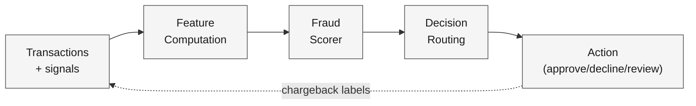
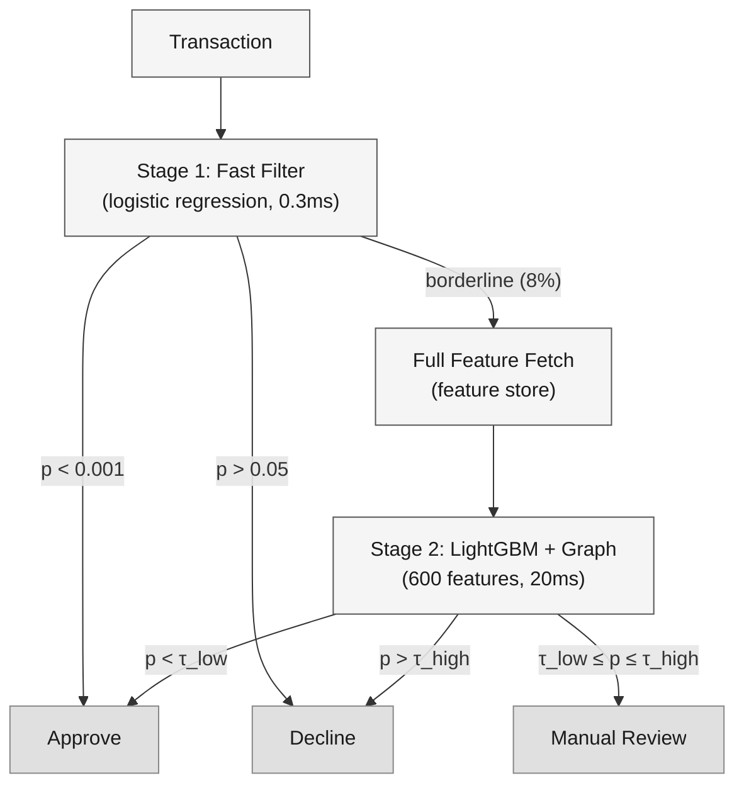
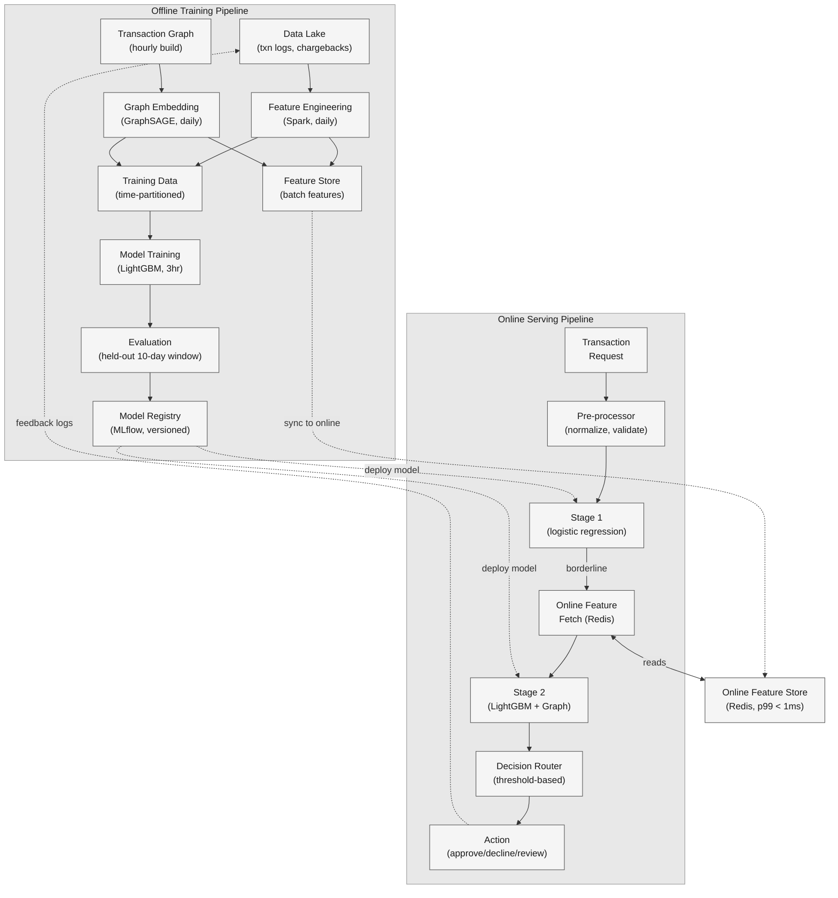

A payment platform processes millions of transactions daily. Every transaction carries a risk: a stolen card used for a high-value purchase, a merchant fabricating orders to collect on chargebacks, a fraud ring testing compromised cards with micro-transactions before draining accounts.

<!--more-->

## 1. Problem & ML framing

A payment platform processes millions of transactions daily. Every transaction carries a risk: a stolen card used for a high-value purchase, a merchant fabricating orders to collect on chargebacks, a fraud ring testing compromised cards with micro-transactions before draining accounts. The product must score every transaction in real time — approve legitimate purchases, decline high-confidence fraud, and route borderline cases for manual review — while adapting as fraudsters evolve their techniques. The business objective is to minimize fraud loss in dollars while capping the false-positive rate so legitimate customers are not turned away at checkout.

The ML task is **imbalanced binary classification** over transaction-level, user-level, device-level, merchant-level, and graph-level signals. Input: a transaction composed of (amount, currency, timestamp, channel), the user's behavioral fingerprint (velocity features, account age, device history), the merchant's risk profile, and contextual signals (IP geolocation, device fingerprint, session metadata). Output: a fraud probability *p ∈ [0,1]* and a decision routing — *approve* (p < τ_low), *decline* (p > τ_high), or *review* (τ_low ≤ p ≤ τ_high). The business objective (minimize fraud loss $ while keeping false-positive rate below 0.1%) is distinct from the ML objective: maximize **PR-AUC** and **Recall@Precision99** on held-out chargeback-confirmed labels.

## 2. Requirements

**Functional**

- FR1: Score every transaction in real time and route to approve, decline, or manual review.
- FR2: Support per-merchant risk thresholds and custom blocklists alongside the global model.
- FR3: Ingest and act on new fraud patterns within hours as fraudster techniques evolve.
- FR4: Surface graph-based risk signals linking users, devices, cards, IPs, and merchants.

**Non-functional**

- NFR1: p99 scoring latency under 100 ms; median under 30 ms for the inline decision path.
- NFR2: Throughput: 50M+ transactions per day, ~600 TPS sustained, 2,000 TPS peak.
- NFR3: 99.99% serving availability; degrade to rule-only fallback if the model path fails.
- NFR4: Feature freshness under 1 minute for velocity aggregates; model retrained daily.

*Out of scope: payment processing and fund settlement, PCI compliance and tokenization, KYC/identity verification, merchant onboarding and underwriting.*

## 3. Metrics

**Offline (model quality on held-out chargeback-confirmed data)**

- **PR-AUC** — primary. Precision-recall area under the curve captures performance across all thresholds on a dataset where positives are under 0.1% of transactions. ROC-AUC inflates perceived performance because the true-negative count dominates the false-positive rate; PR-AUC answers the question that matters: at any given recall, what precision does the model deliver.
- **Recall@Precision99** — the operational metric for the auto-decline threshold. At 99% precision, fewer than 1 in 100 declines is a false positive; maximizing recall at that precision level directly optimizes fraud capture within the business constraint.
- **AUC-ROC** — secondary sanity check, used to detect catastrophic regressions in model discrimination.

**Online (real business impact via A-B experiment)**

- **Fraud loss rate ($)** — total fraud dollars that passed through / total transaction volume. A decline in the model's offline PR-AUC should, within the chargeback confirmation window, translate to higher fraud loss.
- **False-positive rate** — legitimate transactions declined / total declines. Guards against an over-aggressive model that drives customers away.
- **Chargeback rate** — chargebacks filed / total transactions. A delayed ground-truth signal that confirms or contradicts the model's decisions with a 30–90 day lag.

Every offline metric maps to an online counterpart: PR-AUC gains should reduce fraud loss rate; Recall@Precision99 improvements should increase fraud capture without lifting the false-positive rate. If an offline lift does not improve the online guardrails, the offline evaluation is measuring the wrong signal or the label window is misaligned.

## 4. Data

**Sources**

- **Transaction logs:** amount, currency, timestamp, payment method, card BIN, merchant ID, channel (web, mobile, API), IP address, device fingerprint, session ID, 3DS status. ~50M events/day.
- **User profiles:** account creation date, historical transaction volume and velocity, average transaction amount, device history (past N device fingerprints), chargeback history, account verification level.
- **Merchant profiles:** category (MCC code), business age, historical chargeback rate, average order value, transaction volume trend, geographic footprint.
- **Device fingerprints:** browser/OS canvas hash, WebGL fingerprint, installed fonts hash, timezone, language, screen resolution, whether the device has been seen before and with which accounts.
- **Graph edges:** user–device links, user–card links, card–IP links, user–IP links, merchant–user co-occurrence, device–IP links. Built as a heterogeneous graph from the transaction stream.

**Labeling / ground-truth strategy**

The target is a **binary fraud label (0/1)** per transaction. Three tiers feed the training pipeline:

1. **Chargebacks (gold)** — when a cardholder disputes a transaction, the issuing bank reverses the charge. This is definitive ground truth for fraud, but it arrives with a 30–90 day lag and covers only the transactions a cardholder noticed and disputed. ~5% of actual fraud generates a chargeback.
1. **Manual review labels (silver)** — transactions routed to human reviewers receive a label within hours. Reviewers have access to richer context than the model and provide high-quality labels, but at a cost that limits review volume to ~2% of transactions.
1. **Rule-based heuristics (bronze proxy)** — known fraud patterns (velocity spikes, amount mismatches, geo-impossible travel, known-compromised-card lists) generate provisional labels used for training until chargeback confirmation arrives.

**Class imbalance**

Fraud accounts for under 0.1% of transactions (positive rate ≈ 0.05–0.2%). Mitigation: during training, positives are up-weighted 500× via scale_pos_weight in XGBoost/LightGBM or via focal loss (γ=2) for the neural models. Hard-negative mining is performed each epoch: the top-k highest-scoring false positives from the current model checkpoint are included in the next epoch's training batch, ensuring the model focuses on the borderline negatives it gets wrong. For the validation and test sets, stratification preserves the natural prevalence; precision-recall curves are the evaluation metric, never accuracy.

**Train / val / test splits**

Strictly time-based. Train on transactions from days 1–80, validate on days 81–90, test on days 91–100. Random splits leak temporal patterns (a fraud ring active across the split boundary contaminates both sides) and overestimate real-world performance by 15–30% on PR-AUC. The test set is held out for final evaluation only and never used during hyperparameter tuning or model selection.

**Scale**

- 50M transactions/day; ~5K chargeback-confirmed positives/day (0.01% of volume after accounting for confirmation lag)
- ~50K manual review labels/day; ~500K rule-based proxy labels/day (lower fidelity)
- Feature dimension: ~800 raw features, ~200 engineered features; embedding dimensions 64–256
- Graph: ~500M nodes (users, devices, cards, IPs, merchants), ~2B edges, updated hourly

## 5. Features

**Transaction features**

- Amount (log-transformed + z-scored per user), currency, payment method (card / wallet / bank transfer), time of day (cyclic encoding: sin/cos of hour), day of week, transaction channel (web / mobile / API).
- Amount-to-user-average ratio: a $5,000 transaction for a user whose average is $45 is anomalous regardless of absolute amount.
- Time since last transaction from the same user — inter-transaction interval under 30 seconds signals automated script behavior.

**User velocity features (computed in the feature store, sliding window)**

- Transaction count in the last 1 minute, 15 minutes, 1 hour, 24 hours. A user with 3 transactions in a year suddenly doing 12 in 5 minutes triggers the velocity check.
- Distinct cards used in the last 24 hours. A single user cycling through 8 cards suggests card testing.
- Distinct merchants, IPs, and devices in the last 7 days. Rapidly rotating identifiers is a fraud-ring signature.
- Account age in days; days since last password change; account verification status.

**Merchant features**

- Merchant category code (MCC), merchant age, historical chargeback rate (smoothed via Bayesian averaging for low-volume merchants).
- Average order value and its 30-day trend. A sudden spike in average order value at a merchant that typically sells $15 items suggests account takeover or catalog hijacking.
- Geographic footprint: entropy of shipping addresses; a merchant shipping to 30 countries from day one is riskier than one with a single-country footprint.

**Context features**

- IP geolocation (country, city, ASN), distance from shipping address, distance from the user's historical IP centroid.
- Device fingerprint: whether the device has been seen before on the platform, how many distinct accounts have used it, whether any of those accounts have chargebacks.
- Session metadata: login-to-checkout time (a 3-second fill-and-submit is script-like), browser language vs shipping country mismatch, whether 3D Secure was completed.

**Graph features**

- **Neighbor embedding:** for the user node in the heterogeneous graph (user–device–card–IP–merchant), a GraphSAGE or RGCN encoder produces a 128-dim embedding that summarizes the risk profile of the user's local neighborhood. A user connected to IPs and devices linked to known fraudsters receives a higher-risk embedding.
- **Structural features:** degree of each node type (how many accounts share this IP? How many cards has this device seen?), PageRank centrality, community/cluster ID from Louvain clustering run weekly.
- **Temporal graph features:** edge count in the last hour between the user's neighborhood and known-fraudster nodes; velocity of new edge formation (a fraud ring rapidly forming new account–device links).

**Feature store & online/offline parity**

All features are computed through a shared feature store (Feast or equivalent) with a single canonical definition per feature. Batch features (user velocity aggregates, merchant chargeback rates, graph embeddings) are computed hourly on Spark and materialized to the online store (Redis cluster, p99 read latency < 1 ms). Real-time features (amount-to-average ratio, time-since-last-transaction) are computed at serving time from the same logic library that the offline pipeline calls, guaranteeing numerical parity. The online feature vector is logged alongside every prediction; during retraining, logged features are replayed so the model trains on exactly the distribution it sees at serving time.

**Embeddings**

High-cardinality categorical features — user ID, merchant ID, card BIN, device fingerprint hash, IP prefix — are embedded into 64–256 dim dense vectors trained jointly with the downstream model. The embedding table for users is updated daily; cold-start entities (new user, new merchant) use a global mean embedding plus graph-derived similarity features as a warm-start.

## 6. Model

### Baseline: rules + logistic regression

Before any learned model, a rules engine applies deterministic checks: velocity thresholds (≥10 transactions in 5 minutes from a new account), amount ceilings, known-compromised-card lists, and geo-impossible travel. A logistic regression trained on ~200 hand-selected features serves as the first learned baseline — it is fast (sub-millisecond inference), trivially interpretable, and establishes the minimum bar any advanced model must beat. On the test set, logistic regression achieves ~0.35 PR-AUC and ~0.12 Recall@Precision99.

### Advanced: GBDT ensemble with graph features

The production model is a **LightGBM gradient-boosted decision tree ensemble** consuming ~600 tabular features plus 128-dim graph neighbor embeddings. LightGBM was chosen over a deep neural network for three reasons grounded in the data characteristics:

- **Heterogeneous features.** The feature set mixes numerical, categorical, missing-at-random, and highly-skewed distributions. GBDTs handle these natively without normalization, one-hot encoding, or imputation — a practical advantage when feature definitions change weekly and encoding pipelines are a source of training-serving skew.
- **Training speed.** A full LightGBM training run on 30 days of data (~1.5B transactions, 5M positives) completes in ~3 hours on a single 8-core node. A deep tabular model (FT-Transformer) on the same data requires 8× A100 GPUs and 12 hours. Daily retraining is feasible with LightGBM; it is not with the deep alternative at this data scale.
- **Interpretability.** SHAP values per transaction expose which features drove the decision — critical for compliance, manual review triage, and debugging false positives. A neural network produces a score but requires a separate explainability model.

The tradeoff: GBDTs cannot learn arbitrary feature interactions the way a transformer can. The remedy is to encode known high-value interactions explicitly as cross-features (amount × user-avg-ratio, device-age × transaction-count-past-hour) and to let the graph embedding capture the relational structure that GBDTs miss.

### Graph neural network for link analysis

A **GraphSAGE** encoder (2-layer, 128-dim hidden, mean aggregator) runs over the heterogeneous transaction graph to produce a per-node embedding that captures neighborhood risk. The graph includes five node types (user, device, card, IP, merchant) and six edge types. Training uses a link-prediction objective on known fraud edges plus a supervised node-classification head on chargeback-labeled users. The trained encoder is frozen and run daily to produce embeddings for all active nodes; these embeddings are fed as features into the LightGBM model.

The separation — graph encoder trained independently, embeddings consumed as tabular features — is deliberate. Joint end-to-end training of GNN + GBDT would require the full graph in the training loop, which is infeasible at 2B edges. The two-stage approach lets each component use its optimal infrastructure: DGL on GPU for graph training, LightGBM on CPU for tabular training.

### Loss function

LightGBM is trained with **binary cross-entropy**, scale_pos_weight set to 500 (the inverse of the positive prevalence after hard-negative mining). For the neural components (graph encoder), **focal loss** with γ=2 and α=0.75 down-weights the overwhelming easy negatives and focuses the gradient on hard-to-classify examples — transactions that look legitimate but triggered chargebacks, or borderline cases the current model gets wrong.

### Multi-stage inference

A two-stage pipeline reduces serving cost while maintaining recall:

1. **Stage 1 — fast filter (logistic regression, 0.3 ms).** A lightweight model with ~50 features (velocity, amount, device age, geo-distance) scores every transaction. Transactions with p < 0.001 pass through immediately; transactions with p > 0.05 are declined. The middle band — ~8% of transactions — is promoted to stage 2.
1. **Stage 2 — full ensemble (LightGBM + graph embeddings, 20 ms).** The full model with 600+ features and graph neighbor embeddings scores the borderline transactions. This is where the precision-recall tradeoff is managed through threshold calibration.

The fast filter catches 97% of legitimate transactions and 60% of obvious fraud, reducing the expensive ensemble's load by 12×.

### Ensemble & threshold calibration

The final score is a weighted average of the LightGBM score (weight 0.85) and the graph-based risk score — a logistic regression over the graph embedding alone (weight 0.15). The graph score provides an independent signal that is harder for fraudsters to manipulate (changing a device fingerprint is easy; rewiring a graph neighborhood is hard).

Thresholds τ_low and τ_high are calibrated on the validation set to hit Recall@Precision99 for auto-decline and <0.05% false-positive rate for auto-approve. Thresholds are re-calibrated after every retraining run and shadow-deployed alongside the model.

## 7. Architecture

#### Offline training pipeline

**Components:** Apache Spark (feature engineering on 50M transactions/day), GPU node (graph embedding training with DGL), CPU training nodes (LightGBM), Feast feature store, MLflow model registry.

**Flow:**

1. **Data ingestion.** Raw transaction logs and chargeback confirmations land in a data lake (Parquet on object storage), partitioned by hour. A daily Spark job joins transactions to their eventual chargeback labels, applying the 30-to-90-day label window — a transaction from day 1 whose chargeback arrived on day 75 is finally labeled on day 75 and enters the training set for the next retraining run.
1. **Feature engineering.** The same Spark job computes batch features — user velocity aggregates (counts over 1min/15min/1hr/24hr windows), merchant chargeback rates (Bayesian-smoothed), device risk scores — and pushes them to the feature store. Crucially, it also logs the feature values alongside each training example so that the online feature store can replay exact serving-time values during model evaluation.
1. **Graph embedding.** Every hour, a graph construction job on Spark/Cypher loads the latest edges into the heterogeneous graph. Once daily, a GraphSAGE encoder is trained on a GPU node using DGL, producing 128-dim embeddings for all active nodes. These embeddings are pushed to the feature store as batch features.
1. **Training.** LightGBM trains on the prior 80 days of data with binary cross-entropy and scale_pos_weight=500. Training uses early stopping on the validation set (days 81–90) with a patience of 50 rounds. A full run takes ~3 hours on a single 32-core node. Hyperparameters (learning rate, max depth, num leaves) are tuned via Bayesian optimization (Optuna) every two weeks.
1. **Evaluation.** The trained model is scored against the held-out test set (days 91–100) on PR-AUC and Recall@Precision99. If it underperforms the production model by more than 1% on either metric, training is re-run with adjusted hyperparameters. If it ties or beats, it is registered in MLflow and advances to shadow deployment.
1. **Model registry.** The winning checkpoint is registered with metadata: training date, data window (start/end), PR-AUC, Recall@Precision99, feature set version, and graph embedding version. The registry triggers a shadow deployment: the new model scores live traffic in parallel with production, logging predictions without affecting transaction outcomes.

#### Online serving pipeline

**Components:** load-balanced API gateway, pre-processing service, stage-1 scorer (logistic regression, CPU), feature server (Redis-backed online store), stage-2 scorer (LightGBM + graph embedding, CPU), decision router.

**Flow:**

1. **Transaction arrives.** The API gateway receives a transaction request (amount, user ID, merchant ID, card BIN, IP, device fingerprint, session metadata) and routes it to the pre-processor, which validates fields, normalizes amounts, and encodes categoricals — under 2 ms.
1. **Stage 1 — fast filter.** The logistic regression model with ~50 features scores the transaction in ~0.3 ms. If p < 0.001 → approve. If p > 0.05 → decline. The middle band (~8% of transactions) proceeds to stage 2. Total stage-1 wall time: ~3 ms including pre-processing.
1. **Feature fetch.** For borderline transactions, the feature server queries the Redis-backed online store for batch features (user velocity, merchant chargeback rate, graph embedding) and computes real-time features (amount-to-average ratio, time-since-last-transaction) from the same logic library used in training. Feature fetch: ~10 ms at p99, ~3 ms median.
1. **Stage 2 — full ensemble.** The LightGBM model scores the transaction with 600+ features. Inference runs on CPU (liblightgbm, single thread) in ~15 ms. The graph risk score (dot product of embedding + logistic head) adds ~5 ms. Total stage 2: ~20 ms.
1. **Decision routing.** The ensemble's fraud probability is compared to calibrated thresholds. p < τ_low → approve; τ_low ≤ p ≤ τ_high → manual review queue; p > τ_high → decline. Threshold lookup: < 1 ms.

**End-to-end latency:** median ~25 ms for the inline path (stage 1 approve), ~50 ms for the full pipeline (stage 2 ensemble); p99 under 80 ms for the full path — within the 100 ms budget.

**Feedback loop.** Every transaction, model scores, stage reached, final decision, and feature vector are logged to the data lake. When a chargeback arrives (30–90 days later), the transaction is re-labeled and the (features, label) pair enters the next training window. A daily monitoring job computes the model's PR-AUC on chargebacks that arrived in the last 24 hours; if it drops below a threshold, retraining is triggered immediately rather than waiting for the daily cadence.

**Serving scale.** 50M transactions/day → ~580 TPS average, 2,000 TPS peak. The stage-1 filter absorbs 92% of traffic on CPU (~12 cores across 3 replicas). Stage 2 handles ~8% of traffic (160 TPS peak) on 8 CPU cores per replica × 4 replicas. The Redis cluster for the online feature store serves ~50K lookups/second with p99 latency under 1 ms. Graph embeddings are materialized daily; serving simply does a key-value lookup — no graph traversal at inference time.

**Design consideration:** the feature store is the single most important component for training-serving parity. Every feature — batch-computed velocity aggregates, merchant chargeback rates, graph embeddings — has exactly one canonical definition executed in both the offline Spark pipeline and the online feature server. When a feature definition changes, the new version is shadow-deployed alongside the model and validated before promotion. Without this, a model trained on Spark-computed features and served on Redis-computed features will silently accumulate skew until its decisions are worse than random.

## 8. Deep dives

### DD1: Class imbalance and threshold calibration

**Problem.** Fraud represents under 0.1% of transactions, but the cost asymmetry is extreme: a missed fraud costs $X (the transaction amount plus chargeback fees), while a false positive costs customer goodwill and possibly a lost lifetime relationship. The model must be both sensitive enough to catch rare fraud and precise enough that the auto-decline path does not alienate legitimate users. Standard accuracy is worthless — a model that always predicts "legitimate" achieves 99.9% accuracy and catches zero fraud.

**Approach 1: Weighted loss with hard-negative mining.**

Each training batch is constructed so that positives comprise 30–50% of examples. Positives are replicated with weight scale_pos_weight=500 in the LightGBM loss. Hard negatives — transactions the current model scores highly but are ultimately legitimate — are identified each epoch and included in the next epoch's batch. This forces the model to learn the boundary where fraud looks most like legitimate behavior: a $2,000 purchase at a luxury merchant from a user whose average is $150, but whose account is 5 years old with zero prior chargebacks and a consistent device fingerprint.

**Challenges:** hard-negative mining is computationally expensive (requires scoring the full dataset each epoch) and risks overfitting to the specific negatives the current model finds hard. If the production distribution shifts, the hard negatives from training may no longer be the ones the model encounters.

**Approach 2: Focal loss with adaptive γ.**

Focal loss, *FL(p_t) = −α_t (1 − p_t)^γ log(p_t)*, automatically down-weights easy examples. When γ=2, a correctly classified transaction with p=0.99 contributes 0.0001× the gradient of a borderline transaction with p=0.5. This eliminates the need for explicit hard-negative mining because the loss itself ignores easy negatives. The α parameter balances class weights (α=0.75 for positives, α=0.25 for negatives). Used for the graph encoder training, where batch construction is constrained by mini-batch sampling from the graph.

**Challenges:** focal loss introduces a hyperparameter (γ) that must be tuned alongside the model. Too low and easy negatives still dominate; too high and the model ignores the legitimate patterns it needs to learn to distinguish fraud from unusual-but-valid behavior.

**Approach 3: Threshold calibration with a cost matrix.**

Rather than tuning the model to produce calibrated probabilities, calibrate the decision thresholds post hoc using a cost matrix that captures the business cost of each outcome:

|  | Predict Legitimate | Predict Fraud |
|---|---|---|
| **Actually Legitimate** | $0 | $C_FP (customer goodwill cost) |
| **Actually Fraud** | $C_FN (transaction amount + chargeback fee) | $0 (fraud prevented) |

The optimal threshold τ minimizes expected cost: τ = C_FP / (C_FP + C_FN). With typical values — C_FP ≈ $50 (lifetime value erosion from one declined transaction) and C_FN ≈ $200 (average fraud amount + $25 chargeback fee) — the cost-optimal threshold is τ ≈ 0.20: decline when p > 0.20. This threshold is then validated against the Recall@Precision99 constraint: if the cost-optimal threshold produces precision below 99%, it is raised until the precision constraint is met, and the remaining borderline transactions are routed to manual review.

**Decision → Rationale.** Use all three in combination. Weighted loss with hard-negative mining is the primary training mechanism for LightGBM — it is proven and directly supported by the framework. Focal loss is used for the graph encoder where batch construction is constrained. Threshold calibration with the cost matrix is the deployment mechanism: thresholds are recomputed after every retraining run, and the cost parameters C_FP and C_FN are reviewed quarterly as the business scales.

> [!TIP]
> **Key insight:** The precision-recall tradeoff is not a model problem; it is a business problem. The model's job is to produce a good ranking (high PR-AUC); the threshold's job is to encode the business's willingness to trade false positives for fraud capture. Separating these two concerns — model quality measures ranking, threshold calibration measures business cost — keeps the ML and product teams from talking past each other.

### DD2: Concept drift and adversarial adaptation

**Problem.** Fraud detection is an adversarial domain. Fraudsters actively probe the system, learn its decision boundaries, and adapt — a pattern that works today (small test transactions from new accounts on residential IPs) will be abandoned within weeks as the model learns it and fraudsters move to the next technique. Simultaneously, legitimate user behavior shifts: a new payment method, a seasonal shopping pattern, or a platform expansion into a new geography changes the distribution of legitimate transactions. The model degrades on two fronts: fraud patterns evolve (adversarial drift) and the legitimate baseline shifts (natural drift). Without continuous adaptation, a model's PR-AUC can drop 10–15% within 90 days.

**Approach 1: Daily full retraining with shadow deployment.**

Every 24 hours, a new model is trained on a sliding 90-day window of data and evaluated against the held-out 10-day test set. If it passes the evaluation gate (PR-AUC and Recall@Precision99 within 1% of production), it is shadow-deployed: the new model scores live traffic in parallel with production for 6 hours, and its predictions are logged alongside the production model's. An automated A-B comparison checks that the shadow model's decisions agree with production on ≥98% of legitimate transactions and catches ≥95% of the fraud that production catches. If both checks pass, the shadow model is promoted to production.

**Challenges:** a 24-hour retraining cycle means a fraud pattern that emerges at 9 AM and peaks at 3 PM will not be blocked by the model until ~9 AM the next day — a 24-hour window of exposure. The 90-day training window means older legitimate patterns exert inertia; a new geography's legitimate behavior takes weeks to become the new normal in the training distribution.

**Approach 2: Online learning with per-transaction updates.**

An online learning model (FTRL-proximal logistic regression, Vowpal Wabbit, or an online gradient-boosted tree) updates its weights after every transaction — or every batch of 1,000 transactions — using the most recent labels. Chargeback labels are delayed, but rule-based proxy labels (velocity spikes, geo-impossible travel) provide immediate weak supervision. The online model adapts to patterns within minutes: a new fraud ring hitting at 3 AM is partially blocked by 3:30 AM.

**Challenges:** online learning is vulnerable to adversarial poisoning — a fraudster can submit a series of legitimate-looking transactions to shift the model's decision boundary before executing the fraud. Without a human-in-the-loop gate on weight updates, the model can be trained into a worse state. Proxy labels introduce noise; training on noisy labels without a correction mechanism drifts the model toward the proxy's biases. Online models also make rollback harder: if a bad update degrades performance, reverting to a known-good checkpoint requires storing per-transaction model snapshots.

**Approach 3: Ensemble of models at different staleness.**

Run three models in production: a *stable* model retrained monthly on a 180-day window (captures long-term legitimate patterns), a *fast* model retrained daily on a 30-day window (catches recent fraud patterns), and an *online* model updated hourly from proxy labels (adapts to same-day attacks). The ensemble score is a weighted average: 0.5 × stable + 0.35 × fast + 0.15 × online. If the online model diverges from the stable model by more than a threshold, its weight is reduced to 0.05 and an alert fires.

**Decision → Rationale.** Adopt Approach 1 (daily retraining with shadow deployment) as the primary mechanism, augmented by the multi-staleness ensemble from Approach 3. Full daily retraining on a 90-day window handles natural drift and weekly fraud pattern evolution. The multi-staleness ensemble — stable (180-day) + fast (30-day) + online (hourly proxy labels) — provides defense-in-depth: the stable model anchors against adversarial poisoning, the fast model catches weekly shifts, and the online component catches same-day attacks with a weight cap that limits damage from poisoned updates. Online weight updates use proxy labels only (not chargebacks) and are gated: if the online model's fraud rate diverges from the stable model's by >2×, the online weight is frozen until a human reviews the divergence.

> [!TIP]
> **Key insight:** In an adversarial domain, no single model retrained at any cadence is sufficient. The attacker probes the *fastest* model's boundary, so the defense must include a slower-moving anchor model that the attacker cannot probe quickly. The stable model's 180-day window means a fraudster would need to execute months of benign transactions before their attack pattern looks legitimate — an uneconomical proposition for most fraud operations.

### DD3: Label delay and feedback loops

**Problem.** The most reliable fraud labels — chargebacks — arrive 30 to 90 days after the transaction. A model retrained today on "all available labels" is actually training on fraud patterns from 1–3 months ago. Worse, the transactions that do generate chargebacks are a biased sample: cardholders notice and dispute large, obvious fraud but may never notice small test transactions, meaning the labeled fraud distribution underrepresents the probing phase of fraud rings. Training on delayed, biased labels creates a feedback loop: the model learns to catch the fraud patterns from 2 months ago, misses the current patterns, and the fraud it misses is unlikely to generate chargebacks (because small test transactions go unnoticed), so those patterns never enter the training data.

**Approach 1: Temporal label windows with wait-and-train.**

Training data is constructed with explicit label windows: a transaction from day T is considered unlabeled until day T+90, at which point it is either labeled fraud (if a chargeback arrived) or legitimate (if no chargeback arrived within the 90-day window). Training always runs on data where the label window has closed. This is clean but means the model is always training on fraud from 90–180 days ago — an eternity in adversarial time.

**Approach 2: Proxy labels with chargeback correction.**

Rule-based heuristics and manual review labels provide immediate weak supervision. The proxy labels have higher recall but lower precision than chargebacks — a velocity spike is suspicious but not always fraud. The model is trained on proxy labels with a correction mechanism: when a chargeback eventually arrives, the proxy label is compared to the chargeback label, and the model's loss is re-weighted for that example. Transactions where the proxy label matched the chargeback are up-weighted; transactions where the proxy was wrong are down-weighted or flipped. This gives the model a head start on recent patterns while the chargeback window closes.

**Challenges:** if the proxy labels have systematic bias (e.g., velocity checks flag more fraud from developing countries because those users have spikier transaction patterns), the model inherits that bias even after correction because the proxy labels determine *which* examples enter the training set at all.

**Approach 3: Semi-supervised learning with positive-unlabeled (PU) learning.**

Treat the problem as positive-unlabeled: chargebacks are known positives, but the absence of a chargeback does not guarantee a legitimate transaction — it may be undisputed fraud. A PU classifier is trained in two steps: first, identify reliable negatives (transactions from long-tenure users with consistent behavior, low amounts, and no chargebacks over 180 days); second, train a classifier on the reliable positives + reliable negatives, then apply it to the unlabeled set to identify likely fraud that never generated a chargeback. These "discovered positives" are added to the training set with a lower weight, expanding the labeled fraud set beyond what chargebacks alone cover.

**Decision → Rationale.** Combine Approaches 1 and 2. The primary training pipeline uses the 90-day chargeback window (Approach 1) for the stable model component. The fast daily model and the online model use proxy labels (Approach 2) with chargeback correction applied as chargebacks arrive. This gives the system two time horizons: the stable model is trained on high-quality labels with a 3-month lag, and the fast/online models are trained on noisy near-real-time labels that are corrected as ground truth trickles in. The correction is applied as a re-weighting pass: once a week, all proxy-labeled transactions from the prior 90 days are compared to their eventual chargeback status and the training weights are updated. The model is retrained with the corrected weights.

> [!TIP]
> **Key insight:** Label delay creates a fundamental tension between label quality and label freshness. You cannot have both; the only viable strategy is to run two models at different points on the quality-freshness spectrum and ensemble them. The stable model anchors on quality; the fast model captures recency. The correction loop — recomputing weights as chargebacks arrive — is what prevents the fast model's proxy-label bias from accumulating over time.

### DD4: Cold start for new users, cards, and merchants

**Problem.** A new user signing up for the platform has no transaction history, no device fingerprint history, and no graph neighborhood. A new merchant has no chargeback rate, no average order value trend, and no established customer base. A new card added to an existing account has no prior usage pattern. The model's richest features — velocity, behavioral baselines, graph embeddings — are either zero or default values for cold-start entities. The model defaults to the global prior, which may be wrong: a new user in a high-fraud geography gets a high risk score regardless of their actual behavior, creating a self-fulfilling false-positive loop.

**Approach 1: Graph-based cold-start via neighbor similarity.**

Even a brand-new user is linked to an IP address, a device fingerprint, and (after their first transaction) a card and a merchant. These entities already exist in the transaction graph and have established embeddings. The new user's risk score is initialized as the weighted average of the embeddings of the IP, device, and merchant they interact with, weighted by the edge type's predictive power. A new user connecting from a residential IP with zero prior fraud links gets a low risk score; a new user on an IP shared with 15 accounts that have chargebacks gets a high risk score. This works immediately — no transaction history required.

**Approach 2: Similarity-based fallback features.**

For any cold-start entity, compute the k-nearest neighbors among warm entities in the feature space and use the neighbor's feature values as a fallback. For a new merchant, find the 5 most similar merchants by category, geography, and price point and use their median chargeback rate and average order value. For a new user, find similar users by signup IP, device type, and browser language and use their median first-day transaction behavior. The fallback is blended with the global prior using a confidence weight that increases as the entity accumulates its own transaction history: after 1 transaction, weight = 0.1 on own features; after 10, weight = 0.5; after 100, weight = 0.95.

**Challenges:** similarity-based fallback can encode demographic bias — if similar users in a geography tend to have higher fraud rates, the fallback penalizes every new user from that geography, regardless of individual behavior.

**Approach 3: Progressive feature activation.**

The model is trained with a feature mask that indicates which features are "warm" (derived from actual transaction history) vs "cold" (default values). During inference, the model learns different decision boundaries for cold-start entities: a high amount-to-average ratio is suspicious for a user with 100 transactions (it is a genuine deviation) but uninformative for a user with 1 transaction (there is no baseline). The mask is a binary feature per feature group, learned jointly with the model.

**Decision → Rationale.** Use graph-based initialization (Approach 1) as the primary cold-start mechanism because it provides immediate signal without requiring transaction history and without encoding demographic bias — it is based on the actual fraud history of connected entities, which is a legitimate risk signal. Augment with progressive feature activation (Approach 3) so the model learns to handle missing features gracefully rather than treating defaults as real values. Similarity-based fallback (Approach 2) is used only for merchants (where category and price point are stable signals) and not for users (where it risks bias).

> [!TIP]
> **Key insight:** Cold start in fraud detection is less about missing features and more about *which* features are missing. The model should know when it is operating blind — and a feature-mask approach gives the model that self-awareness, letting it fall back on graph signals that are always available regardless of the entity's age.

## 9. References

1. [XGBoost: A Scalable Tree Boosting System — Chen & Guestrin (2016)](https://arxiv.org/abs/1603.02754)
1. [LightGBM: A Highly Efficient Gradient Boosting Decision Tree — Ke et al. (Microsoft, NeurIPS 2017)](https://papers.nips.cc/paper/2017/hash/6449f44a102fde848669bdd9eb6b76fa-Abstract.html)
1. [Focal Loss for Dense Object Detection — Lin et al. (Facebook AI, ICCV 2017)](https://arxiv.org/abs/1708.02002)
1. [Inductive Representation Learning on Large Graphs (GraphSAGE) — Hamilton et al. (Stanford, NeurIPS 2017)](https://arxiv.org/abs/1706.02216)
1. [Stripe Radar: How Radar Works](https://docs.stripe.com/radar/how-radar-works)
1. [Stripe Radar: Custom Fraud Models](https://docs.stripe.com/radar/custom-fraud-models)
1. [Stripe Radar: Optimize Risk Factors](https://docs.stripe.com/radar/optimize-risk-factors)
1. [Viral Spam Content Detection at LinkedIn — LinkedIn Engineering](https://www.linkedin.com/blog/engineering/trust-and-safety/viral-spam-content-detection-at-linkedin)
1. [Cost-Sensitive Learning for Fraud Detection — PayPal Engineering Blog](https://medium.com/paypal-engineering/cost-sensitive-learning-for-fraud-detection-45419b5f30cd)
1. [Ad Click Prediction: A View from the Trenches — McMahan et al. (Google, KDD 2013) — FTRL-Proximal online learning](https://research.google/pubs/pub41159/)
