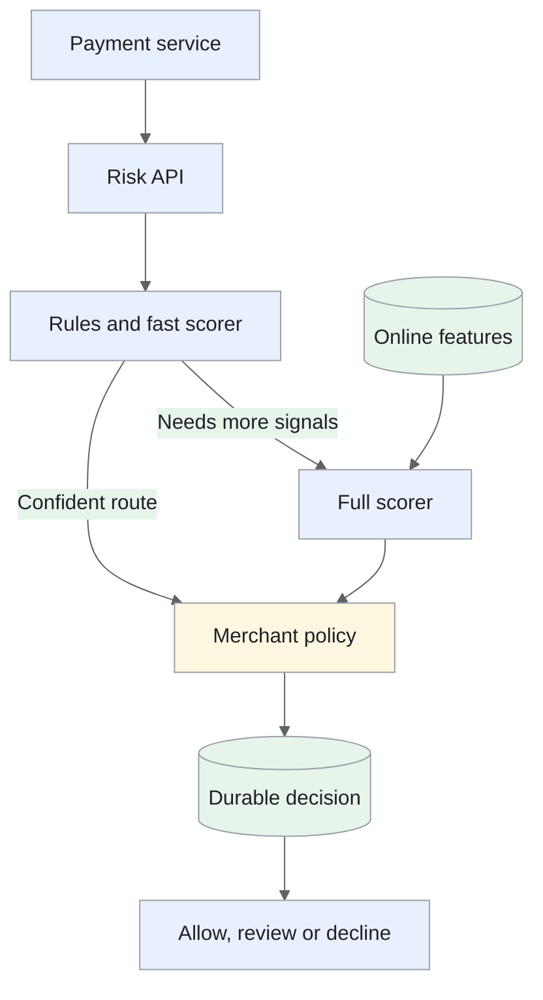
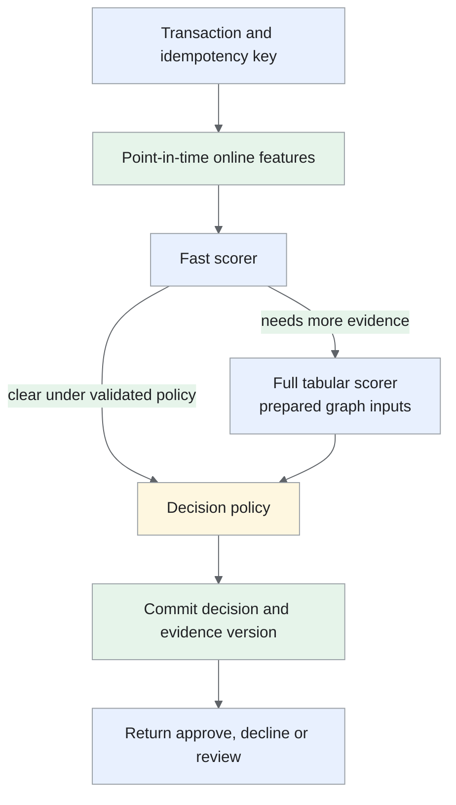

Design of a real-time fraud scorer that evaluates a payment request and returns an approval, decline or review decision.

<!--more-->

## Problem

At checkout, the service has a short time to distinguish a legitimate purchase from stolen-card use, account takeover or coordinated fraud. A missed fraudulent payment creates a financial loss; declining a legitimate payment interrupts the customer's purchase.
The scorer combines the transaction with recent activity, merchant policy and known relationships between users, devices and payment tokens. It estimates risk, then applies an explicit decision policy. [Stripe Radar](https://docs.stripe.com/radar/how-radar-works) separates model risk from the rules that determine the payment outcome.

## Requirements

### Functional requirements

- **Score a transaction.** Return approve, decline or review with a decision ID and reason codes.

- **Apply merchant policy.** Enforce merchant-specific thresholds, verified blocklists and permitted fallback actions.

- **Use recent behavior.** Include transaction velocity and available device, account and relationship signals.

- **Learn from outcomes.** Incorporate reviewed cases and confirmed fraud while retaining label provenance and revisions.

### Non-functional requirements

- **Scale:** 50M transactions/day and 2K requests/s at peak.

- **Latency:** below 30ms at p50 and 100ms at p99, including feature reads and decision persistence.

- **Availability:** 99.99%, with a merchant-approved rule-only fallback.

- **Freshness:** velocity aggregates less than one minute old; daily candidate retraining.

- **Quality:** target below 0.1% legitimate-transaction false-positive rate and at least 99% precision for automatic fraud declines. Report recall and fraud loss at that operating point.

- **Security:** use payment tokens, restrict access to device/IP data and audit decision-policy changes.

Payment authorization, settlement, tokenization and identity verification are handled by their owning services.

## Back-of-the-envelope calculations

- `50M / 86,400 ≈ 580` requests/s on average; 2K peak gives about 3.5× headroom.

- If 8% of requests need the full model, it scores about 160 requests/s at peak. That fraction is a planning assumption to measure.

- At an assumed 2KB per decision/feature snapshot, records consume about 100GB/day before replicas and later outcomes.

- A 90-day raw history contains 4.5B transactions. Training uses approved sampling and partitioned processing rather than loading the entire history into memory.

Hardware and inference budgets are determined from the full request path, including queueing and feature misses.

## Core entities

- **Transaction:** immutable inputs received for a payment attempt.

- **Decision:** the action, scores, feature snapshot and policy versions used at checkout.

- **Outcome:** later evidence, including when it became available and its provenance.

- **Model bundle:** compatible scorers, feature definitions, graph snapshot and calibrated thresholds.

```protobuf
message Transaction {
  string transaction_id;
  string merchant_id;
  string user_id;
  string payment_token;
  int64 amount_minor;
  string currency;
  Timestamp occurred_at;
}

message Decision {
  string decision_id;
  string transaction_id;
  string action; // APPROVE, DECLINE or REVIEW
  double risk;
  repeated string reason_codes;
  string model_version;
  string policy_version;
  string feature_snapshot_id;
}

message Outcome {
  string transaction_id;
  string label;
  string provenance; // Confirmed fraud, review or rule proxy
  Timestamp occurred_at;
  Timestamp available_at;
  int64 revision;
}

```

The service records missing history explicitly. A first purchase and a genuine zero-transaction count are different feature states.

## API

```yaml
POST /v1/risk/decisions:
  headers:
    Idempotency-Key: payment-attempt-123
  body:
    transaction_id: tx-123
    merchant_id: merchant-7
    amount_minor: 12500
    currency: USD
    payment_token: token-9
  response:
    decision_id: decision-123
    action: REVIEW
    reason_codes: [NEW_DEVICE, HIGH_RECENT_VELOCITY]
    model_version: risk-v12
    policy_version: merchant-policy-v4

POST /v1/risk/outcomes:
  body:
    transaction_id: tx-123
    label: confirmed_fraud
    provenance: reviewed_dispute
    revision: 2
  response: accepted

```

Retries with the same idempotency key and inputs return the saved decision. Reusing that key with different inputs returns 409. Outcome updates are deduplicated and retain earlier revisions.

## High-level design

Stream processing prepares velocity features; batch processing creates training data and graph representations. The checkout service reads those prepared signals and runs bounded inference.


```mermaid
%%{init: {'theme':'base','themeVariables':{'primaryColor':'#e8f0fe','primaryTextColor':'#202124','primaryBorderColor':'#9aa0a6','lineColor':'#5f6368','secondaryColor':'#e6f4ea','tertiaryColor':'#fef7e0','actorBkg':'#e8f0fe','actorBorder':'#9aa0a6','actorTextColor':'#202124','noteBkgColor':'#fef7e0','noteTextColor':'#202124','noteBorderColor':'#9aa0a6','signalColor':'#5f6368','signalTextColor':'#202124','labelBoxBkgColor':'#fef7e0','labelBoxBorderColor':'#9aa0a6'}}}%%
flowchart TB
    P["Payment service"] --> API["Risk API"]
    API --> FAST["Rules and fast scorer"]
    FAST -->|"Needs more signals"| FULL["Full scorer"]
    FAST -->|"Confident route"| POLICY["Merchant policy"]
    FULL --> POLICY
    F[("Online features")] --> FULL
    POLICY --> D[("Durable decision")]
    D --> OUT["Allow, review or decline"]
classDef request fill:#e8f0fe,stroke:#9aa0a6,color:#202124;
classDef data fill:#e6f4ea,stroke:#9aa0a6,color:#202124;
classDef control fill:#fef7e0,stroke:#9aa0a6,color:#202124;
class P,API,FAST,FULL,OUT request;
class F,D data;
class POLICY control;

```
## Storage

- **Decisions and policies:** partitioned [PostgreSQL](/designs/tech-postgresql/) stores immutable decisions, idempotency keys, outcome revisions and merchant policies. A decision is returned after its record commits.

- **Fresh features:** [Redis](/designs/tech-redis/) serves velocity counters and recent account/device aggregates. [Kafka](/designs/tech-kafka/) and [Flink](/designs/tech-flink/) update them with event-time windows, deduplication and explicit lateness handling.

- **Historical data:** encrypted object storage holds point-in-time feature snapshots, reviewed labels and graph edges under access/retention controls.

- **Model registry:** versioned artifacts bind feature encoding, fast/full scorers, graph snapshot, calibration and policy-compatible thresholds.

Graph embeddings are precomputed with a model such as [GraphSAGE](https://arxiv.org/abs/1706.02216). Their age and availability are features; a daily embedding represents historical relationships, while streaming counters cover recent activity.

## From request to response

### Checkout risk flow

```mermaid
%%{init: {'theme':'base','themeVariables':{'primaryColor':'#e8f0fe','primaryTextColor':'#202124','primaryBorderColor':'#9aa0a6','lineColor':'#5f6368','secondaryColor':'#e6f4ea','tertiaryColor':'#fef7e0','actorBkg':'#e8f0fe','actorBorder':'#9aa0a6','actorTextColor':'#202124','noteBkgColor':'#fef7e0','noteTextColor':'#202124','noteBorderColor':'#9aa0a6','signalColor':'#5f6368','signalTextColor':'#202124','labelBoxBkgColor':'#fef7e0','labelBoxBorderColor':'#9aa0a6'}}}%%
sequenceDiagram
  participant P as Payment service
  participant A as Risk API
  participant F as Online features
  participant M as Fast and full scorers
  participant D as Decision store
  rect rgb(232, 240, 254)
    P->>A: Transaction and idempotency key
    A->>F: Read request-time feature snapshot
    F-->>A: Features with age and availability
    A->>M: Fast scoring; full scoring when required
    M-->>A: Risk score and model version
  end
  rect rgb(254, 247, 224)
    A->>A: Apply calibrated merchant policy
    A->>D: Commit decision and evidence versions
    D-->>A: Durable result
    A-->>P: Approve, review or decline
  end

```

The payment service receives one durable decision for its idempotency key. The risk service uses features available at checkout, then stores the model and policy evidence so a delayed dispute can revise training labels without rewriting the original decision.

### Scoring a purchase

1. The Risk API authenticates the payment service, validates tokenized inputs and checks the idempotency record.

2. It loads the merchant's policy and applies explicit rules. A cheap scorer uses transaction fields and a small set of available aggregates.

3. Requests eligible for a calibrated fast decision proceed to policy evaluation. Other requests fetch richer account, device and graph-derived features.

4. LightGBM predicts risk from the prepared feature vector. The policy maps the calibrated score to approve, review or decline.

5. The service commits the decision and the feature/model/policy versions, then returns the result. The event enters the historical pipeline for later evaluation.
A full graph traversal during checkout would add unpredictable latency. The model uses materialized relationship features instead.

### Recording a delayed outcome

A reviewed dispute or investigation result arrives with its availability time and provenance. The pipeline revises the transaction's label, keeps the original decision snapshot and includes the new evidence in later training candidates.

### Handling a timeout

A feature or inference timeout selects the merchant's versioned fallback policy: for example, rule-only scoring, bounded manual review or retryable failure. The response records that mode. Review-queue limits prevent a model outage from creating an unlimited backlog.

## Deep dives

### Which model belongs in the checkout path?

Fraud inputs mix amounts, categorical identifiers, missing values and nonlinear behavior. Serving must also produce a reproducible decision quickly.

- **Rules and logistic regression:** Score explicit transaction fields and simple aggregates. Inference and explanations are inexpensive, but nonlinear interactions and coordinated relationships need richer evidence.

- **Gradient-boosted trees — recommended:** Apply LightGBM to a prepared tabular feature vector, including evaluated graph-derived inputs. Heterogeneous interactions fit a bounded CPU path; feature materialization, calibration and versioning remain dependencies.

- **Graph or transformer inference per transaction:** Process relational neighborhoods or event sequences directly at checkout. Richer evidence can help difficult cases, but traversal and inference add variable latency and larger recovery complexity.
**Use a fast baseline plus LightGBM, with graph representations as prepared inputs.** [LightGBM](https://papers.nips.cc/paper/2017/hash/6449f44a102fde848669bdd9eb6b76fa-Abstract.html) handles tabular interactions; the graph encoder is trained and published separately. Compare graph-feature lift against the tabular baseline before keeping that dependency. Checkout needs a reproducible low-latency decision on mixed tabular inputs. We accept feature-preparation work and a tested fast fallback, adding graph representations only when their measured quality gain justifies that dependency.
Fast-path thresholds require their own calibration and quality gates. Evaluate them on representative mature labels; confidence from a small model is not automatically equivalent to confidence from the full scorer.
**One transaction's synchronous decision**
Fetch the versioned account/device velocity snapshot, transaction attributes and prepared graph features in bounded batches. The fast scorer handles only cases whose exit thresholds passed an independent quality gate. Ambiguous cases use the full tree model; missing features carry explicit masks and feature age.


```mermaid
%%{init: {'theme':'base','themeVariables':{'primaryColor':'#e8f0fe','primaryTextColor':'#202124','primaryBorderColor':'#9aa0a6','lineColor':'#5f6368','secondaryColor':'#e6f4ea','tertiaryColor':'#fef7e0','actorBkg':'#e8f0fe','actorBorder':'#9aa0a6','actorTextColor':'#202124','noteBkgColor':'#fef7e0','noteTextColor':'#202124','noteBorderColor':'#9aa0a6','signalColor':'#5f6368','signalTextColor':'#202124','labelBoxBkgColor':'#fef7e0','labelBoxBorderColor':'#9aa0a6'}}}%%
flowchart TB
    T["Transaction and idempotency key"] --> F["Point-in-time online features"]
    F --> S["Fast scorer"]
    S -->|clear under validated policy| D["Decision policy"]
    S -->|needs more evidence| M["Full tabular scorer<br>prepared graph inputs"]
    M --> D
    D --> P["Commit decision and evidence version"]
    P --> R["Return approve, decline or review"]
classDef request fill:#e8f0fe,stroke:#9aa0a6,color:#202124;
classDef data fill:#e6f4ea,stroke:#9aa0a6,color:#202124;
classDef control fill:#fef7e0,stroke:#9aa0a6,color:#202124;
class T,S,M,R request;
class F,P data;
class D control;

```

Log raw/calibrated scores, exit mode, feature/model versions and selected policy. Repeating the same transaction key returns that recorded decision; a changed amount under the same key is a conflict. The decision service assesses risk, while the payment authority separately owns money movement.
Measure cascade recall as a whole. A graph model that performs well on reviewed cases cannot repair fraud wrongly approved by an earlier fast exit. Deadline failure selects the merchant's explicit fallback action and records the reason.

### How do we learn when fraud is rare?

A model that approves almost everything can have high accuracy while missing most fraud.

- **Natural-prevalence training:** Use transaction examples in their observed proportions. Distribution is representative, but many batches contain little fraud evidence and training work is dominated by easy negatives.

- **Negative sampling:** Retain fewer legitimate examples and record their inclusion rates. Training work falls, but uncorrected outputs inherit the altered prevalence and difficult legitimate cases can be lost.

- **Tuned weighting with representative calibration — recommended:** Emphasize reviewed positives or difficult examples using one controlled loss policy. Rare-event learning improves; weight tuning can overfit or damage legitimate-user precision, so calibration and release evaluation use untouched population data.

The service needs fraud recall at an explicit decline precision, not high overall accuracy. We accept careful sampling/weight tracking and independent calibration rather than stacking adjustments whose combined effect is hard to interpret.
**Record sampling rates, tune one weighting policy and calibrate on untouched representative data.** Avoid stacking large positive weights with heavily oversampled positives by default. Evaluate PR-AUC and recall at the required decline precision; report uncertainty for small cohorts.
For a simplified approve/decline policy, calibrated risk `p` and costs give:

```python
decline_threshold = false_decline_cost / (
    false_decline_cost + missed_fraud_cost
)

```

Manual review, transaction amount and merchant constraints extend that cost model. Production thresholds are versioned decisions, evaluated separately from the ranking metric.
**Thresholds need denominators and costs**
For 100K transactions with 100 confirmed fraud cases, a model approving everything has 99.9% accuracy and zero fraud recall. Use mature representative labels to measure false declines among legitimate transactions, precision among declines, and missed monetary loss separately.
If legitimate-decline cost is 1 unit and missed-fraud cost is 99 units, the simplified threshold is 0.01. That calculation assumes calibrated risk, fixed costs and two actions. Larger amounts, review cost and merchant constraints change the policy.

```text
Raw scorer → held-out calibration → amount/merchant-aware action policy
            model version          independent policy version

```

Calibrate after training/sampling on natural-prevalence data. Record sampling weights rather than treating the balanced training set as production prevalence. Pick thresholds on validation data and report interval estimates for rare fraud slices. A high score alone does not establish review precision; the validation report needs enough independently reviewed cases above the chosen threshold.

### How do delayed and selective labels affect training?

Confirmed outcomes may arrive weeks after checkout. Reviews and rules arrive sooner but reflect the current decision policy.

- **Recent proxy labels:** Learn quickly from rules or initial reviews. Adaptation is prompt, but the labels inherit the current policy's mistakes and may be revised after a dispute.

- **Mature confirmed labels:** Wait for reviewed outcomes and dispute maturity. Evidence is stronger, but model updates trail new attacks and some legitimate examples remain unlabeled.

- **Separate mature and provisional datasets — recommended:** Use mature evidence for the stable scorer and clearly weighted provisional records for candidate adaptation. This preserves provenance; multiple label states and observation windows require careful data and evaluation management.
**Train the stable scorer on mature evidence and use weighted provisional data for candidate adaptation.** Start with a 90-day observation window, then measure maturity by payment channel and dispute type. An undisputed transaction is not automatically a verified negative. Fraud outcomes mature well after checkout. We accept slower stable-model conclusions and keep provisional evidence visibly distinct, so a short rollout cannot be mistaken for a confirmed fraud-quality result.


```mermaid
%%{init: {'theme':'base','themeVariables':{'primaryColor':'#e8f0fe','primaryTextColor':'#202124','primaryBorderColor':'#9aa0a6','lineColor':'#5f6368','secondaryColor':'#e6f4ea','tertiaryColor':'#fef7e0','actorBkg':'#e8f0fe','actorBorder':'#9aa0a6','actorTextColor':'#202124','noteBkgColor':'#fef7e0','noteTextColor':'#202124','noteBorderColor':'#9aa0a6','signalColor':'#5f6368','signalTextColor':'#202124','labelBoxBkgColor':'#fef7e0','labelBoxBorderColor':'#9aa0a6'}}}%%
flowchart LR
    A["Checkout decision"] --> B["Review or dispute"]
    B --> C["Outcome available"]
    C --> D["Revised training label"]
classDef request fill:#e8f0fe,stroke:#9aa0a6,color:#202124;
classDef data fill:#e6f4ea,stroke:#9aa0a6,color:#202124;
classDef control fill:#fef7e0,stroke:#9aa0a6,color:#202124;
class A request;
class B,C,D data;

```

Historical features must have been available at checkout; labels must have been available by the training cutoff. Use chronological training, validation and final-test windows, with label-maturity gaps. Declined payments have different observable outcomes from approvals, so report coverage and selection bias rather than extrapolating results to unobserved populations.
**A label arrives after the decision**
Store the original decision and feature snapshot at checkout. A later dispute or investigator result appends a label revision with source, effective time and availability time. Training at cutoff T uses only revisions available by T and only examples whose maturity policy is satisfied.

```text
Day 0    decision and features captured
Day 3    provisional review result
Day 45   dispute outcome
Day 90   maturity check for the selected dataset

```

Treat this schedule as the proposed observation policy, not a universal payment-channel deadline. Measure actual delay distributions. A transaction with no dispute can remain weakly labeled rather than being silently upgraded to a reviewed legitimate example.
Declined attempts lack the same counterfactual chargeback outcome as approvals. Independent reviews can improve coverage, but do not reveal exactly what would have happened if every decline had been approved. Report evaluated population and selection method with quality estimates. Split by time and group repeated linked activity so a coordinated attack is not leaked across train and test.

### How do relationships help with cold starts?

A new user has little history but may share a device or payment token with known activity.

- **User history:** Use established account behavior and prior reviewed outcomes. Evidence is direct once it exists, but new users, cards and merchants lack sufficient history.

- **Relationship features:** Transfer context through shared device, token or graph neighborhoods. Cold-start coverage improves; legitimate shared devices and networks can create misleading associations.

- **Coverage-aware relationships with cohort priors — recommended:** Combine bounded relationship features with age/missingness and a calibrated cohort baseline. This supports sparse entities; priors can conceal small-group bias and need independent cold-start evaluation.
**Use relationship features with age, coverage and missing-value masks, then blend in observed history.** Device reuse is a signal interpreted with other evidence. Evaluate new-user, new-card and new-merchant cohorts independently; shared IP addresses alone do not establish fraud. A new account still needs a checkout decision, but one shared IP cannot establish fraud. We accept weaker initial estimates and use measured coverage to determine how much influence relational evidence receives.
Merchant priors use relevant business characteristics and are replaced gradually by measured history. Sensitive attributes and invasive fingerprinting require explicit privacy and fairness controls.
**Use a graph feature without a synchronous graph traversal**
Offline jobs construct permitted account/device/payment-token relationships and publish bounded embeddings or aggregate features. Online scoring reads the current snapshot by identity, alongside real-time velocity counters.
For a new card linked to an established device, the model can observe device age, number of recent distinct cards and whether reviewed abusive neighbors exist. A shared household device can produce a similar relationship, so the model needs the surrounding context and a missing/age mask.

```text
Historical graph snapshot → prepared relationship feature
Recent action stream       → fresh velocity feature
                                   ↓
                      combined transaction scorer

```

Cap fan-out during graph training and retain its timestamp so leakage from future relationships is prevented. New identities absent from the graph use cohort priors and current attributes. Evaluate gain and false declines by genuinely new account/card cohorts before making graph availability a required checkout dependency.

### How do we adapt and recover safely?

Attack patterns evolve, but noisy feedback can also move the decision boundary in the wrong direction.

- **Checkpointed daily retraining:** Build repeatable candidates from a stable dataset. Diagnosis and rollback are clear, but new attack labels can wait for the next release.

- **Frequent provisional candidates:** Accelerate reviewed candidate builds with newer evidence. Response improves, but immature labels increase uncertainty and still require mature follow-up evaluation.

- **Direct live parameter updates:** Change the deployed boundary as feedback arrives. Delay is small, but individual changes are harder to reproduce and delayed or poisoned feedback can produce harmful enforcement.

Use versioned candidates with offline, shadow and bounded-rollout gates. We accept release delay because checkout errors have direct customer and financial consequences; frequent provisional candidates accelerate response without replacing the mature quality anchor.
**Promote versioned candidates through offline evaluation, shadow traffic and a bounded rollout.** Mature labels establish model quality; shadow traffic checks latency, feature parity and disagreements. A short shadow window cannot establish fraud outcomes that mature weeks later.
Monitor loss rates, legitimate declines, review volume, calibration, stale features and fallback use by merchant/channel. Rollback restores a compatible model, feature encoding and threshold policy together. Velocity ingestion continues independently, and every historic decision remains reproducible.
**Separate drift response from production mutation**
Monitor feature missingness and score/action distributions immediately, but evaluate confirmed fraud quality only after labels mature. A sudden score increase can be a feature-pipeline error, a changed merchant mix or a real attack.
Shadow a candidate using the same request-time snapshots and compare decision disagreements. Review a sampled disagreement set before canarying high-impact actions. Warm its feature encoding, calibrator and threshold policy as one compatible release.
A circuit breaker can route scoring to the approved fast/fallback policy if the full model times out; every fallback decision is persisted. Rollback changes future scoring, while historical decisions and human corrections remain immutable. Track pending labels and reviewed-cohort coverage so a recent candidate is not reported as fraud-validated after only a short operational canary.
