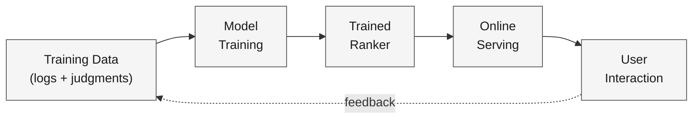
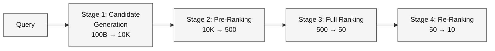
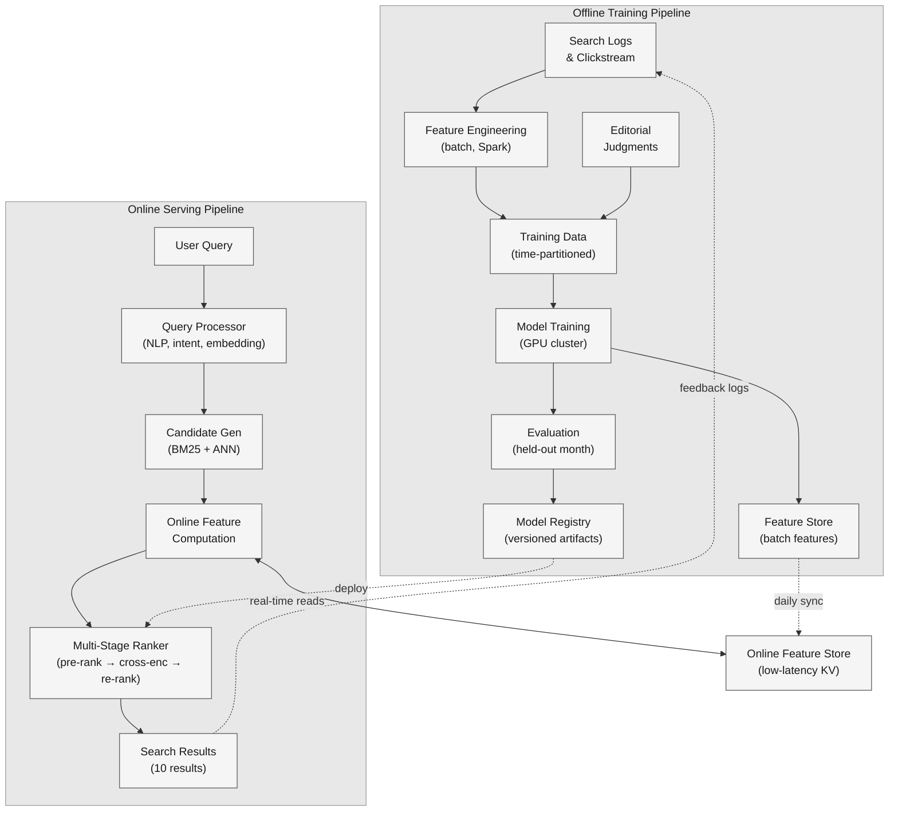

A web-scale search engine receives 40K+ queries per second and must return a ranked list of the most relevant documents from a corpus of over 100 billion pages. Users type a few words and expect the answer in the top three results — if the answer isn't there, they reformulate or leave.

<!--more-->

## 1. Problem & ML framing

A web-scale search engine receives 40K+ queries per second and must return a ranked list of the most relevant documents from a corpus of over 100 billion pages. Users type a few words and expect the answer in the top three results — if the answer isn't there, they reformulate or leave. The product goal is to minimize the time from query to task completion.

This is a **learning-to-rank (LTR)** problem. The ML task: given a query *q*, a set of candidate documents *D*, and user context *u*, produce a ranked ordering *R* where higher positions contain documents more likely to satisfy the information need. The business objective — maximize user task-completion rate and minimize query abandonment — is distinct from the ML objective: maximize nDCG@10 over logged search sessions, where each document's relevance label is derived from click-through rate, dwell time, and editorial judgments.

## 2. Requirements

**Functional**

- FR1: Return a relevance-ranked list of documents for any natural-language query.
- FR2: Support real-time indexing so newly published pages appear within minutes.
- FR3: Handle query types spanning navigational, informational, and transactional intent.
- FR4: Incorporate user-level personalization signals (location, search history, language).

**Non-functional**

- NFR1: 40K+ QPS at peak; p99 serving latency under 500 ms end-to-end.
- NFR2: Freshness: new or updated documents must be retrievable within 5 minutes of crawl.
- NFR3: 99.9% serving availability; graceful degradation when sub-systems fail.
- NFR4: Training ≤ 24 hr on current hardware; retrained weekly and on drift alerts.

*Out of scope: query spelling correction, query suggestion/autocomplete, image/video search ranking, ad placement and auction logic.*

## 3. Metrics

**Offline (model quality on held-out data)**

- **nDCG@10** — primary. Graded relevance labels (perfect=4, excellent=3, good=2, fair=1, bad=0) from editorial judgments weighted by position; nDCG penalizes a relevant document that sinks below the fold. It is the standard LTR metric because it captures graded relevance with a position-aware discount.
- **MRR** — secondary, for navigational queries. Measures the reciprocal rank of the first correct result; a query that expects exactly one destination (e.g., "gmail login") should land it at rank 1.
- **Precision@1 / Recall@10** — quick sanity checks during development.

**Online (real user impact via A-B experiment)**

- **Abandonment rate** — primary guardrail. The fraction of sessions where the user leaves without clicking any result. Drops when ranking improves.
- **CTR@3** — click-through rate in the top three positions. Sensitive to relevance but also to position bias; interpret alongside dwell time.
- **Long-click rate** — fraction of clicks followed by ≥30 s on the destination page, a proxy for task satisfaction. Moves in the opposite direction from reformulation rate.
- **Query reformulation rate** — when a user modifies their query within the same session, the initial ranking probably failed.

Every offline metric maps to an online counterpart: nDCG@10 gains should lift CTR@3 and long-click rate while driving abandonment and reformulation down. If an offline win doesn't move the online metrics, the offline eval is measuring the wrong thing.

## 4. Data

**Sources**

- **Search logs:** every query, the full ranked list returned, which results were clicked, dwell time on the landing page, and any subsequent query reformulation. ~5 billion query-document pairs per day.
- **Clickstream:** post-click behavior — scroll depth, time on page, return-to-SERP rate — joined to search logs by session ID.
- **Editorial judgments:** human raters label query-document pairs on a 0–4 graded relevance scale, sampled to cover head queries (top 10M queries by volume) and a stratified sample of torso/tail queries. ~500K labeled pairs per quarter.
- **Document corpus:** crawled web pages, parsed to extract title, body text, structured data, inbound anchor text, and PageRank-like authority scores.

**Labeling / ground-truth strategy**

The target is a **graded relevance label (0–4)** per query-document pair. Three tiers feed the training pipeline:

1. **Editorial judgments (gold)** — ~500K pairs with high label quality, used for eval and as the anchor set.
1. **Implicit feedback (silver)** — clicks interpreted through a click model (PBM) that discounts position bias: a click at position 6 with 45 s dwell is a strong positive; a click at position 1 with a 2 s bounce is a weak positive or negative. This yields ~500M auto-labeled pairs daily.
1. **Reformulation patterns (bronze)** — when a user immediately reformulates after clicking, the original result gets a negative label for the original query.

**Class imbalance**

The vast majority of query-document pairs are irrelevant (label 0). For every relevant pair (label ≥ 2), there are roughly 10,000 irrelevant pairs. Training handles this with hard-negative mining: during each epoch, the top-*k* highest-scoring irrelevant documents from the current model are included as negatives alongside all positives, creating batches where 30–50% of examples are positive.

**Train / val / test splits**

Time-based: train on months 1–10, validate on month 11, test on month 12. Random splits leak temporal patterns and overestimate real-world performance. Test set is held out for final evaluation only and never used during model selection.

**Scale**

- 5B query-document impressions/day; ~500M with implicit labels after click-model filtering
- 500K editorial labels/quarter (gold set)
- Feature dimension: ~2K features per query-document pair; embedding sizes ~128–768 dims
- Training corpus: ~100B documents indexed; candidate pool per query: ~10K after retrieval

## 5. Features

**Query features**

- Tokenized and sub-word query embeddings from a frozen BERT encoder (768-dim, mean-pooled).
- Query length, language detection, entity mentions (NER-tagged spans).
- Query intent class (navigational / informational / transactional) from a lightweight classifier.

**Document features**

- Document-level embedding from the same frozen encoder (mean-pool over title + first 512 tokens).
- Static quality signals: PageRank, spam score, number of inbound links, domain authority.
- Document metadata: language, content type (article / product page / forum), publication date.

**Query-document interaction features**

- BM25 score and its components (TF, IDF, document-length-normalized term frequency).
- Cosine similarity between query and document embeddings.
- Exact-match and bigram-overlap counts for title, headings, and anchor text.
- Click-model-derived features: historical CTR for this query-document pair, smoothed with Bayesian shrinkage for sparse pairs.

**User context and behavioral features**

- Geographic region (country/state granularity), device type, time of day.
- Short-term session features: previous queries in this session, documents already clicked.
- Long-term: topic affinities from a 90-day search history aggregated into a lightweight user embedding.

**Freshness signals**

- Document age in hours since first crawl; time since last content change.
- Query-level freshness intent score: queries like "election results" get a high freshness weight; "pythagorean theorem" gets near zero.

**Feature store and online/offline parity**

A shared feature store (Feast or equivalent) computes and serves features identically in training and inference. Batch features (PageRank, document embeddings) are pre-computed daily and materialized. Real-time features (query-level NLP, BM25, freshness) are computed in the serving path at query time, logged alongside the ranking result, and replayed during training to ensure the model sees exactly the same values it would at inference. This is the single most important mechanism for closing the training-serving skew gap.

## 6. Model

### Baseline: BM25 + LambdaMART

The first production checkpoint is a GBDT ranker (LambdaMART) trained on the ~2K hand-crafted features from §5. LambdaMART optimizes a listwise objective — it directly approximates the gradient of nDCG, making it a strong baseline for LTR. It scores each candidate independently, sorts by score, and returns the top-10. Training on 500M labeled pairs with 2K trees of depth 6 takes ~6 hours on a single 8-GPU node.

LambdaMART is fast (sub-millisecond per document), handles heterogeneous feature types naturally, and gives a clear feature-importance ranking for debugging. Its ceiling, however, is interaction modeling: BM25 + hand-crafted cross features cannot capture the deep semantic match between "how to fix a dripping faucet" and a document titled "Repairing a Leaky Tap."

### Multi-stage funnel

Scoring every one of 100B documents with a transformer per query would cost millions of dollars per day and blow the latency budget 100× over. The solution is a four-stage funnel that progressively narrows the candidate set:

#### Stage 1: Candidate generation (100B → 10K)

Two parallel retrieval paths combined via reciprocal rank fusion:

- **Lexical (BM25):** an inverted index over the full document corpus, sharded across hundreds of nodes. Query terms are looked up in the index, BM25 scores are computed, and the top 5K documents by lexical match are returned. Latency: ~20 ms.
- **Dense (two-tower bi-encoder + ANN):** a query encoder and a document encoder each produce a 128-dim embedding, trained with sampled softmax on click data. At serving time, the query embedding is computed once (~5 ms), then approximate nearest neighbor search (ScaNN or HNSW) retrieves the 5K documents with the highest cosine similarity from a pre-built index over all document embeddings. Latency: ~15 ms, index rebuilt every 4 hours.

The 10K fused candidates cover both exact lexical matches ("error code 0x80070005") and semantic matches ("Windows update failed access denied"). Total stage-1 latency: ~35 ms.

#### Stage 2: Pre-ranking (10K → 500)

A distilled lightweight model — a 3-layer transformer student (6M parameters) trained via knowledge distillation from the stage-3 cross-encoder teacher — scores all 10K candidates. The student takes query and document title+snippet as input, runs in ~10 ms on a single GPU with batch inference (10K documents batched together), and returns the top 500 by score. It recovers ~90% of the teacher's nDCG at 1/50th the cost.

#### Stage 3: Full ranking (500 → 50)

A BERT-base cross-encoder (110M parameters) takes the full query concatenated with the document title + first 512 tokens as input and outputs a single relevance score. Cross-attention between query and document tokens captures nuanced semantic relationships — negation handling ("restaurants open on Sunday *except* brunch"), entity disambiguation, and implicit intent. Inference on 500 documents at batch-size 32 takes ~150 ms on a GPU.

The cross-encoder is trained with a **pairwise logistic loss**: for every pair of documents where one is more relevant than the other, the model must assign a higher score to the more relevant document. The loss is:

*L* = − Σ log σ(sᵢ − sⱼ)  for all pairs where relᵢ > relⱼ

where *s* is the predicted score and σ is the sigmoid. Imbalance is addressed through the batch construction in §4: hard negatives dominate the bottom half of each batch, and positives are up-weighted 5×.

#### Stage 4: Re-ranking (50 → 10)

The final 50 candidates pass through a thin re-ranking layer that applies business rules without breaking the relevance ordering:

- **Diversity:** penalize documents from the same domain beyond the first two.
- **Freshness boost:** add a time-decay multiplier for queries with high freshness intent (scored in §5), decaying with a half-life of 6 hours.
- **Demotion:** push down pages flagged by the content-quality classifier (spam score > 0.8, thin content).
- **Personalization:** a lightweight user-document affinity score (dot product of user embedding and document embedding) added as a small bias term, weighted by the confidence of the user's topic model.

Re-ranking runs on CPU in ~2 ms and produces the final 10 results served to the user.

**Model choice tradeoff:** a single cross-encoder scoring everything end-to-end would produce better relevance than the funnel, but at 40K QPS and ~100B documents, the cost is ~$2M/day in GPU hours and the latency is measured in seconds. The funnel is the pragmatic choice: 90%+ of the quality at 1% of the cost.

## 7. Architecture

#### Offline training pipeline

**Components:** Apache Spark cluster (data processing), GPU training cluster (8× A100 nodes), Feast feature store, MLflow model registry.

**Flow:**

1. **Data ingestion.** Search logs and clickstream are landed in a data lake (Parquet on object storage), partitioned by hour. A daily Spark job joins sessions, applies the click model to derive implicit labels, and merges with editorial judgments.
1. **Feature engineering.** Batch features (document embeddings, PageRank, domain authority, historical CTR aggregates) are computed daily on Spark, validated against the online feature schema, and pushed to the feature store. The same Spark job materializes training examples: query, candidate documents, features, and labels.
1. **Training.** The cross-encoder trains on the prior 10 months of data with pairwise logistic loss, using 8× A100 GPUs, mixed precision, gradient accumulation to simulate larger batches, and hard-negative mining refreshed at the start of each epoch. A full training run takes ~18 hours.
1. **Evaluation.** The trained model is scored against the held-out month (month 11) on nDCG@10 and MRR. If it underperforms the production model by >1% on any metric, training is re-run with adjusted hyperparameters. If it beats or ties, it advances to the registry.
1. **Model registry.** The winning checkpoint is registered in MLflow with metadata (training date, data window, nDCG@10, MRR). The registry triggers a shadow deployment: the new model runs alongside production, logging predictions without affecting the live SERP.

#### Online serving pipeline

**Components:** load-balanced query frontend (NGINX), query processor service, candidate generation service (sharded index + ANN), feature server (Redis-backed, Feast online store), ranking service (GPU-backed inference), re-ranking service (CPU, business rules engine).

**Flow:**

1. **Query arrives.** The frontend routes the query to a query processor which tokenizes, detects language, classifies intent, and computes the query embedding — all in under 10 ms.
1. **Candidate generation.** Two parallel calls: BM25 over the sharded inverted index and ANN over the dense embedding index. Results are fused (RRF) into 10K candidates. Total: ~35 ms.
1. **Feature computation.** For each of the 10K candidates, the feature server fetches pre-computed batch features (document embedding, PageRank) from Redis and computes real-time features (BM25, cosine similarity, freshness score). The feature server enforces the same computation path used in training: ~15 ms.
1. **Multi-stage ranking.** The pre-ranker (distilled student) scores 10K → 500 (~10 ms), the cross-encoder scores 500 → 50 (~150 ms), the re-ranker applies diversity and freshness rules to produce the final 10 (~2 ms). Total ranking: ~165 ms.
1. **Response.** The 10 results are returned with titles, snippets, and URLs. Total end-to-end: ~250 ms at p50, ~450 ms at p99 — within the 500 ms budget.

**Feedback loop.** Every query, ranked list, user clicks, and dwell times are logged to the data lake. A daily pipeline joins clicks back to the served ranking, applies the click model to derive relevance labels, and appends to the training corpus. This closes the loop: today's traffic becomes tomorrow's training data.

**Serving scale.** 40K QPS peak. Candidate gen is scaled horizontally (100+ index shards). Ranking runs on a GPU fleet of ~200 nodes, each handling 200 QPS with batch inference. The feature store (Redis cluster) serves 40M+ key lookups/second with p99 latency under 1 ms.

**Design consideration:** the feature store is the linchpin of training-serving parity. Every feature — whether batch-computed (PageRank) or real-time (BM25) — has a single canonical definition executed in both pipelines. When a feature definition changes, the new version is logged during shadow deployment and validated before promotion.

## 8. Deep dives

### DD1: Position bias

**Problem.** Users click results at position 1 far more often than position 10, even when the lower-ranked result is objectively more relevant. Training on raw clicks teaches the model that "top position = relevant" rather than learning actual relevance signals, creating a self-reinforcing feedback loop where the model entrenches its own biases.

**Approach 1: Inverse Propensity Weighting (IPW).**

Each training example is weighted by the inverse of its propensity to be observed: a click at position 10 carrying 60 s dwell time gets a much higher weight than the same click at position 1, because most users never scroll to position 10. Propensities are estimated by randomizing a small fraction (~1%) of search results — swapping positions 1 and 2, or inserting a random result at position 3 — and measuring the click-through rate at each position independently of relevance.

**Challenges:** propensities must be re-estimated periodically as user behavior changes (mobile vs desktop, UI redesigns). The randomization traffic produces a measurable but acceptable degradation for affected users.

**Approach 2: Position bias model (PBM) as a click model.**

Rather than weighting examples, model the click probability as:

*P(click \| relevance, position) = α_position × P(exam \| position) × P(click \| exam, relevance)*

where *α_position* is the position-specific examination probability learned from the randomization data. During training, the loss is computed against the inferred relevance rather than the raw click. At inference, position features are zeroed out so the model scores on relevance alone.

**Challenges:** the PBM assumes examination depends only on position, not on the attractiveness of surrounding results (a flashy result at position 1 draws attention away from position 2). More sophisticated models (UBM, click-chain) relax this assumption but add complexity.

**Approach 3: Result randomization during training.**

Add a controlled randomization step: for each training query, randomly shuffle the top-10 results before logging clicks. This breaks the position-relevance correlation in the training data, forcing the model to learn from content signals alone. After training, position features are removed from the serving model.

**Challenges:** randomization degrades the search experience for training-data users, so it runs on a small holdout set (0.5% of traffic). The small sample may not cover tail queries.

**Decision → Rationale.** Combine approaches 1 and 2. IPW provides a simple, proven correction for batch training — it's what the LambdaMART baseline uses and is well-understood. For the neural ranker, a PBM click model is fit on the 1% randomization traffic and used to generate debiased relevance labels. Position features are excluded from the neural model's input entirely. The randomization data is refreshed monthly to track shifting user behavior.

> [!TIP]
> **Key insight:** Position bias correction must happen at *training time* (via weighted loss or debiased labels), not as a post-hoc re-rank fix. If the model learns that position correlates with relevance during training, it will bake that correlation into its scores, and no serving-time adjustment can fully undo it.

### DD2: Training-serving skew

**Problem.** Features computed during training (from logged data) differ from features computed during serving (from live signals), causing the model to make predictions on a different distribution than it was trained on. In search ranking, the most common skews are: (a) real-time features (BM25, query embedding) are re-computed at serving time with slight numerical differences from the logged version; (b) aggregated features (historical CTR) are stale by the time they reach the training pipeline; (c) the candidate generation stage changes independently of the ranker, so the ranker sees a different distribution of candidates.

**Approach 1: Feature logging and replay.**

Every serving-time feature value is logged alongside the prediction. During training, the feature engineering pipeline replays these logged values rather than re-computing them. This guarantees that the model trains on exactly the values it saw at inference time. The cost is storage: 2K features × 5B impressions/day × 4 bytes = 40 TB/day of raw feature logs, compressed to ~8 TB with columnar encoding.

**Approach 2: Feature store as canonical source.**

All features — batch and real-time — are computed through the feature store's single canonical implementation. The training pipeline calls the same `get_online_features()` API as the serving path, but against a time-travel-enabled offline store that can replay feature values as of any past timestamp. This avoids the storage overhead of Approach 1 but requires the feature store to support point-in-time correctness.

**Challenges:** maintaining exact numerical parity between online (Redis, float32) and offline (Parquet, float64) representations. Even a 1e-7 difference in a BM25 score can shift ranking when candidates are tightly clustered.

**Approach 3: Distribution monitoring and automated retraining.**

A data-quality pipeline computes the distribution of each feature in the logged serving data and compares it to the training data distribution using the Kolmogorov-Smirnov test (p < 0.01 triggers an alert). Drift on more than 5% of features triggers an automatic retraining job that pulls the latest logged data and retrains the model. This doesn't prevent skew but detects and corrects it quickly.

**Decision → Rationale.** Use Approach 2 (canonical feature store with point-in-time correctness) as the primary defense, augmented by Approach 3 (drift monitoring). Feature logging (Approach 1) is the fallback for features that can't be made time-travel-compatible — specifically, features derived from third-party APIs that don't expose historical state. The drift detector runs hourly and triggers retraining when skew exceeds threshold, closing the feedback loop within 24 hours.

> [!TIP]
> **Key insight:** Training-serving skew is not a binary "we have it" or "we don't" — it's a continuous distribution gap that widens as the system evolves. The feature store buys parity at a point in time; the drift monitor tells you when parity has broken.

### DD3: Knowledge distillation for latency

**Problem.** The BERT cross-encoder (110M parameters, ~150 ms for 500 documents) delivers the best relevance but is too slow for pre-ranking 10K candidates or for serving in regions with strict latency budgets. Running the cross-encoder on all 10K candidates would cost ~3 seconds per query and require 15× more GPU capacity.

**Approach 1: Score distillation (teacher → student).**

Train a small student model (3-layer transformer, 6M parameters) to predict the teacher's relevance scores. The teacher scores a large corpus of query-document pairs offline, producing a dataset of (query, document, teacher_score) triples. The student is trained with MSE loss against the teacher scores. This works well — the student recovers ~90% of the teacher's nDCG — but the student can only mimic the teacher's outputs, not its ranking behavior.

**Approach 2: Rank distillation (top-*k* list matching).**

Instead of matching scores, train the student to reproduce the teacher's ranking order. For each query, the teacher ranks 500 candidates; the student is trained with ListNet or ListMLE loss to produce the same ordering. This captures the *relative* preferences the teacher learned — that document A should outrank B, not just that both should get similar scores — and typically outperforms score distillation by 2–3 nDCG points.

**Challenges:** rank distillation is computationally expensive because it requires the teacher to score a full candidate set per query during training data generation. The teacher's inference cost dominates the training budget.

**Approach 3: Layer-wise distillation with attention transfer.**

Distill not just the output but intermediate representations: the student's attention maps are trained to match the teacher's attention maps via an auxiliary KL-divergence loss. The student learns *how* the teacher attends to query-document interactions, not just what it scores. This is most effective when the student and teacher share the same tokenizer and vocabulary, and it works best as a fine-tuning step on top of score or rank distillation.

**Decision → Rationale.** Use rank distillation (Approach 2) as the primary method, with score distillation as the warm-start. The teacher scores 500 candidates per query over a corpus of 100M queries (50B pairs), generating a distillation dataset that takes ~48 GPU-hours. The student is trained with ListMLE loss against the teacher's ranking, achieving 92% of the teacher's nDCG@10 while running in 10 ms vs 150 ms. Layer-wise distillation (Approach 3) is applied as a fine-tuning step for the top 5 languages by query volume, where the additional 1–2 nDCG points justify the engineering effort.

> [!TIP]
> **Key insight:** Distillation is not just a compression technique — it's a *deployment enabler*. Without it, the cross-encoder could only score the top 100–200 candidates and the retrieval stage would have to be much more precise. Distillation lets the pre-ranker cover 10K candidates with near-cross-encoder quality, which in turn means the retrieval stage can be higher-recall and less precise — shifting the quality burden to where the model can best handle it.

### DD4: Freshness vs relevance

**Problem.** Some queries demand fresh results (breaking news, live sports scores, stock prices), while others need authoritative, time-tested content (historical facts, medical information, mathematical proofs). A search engine that treats all queries the same will either serve stale news or bury definitive references under recent but shallow blog posts.

**Approach 1: Query-dependent freshness decay.**

A query classifier assigns a freshness intent score *f(q)* ∈ [0, 1] to each query. For queries with *f(q)* > 0.7, a time-decay multiplier is applied during re-ranking: *boost = e^(−λ · age)* where λ is calibrated so that a 6-hour-old document gets half the boost of a fresh one. For queries with *f(q)* < 0.3, no freshness boost is applied. The classifier is trained on editorial judgments that label queries by their temporal sensitivity.

**Approach 2: Freshness as a learned feature.**

Rather than hard-coding a decay function, feed document age and query freshness intent as features into the ranking model and let it learn the interaction. The model can discover nuanced patterns: "Olympics 2024" needs fresh results in July 2024 but historical results in 2026; "COVID symptoms" needed daily freshness in March 2020 but needs stable medical consensus in 2026.

**Challenges:** the model needs enough training examples for each query-age combination to learn the interaction reliably. Tail queries with high freshness intent may not have enough data.

**Approach 3: Incremental indexing with real-time ranking.**

For ultra-fresh content, maintain a separate "real-time index" of documents crawled in the last hour, indexed within seconds of crawl. Candidate generation queries both the main (batch) index and the real-time index, merging results. The real-time index is small (~0.1% of the corpus) so it can be re-ranked with a lightweight model. Freshness is structural: new content has a dedicated pipeline rather than a scoring tweak.

**Decision → Rationale.** Use Approach 1 (query-dependent decay) as the primary mechanism, with Approach 2 (learned freshness) running in the cross-encoder for head queries where enough data exists. Approach 3 (real-time index) is reserved for breaking-news queries that match explicit news intent. The query freshness classifier is re-trained weekly as temporal patterns shift — for example, a new event calendar entry changes "election results" from low-freshness to high-freshness on a specific date.

**Monitoring.** A continual-learning loop tracks the distribution of document ages in the top-10 results for freshness-sensitive queries. If the median document age drifts above 24 hours for queries with *f(q)* > 0.8, the freshness decay parameter λ is tightened automatically and the change is shadow-deployed before promotion. This is the drift loop from DD2 applied to a specific feature — freshness decay is treated as a tunable parameter rather than a static constant.

> [!TIP]
> **Key insight:** Freshness isn't a single global setting — it's a query-level parameter that itself drifts over time. A freshness model trained in January will be wrong by November as news cycles, seasonal patterns, and user expectations shift. Treating the freshness decay function as a monitored, auto-tuned parameter turns a static heuristic into a living system.

## 9. References

1. [From RankNet to LambdaRank to LambdaMART: An Overview — Burges (Microsoft Research, 2010)](https://www.microsoft.com/en-us/research/publication/from-ranknet-to-lambdarank-to-lambdamart-an-overview/)
1. [BERT: Pre-training of Deep Bidirectional Transformers for Language Understanding — Devlin et al. (Google, 2019)](https://arxiv.org/abs/1810.04805)
1. [Passage Re-ranking with BERT — Nogueira & Cho (NYU/Google, 2019)](https://arxiv.org/abs/1901.04085)
1. [Dense Passage Retrieval for Open-Domain Question Answering — Karpukhin et al. (Facebook AI, 2020)](https://arxiv.org/abs/2004.04906)
1. [ScaNN: Efficient Vector Similarity Search — Guo et al. (Google, ICML 2020)](https://arxiv.org/abs/2112.05927)
1. [Efficient and robust approximate nearest neighbor search using Hierarchical Navigable Small World graphs — Malkov & Yashunin (2018)](https://arxiv.org/abs/1603.09320)
1. [Position Bias Estimation for Unbiased Learning to Rank in Personal Search — Wang et al. (Google, WSDM 2018)](https://research.google/pubs/pub47017/)
1. [Unbiased Learning to Rank: Theory and Practice — Ai et al. (2018)](https://arxiv.org/abs/1811.03883)
1. [Distilling the Knowledge in a Neural Network — Hinton et al. (Google, 2014)](https://arxiv.org/abs/1503.02531)
1. [Applying Deep Learning to Airbnb Search — Haldar et al. (Airbnb, KDD 2019)](https://arxiv.org/abs/1810.09591)
1. [Improving Search Relevance at Indeed with Learned Ranking Functions — Indeed Engineering Blog (2020)](https://engineering.indeedblog.com/blog/2020/09/improving-search-relevance/)
1. [Feast: Feature Store for Machine Learning — Tecton / open-source](https://docs.feast.dev/)
