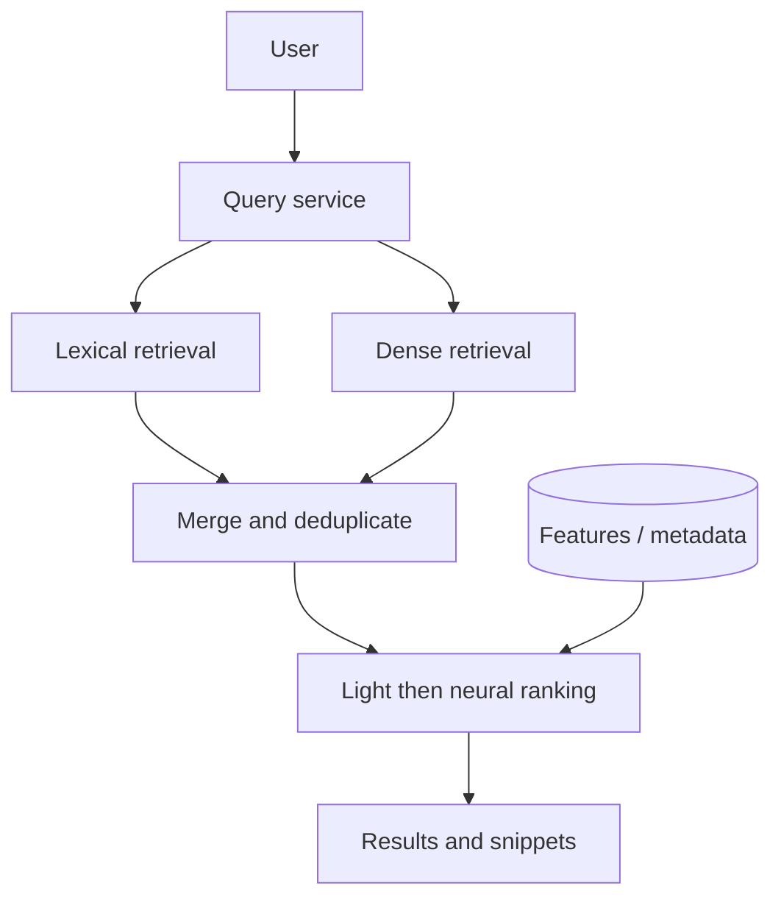
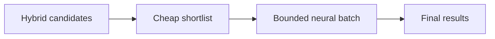
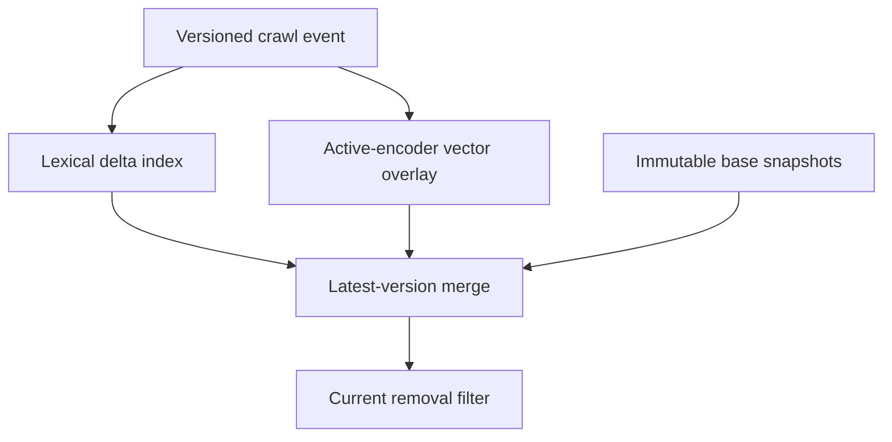

Design of a web search service that retrieves relevant pages and ranks the results for a user's query.

<!--more-->

## Problem

A user enters a query to find a page, answer a question or research a topic. The search service retrieves matching documents and returns a ranked list with titles, URLs and snippets.

The index contains far more documents than a request can score individually. Retrieval must preserve useful results while narrowing the candidate set; ranking then spends more computation on the strongest matches. New pages and updated documents also need to become searchable promptly.

## Requirements

### Functional requirements

- **Search the web:** return relevant pages for a text query, with pagination and snippets.
- **Recognize query intent:** handle exact-site queries, factual questions and broader topic searches.
- **Use relevant context:** apply language and permitted location preferences; support an unpersonalized mode.
- **Refresh results:** incorporate newly crawled pages, edits and removals.

Spelling correction, query suggestions, image/video search and advertising are separate services.

### Non-functional requirements

- **Scale:** assume 100B indexed pages and a peak of 40K search requests/s.
- **Latency:** target p99 below 500ms for a results page.
- **Availability:** target 99.9%, with lexical results available during neural-ranking failures.
- **Freshness:** make an accepted crawl update searchable within five minutes. Coverage depends on crawl scheduling.
- **Quality:** improve judged NDCG@10 and retrieval recall while preserving navigation-query success and language coverage.
- **Privacy:** separate public query caching from user-specific results; restrict and expire identifiable search logs.

## Back-of-the-envelope calculations

- Assume 500M queries/day: `500M / 86,400 ≈ 5.8K requests/s` on average; 40K/s is roughly a sevenfold peak.
- Ten displayed results per query produce up to 5B result impressions/day.
- A 128-dimensional float32 vector requires 512 bytes; 100B document vectors require about 51TB before replicas and index overhead.
- Proposed candidate budgets: roughly 10K retrieved documents → 500 cheaply ranked → 50 neural-ranked → ten returned. Measure recall and latency at each boundary.

## Core entities

- **Document:** a crawl-derived page version, including its URL, text, language and eligibility.
- **Query:** the user's text and permitted request context.
- **Search impression:** the result IDs and positions actually displayed under a particular serving bundle.
- **Serving bundle:** compatible retrieval encoders, index generations, feature definitions and ranking models.

```protobuf
message Document {
  string document_id;
  string canonical_url;
  string title;
  string text_ref; // Object-storage reference
  string language;
  Timestamp crawled_at;
  string content_version;
}

message SearchImpression {
  string request_id;
  string query_ref; // Restricted log, with retention limits
  repeated string document_ids; // Display order
  string bundle_version;
  Timestamp served_at;
}

message ServingBundle {
  string bundle_version;
  string lexical_index_version;
  string dense_index_version;
  string encoder_version;
  string ranker_version;
}
```

Document updates replace an indexed version; deletions retain a tombstone until every serving replica has applied it.

## API

```yaml
GET /v1/search:
  query:
    q: "postgres unique constraint"
    language: en
    cursor: opaque continuation
  response:
    request_id: search-123
    results:
      - document_id: doc-7
        title: "Constraints"
        url: "https://www.postgresql.org/docs/current/ddl-constraints.html"
        snippet: "A unique constraint..."
    next_cursor: opaque continuation
    degraded: false

POST /v1/search-events:
  body:
    event_id: event-123
    request_id: search-123
    document_id: doc-7
    action: click
```

The cursor includes the query/context hash and index generation. A materially changed query starts a new search; feedback ingestion deduplicates retries by `event_id`.

## High-level design

The query service searches lexical and vector indexes in parallel, merges their candidates and applies progressively richer ranking. Crawling and training publish new data and model versions separately.


```mermaid
flowchart TB
    U["User"] --> Q["Query service"]
    Q --> L["Lexical retrieval"]
    Q --> V["Dense retrieval"]
    L --> M["Merge and deduplicate"]
    V --> M
    M --> R["Light then neural ranking"]
    R --> O["Results and snippets"]
    F[("Features / metadata")] --> R
```

## Storage

- **Lucene-based lexical index:** store token posting lists and document fields for BM25 retrieval. Partition documents across shards and merge each shard's top results.
- **ANN vector index:** use sharded ScaNN or HNSW for dense retrieval. The query encoder and indexed document embeddings belong to the same bundle; publish a compatible snapshot before switching traffic.
- **Document metadata store:** use a partitioned key-value store such as Bigtable for document/version lookups. Keep crawled text and immutable training snapshots in object storage.
- **Redis:** cache public query results and recent feature aggregates. Keys include language, index generation and ranking policy; personalized results need separate keys and access controls.
- **Kafka and Parquet:** retain crawl changes and displayed-result events for replay and training. Registry metadata and rollout state fit a transactional PostgreSQL database.

The index is derived from versioned crawl records. Replay rebuilds a lost shard; tombstones prevent removed pages from reappearing during recovery.

## From request to response

### Running a search

1. Validate query length and context, assign a request ID and pin a serving bundle. Normalize text using that bundle's tokenizer and language rules.
2. Search the lexical index for exact terms and the vector index for semantic matches. Merge by document ID using reciprocal-rank fusion, which combines ranks without assuming the two score scales are comparable.
3. Load features in batches: text-match scores, document quality, language match, crawl age and permitted context. A cheap LambdaMART ranker reduces the candidate set.
4. Apply a cross-encoder to the remaining shortlist. It reads query and document text together, so this stage is more expensive than a precomputed vector lookup.
5. Apply eligibility, duplicate-page and diversity rules, generate snippets from the matching document version, then return the first page.
6. Record displayed IDs, positions and versions. Associate later clicks and reformulations with the request; logging has bounded buffering and explicit loss metrics.

Each shard and ranking stage has a deadline. A slow dense shard yields lexical candidates; a slow cross-encoder uses the light-ranker order. Repeatedly increasing candidate counts increases recall but also raises feature-read and inference cost.

### Applying a crawl update

The ingestion worker validates the document, records its new version and publishes an indexing event. Lexical and dense consumers update their indexes and report watermarks. A deletion produces an eligibility tombstone before replicas remove the physical index entries. Freshness monitoring measures the time from accepted crawl event to searchable version.

## Deep dives

### How should lexical and semantic retrieval work together?

Exact matching is important for product names, identifiers and navigation queries. Semantic retrieval helps when the user and document express the same idea with different words.

- **Lexical only:** efficient and strong for exact terms, but sensitive to vocabulary mismatch.
- **Dense only:** captures semantic similarity, but can lose exact entities and rare phrases.
- **Hybrid retrieval — recommended:** retrieve from both, deduplicate and combine rankings, then let the downstream model evaluate the merged set.

[DPR](https://arxiv.org/abs/2004.04906) demonstrates separately encoded query and passage retrieval. For this design, train the query/document encoders on relevant pairs with in-batch and mined negatives; keep unknown relevance separate from judged irrelevance. Sampling correction matters when popular documents dominate the batches.

Measure candidate recall using held-out judgments before tuning the final ranker. A relevant page excluded at retrieval cannot be recovered by later ranking. Shard timeouts and language-specific recall are separate evaluation slices.

**Merge two retrieval paths without mixing incomparable scores**

Run lexical and dense retrieval in parallel with a shared deadline. Lexical search matches token postings and rare identifiers; dense retrieval embeds the query and finds nearby document vectors in the compatible index. Deduplicate document/version IDs before scoring.

BM25 values and vector similarities have different scales. Use a validated fusion method such as reciprocal rank fusion for the first merged shortlist, or learn source-specific calibrated features in the light ranker. Raw addition is not a meaningful default.

```python
# Illustrative reciprocal rank fusion over source ranks.
score[doc] = sum(1 / (constant + rank)
                 for rank in ranks_from_available_sources(doc))
```

A navigation query like a product serial number may rely primarily on exact terms, while a paraphrased question benefits from dense candidates. Evaluate those intents independently. Track retrieval recall against judged relevant pages and record when one source times out; an apparently successful result can still have degraded recall.

Current removal/access filters apply before return even if an older index still retrieves the document. Versioned IDs prevent deduplication from selecting an obsolete passage.

### Where should expensive ranking happen?

A cross-encoder evaluates query/document interactions directly, but doing that for every retrieved candidate makes inference dominate latency.

- **Feature-based ranker throughout:** low serving cost and transparent signals; limited text understanding.
- **Cross-encoder over all candidates:** richer matching, with high compute and queueing cost.
- **Cascade — recommended:** use LambdaMART or a distilled student for the broad shortlist, then a cross-encoder for a bounded final set.

The [LambdaMART overview](https://www.microsoft.com/en-us/research/publication/from-ranknet-to-lambdarank-to-lambdamart-an-overview/) explains ranking losses for tree-based models; [BERT passage re-ranking](https://arxiv.org/abs/1901.04085) provides the query/text interaction model.

Train a student on teacher scores or ordering while also retaining judged labels. Compare teacher/student agreement, NDCG and end-to-end latency on the actual candidate distribution. Hardware counts and batch sizes come from load tests; batch waiting, shard fan-out and queue saturation contribute to p99.


```mermaid
flowchart LR
    A["Hybrid candidates"] --> B["Cheap shortlist"]
    B --> C["Bounded neural batch"]
    C --> D["Final results"]
```

On inference timeout, reuse the shortlist's existing order. A fallback request still applies document eligibility and removal rules.

**What the cross-encoder adds**

A two-tower score compares independently encoded vectors. A cross-encoder processes the query and candidate text together, allowing token-level interactions such as negation or an exact entity mentioned in the right context. This richer operation runs only on the final bounded shortlist.

```text
Query + document features → light ranker → bounded shortlist
Query paired with each shortlisted passage → cross-encoder → final order
```

Select passages with the same versioned text pipeline used in training. Truncation needs a policy: blindly taking the first tokens can omit the matching answer deep in the page. Cache document preprocessing, batch pairs by length and cap queue wait.

Distill teacher scores for cheaper shortlist ranking, while retaining judged labels to avoid copying every teacher error. Plot final relevance versus neural candidate count on the actual hybrid-retrieval distribution. When inference exceeds its budget, the saved light-stage order becomes the fallback; annotate that mode for measurement and still hydrate current document eligibility.

### How do clicks become useful training labels?

A click reflects relevance, display position, snippet quality and user behavior. Some queries are answered directly by a snippet, so a successful search may have no click.

- **Raw click labels:** abundant, but favor previously exposed and high-position results.
- **Judged relevance:** directly measures usefulness, but is costly and covers a limited query set.
- **Combined evidence — recommended:** use human judgments for the evaluation anchor and interaction labels for training, with explicit exposure and selection-bias handling.

Record displayed positions, UI version and known exploration probabilities. Inverse-propensity weighting uses estimated examination/exposure probabilities, with clipping to control variance; the observed click rate at a position mixes exposure and relevance. Small randomized experiments help estimate these effects.

Join labels only after their observation window closes. Use request-time feature values and document versions, with time-based train/validation/test splits. Inspect ranking quality by query intent, language, document age and query frequency. Protect the final test set from model selection.

**Build a click-training example correctly**

The exposure record contains query, displayed document versions, positions, snippets, UI version and exploration policy. Join later clicks/dwell or successful reformulation to that exact request. A retrieved document that never appeared is not a displayed negative.

```text
Retrieved 200 → displayed 10 → user examines a subset → clicks or no-click success
               exposure log     partly unobserved        outcome log
```

Use judged query/document pairs as the stable evaluation anchor. A no-click can mean failure, abandonment or a useful answer in the snippet; the label policy distinguishes these where evidence supports it.

Randomized position exposure helps estimate examination effects, but rare-query support and high-variance inverse weights still require limits. Keep snippets and document versions in historical examples so today's improved snippet is not accidentally used to explain yesterday's click. Group sessions in chronological splits and leave the final test set out of candidate selection.

### How do freshness and model updates stay reliable?

A new page needs a searchable representation before its eventual popularity is known. A new encoder also changes the meaning of every vector in its index.

- **Full rebuild per update:** simple snapshots, but too slow for a five-minute freshness target.
- **Incremental updates only:** fast ingestion, with accumulated tombstones and index fragmentation.
- **Incremental ingestion plus periodic compaction — recommended:** apply updates to a delta index, query both layers and merge versions; rebuild the base periodically.

Use crawl age and query intent as ranking features. Time-sensitive queries can favor recent pages; reference queries often benefit from established sources. If a freshness adjustment is used, its half-life is query-dependent:

```python
freshness_weight = 2 ** (-age_hours / half_life_hours)
```

Validate a model/index bundle offline, shadow it on live queries, then run a controlled experiment. Track relevance, freshness, latency and fallback rate together. Rollback switches the compatible bundle as a unit while ingestion continues; malformed feature data blocks release and leaves the last healthy bundle serving.

**An index update and a model update have different clocks**

Crawling writes a versioned document event. The delta lexical index and the active encoder's vector overlay consume it, then publish searchable watermarks. The serving merger chooses the latest eligible version from base and delta layers.


```mermaid
flowchart TB
    E["Versioned crawl event"] --> L["Lexical delta index"]
    E --> V["Active-encoder vector overlay"]
    L --> M["Latest-version merge"]
    V --> M
    B["Immutable base snapshots"] --> M
    M --> F["Current removal filter"]
```

A tombstone wins over older base content and survives replay through the retention window. Compaction atomically publishes the new base generation before retiring inputs.

For an encoder release, build vectors using that encoder and warm its query tower before cutover. New-document updates during the build need a matching overlay after the snapshot watermark. Rollback restores both retrieval components, not just the ranking weights. Report freshness from observed publish watermarks and measure deleted-document propagation separately.
