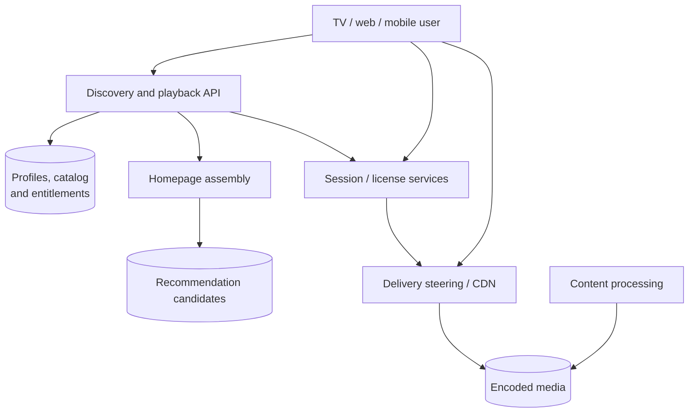
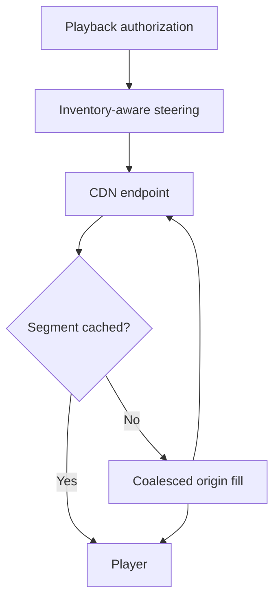

An on-demand video service for discovering titles, streaming across devices and resuming playback.

<!--more-->

## Problem

A user browses the catalog, chooses a title and starts watching. Playback should begin quickly and stay smooth as bandwidth changes. The service also needs to preserve progress across devices and enforce regional rights, profile restrictions and offline licenses.

Video delivery dominates bandwidth; account and playback APIs handle much smaller records. This design separates those paths so segment delivery can continue through the CDN while control services handle discovery, authorization and session management.

## Requirements

### Functional requirements

- **Discover titles:** personalized homepage rows and search by title, cast, genre or language.
- **Watch video:** adaptive streaming on supported devices with captions and alternate audio.
- **Resume playback:** continue from the latest accepted position across devices.
- **Manage profiles:** preferences and maturity restrictions within an account.
- **Download titles:** authorized offline playback with device-bound, expiring licenses.

### Non-functional requirements

- **Scale:** plan for 325M accounts and 65M peak concurrent streams; these are assumptions.
- **Playback:** first-frame P95 below 2s on supported broadband/device profiles; rebuffering below 0.5% of play time.
- **API latency:** homepage P99 below 200ms and playback authorization P99 below 300ms within a serving region.
- **Availability:** target 99.99% for new playback starts; regional failover preserves authorization and license policy.
- **Consistency:** strongly enforced entitlements and stream limits; ordered progress updates within a playback session.
- **Security:** encrypted media, signed delivery access, protected license keys and current maturity/rights checks.

Live streaming, ads, billing and studio workflow tools are outside this design.

## Back-of-the-envelope calculations

- **Delivery:** 65M streams × 5Mbps average = 325Tbps at peak. Peak bandwidth is not sustained monthly traffic.
- **Progress:** one heartbeat/30s across 65M streams ≈ 2.17M updates/s; batch transport and coalesce storage writes.
- **Metadata:** assuming 325M accounts × 5 sessions/day × 50 API calls gives about 940K calls/s average; size peak capacity separately.
- **Encoding:** compute budget = source hours/day × measured encoding work/hour for the selected codec ladder. File count is an output, not another multiplier if measured work already includes the ladder.

## Core entities

- **Profile** supplies preferences and maturity policy; entitlement belongs to the account.
- **Title** records catalog metadata and regional availability.
- **PlaybackSession** authorizes one device to play a title.
- **WatchProgress** stores session-ordered progress rather than the largest position ever seen.

```protobuf
message Profile {
  string profile_id;
  string account_id;
  string language;
  string maturity_policy;
}
message Title {
  string title_id;
  string name;
  repeated string genres;
  int32 runtime_seconds;
  string encoding_generation;
}
message PlaybackSession {
  string session_id;
  string profile_id;
  string title_id;
  string device_id;
  Timestamp expires_at;
}
message WatchProgress {
  string profile_id;
  string title_id;
  string session_id;
  int64 session_epoch;             // Orders replacement sessions.
  int64 sequence;                  // Orders progress within the session.
  int32 position_seconds;
  Timestamp updated_at;
}
```

DRM keys stay in the protected license service; application device records contain key references, not decryption keys.

## API

```yaml
GET /homepage:
  query: {profile_id: id}
  result: {rows: [], generated_at: timestamp}
GET /search:
  query: {profile_id: id, q: text, cursor: opaque}
GET /titles/{title_id}:
  result: {metadata: object, playback_options: []}
POST /playback/sessions:
  body: {profile_id: id, title_id: id, device_capabilities: object}
  result: {session_id: id, manifest_url: signed-url, license_token: token}
PUT /playback/sessions/{session_id}/progress:
  body: {sequence: integer, position_seconds: integer, state: playing-or-ended}
  result: {accepted_sequence: integer}
POST /downloads:
  body: {profile_id: id, title_id: id, device_id: id}
  result: {media_urls: [], offline_license_token: token, expires_at: timestamp}
```

Profile ownership, region, maturity and entitlement are checked server-side. A license token authorizes a separate DRM exchange.

## High-level design

Discovery services assemble metadata; playback services authorize a session and select delivery endpoints. The player retrieves encrypted segments directly from the CDN and obtains a device-compatible license.



## Storage

- **PostgreSQL:** accounts, profiles, rights windows and entitlement versions. Transactions/constraints protect profile ownership and entitlement changes; playback reads current policy.
- **DynamoDB:** playback sessions and progress keyed by profile/title, with conditional writes over session epoch and sequence. A separate recent-progress view supports Continue Watching; it is not an arbitrary filtered scan over all history.
- **Redis:** prepared recommendation candidates and metadata caches. Final rows apply current catalog, country and maturity policy; progress is overlaid from its fresher store.
- **Elasticsearch:** catalog text and faceted search; hydrate and recheck current rights before display/play.
- **Object storage and CDN:** encrypted renditions, manifests, artwork and source masters. Immutable generation keys prevent mixed old/new encoding outputs.
- **Event stream:** progress, quality-of-experience telemetry and content jobs. Keep short-lived operational events separate from retained watch history and privacy policy.

[Netflix's video pipeline article](https://netflixtechblog.com/rebuilding-netflix-video-processing-pipeline-with-microservices-4e5e6310e359) describes processing decomposition. The stores above are choices for this proposal, not a claim about Netflix's current deployment.

## From request to response

### Browsing and searching

The API verifies the selected profile and reads prepared candidate rows. It overlays Continue Watching from recent progress, filters current rights and maturity policy, then batch-loads metadata. Artwork loads through the CDN.

On a candidate-cache miss, assemble bounded popular/new-release rows for the region rather than running an unrestricted recommendation job. Search uses catalog text/facet indexes and the same policy filters. Richer personalization can be expensive; prepared candidates keep that work outside most page requests.

### Starting and streaming

The playback service checks entitlement, region, maturity, device capabilities and concurrent-stream policy. It atomically reserves a session lease, selects a compatible manifest and returns short-lived CDN/DRM access. The player fetches a license, manifest and first segment.

Adaptive bitrate selection uses measured throughput and buffer occupancy to choose the next compatible rendition. Endpoint failover retries a segment from another eligible CDN. Existing playback can continue only while segments, access tokens and licenses remain valid; their renewal requirements define control-plane outage tolerance.

### Saving progress

The player sends numbered heartbeats and a final update on pause/end when possible. The service accepts a higher sequence within the current session epoch and returns the accepted sequence. Retries reuse that number; older packets cannot overwrite later progress.

A new playback session obtains a newer epoch under the cross-device policy. Seeking backward is a valid new position, so using a numeric maximum would be incorrect. Lost heartbeats can increase resume drift beyond one interval during an outage; recovery exposes the last accepted progress.

### Profiles and offline downloads

Profile changes increment the policy version and invalidate prepared rows. The service reapplies current maturity restrictions whenever it returns titles or authorizes playback.

For a permitted download, it selects device-compatible encrypted files and issues an offline license bounded by rights, device binding and expiry. The device verifies that license locally; renewal requires contacting the service. Download availability and expiry are policy values, not assumed subscription-tier rules.

## Deep dives

### Which content-delivery model should we use?

**Problem:** the same title may be watched millions of times, while long-tail titles have sparse regional demand.

- **Origin only:** simplest placement, with high latency and concentrated egress.
- **Commercial CDN:** broad delivery and managed operations, priced for actual volume and contracts.
- **Owned/ISP-embedded delivery:** placement control and potential economics at sustained scale, with hardware, peering and operations costs.

**Recommendation:** use CDN delivery with inventory-aware steering and pre-position high-demand regional titles. [Open Connect](https://openconnect.netflix.com/en/) provides a concrete ISP-embedded model. Choosing owned versus commercial capacity requires measured traffic and total costs, not a universal percentage-of-internet crossover.

Steering considers health, file availability, network path and load. Keep alternate endpoints and origin capacity for misses; rollout of new encodes publishes a complete generation atomically. Monitor startup time, rebuffering, cache misses, fill traffic and cost per delivered hour.

**Steering and cache fill.** The playback API returns a manifest generation and delivery endpoints after checking rights and device capabilities. A steering service selects an endpoint that has the requested files, is healthy and has capacity on the user's network path. Selection uses file inventory as well as geographic distance: the nearest server may not hold a long-tail title.



When many users request the same missing segment, one cache-fill operation downloads it while other requests share that work. Immutable generation keys let caches retain good files without mixing encodes. Prefill predictions use regional demand and release schedules; measure the bytes transferred for files that were never played as well as miss rate. If an endpoint fails mid-playback, the player requests the same segment generation from an alternate endpoint and retains its playback buffer.

### How should encoding work be scheduled?

**Problem:** codec/resolution variants consume compute and must be consistent before a title is playable.

- **Full synchronous encoding:** simple completion semantics but long ingestion latency.
- **Independent uncoordinated jobs:** parallel work, with risk of incomplete manifests.
- **Versioned workflow:** parallel tasks with explicit dependencies and a publication gate.

**Recommendation:** use a versioned workflow: inspect source → choose ladder → encode chunks → validate → package/encrypt → publish. Tasks use deterministic output keys and retry safely. Validate codec compatibility, audio/caption alignment and representative perceptual quality.

Release manifests only when all referenced segments exist and required checks pass. Preserve the previous good generation during a failed update. Measure source-hour compute, queue age, failure rate and rendition utilization; remove little-used formats only after checking device coverage.

**A publishable encoding generation.** An ingestion job creates generation G42, records the source checksum, and expands a dependency graph of encode tasks. Each task key includes title, generation, codec, rendition and chunk number. Retries check the durable task result and verified object before repeating expensive work.

Chunking creates parallelism, but boundaries must align with independently decodable frames and a common media timeline. Validation checks that audio, captions and every rendition agree on segment timing so the player can switch bitrate without jumping in time. Encoding completion alone is insufficient: the workflow also validates packaged objects and any required key/license metadata.

The final publisher writes a manifest containing only verified objects, then conditionally updates the title's playable-generation pointer from G41 to G42. This pointer is the publication boundary. A failed task leaves G41 playable; G42 stays unpublished for retry or investigation. Garbage collection waits until old playback sessions and rollback retention no longer need G41.

### How do we keep the homepage fresh and affordable?

**Problem:** full model inference on every page is expensive, while cached rows can contain stale progress or unavailable titles.

- **Regional popularity only:** cheap and useful for new profiles, with limited personalization.
- **Full online ranking:** freshest inputs, with greater compute and dependency cost.
- **Prepared candidates plus online assembly:** cached heavier retrieval, current filters and selective reranking.

**Recommendation:** prepare profile/cohort candidates on a bounded refresh schedule and assemble rows online. Overlay progress, deduplicate titles, maintain row diversity and apply live rights/maturity policy.

If recommendations are unavailable, use authorized regional/popularity rows. Evaluate engagement and discovery quality alongside P99 latency, stale-candidate age and filter-removal rate. A cache hit is an input to assembly, not permission to show every cached title.

**Online row assembly.** A prepared list might contain 500 titles for a profile. At request time, batch-fetch availability and the profile's latest progress, discard unavailable titles, merge duplicate candidates across retrieval sources, and score only the remaining bounded set. Assemble rows with an explicit per-row objective—for example, Continue Watching uses progress while discovery rows use relevance and diversity.

A user finishing episode four should see episode five even if the recommendation cache was prepared before completion. Overlay the newer progress record rather than regenerating the whole candidate list. Rights changes similarly take effect through the current policy check.

Pin the candidate/model generation in a short-lived pagination token so row ordering stays coherent while prepared lists refresh. Reserve a response budget for catalog filtering and fallback rows. Monitor the percentage of cached candidates removed by current policy: a high rejection rate signals that preparation is too stale or that the candidate source ignores important constraints.

### How do cross-device progress and stream limits stay correct?

**Problem:** heartbeat retries arrive out of order, and two devices can start concurrently.

- **Arrival-time last-write-wins:** simple, but delayed packets may restore an older position.
- **Maximum watched position:** resists backward updates but breaks intentional seeking.
- **Session epochs and sequences:** explicitly orders accepted updates and supports cross-device policy.

**Recommendation:** assign an epoch on session creation and apply sequence-conditioned progress writes. [DynamoDB conditional expressions](https://docs.aws.amazon.com/amazondynamodb/latest/developerguide/Expressions.ConditionExpressions.html) provide the required compare-and-update mechanism within an item.

Concurrent-stream admission uses a transactional account lease registry; heartbeats renew leases and expired sessions release slots. Fence old epochs and make start retries idempotent. Test pause/end delivery, delayed packets, clock skew and region failover; avoid promising uninterrupted playback beyond token/license validity.

**Ordering progress and admitting sessions.** Within a session, accept progress only when the incoming sequence exceeds its stored sequence. Sequence 102 at minute 12 may legitimately replace sequence 101 at minute 38 after a backward seek. This is why maximum playback position is the wrong conflict rule. The epoch identifies which session is allowed to update the canonical cross-device position under the chosen handoff policy.

A start request has a stable idempotency key. In one account-scoped transaction, check active leases, create the session and reserve a slot. Two concurrent starts for the last slot therefore yield one accepted session. A retried start returns that same session rather than reserving another slot.

Heartbeats extend only the matching session/epoch lease. If renewal is lost, access lasts at most until the issued token or license expires; enforce that bound rather than claiming immediate revocation from a database lease alone. On handoff, issue a newer epoch and reject late canonical-progress updates from the old session while retaining its separate history if needed.
