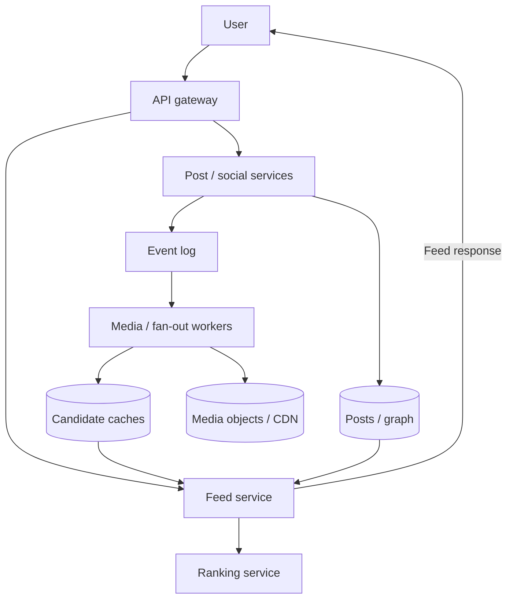
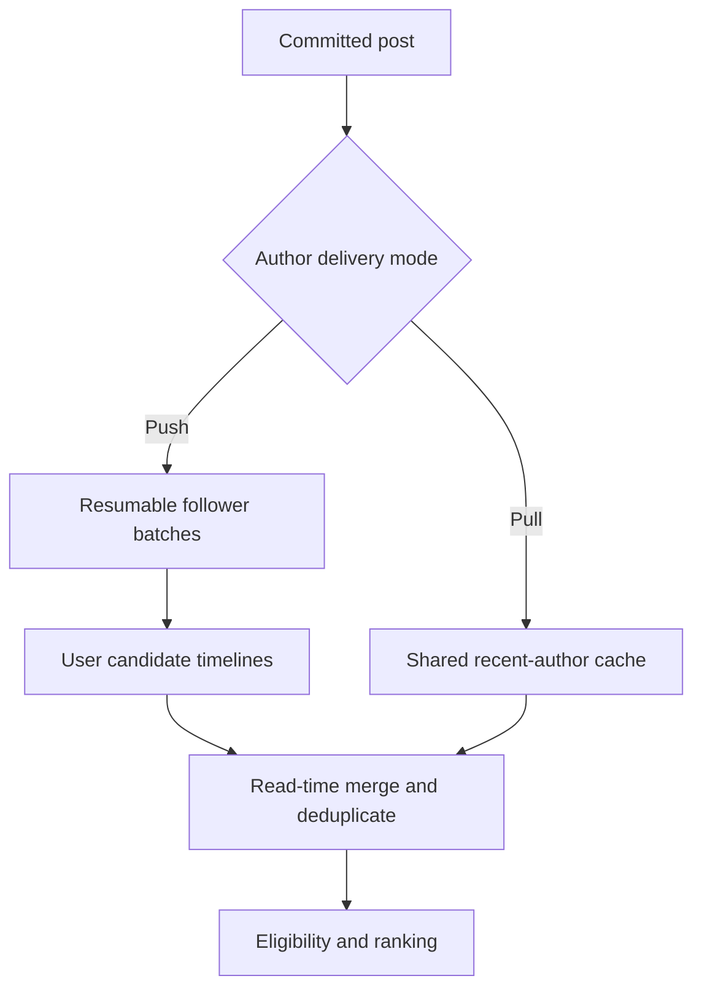
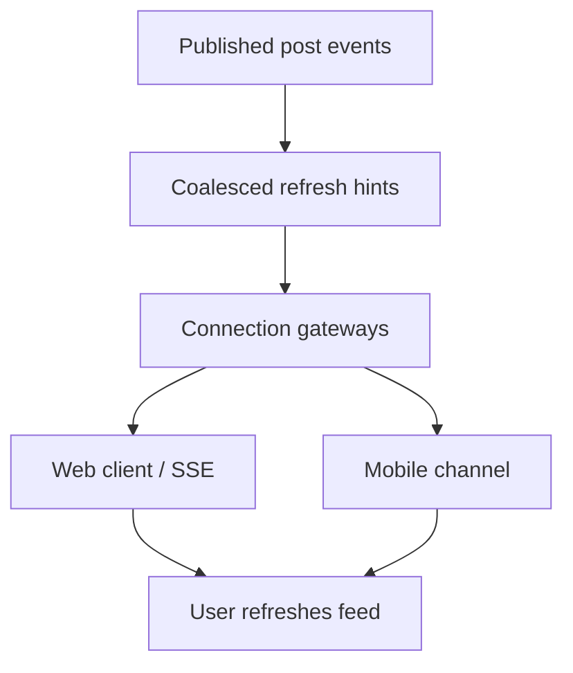

Design of a personalized social feed with post publishing, follow relationships, engagement and timely feed updates.

<!--more-->

## Problem

Users follow people and pages, publish posts and browse a feed of relevant updates. Opening the feed should return useful posts quickly, while following, unfollowing and hiding content should change what the user sees.

Most work comes from serving feeds rather than creating posts. A post from a widely followed account can also generate millions of potential deliveries. The design separates durable post storage, candidate distribution and request-time ranking so each can handle its own workload.

## Requirements

### Functional requirements

- **Publish posts:** create text, image, video and link posts; publish media once processing and moderation complete.
- **Browse a personalized feed:** rank eligible posts from followed accounts and paginate the results.
- **Manage follows:** follow or unfollow an account and update feed eligibility.
- **Engage with posts:** like, comment, share and save content.
- **See new-post updates:** show a refresh indicator while preserving the user's current reading position.
- **Control content:** hide posts, mute accounts and submit reports.

Advertising, direct messaging, live video and account registration are outside this design.

### Non-functional requirements

- **Scale:** support an example workload of 1B daily users, 500M posts/day and 700K peak feed requests/s.
- **Latency:** target feed responses below 500ms at P95, with a bounded ranking budget.
- **Freshness:** target P99 below 2 seconds from publishable post acceptance to candidate availability for ordinary accounts.
- **Availability:** target 99.9% for feed reads; serve a bounded recent feed during ranking or fan-out degradation.
- **Correctness:** enforce current post visibility, blocks, mutes and unfollows before returning a post.
- **Isolation:** bound work per author and per feed request so popular accounts cannot consume the whole distribution pipeline.
- **Security:** authenticate writes, enforce ownership and control access to private media.

## Back-of-the-envelope calculations

- **Feed requests:** assuming 12 pages/user/day, 1B × 12 / 86,400 ≈ 139K requests/s on average; a 5× burst is approximately 700K/s.
- **Post metadata:** 500M posts/day × 1KB ≈ 500GB/day, or 183TB/year before indexes and replication.
- **Media:** if the blended average is 2MB/post, uploads add approximately 1PB/day. Storage and delivery dominate cost at this assumption.
- **Candidate caches:** 500M active users × 800 post IDs × 8 bytes ≈ 3.2TB of IDs alone; scores and data-structure overhead increase memory.
- **Fan-out:** 500M posts/day × 300 average followers × 50% active ≈ 75B candidate writes/day, or 868K/s. A single 50M-follower post makes pure push particularly expensive.

These are sizing assumptions, not measurements of Facebook.

## Core entities

- **User:** a profile and its follow relationships.
- **Post:** durable content, author, visibility and media-processing state.
- **Follow:** the authoritative relationship used to decide eligibility.
- **Feed candidate:** a cached post ID for a user's future feed request.
- **Engagement:** likes, comments, shares and saves, with stable identities.
- **Content preference:** a durable hide or mute setting.

```protobuf
message Post {
  string post_id;
  string author_id;
  string text;
  repeated string media_ids;
  string visibility;
  string state; // Processing, published or removed.
  int64 version; // Orders edits and removal events.
  Timestamp created_at;
}

message Follow {
  string follower_id;
  string followee_id;
  Timestamp created_at;
}

message FeedCandidate {
  string user_id;
  string post_id;
  Timestamp published_at;
}

message Engagement {
  string engagement_id;
  string user_id;
  string post_id;
  string kind;
  string state; // Current desired state for reversible actions such as likes.
}

message ContentPreference {
  string user_id;
  string target_id;
  string kind; // Hidden post or muted account.
}

message FeedSession {
  string session_id;
  string user_id;
  repeated string ranked_post_ids;
  Timestamp expires_at;
}
```

Identifiers are opaque strings at the API boundary. Candidate caches and engagement totals are derived data; the post and relationship records remain authoritative.

## API

```yaml
POST /media/uploads:
  body: {content_type: image/jpeg, size_bytes: 2000000}
  response: {media_id: "...", upload_url: "...", expires_at: "..."}

POST /posts:
  headers: {Idempotency-Key: "..."}
  body: {text: "...", media_ids: [...], visibility: followers}
  response: {post_id: "...", state: processing}

GET /feed:
  query: {cursor: "...", limit: 20}
  response: {posts: [...], next_cursor: "...", freshness: "..."}

PUT /users/{id}/follow:
  response: 204

DELETE /users/{id}/follow:
  response: 204

PUT /posts/{id}/like:
  response: 204

POST /posts/{id}/comments:
  headers: {Idempotency-Key: "..."}
  body: {text: "..."}
  response: {comment_id: "..."}

POST /posts/{id}/share:
  response: {post_id: "..."}

PUT /posts/{id}/save:
  response: 204

PUT /posts/{id}/hide:
  response: 204

PUT /users/{id}/mute:
  response: 204

POST /posts/{id}/reports:
  body: {reason: "..."}
  response: 202

GET /feed/updates:
  response: "SSE stream of refresh hints"
```

Reversible PUT actions express the desired state and can safely repeat. Cursor tokens are signed, user-bound and expire with their ranking session.

## High-level design

Publishing writes a durable post and event. Workers prepare media and distribute candidate IDs. Feed reads combine cached candidates with recent posts from high-fan-out accounts, enforce eligibility, rank a bounded set and return a stable page.



## Storage

- **Sharded PostgreSQL:** owns users, posts, follows, preferences and engagement records. Posts are grouped by author and time; the follow table is keyed by follower and has a derived reverse view for fan-out. Same-shard transactions write domain changes and an outbox event together.
- **Redis:** stores bounded candidate timelines, post caches and ranking sessions. Timeline members are post IDs; recent publication time provides a simple candidate ordering, with personalization applied on read. A cache loss triggers a bounded rebuild.
- **Kafka:** carries committed post, relationship and engagement events. Consumers deduplicate events and honor record versions; per-key ordering does not imply a global order.
- **Object storage and CDN:** hold originals and prepared media variants. Uploads go directly to object storage through scoped signed URLs; the CDN serves permitted published variants.
- **Feature/model storage:** holds model artifacts and prepared features. Batch candidate scoring avoids one remote model call per post.

A [TAO-style graph service](https://engineering.fb.com/2013/06/25/core-infra/tao-the-power-of-the-graph/) is a relevant large-scale reference, rather than a second database added alongside the chosen graph store. The design's database keys and reverse views must be load-tested under high-degree users and hot posts.

## From request to response

### Publishing a post

1. The client obtains an upload URL and transfers media to object storage.
2. The post service verifies object ownership and completion, then commits the post and an outbox event. Repeating the same creation key returns the same post.
3. Workers produce required variants and apply content checks. A successful versioned transition marks the post published.
4. Fan-out workers distribute its ID to active followers where push is economical. The author receives a published state; failed media processing stays visible as a failure/retry state.

A shared media asset may avoid repeated processing, but separate users' posts retain distinct identities and permissions.

### Browsing the feed

1. The feed service reads bounded candidate IDs and recent posts from followed high-fan-out accounts.
2. It batches post hydration, checks current visibility and user preferences, and removes duplicates.
3. A cheap scorer narrows the pool; a more expressive model scores the shortlist in batches. A final pass applies diversity and safety rules.
4. The service saves a short-lived ranked ID list and returns the first page with a cursor. Later pages use that list, while still checking current eligibility.
5. A ranking timeout uses a recency/affinity fallback within the request deadline.

Cached candidates save repeated graph traversal. They do not make a personalized feed O(1): hydration, policy checks and ranking still depend on a bounded candidate count.

### Following and unfollowing

A follow commits the relationship and a backfill event; the next feed can also pull recent posts while backfill catches up. An unfollow commits immediately and updates eligibility checks. Background cache cleanup reduces wasted work, while read-time checks enforce the new relationship. Counts update asynchronously from deduplicated relationship changes.

### Liking, commenting, sharing and saving

The service first checks post access. A like/save upserts a unique user-post relationship; a comment uses a creation key; a share creates a post pointing to the original. Transactions record changes and outbox events together. Consumers update approximate counters once per event or rebuild them from canonical actions after divergence.

### Receiving new-post updates

Connection gateways send a coalesced refresh hint to active users. The client shows a new-post banner and fetches a fresh feed when the user chooses to refresh. After reconnect, it checks a durable feed watermark; the hint itself is best-effort.

### Hiding, muting and reporting

Hide/mute writes a durable user preference and invalidates its cache. Reports are recorded once per user and post for review, with abuse controls. Feed eligibility and media authorization enforce removal decisions; a raw report count alone does not decide that content is harmful.

## Deep dives

### How should we distribute posts from widely followed accounts?

**Problem.** Pure push amplifies a single post into millions of writes, while pure pull performs many author lookups for every feed request.

- **Push on publish:** fast candidate reads, with work proportional to active followers.
- **Pull on read:** low publishing cost, with work proportional to the followed authors queried.
- **Hybrid distribution:** push ordinary authors' posts and pull high-fan-out authors' recent posts from shared caches.

**Recommendation.** Use hybrid distribution with bounded active-user timelines. Select the cutoff from measured fan-out cost, author posting rate, follower activity and read latency; a 10K-follower threshold is an initial tuning value, not a universal rule.

Store publication time rather than an expensive permanent personalized score in each fan-out entry. Duplicate distribution of a post ID is idempotent. When an author's distribution mode changes, readers merge both sources during a transition window so a concurrent post remains discoverable.

Inactive users rebuild a limited recent candidate set on return. Partition hot fan-out jobs into resumable batches and isolate their queue budget. Monitor candidate age, fan-out lag, writes/post and feed miss rate.

**Fan-out job and read merge.** A committed post emits an outbox event. The distribution worker reads the author's reverse follower view in pages, inserts the post ID into active followers' bounded timelines and persists its continuation cursor. Retrying a page adds the same ID rather than another entry.

For an ordinary author with 500 active followers, this is 500 small writes. An author with five million followers uses the pull path: store their recent posts once and merge those IDs with the user's pushed timeline at read time. The merge deduplicates IDs and performs current eligibility checks before ranking.



A mode-change epoch tells readers to consult both sources for a bounded transition period. Backfill and live fan-out use the same post-ID semantics, preventing gaps or duplicates during the switch.

### How do we rank enough content within the feed deadline?

**Problem.** Applying the largest model to every candidate increases serving cost and tail latency; over-aggressive filtering loses relevant posts.

- **Recency and affinity rules:** inexpensive and useful as a fallback.
- **One large model:** straightforward, but requires capacity for the full candidate set.
- **Multi-stage ranking:** use a cheap shortlist followed by batched detailed scoring and contextual reranking.

**Recommendation.** Use the multi-stage pipeline. Start with up to 1,500 eligible candidates, shortlist approximately 200 and return 20 after detailed scoring and diversity checks. These are tuning limits. [Meta's ranking description](https://engineering.fb.com/2021/01/26/ml-applications/news-feed-ranking/) explains the same broad separation of lightweight selection, detailed scoring and a contextual pass.

A two-tower model can provide efficient similarity features or retrieval scores. A multitask ranker combines those with fresh user-author and engagement features; the dot product does not replace every contextual feature.

```text
Eligible candidates → cheap shortlist → batched ranker → diversity / policy → page
```

Track shortlist recall against a larger offline pool, end-to-end latency, meaningful engagement and negative feedback. Model and feature versions travel together. Missing features use defined defaults; a timed-out model uses the lightweight fallback. Fresh features can update scores on a new feed session without reordering a page already being read.

**Working within the serving budget.** Hydrate 1,500 candidate IDs with lightweight features in batches, then use a cheap scorer to retain 200. Fetch expensive features only for those 200 and send one batched inference request rather than one RPC per post. Finally apply diversity and policy constraints to select 20.

The early score should prioritize recall: a high-quality post removed here cannot be recovered later. Compare the shortlist against a larger offline evaluation pool and measure recall by content type and user activity cohort.

Use explicit time budgets for candidate retrieval, feature hydration, inference and response assembly. A missing optional feature takes its trained default; a missing required permission check removes the candidate. If detailed inference times out, the lightweight ordering still yields an eligible page. Persist the selected IDs and model/feature generation in a short-lived ranking session so the next page continues a coherent order rather than recomputing page one with newer engagement signals.

### How do we deliver timely feed updates?

**Problem.** Frequent polling wastes requests during idle periods, while persistent connections need reconnect handling and bounded server state.

- **Polling:** simple and robust, with freshness tied to the interval.
- **SSE or WebSocket:** efficient connected delivery; SSE fits a one-way refresh hint.
- **MQTT:** useful where mobile applications already use a broker and session semantics.

**Recommendation.** Use SSE for the web refresh channel and an existing mobile connection channel or platform push for mobile lifecycle needs. Add MQTT only when its operational and client requirements justify it. All of these still depend on network connections; protocol choice alone cannot guarantee delivery during disconnection.



Hints carry a watermark rather than an exact count promised across dropped messages. Gateways collapse bursts and use bounded buffers. Reconnecting clients check for updates through the feed API, with jitter and backoff. Monitor concurrent connections, hint delay, reconnect rate and fallback polling load.

**Refresh hints and reconnect.** The server tracks the newest relevant feed watermark for a connected user. Several posts within a short interval collapse into one hint carrying that watermark. The client compares it with the watermark of its current feed and shows a refresh affordance; it fetches the actual page through the feed API when the user requests it.

Gateway memory remains bounded because hints replace older pending hints rather than accumulating full posts. If a client disconnects at watermark 100 and reconnects after publication reaches 120, a status check says newer content exists. Recovering every missed hint is unnecessary because the durable feed is the source of content.

On reconnect, add jitter and exponential backoff to avoid a gateway restart causing synchronized traffic. Mobile clients suspended by the operating system use the platform's permitted push/lifecycle behavior. Measure hint latency separately from publish-to-feed eligibility: a fast hint is misleading if the candidate timeline has not caught up.

### How do we serve media economically without delaying publishing?

**Problem.** Media variants improve delivery but consume processing and storage; hot uploads can overload origin reads.

- **Resize/transcode on every read:** minimizes prepared storage, with repeated CPU and latency costs.
- **Prepare every possible variant:** predictable serving, with unnecessary storage.
- **Prepare a bounded common set:** cache those variants and generate rarer ones only when demand justifies them.

**Recommendation.** Prepare feed thumbnails and a useful video rendition before publishing, then add higher-resolution variants asynchronously. Use immutable variant keys, CDN caching and origin request coalescing. [Haystack](https://www.usenix.org/legacy/events/osdi10/tech/full_papers/Beaver.pdf) and [f4](https://www.usenix.org/conference/osdi14/technical-sessions/presentation/muralidhar) are historical references for efficient object storage and warm-data durability.

Keep interactive media in an immediately readable storage tier. Archival storage with long restore times is suitable only for content whose product behavior allows that delay. Compression, replication and erasure-coding costs depend on workload and recovery objectives rather than a fixed savings percentage.

Private media uses an authorization-aware delivery path and short-lived access tokens. Removal invalidates controllable caches and prevents renewed access; already downloaded copies remain outside server control. Monitor processing lag, origin amplification, startup delay and delivery cost per viewed byte.

**Publication gate and variant reuse.** Give each upload a content generation and deterministic variant keys, such as post/generation/thumbnail-size. The media worker verifies the original, creates the required feed preview and a baseline video rendition, and marks that generation ready. Only then does the publisher expose the post to candidate feeds.

Higher-resolution encodes continue asynchronously and update the generation's available rendition manifest after validation. Existing clients retain a playable baseline. A failed premium encode therefore delays an optional variant rather than stranding the entire post.

CDN requests for one missing variant share a single origin fill. Store originals and variants with an explicit retention policy; remove a little-used format only after checking device support and whether regeneration is feasible. For private posts, authorize delivery at the edge or through short-lived scoped URLs. A privacy change revokes new access and invalidates controllable caches, while the token lifetime defines the remaining exposure window for previously issued URLs.
