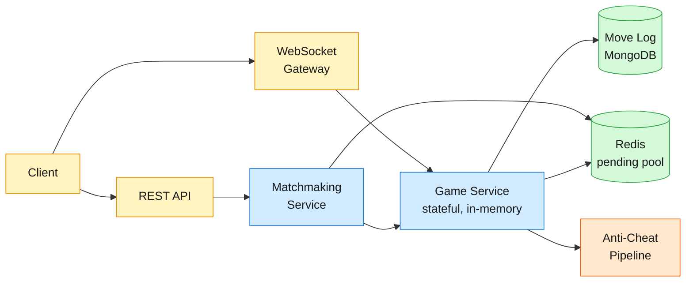
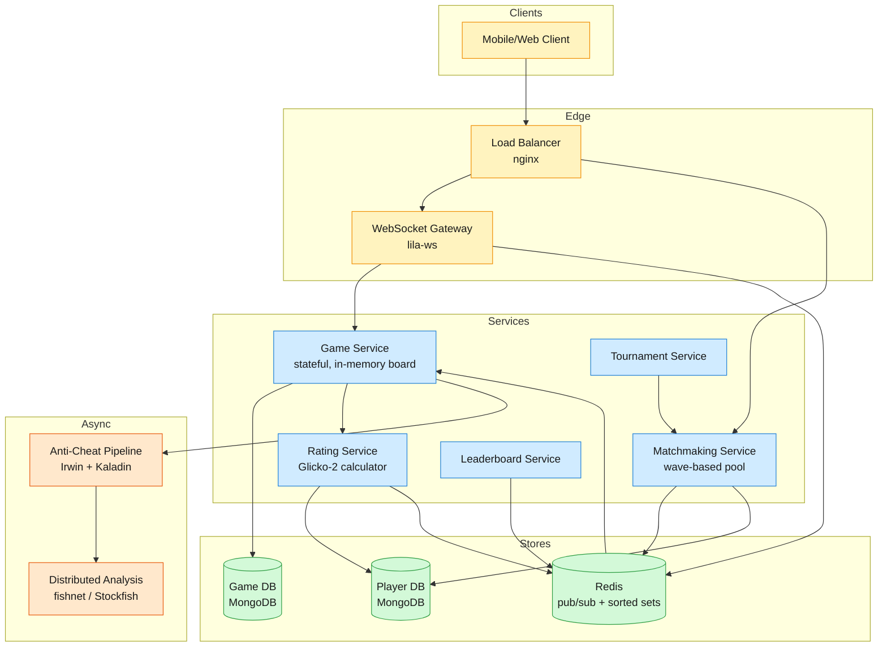
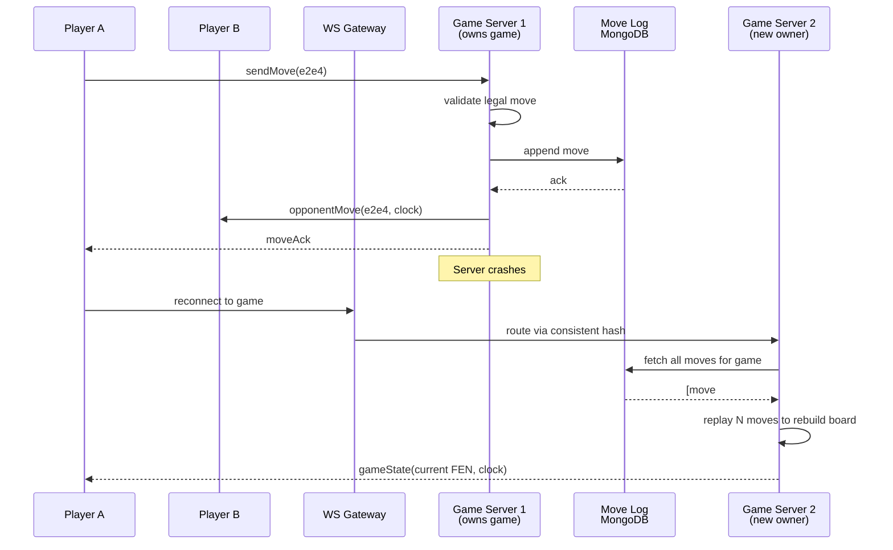

Online chess is a real-time two-player game where every half-second of latency feels like an eternity.

<!--more-->

## 1. Problem

Online chess is a real-time two-player game where every half-second of latency feels like an eternity. The hard parts are synchronizing authoritative game state across globally distributed players at sub-200ms latency, pairing opponents fairly without starving extreme-rated players at 8K requests/sec, detecting engine-assisted cheating that threatens the entire product, and keeping 1M concurrent WebSocket connections alive without corrupting the board when a server crashes. Lichess proves this is feasible with a single-developer open-source codebase handling 500K concurrent games and 12B+ stored games; [Chess.com](http://chess.com/) proves it scales commercially to 250M+ registered users. The architecture centers on stateful game servers with consistent hashing, Redis-backed matchmaking with atomic claims, and a multi-stage anti-cheat ML pipeline — all designed so that if the server dies, the game replays from the move log rather than vanishing.



## 2. Requirements

**Functional**

- FR1: Find an opponent through skill-based matchmaking and start a game
- FR2: Play a real-time chess game with validated moves and synchronized clocks
- FR3: View a global leaderboard ranked by rating and see own position
- FR4: Replay any completed game move-by-move with analysis
- FR5: Join and participate in tournaments (arena and Swiss formats)

**Non-functional**

- NFR1: <200ms p95 end-to-end move propagation between opponents
- NFR2: Consistency over availability — a game pauses rather than corrupting state
- NFR3: Support 500K concurrent games (1M WebSocket connections) at peak
- NFR4: Anti-cheat engine detection with low false-positive rate on flagged accounts

*Out of scope: spectator broadcasting, in-game chat, friends/social graph, puzzles and training content, opening explorer, monetization and subscriptions.*

## 3. Back of the envelope

- **Connection overhead:** 1M WebSocket conns × ~10KB/conn = 10GB → fleet of 30-100 game servers at 1-2GB RAM each for connection buffers
- **Game state memory:** 500K games × ~1KB board state = 500MB → trivial; the connection count, not the game state, dictates server count
- **Move throughput:** ~5-10 moves/sec per active game × 500K games = 2.5-5M moves/sec → ~8K validated move writes/sec to durable store (burst pattern — most games are idle between moves)
- **Storage growth:** 50M games/day × ~20KB/game (moves + clocks + metadata) = 1TB/day → 365TB/year, manageable on sharded MongoDB with compression

## 4. Entities

```
Player {
  player_id:        uuid PK
  username:         string
  rating:           float     ← Glicko-2 μ; authoritative for matchmaking
  rating_deviation: float     ← Glicko-2 φ; decays with inactivity
  rating_volatility:float     ← Glicko-2 σ; caps rapid swings
  created_at:       timestamp
}

Game {
  game_id:            uuid PK    ← consistent hashing key for game server routing
  white_id:           uuid
  black_id:           uuid
  variant:            enum       ← standard | crazyhouse | chess960 | …
  time_control:       jsonb      ← {initial, increment} seconds
  status:             enum       ← created | started | aborted | mate | resign | stalemate | draw | timeout
  result:             enum?      ← white | black | draw
  white_rating_before:float
  black_rating_before:float
  white_rating_after: float
  black_rating_after: float
  created_at:         timestamp
  finished_at:        timestamp?
}

Move {
  move_id:       integer   ← move number within game (1, 2, 3, …)
  game_id:       uuid CK   ← partition key for archival queries
  player_id:     uuid
  from_square:   string    ← e.g. "e2"
  to_square:     string    ← e.g. "e4"
  promotion:     string?   ← q | r | b | n
  fen_after:     string    ← board state after move (FEN)
  white_clock_ms:integer   ← remaining time in ms
  black_clock_ms:integer
  created_at:    timestamp
}

MatchRequest {
  request_id:  uuid PK
  player_id:   uuid
  rating:      float     ← looked up server-side, never trusted from client
  time_control:jsonb     ← {initial, increment} seconds
  variant:     enum
  created_at:  timestamp ← for TTL expiry (30s timeout)
}

Tournament {
  tournament_id:   uuid PK
  name:            string
  format:          enum      ← arena | swiss
  variant:         enum
  time_control:    jsonb     ← {initial, increment} seconds
  starts_at:       timestamp
  duration_minutes:integer
  status:          enum      ← scheduled | running | finished
}
```

### API

- `POST /matchmaking` — start seeking opponent; held open via long-poll until paired or timeout
- `WS /games/{game_id}` — bidirectional game channel: send moves, receive state updates and clock sync
- `GET /games/{game_id}` — fetch full game record with move list for replay
- `GET /leaderboard` — top N players by rating with cursor pagination
- `GET /players/{id}/rank` — exact rank and rating for a specific player
- `POST /tournaments/{id}/join` — enter a tournament
- `GET /tournaments/{id}/standings` — current tournament standings

## 5. High-Level Design



#### FR1: Skill-based matchmaking

**Components:** Client → Matchmaking Service → Redis sorted set → Game Service

**Flow:**

1. Client sends `POST /matchmaking` with desired time control and variant
1. Matchmaking Service looks up player's rating from Player DB (server-side, never trusts client)
1. Service creates a `MatchRequest` and inserts it into a Redis sorted set keyed by `{variant}:{time_control}`, scored by rating
1. Service runs `ZREVRANGEBYSCORE` to find the nearest-rated pending opponent within ±200 points
1. If found: a Lua script atomically removes both entries from the sorted set (prevents double-booking), creates a `Game` record, assigns a game server, returns `game_id` to both players
1. If not found: the POST is held open via long-poll; after 30 seconds without a match, rating range widens and retries
1. Both clients then open a WebSocket to the assigned game server

**Design consideration:** The Redis sorted set provides O(log n) range queries and the Lua script makes claim-and-remove atomic — no distributed locking needed. A single Redis node handles the full pending-pool lookup (~50K ops/sec at peak for the hottest time control) since the pending set is tiny (<100MB). Redis Sentinel provides automatic failover; if the pool is lost, clients re-submit and the queue refills in seconds.

#### FR2: Real-time gameplay

**Components:** Client ↔ WebSocket Gateway ↔ Game Service (stateful) → Redis pub/sub → Move Log (MongoDB)

**Flow:**

1. Both players open a WebSocket to `ws://gameserver/games/{game_id}`
1. Player A sends `{ type: "move", from: "e2", to: "e4", moveNumber: 1 }` over WebSocket
1. Game Service validates against in-memory board state (legal move? correct player's turn? piece exists at `from`?)
1. If legal: apply move to in-memory board, stop A's clock, start B's clock
1. Write move to durable Move Log in MongoDB (before broadcasting — persist-then-tell)
1. Publish `opponentMove` event with new FEN and authoritative clock times to opponent via Redis pub/sub
1. Send `moveAck` back to mover confirming the move was accepted
1. If game ends (checkmate, stalemate, resignation, timeout): write final result, compute new ratings, publish `gameEnd`
1. Illegal move → `moveAck` with error, no state change

**Design consideration:** Persist before broadcast (step 5 before 6) is load-bearing. If the server sends `moveAck` first and then crashes, recovery finds a board missing a move both players already saw — corrupted state worse than a paused game. A MongoDB write takes a few ms, well within the 200ms latency budget.

#### FR3: Leaderboard and rank

**Components:** Client → Leaderboard Service → Redis sorted set + Player DB

**Flow:**

1. On game end, Rating Service computes new Glicko-2 ratings for both players and writes to Player DB
1. Rating Service fans rating updates into a Redis sorted set keyed by `rating` with `player_id` as member
1. `GET /leaderboard?limit=50` → `ZREVRANGEBYSCORE rating_set +inf -inf LIMIT 0 50` returns top 50 in O(log n)
1. `GET /players/{id}/rank` → `ZRANK rating_set {player_id}` returns exact rank in O(log n)
1. Redis sorted set is an external index, not the source of truth; periodic reconciliation recomputes from Player DB

**Design consideration:** A SQL `COUNT(*) WHERE rating > :my_rating` is O(rank) — millions of index entries for mid-pack players. The Redis sorted set gives O(log n) rank lookup for all 10M+ players. If Redis is lost, the reconciliation job rebuilds it from the authoritative Player DB.

#### FR4: Game replay

**Components:** Client → REST API → Game DB (MongoDB)

**Flow:**

1. Client sends `GET /games/{game_id}`
1. API queries Game DB, returns full move list with FEN after each move, clock times, and result
1. Client replays moves locally from the move log — no server-side computation needed
1. Cursor-based pagination for games with hundreds of moves (correspondence chess)

**Design consideration:** Lichess stores 12B+ games in MongoDB with delayed replicas (1h and 24h lag) for point-in-time recovery. Each game is a single MongoDB document — moves array is embedded, no joins needed for replay. Compression is critical: Lichess uses a custom Java compression library for chess moves and clocks to minimize storage.

#### FR5: Tournament play

**Components:** Client → Tournament Service → Matchmaking Service → Game Service

**Flow:**

1. Tournament Service creates a tournament at scheduled time with format (arena or Swiss)
1. Players join via `POST /tournaments/{id}/join`
1. For arena format: Tournament Service periodically triggers matchmaking waves, pairing available players using weighted maximum matching
1. For Swiss format: after each round, Tournament Service runs Fast Swiss pairing (O(n log n)), assigns pairings, creates games
1. Results feed back into tournament standings; final standings determined at tournament end

**Design consideration:** Fast Swiss pairing works in three steps: (1) sort all players by score (wins + draws), highest first. (2) Walk top-down, pairing each unmatched player with the nearest lower-scored player they haven't yet faced. (3) If a choice leaves downstream players impossible to pair, backtrack to the last decision point and try the next option. The bound is O(r³) in rounds (r), not O(n³) in players — 100K players in round 7 complete in ~28 seconds. The classic Dutch system has exponential worst-case backtracking by comparison. Reference: bbpPairings library, used by Lichess.

## 6. Deep dives

### DD1: WebSocket game state sync — stateful servers with consistent hashing and crash recovery

**Problem.** Each game requires both players to connect to the same server that holds the authoritative in-memory board state. At 1M concurrent WebSocket connections across 500K games, we need to route players to the right server, handle server crashes without corrupting game state, and recover games on a new server transparently.

**Approach 1: Sticky routing by game ID on a round-robin pool**

Assign each `game_id` to a server via `hash(game_id) % N`. Both players connect to that server. Simple to implement. No coordination needed.

**Challenges:**

- Server crash: all games on that server are lost until players reconnect. No built-in failover.
- Adding servers: `N` changes, every game re-hashes to a different server — total disruption.
- Split-brain: if a server is slow (not dead), players reconnect elsewhere, and now two servers think they own the same game.

**Approach 2: Stateless game service backed by a shared state store**

Push every move to a shared Redis/MongoDB and rebuild board state from the move log on every request. Servers are interchangeable; any server can handle any game. Crash recovery is trivial.

**Challenges:**

- Latency: every move validation requires a multi-ms network round-trip to the shared store.
- Throughput: 5M moves/sec × 2 round-trips (read board + write move) = 10M store ops/sec.
- Board rebuild: reading 40 moves to reconstruct a mid-game board adds latency to every move.
- Cost: the store becomes a massive bottleneck; 5M writes/sec is feasible but expensive.

**Approach 3: Consistent hashing with a membership registry and crash recovery via move-log replay**

Use consistent hashing (ring-based, not modulo) to map `game_id` to a game server. A registry (etcd/ZooKeeper) tracks live servers and their ring positions. When a player connects, hash `game_id` to find the responsible server. The server holds the board state in memory (a few hundred bytes). On every move, persist to the durable Move Log *before* broadcasting. On server crash: the player reconnects, consistent hash maps to the new owner (ring rebalances only adjacent keys), the new server replays the move log from MongoDB to rebuild the in-memory board, and the game resumes.



**Decision:** Consistent hashing with membership registry and crash recovery via move-log replay (Approach 3).

**Rationale:** This is the architecture Lichess runs in production via Akka Cluster Sharding — virtual actors addressed by `game_id`, with the move log (MongoDB) as the recovery source. Microsoft Orleans uses the same pattern for stateful actors. Consistent hashing minimizes disruption on server add/remove: only ~1/N of keys migrate. The persist-before-broadcast discipline prevents the "phantom move" problem — if the server crashes after broadcasting but before persisting, the move is lost to both players, but at least the board isn't corrupted (the game state is consistent with the move log). The overhead of replaying 40-80 moves at reconnect is ~1-2ms, well within the resumption budget.

**Edge cases:**

- **Fencing tokens:** Each game server gets an epoch number from the registry. A server may only serve writes for its epoch. If a zombie server (slow, not dead) tries to write a move after a new server took over, the MongoDB write is rejected because the epoch is stale. This prevents split-brain corruption.
- **Partial move log:** If the crashed server wrote move #15 to MongoDB but didn't broadcast it to the opponent, the new server replays 15 moves — including the one the opponent never saw. The opponent receives `gameState` containing move #15 and renders it. No corruption; the mover already saw their `moveAck`.
- **Reconnection storm:** If an entire rack fails, thousands of players reconnect simultaneously. The registry throttles re-registration and the remaining servers replay move logs in batches.
- **Game server overload:** If a server exceeds its connection budget, new games for its hash range spill to adjacent servers (virtual nodes on the consistent hash ring distribute load).

> [!TIP]
> The in-memory board is not precious — the move log is. The board is a cache that can be rebuilt; the move log is the durable source of truth. This is the same insight behind event sourcing: the event log (moves) is the system of record, and the projection (board state) is disposable.

> [!NOTE]
> Consistent hashing uses virtual nodes (~100-200 per physical server) to smooth the key distribution. Without virtual nodes, a single server addition creates a hot spot on the adjacent server that inherits its entire key range. Akka Cluster Sharding uses a similar concept with shard regions.

> [!WARNING]
> Stateful servers mean a server restart is visible to players (game pauses for 1-3 seconds during replay). This is acceptable for chess — players already wait seconds between moves. For real-time shooters, this latency would be unacceptable; Agones/GameLift use dedicated game server allocation with health checks instead.

---

### DD2: Matchmaking at scale — weighted maximum matching vs. greedy vs. Redis sorted sets

**Problem.** At peak, ~8K new match requests arrive per second. We need to pair players by rating proximity while avoiding starvation for extreme-rated players. A naive greedy approach creates contention on the "thick band" of mid-rated players and leaves outliers waiting indefinitely. The matchmaking system must handle read-modify-write on a shared pool without distributed locking.

**Approach 1: Greedy pairing — sort by rating, pair adjacent players**

Sort all pending requests by rating. Walk the sorted list and pair players at positions (1,2), (3,4), (5,6), etc. O(n log n) per wave. Simple and intuitive.

**Pro:** Fast to implement. No complex optimization. Works well when the pool is large and homogeneous.

**Con:** No notion of pairing quality beyond rating proximity. A player who missed the last wave gets no priority boost. Extreme-rated players (rating 400 or 3800) may wait many waves with no compatible opponent. The "boundary problem": if there are an odd number of players in a rating band, the last player is paired with someone 500 points away.

**Approach 2: Redis sorted set with atomic claim**

Store pending requests in a Redis sorted set keyed by `{variant}:{time_control}`, scored by rating. When a new request arrives, `ZREVRANGEBYSCORE` finds the nearest opponent within ±200 rating points. A Lua script atomically removes the matched pair from the set (compare-and-swap style). For the long-poll pattern, the request stays pending in the set.

```lua
-- Lua script: atomically claim a match or return nil
-- KEYS[1] = sorted set key
-- ARGV[1] = my_request_id
-- ARGV[2] = my_rating
-- ARGV[3] = range (e.g., 200)
local opponents = redis.call('ZREVRANGEBYSCORE', KEYS[1],
    ARGV[2] + ARGV[3], ARGV[2] - ARGV[3], 'LIMIT', 0, 1)
if #opponents > 0 then
    redis.call('ZREM', KEYS[1], ARGV[1], opponents[1])
    return opponents[1]
end
return nil
```

**Pro:** O(log n) per lookup. Atomic claim prevents double-booking. A single-threaded Redis node handles the entire pending pool easily (~50K ops/sec for the hottest time control, well under Redis's low-hundreds-of-K capacity).

**Con:** No global optimization. Each pairing is locally optimal but the aggregate set of pairings may be suboptimal. The player who arrived at t=0 with rating 1501 might not get paired if the opponent at 1500 arrived at t=0.1 and got snapped up by the player at 1499. No priority for long-waiting players.

**Approach 3: Weighted maximum matching with multi-factor scoring**

Instead of first-come-first-served, use a batching matchmaker: accumulate pending requests in a pool, then every N seconds (the wave interval) find the globally optimal set of pairs. The Hungarian algorithm (Kuhn-Munkres) maximizes total pair-quality score across factors: rating proximity, wait time bonus, sportsmanship flags, and provisional status (see score function below). To use: set a wave interval (2-5s), pool POST /matchmaking requests, run Hungarian at each tick, create GameService games for each matched pair, return unmatched players to the pool with +1 wait counter. Ref: Kuhn (1955) "The Hungarian method for the assignment problem"; Lichess MatchMaking.scala.

```python
def pair_score(a: Player, b: Player) -> int:
    score = abs(a.rating - b.rating)          # lower = better
    score -= min(a.missed_waves, b.missed_waves) * 12  # wait bonus
    score -= range_bonus(a, b)                # compatible rating ranges
    score -= sportsmanship_bonus(a, b)        # +30 for clean players
    score -= provisional_bonus(a, b)          # +30 for new players
    return score if score <= max_score_threshold(a.rating) else INF
```

The Hungarian algorithm finds the set of non-overlapping pairs that maximizes total score. This is the approach Lichess uses in production via `MatchMaking.scala`.

**Pro:** Globally optimal pairings. Wait-time bonus prevents starvation. Multi-factor scoring handles edge cases (new players, blocked users, rating range preferences). Handles the odd-player-count problem gracefully — the worst-scoring player sits out one wave and gets a bonus next time.

**Con:** O(n³) worst-case for Hungarian algorithm. At 10K pending requests per wave, this is 10¹² operations — prohibitive. Must optimize for the sparse case where only players within ~200 points are connectable.

**Decision:** Weighted maximum matching with multi-factor scoring, optimized for the sparse rating graph (Approach 3).

**Rationale:** The rating constraint (±200 points initially, widening to ±400 after timeout) makes the matching graph extremely sparse — each player is connectable to only ~0.5-2% of the pool. The Hungarian algorithm on a sparse graph runs in near O(n²) or faster with practical optimizations. Lichess runs this every few seconds on pools of thousands of players without issue. The wait-time bonus (12 points per missed wave) is load-bearing: a player who waits 10 waves gets a +120 score bonus, making them the most attractive pairing candidate and preventing indefinite starvation. The Redis sorted set approach (Approach 2) is simpler but can't express multi-factor quality or prevent the starvation of extreme-rated players.

**Edge cases:**

- **Extreme ratings:** A 3800-rated grandmaster and a 400-rated beginner have no compatible opponents in their band. After 30 seconds, the rating range widens exponentially. Most platforms cap the widen at ±500-700; beyond that, the player is notified that no opponent is available.
- **Rating manipulation:** A player could intentionally tank their rating to match weaker opponents. Glicko-2's rating deviation (φ) provides a natural defense: players with uncertain ratings (high φ) experience larger rating changes, quickly correcting manipulation.
- **Wave timing:** All players joining exactly at the wave boundary creates a thundering herd. Lichess adds random jitter (±1000ms) to each wave to spread the load.
- **Block lists:** Players who blocked each other must never be paired. The scoring function assigns them an infinite edge weight (unmatchable).

> [!TIP]
> The matchmaking problem is fundamentally a bipartite matching problem disguised as a real-time queue. The wave-based approach converts real-time requests into a batch optimization problem — this is the same pattern used by ride-sharing (Uber/Lyft) and multi-player game lobbies. The wave interval is a tunable trade-off: shorter waves = lower latency but fewer candidates per wave (worse pairings); longer waves = better pairings but higher perceived wait time.

---

### DD3: Rating system — Glicko-2 vs ELO and leaderboard performance

**Problem.** The rating system must accurately estimate player skill, handle new players with no history, decay certainty for inactive players, and support O(log n) leaderboard rank lookups for 10M+ players. A naive ELO system treats every player as equally certain and can't distinguish a new player on a lucky streak from a genuinely strong player.

**Approach 1: Classic ELO**

Each player has a single number (rating). After a game, compute expected score `E = 1 / (1 + 10^((R_opponent - R_player) / 400))`. Update: `R_new = R_old + K * (S - E)` where K is a fixed constant (e.g., 32) and S is the actual score (1, 0.5, 0).

**Pro:** Simple to implement. Well-understood. Single number per player.

**Con:** No uncertainty tracking. A new player who wins 5 games against 1500-rated opponents jumps to 1660 — the same as a veteran who earned 1660 over 500 games. The K-factor is fixed: too high and ratings oscillate; too low and ratings don't converge. No decay for inactive players.

**Approach 2: Glicko-2**

Track three values per player: rating (μ), rating deviation (φ), and volatility (σ). New players start at μ=1500, φ=350 (very uncertain). As they play more games, φ decreases (more certain). If they stop playing, φ increases over time (decay). Volatility σ measures how consistently the player performs — a player with erratic results gets higher σ, meaning their rating changes more per game.

```javascript
After each game:
  Expected score: E = 1 / (1 + 10^(-g(φ_opp) * (μ - μ_opp) / 400))
  where g(φ) = 1 / sqrt(1 + 3φ²/π²)   ← weight opponent's rating by their uncertainty

  Rating update: μ_new = μ + (q / (1/φ² + 1/δ²)) * (S - E)
  RD update:     φ_new = sqrt(1 / (1/φ² + 1/δ²))
  Volatility:    σ updated via iterative convergence (Illinois algorithm)
```

**Pro:** Uncertainty tracking makes new-player ratings converge faster. Inactivity decay prevents stale ratings. Volatility captures consistency — a player who alternates between brilliant and blunder-heavy games gets higher σ and faster rating adjustments. This is what Lichess and [Chess.com](http://chess.com/) both use in production.

**Con:** More complex to implement. Three values per player instead of one. Volatility convergence requires an iterative algorithm. Harder to explain to users.

**Decision:** Glicko-2 (Approach 2).

**Rationale:** Lichess open-sourced their Glicko-2 implementation with exact parameters: μ∈[400, 4000], φ∈[45, 500], σ≤0.1, max change ±700 per game, periodsPerDay=0.21436 (so RD grows from 60→110 in one year of inactivity). [Chess.com](http://chess.com/) also uses Glicko (the original, not Glicko-2) for its rating system. The key advantage over ELO is the rating deviation: a new account with φ=350 can gain or lose hundreds of points in a few games, quickly placing them at their true skill level, while a veteran with φ=45 barely moves. This is essential for a platform with millions of new accounts monthly.

**Leaderboard implementation:** Store ratings in a Redis sorted set. `ZADD leaderboard rating player_id`. `ZRANK leaderboard player_id` returns 0-based rank in O(log n). `ZREVRANGE leaderboard 0 49 WITHSCORES` returns top 50. The sorted set is an external index rebuilt periodically from the authoritative Player DB. On game end: compute new ratings → write to Player DB → `ZADD` both players into Redis sorted set. Idempotency keyed by `game_id` prevents double-counting if the rating update is replayed.

**Edge cases:**

- **New player boost:** A player with φ=350 who wins their first 3 games is treated as a legitimate 1800+ player. The high φ amplifies rating changes. If they lose the next 3, φ shrinks and their rating settles around 1600 — the system self-corrects.
- **Rating floor:** Ratings are clamped to [400, 4000]. A player at 400 can't drop further; a player at 4000 can't rise further. This prevents degenerate rating deflation and preserves leaderboard integrity.
- **Unranked players:** Players with φ>75 (standard) or φ>65 (variants) are excluded from the leaderboard. Their rating is too uncertain to rank meaningfully.
- **Bot accounts:** Internal bot accounts start at μ=3000 (so they match strong humans), not 1500.

> [!TIP]
> Glicko-2's rating deviation is a measure of "how much the system trusts this rating." This is the same concept as a confidence interval in statistics. ELO treats all ratings as equally trusted, which is mathematically equivalent to assuming everyone has the same φ — an assumption that breaks for platforms with rapid user growth.

---

### DD4: Anti-cheat — multi-stage ML pipeline with distributed analysis

**Problem.** Engine-assisted cheating is an existential threat to online chess. A player running Stockfish on a second device can achieve near-perfect play. Manual review can't scale to millions of games per day. We need an automated detection system that analyzes move quality against engine top-picks, identifies statistical anomalies in play patterns, and flags suspicious accounts with a low false-positive rate — because banning a legitimate player is worse than missing a cheater.

**Approach 1: Threshold-based move matching**

After each game, run Stockfish on every position. Compare the player's move to Stockfish's top-3 moves. If the player matches Stockfish's top-1 move >90% of the time, flag them.

**Pro:** Simple to implement. Clear signal — engine-like accuracy is the primary indicator.

**Con:** False positives on strong players (grandmasters also match engines frequently). False negatives on selective cheaters (only consulting engine in critical positions). No temporal analysis — a player who takes exactly 3 seconds on every move regardless of complexity is suspicious regardless of accuracy. Threshold tuning is brittle.

**Approach 2: Single neural network on game metadata**

Train a binary classifier on per-game features: average centipawn loss, move-time variance, rating trajectory, win rate, and opening book adherence.

**Pro:** Captures non-obvious patterns. A player whose move times are perfectly uniform (3.0s ±0.1s) gets flagged even if their moves aren't engine-perfect.

**Con:** Limited to per-game features. Can't model the interaction between move quality and position complexity. Can't detect patterns across multiple games.

**Approach 3: Multi-stage pipeline with dual neural networks plus distributed analysis**

Stage 1 — Collect: Stream games from flagged players and high-rated games into an analysis queue.

Stage 2 — Analyze: Distributed Stockfish workers (fishnet) analyze every position to depth ~4.5M nodes, producing principal variations and top-N engine moves. Compare each player move against engine recommendations.

Stage 3 — Score: Feed analysis results into two TensorFlow models:

- `basicGame.h5`: game metadata only (move times, rating difference, outcome, opening compliance) — fast to evaluate, catches obvious temporal anomalies.
- `analysedGame.h5`: full Stockfish analysis (centipawn loss per move, move-matching rate, blunder frequency, consistency of play across positions of varying complexity) — catches subtle engine use.

Stage 4 — Aggregate: A CNN model (Kaladin) runs on player-level "insights" across all recent games to detect patterns invisible in single games (sudden rating improvement, unusual consistency, suspicious account age vs. skill).

**Pro:** Two-tier scoring separates easy cases (basicGame) from hard cases (analysedGame). The CNN catches account-level patterns a per-game classifier misses. Distributed Stockfish analysis parallelizes the most expensive step.

**Con:** Complex pipeline with multiple services. Stockfish analysis is CPU-intensive — a single game at tournament time controls (40 moves × 4.5M nodes/move = 180M nodes) takes minutes on a single core. Requires a distributed volunteer/donation compute cluster.

**Decision:** Multi-stage pipeline with dual TF models and distributed analysis (Approach 3).

**Rationale:** This is the Lichess anti-cheat architecture: Irwin (dual TF models) + Kaladin (CNN insights) + fishnet (distributed Stockfish). The two-model split (basicGame vs. analysedGame) is a cost optimization — basicGame runs on all flagged games (cheap, no Stockfish needed), and only games that score above a threshold on basicGame graduate to full Stockfish analysis. This filters out ~80% of flagged games before the expensive analysis step. The CNN aggregation layer catches the most dangerous cheaters: those who consult the engine only in 2-3 critical positions per game, maintaining plausible-looking play otherwise. These players would pass a per-game threshold check but their aggregate stats reveal the pattern.

**Edge cases:**

- **Strong legitimate players:** Grandmasters routinely match Stockfish's top-3 moves >80% of the time. The models are trained to distinguish between "strong human play" (occasional blunders, natural time usage, variance across games) and "engine play" (unnatural consistency, zero blunders, uniform move times). The CNN is particularly effective here — it sees that a GM sometimes plays suboptimal but creative moves, while an engine user never does.
- **Selective cheating:** A player who consults Stockfish only in positions where the engine evaluation swing exceeds +2.0. Per-game analysis catches this because those critical-position moves match the engine perfectly while non-critical positions show normal human variance.
- **False positive mitigation:** Flagged accounts go to human moderators for final review before banning. The models produce a confidence score; only high-confidence flags auto-escalate. False positive rate is kept below 1% of flagged accounts.
- **New cheating methods:** As detection improves, cheaters adapt. The models are periodically retrained on newly confirmed cheating cases. The pipeline supports adding new features (mouse movement analysis, tab-switching detection for web clients) without restructuring.

> [!TIP]
> Anti-cheat in chess is fundamentally an anomaly detection problem, not a classification problem. The system isn't asking "is this an engine?" — it's asking "is this play pattern statistically inconsistent with human play at this rating level?" This framing avoids the arms race of detecting specific engines and instead focuses on the statistical signature that all engine-assisted play shares: superhuman consistency.

---

### DD5: Game persistence and replay — storage strategy for 12B+ games

**Problem.** Every completed game must be stored durably for replay, analysis, and anti-cheat review. At 50M games/day growing by 1TB/day, we need a storage system that handles write throughput, supports efficient queries (find all games by a player, fetch a specific game), and compresses chess-specific data. A naive approach of storing PGN text in a relational database would explode storage costs and query poorly.

**Approach 1: Store PGN text in a relational database with BLOB columns**

Each game is a row with a PGN text column. Index on `white_id`, `black_id`, `created_at`. Query with standard SQL.

**Pro:** Simple schema. Standard tooling. PGN is human-readable and widely supported.

**Con:** PGN is verbose — a 40-move game is ~2KB uncompressed. 50M games/day = 100GB/day just for moves, plus indices. Full-text search on PGN is painful. Joins across player tables are expensive at 12B+ rows.

**Approach 2: Document store with binary-compressed moves**

Store each game as a single MongoDB document. Embed the move list as a binary-compressed array within the document. Index on `players` (array of both player IDs), `created_at`, `status`, `variant`. Use Elasticsearch for full-text position search (find games with a specific opening).

**Pro:** Single document fetch for replay — no joins. Binary compression reduces storage by 80-90%. MongoDB's sharding on `game_id` distributes writes evenly. Elasticsearch handles the search use case separately. This is Lichess's production architecture.

**Con:** MongoDB document size grows with move count (correspondence games can have hundreds of moves). Binary compression is opaque — harder to debug than PGN.

**Approach 3: Event-sourced with columnar analytics**

Store raw moves as an append-only event stream in Kafka with long-term retention. Replay from the stream for game reconstruction. Run a periodic compaction job that materializes completed games into a columnar store (ClickHouse/BigQuery) for analytics.

**Pro:** Event stream enables real-time analytics (live game statistics, cheating detection during play). Columnar storage is optimal for aggregate queries (average game length by rating band, most common openings).

**Con:** Over-engineered for a platform that primarily serves single-game replay and simple player queries. Kafka retention for 12B+ games is expensive. Replay latency is higher than a direct document fetch.

**Decision:** Document store (MongoDB) with binary-compressed move array and delayed replicas (Approach 2).

**Rationale:** Lichess stores 12B+ games in MongoDB with each game as a single document. The move list is embedded (no joins), player IDs are stored as an indexed array, and a custom Java compression library reduces per-game storage to ~2-5KB. MongoDB shards on `game_id` for even write distribution. Delayed replicas (1h and 24h lag) provide point-in-time recovery — if a bug corrupts recent games, the 1h-lag replica has the pre-corruption state. Elasticsearch (via lila-search) powers the search use case: find all games matching an opening position, filter by rating range and date.

**Edge cases:**

- **Very long games:** Correspondence chess games can exceed 300 moves. MongoDB documents have a 16MB size limit. With compression, 300 moves × ~15 bytes/move = 4.5KB — well within limits.
- **Bulk export:** Lichess makes all rated games available as downloadable PGN archives at [database.lichess.org](http://database.lichess.org/). This is a batch job that reads from MongoDB and decompresses to PGN, not a real-time API.
- **Shard key choice:** Sharding on `game_id` (UUID) distributes writes evenly but makes "find all games by player X" a scatter-gather across all shards. The `players` index is maintained as a separate collection mapping `player_id → [game_ids]` with TTL-based trimming for inactive players.

> [!TIP]
> Chess game storage benefits enormously from domain-specific compression. A chess move can be encoded in ~8-12 bits (6 bits for source square, 6 bits for destination, 2-4 bits for promotion), vs. 4-6 bytes in algebraic notation. Over 12B games, this saves petabytes.

## 7. References

1. [Lichess source code (lila)](https://github.com/lichess-org/lila) — full open-source Scala/Play backend, matchmaking, game logic, rating
1. [Lichess WebSocket server (lila-ws)](https://github.com/lichess-org/lila-ws) — decoupled WS service communicating via Redis pub/sub
1. [Scalachess — immutable chess engine](https://github.com/lichess-org/scalachess) — functional, side-effect-free chess rules and move generation
1. [Irwin — anti-cheat with TensorFlow](https://github.com/lakinwecker/irwin) — dual-NN pipeline for engine detection
1. [Kaladin — CNN-based cheat insights](https://github.com/lichess-org/kaladin) — player-level pattern detection
1. [Fishnet — distributed Stockfish analysis](https://github.com/lichess-org/fishnet) — volunteer compute cluster for game analysis
1. [Fast Swiss (bbpPairings)](https://github.com/cyanfish/bbpPairings) — O(n log n) Swiss tournament pairings for 100K+ players
1. [Lichess production architecture diagram](https://raw.githubusercontent.com/lichess-org/lila/master/public/images/architecture.png) — official microservice topology
1. [Glicko-2 rating system (Glickman, 2001)](http://www.glicko.net/glicko/glicko2.pdf) — the mathematical foundation for rating with uncertainty and volatility
