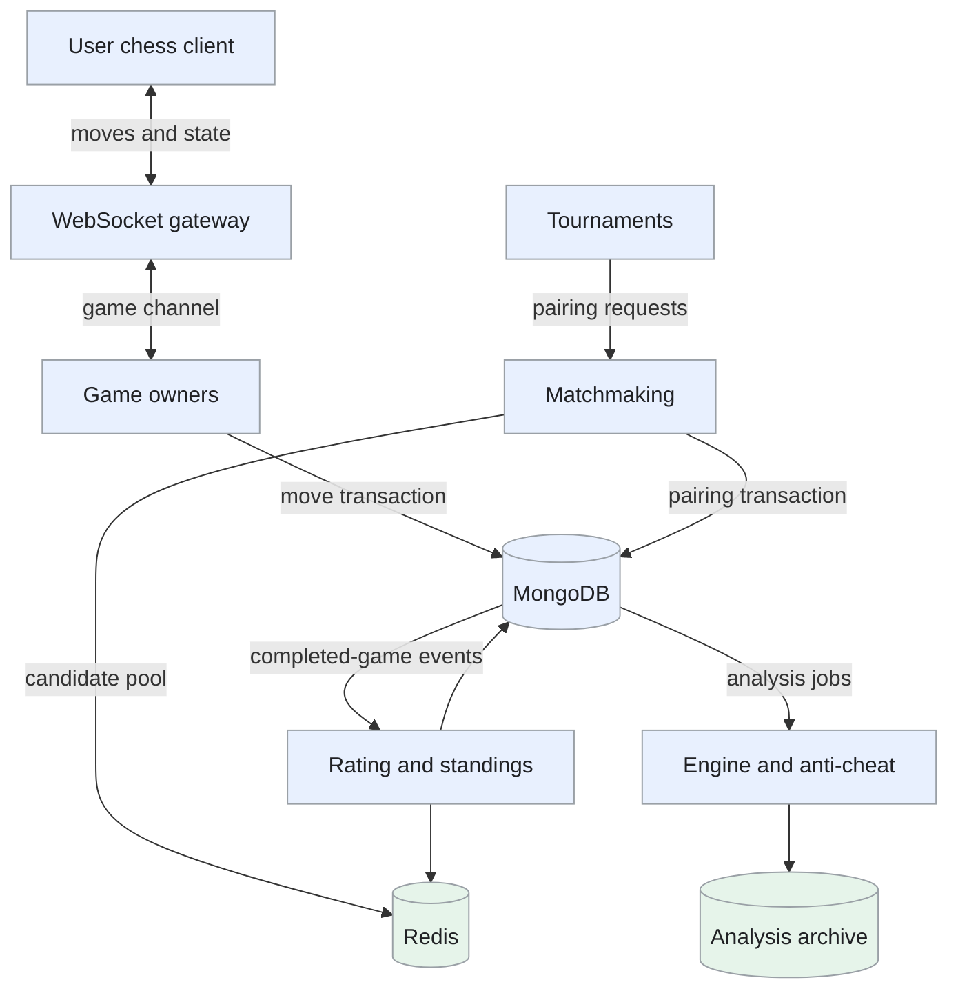
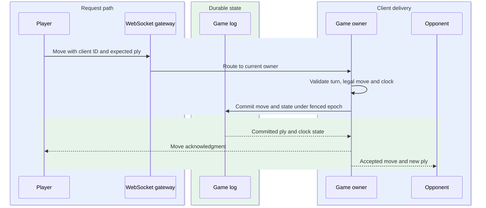
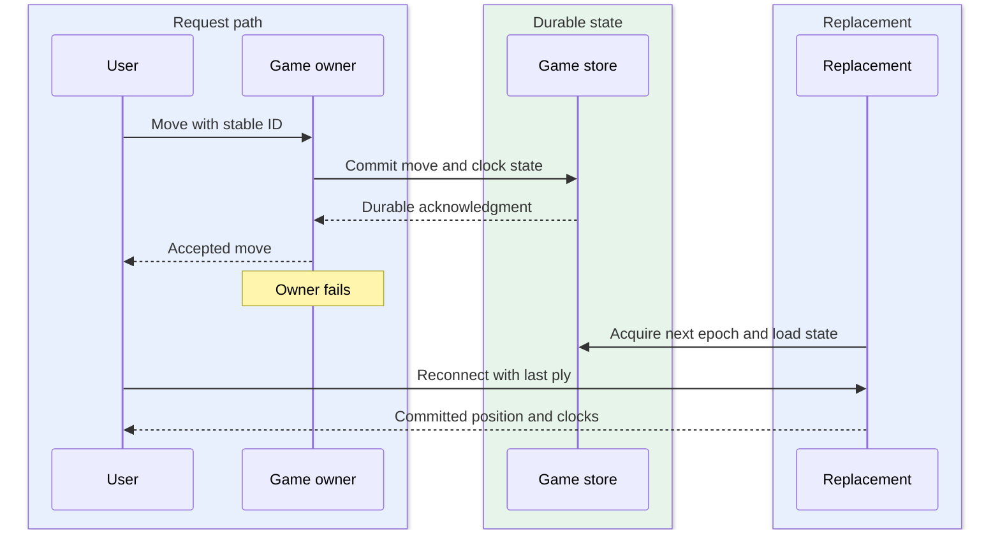
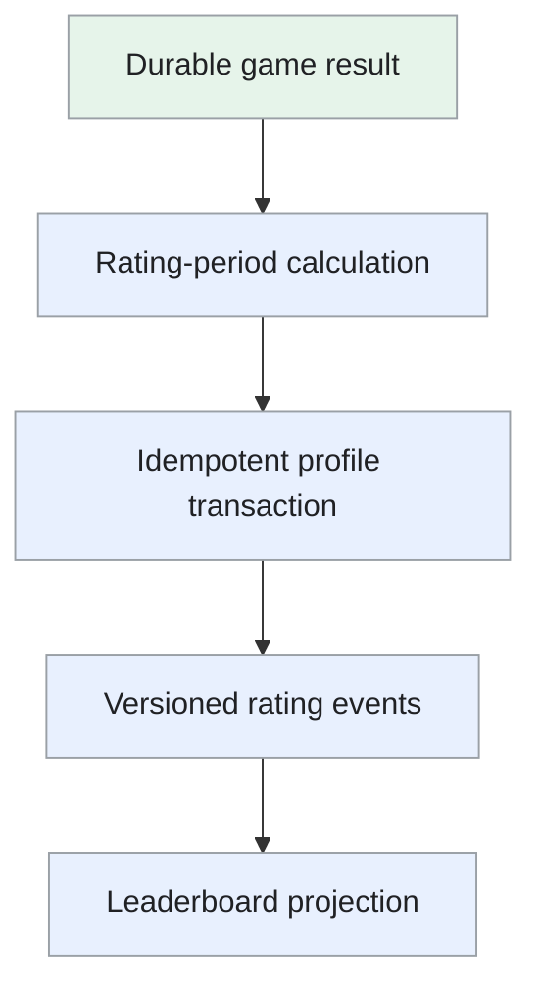

Design of an online chess service with skill-based pairing, authoritative moves and clocks, ratings and game replay.

<!--more-->

## Problem

Two users join a game and expect the same board, legal moves and reliable clocks. A server failure must preserve moves already acknowledged to either player, while a reconnect must restore the current position.

The game service owns the live position and clock decisions. Matchmaking creates durable pairings, and completed-game events update ratings, standings and analysis independently of move delivery.

## Requirements

### Functional requirements

- **Find an opponent:** pair users by variant, time control, rating and waiting time.
- **Play a game:** validate moves, synchronize the board and clocks, and handle resignation, draws and timeouts.
- **View rankings:** show rating leaderboards and the user's rank.
- **Replay games:** retrieve completed moves and request analysis.
- **Join tournaments:** support arena pairing and Swiss rounds with live standings.

### Non-functional requirements

- **Scale:** support 500K concurrent games, 1M player connections and an 8K/s matchmaking-request peak.
- **Latency:** target P95 move-to-opponent-screen below 200ms within the supported regional network envelope.
- **Consistency:** accept each move once, in game order, with one authoritative owner.
- **Durability:** save accepted moves and clock state before acknowledgment.
- **Recovery:** pause safely during ownership recovery and reconnect from the last committed position.
- **Fairness:** measure matchmaking wait by rating cohort and review anti-cheat decisions with a low false-positive objective.

Spectator broadcasting, chat, puzzles and subscription features are outside this design.

## Back-of-the-envelope calculations

- **Connections:** 1M × an assumed 10KB connection state is 10GB before TLS, socket buffers and application state.
- **Moves:** assuming one half-move per live game every 10s gives 50K moves/s. Bullet games produce higher local bursts; idle games reduce the average.
- **Game storage:** a modeled 50M completed games/day × 20KB is 1TB/day before compression and replication.
- **Analysis:** 80 half-moves/game × engine-search work per position dominates replay cost. Queue analysis separately and allocate it by priority.

## Core entities

```protobuf
message PlayerRating {
  string player_id;
  string rating_pool;           // Variant and time-control category
  double rating;
  double deviation;
  double volatility;
  int64 version;
}

message Game {
  string game_id;
  string white_id;
  string black_id;
  string variant;
  int64 initial_clock_ms;
  int64 increment_ms;
  int64 current_ply;
  int64 white_clock_ms;
  int64 black_clock_ms;
  string position;
  string status;
  int64 owner_epoch;
}

message Move {
  string game_id;
  int64 ply;
  string client_move_id;        // Stable retry identity
  string player_id;
  string move_uci;              // For example, e2e4
  string position_after;
  int64 white_clock_ms;
  int64 black_clock_ms;
}

message MatchRequest {
  string request_id;
  string player_id;
  string rating_pool;
  double rating;                // Read from authoritative profile
  Timestamp joined_at;
  int64 request_version;
}

message Tournament {
  string tournament_id;
  string format;                // arena or Swiss
  string pairing_rules_version;
  int64 round;
}

message GameResult {
  string game_id;
  string result;
  string reason;
  int64 result_version;
}
```

## API

```yaml
POST /matchmaking:
  headers: {Idempotency-Key: string}
  body: [variant, time_control, rating_range]
  response: [request_id, state]

DELETE /matchmaking/{request_id}:
  response: canceled or existing pairing

WS /games/{game_id}:
  move: [client_move_id, expected_ply, move_uci]
  ack: [client_move_id, ply, clocks]
  state: [ply, position, clocks, status]
  actions: [resign, offer_draw, accept_draw]

GET /games/{game_id}:
  response: [metadata, moves, clocks, result]

GET /leaderboard:
  query: [rating_pool, cursor, limit]

GET /players/{id}/rank:
  query: [rating_pool]

POST /tournaments/{id}/join:
  response: participation record

GET /tournaments/{id}/standings:
  response: [round, standings, as_of]
```

## High-level design

WebSocket gateways route each game to its current owner. The owner validates moves and commits them before publishing state. Matchmaking, ratings, tournaments and engine analysis have separate workers so they cannot delay ordinary move handling.


```mermaid
flowchart TB
  U[User chess client] <-->|moves and state| G[WebSocket gateway]
  G <-->|game channel| S[Game owners]
  S -->|move transaction| DB[(MongoDB)]
  M[Matchmaking] -->|candidate pool| R[(Redis)]
  M -->|pairing transaction| DB
  T[Tournaments] -->|pairing requests| M
  DB -->|completed-game events| W[Rating and standings]
  W --> DB
  W --> R
  DB -->|analysis jobs| A[Engine and anti-cheat]
  A --> O[(Analysis archive)]
  classDef request fill:#e8f0fe,stroke:#9aa0a6,color:#202124,stroke-width:1px
  classDef background fill:#e6f4ea,stroke:#9aa0a6,color:#202124,stroke-width:1px
  classDef control fill:#fef7e0,stroke:#9aa0a6,color:#202124,stroke-width:1px
  class U,G,S,DB,M,T,W,A request
  class R,O background
```

## Storage

- **MongoDB:** owns game heads, moves, pairing claims, results and ratings. Transactions commit a move with its updated head and event record using the configured majority/journal durability policy. Moves have unique `(game_id, ply)` and retry-identity indexes.
- **Game ownership:** the game head stores owner epoch and lease. Every commit checks that epoch; changing the ownership registry alone cannot fence a stale writer.
- **Match claims:** one active-player claim per user and a unique pairing ID make game creation transactional. [Redis](/designs/tech-redis/) pool removal is a cache update after that commit.
- **Redis:** indexes pending requests by rating and stores leaderboard projections. New versions prevent an old rating event from replacing a newer value.
- **Completed games:** compact move/clock sequences for single-game replay and build a separate player/time index. Keep large analysis output in object storage rather than an ever-growing game document.
- **Recovery:** backups and tested restore procedures protect durable records. Delayed replicas can be useful, but are not a substitute for independent backups.

[Lichess's open-source server](https://github.com/lichess-org/lila) and its linked modules are implementation references, not a claim that this proposal reproduces their current deployment.

## From request to response

### One end-to-end request

The game owner validates a move against its board, clock and expected ply, then commits it under the current ownership epoch.


```mermaid
sequenceDiagram
  box rgb(232,240,254) Request path
    participant U as Player
    participant A as WebSocket gateway
  end
  box rgb(230,244,234) Durable state
    participant D as Game log
  end
  box rgb(232,240,254) Client delivery
    participant W as Game owner
    participant C as Opponent
  end
  rect rgb(232,240,254)
    U->>A: Move with client ID and expected ply
    A->>W: Route to current owner
    W->>W: Validate turn, legal move and clock
    W->>D: Commit move and state under fenced epoch
  end
  rect rgb(230,244,234)
    D-->>W: Committed ply and clock state
    W-->>U: Move acknowledgment
    W-->>C: Accepted move and new ply
  end
```

Both players receive that committed move; after a disconnect the log/snapshot reconstructs the same accepted game state.

### Pairing users

The matchmaking service reads the user's server-side rating and adds a versioned request to the appropriate pool. A short matching wave considers compatible opponents and gives waiting users increasing priority.

The selected pair is claimed in a database transaction that creates the game and both active-player claims. Competing pairings fail on an existing claim and choose another candidate. After commit, workers remove the pool entries and notify both users. A crash before removal is harmless because the durable claims already exist.

Queue cancellation checks the request version. If pairing has committed, the API returns that game instead of silently deleting one side of the match.

### Applying a move

The game owner checks the player, expected ply, turn, legality and clock deadline. It computes the next position and clocks from server-controlled timing, then commits the move and updated head with the current owner epoch.

After commit, it updates its in-memory projection, acknowledges the mover and sends the state delta to the opponent. A repeated client move ID returns the stored outcome. A conflicting move or sequence gap returns the current state for resynchronization.

Clock and move decisions share the same ordering boundary. If a timeout and move race, the authoritative transaction decides which transition was eligible first under the timing policy.

### Finishing, rating and replaying a game

Checkmate, resignation, draw or timeout creates one versioned final result. Rating workers retain the game result idempotently and apply the configured rating-period policy. Tournament standings consume the same committed result.

Replay reads the starting position, moves and clock values, then reconstructs positions with a versioned chess-rules library. Analysis runs separately so an engine backlog does not slow replay or current games.

### Running tournaments

Arena tournaments periodically pair available users, considering recent opponents and waiting time. Swiss tournaments create the next round from completed standings using the selected pairing rules, including score groups, color balance, repeat-opponent restrictions and byes.

Use a tested pairing implementation such as [bbpPairings](https://github.com/cyanfish/bbpPairings). Persist the round pairings before creating games and use round/pair IDs for retries. Pairing complexity depends on the chosen algorithm and constraints, rather than one universal O(n log n) bound.

## Deep dives

### How does a game survive an owner failure?

**Problem.** In-memory state gives fast validation, but two servers must not accept different next moves after routing or membership changes.

| Approach | Strength | Limitation |
| --- | --- | --- |
| Stateless validation from storage | Simple ownership | Repeated reads and reconstruction |
| Sticky in-memory owner | Fast normal path | Routing alone leaves split-brain risk |
| Leased owner with fenced commits | Fast validation and recoverable state | Requires lease, log and reconnect handling |

- **Stateless storage validation:** load and reconstruct game state for every command. Ownership is simple, but repeated reads and replay add move latency and storage pressure.
- **Sticky in-memory owner:** keep board/clock state on one routed server. Normal validation is fast, but stale routing after replacement can leave two owners accepting different next moves.
- **Leased owner with fenced commits:** retain fast local state and require a durable epoch/expected ply on each write. Replacement replays the accepted log and stale writes fail; lease renewal, replay and reconnect handling add control state.

**Recommendation:** use a leased game owner with a durable epoch. A replacement acquires a higher epoch transactionally. Every move write checks that epoch and expected ply, so an old owner cannot commit afterward. A fenced owner fits low-latency move validation and one authoritative game history. We accept a durable commit on each accepted move and brief takeover recovery rather than allowing routing alone to decide ownership.


```mermaid
sequenceDiagram
  box rgb(232,240,254) Request path
  participant U as User
  participant A as Game owner
  end
  box rgb(230,244,234) Durable state
  participant D as Game store
  end
  box rgb(232,240,254) Replacement
  participant B as Replacement
  end
  U->>A: Move with stable ID
  A->>D: Commit move and clock state
  D-->>A: Durable acknowledgment
  A-->>U: Accepted move
  Note over A: Owner fails
  B->>D: Acquire next epoch and load state
  U->>B: Reconnect with last ply
  B-->>U: Committed position and clocks
```

Use a monotonic timer while one owner is active. Persist remaining clock values and the timing anchor required by the recovery policy. During detected platform failover, apply a documented pause or bounded compensation rule consistently to both players; do not invent elapsed time from a stale process-local timer.

A disconnect does not automatically pause a player's clock. Lag compensation is capped and based on trusted server measurements. Monitor move acknowledgment latency, owner recovery time, clock corrections and rejected stale epochs.

**Expected-ply and epoch checks.** A client submits move ID M for ply 41. The owner validates it against committed ply 40 and submits a transaction checking owner epoch and expected head. That transaction inserts move 41, updated position/clock state and its event together.

If the response is lost, retry M returns the stored move rather than playing it again. If an old owner and its successor both propose different move 41 records, only the current epoch can commit; the unique ply/head check prevents two next moves.

Recovery reconstructs from durable position and moves. Process-local monotonic time cannot be transferred directly to another host, so persist the recovery timing anchor and apply the documented platform-pause policy. The UI distinguishes a reconnecting game from a player disconnect, whose clock policy may be different.

### How can matchmaking balance quality and waiting time?

**Problem.** A narrow rating band improves pairing quality but can leave very high- or low-rated users waiting. A large optimizer may consume the whole wave interval.

- **Nearest-rating greedy pairing:** take a compatible nearby rating when a player arrives. Decisions are quick, but early choices can consume opponents needed by unusual ratings and ignore the wider waiting set.
- **Immediate sorted-set claims:** atomically remove a candidate pair from cache. Concurrent matching is straightforward, but the local choice still lacks global compatibility/fairness and durable game creation must recover after a claim failure.
- **Bounded weighted matching:** build a sparse compatibility graph over a short wave and optimize rating/wait preferences under a deadline. More players' constraints are considered together; batch delay and solver cost require a greedy fallback and durable player claims.

**Recommendation:** use short waves with a sparse graph and a bounded matching budget. Each edge includes rating difference, waiting time, repeat-opponent restrictions and declared preferences. Widen acceptable ranges gradually, within user-visible limits. Short bounded waves fit two-sided compatibility without inventing a bipartite partition for arbitrary chess players. We accept a small matching wait and a possibly suboptimal fallback; no policy can guarantee an opponent where no compatible user exists.

Chess pairing is a general graph problem: either participant can pair with either other eligible participant. A bipartite assignment algorithm such as Hungarian needs a genuine two-sided partition; it is not automatically the correct solver for arbitrary player pairs.

Fall back to a compatible greedy pairing if the optimizer exceeds its budget. Durable player claims still make the resulting game creation safe. Measure wait-time percentiles by rating band, pairing quality and optimizer timeouts; if no compatible opponent exists, tell the user rather than promising starvation can always be eliminated.

**Sparse compatibility and claims.** Build candidate edges only for players whose variant, time control and current rating range overlap. Each player's maximum eligible range widens with waiting time under explicit limits. Score edges for rating gap, repeat-opponent constraints and waiting-time fairness.

The optimizer runs within the wave budget; if it times out, retain feasible pairs or use the compatible greedy fallback. For each chosen pair, a transaction inserts active-player claims and game identity. Two waves proposing the same player produce one successful claim, not two games.

Remove successful claims from Redis after commit. A stale cache entry may be proposed again, but the authority rejects it. A failed pairing commit releases neither user's durable identity into a fabricated game. Track queue wait by rating band and compatibility group so average wait does not hide an isolated tail.

### How should ratings and ranks be updated?

**Problem.** New users have uncertain skill estimates, while inactive users retain old ratings with growing uncertainty.

- **Fixed-K Elo:** update a rating from expected versus actual results with one step size. It is simple and familiar, but new/inactive players' uncertainty is not represented directly.
- **Glicko-style uncertainty:** maintain rating deviation and adjust confidence with inactivity/results. Skill estimates adapt to uncertain players; rating-period and uncertainty policies require validation.
- **Glicko-2:** add volatility to rating and deviation. This fits changing or uncertain skill across time controls; the numerical iteration and period configuration are more involved than Elo and must match published examples.

**Recommendation:** use [Glicko-2](https://www.glicko.net/glicko/glicko2.pdf) with an explicitly configured rating-period policy and separate pools for variants/time controls. Store rating, deviation and volatility; uncertainty increases during inactivity. Validate the implementation against the published examples instead of mixing Elo and Glicko formulas. Glicko-2 fits separate chess pools with new, inactive and evolving players. We accept configured rating periods and implementation complexity; idempotent period/result identities keep replay from changing skill twice.

Record result application and rating changes transactionally with an idempotent period/game identity. Publish profile versions to Redis. High-to-low rank uses reverse rank, and tied ratings follow a stated rule; display provisional users separately if eligibility requires sufficient certainty.

If the leaderboard cache fails, rebuild a new generation from profile records and swap its pointer once complete. Track rating-event lag, duplicate applications and rank-index drift.

**Result and rating-period identity.** A completed game stores one durable result identity. Under the configured rating-period policy, collect eligible results and compute the new rating/deviation/volatility from the prior period state. Persist the period identity and affected profile versions together so a replay cannot apply the period twice.

The leaderboard is a projection: update a player only when the incoming profile version advances. A delayed version 12 cannot replace version 14 even if both were delivered by separate consumers.


```mermaid
flowchart TB
  G["Durable game result"] --> P["Rating-period calculation"]
  P --> T["Idempotent profile transaction"]
  T --> E["Versioned rating events"]
  E --> R["Leaderboard projection"]
  classDef request fill:#e8f0fe,stroke:#9aa0a6,color:#202124,stroke-width:1px
  classDef background fill:#e6f4ea,stroke:#9aa0a6,color:#202124,stroke-width:1px
  classDef control fill:#fef7e0,stroke:#9aa0a6,color:#202124,stroke-width:1px
  class P,T,E,R request
  class G background
```

Reversing a result after review needs an explicit correction/recalculation policy and retained inputs. Editing a cached rating directly would lose the audit path and diverge from durable profile records.

### How should anti-cheat analysis be staged?

**Problem.** Engine agreement alone can flag strong legitimate play, and full engine analysis of every position is expensive.

- **One accuracy threshold:** flag engine agreement above a cutoff. Compute and explanation are simple, but forced positions and strong legitimate play create false positives.
- **Cheap behavioral model:** score timing and account/play patterns before expensive analysis. More games can be screened, but a screening score alone lacks sufficient evidence for enforcement.
- **Staged engine analysis and review:** shortlist games, analyze difficult positions with pinned engine settings and aggregate multi-game evidence for human review. Evidence is stronger and compute is targeted; review delay, appeals and retained analysis state are required.

**Recommendation:** score inexpensive timing and account signals first, then prioritize engine analysis for selected games. Combine position difficulty, move quality, time usage and multi-game patterns into a versioned review record. [Fishnet](https://github.com/lichess-org/fishnet) is an open-source reference for distributed engine work. Staged analysis fits a high-trust game result where a false accusation is costly. We accept delayed enforcement and review work while gameplay remains authoritative; an inexpensive selector is a prioritization signal rather than proof of cheating.

Keep enforcement evidence separate from gameplay state. Confirm labels through review and appeals, evaluate precision by skill/time-control cohort, and retain model versions. A delayed analysis pipeline reduces review freshness but must not produce speculative in-game losses.

**Selection versus evidence.** A cheap model selects games for deeper analysis using timing, account and play-pattern features. The expensive worker analyzes selected positions with a pinned engine/configuration and records position difficulty, candidate moves and time usage alongside the score.

Strong engine agreement in forced positions is different from repeated exceptional choices in difficult positions. Aggregate evidence across games and cohorts before escalating; a single accuracy number is insufficient.

Keep analysis jobs repeatable by game and analysis generation. A newer policy can re-evaluate retained evidence without rewriting moves or results. Human review and appeals create versioned enforcement outcomes. Monitor how often the first-stage selector misses confirmed cases, as well as the review queue's precision; an accurate second stage does not compensate for systematically omitted games.
