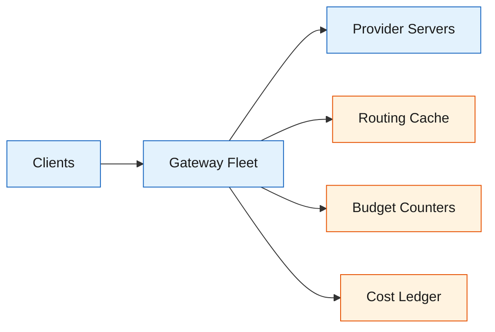
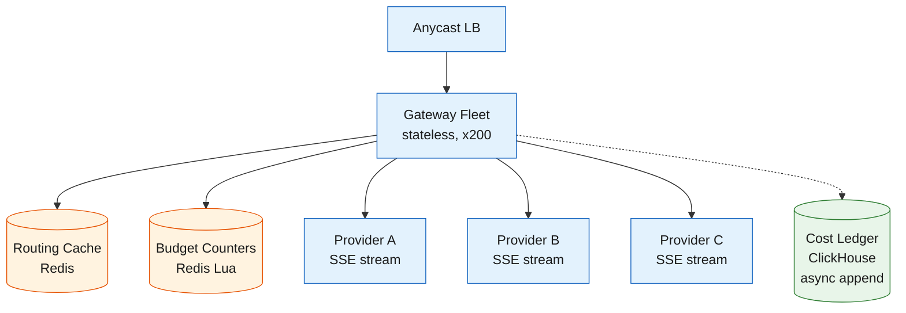
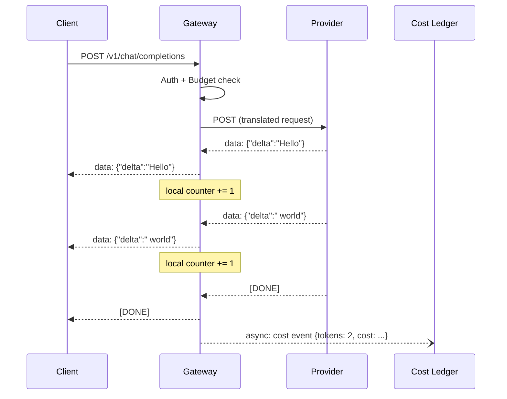
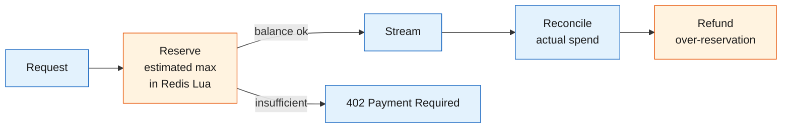

An LLM API gateway sits between application code and the 200+ models available across dozens of inference providers. Developers send one request in one format to one endpoint.

<!--more-->

## 1. Problem

An LLM API gateway sits between application code and the 200+ models available across dozens of inference providers. Developers send one request in one format to one endpoint. The gateway picks a model, picks a provider, translates the wire format, streams the response back, tracks cost, and enforces budget - all before the first token reaches the caller.

The load is asymmetric in two dimensions. Requests land at 20K QPS sustained with 50K peaks (assumed) and range from 50-token classification calls to 100K-context agentic turns consuming millions of tokens. Token throughput - not request count - is the resource that saturates first. A gateway billing by request leaves money on the table for short calls and bleeds on long ones.

Two forces pull in opposite directions. Throughput demands keep the proxy as thin as possible: a streaming pipe that touches tokens only for metering, with no buffering, no blocking inspection, no serialization round-trips on the hot path. Multi-tenancy demands per-tenant isolation at every layer - routing policy, rate limits, spending caps, cache namespaces - so one noisy or adversarial tenant cannot degrade another. Reconciling those forces shapes every component: a routing engine fast enough to decide in under 30ms (target), a streaming proxy that adds under 20ms first-byte overhead (target), a budget system accurate to under 1% (target), and a failover mechanism that does not double-bill.



## 2. Requirements

**Functional**

- FR1: Send chat completion requests to a single OpenAI-compatible endpoint.
- FR2: Route each request to a provider based on cost, latency, and health.
- FR3: Stream response tokens as they are generated.
- FR4: Retry failed requests on alternate providers without double-billing.
- FR5: Enforce per-tenant token budgets and reject over-limit requests.
- FR6: Record per-request cost attribution for billing and chargeback.

**Non-functional**

- NFR1: 20K QPS sustained, 50K peak (assumed).
- NFR2: Routing decision under 30ms p99 (target).
- NFR3: 99.95% gateway availability (target).
- NFR4: Token budget error under 1% of actual spend (target).
- NFR5: First-byte proxy overhead under 20ms p99 (target).

*Out of scope: model training, GPU cluster management, content moderation, prompt engineering.*

## 3. Back of the envelope

- **Token throughput:** 20K QPS × 2,500 avg tokens/request = 50M tokens/s peak → egress bandwidth of ~15 Gbps (derived: 50M × 2.5 bytes/token compressed); the proxy must sustain that without queuing.
- **Cost ledger volume:** 20K QPS × 86.4K s/day = 1.7B rows/day → ~30 GB/day compressed (assumed); append-only columnar storage is the right shape.
- **Concurrent streams:** 50K peak QPS × 3.2 s avg response time = 160K concurrent open connections (derived: Little's Law); the fleet must hold that many sockets without head-of-line blocking.

## 4. Entities

```
Tenant {
  tenant_id:    uuid      PK
  org_id:       uuid      FK → Organization
  routing_policy: jsonb   ← {strategy: "price"|"latency"|"pinned", overrides: {...}}
  budget_limit_usd: decimal(12,4)  ← null = inherit from org
  budget_used_usd:  decimal(12,4)  ← denormalized, updated by reconciliation
  status:       enum      ← active|suspended
  created_at:   timestamp
}

Request {
  request_id:      uuid      PK
  tenant_id:       uuid      FK → Tenant
  model:           string    ← e.g. "openai/gpt-4o"
  provider:        string    ← provider chosen by router
  input_tokens:    integer
  output_tokens:   integer
  cost_usd:        decimal(12,6)
  latency_ms:      integer
  cache_hit:       boolean
  status:          enum      ← success|failed|budget_blocked
  created_at:      timestamp ← partition key (daily)
}

ProviderHealth {
  provider:        string    CK
  model:           string    CK
  error_rate_5m:   decimal(3,2)
  latency_p50_ms:  integer
  latency_p99_ms:  integer
  cooldown_until:  timestamp  ← null = healthy
  updated_at:      timestamp
}
```

### API

- `POST /v1/chat/completions` - send a chat completion; returns SSE stream or JSON response.
- `GET /v1/models` - list available models with provider and pricing metadata.
- `POST /v1/keys` - create an API key scoped to a tenant with rate-limit overrides.
- `GET /v1/usage?tenant_id={id}&from={ts}&to={ts}` - query token usage and cost within a window.
- `GET /v1/health` - gateway health check; returns provider availability table.

## 5. High-Level Design



The gateway fleet is stateless behind an anycast load balancer. Every instance runs the same four-stage pipeline: authenticate and resolve tenant, route to provider, stream the response, and record cost asynchronously. No instance holds session state; a request can land on any instance and complete with identical behavior.

#### FR1: Send chat completion requests to a single OpenAI-compatible endpoint

- **Components:** Gateway fleet, provider adapter layer, wire-format translator.
- **Flow:**
  1. Client sends `POST /v1/chat/completions` with an OpenAI-shaped JSON body and an `Authorization: Bearer <key>` header.
  1. Gateway validates the key, resolves the tenant, and checks the budget counter in Redis. If over limit, return `402 Payment Required`.
  1. Router selects a provider (see FR2). The adapter layer maps the OpenAI-format `model` field to the provider's model identifier.
  1. Translator converts the request body from OpenAI format to the provider's wire format (Anthropic Messages, Bedrock ConverseStream, etc.).
  1. Gateway opens an upstream connection to the provider, sends the translated request, and begins streaming SSE frames back to the client.
- **Design consideration:** The wire-format translation must happen frame-by-frame without buffering the entire response. A provider returning `content_block_delta` events must be converted to `choices[0].delta.content` SSE chunks on the fly - buffering would destroy the streaming experience by adding seconds to time-to-first-token.

#### FR2: Route each request to a provider based on cost, latency, and health

- **Components:** Router engine, health board, pricing table.
- **Flow:**
  1. Router reads the tenant's routing policy (default: price-weighted, can be overridden to latency-first or pinned-provider).
  1. Health board is checked: providers with significant error rates in the last 30 seconds (default) are deprioritized to the end of the candidate list.
  1. Among healthy providers for the requested model, candidates are weighted by inverse square of price: a $1/M-token provider gets 9× the selection probability of a $3/M provider.
  1. Selected provider is returned; remaining candidates form the fallback chain.
- **Design consideration:** Model and provider are two independent routing dimensions. Decoupling them collapses the combinatorial space: 400 models × 70 providers does not require a 28,000-entry routing table. The model is selected by the client (or an auto-router), and provider selection applies independently.

#### FR3: Stream response tokens as they are generated

- **Components:** Streaming proxy, non-blocking token counter, SSE frame parser.
- **Flow:**
  1. Upstream SSE frames from the provider arrive on a non-blocking socket.
  1. Each `data: {...}\n\n` chunk is parsed for the `delta` token field.
  1. Token count is incremented atomically in a local accumulator (not Redis - avoids adding per-token latency).
  1. The raw SSE frame is flushed directly to the client socket without transformation.
- **Design consideration:** The proxy holds two half-duplex streams and never buffers a full response. Token counting happens asynchronously off the hot path - the counter reads the same bytes that pass through to the client, but it does not gate delivery.

#### FR4: Retry failed requests on alternate providers without double-billing

- **Components:** Fallback chain, cooldown state machine, cost reconciliation.
- **Flow:**
  1. If the primary provider returns 429, 5xx, or a timeout, the gateway marks the provider as degraded.
  1. Request is re-translated to the next provider in the fallback chain and re-sent.
  1. A `request_group_id` ties all attempts to the same logical request.
  1. The cost ledger records only the successful attempt. Failed attempts are logged with zero cost.
- **Design consideration:** The cooldown state machine enters COOLDOWN on a 429 or auth error, evicts the provider for 5 seconds (default), then re-enters in HALF-OPEN with a single probe request. This prevents thundering-herd retries against an already-overloaded provider.

#### FR5: Enforce per-tenant token budgets and reject over-limit requests

- **Components:** Budget counters (Redis Lua), reservation-and-reconciliation loop.
- **Flow:**
  1. On request arrival, estimate maximum possible spend: `prompt_tokens × input_price + max_output_tokens × output_price`.
  1. Atomically reserve that amount from the tenant's budget bucket in Redis via a Lua script. If insufficient balance, return `402`.
  1. After the stream completes, reconcile: deduct actual spend and refund the over-reservation.
- **Design consideration:** Reservation prevents a single 100K-context request from blowing past the budget mid-stream. The Lua script guarantees the check-and-deduct is atomic, so two concurrent requests cannot both pass the balance check and then collectively overspend.

#### FR6: Record per-request cost attribution for billing and chargeback

- **Components:** Cost ledger (ClickHouse), async event pipeline.
- **Flow:**
  1. On stream completion, the gateway emits a cost event: `{request_id, tenant_id, model, provider, input_tokens, output_tokens, cost_usd, latency_ms, cache_hit}`.
  1. Events are buffered in-memory and flushed to ClickHouse in micro-batches every 100ms (default).
  1. ClickHouse stores the append-only table partitioned by day. Queries aggregate by tenant, model, or provider for dashboards and internal chargeback.
- **Design consideration:** The cost ledger is an append-only event stream, never updated in place. This keeps write throughput high and makes every cost record auditable. The async flush means a gateway crash can lose up to 100ms (default batch window) of cost events - acceptable because the event window is small and the primary budgeting system (Redis counters) is durable.

## 6. Deep dives

### DD1: Model routing and provider selection

**Problem.** A single request must pick one of potentially dozens of providers for the same model. The decision must balance cost, latency, and reliability, and it must execute fast enough that routing overhead is invisible to the caller. A naive round-robin ignores price differences; a cheapest-only strategy routes every request to the same provider, creating a single point of failure.

**Approach 1: Static round-robin**

Distribute requests evenly across all providers for a model. Equal load, zero decision cost.

- **Challenges:** Ignores price heterogeneity - a provider at $15/M tokens (assumed illustrative) gets the same traffic as one at $0.15/M, driving total cost up proportionally. No health awareness - a degraded provider still receives its share.

**Approach 2: Cheapest-first with failover**

Always pick the lowest-cost healthy provider. Fall back to the next cheapest on failure.

- **Challenges:** Creates a hot spot. The cheapest provider receives all traffic until it degrades; then the second-cheapest receives everything. The system oscillates between providers instead of distributing load. A provider that is 5% cheaper but 2× slower is always chosen.

**Approach 3: Inverse-square price weighting with health deprioritization**

Among healthy providers, weight each candidate by `1/price^2`. A provider at $1/M tokens is 9× more likely to be selected than one at $3/M. Providers with significant error rates in the last 30 seconds move to the end of the candidate list but are never fully removed.

- **Decision:** Approach 3 - inverse-square price weighting with soft health deprioritization.
- **Rationale:** The inverse-square curve preserves price sensitivity without creating a hot spot. A provider at $1/M tokens (assumed illustrative) gets proportionally more traffic than one at $3/M, but the $3/M provider still receives some load and stays warm. Soft deprioritization (moving to the back, not ejecting) means a provider can recover without being starved of traffic entirely - its probe requests still flow, albeit at reduced volume. The 30-second window (default) is short enough that transient blips do not cause persistent routing changes, but long enough that a genuine outage is detected. The alternative - a hard eject with a HALF-OPEN probe - risks a provider sitting idle for the cooldown period and then receiving a burst when re-enabled.
- **Edge cases:**
  - **All providers degraded:** The gateway returns a `503` with a list of affected providers and retry guidance.
  - **New provider with no health data:** Starts at the front of the candidate list (optimistic bootstrap) and is deprioritized if errors appear within the first 30 seconds (default).
  - **Price change mid-flight:** The pricing table is cached locally on each gateway instance with a 60-second TTL (default). A stale price for one request is tolerated; the cost ledger records the price that was actually used.

### DD2: Streaming proxy architecture

**Problem.** The gateway must deliver tokens as soon as the upstream provider produces them - buffering the response to inspect or transform it adds seconds of latency and destroys the value proposition of streaming. Yet the gateway must also track token consumption, translate wire formats, and handle mid-stream failures, all without pausing the downstream stream.

**Approach 1: Buffer-then-inspect**

Read the complete upstream response into memory. Parse, validate, translate, and count tokens. Send the transformed response to the client.

- **Challenges:** Time-to-first-token jumps from ~200ms to 4+ seconds (derived: buffering a 500-token response at 120ms decode latency). The client sees nothing until the entire response is ready - the interaction feels broken.

**Approach 2: Pass-through with deferred accounting**

Proxy SSE frames verbatim. Log tokens to a local counter; flush the counter to the cost ledger after the stream ends. No per-token Redis writes.

- **Decision:** Approach 2 - pass-through streaming with async local accounting.
- **Rationale:** The proxy holds two half-duplex sockets: one reading from the upstream provider, one writing to the downstream client. On each upstream `data:` frame, the proxy parses the embedded token delta, increments a local atomic counter, and flushes the raw bytes to the client socket - all within the same event-loop tick. The local counter accumulates in memory; on stream completion or error, the gateway emits a single cost event to the async ledger pipeline. This adds under 1ms of CPU overhead per frame (assumed, single-event-loop-tick upper bound) and no blocking I/O. The trade-off is that a gateway crash mid-stream loses the partial token count - acceptable because the budget reservation (see DD3) already reserved the maximum possible spend, and the crash means the upstream provider also stopped producing, so the actual billed cost is bounded.
- **Edge cases:**
  - **Mid-stream provider failure:** Gateway detects a broken upstream socket, signals `[DONE]` to the client with a truncated response, and triggers retry on the next provider in the fallback chain. The `request_group_id` ensures only the successful attempt is billed.
  - **Wire-format translation on the fly:** When provider A speaks Anthropic `content_block_delta` events and the client expects OpenAI `choices[0].delta.content` SSE, the proxy performs frame-by-frame translation. Each upstream event maps to one downstream SSE chunk - no buffering needed.
  - **Client disconnects mid-stream:** Gateway closes the upstream socket to stop incurring provider costs. The partial cost is recorded and reconciled.



### DD3: Rate limiting and multi-tenant billing

**Problem.** Tenants share the same gateway infrastructure but must be isolated on spend. A single tenant issuing 100K-context requests can consume the budget of the entire org in seconds. The rate-limiting system must enforce both token-per-minute caps and hard dollar budgets, operate at sub-millisecond latency, and survive Redis partition without allowing unbounded overspend.

**Approach 1: Post-hoc billing**

Log every request. Run a nightly batch job to compute per-tenant cost. Block tenants after the fact if they exceed budget.

- **Challenges:** A tenant can overspend by the full day's allocation before the batch job runs. No real-time enforcement. Bills can be unexpectedly large.

**Approach 2: Distributed token bucket with reservation**

On each request, estimate the maximum possible spend, atomically reserve it from a Redis Lua token bucket, and reconcile actual spend on completion. Reject requests that would exceed the bucket.

- **Decision:** Approach 2 - reservation-and-reconciliation with regional Redis for retail tenants, global Redis for hard limits.
- **Rationale:** The Lua script runs inside Redis, so the read-check-decrement is a single atomic operation with no round-trips. The reservation over-estimates (it assumes all `max_output_tokens` are consumed), which means the budget bucket drains faster than actual spend and the tenant hits the limit slightly early - but never overspends. Reconciliation refunds the over-reservation, so the bucket refills to the correct level within the request's lifetime. The trade-off is that a tenant issuing only short completions against a high `max_output_tokens` parameter will see their effective budget limit reduced by the over-reservation ratio. To bound this, the gateway caps the reservation at `min(max_output_tokens, actual_context_window_remaining)` and uses a separate over-reservation buffer (10% of the total budget, configurable) to absorb the gap.
- **Edge cases:**
  - **Redis partition (regional mode):** A partition means the gateway instance cannot reach its local Redis. The gateway enters a degraded mode: it rejects budget-checked requests with a `503` and a retry hint, but allows pass-through for tenants with a `pinned` routing policy and no budget limit. This prevents a Redis outage from taking down the entire gateway.
  - **Budget exhaustion mid-stream:** The reservation was already deducted. The stream continues to completion - cutting off mid-stream is worse for the user experience than letting the final few tokens through. The tenant's next request is blocked.
  - **Per-user vs. per-org hierarchy:** Budget buckets are nested. A user's bucket is a child of a team bucket, which is a child of the org bucket. A deduction from the user bucket also decrements the team and org buckets. If the org bucket is empty, all sub-buckets are effectively drained regardless of their individual balances.



### DD4: Prompt caching and cost optimization

**Problem.** Many requests share common prefixes - system prompts, few-shot examples, conversation histories - that are re-sent and re-processed on every call. Caching those prefixes at the gateway layer avoids re-sending them to the provider, which directly reduces per-request token cost and latency. The challenge is that caching must not leak information across tenants, and cache-hit decisions must execute fast enough to not add routing overhead.

**Approach 1: Provider-side caching only**

Rely on the provider's own prompt caching (Anthropic prompt caching, OpenAI automatic caching). The gateway does nothing - each request carries the full prefix.

- **Challenges:** Provider-side caching is opaque. The gateway cannot predict or measure cache hit rates. Prefixes that repeat across providers are not deduplicated. And the tenant still pays for the cached tokens at a reduced rate, not zero.

**Approach 2: Gateway-side exact-match cache**

Hash the full request payload (model + messages). On a cache hit, return the cached response directly. On a miss, forward to the provider and store the response.

- **Challenges:** Exact-match is fragile - a single character difference in the user message (a trailing space) defeats the cache. Only identical requests benefit. Hit rate is low for anything beyond system prompts.

**Approach 3: Two-tier cache with prefix-aware hashing**

Tier 1 (local LRU per gateway instance): cache only the system prompt and the first N messages of the conversation. Keyed by `hash(tenant_id, model, messages[0..N])`. TTL: 10 minutes (default). Tier 2 (distributed Redis): cache exact request-response pairs for high-frequency queries. TTL: 1 hour (default). On a prefix hit at tier 1, the gateway sends only the uncached suffix (the new user message) to the provider, appending the cached prefix server-side via the provider's own prompt-caching mechanism.

- **Decision:** Approach 3 - two-tier cache with tenant-scoped keys and provider-assisted prefix injection.
- **Rationale:** The local LRU cache eliminates the network round-trip for the most common case: repeated calls with the same system prompt from the same tenant. A 10-minute TTL (default) covers the typical session lifetime. The distributed Redis tier captures exact matches across the fleet, useful for high-traffic shared prompts (e.g., a product FAQ bot). Tenant ID is hashed into every cache key, so two tenants with identical system prompts get separate cache entries - they cannot observe each other's cache state through timing side channels. The cost saving is proportional to the prefix-to-suffix ratio: a 4K-token system prompt + 100-token user message sees a 97.5% token reduction on cache hit (derived: 100/(4000+100)).
- **Edge cases:**
  - **Cache stampede:** On a cold start or TTL expiry, multiple gateway instances may all miss simultaneously and forward identical requests to the provider. Mitigated by lock leasing: the first instance to miss acquires a short-lived lock in Redis, fetches from the provider, populates the cache, and releases the lock; other instances wait on the lock instead of forwarding.
  - **Cross-tenant prefix collision at the provider:** If two tenants share a provider-side KV cache pool, their requests sharing a prefix could collide. Mitigated by salting the prefix with a tenant-specific nonce before sending to the provider, forcing separate cache entries at the cost of reduced cross-tenant reuse.
  - **Cache invalidation on model update:** When a model version changes (e.g., `gpt-4o-2024-08-06` → `gpt-4o-2024-11-20`), cached responses from the old version are stale. The cache key includes the full model identifier, so a version bump automatically invalidates all entries for that model.

## 7. References

1. [OpenRouter - Model Routing](https://openrouter.ai/blog/insights/model-routing/)
1. [OpenRouter - LLM Gateway: What It Is and How to Choose One](https://openrouter.ai/blog/insights/llm-gateway/)
1. [Anthropic - Scaling Managed Agents](https://www.anthropic.com/engineering/managed-agents)
1. [Anthropic - How We Contain Claude](https://www.anthropic.com/engineering/how-we-contain-claude)
1. [OpenAI - Scaling PostgreSQL to Power 800M ChatGPT Users](https://openai.com/index/scaling-postgresql/)
1. [OpenAI - Speeding Up Agentic Workflows with WebSockets](https://openai.com/index/speeding-up-agentic-workflows-with-websockets/)
1. [Together AI - Production Platform for Open-Weight AI Inference](https://www.together.ai/blog/the-production-platform-for-open-weight-ai-inference)
1. [DeepInfra - Building Efficient AI Inference on NVIDIA Blackwell](https://deepinfra.com/blog/nvidia-blackwell-efficient-ai-inference)
1. [DeepInfra - Inference Economics: True AI Costs at Scale](https://deepinfra.com/blog/inference-economics-true-ai-costs-at-scale)
1. [Tianpan - Inference Gateway Pattern](https://tianpan.co/blog/2026-04-13-inference-gateway-pattern)
1. [Preto - LLM Proxy Architecture](https://preto.ai/blog/llm-proxy-architecture/)
1. [Groq - Inside the LPU: Deconstructing Groq Speed](https://groq.com/blog/inside-the-lpu-deconstructing-groq-speed)
