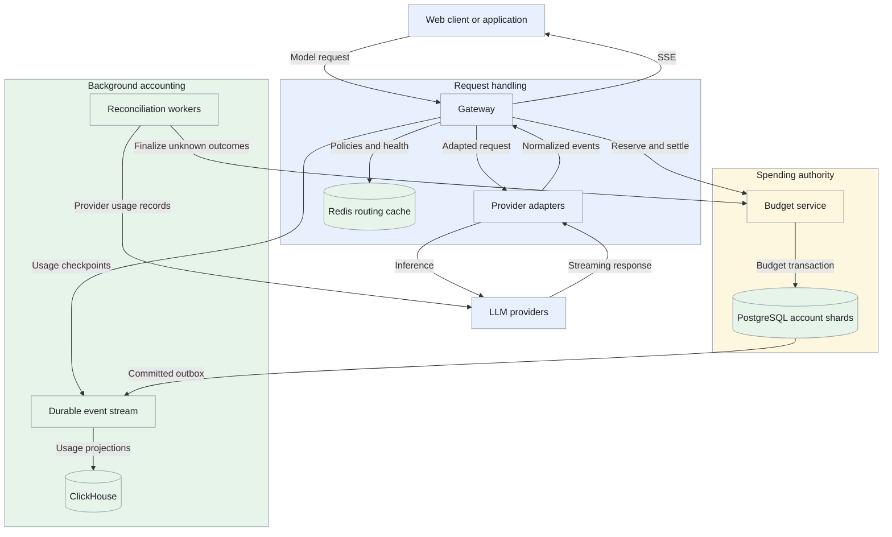
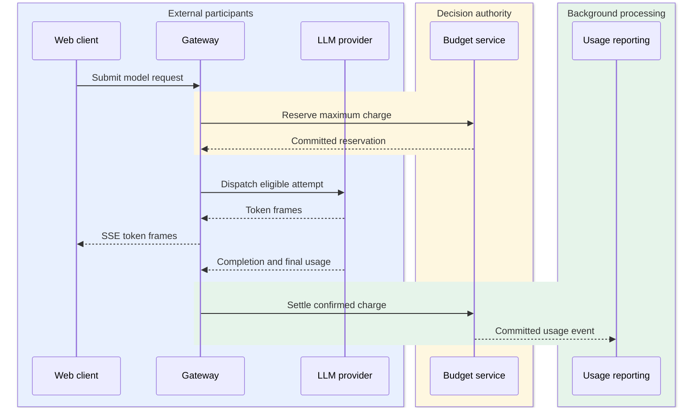
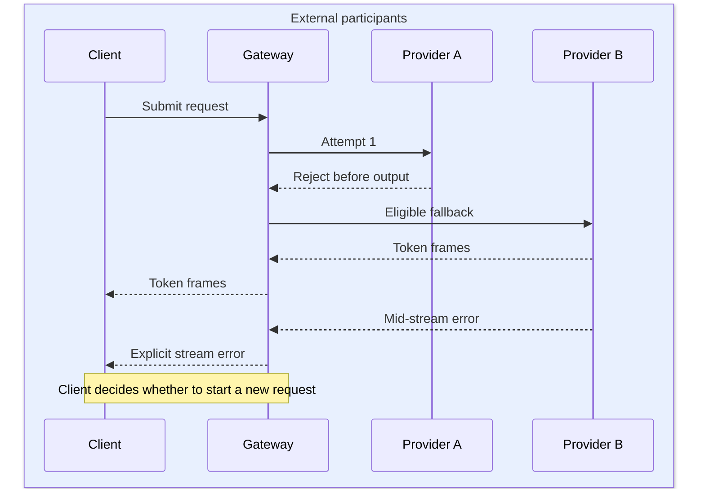
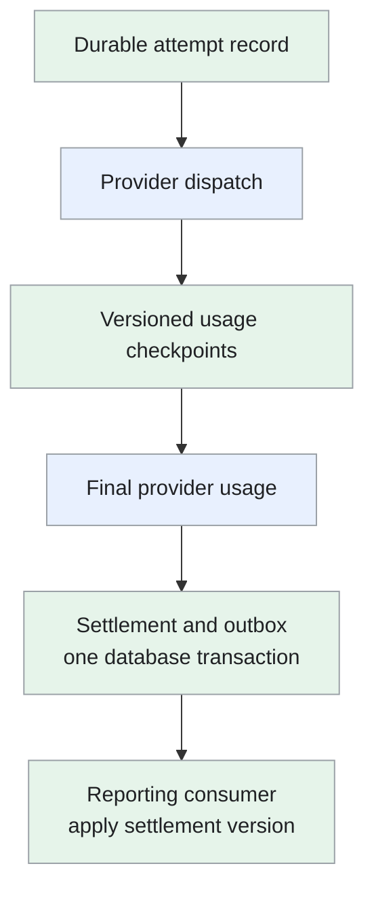

An OpenRouter-style gateway that gives applications one API for multiple LLM providers, with streaming, routing policies and tenant-level spending controls.

<!--more-->

## Problem

An application submits a model request to the gateway instead of integrating with each provider separately. The gateway chooses a compatible provider, adapts the request and streams the response back through the same API.

Provider availability, prices and request formats vary. The gateway therefore needs a routing policy, a clear fallback boundary and durable usage records. Spending controls reserve budget before inference starts; detailed reporting runs separately from token delivery.

## Requirements

### Functional requirements

- **Submit model requests.** Accept chat-completion requests through one compatible API and expose a model catalog.
- **Route by policy.** Select providers using supported features, privacy requirements, cost, latency and health.
- **Stream responses.** Translate provider events and deliver tokens incrementally.
- **Handle eligible failures.** Try another provider before response output begins, subject to retry and spending limits.
- **Control spending.** Enforce tenant and organization budgets, request limits and maximum output length.
- **Report usage.** Attribute customer charges and upstream costs to each logical request and provider attempt.

### Non-functional requirements

- **Scale:** 20K requests/s sustained and 50K at peak; size separately for tokens and concurrent streams.
- **Latency:** P99 routing below 30ms; P99 gateway processing overhead below 20ms before the first response byte, excluding provider inference and network time.
- **Availability:** 99.95% for gateway request admission, subject to eligible upstream capacity.
- **Consistency:** commit reservations before forwarding; settle each reservation once; retain unresolved usage for reconciliation.
- **Accounting:** target less than 1% discrepancy after provider reconciliation; track pending estimates separately from finalized charges.
- **Isolation:** scope API keys, caches, budgets and usage queries to the authorized tenant.

## Back-of-the-envelope calculations

- **Tokens:** 20K requests/s × 2,500 input-plus-output tokens = 50M tokens/s sustained; 50K requests/s gives 125M tokens/s at the same mix.
- **Response bandwidth:** assuming 500 output tokens/request and four text bytes/token, sustained output is about 40MB/s before SSE framing, TLS and retransmission.
- **Open streams:** 50K requests/s × 3.2s mean duration = 160K concurrent streams. Longer generations increase this directly.
- **Accounting events:** 20K × 86,400 = 1.73B completed requests/day. At 200 bytes/event, one event per request is about 346GB/day raw, before attempt and reservation records.

Capacity tests vary context length, output length and slow-client behavior. Requests per second alone does not describe inference cost or connection memory.

## Core entities

```protobuf
message Tenant {
  string tenant_id;
  string organization_id;
  string routing_policy_id;
  string budget_account_id;
  string status;
}

message Request {
  string request_id;
  string tenant_id;
  string idempotency_key;             // Bound to the normalized request body
  string model;
  string state;                       // RESERVED, STREAMING, COMPLETE, FAILED, UNKNOWN
  string reservation_id;
  google.protobuf.Timestamp created_at;
}

message ProviderAttempt {
  string attempt_id;
  string request_id;
  string provider;
  string provider_request_id;         // Reconciliation handle when supported
  string price_version;
  uint64 input_tokens;
  uint64 output_tokens;
  string upstream_cost_microunits;
  string outcome;
}

message BudgetReservation {
  string reservation_id;
  string request_id;
  string budget_account_id;
  string reserved_microunits;          // Integer currency amount
  string settled_microunits;
  string state;                       // HELD, SETTLED or UNKNOWN
}

message ProviderHealth {
  string provider;
  string model;
  double recent_error_rate;
  uint32 first_token_p99_ms;
  string circuit_state;               // CLOSED, OPEN or HALF_OPEN
  google.protobuf.Timestamp updated_at;
}
```

A `Request` identifies the customer operation; `ProviderAttempt` identifies each upstream call. Customer billing policy and provider invoices are recorded separately. Money uses fixed-precision integer amounts, with currency and conversion rules defined by the budget account.

## API

```yaml
POST /v1/chat/completions:
  headers: {Authorization: Bearer_key, Idempotency-Key: string}
  body: {model: string, messages: array, stream: boolean, max_tokens: integer, provider: object}
  result: SSE_stream_or_JSON
  errors: [400_invalid_request, 402_budget_exhausted, 409_request_in_progress, 429_rate_limit, 503_no_provider]

GET /v1/models:
  result: {models: array, catalog_version: string}

POST /v1/keys:
  body: {tenant_id: string, scopes: array, limits: object}
  result: {key_id: string, secret: returned_once}

GET /v1/usage:
  query: {tenant_id: string, from: timestamp, to: timestamp}
  result: {finalized: object, pending: object, last_updated_at: timestamp}

GET /v1/health:
  result: {gateway_status: string}
```

An active idempotency key returns the existing request state rather than starting another inference. Completed non-streaming results can be replayed within the retention window; streaming replay requires an explicitly retained event log. Reusing a key with different input returns a conflict.

## High-level design

Stateless gateways handle authentication, routing and stream translation. A budget service commits reservations in PostgreSQL; Redis provides routing and rate-limit caches. A durable event pipeline feeds reporting and provider-cost reconciliation.


```mermaid
flowchart TB
  C[Web client or application]
  U[LLM providers]
  subgraph Request["Request handling"]
    G[Gateway]
    A[Provider adapters]
    R[(Redis routing cache)]
  end
  subgraph Spending["Spending authority"]
    B[Budget service]
    P[(PostgreSQL account shards)]
  end
  subgraph Accounting["Background accounting"]
    E[Durable event stream]
    H[(ClickHouse)]
    X[Reconciliation workers]
  end
  C -->|Model request| G
  G -->|Policies and health| R
  G -->|Reserve and settle| B
  B -->|Budget transaction| P
  G -->|Adapted request| A
  A -->|Inference| U
  U -->|Streaming response| A
  A -->|Normalized events| G
  G -->|SSE| C
  G -->|Usage checkpoints| E
  P -->|Committed outbox| E
  E -->|Usage projections| H
  X -->|Provider usage records| U
  X -->|Finalize unknown outcomes| B
  classDef request fill:#e8f0fe,stroke:#9aa0a6,color:#202124,stroke-width:1px
  classDef background fill:#e6f4ea,stroke:#9aa0a6,color:#202124,stroke-width:1px
  classDef control fill:#fef7e0,stroke:#9aa0a6,color:#202124,stroke-width:1px
  class C,G,A,U request
  class R,P,E,H,X background
  class B control
  style Request fill:#e8f0fe,stroke:#9aa0a6,color:#202124,stroke-width:1px
  style Spending fill:#fef7e0,stroke:#9aa0a6,color:#202124,stroke-width:1px
  style Accounting fill:#e6f4ea,stroke:#9aa0a6,color:#202124,stroke-width:1px
```

## Storage

- **[PostgreSQL](/designs/tech-postgresql/):** API-key metadata, routing policies, budget accounts, reservations and authoritative settlement records. Shard by organization and colocate child budget accounts so tenant and organization deductions share one transaction. Index unresolved reservations for recovery; unique request and settlement IDs protect retries.
- **[Redis](/designs/tech-redis/):** short-lived model catalogs, provider-health summaries, local rate-limit coordination and eligible answer caches. Redis loss can reduce capacity or cache hit rate; durable budget balances remain in PostgreSQL.
- **Durable event stream:** reservation outbox events and usage checkpoints, partitioned by request or account. Consumers replay with stable event IDs.
- [**ClickHouse**](/designs/tech-clickhouse/)**:** usage and cost reporting, partitioned by date and ordered for tenant/model/provider queries. Versioned records and explicit deduplication provide the reporting view; background table merges alone are insufficient for an authoritative billing total.

Database row locks and committed reservations supply the spending invariant. See [PostgreSQL's locking behavior](https://www.postgresql.org/docs/current/explicit-locking.html#LOCKING-ROWS). High-volume accounts require measured admission throughput or a separately designed allocation of durable budget leases.

## From request to response

### One streaming request

The gateway reserves enough budget before starting provider work. Tokens travel directly back through the gateway; finalized usage then settles that reservation and feeds reporting. This sequence shows a successful request. The retry and recovery deep dives explain rejected and uncertain attempts.


```mermaid
sequenceDiagram
  box rgb(232,240,254) External participants
    participant C as Web client
    participant G as Gateway
    participant P as LLM provider
  end
  box rgb(254,247,224) Decision authority
    participant B as Budget service
  end
  box rgb(230,244,234) Background processing
    participant R as Usage reporting
  end
  C->>G: Submit model request
  rect rgb(254,247,224)
    G->>B: Reserve maximum charge
    B-->>G: Committed reservation
  end
  rect rgb(232,240,254)
    G->>P: Dispatch eligible attempt
    P-->>G: Token frames
    G-->>C: SSE token frames
    P-->>G: Completion and final usage
  end
  rect rgb(230,244,234)
    G->>B: Settle confirmed charge
    B-->>R: Committed usage event
  end
```

The gateway dispatches only after the reservation commits. Token delivery uses the same logical request identity, while settlement and reporting retain their separate durable outcomes.

A committed reservation establishes the spending limit before inference. Reporting consumes settlement events afterward, so a dashboard query or reporting backlog does not add latency to individual token frames.

### Admitting a request

The gateway verifies the key, resolves the tenant and validates model features, context size and output limits. It filters providers by compatibility and data policy, estimates a conservative charge bound for the allowed attempts and reserves that amount.

The budget service locks the affected accounts, checks finalized spend plus held reservations against each limit, then writes the reservation and request identity together. Insufficient balance returns `402`; an unavailable budget authority returns `503`. The gateway forwards only after commit.

### Selecting and contacting a provider

The router selects among compatible healthy providers, using the tenant's price or latency preference and each provider's available capacity. The adapter maps model IDs, tool formats and streaming events. It records the provider attempt and price version before dispatch.

A fallback uses the same logical request ID and a new attempt ID. The gateway limits the total attempts and elapsed time. A provider failure can still incur upstream cost, which is retained independently of the customer charge.

### Delivering the response

The proxy forwards normalized SSE frames while tracking request state and provider usage. Bounded buffers and socket backpressure prevent slow clients from growing memory indefinitely. Sustained backpressure cancels the upstream request and records an interrupted outcome.

Successful completion produces the final usage record and settlement. A mid-stream failure produces an explicit error and a failed stream outcome; the service preserves the distinction between completed and interrupted output.

### Settling usage

The settlement transaction replaces the held maximum with the finalized customer charge and writes an outbox event. A unique settlement key makes retries safe. Reporting consumers apply that event to the tenant's usage view.

On a crash or ambiguous upstream timeout, the reservation remains held while reconciliation queries provider usage or processes later events. Reservation age triggers investigation; an automatic TTL refund could release funds for inference that was already billed.

The durable writes add admission and settlement latency. Token-by-token budget transactions would multiply that cost, so the stream uses a committed reservation and bounded usage checkpoints.

## Deep dives

### How do we route by price while maintaining capacity?

**Problem.** Always selecting the cheapest endpoint can overload it, while round-robin ignores different costs, model capabilities and latency.

- **Round-robin:** rotate through compatible providers, giving each a similar request share. Routing is cheap and easy to inspect, but equal request counts ignore token volume, price and provider capacity; a slower endpoint can accumulate a queue while another has spare capacity.
- **Cheapest eligible provider:** send each request to the lowest-priced compatible endpoint. This minimizes quoted unit cost while capacity is available, but concentrates traffic there; throttling and fallback can increase completion time and actual total cost.
- **Health- and capacity-aware weighted selection:** sample among eligible providers using policy weights, then cap each provider's admitted concurrency. This spreads load while favoring cost or latency, but requires fresh telemetry, conservative capacity estimates and stable weight updates. Spare capacity at a higher price is sometimes the appropriate fallback.

**Recommendation: use weighted selection after eligibility filtering.** At the proposed 50K-request/s peak, providers have different limits and tenants have different routing goals. Weighted selection can honor those policies without sending the entire fleet to one cheap endpoint. We accept telemetry and tuning overhead, and occasional higher-priced routing, to preserve usable capacity. Keep model choice separate from provider choice. A price-focused policy can use inverse-square price weights, while a latency-focused policy ranks providers against first-token and throughput targets. [OpenRouter's routing documentation](https://openrouter.ai/docs/guides/routing/provider-selection) describes price-weighted routing and provider overrides.

A circuit breaker removes repeatedly failing endpoints, then allows bounded half-open probes. A provider-specific `429` respects its retry interval and capacity limits; invalid provider credentials disable that adapter until repaired. New providers receive limited trial traffic instead of an unrestricted optimistic share.

Cache catalog versions briefly and record the price used by each attempt. Stale health data reduces confidence; route conservatively or return `503` when no eligible provider remains. Track first-token latency, error rate, tokens/s and admitted share by endpoint.

**A routing decision, end to end**

For one request, build the eligible set using model identity, context/output limits, required tools or structured output, tenant allowlists, regional restrictions and the remaining deadline. A fast provider that cannot satisfy the requested schema is filtered out before scoring.

Suppose A costs \$1 per unit and B costs \$2. An inverse-square policy gives unnormalized weights 1 and 0.25, or an 80%/20% split before capacity adjustments. These are sampling weights, not a guarantee that A receives four requests before B receives one. If A's admitted concurrency is exhausted, it leaves the available set and B can accept more work.

```python
eligible = filter_capabilities(catalog_snapshot, request)
available = [p for p in eligible
             if breaker[p].allows_probe() and capacity[p].try_reserve()]
if not available:
    return capacity_error()
chosen = weighted_choice(available, policy_weights(available))
release_unused_capacity_reservations(available, except_provider=chosen)
```

Use a measured first-token estimate to reject a provider that cannot fit the deadline. Reserve an attempt slot before dispatch and release it when that attempt terminates; a timeout with an uncertain upstream outcome still counts as exposure. Persist the catalog/price version and selection reason so operators can reconstruct the decision. Maintain separate circuit-breaker state for transport failure, capacity rejection and model capability errors; combining them would disable otherwise healthy endpoints for the wrong reason.

### How do retries interact with streaming?

**Problem.** A fallback is straightforward before the user receives output. Once part of an answer is visible, starting another model creates a second generation with a potentially different answer.

- **Buffer the entire answer:** keep output at the gateway until generation finishes, replacing a failed attempt before exposing it. This makes fallback invisible to the client, but removes incremental delivery and retains the entire answer in memory while the user waits.
- **Fallback before output begins:** retry a definitely rejected attempt before forwarding the first token. The client receives one coherent generation with low first-token latency; after output begins, failure ends that stream rather than transparently recovering it.
- **Restart after partial output:** start another generation and identify it explicitly in the client protocol. This can recover usable output, but the application must discard or distinguish the partial answer; another attempt adds latency and can incur another provider charge.

**Recommendation: allow bounded fallback before output, then report a stream error after partial delivery.** Streaming is a core API capability here, so waiting for complete answers would defeat the user experience. The accepted limitation is that a partially delivered generation can fail visibly; an explicit terminal error is preferable to mixing two providers' answers. [OpenRouter's streaming contract](https://openrouter.ai/docs/api_reference/streaming) distinguishes errors before and during a stream. The proposed gateway uses the same clear boundary.


```mermaid
sequenceDiagram
  box rgb(232,240,254) External participants
    participant C as Client
    participant G as Gateway
    participant A as Provider A
    participant B as Provider B
  end
  C->>G: Submit request
  G->>A: Attempt 1
  A-->>G: Reject before output
  G->>B: Eligible fallback
  B-->>G: Token frames
  G-->>C: Token frames
  B-->>G: Mid-stream error
  G-->>C: Explicit stream error
  Note over G,C: Client decides whether to start a new request
```

Timeouts with an unknown upstream outcome retain an attempt record. Retry only when the provider supports safe idempotency or when the documented rejection proves inference did not begin; otherwise return the ambiguous outcome for reconciliation. External tools are executed by the application under their own idempotency rules.

Client disconnects cancel upstream work and preserve observed usage. Cancellation can race with provider completion, so final accounting may arrive later. Track fallback rate, interrupted streams and unknown-cost age separately.

**The exact retry boundary**

Track request state as `reserved → dispatching → accepted → streaming → completed/failed`, with a separate attempt ID for each provider call. The application idempotency key points to this one logical request; it does not make an external provider call idempotent.

Before the first frame reaches the client, an explicit rejection can move the request to the next eligible provider. If the provider has accepted work but the gateway loses the response, record `outcome_unknown` and reconcile before treating the attempt as free. An uncertain timeout and a definite rejection require different recovery.

After the first visible frame, the client has a particular answer in progress. A mid-stream failure therefore produces a terminal error event with the attempt ID and last delivered sequence. A new generation, if requested, receives a new identity and is shown explicitly.

```text
A rejects before inference  → fallback may start B
A accepts; response lost    → retain exposure; reconcile A
A sends tokens; then fails  → end this stream with an error
Client retries same key     → return the existing request's state
```

Cancellation is also an upstream operation with an outcome. Stop accepting new frames for the canceled epoch, request provider cancellation, and wait for final usage or recovery evidence before releasing its financial reservation. A disconnect alone is not proof that computation stopped.

### How do we enforce budgets under concurrent requests?

**Problem.** Reading a balance and updating it later lets concurrent requests spend the same remaining amount. Regional counters can also diverge during failover.

- **Reconcile after inference:** start work immediately and deduct its charge when usage arrives. Admission is cheap, but several concurrent requests can spend the same remaining balance, leaving a debt that reconciliation cannot prevent.
- **Redis atomic counters:** check and deduct allowance in one server-side operation. This gives fast coordination within that Redis authority, but acknowledged state can be lost during failover and parent/child accounts must share an atomic scope; hard durable budgets require an additional persistence protocol.
- **Durable reservations:** lock related budget rows and commit a maximum charge hold before dispatch. Competing requests observe committed exposure, including uncertain attempts. The cost is transaction latency, contention on busy accounts and unavailable balance tied up by conservative or unresolved holds.

**Recommendation: commit durable reservations on the organization's account shard.** This gateway promises tenant and organization spending limits while admitting requests concurrently. Colocating those accounts makes one transaction the admission authority. We accept lock contention and temporarily reduced concurrency to keep provider exposure within the committed allowance. The request's maximum output length, provider pricing and retry policy determine its charge bound. Unsupported or unbounded charging models require a stricter limit or separate policy.

```python
# One budget transaction; accounts locked in a stable order.
accounts = lock_budget_accounts(organization_id, tenant_id)
existing = find_request(tenant_id, idempotency_key)
if existing:
    return existing
reservation = conservative_charge_bound(request, eligible_providers, attempt_limit)
assert all(a.spend + a.held + reservation <= a.limit for a in accounts)
hold(accounts, reservation)
store_request_and_reservation(request, reservation)
commit()
```

A completed request settles once; unused reserved funds return to the available balance. An unresolved attempt retains its hold until provider evidence establishes a final charge. Periodic renewal and recovery ownership prevent abandoned handlers from silently releasing exposure.

All accounts in a hierarchy belong to the same authoritative shard. Cross-region requests use that authority or an explicitly preallocated durable sub-budget. Async Redis replication is a cache mechanism, not the basis for a hard global spending claim.

Large reservations reduce available concurrency. Bound `max_tokens`, use provider-specific token estimates and account for fixed charges or reasoning tokens where applicable. Measure reservation utilization, lock wait and settlement backlog.

**A concrete reservation transaction**

Assume a tenant has \$10 left. Two requests each need a maximum \$7 allowance. A read-then-write balance check would admit both. With both requests locking the same budget rows, the first commits a \$7 hold; the second sees only \$3 available and is rejected.

The unique key `(tenant_id, idempotency_key)` prevents a repeated submission from opening another hold. Store a hash of the request parameters too: reusing the key for a different model or token allowance returns a conflict. Acquire parent and child account locks in a stable order to prevent deadlocks.

Settle a \$7 reservation with a confirmed \$4 actual charge by atomically reducing held funds by \$7 and increasing spend by \$4. The remaining \$3 becomes available. A unique settlement ID and the request's expected state guard this transition.

```sql
-- Run while the request and affected budget rows are locked.
UPDATE reservations
SET state = 'settled', actual_charge = :confirmed_charge
WHERE request_id = :request_id AND state = 'held'
RETURNING reserved_charge;
-- Only the transaction that gets a row moves held funds to spend.
```

The conservative bound includes potentially billable fallback attempts, fixed fees and the configured output ceiling. A recovery worker claims unresolved reservations with a fenced lease and renews them while provider evidence is pending. Expiry of the handler lease schedules recovery; it does not erase the hold.

### What makes the cost ledger recoverable?

**Problem.** A gateway crash can lose its in-memory token count and an unflushed completion event. A short batch interval limits exposure but cannot reconstruct the lost usage.

- **Memory-only batching:** accumulate usage in gateway memory and publish completed batches. This minimizes durable writes, but a crash loses unacknowledged observations and may leave a billable attempt without recovery evidence.
- **Persist every frame:** store each delivered frame before advancing the stream. Recovery can replay output precisely, but storage and write traffic scale with streaming chunks; frame counts still cannot establish billable token usage.
- **Durable attempt records and checkpoints:** save provider identity before dispatch, publish cumulative usage versions and obtain final provider evidence during recovery. This bounds write volume while retaining reconciliation handles, but reports can remain pending and provider APIs may not expose the final usage needed to resolve every attempt.

**Recommendation: persist attempt identity before dispatch, checkpoint bounded usage and settle from finalized evidence.** The estimated 1.73B requests/day already produces substantial accounting traffic; durable writes per token would multiply it. Attempt-level recovery keeps token delivery independent of that traffic. We accept delayed settlement and a documented unresolved-usage policy where a provider supplies insufficient evidence. Provider-reported token counts are preferred over counting text fragments. A worker queries supported provider usage endpoints for unknown attempts; providers without recoverable records require a conservative documented billing policy.

Settlement and the corresponding outbox event commit together. Consumers use request, attempt and settlement versions to prevent double application. Reporting can lag behind the authoritative ledger and labels pending amounts separately.

Test crash points before dispatch, after upstream acceptance, during streaming and after settlement commit. Track unresolved reservations, provider/customer cost differences and reporting lag.

**Recovering one interrupted attempt**

Write the provider request ID, adapter version and reserved amount before dispatch. Record usage checkpoints as cumulative input/output counts with increasing versions. A replayed checkpoint replaces an older observation instead of adding the same tokens again.


```mermaid
flowchart TB
    A["Durable attempt record"] --> B["Provider dispatch"]
    B --> C["Versioned usage checkpoints"]
    C --> D["Final provider usage"]
    D --> E["Settlement and outbox<br>one database transaction"]
    E --> F["Reporting consumer<br>apply settlement version"]
  classDef request fill:#e8f0fe,stroke:#9aa0a6,color:#202124,stroke-width:1px
  classDef background fill:#e6f4ea,stroke:#9aa0a6,color:#202124,stroke-width:1px
  classDef control fill:#fef7e0,stroke:#9aa0a6,color:#202124,stroke-width:1px
  class B,D request
  class A,C,E,F background
```

If the gateway crashes after the provider finishes but before settlement, recovery retrieves the provider's final usage using that stored identity. If final usage is unavailable, the ledger exposes the amount as pending and follows the documented conservative policy. Text chunks may contain several tokens or parts of a token, so summing SSE frames cannot establish billable usage.

The reporting consumer stores the highest applied settlement version per request. Rebuilding ClickHouse reports replays that authoritative record, including corrections, rather than recreating charges from dashboard totals. Compare provider invoices with attempt-level evidence and retain discrepancy age as an operational metric.

### When should the gateway cache an answer?

**Problem.** Repeated prompts can reuse inference work, but request parameters, model changes and private context affect whether an old answer is eligible.

- **Provider prompt caching:** ask the provider to reuse supported prefix computation while still generating a response for the current request. This can reduce prefill work without reusing a completed answer, but support, retention and pricing vary by provider; decoding and output charges can remain.
- **Gateway exact-response caching:** key a completed answer by the complete eligible request and tenant. A hit avoids a new inference call, but exact equality limits reuse and model/policy changes require invalidation. Retaining private output also adds access and retention obligations.
- **Semantic response caching:** search for a sufficiently similar previous prompt and reuse its answer. This increases potential hits, but similarity is not equivalent intent: a changed number, negation or tool contract can make the cached answer wrong, requiring quality gates beyond exact-key checks.

**Recommendation: use provider prompt caching and opt-in exact-response caching.** Applications depend on correct tool contracts and tenant isolation, so a high cache-hit rate is secondary to eligible reuse. Prefix caching saves repeated setup; exact completed answers are reused only under explicit policy. We accept a narrower hit rate and provider-specific behavior instead of semantic answer substitution. Send the complete request unless the provider explicitly offers a stored-prefix handle. A gateway prefix hash alone cannot substitute for provider-side cache support.

The exact key includes tenant, model version, messages, tool definitions, generation settings and relevant policy versions. Cache completed eligible responses with bounded retention; tool-executing, time-sensitive or private requests require explicit rules.

Use single-flight population for identical requests, and invalidate entries when model or policy versions change. Customer cache-hit pricing is a declared policy distinct from provider inference cost. Track eligible hit rate, avoided upstream tokens and answer freshness.

**One cache entry and its lifecycle**

Suppose two requests have identical text but different tool definitions. They must produce different cache keys because the expected output contract differs. Include a server-controlled tenant identity in the key; clients cannot select another tenant's cache namespace.

An eligible miss obtains a short single-flight lease, performs inference, and stores only a completed response plus model/policy versions and expiry. Waiters use the stored response after completion or continue with their own admission decision when the lease fails. Partial output and unknown provider outcomes never become successful cache entries.

```text
Key: tenant + model revision + messages + tools + generation settings
Value: completed output + usage evidence + policy version + expires_at
```

A hit still applies current access and policy checks, then records the declared cache-hit charge independently of upstream cost. A model upgrade changes the namespace; a policy removal invalidates or rejects older entries. Semantic similarity is useful for candidate retrieval, but the first implementation keeps exact equality for response reuse because a small wording change can alter the correct answer. Measure hit rates only among eligible requests so the metric reflects actual avoided work.
