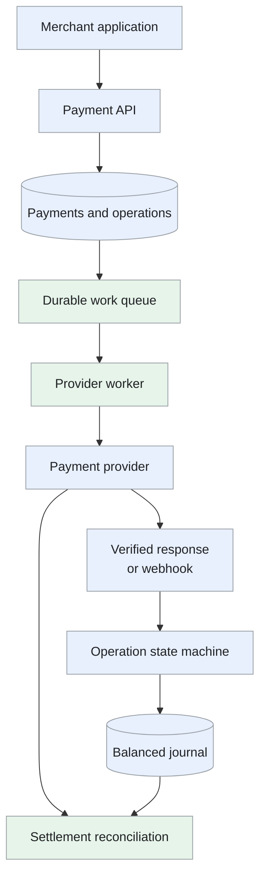
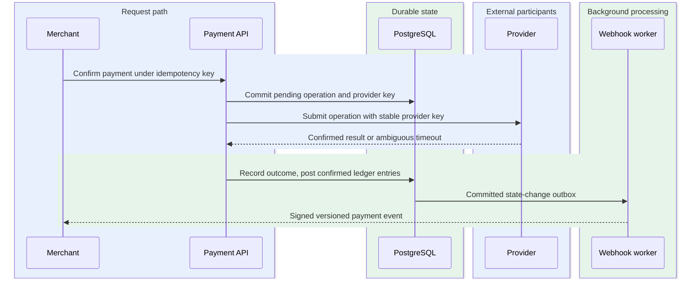
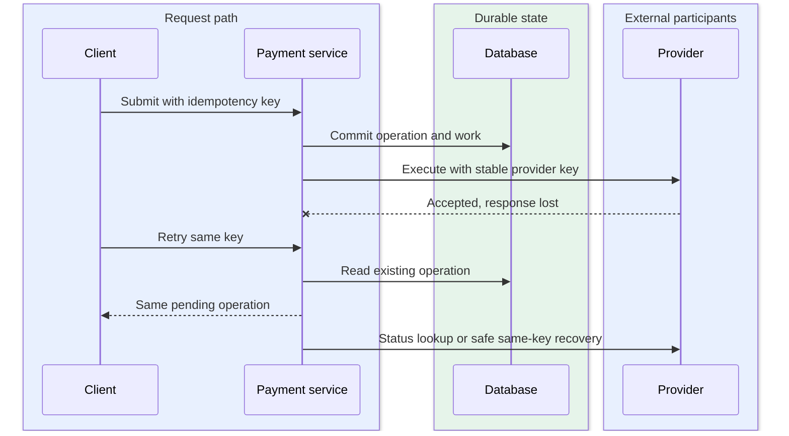

Design of a payment service with safe retries, provider integration, a balanced ledger and settlement reconciliation.

<!--more-->

## Problem

A merchant needs to collect a payment, check its status and return funds when required. The service coordinates these operations with an external payment provider and keeps an auditable record of the result.

A timeout can occur after the provider has accepted a charge. The service preserves an explicit processing state, retries the same logical operation safely and reconciles provider evidence before deciding what happened.

## Requirements

### Functional requirements

- **Create a payment:** record merchant, amount, currency and a tokenized funding method.
- **Authorize and capture:** reserve funds, then request capture within the authorization's permitted window.
- **View status:** return the current payment state and operation history.
- **Refund:** request a full or partial refund against a captured payment.
- **Process provider events:** verify and record asynchronous outcomes.
- **Reconcile:** match internal postings to provider transactions, fees and settlement reports.

### Non-functional requirements

Design targets:

- **Scale:** 1M payments/day and about 120 payment requests/s at peak.
- **Latency:** p99 below two seconds for a healthy provider authorization/capture response; return processing status while the outcome remains pending.
- **Integrity:** retries of one operation preserve one logical charge; journal postings balance within each currency.
- **Durability:** acknowledged operations remain recoverable after worker or database-node failure.
- **Security:** merchant-scoped access, tokenized methods, verified webhooks and restricted financial records.

Subscriptions, currency conversion and disputes are separate extensions. Tokenization reduces sensitive-data handling; compliance obligations still require a dedicated assessment.

## Back-of-the-envelope calculations

- **Request rate:** 1M / 86,400 ≈ 12/s average; 10× gives about 120/s peak.
- **Idempotency metadata:** 1M × 320 bytes × 30 days ≈ 9.6GB before indexes and replicas.
- **Ledger:** one balanced two-entry posting per payment at 200 bytes/entry adds about 146GB/year. Captures, refunds and fees add separate postings.
- **Provider concurrency:** 120 requests/s × two-second responses ≈ 240 in-flight requests. Apply per-provider limits and bounded queues.

## Core entities

- **Payment intent:** amount to collect and overall state.
- **Payment operation:** one authorization, capture or refund with its own retry identity.
- **Journal transaction:** a balanced set of immutable account entries.
- **Provider event:** received evidence awaiting durable processing.

```protobuf
message PaymentIntent {
  string payment_id;
  string merchant_id;
  int64 amount_minor_units;
  string currency;
  string payment_method_token;
  string status;
}

message PaymentOperation {
  string operation_id;
  string payment_id;
  string kind;                    // Authorize, capture, refund
  string idempotency_key;
  string request_hash;
  string provider_reference;
  string status;                  // Pending, unknown, succeeded, failed
}

message JournalTransaction {
  string journal_id;
  string operation_id;            // Unique posting for the operation
  string currency;
  repeated LedgerEntry entries;
  Timestamp posted_at;
}

message LedgerEntry {
  string account_id;
  int64 debit_minor_units;
  int64 credit_minor_units;
}

message ProviderEvent {
  string provider;
  string event_id;
  string provider_reference;
  string event_type;
  Timestamp received_at;
}
```

Balances derive from postings, optionally with transactionally maintained account totals. Authorization holds, capture receivables and cash settlement have distinct accounting states.

## API

```yaml
POST /v1/payment-intents:
  headers: {Idempotency-Key: merchant-request}
  body: {amount_minor_units: integer, currency: string, payment_method_token: string}
  response: {payment_id: string, status: created}

POST /v1/payment-intents/{payment_id}/authorize:
  headers: {Idempotency-Key: authorization-operation}
  response: {operation_id: string, status: string}

POST /v1/payment-intents/{payment_id}/capture:
  headers: {Idempotency-Key: capture-operation}
  body: {amount_minor_units: integer}

POST /v1/payment-intents/{payment_id}/refunds:
  headers: {Idempotency-Key: refund-operation}
  body: {amount_minor_units: integer}

GET /v1/payment-intents/{payment_id}:
  response: {status: string, operations: array, ledger_history: array}

POST /v1/webhooks/{provider}:
  body: signed_provider_event
```

A key identifies one operation for one merchant. Reusing it with different parameters returns a conflict. Partial captures and refunds receive separate operation IDs.

## High-level design

The API commits an operation before a worker contacts the provider. Responses and webhooks converge on the same state machine. Confirmed outcomes produce the appropriate balanced postings.



## Storage

- **[PostgreSQL](/designs/tech-postgresql/):** payments, operations, idempotency records, journal postings and outbox rows. Unique merchant/operation keys prevent duplicate local operations; locks or versions serialize captures and refunds.
- **Durable queue:** provider work is delivered at least once. Expiring worker leases recover crashes; each delivery carries the stable operation ID.
- **Object storage:** original settlement files and normalized import manifests, with checksums and access controls.
- **[Redis](/designs/tech-redis/):** optional status caching and rate limits. PostgreSQL remains authoritative for identity and outcomes.

Postings are append-only. Corrections use linked reversals or adjustments. Retention follows legal and operational policy rather than a cache TTL.

## From request to response

### One end-to-end request

The service commits one payment operation and provider key before making an external call.



A timeout preserves an unknown outcome for recovery; a confirmed result advances the ledger and webhook outbox in a transaction, using the same identities on every retry.

### Creating and authorizing a payment

Validate merchant access, amount, currency and funding token. In one transaction, reserve the request key and create the payment, authorization operation and work item.

The worker calls the selected provider with a stable provider key. Confirmed authorization updates the operation and hold state. A timeout records an unknown outcome and schedules a provider lookup or safe retry of that same operation.

### Capturing funds

Lock or version-check the payment, validate available authorized funds and reserve the capture amount. Persist the capture operation and work item together.

After confirmed capture, commit the outcome and balanced journal posting atomically. The journal records the provider receivable; settlement later records the transfer to cash.

If the result is delayed, return processing status. A second capture must not spend funds already reserved by the first.

### Refunding a payment

Verify captured and previously refunded amounts, including pending reservations. Persist a distinct refund operation and submit it to the provider.

Record requested, accepted and completed states from provider evidence. A failed refund releases its reservation through a documented transition; a successful refund creates the corresponding linked posting.

### Receiving asynchronous outcomes

Verify the signature against the raw body, insert the event under a unique provider/event ID and acknowledge durable acceptance. A worker maps it to the payment operation.

Duplicates return the recorded result. Out-of-order events trigger a current provider-state lookup when needed and cannot move a completed operation backward.

### Reconciling settlement

Import each report once and match captures, refunds, fees and payouts separately. Compare internal receivables with provider evidence and record matches or discrepancies.

Provider cutoffs determine the pending window. Unmatched records remain visible until resolved; adjustments have provenance and balanced postings.

## Deep dives

### How do retries avoid a second charge?

The database and external provider have separate transactional boundaries.

- **Cache-only deduplication:** remember request keys in memory/Redis. Duplicate requests are rejected quickly, but eviction, failover or TTL expiry can erase the identity of an existing charge.
- **Database-only deduplication:** retain one operation under a unique local request key. Local retries recover safely, but a provider accepting before a lost response leaves the external outcome unknown.
- **Durable operation plus provider idempotency:** persist one operation/key before dispatch and reuse the provider key through status queries/retries. Both boundaries retain identity; provider retention/scope limits and delayed reconciliation still require a pending state.

**Recommendation.** The combined identity fits irreversible external money movement. We accept unresolved pending operations and recovery work rather than creating a second charge to resolve a timeout; local retention deliberately outlives the provider's retry window.

[Stripe](https://docs.stripe.com/api/idempotent_requests) and [Adyen](https://docs.adyen.com/development-resources/api-idempotency/) document their key scope and retention. Adyen uses an idempotency header; a merchant reference alone is not equivalent. Provider retention differs from the local 30-day client replay window.

```python
operation = get_or_create_operation(merchant_id, key, request_hash)
if operation.is_complete:
    return operation.saved_result
result = provider.execute(operation, idempotency_key=operation.provider_key)
record_confirmed_result(operation, result)
```

An unknown result requires provider evidence. After the provider's deduplication window expires, reconcile before a new attempt. Switching providers while an earlier outcome is unknown can create a second charge.

**The lost-response case**

Create one durable payment operation and provider key before dispatch. If the provider accepts a capture but the response times out, set the local operation to `outcome_unknown`; keep it recoverable rather than creating another payment.



Store a canonical request hash with the merchant-scoped key. The same key and different amount/currency is a conflict. Provider idempotency protects only its documented scope/retention; once that expires, status reconciliation takes priority over another execution.

A webhook and synchronous response can race. Both converge on the same provider operation identity and conditional state transition. Duplicate evidence is idempotent; contradictory evidence is retained for investigation. Retry at another provider only after the old outcome is definitively resolved under the payment workflow.

### Where does the outbox help?

A database write followed by publication can fail between steps.

- **Publish after commit:** save a payment, then enqueue work in a separate call. The normal path is simple, but a crash between steps leaves durable pending work without a queue record.
- **Distributed transaction:** coordinate database and external participants into one commit. Supported databases can align writes, but payment APIs generally do not participate and long coordination reduces availability.
- **Transactional outbox:** commit the operation and dispatch intent together, then publish under leases. Recovery always finds pending work; delivery can duplicate and the outbox does not itself prove that an external charge happened only once.

**Recommendation.** An outbox fits the local operation-to-work boundary without requiring cooperation from a payment network. We accept at-least-once dispatch and pair it with provider idempotency and reconciliation rather than keeping a database transaction open over the network call.

Workers claim bounded batches with leases, call the provider outside a long database transaction and record confirmed outcomes in a new transaction. The outbox preserves work; provider idempotency and reconciliation handle duplicate delivery and uncertain results.

LISTEN/NOTIFY can wake a polling worker sooner, while periodic polling recovers missed notifications. CDC is an alternative when its operational cost is justified.

**Outbox delivery across a crash**

In one database transaction, create the pending operation and an outbox row. A poller claims the row with an expiring lease, commits that claim, then calls the provider outside the transaction. A crash releases work through lease expiry, and the next owner uses the same operation/provider key.

```text
Crash before commit        → no accepted local operation
Crash after commit         → outbox delivers later
Crash after provider call  → same-key recovery or reconciliation
Crash after result commit  → duplicate delivery returns saved result
```

Claim ownership uses a generation/lease version. A stale worker can record observed provider evidence, but cannot overwrite a newer operation state blindly. Retain incomplete work until confirmed resolution; repeatedly publishing an event cannot substitute for provider outcome evidence.

The result transaction updates business state and creates its downstream event together. Consumers deduplicate event IDs and versions. Polling recovers missed wakeups, so notification delivery is a latency optimization rather than the sole durability mechanism.

### How does the ledger stay balanced?

A payment status alone does not explain account balances.

- **Mutable balances:** update each account total in place. Reads are inexpensive, but the final number alone cannot explain or audit prior money movements.
- **Application-paired entries:** have each writer insert debit/credit rows. History is explicit, but one buggy or partial writer can violate balance equality unless the whole posting is checked atomically.
- **Restricted journal transaction:** validate a complete posting batch under a stable source identity and commit all entries together. Currency balance and retry invariants are centralized; writers must use the posting interface and balance queries may need derived projections.

**Recommendation.** A restricted immutable journal fits auditable captures, refunds and fees. We accept a stricter write interface and derived balance reads to make every correction a traceable balanced posting instead of editing history.

Within each currency, total debits equal total credits. Each entry names an account; each posting references its source operation. Enforce idempotent posting, valid accounts, positive amounts and balance equality through the database's posting interface and constraints.

[Square's Books design](https://developer.squareup.com/blog/books-an-immutable-double-entry-accounting-database-service/) illustrates immutable accounting records. This proposal preserves that audit property with a transactional journal.

A single signed row is not a complete double-entry transaction. Refunds and corrections create balanced linked postings.

**A balanced capture posting**

For a confirmed capture of 100 units, the journal records debit to the provider receivable and credit to the merchant payable within the same currency. When settlement arrives, a new posting moves receivable to cash and separately accounts for fees.

```text
Capture
  debit   provider receivable  100
  credit  merchant payable    100
  total debits = total credits

Settlement with 3-unit fee
  debit   cash                 97
  debit   fee expense           3
  credit  provider receivable 100
```

Account conventions and merchant fee policy determine the exact account mapping; the invariant is per-currency balance in one posting transaction. Use integer minor units or an explicitly defined currency precision, not binary floating-point amounts.

The posting interface checks source-operation uniqueness, account/currency validity and the whole batch sum, then inserts all entries atomically. A repeated capture event returns the existing posting. A refund or correction references the original operation with a new balanced reversal/adjustment; it does not mutate the historic capture entries.

### What does reconciliation compare?

Authorization, capture and bank payout are different stages of money movement.

- **Payment totals:** compare a day's sums. Work is small, but missing transactions, offsetting errors, fees and timing differences can hide behind an equal total.
- **Raw report hashes:** identify identical imported files. Duplicate import protection is useful, but schema/cutoff differences mean a different hash says nothing about whether money reconciles.
- **Normalized transaction matching:** join provider references/types within account/currency context, compare gross/fees/net, then reconcile payouts. Differences become actionable; retained originals, normalization versions and unmatched-case operations add processing and review cost.

**Recommendation.** Transaction-level matching fits separate authorization, capture and settlement stages. We accept a monitored unmatched backlog and normalization effort so a payout discrepancy can be traced to specific evidence rather than hidden in aggregate totals.

Batch matching avoids one database query per row. File checksums identify duplicate files; transaction keys identify repeated rows. Currency, provider account and settlement period form the matching context.

Alert on orphan transactions, unexpected amounts and overdue pending records. A provider outage creates a monitored backlog and unknown outcomes rather than automatic payment failure.

**Reconcile at transaction and payout level**

Import a provider file under a unique checksum, preserve the original, and normalize each row into provider account, operation reference, type, currency, gross, fee, net and settlement date. Row identity and file identity are different deduplication keys.

Batch-join normalized operations to local captures/refunds, then compare amounts and state. Next group their net amounts by settlement/payout identity and compare bank movement.

```text
Local capture/refund evidence
             ↕ operation-level matching
Provider settlement rows
             ↕ grouped net plus fees/timing
Bank payout evidence
```

Keep pending, timing-difference, amount-mismatch and orphan cases separate. A transaction can be captured today and settle later; a daily total mismatch alone does not establish missing money. Corrections create new linked accounting records after review of the actual discrepancy. Reconciliation is also the recovery path for provider-key expiry and unknown results, with age-based escalation and explicit unresolved exposure.
