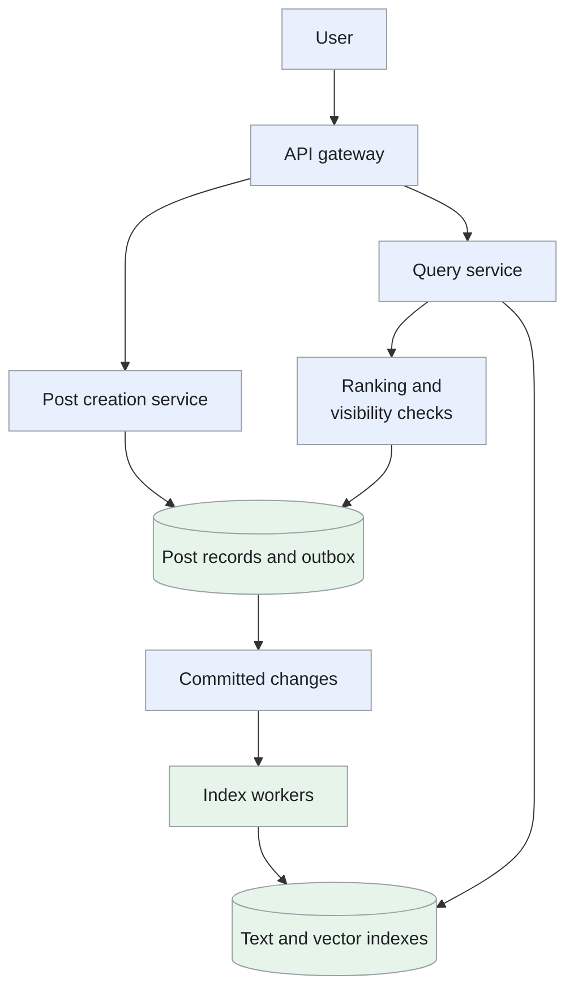
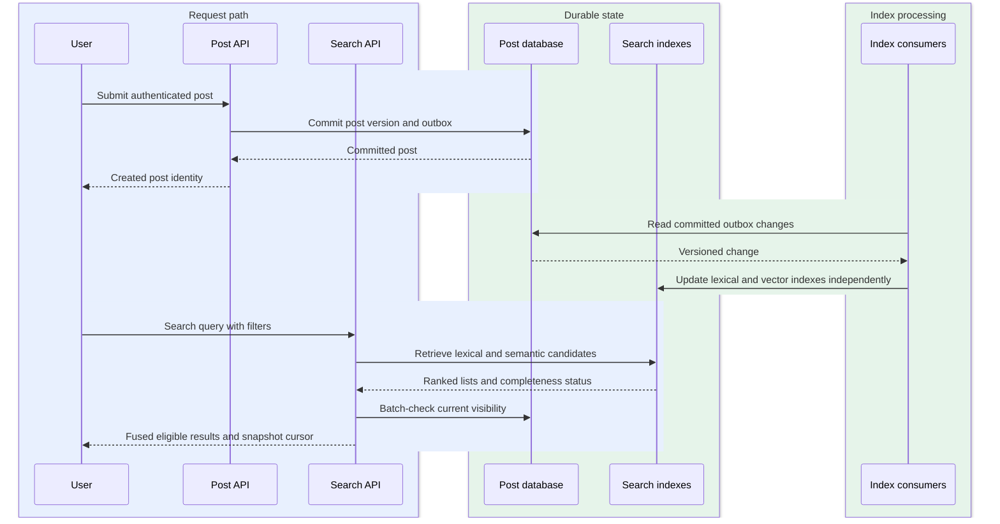
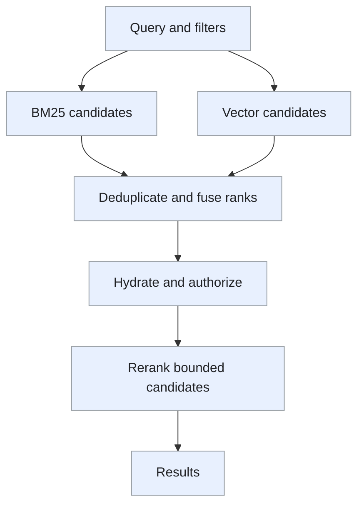

Search for social posts by keyword, phrase or meaning, with language/date filters and current visibility checks.

<!--more-->

## Problem

Users need to find a post even when they remember only a phrase or the subject it discussed. Keyword search handles exact terms; semantic retrieval finds related wording. Both need to return relevant, visible posts while new posts and edits continue arriving.

This design keeps the durable post record separate from rebuildable search indexes. Lexical indexing can become searchable before embedding generation completes.

## Requirements

### Functional requirements

- **Search posts:** keyword, phrase and semantic matching, combined in a hybrid mode.
- **Refine results:** filter by author, language and date; enforce post visibility for the requesting user.
- **Read results:** return ranked snippets, safe highlighting and cursor-based pagination.
- **Update search:** ingest creates, edits, deletions and privacy changes from the post service.

### Non-functional requirements

- **Scale:** assume 10B retained posts, 100M new posts/day and 145K peak searches/s.
- **Latency:** top-50 search P99 below 200ms within the serving region, with bounded shard fan-out.
- **Freshness:** lexical indexing P99 within 2s of a committed post; semantic indexing P99 within 10s.
- **Availability:** target 99.99%; mark partial results when a nonessential search shard misses its deadline.
- **Security:** current authorization gates every returned post, including cached and semantic candidates.
- **Quality:** evaluate lexical/hybrid relevance, phrase accuracy and ANN recall on representative queries.

Personalized social-graph ranking and cross-language semantic retrieval are outside this design. These values are targets, not measured results.

## Back-of-the-envelope calculations

- **Ingest:** 100M/day ≈ 1.16K posts/s average, or 11.6K/s at an assumed 10× burst.
- **Queries:** 500M users × 5 searches/day ≈ 29K/s average, or 145K/s at 5× peak.
- **Text:** 10B × 2KB = 20TB raw. A planning factor of 3× gives 60TB lexical storage; measure analyzers, positions and compression.
- **Vectors:** 10B × 256 dimensions × 4 bytes = 10.24TB before ANN overhead and replication. Vector storage is additional to the lexical estimate.
- **Fan-out:** 145K queries/s × 20 selected shards = 2.9M shard requests/s before retries; routing and query scope materially affect capacity.

## Core entities

- **Post** is the durable content and visibility record.
- **IndexEvent** carries a versioned change so retries and late events preserve the latest state.
- **SearchDocument** contains searchable text, filters and an embedding tied to one model version.

```protobuf
message Post {
  string post_id;
  string author_id;
  string text;
  string language;
  Timestamp created_at;
  string visibility;
  int64 version;
}
message IndexEvent {
  string event_id;
  string post_id;
  int64 version;                 // Ignore older changes.
  string operation;              // Upsert or deletion.
}
message SearchDocument {
  string post_id;
  repeated string terms;
  repeated float embedding;      // Produced by embedding_model.
  string embedding_model;
  int64 source_version;
}
message SearchHit {
  string post_id;
  string snippet;
  repeated HighlightRange highlights;
  float score;
}
message HighlightRange {
  int32 start;
  int32 end;                      // Offsets in returned snippet.
}
```

Term positions for phrase search are an index implementation detail, not a separate application record.

## API

```yaml
POST /search:
  body:
    query: text
    mode: lexical-or-semantic-or-hybrid
    filters: {author_id: optional, language: optional, from: optional, to: optional}
    page_size: 50
    page_token: optional-opaque-token
  result: {results: [], next_page_token: token, partial: false}
GET /index/status/{post_id}:
  access: internal-authorized-service
  result: {lexical_version: integer, semantic_version: integer}
```

The post service publishes indexing events after commit. Public clients cannot write directly to the index.

## High-level design

Post creation enters through the authenticated API. Committed events update the lexical and vector indexes. Search retrieves candidates, combines rankings and checks current content/permissions before returning snippets.



## Storage

- **[PostgreSQL](/designs/tech-postgresql/) shards:** authoritative posts, versions, visibility and outbox events. Commit the post change and event on the same shard. The search system can hydrate by post ID using the post service's batch interface.
- **[Elasticsearch](/designs/tech-elasticsearch/)/Lucene:** compressed term postings, term positions, filter fields and ANN vector indexes on SSD, with a memory/filesystem cache. Use time partitions plus fixed logical shards; avoid application-managed [Redis](/designs/tech-redis/) posting lists.
- **[Kafka](/designs/tech-kafka/):** ordered changes by post ID, with consumer checkpoints and sufficient retention for replay.
- **Object storage:** index snapshots and versioned embedding artifacts. An embedding model rollout builds a compatible vector index before query traffic switches.
- **Redis:** bounded query/session caches. Cache keys include query, filters, index/model generation and authorization scope; permission checks still occur on response.

Compression ratios, refresh cost and vector recall need measurement on the actual corpus. [Unicorn](https://vldb.org/pvldb/vol6/p1150-curtiss.pdf) is useful background on distributed social search; this design chooses a Lucene-based index rather than recreating its internals.

## From request to response

### One end-to-end request

Post creation commits the source version and outbox once.



The Post API authorizes creation and commits the source record with its outbox event. Text and embedding consumers advance independently; the Search API retrieves both candidate lists, fuses them and checks current access before returning snippets and a stable cursor.

### Keyword and phrase search

The query service validates length and filters and chooses a language-compatible analyzer. Date/author/language filters are pushed into retrieval, so the top candidates satisfy them before ranking. Phrase queries use indexed token positions, preserving terms needed by the phrase.

Relevant shards return their top candidates within a deadline. The coordinator merges scores, batch-loads posts and checks current visibility/deletion state. Removing most candidates after retrieval would waste work and reduce recall; filter-aware retrieval limits that problem.

### Semantic and hybrid search

The service encodes the query with the model generation used by the selected vector index. ANN retrieval returns candidates; hybrid mode also runs lexical retrieval. Reciprocal rank fusion combines the lists without assuming BM25 and cosine scores share a scale.

The service deduplicates IDs, verifies source versions and applies visibility checks. It can request additional candidates when filtering leaves too few results. A semantic timeout may fall back to lexical results when the requested mode permits it, with that fallback disclosed in the response.

### New posts, edits and deletions

Post commit emits a versioned event. Lexical workers update text and filter fields; embedding workers produce vectors asynchronously. A worker checkpoints only after its index write is durable under the configured replication policy. Status tracks lexical and semantic progress separately.

A deletion or privacy restriction is enforced by the post service immediately; index workers remove or update candidates in the background. Tombstones and version comparisons prevent an older replayed event from restoring deleted content.

### Pagination and snippets

The first search establishes a short-lived index snapshot and deterministic sort with post ID as the tie-breaker. The token binds query, filters, authorization scope, index/model generation and last sort values. Expired snapshots require a fresh search.

The service creates snippets only for final hits and returns highlight offsets over escaped text. The client renders those spans safely. Semantic-only matches can have useful snippets without inventing exact matching terms.

## Deep dives

### How should lexical and semantic rankings be combined?

**Problem:** BM25 and vector similarity use different score distributions.

- **Raw weighted scores:** normalize BM25/similarity and combine them with weights. Inference is cheap, but score distributions vary by query and a weight tuned for one cohort can distort another.
- **Reciprocal rank fusion:** combine rank positions from each list. No training pipeline or cross-score normalization is needed; magnitude information is lost and fusion cannot recover candidates absent from both retrieval lists.
- **Learned reranker:** score a bounded union using query/content features and labels. Relevance can improve with representative data, but inference latency, model operations and biased training labels add cost.

**Recommendation:** use reciprocal rank fusion, then evaluate whether a bounded reranker improves relevance enough to justify latency and compute. A candidate absent from one list contributes only from the other. Reciprocal rank fusion fits a first hybrid retrieval path with incompatible score scales and no assumed labeled reranking pipeline. We accept rank-only fusion and bounded candidate recall; a reranker must show sufficient measured relevance gain within the response budget.

```python
def rrf(lexical, semantic, k=60):
    scores = {}
    for ranking in (lexical, semantic):
        for rank, post_id in enumerate(ranking, start=1):
            scores[post_id] = scores.get(post_id, 0) + 1 / (k + rank)
    return sorted(scores, key=lambda p: (-scores[p], p))
```

Candidate breadth bounds attainable recall; reranking cannot recover a post omitted by both retrievers. Measure NDCG, recall, empty-result rate and query latency by language and query type.

**Retrieval and fusion.** Run BM25 over text and the embedding query over a compatible vector-index generation in parallel. Each returns a bounded list of post IDs, ranks and index versions. Deduplicate by post ID before fusion; one post appearing twice in a retriever still gets only one contribution from that list.

For a small example, post A ranks first lexically and third semantically, while B ranks tenth lexically and first semantically. With `k=60`, A scores `1/61 + 1/63 ≈ 0.0323`; B scores `1/70 + 1/61 ≈ 0.0307`. A wins because it ranks strongly in both lists. A post returned only by semantic search remains eligible with that contribution alone.



Reserve a fixed part of the deadline for hydration and optional reranking. If vector retrieval times out, return the lexical result with a degraded-retrieval indicator. Measure the union's recall separately from final ranking quality: an excellent reranker can still produce poor results when its candidate set misses relevant posts.

### How do we meet the indexing freshness target?

**Problem:** embedding generation can lag while lexical indexing is ready.

- **One blocking worker:** generate embeddings and text updates in one ordered task. Progress is simple, but embedding latency/backlog delays already-ready lexical updates.
- **Independent versioned consumers:** materialize text and vectors separately from the durable source event. Lexical search remains usable during embedding lag; the API must report separate freshness and both consumers must reject stale versions/tombstones.
- **Synchronous creation-time indexing:** write searchable indexes before acknowledging a post. Visibility is immediate when healthy, but posting latency and availability become coupled to every index/model dependency.

**Recommendation:** use independent versioned consumers. The [Elasticsearch refresh mechanism](https://www.elastic.co/docs/manage-data/data-store/near-real-time-search) makes new segments searchable; tune refresh intervals under realistic write/query load. Independent consumers fit different text and embedding costs while preserving durable posting availability. We accept temporarily unequal retrieval freshness and measure commit-to-searchable time per path, rather than treating event acknowledgment as search visibility.

Track commit-to-searchable latency separately for text and vectors, including queue lag and retries. During an embedding backlog, lexical retrieval remains available. Rebuild from a snapshot and replay offset, retaining deletion/version information throughout recovery.

**Versioned indexing.** A post update commits version 18 and an outbox entry in PostgreSQL. The lexical consumer indexes version 18 immediately; the vector consumer computes its embedding later. Both write only when their incoming version is newer than the stored document version. A retried version 17 therefore leaves version 18 intact.

Track the last fully applied source offset and searchable time separately. A consumer acknowledging an event does not necessarily mean a query can see it: Lucene's refresh boundary adds another step. Publish freshness measurements from a probe that creates or updates a post and searches for that exact version.

Deletes travel through both paths as versioned tombstones. Keep them long enough to cover replay and rebuild; an old embedding job must not restore a deleted post. A rebuild starts from a consistent source snapshot and its replay offset, consumes later changes, and passes completeness checks before the query alias switches. During the switch, a request uses one index generation throughout its pagination session.

### How do shards control latency and partial results?

**Problem:** every additional shard adds work and another opportunity for a slow response.

- **Term partitioning:** route queries to term-owned postings. Some lookups touch few owners, but popular terms become hot and multi-term intersections require cross-owner coordination.
- **Document partitioning:** evaluate the complete query on each document shard and merge results. Query semantics are local and writes distribute; broad queries still fan out to every selected shard and stragglers affect p99.
- **Time partitions with document shards:** prune date ranges first and search fixed logical shards within them. Recent queries keep a bounded hot set; broad historical ranges expand task count and require deadlines/completeness reporting.

**Recommendation:** use time partitions and fixed logical document shards, with replicated readers and bounded concurrency. Query recent partitions by default; an explicit older date range expands the search scope. A replica adds read capacity, not another logical slice of results. Time-plus-document partitioning fits recent-post defaults and explicit older ranges. We accept bounded concurrency and clearly marked partial results where policy permits; replicas add read capacity, not new result slices.

Return a partial flag if an eligible shard misses the deadline, and retain authorization checks for all hits. Capacity planning includes internal requests/query, tail latency, index size and refresh/merge pressure; hashing alone does not guarantee equal query cost.

**Bounded shard work.** Suppose a seven-day query selects seven daily partitions, each with four document shards. The planner creates 28 logical tasks and chooses one healthy replica for each. A concurrency limit of eight means tasks run in waves; the planner accounts for this queue time when setting the request deadline.

Each shard returns its best candidates and an execution status. The coordinator merges lexical candidates by their comparable ranking policy and fuses vector/lexical lists at the planned retrieval stage. Shard-local top-K is sufficient for a globally ordered score list only when scores are comparable; distributed term statistics and reranking can require a wider candidate set.

Track a completion bitmap alongside hits. If task 23 misses its deadline, a partial result identifies the missing partition rather than presenting a complete search. Cancel outstanding work when the request ends. A cursor pins the query, index generation and stable tie-breaker; using a new snapshot for every page can repeat or omit posts as refreshes change the ordering.

### How do we preserve filters and permissions?

**Problem:** ANN top-K may contain mostly excluded posts, and cached index visibility may be stale.

- **Post-filter only:** retrieve global top-K, then remove excluded hits. Implementation is easy, but selective author/language filters can leave too few candidates and relevant eligible posts were never retrieved.
- **Filter-aware retrieval:** apply supported stable filters during lexical/ANN candidate selection. Eligible recall improves, but query cost depends on filter selectivity and indexed visibility can still lag permission changes.
- **Index per permission group:** isolate searchable populations physically. Retrieval can be precise, but many overlapping/changing groups multiply indexes and propagation/rebuild work.

**Recommendation:** push stable author/date/language filters into retrieval and use supported filter-aware ANN queries. Treat index visibility as a candidate filter; the current post authority makes the final permission decision. If that decision cannot be verified, return fewer results or an availability error. Filter-aware retrieval plus current authority checks fits selective searches and mutable post privacy. We accept batch access-check cost and fewer results when authority is unavailable; stale snippets are filtered before response assembly.

Keep cache scopes explicit, prevent unauthorized snippets from entering responses and audit deletion/permission propagation. [TAO's social-graph storage paper](https://www.usenix.org/system/files/conference/atc13/atc13-bronson.pdf) provides context for graph access patterns without implying that search indexes are the permission authority.

**Authorization at response time.** Consider a private post that was public when indexed. Its search hit may still contain text and an old public flag. Before returning anything derived from the post—including a snippet—the result service batch-loads current visibility and checks the requesting user's access. An inaccessible hit is removed before response assembly.

Selective filters also affect candidate breadth. If a global ANN search returns 100 candidates and only two belong to the requested author, post-filtering cannot invent the author's other relevant posts. Push supported filters into the ANN query or switch to an exact scan of the small filtered population. Overfetch only within a resource budget.

Cache a search result under the authorization scope and index generation, but recheck mutable permissions when reading it. A permission change triggers invalidation and a new authority version. If the permission service is unavailable, the endpoint follows its documented fail-closed policy; lexical relevance and cache freshness never substitute for access verification.
