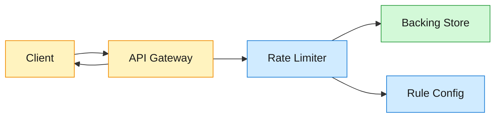
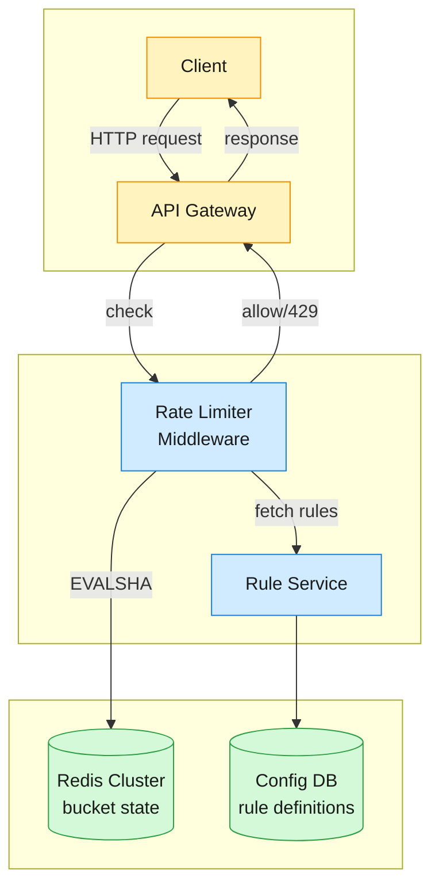

A rate limiter controls how many requests a client can make within a time window. It sits in the request path for every API call, enforcing configurable limits — per user, per IP, or per API key — and rejecting excess traffic with HTTP 429.

<!--more-->

## 1. Problem

A rate limiter controls how many requests a client can make within a time window. It sits in the request path for every API call, enforcing configurable limits — per user, per IP, or per API key — and rejecting excess traffic with HTTP 429. At 1M requests per second across 100M daily active users, the limiter must add negligible latency and stay available even when its backing store is degraded.



## 2. Requirements

**Functional**

- FR1: Identify the client from each request (user ID, IP, or API key).
- FR2: Enforce configurable rate limit rules against each client.
- FR3: Reject requests that exceed limits with HTTP 429 and rate-limit headers.
- FR4: Support multiple rate-limiting algorithms per rule.
- FR5: Apply limits across a distributed gateway fleet consistently.

**Non-functional**

- NFR1: Sub-10ms p99 latency added per request.
- NFR2: Survive backing-store unavailability without blocking all traffic.
- NFR3: Burst-tolerant for user-facing API limits; strict for abuse-protection endpoints.
- NFR4: Scale to 1M+ requests per second across 100M+ daily active users.

*Out of scope: Rate-limit analytics dashboards, long-term persistence of request logs, per-request billing.*

## 3. Back of the envelope

- **Redis throughput:** 1M req/s ÷ 100K ops/s per Redis node ≈ 10–20 shards → a naive centralized-only check path saturates a single Redis instance well before 1M req/s; sharding is necessary.
- **Memory:** ~80 bytes per rate-limit key × 5M active keys ≈ 400MB total → fits per-shard memory easily; storage is not the bottleneck.
- **Latency budget:** one Redis round-trip per request at 1M req/s means every request adds the network hop. Without reducing the per-request Redis call volume, 1M EVALSHA/s creates connection-pool contention that pushes p99 past the 10ms budget.

## 4. Entities

```
RateLimitRule {
  rule_id:      uuid PK
  client_type:  enum         ← user / ip / api_key / endpoint
  limit:        integer      ← max requests per window
  window_sec:   integer      ← size of the rate-limit window
  algorithm:    enum         ← token_bucket / sliding_window_counter / gcra
  burst:        integer?     ← burst capacity (token bucket only)
  fail_mode:    enum         ← open / closed
}

BucketState {
  client_key:   string PK    ← composite: {client_type}:{client_value}:{rule_id}
  tokens:       decimal?     ← current tokens (token bucket)
  last_refill:  timestamp?   ← last refill time (token bucket)
  prev_count:   integer?     ← previous-window count (sliding window)
  curr_count:   integer?     ← current-window count (sliding window)
  window_start: integer?     ← current window start epoch (sliding window)
  tat:          bigint?      ← theoretical arrival time in µs (GCRA)
}
```

### API

- `POST /ratelimit/check` — evaluate a request against all matching rules, returns `{allowed, remaining, reset_at}`
- `PUT /ratelimit/rules/{rule_id}` — create or update a rate limit rule (hot-reloaded)
- `GET /ratelimit/rules` — list active rules

## 5. High-Level Design



Every request passes through the rate limiter middleware at the gateway layer. The middleware identifies the client, looks up the matching rules, evaluates each rule's state atomically in Redis, and either forwards the request or short-circuits with a 429 response. Rules are defined in a configuration database and hot-reloaded by the rate limiter without a restart.

#### FR1: Identify the client

**Components:** Client → API Gateway → Rate Limiter Middleware.

**Flow:**

1. Request arrives at the API Gateway carrying HTTP headers.
1. The rate limiter middleware inspects the request: `Authorization` header (JWT → user ID), `X-Forwarded-For` (client IP), or `X-API-Key` (API key).
1. The middleware constructs a composite client key: `{client_type}:{client_value}`, e.g. `user:42`, `ip:198.51.100.7`.
1. The client key is passed to the rule-matching engine.

**Design consideration:** Identity extraction happens at the gateway layer because it has access to HTTP-level metadata. Business-internal services behind the gateway receive an already-authenticated identity, so they do not need to re-extract it. For anonymous endpoints (public search), the fallback is per-IP limiting. The key format `{type}:{value}` doubles as the Redis key and the consistent-hashing token, so the same client always maps to the same shard.

#### FR2: Enforce configurable rules

**Components:** Rate Limiter Middleware → Redis Cluster.

**Flow:**

1. The middleware retrieves all rules matching this client (e.g. "100 req/s per user", "20 req/s per IP").
1. For each rule, it calls `EVALSHA` on Redis with the rule's algorithm parameters and the client key.
1. Redis executes the Lua script atomically: reads bucket state, computes refill, deducts tokens, writes back, sets TTL.
1. The script returns `{allowed: 0/1, remaining: N, reset_at: timestamp}`.
1. If any rule returns `allowed=0`, the middleware short-circuits: reject with HTTP 429, set rate-limit headers, and skip upstream forwarding.

```lua
-- Token bucket Lua script (EVALSHA)
local rate  = tonumber(ARGV[1])   -- tokens per second
local burst = tonumber(ARGV[2])   -- max capacity
local cost  = tonumber(ARGV[3])   -- tokens consumed (usually 1)

local state  = redis.call('HMGET', KEYS[1], 'tokens', 'last')
local tokens = tonumber(state[1]) or burst
local last   = tonumber(state[2]) or redis.call('TIME')[1]

local elapsed = math.max(0, redis.call('TIME')[1] - last)
tokens = math.min(burst, tokens + elapsed * rate)

local allowed = 0
if tokens >= cost then
    tokens = tokens - cost
    allowed = 1
end

redis.call('HMSET', KEYS[1], 'tokens', tokens, 'last', redis.call('TIME')[1])
redis.call('PEXPIRE', KEYS[1], 2 * math.ceil(burst / rate) * 1000)
return {allowed, math.floor(tokens)}
```

**Design consideration:** Reading server time inside the Lua script via `redis.call('TIME')` avoids clock-skew problems across gateway pods. If gateways passed their own wall-clock timestamps, a 100ms skew between two pods would let each grant different token amounts for the same bucket. Redis is the single clock source, so every gateway sees the same refill computation. The `PEXPIRE` sets TTL to twice the time needed to fully refill the bucket — idle keys are auto-cleaned, and active keys have their TTL refreshed on every request.

#### FR3: Reject with HTTP 429 and headers

**Components:** Rate Limiter Middleware → Client.

**Flow:**

1. Lua script returns `allowed=0`. The middleware does not forward the request upstream.
1. Middleware constructs the 429 response with headers:
  - `X-RateLimit-Limit: 100` (max allowed in the window)
  - `X-RateLimit-Remaining: 0` (tokens left)
  - `X-RateLimit-Reset: 1719792000` (Unix timestamp when the window resets)
  - `Retry-After: 12` (seconds until a new token arrives)
1. The response body carries a JSON payload: `{"error": "rate_limited", "retry_after_ms": 12000}`.
1. The middleware caches the rejection verdict locally for this client until `reset_at`, so subsequent requests are rejected without a Redis call.

**Design consideration:** The `Retry-After` header is computed from the bucket state: `(1 token / refill_rate)` seconds. For a token bucket with 10 tokens/sec, that is 100ms. The client can use this for precise backoff rather than guessing. Local caching of the rejected state is critical during abuse events where one IP can send hundreds of thousands of requests per second — after the first rejection, zero additional Redis calls are made for that key.

#### FR4: Support multiple algorithms per rule

**Components:** Rule Service → Rate Limiter Middleware → Redis.

**Flow:**

1. Each rule definition includes an `algorithm` field: `token_bucket`, `sliding_window_counter`, or `gcra`.
1. When the middleware loads rules at startup (and on hot-reload), it precompiles the correct Lua script for each algorithm and caches the SHA.
1. At check time, the middleware dispatches to the correct `EVALSHA` based on the rule's algorithm field.
1. Different endpoints can use different algorithms: token bucket for user-facing API limits (burst-tolerant), sliding window counter for per-IP abuse protection (near-perfect accuracy, O(1) memory), GCRA for memory-constrained deployments (single stored value).

**Design consideration:** Algorithm selection is a per-rule configuration choice, not a system-wide constant. The token bucket's burst parameter is essential for real-world API patterns where clients issue small spikes (opening an app, refreshing a feed). The sliding window counter uses two integer counters and a weighted estimate with measured ~6% average drift — acceptable for abuse detection but not for exact quotas. GCRA stores a single timestamp value per key (~40 bytes), the smallest storage footprint, and Redis 8 includes a native `GCRA` command that replaces the custom Lua script entirely.

#### FR5: Distributed consistency across the fleet

**Components:** N gateway pods → Redis Cluster.

**Flow:**

1. Each gateway pod runs an identical copy of the rate limiter middleware.
1. All pods read from and write to the same Redis Cluster — the single source of truth for bucket state.
1. The client key (`{type}:{value}:{rule_id}`) uses a hash tag so all keys for the same base identifier hash to the same Redis slot.
1. Each pod locally caches a small chunk of tokens (drawn from Redis in batches) to reduce per-request Redis calls.

**Design consideration:** A distributed gateway fleet must agree on bucket state, but making every request hit a centralized store creates a bottleneck. The two-tier architecture resolves this: each pod draws a chunk of tokens from Redis (e.g. 10 tokens at a time), consumes them locally in process memory (sub-microsecond), and refills from Redis only when the local chunk is exhausted. This cuts Redis traffic by roughly 10x. The trade-off is a small accuracy drift — a user with a 100/min limit might briefly see 110/min if chunks are distributed unevenly across pods. For abuse-prevention rules this drift is acceptable; for billing or hard quotas, the chunk size can be reduced to 1 (disabling local caching) at the cost of higher Redis load.

## 6. Deep dives

### DD1: Scaling to 1M req/s — two-tier architecture

**Problem.** At 1M requests per second, a naive centralized-only path sends 1M EVALSHA calls to Redis every second. A single Redis node handles roughly 100K ops/s, so a 10–20 shard cluster is the minimum baseline. But every request still pays the network round-trip — roughly 0.5ms per call at scale — and connection-pool contention across 500+ gateway pods pushes p99 latency past the 10ms budget. We need to reduce the per-request Redis call volume without losing global coordination.

**Approach 1: Single centralized Redis**

One Redis instance handles all rate-limit state. Every request from every gateway hits the same Redis node.

```javascript
Gateway 1..N  ──EVALSHA──>  Redis
                  1M ops/s
```

- **Challenges:** Redis handles ~100K simple ops/s on one core. At 1M requests per second, the single instance saturates at 10% of traffic. Latency climbs as the command queue grows. Connection pool exhaustion compounds the problem — 500 gateways × a pool of 20 connections each need 10,000 concurrent connections to one Redis instance, far beyond what it sustains.

**Approach 2: Redis Cluster with hash slots**

Distribute 16,384 hash slots across 10–20 Redis nodes. Each client key maps deterministically to one slot via its hash tag, so all requests for the same client land on the same node.

```javascript
# Key format embeds hash tag for slot co-location
EVALSHA <sha> 1 rate_limiter:{user:42}:rule_abc <rate> <burst> <cost>
```

- **Challenges:** Hot keys undermine the sharding. A single high-traffic client — an enterprise customer, a viral API key, or a coordinated attacker — pins one shard at near capacity while other shards are idle. Resharding during scale-out pauses requests on migrating slots. Connection pools still scale linearly with gateway count: 500 gateways maintain a connection pool to every shard, which is 500 × 20 × 20 = 200,000 open TCP connections cluster-wide.

**Approach 3: Two-tier — local token chunks + centralized Redis**

Each gateway pod maintains a local per-key token cache. The pod draws tokens from Redis in chunks (e.g. 10 at a time), consumes them from process memory on the fast path, and refills from Redis only when the local chunk is exhausted.

```javascript
# Fast path (99%+ of requests, sub-microsecond)
local_tokens[key] > 0  →  local_tokens[key]--  →  allow

# Slow path (refill from Redis, ~0.5 ms)
local_tokens[key] == 0  →  EVALSHA to Redis, draw chunk of 10  →  cache locally
```

At steady state with 10-token chunks, each gateway issues one EVALSHA per 10 requests:

```javascript
Without local cache:  2,000 EVALSHA/s per gateway × 500 gateways = 1M ops/s
With 10-token chunks: 2,000 / 10 = 200 EVALSHA/s per gateway × 500 = 100K ops/s
→ ~10x reduction
```

- **Normal path:** The local lookup is an in-process hash-map access that runs in sub-microsecond time, with no network round trip and no serialization cost. Over 99% of requests take this path.
- **Hot-key handling:** For clients with high limits (e.g. 10,000/min for enterprise), increase chunk size to 50–100 tokens. Fewer refills from Redis spread the load smoothly across time.
- **Graceful degradation:** If Redis becomes unreachable, the pod continues serving from its local token cache until the cache runs dry. After exhaustion, the pod falls back to its per-rule `fail_mode`: allow (open) or deny (closed). This keeps the API available during a partial Redis outage.

**Decision:** Approach 3 (two-tier). Approach 1 fails to scale past ~100K req/s. Approach 2 handles throughput but leaves hot keys and connection-pool overhead unresolved. The two-tier architecture combines global coordination (Redis Cluster) with local amortization (in-process cache), cutting Redis traffic by an order of magnitude while keeping per-request latency in the microsecond range.

**Rationale:** The 10x reduction means a 10–20 shard cluster handles the load comfortably instead of requiring 100+ shards and 200K persistent connections. The sub-microsecond fast path keeps p99 latency well under 1ms for the limiter itself, leaving 9ms of the budget for upstream processing. The accuracy drift from chunking — roughly 6% on average — is acceptable for the fairness and abuse-prevention use cases this design targets.

**Edge cases:**

- Pod crash with local tokens in memory: those tokens are lost and never returned to Redis, causing a brief overshoot until the next refill for that key. The drift is bounded by chunk size × number of pods per key.
- Token hoarding: a pod that serves one client exclusively holds a chunk but the client goes idle — the chunk expires via a short process-local TTL (5 seconds).
- Redis partition: gateway pods on one side of the partition refill from the Redis nodes they can reach; pods on the other side degrade to local-only or fail-mode behavior. The cluster heals on reconnect.

> [!TIP]
> **Key insight:** The two-tier pattern trades a small accuracy drift for a 10x reduction in centralized-store load. The drift is bounded by chunk size and acceptable for fairness-rate-limiting. For exact-quota use cases (billing), set chunk size to 1 and pay the full Redis cost per request — the design supports both modes per rule.

### DD2: Atomicity — preventing double-spend of tokens

**Problem.** Two concurrent requests from the same client arrive at different gateway pods nearly simultaneously. Both read the bucket state: 5 tokens remaining, cost = 1. Both see enough tokens and both decrement to 4 in their local computation. Both write 4 back to Redis. The real count after processing both should be 3. The system allowed one extra request — a double-spend. At 1M req/s, this race occurs hundreds of times per second. Addresses NFR1 by keeping the check atomic with minimal latency.

**Approach 1: WATCH/MULTI/EXEC — optimistic locking**

Redis WATCH monitors the bucket key. If another client modifies it between WATCH and EXEC, the transaction aborts and the caller retries the entire read-compute-write cycle.

```javascript
WATCH rate_limiter:{user:42}:rule_abc
HMGET rate_limiter:{user:42}:rule_abc tokens last
-- app computes refill and decrement
MULTI
HMSET rate_limiter:{user:42}:rule_abc tokens 4 last 1719792000
EXEC  -- fails if another write occurred → retry
```

- **Challenges:** Under contention on a hot key, most EXEC calls abort. Each retry costs another network round-trip and re-reads the key. At 10K req/s on a single key, the retry rate pushes effective latency past 50ms. This is the non-production pattern — optimistic locking fails under the write contention that rate limiters are designed to create.

**Approach 2: Lua EVALSHA — atomic script execution**

Redis executes the entire read-refill-check-decrement-write cycle as a single Lua script on the main event loop. No other command interleaves. One round-trip, no retries.

```lua
-- Atomic token bucket in Lua: one EVALSHA, zero races
local rate  = tonumber(ARGV[1])
local burst = tonumber(ARGV[2])
local cost  = tonumber(ARGV[3])

local state  = redis.call('HMGET', KEYS[1], 'tokens', 'last')
local tokens = tonumber(state[1]) or burst
local last   = tonumber(state[2]) or redis.call('TIME')[1]

local elapsed = math.max(0, redis.call('TIME')[1] - last)
tokens = math.min(burst, tokens + elapsed * rate)

local allowed = 0
if tokens >= cost then
    tokens = tokens - cost
    allowed = 1
end

redis.call('HMSET', KEYS[1], 'tokens', tokens, 'last', redis.call('TIME')[1])
redis.call('PEXPIRE', KEYS[1], 2 * math.ceil(burst / rate) * 1000)
return {allowed, math.floor(tokens)}
```

- **Normal path:** One EVALSHA call, roughly 50µs on the Redis CPU, returns `{1, 4}`. The gateway forwards the request. Total added latency: ~0.5ms (network + script CPU).
- **Edge case — script cache flushed:** After `SCRIPT FLUSH` or a Redis restart, EVALSHA returns NOSCRIPT. The middleware catches this, re-sends the full script via EVAL, and re-caches the SHA. This adds one extra round-trip on the first request after a flush, then reverts to EVALSHA.

**Approach 3: Lua + PEXPIRE + server clock**

Same as Approach 2 but with two refinements: (a) `PEXPIRE` sets a TTL so idle keys self-delete and memory is reclaimed, and (b) `redis.call('TIME')` inside the script uses Redis's clock as the single time source, avoiding clock-skew across gateway pods.

- **TTL self-clean:** The TTL is set to `2 × ceil(burst / rate) × 1000` milliseconds — twice the time to fully refill the bucket. An idle client's key expires and is garbage-collected. On the next request, the `HMGET` returns nil, the script initializes at full burst, and the cycle restarts. Active keys have their TTL refreshed on every request, so they never expire while in use.
- **Server clock:** `redis.call('TIME')` returns a two-element array `{seconds, microseconds}`. Using Redis time means all gateway pods see identical refill computations, even with 100ms+ of clock skew between pods.

**Decision:** Approach 3 (Lua + PEXPIRE + server clock). Lua atomicity eliminates the race at zero retry cost. PEXPIRE prevents unbounded memory growth from abandoned keys. Server-clock sourcing keeps refill consistent across the fleet.

**Rationale:** Lua scripts run atomically on Redis's single-threaded event loop, so they require neither locks nor CAS retries, and the system avoids the retry storm that WATCH/MULTI suffers under contention. A single EVALSHA replaces the 2–3 round-trips (and unpredictable retries) of a WATCH/MULTI approach. The script is O(1) and completes in roughly 50µs, well within Redis's `lua-time-limit` default of 5 seconds. The PEXPIRE self-clean and server-clock refill are small additions that eliminate the two most common production pain points: memory leaks from stale keys and refill inconsistency from skewed clocks.

**Edge cases:**

- Lua timeout: if a script exceeds 5 seconds, Redis terminates it and blocks subsequent EVAL/EVALSHA calls. Production scripts stay O(1) and avoid iteration to prevent this.
- Key collision on multiple rules: a single request may evaluate 3–4 rules, each a separate Redis key. These are independent calls — no multi-key atomicity is needed because each rule's allowance is a separate decision.
- Cost > 1: the `cost` parameter handles weighted requests natively. A GraphQL query that costs 5 points from a 100-point bucket works identically to a 1-point REST call — the Lua arithmetic is the same.

> [!TIP]
> **Why not Redis transactions (MULTI/EXEC)?** WATCH/MULTI is the wrong tool for high-contention keys. It optimistically assumes low conflict and retries on conflict — but a rate limiter's hot keys are high-conflict by design. A celebrity user or a popular API key creates exactly the write contention that makes optimistic locking fall apart. Lua scripts on the event loop give the same isolation guarantee without any retry overhead.

### DD3: Algorithm selection — what to use where

**Problem.** Different endpoints need different rate-limiting behavior. A public search API needs strict per-IP limits to prevent scraping — no burst overage allowed. A user-facing data API needs burst tolerance for normal usage patterns (app open, feed refresh). A billing endpoint needs exact counting. Memory footprint matters at scale: storing full request logs per key is infeasible at 5M+ active keys. Addresses NFR3 (burst-tolerant vs strict enforcement) by making algorithm selection a per-rule decision.

**Approach 1: Fixed window counter for everything**

One integer counter per key per window. On each request, `INCR` the counter. If `counter > limit`, reject. At window rollover, the counter resets to 0.

```javascript
INCR rate_limiter:{user:42}:window_42
EXPIRE rate_limiter:{user:42}:window_42 60
```

- **Pro:** Single Redis call (`INCR`), O(1) memory, trivial to implement.
- **Con:** Boundary spike. 100 requests at second 59 of minute 1 plus 100 requests at second 1 of minute 2 = 200 requests in 2 seconds without either window exceeding the 100 limit. An attacker can consistently double the effective rate by straddling the boundary.

**Approach 2: Sliding window counter**

Store two counters: the previous complete window's count and the current partial window's count. The effective rate is a weighted blend. Uses only `INCR` + `GET` — no Lua, no multi-key atomicity needed.

```javascript
estimated_rate = prev_count × ((window_sec - elapsed_sec) / window_sec) + curr_count
```

```javascript
# On each request:
INCR rate_limiter:{user:42}:window_{current_window}   -- atomic
GET rate_limiter:{user:42}:window_{current_window}
GET rate_limiter:{user:42}:window_{previous_window}

# App computes weighted estimate and decides allow/reject
```

- **Pro:** O(1) memory (two integer counters per key), near-perfect accuracy. A measurement across 400M requests from 270,000 distinct sources showed 0.003% error rate with zero false positives and roughly 6% average drift.
- **Con:** Approximate. The 6% drift means a 100/min limit might briefly allow 106/min. Not suitable for billing or exact quotas. The weighted-estimate computation runs in the gateway, not in Redis — two `GET` calls plus arithmetic.

**Approach 3: Token bucket (burst-tolerant)**

Store `(tokens, last_refill_time)` per key. Tokens refill continuously at a configurable rate. A burst parameter allows a sudden spike above the steady rate, draining the bucket. Refill and deduction happen atomically via Lua script.

```lua
tokens = min(burst, tokens + (now - last) * refill_rate)
if tokens >= cost then tokens -= cost; return allow
else return reject
```

- **Pro:** Natural burst handling. A client that's been idle for 10 seconds can immediately issue `10 × refill_rate` requests before the bucket empties and settles to the steady rate. This matches real-world API usage: app opens, feed refreshes, and pagination all produce short spikes.
- **Con:** Two stored values (tokens + timestamp) instead of one. Requires Lua for atomic refill-check-consume. Burst parameter must be tuned — too high and it defeats rate limiting; too low and legitimate spikes are throttled.

**Approach 4: Multi-algorithm with hot-reloaded rule config**

Rules are stored as configuration objects in a database (Postgres or etcd). Each rule specifies the algorithm, window parameters, burst allowance, and fail mode. The gateway loads rules at startup and watches for changes.

```javascript
rule_id: "search-ip-limit"
client_type: ip
algorithm: sliding_window_counter
limit: 20
window_sec: 60
fail_mode: closed

rule_id: "api-user-limit"
client_type: user
algorithm: token_bucket
limit: 1000
window_sec: 60
burst: 50
fail_mode: open
```

**Decision:** Multi-algorithm with per-rule selection. Sliding window counter for IP-level and endpoint-level abuse protection (O(1) memory, near-perfect accuracy, works with simple `INCR`). Token bucket for user-facing API limits (controlled burst matches real usage patterns). GCRA for memory-constrained deployments that still need burst support (single stored value). Never fixed window alone — the boundary spike is a known and easily exploited weakness.

**Rationale:** One algorithm cannot serve all rate-limiting needs well. The sliding window counter gives 0.003% error for abuse detection at the cost of two counters per key — a negligible 80 bytes. The token bucket's burst parameter is load-bearing: without it, a client opening the app and loading 5 endpoints simultaneously gets throttled on request 3. The two algorithms together cover the full spectrum: strict per-IP stopping, fair per-user throttling.

**Edge cases:**

- Algorithm migration: changing a rule's algorithm mid-flight leaves the old algorithm's Redis keys orphaned. The Lua scripts are designed to be resilient — if the key shape doesn't match (e.g. GCRA expects a string but finds a hash), the script falls back to initializing a fresh bucket.
- Competing rules: a single request matches both a per-IP rule (sliding window, 20/min) and a per-user rule (token bucket, 1000/min). Both are evaluated independently. If either rejects, the request is denied. The most restrictive rule wins.

> [!TIP]
> **Key insight:** The sliding window counter hits a sweet spot for abuse prevention: it needs only `INCR` (the simplest, fastest Redis command), uses constant memory, and its 6% drift is irrelevant when you are deciding "is this IP scraping us?" — the answer at 106/min vs 100/min is the same yes. Reserve exact counting for the small subset of rules that bill by request.

### DD4: Fail-open vs fail-closed — surviving Redis outages

**Problem.** Redis is the single source of truth for bucket state. When Redis is unreachable — network partition, node crash, cluster resharding — the rate limiter must decide: allow requests through (fail-open) or reject them (fail-closed). The wrong choice per rule type can turn a Redis outage into either a site-wide outage (fail-closed everywhere) or an unbounded traffic flood (fail-open everywhere). Addresses NFR2 by designing per-rule failure behavior.

**Approach 1: Fail-closed for all rules**

When Redis is unreachable, reject every request. No traffic reaches upstream services.

- **Pro:** Conservative. Guarantees rate limits are never exceeded during an outage. The simplest to reason about.
- **Con:** A Redis outage becomes a full API outage. If Redis is down for 30 seconds, every authenticated user gets a 429 for 30 seconds. The rate limiter, designed to protect availability, becomes the single point of failure that destroys it.

**Approach 2: Fail-open for all rules**

When Redis is unreachable, allow every request. The API stays available but rate limiting is absent.

- **Pro:** API availability is preserved. Users see no interruption during a Redis outage.
- **Con:** During a DDoS attack that coincides with a Redis partition, the attack traffic floods through unmitigated. The rate limiter's core function — protecting upstream capacity — is lost precisely when it is most needed.

**Approach 3: Per-rule fail mode with local degradation**

Each rule carries a `fail_mode` field: `open` or `closed`. The middleware enforces it when Redis calls fail.

```javascript
# Per-rule fail mode selection:
if redis_error:
    if rule.fail_mode == "open":     allow()
    elif rule.fail_mode == "closed":  reject()
```

Additionally, before failing, the middleware tries its local token cache first. If the local cache still has tokens from the last successful refill, it continues serving from the cache for a brief grace period. After the local cache runs dry, the fail mode takes over.

- **Normal path (Redis healthy):** Rule evaluation proceeds as normal — EVALSHA → allow or reject. Fail mode is never consulted.
- **Degraded path (Redis unreachable, local cache has tokens):** The pod continues serving from the local token cache. A 5-second TTL on cached chunks means the grace period is short. For token-bucket rules, remaining local tokens are consumed normally; for sliding-window rules, the last known count is treated as the current count approximation.
- **Degraded path (Redis unreachable, local cache empty):** The per-rule fail mode activates. Abuse-protection rules (per-IP sliding window) fail closed — during a DDoS, rejecting unauthenticated traffic is the safe choice. User-facing API rules (per-user token bucket) fail open — authenticated users should not be locked out because of a Redis blip.

**Decision:** Approach 3 (per-rule fail mode with local cache grace period). Fail-closed for anti-abuse rules where the risk of unmitigated attack traffic outweighs the risk of false 429s. Fail-open for fairness and user-facing rules where blocking legitimate users is worse than brief overshoot.

**Rationale:** A uniform fail-open or fail-closed policy forces one risk profile onto every endpoint. Per-rule configuration lets the operator make the trade-off where it matters. The local cache grace period bridges short Redis blips (sub-5-second) without activating the fail mode at all — most Redis outages in a well-operated cluster are transient leader elections or connection resets lasting under a second. The 0.01% Redis failure rate observed in production means fail mode is a rare path, but when it triggers, the per-rule choice prevents a cascading outage.

**Edge cases:**

- Fail-open during an active attack: a per-IP abuse rule set to fail-open would allow attack traffic during a Redis outage. Mitigation: abuse rules default to fail-closed. The operator can override for internal IPs.
- Local cache stale after long Redis outage: if Redis is down for minutes, the local cache expires and the fail mode activates. Once Redis recovers, the first refill re-establishes accurate state. The drift during the outage window is accepted as the cost of availability.
- Partial Redis partition: some shards reachable, some not. The middleware applies the fail mode per-shard — rules whose keys hash to reachable shards are evaluated normally; rules on unreachable shards degrade. The impact is proportional to the partition size.

> [!TIP]
> **Why not fail-open everywhere, with separate DDoS protection?** DDoS mitigation at the network layer (scrubbing, anycast filtering) catches volumetric attacks before they reach the application. But application-layer abuse — credential stuffing, scraping, API key enumeration — is rate-shaped and looks like legitimate traffic. The rate limiter is the application-layer defense; failing it open during an application-layer attack surrenders that defense at the moment it is most needed. Per-rule fail mode puts the choice where the operator knows the risk: open for the login endpoint (users should always be able to log in), closed for the search endpoint (scrapers should never get a free pass).

## 7. References

1. Stripe Engineering. ["Scaling your API with rate limiters"](https://stripe.com/blog/rate-limiters). Stripe Blog. Four-layer rate-limiting architecture: token bucket per user, concurrent request limiter, fleet usage shedder, and worker utilization shedder.
1. Desgats, J. (2017). ["How we built rate limiting capable of scaling to millions of domains"](https://blog.cloudflare.com/counting-things-a-lot-of-different-things/). Cloudflare Blog. Sliding window counter with weighted estimate, Twemproxy + memcache per PoP, 0.003% error rate across 400M requests.
1. Envoy Proxy. ["Global rate limiting"](https://www.envoyproxy.io/docs/envoy/latest/intro/arch_overview/other_features/global_rate_limiting). Official documentation. Network-level and HTTP-level rate limit filters, local + global two-tier architecture with gRPC rate limit service.
1. Brandur. ["Rate Limiting, Cells, and GCRA"](https://brandur.org/rate-limiting). Deep explanation of GCRA theory and reference implementation. Used at Stripe and Heroku.
1. Redis. ["Rate Limiting with Redis"](https://redis.io/tutorials/howtos/ratelimiting/). Official tutorial: five algorithm implementations (fixed window, sliding window log, sliding window counter, token bucket, leaky bucket) with full Lua scripts.
1. Mailgun Engineering. ["Gubernator: Cloud-native distributed rate limiting for microservices"](https://www.mailgun.com/blog/it-and-engineering/gubernator-cloud-native-distributed-rate-limiting-microservices/). Peer-to-peer rate limiting cluster with consistent-hash owning peer, 500μs batching, 2,000 req/s per node.
1. GitHub Engineering. ["How we scaled the GitHub API with a sharded, replicated rate limiter in Redis"](https://github.blog/engineering/infrastructure/how-we-scaled-github-api-sharded-replicated-rate-limiter-redis/). Client-side sharding over replicated Redis clusters, feature-flag rollout from memcached to Redis backend.
1. Redis (2026). ["GCRA Rate Limiter"](https://github.com/redis/redis/pull/14826). Native `GCRA` command merged into Redis 8. Single-key, single-value rate limiting with microsecond accuracy.
