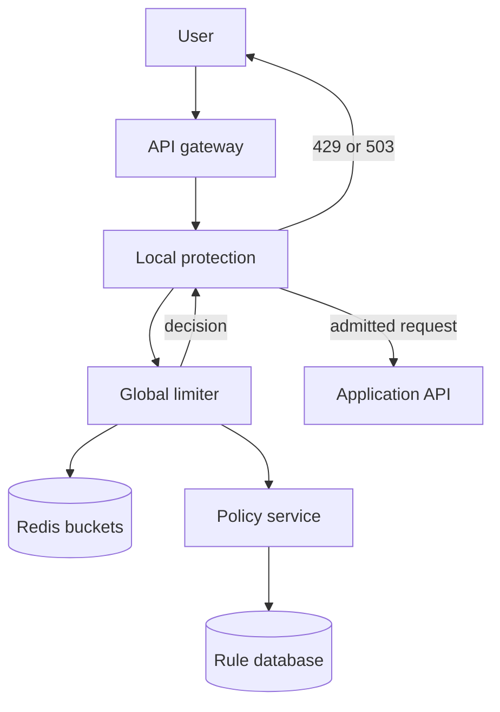
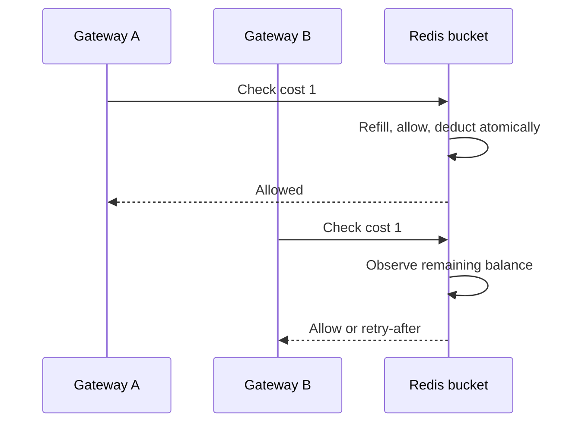
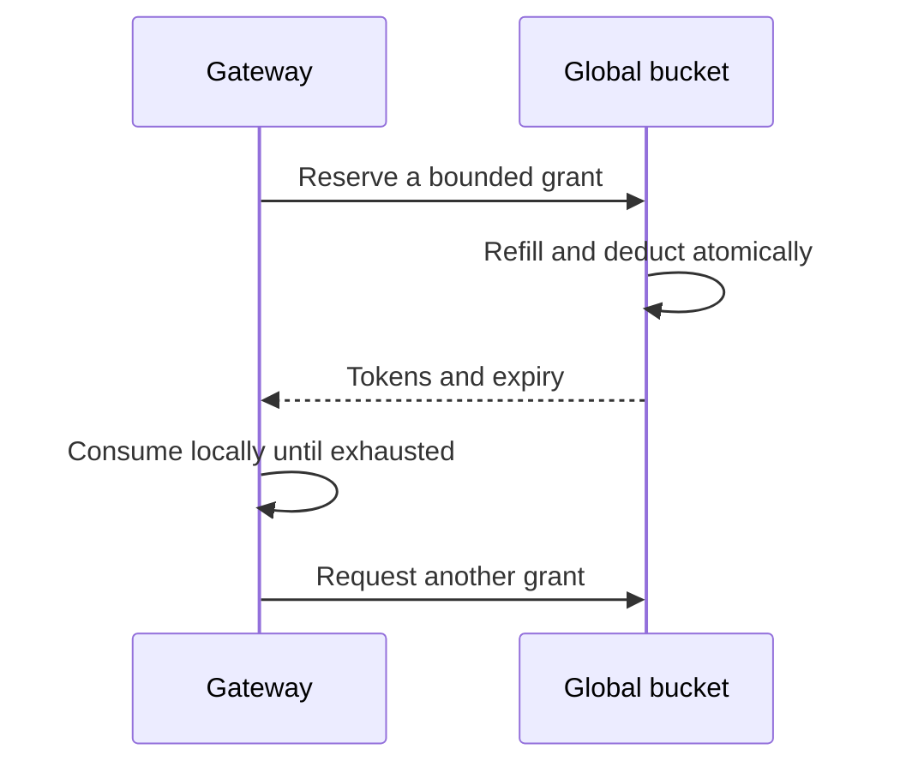

Limit API traffic by user, API key, IP address or endpoint, with explicit burst and failure policies.

<!--more-->

## Problem

A client can send more requests than an API can safely process. A rate limiter checks each request before forwarding it and returns HTTP 429 when the client has exhausted its allowance.

The same client may reach several gateway instances. Those instances need shared accounting, while popular keys and backing-store failures require bounded work on the request path.

## Requirements

### Functional requirements

- **Identify clients:** use authenticated user/API-key identity or a trusted client IP.
- **Enforce rules:** match endpoints and identities to configurable rate, burst and weighted-cost limits.
- **Explain rejection:** return HTTP 429 with retry guidance.
- **Update policies:** distribute versioned rule changes across gateways.
- **Handle failures:** apply a defined fallback for each rule.

### Non-functional requirements

- **Scale:** target 1M request checks/s across 100M daily active users.
- **Latency:** limiter overhead P99 below 10ms within a region.
- **Consistency:** atomic consumption for one bucket; disclose relaxed guarantees from local grants and failover.
- **Availability:** preserve bounded local protection when global accounting is unavailable.
- **Security:** trust identity and forwarding headers only from verified authentication and proxies.

Request billing and lifetime financial quotas require a separate durable accounting system.

## Back-of-the-envelope calculations

- **Checks:** 1M requests/s × 3 matching rules = up to 3M bucket evaluations/s before batching.
- **State:** 5M active buckets × an assumed 80-byte payload = 400MB before Redis key/object overhead and replicas.
- **Grants:** batches of 10 tokens can approach a 10× reduction for busy keys; sparse traffic saves less and can waste grants.
- **Capacity:** benchmark script cost, key skew and network pools. Simple-command throughput is not a reliable shard-count estimate.

A per-client hot key remains serialized even when other buckets are distributed across many shards.

## Core entities

- **RateLimitRule** defines how traffic is charged and how failures are handled.
- **BucketState** tracks available tokens for one rule and identity.
- **TokenGrant** reserves a short-lived allowance for a gateway; unused grants expire conservatively.

```protobuf
message RateLimitRule {
  string rule_id;
  int64 version;
  string identity_type;
  string endpoint_pattern;
  string algorithm;
  double tokens_per_second;
  double burst_capacity;
  string failure_policy;            // Local fallback or unavailable.
}
message BucketState {
  string client_key;
  string rule_id;
  int64 rule_version;
  double tokens;
  int64 last_refill_us;
}
message TokenGrant {
  string grant_id;
  string gateway_id;
  string bucket_key;
  int32 remaining;
  Timestamp expires_at;             // Expired tokens are discarded.
}
message LimitDecision {
  bool allowed;
  int64 remaining;
  int64 retry_after_ms;
  string limiting_rule;
}
```

## API

```yaml
POST /ratelimit/check:
  access: internal-authenticated-gateway
  body: {identity: verified-id, endpoint: route-id, cost: positive-number}
  result: {allowed: boolean, remaining: integer, retry_after_ms: integer}
PUT /ratelimit/rules/{rule_id}:
  access: policy-administrator
  body: {version: integer, algorithm: token_bucket, rate: positive-number, burst: positive-number, failure_policy: local}
  result: {version: integer}
HTTP 429:
  headers: {Retry-After: integer-seconds}
  body: {error: rate_limited, retry_after_ms: integer}
HTTP 503:
  body: {error: limit_service_unavailable}
```

The check service derives matching rules from trusted configuration. Public clients cannot supply their own rule, cost or grant.

## High-level design

The gateway applies a coarse local limiter first. Global checks use Redis-backed atomic buckets; eligible high-throughput rules can reserve short-lived local token grants. PostgreSQL stores policy versions.


```mermaid
flowchart TB
  U["User"] --> G["API gateway"]
  G --> L["Local protection"]
  L --> R["Global limiter"]
  R --> B[("Redis buckets")]
  R --> C["Policy service"]
  C --> P[("Rule database")]
  L -->|admitted request| A["Application API"]
  R -->|decision| L
  L -->|429 or 503| U
```

## Storage

- **PostgreSQL:** versioned rules and policy audit history. Validate updates before publication and distribute an immutable rule snapshot.
- **Redis Cluster:** active buckets with expiry after the full refill horizon. Route a bucket consistently; a Lua script performs refill, check and deduction atomically.
- **Gateway memory:** cached rule snapshots, coarse local limits and expiring grants. A restart loses unused grants, reducing available allowance.
- **Metrics pipeline:** aggregated allows, rejections, degraded checks, script latency and grant waste. Avoid exposing raw credentials in keys or logs.

Redis replication/failover can lose acknowledged deductions under some configurations. Hard financial quotas need stronger durable coordination; a rate limiter protects traffic rather than acting as a billing ledger.

## From request to response

### Identifying and matching a request

Authenticate the request, then use the resulting user or API-key ID. For anonymous traffic, derive IP from the connection and an explicitly trusted proxy chain. Strip or ignore client-supplied forwarding headers.

Match the normalized route and identity to a versioned rule snapshot. An IP limit and a user limit are separate buckets. Bound the number of evaluated rules so policy configuration cannot create unbounded request work.

### Consuming allowance

A local grant, if valid for the current rule version, can admit a request immediately. Otherwise the global limiter reads, refills and deducts tokens in one Redis operation.

When several independent rules apply, rejection by any rule stops forwarding. Earlier deductions can remain charged as attempted requests; policies must state this behavior. Atomic admission across unrelated Redis slots would require different coordination.

### Returning a rejection

Calculate the time until enough tokens exist for the requested cost. Round up to whole seconds for Retry-After and provide finer guidance in the body. A short local rejection cache can absorb repeated abuse, with a bounded expiry tied to the decision.

A rejected request gets 429. Failure to determine allowance gets 503 when the rule requires global enforcement; these are different outcomes.

### Updating rules and handling outages

Publish validated configuration with a new version. Gateways invalidate older grants and apply the new rule snapshot. A version transition can reset burst state, so reductions need a deliberate migration policy rather than silently initializing a fresh full bucket.

During an outage, enforce a bounded local emergency limit for availability-oriented rules. Sensitive endpoints can require global admission and return 503. Track the time and volume served under fallback.

## Deep dives

### How should we choose the algorithm?

**Problem:** rate, burst, rolling-window and concurrency limits express different policies.

| Algorithm | Useful behavior | Tradeoff |
| --- | --- | --- |
| Fixed-window counter | Simple calendar-window limit | Boundary bursts |
| Sliding-window counter | Low-memory rolling estimate | Approximation depends on traffic shape |
| Sliding request log | Exact retained-window count | State and cleanup grow with requests |
| Token bucket / GCRA | Controlled sustained rate and burst | Needs careful time and atomic updates |

**Recommendation:** use token buckets for API fairness and burst control. Choose an exact log only for a workload needing precise rolling-window semantics. Concurrency limits separately bound in-flight work; a request-rate limit alone cannot protect a slow upstream.

[Envoy's global rate-limiting architecture](https://www.envoyproxy.io/docs/envoy/latest/intro/arch_overview/other_features/global_rate_limiting) is a useful reference for combining local protection and a shared decision service.

**A token-bucket example.** With capacity ten and refill rate two tokens/s, a full bucket admits a burst of ten unit-cost requests immediately. After spending all ten, two seconds of idle time restore four tokens. Sustained traffic can continue at two requests/s once the initial burst is exhausted.

This differs from a fixed “ten per five seconds” counter, which can admit ten requests just before a window boundary and another ten just after it. An exact sliding log avoids that boundary burst but stores timestamps for retained requests.

Request rate and concurrency solve separate problems. If an upstream call takes 30 seconds, two admitted calls/s can create about 60 concurrent calls. Add an in-flight limit that is released on completion or timed expiry. Select cost weights for expensive endpoints before applying the bucket, and version the policy so gateways interpret cost consistently.

### How do we prevent concurrent token consumption races?

**Problem:** separate reads and writes can allow two gateways to spend the same token.

- **Client read-modify-write:** introduces a lost-update race.
- **WATCH/MULTI retries:** can coordinate updates, with retries under contention.
- **Atomic Lua script:** performs the bounded calculation next to bucket state.

**Recommendation:** use one bounded script per bucket. [Redis documents atomic script execution](https://redis.io/docs/latest/develop/programmability/eval-intro/); the script blocks other server work while it runs, so avoid loops over request history.

```lua
-- KEYS[1]: bucket. ARGV: rate, capacity, positive cost.
local rate, cap, cost = tonumber(ARGV[1]), tonumber(ARGV[2]), tonumber(ARGV[3])
if not rate or not cap or not cost or rate <= 0 or cap <= 0 or cost <= 0 or cost > cap then
  return redis.error_reply("invalid bucket parameters")
end
local t = redis.call("TIME")
local now = tonumber(t[1]) * 1000000 + tonumber(t[2])
local s = redis.call("HMGET", KEYS[1], "tokens", "last")
local tokens = tonumber(s[1]) or cap
local last = tonumber(s[2]) or now
local effective_now = math.max(now, last)
tokens = math.min(cap, tokens + (effective_now - last) / 1000000 * rate)
local allowed, retry_ms = 0, 0
if tokens >= cost then
  tokens, allowed = tokens - cost, 1
else
  retry_ms = math.ceil((cost - tokens) / rate * 1000)
end
redis.call("HSET", KEYS[1], "tokens", tokens, "last", effective_now)
redis.call("PEXPIRE", KEYS[1], math.max(1, math.ceil(cap / rate * 1000)))
return {allowed, math.floor(tokens), retry_ms}
```

The timestamp includes microseconds and clamps backward movement. Expiry occurs only after enough idle time to refill fully. Handle NOSCRIPT by loading the reviewed script and retrying under a deadline; benchmark execution and clock/failover behavior.

**One indivisible decision.** The gateway routes a bucket key to its Redis owner. The script reads stored tokens/time, refills up to capacity, checks cost, deducts if allowed and writes the new state before another script can touch that bucket.


```mermaid
sequenceDiagram
  participant A as Gateway A
  participant B as Gateway B
  participant R as Redis bucket
  A->>R: Check cost 1
  R->>R: Refill, allow, deduct atomically
  R-->>A: Allowed
  B->>R: Check cost 1
  R->>R: Observe remaining balance
  R-->>B: Allow or retry-after
```

With one token remaining, competing scripts produce one allowed result and one rejection. Separate GET and SET operations could let both gateways spend it.

A lost reply is different: the script may have deducted a token even though the gateway timed out. For ordinary traffic protection, conservatively accepting that lost allowance is simpler than refunding an uncertain deduction. If decisions must be retry-idempotent, retain request identities within a bounded decision window and include their memory/latency cost.

### How do local grants reduce global work?

**Problem:** a network check for every admitted request increases Redis load and tail latency.

- **Per-request checks:** simplest accounting, highest shared-store traffic.
- **Independent local buckets:** fast, but their aggregate allowance grows with gateway count.
- **Reserved token grants:** deduct globally once, then consume a bounded grant locally.

**Recommendation:** grant small batches only to busy, burst-tolerant rules. Deduct the grant before returning it, bind it to a gateway/rule version and expire it quickly. Lost or unused tokens are discarded; automatic refunds would require proof that they were never spent.


```mermaid
sequenceDiagram
  participant G as Gateway
  participant R as Global bucket
  G->>R: Reserve a bounded grant
  R->>R: Refill and deduct atomically
  R-->>G: Tokens and expiry
  G->>G: Consume locally until exhausted
  G->>R: Request another grant
```

Grants shift the timing of consumption. The extra instantaneous burst is bounded by outstanding unspent grants, rather than a universal percentage. Cap grant size and grants per identity; monitor utilization and under-admission from lost tokens.

**Grant size and time horizon.** A busy gateway reserves 20 tokens once and spends them locally; it makes one shared check instead of 20. Reserve globally before exposing the grant, bind it to the gateway process and rule generation, and discard unused tokens when it expires or the process restarts.

Twenty gateways each holding 20 unused tokens can collectively emit an extra burst of up to 400 already-reserved requests. Choose grant sizes from that fleet-wide bound, not just the savings in Redis commands. Stop issuing grants when rule changes or dependency health require tighter admission.

Small grants improve fairness but make more shared calls. Large grants strand allowance on idle gateways and extend the time between reservation and use. Adapt grants to measured utilization while retaining a hard size/expiry ceiling. Refunds require durable proof of unused tokens; a gateway merely reporting a crash is insufficient because its requests may already have been sent.

### What happens when global state is unavailable?

**Problem:** unlimited fail-open traffic can overload the application, while universal fail-closed behavior can disable it.

- **Fail open:** maintains access but removes that rule's protection.
- **Fail closed:** protects strict admission, sacrificing availability.
- **Bounded local fallback:** keeps some protection with a disclosed fleet-wide allowance.

**Recommendation:** choose fallback per endpoint and retain coarse local controls everywhere. Login and other abuse-sensitive endpoints require their own policy; being user-facing alone does not justify unlimited admission.

Use circuit breakers and short timeouts to prevent dependency failures from exhausting gateway pools. Alert on degraded-check duration, admitted traffic and upstream saturation. Test lost replies, failover, rule-version changes and gateway crashes as well as normal refill behavior.

**Bounded fallback capacity.** If a shared bucket is unavailable, a local fallback of five requests/s on 100 gateways can admit 500 requests/s fleet-wide. Autoscaling changes that bound, so configure fallback against an explicit gateway-count/capacity envelope or use pre-reserved expiring allowance.

Strict endpoints reject when required coordination is unavailable. Burst-tolerant endpoints may use the approved local fallback while emitting a degraded-decision metric. Every request still passes coarse concurrency protection so slow upstream calls cannot fill all gateway workers.

Use short dependency deadlines and a circuit breaker; repeated Redis timeouts should not consume the full request timeout. On recovery, resume the correct rule generation and discard expired grants. Traffic quotas tolerate a documented amount of failover drift; hard financial spending limits belong to a durable budget-reservation system.
