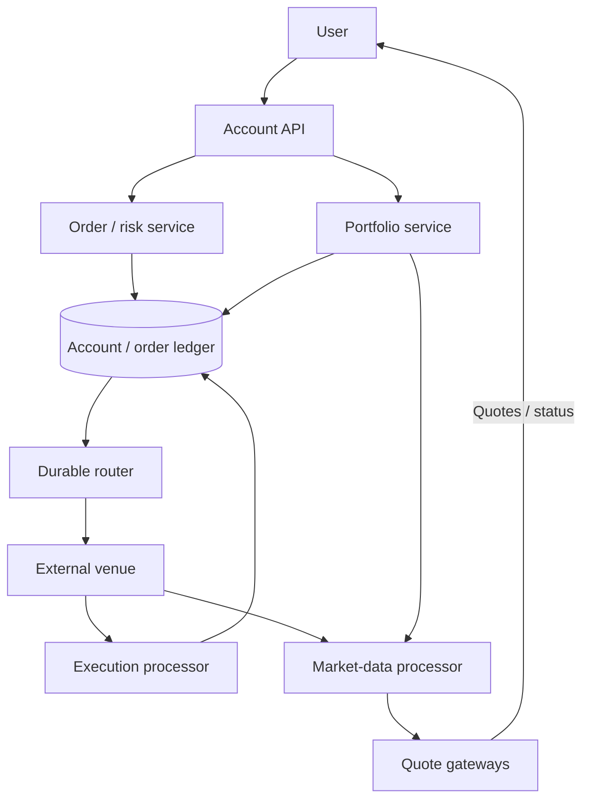
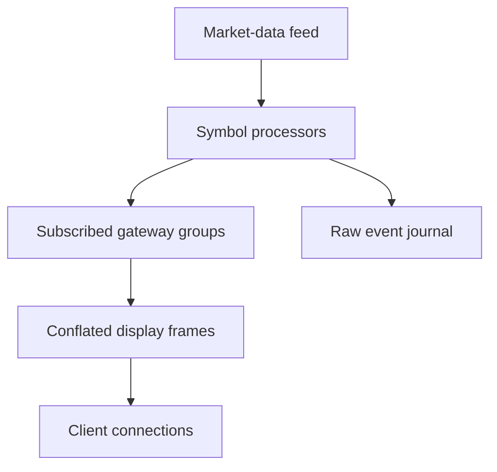
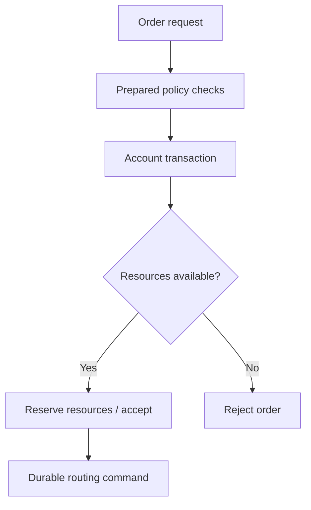

Design of a retail brokerage platform for live quotes, order routing, execution history and portfolio views.

<!--more-->

## Problem

A user checks a stock price, submits an order and follows its progress through execution. The brokerage validates the order, reserves buying power or shares, and routes it to an external venue. It records partial fills, cancellation outcomes and the resulting cash and security movements.

Quote delivery and order processing have different needs. Screen prices can be conflated to a useful refresh rate; order and execution records need durable identities and reconciliation through retries and connection failures.

## Requirements

### Functional requirements

- **View prices:** subscribe to live prices for a bounded watchlist.
- **Place orders:** submit market or limit orders for supported stocks.
- **Cancel:** request cancellation of the remaining open quantity and view its outcome.
- **Review execution history:** show acknowledgments, partial fills, rejections and corrections.
- **View a portfolio:** show holdings, cash, reserved buying power and price-based valuation.

The design covers order routing rather than exchange matching. Options, crypto, after-hours trading, fractional-order aggregation and tax-rule implementation are outside this scope.

### Non-functional requirements

- **Scale:** plan for 15M orders/trading day, a 10× opening burst, 1M inbound market-data updates/s and 5M connected users.
- **Latency:** target quote display below 500ms at P95 under the subscribed workload; order acceptance below 100ms at P99 within the serving region.
- **Durability:** acknowledge order acceptance after its authoritative transaction and configured synchronous replication commit.
- **Consistency:** reserve funds/shares atomically with order acceptance; apply each execution identity once.
- **Availability:** target 99.99% for order/status APIs during the configured trading session; suspend routing when authoritative account or venue state is uncertain.
- **Freshness:** expose quote timestamps, feed health and portfolio valuation time.
- **Security:** authenticate account access, protect financial records and record auditable state transitions.

Actual brokerage operation also requires separately approved market-access, licensing and compliance arrangements; this is an engineering proposal.

## Back-of-the-envelope calculations

- **Order rate:** 15M / (6.5 × 3,600) ≈ 641/s average; a 10× burst is approximately 6.4K submissions/s, each involving several durable writes.
- **Subscriptions:** 5M users × 20 symbols = 100M symbol subscriptions. At four updates/s/subscription, the upper bound is 400M update records/s; batching reduces frames, not the number of records.
- **Raw fan-out:** 1M ticks/s × 10K average subscribers/symbol ≈ 10B delivered records/s under a uniform model. Conflation and interest-based routing are necessary.
- **Audit payload:** 15M orders/day × 1KB × 365 ≈ 5.5TB/year. Actual execution histories, retention and replicas must be sized separately.

Figures are assumptions, not Robinhood or SIP capacity measurements.

## Core entities

- **Account:** authoritative cash, security balances and reservations.
- **Order:** requested trade, routing identity, quantities and state.
- **Execution:** immutable venue evidence of a fill or correction.
- **Reservation:** funds or shares committed to an outstanding order.
- **Ledger transaction:** balanced movements within a currency or security unit.
- **Quote:** price evidence with source, timestamp and sequence.

```protobuf
message Order {
  string order_id;
  string account_id;
  string client_request_key;
  string venue_order_id;
  string symbol;
  string side;
  string order_type;
  string quantity; // Decimal text preserves exact precision.
  string limit_price;
  string filled_quantity;
  string state;
}

message Execution {
  string execution_id; // Unique with venue/session scope.
  string order_id;
  string quantity;
  string price;
  string currency;
  string kind; // Fill, correction or bust.
  Timestamp executed_at;
}

message Reservation {
  string order_id;
  string account_id;
  string asset; // Currency or security identifier.
  string quantity;
  string state;
}

message LedgerEntry {
  string transaction_id;
  string ledger_account_id;
  string asset;
  string signed_quantity; // Entries balance within the same asset.
}

message Quote {
  string symbol;
  string source;
  int64 sequence;
  string bid;
  string ask;
  string last_trade;
  Timestamp source_time;
}
```

Cash and securities are separate accounting units. A dollar debit and a share credit do not sum to zero; settlement and security subledgers use balanced entries in their own units.

## API

```yaml
POST /orders:
  headers: {Idempotency-Key: "..."}
  body: {symbol: AAPL, side: buy, type: limit, quantity: "10", limit_price: "150.00"}
  response: {order_id: "...", state: queued}
  errors: [400 invalid_order, 409 key_payload_conflict, 422 risk_rejected]

POST /orders/{order_id}/cancellations:
  headers: {Idempotency-Key: "..."}
  response: {cancel_request_id: "...", state: pending_cancel}

GET /orders/{order_id}:
  response: {state: "...", filled_quantity: "...", remaining_quantity: "...", executions: [...]}

GET /orders:
  query: {status: open, cursor: "...", limit: 50}
  response: {orders: [...], next_cursor: "..."}

GET /portfolio:
  response: {positions: [...], cash: {...}, reserved: {...}, valuation_time: "..."}

WS /stream:
  subscribe: {quotes: [AAPL, TSLA], order_updates: true}
  snapshot: {quotes: [...], order_watermark: "..."}
```

Order acceptance means the brokerage has durably accepted the request, not that the venue has filled it. A cancel response remains pending until venue evidence establishes the remaining quantity's outcome.

## High-level design

The account-local order transaction reserves resources and emits a routing command. A venue adapter owns FIX sessions and execution evidence. Quote processors use a separate distribution path; portfolio queries combine authoritative holdings with timestamped market data.



## Storage

- **PostgreSQL shards by account:** own orders, reservations, executions and ledger transactions. A transaction locks the relevant account resources, checks risk, reserves them, inserts the order and writes its outbox command.
- **FIX session journal:** durably records sent/received messages, sequence state and venue identifiers. Recovery follows the counterparty's replay and status protocols.
- **Kafka:** distributes committed business events and market data. Kafka transaction guarantees do not make an external venue operation exactly once.
- **Redis and gateway memory:** cache latest quotes and subscription state. Buying power comes from authoritative reservations, not a quote or portfolio cache.
- **Object storage:** retains protected audit exports and reconciliation evidence under the approved retention policy.

Ledger and execution unique constraints support account-local correctness. Quote data uses keyed streaming and caches because its read distribution is much larger. Account shard failover fences the former writer before routing resumes.

## From request to response

### Viewing quotes

Feed handlers validate source sequences and market-data permissions, normalize updates and publish per-symbol values. A distribution layer routes only subscribed symbols to connection gateways. Gateways batch and conflate updates on a configurable timer, then send price, source time and sequence.

Reconnect returns a current snapshot before deltas. A sequence gap or stale source marks quotes degraded; historical tick consumers use retained data rather than the conflated display stream.

### Placing an order

1. The API authenticates the account, validates the order and reserves a unique request key with its input hash.
2. An account-local transaction checks the applicable risk policy and available resources, reserves cash or shares, and writes the order and routing command.
3. After commit, the router sends the stable venue order identity. A network timeout enters an unknown-routing state until session replay or venue inquiry resolves it.
4. Venue evidence updates the order. Accepted, rejected, partially filled and filled are distinct states.
5. Each execution is durably deduplicated and applied with reservation, cash/security ledger and position changes in the same account transaction.

A retry using the same key returns the same order. Different keys still compete for the same locked resources, so concurrent requests cannot both spend the same buying power.

### Cancelling an order

The service records a cancel intent and sends the venue's cancellation request. Fills can continue while cancellation is pending. Once the venue confirms cancellation, only the unfilled remaining quantity is released. A fully filled order keeps its fills and reports that no remaining quantity was cancelled. [FIX order-state semantics](https://www.fixtrading.org/online-specification/order-state-changes/) define these distinctions.

### Viewing history and portfolio

Order history queries the account's durable order and execution records with a stable cursor. Portfolio queries read current holdings and reservations, batch-fetch quote snapshots and compute valuation using exact decimal arithmetic. Values include their as-of time; market-price changes update valuation, not reserved cash.

Each buy fill also records acquisition evidence for lot accounting. Tax-lot selection, corporate actions and jurisdiction-specific adjustments are handled by a separately versioned policy rather than inferred from displayed average cost.

## Deep dives

### How do we distribute quotes without forwarding every tick?

**Problem.** Raw ticks can arrive much faster than a screen needs to update, and popular symbols concentrate subscribers.

- **Broadcast every tick to every user:** simple routing, with excessive scanning and delivery.
- **Symbol-owned gateways:** efficient lookup, but hot symbols can overload one node and multi-symbol users need routing across owners.
- **Symbol processors plus connection-owned gateways:** process each symbol once, then deliver conflated updates to the gateways that have subscribers.

**Recommendation.** Separate symbol processing from connection ownership. Each client has one gateway connection; that gateway registers interest in its watched symbols. Hot-symbol distribution is replicated to multiple gateway groups, with each connection receiving one stream.

Conflate on the server before network delivery, retaining the latest display update per symbol per interval. Send batched frames and enforce subscription limits. Slow clients receive a fresh snapshot or are disconnected before buffers grow without bound. Measure input lag, delivered-record rate, connection count, egress and stale-quote percentage.

**Quote path.** A symbol processor consumes ticks in sequence and maintains its latest valid quote. Each connection gateway registers the symbols its clients watch. The processor publishes to interested gateway groups; gateways batch updates for their own connections.

For a display interval of 100 ms, 20 ticks for one symbol can become one frame containing the latest price and source timestamp. This reduces screen-update traffic, while the raw stream remains available to systems that require every tick. Tag snapshots and updates with a generation/sequence so a reconnect can distinguish a new stream from an old packet.



A slow connection keeps one pending latest value per symbol, subject to a total buffer limit. If it exceeds that limit, send a resnapshot or disconnect. Quote age travels with the value; the UI can show stale data rather than presenting an old price as live.

### How do retries avoid duplicate orders and lost executions?

**Problem.** Local acceptance, venue routing and fills cross durability and network boundaries.

- **API key only:** prevents repeated local creation, but does not resolve an uncertain venue send.
- **Durable command/outcome journal:** preserves identity and routing progress through crashes.
- **Reconciliation alone:** detects discrepancies later, but leaves the real-time account state uncertain.

**Recommendation.** Combine local idempotency, durable venue command identities and reconciliation. Reusing an API key with changed input returns a conflict. The router uses the same ClOrdID and follows the venue's FIX replay rules instead of creating another logical order after a timeout.

Execution identity and content are checked before application. A repeated fill returns its recorded result; a conflicting payload or correction enters explicit review/correction handling. Legitimate fills for older orders remain valid even when the account has accepted newer orders—an account-wide version must not discard them.

Cancel acknowledgments and fills are applied according to their quantities and venue ordering, not simply whichever message reaches a consumer first. Recovery compares order status and execution totals with venue evidence. Track unacknowledged commands, unresolved outcomes and reconciliation differences.

**Order identity through recovery.** The API transaction saves the user request key, input hash, order ID and routing command. The router records a stable venue command identity before sending it. Losing the venue response leaves that command unresolved; recovery follows the counterparty's replay/status protocol rather than issuing a new logical order.

An execution report is deduplicated by the venue's documented execution identity. Applying a new fill updates cumulative quantity, remaining quantity, reservations and accounting in one account-local transaction. A report for an older order is still valid; filtering by the account's latest order version would lose legitimate fills.

For example, a 100-share order fills 40 shares while a cancel is pending. The service applies the 40-share execution, then processes the venue's confirmed cancellation of the remaining quantity. Sending a cancel request alone does not release the full reservation. The [FIX order-state specification](https://www.fixtrading.org/online-specification/order-state-changes/) documents fills during pending cancellation. Preserve original executions and append explicit corrections when venue evidence changes them.

### How do risk checks remain consistent with accepted orders?

**Problem.** Cached balances can lag, and two simultaneous orders may each appear affordable.

- **Cached risk only:** fast, with unsafe resource races.
- **All checks in a long database transaction:** authoritative, but slow external lookups hold locks.
- **Prepared policy plus atomic account reservation:** performs final resource checks against durable state while keeping the transaction short.

**Recommendation.** Prepare versioned policy decisions and account restrictions ahead of submission. Inside the account transaction, revalidate their freshness and atomically reserve available cash or shares. A market order needs a defined buying-power buffer and price-protection policy, not an unbounded reservation calculated from a stale last trade.



A cache can accelerate evaluation but cannot authorize spending beyond the durable balance. Missing authoritative account state pauses acceptance; stale optional features fall back to approved checks. Measure account lock waits, rejection reasons, policy age and unresolved reservation age.

**Atomic buying-power reservation.** Suppose an account has \$1,000 available and two simultaneous requests each need \$700. Both may pass a cached precheck. Inside the account transaction, lock the resource record, recheck available funds and insert the reservation with the order. The first transaction leaves \$300 available; the second then rejects for insufficient resources.

Compute risk using a policy version, a quote-age bound and the order's limit or defined market-order protection. External enrichment happens before the short transaction. Revalidate any mandatory policy version inside it so a newly restricted account cannot slip through on a stale prepared decision.

Partial fills consume the corresponding reservation and create executed positions. A confirmed cancel releases only the remaining reserved amount. Rejections and expiry similarly use the order's authoritative state and version. Track unresolved reservations explicitly: clearing them merely because a router timed out could allow the account to spend funds already committed at the venue.

### How do portfolio views and the ledger stay aligned?

**Problem.** Display values change with quotes, while balances change with fills, fees, transfers and corrections.

- **Recalculate everything on each tick:** current, with excessive work.
- **Cache every portfolio indefinitely:** cheap, but stale after position changes.
- **Durable accounting plus active-session valuation:** update accounting on business events and refresh only displayed valuations.

**Recommendation.** Apply execution and balanced ledger changes once, update account positions transactionally, and value active portfolios from batched timestamped quotes. An execution correction appends reversal/replacement evidence rather than silently editing the original fill.

Balances are checked per asset and currency; reserved and settled quantities remain distinct. Rebuild position views from retained accounting events, then compare them with custody and venue statements. Monitor ledger balance, position divergence, stale valuation and correction backlog. A balanced ledger is necessary but does not alone prove that an external execution or settlement was correct.

**Accounting versus valuation.** A ten-share fill creates durable position/accounting changes once. Later price ticks update only the displayed valuation, such as `10 × latest_quote`, with a quote timestamp. The account's settled cash and reserved buying power remain independent of that display calculation.

Build the portfolio projection from a checkpoint and retained business events, recording its applied account sequence. A client can then see whether its order execution has reached the displayed position view. Market valuation uses batched latest quotes for active sessions instead of recomputing every dormant portfolio.

If the venue corrects a fill price, append a correction tied to the original execution and reverse/replace the affected accounting entries. Reconciliation compares executions, positions, fees and settlement evidence at a common cutoff. Balanced debits and credits validate local accounting structure; custody and venue comparisons validate whether those local records correspond to the external business outcome.
