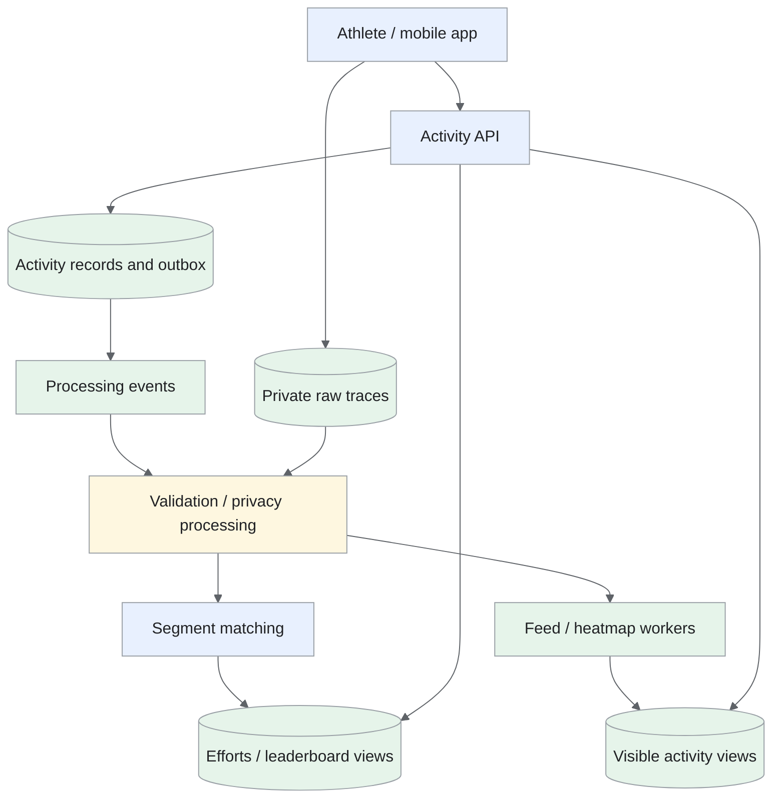
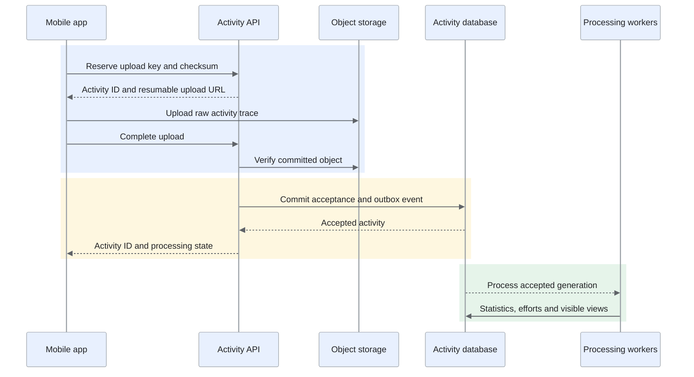
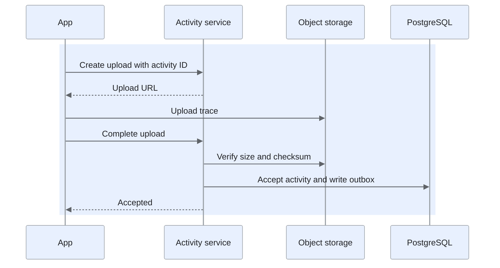

A GPS activity service for offline recording, activity sharing and segment leaderboards.

<!--more-->

## Problem

An athlete records a run or ride, often without a reliable connection, then uploads it when connectivity returns. The service stores the activity, identifies completed segments and updates eligible leaderboards and followers' feeds.
Uploads must survive retries. Segment matching and leaderboard work can run asynchronously, while privacy rules govern every shared route, map and result.

## Requirements

### Functional requirements

- **Record and upload:** preserve GPS samples locally while offline and resume interrupted uploads.

- **View activities:** show summary statistics, a privacy-filtered route and matched efforts.

- **Read a social feed:** activities from followed athletes, with optional group-activity cards.

- **Compare efforts:** top segment results and personal bests for supported leaderboard filters.

- **Interact:** kudos and comments with permission checks.

- **Discover routes:** nearby routes and personal heatmaps; public heatmaps use eligible aggregated data.

### Non-functional requirements

- **Scale:** assume 10M activities/day, 30M segments and a large historical effort archive.

- **Latency:** feed P99 below 500ms; cached/supported top-100 leaderboards P99 below 200ms.

- **Processing:** segment results P99 within 60s after a complete validated upload under provisioned load.

- **Durability:** acknowledge completed upload acceptance only after the raw object and metadata are durable.

- **Correctness:** one accepted activity per athlete/upload key; repeated processing preserves one logical effort.

- **Privacy:** raw GPS access is owner-restricted; current sharing and privacy-zone policy applies to derived outputs.

Live tracking, payments and external-device integrations are outside this design.

## Back-of-the-envelope calculations

- **Uploads:** 10M/day ≈ 116/s average; a 5× burst gives 580/s.

- **Efforts:** at eight matches/activity, peak processing produces about 4.6K efforts/s before leaderboard-view updates.

- **GPS:** 10M × 10K points × 100 bytes = 10TB/day raw, or 3.65PB/year before compression and retention.

- **Leaderboard cache:** 30M segments × 1K entries × 60 bytes = 1.8TB before [Redis](/designs/tech-redis/) overhead and replicas; cache the hot subset.

- **Matching:** cost depends on candidate segments and points in the matching subtrace; measure both instead of comparing every activity with every segment.

## Core entities

- **Activity** binds an athlete's upload to its raw trace and current visibility.

- **Segment** describes a reference path.

- **SegmentEffort** records one matched traversal and its timing.

- **AthleteBest** materializes one eligible best result per athlete/segment/filter.

```protobuf
message Activity {
  string activity_id;
  string athlete_id;
  string upload_key;                // Unique within athlete_id.
  string raw_object_key;
  Timestamp started_at;
  string sport;
  string visibility;
  string processing_status;
  int64 processing_version;
}
message Segment {
  string segment_id;
  string reference_geometry;
  repeated string spatial_cells;    // Candidate lookup, not a confirmed match.
}
message SegmentEffort {
  string effort_id;
  string activity_id;
  string segment_id;
  string athlete_id;
  int32 traversal_index;            // Distinguishes repeated laps.
  int64 elapsed_milliseconds;
  string eligibility;
}
message AthleteBest {
  string segment_id;
  string filter_key;
  string athlete_id;
  string effort_id;
  int64 elapsed_milliseconds;
}

```

Profile attributes used for filters have an explicit policy and access scope; they are not exposed by default in public activity responses.

## API

```yaml
POST /activities/uploads:
  headers: {Idempotency-Key: client-upload-key}
  body: {sport: run-or-ride, size_bytes: integer, checksum: hash}
  result: {activity_id: id, upload_url: signed-url}
POST /activities/{activity_id}/complete:
  result: {status: 202, processing_status: queued}
GET /activities/{activity_id}:
  result: {summary: object, visible_route: polyline, efforts: []}
GET /feed:
  query: {cursor: opaque, limit: 20}
GET /segments/{segment_id}/leaderboard:
  query: {filter: supported-filter, year: optional-year}
  result: {entries: [], generated_at: timestamp}
PUT /activities/{activity_id}/kudos:
  result: {status: 204}
POST /activities/{activity_id}/comments:
  headers: {Idempotency-Key: client-comment-key}
  body: {text: comment}
GET /routes:
  query: {bounds: bounding-box, sport: sport}
GET /me/heatmap:
  query: {from: date, to: date}

```

Each read rechecks current visibility. Raw stream access is separate from the public route endpoint.

## High-level design

The phone retains its recording until upload acceptance is confirmed. Processing generates privacy-aware summaries, efforts and feed events; read services use materialized results.


## Storage

- **Mobile SQLite:** append GPS samples with crash-safe commits and retain the recording until server acceptance. Flush frequency determines the recoverable local loss window.

- **Object storage:** encrypted raw FIT/GPX files and processed trace generations; explicit lifecycle retention and owner-authorized access.

- **[PostgreSQL](/designs/tech-postgresql/)/PostGIS:** activity metadata, uploads, sharing policy, segments and transactionally emitted events. A spatial index/cell lookup narrows matching candidates.

- **Segment-owned PostgreSQL shards:** canonical recent efforts and athlete-best materializations with a unique `(segment, filter, athlete)` key and ordered `(segment, filter, elapsed, athlete)` index. Best updates and replacement index entries commit together.

- **Object-storage Parquet archive:** older immutable efforts for replay/backfill and analytical queries. Keep the online data required for current bests and deletion/recomputation.

- **Redis and [Kafka](/designs/tech-kafka/):** bounded hot feed/leaderboard caches; versioned processing and fan-out events with checkpoints.

Historical Strava work on [segment leaderboards](https://medium.com/strava-engineering/rebuilding-the-segment-leaderboards-infrastructure-part-1-background-13d8850c2e77) provides context. This proposal uses transactionally maintained bests rather than inserting every effort into a public ranking.

## From request to response

### Activity upload flow



The app retains its recording until server acceptance. Processing starts from the committed event, and every stage identifies the activity generation; a mobile retry therefore resumes the same upload or reads its status instead of creating duplicate activities and efforts.

### Recording and uploading

The app records timestamped samples locally and creates an upload key. The API reserves `(athlete_id, upload_key)` with the request checksum and returns a resumable signed destination. Repeated requests return the same activity.
Completion verifies object size/checksum, then commits the accepted status and outbox event together. Processing begins only after that commit. Interrupted uploads remain pending and retryable; retention cleanup applies only to abandoned uploads under a defined policy.

### Processing and segment matching

Workers validate samples, preserve the raw trace and produce versioned statistics and sharing-safe geometry. Spatial lookup selects nearby candidate segments. Matching then checks ordered traversal, direction, endpoints, elapsed time and sample quality over the relevant activity subtrace.
Effort identity includes activity, segment and traversal index. A stage persists its output and progress before advancing; retries update that generation rather than creating duplicate efforts. Matching the entire long activity against a short segment would be both expensive and inaccurate; candidate/subtrace selection is covered below.

### Reading leaderboards

A worker selects the athlete's best eligible effort for each supported view and updates that view in a transaction. The leaderboard API reads its ordered top entries, hydrates public profile details and applies current privacy/eligibility policy. It returns an update time.
A new faster effort replaces the previous best; deleting or disqualifying it recomputes from remaining eligible efforts. Custom filter combinations are bounded, not materialized as every possible attribute combination.

### Sharing, grouping and interaction

Feed workers push activity IDs for ordinary authors and active followers; high-fan-out authors can be merged at read time. The read path checks current follows, blocks and activity visibility, then groups only activities the requesting user may see.
Kudos sets desired state under a unique athlete/activity key. Comments use request idempotency and emit notification events after commit. Counts are derived from committed transitions rather than incremented on every retry.

### Routes and heatmaps

Route discovery uses geographic candidates and sport/distance constraints. Personal maps read the owner's eligible processed geometry. Public tiles require explicit aggregation eligibility, privacy clipping and minimum cohort/density rules.
A privacy change or deletion versions the activity and schedules invalidation/rebuild of affected views and tiles. It must affect the public result, not just the activity detail cache.

## Deep dives

### How do uploads survive offline retries?

**Problem:** metadata, object storage and background jobs do not share one transaction.

- **Synchronous upload processing:** Validate and calculate everything before returning. Completion is easy to understand, but long mobile waits and interrupted responses repeat expensive work.

- **Best-effort acceptance:** Return success before verifying the object or durably scheduling processing. The response is fast, but a lost object or event can leave an accepted activity permanently unprocessed.

- **Durable staged acceptance — recommended:** Verify the uploaded object, then commit acceptance and its processing event together. Retries find a stable activity state; pending uploads and outbox recovery require explicit lifecycle management.
**Recommendation:** use staged acceptance with exact database uniqueness. A Bloom filter may help avoid unnecessary checks but must not reject an upload by itself. Keep the pending/accepted/processed states explicit and let the app query them after an ambiguous response. Mobile connectivity makes interrupted upload responses normal. We accept a visible pending/processing state and recovery workflow so an accepted activity has both a verified trace and a durable path to processing.
Workers use stage/output versions and persistent deduplication. A corrupted file produces a clear recoverable failure; an unavailable processor leaves a durable queued activity. Monitor pending-upload age, accepted-to-processed latency and orphan objects.
**Upload protocol.** The app allocates a stable activity ID before uploading and keeps it across retries. The server creates an upload record with expected size/checksum and issues a narrowly scoped object-upload URL. After upload, the app calls completion; the server verifies the object and transactionally changes the activity to accepted while adding the processing event.



If the final response is lost, the app queries the stable ID. An accepted activity is already queued, so the original trace can stay local until the app receives acceptance confirmation. Processing writes a deterministic generation of efforts and derived data before advancing its checkpoint. Abandoned uploads and unattached objects are cleaned only after a grace period that excludes active retries.

### How do we match a short segment within a long activity?

**Problem:** GPS noise, repeated laps and parallel roads make spatial overlap insufficient.

- **Brute-force alignment:** Compare every catalog segment with the full recorded trace. Coverage is straightforward, but catalog size and trace length make matching expensive.

- **Bounding-box candidates:** Use spatial overlap before alignment. Lookup is cheap, but parallel roads and dense paths produce many false candidates and overlap alone does not prove traversal.

- **Spatial cells with ordered subtrace verification — recommended:** Cover the route and GPS-accuracy corridor with cells, then verify direction and ordered start/end crossings on a bounded subtrace. Alignment work falls; cell coverage and noisy sample quality still need validation.
**Recommendation:** cover paths with cells and neighboring/corridor cells appropriate to reported GPS accuracy. Use spatial overlap to find candidates, then locate start/end crossings in order and align the bounded subtrace. Apply direction and path coverage before more expensive banded alignment. A long activity may contain several laps and nearby unrelated roads. We accept two-stage spatial and trajectory checks so matching work is bounded without turning geographic overlap into an effort claim.
Keep ambiguous matches out of competitive leaderboards and provide correction/appeal handling. Thresholds are calibrated by sport, sample quality and terrain; neither cell overlap nor a fixed distance threshold guarantees a correct traversal. Backfills for new segment versions run at lower priority.
**From nearby paths to a verified effort.** Take a 30-km ride containing a 500-m segment. Spatial cells first find activities passing near the segment's corridor. The verifier then walks the activity samples in timestamp order to find a start crossing followed by an end crossing in the correct direction. It trims that subtrace and compares its path to the segment; most unrelated portions of the ride never enter the expensive comparison.
Repeated laps can produce several valid start/end pairs. Evaluate each pair separately rather than pairing the first start with the last end. Interpolate crossing time between neighboring samples only when their distance and time gap fit the accuracy policy. A two-minute recording gap across the entire segment yields uncertain evidence rather than a competitive time.
Banded path alignment compares nearby positions in sequence, accommodating GPS noise while limiting work. A parallel road may pass through the same cells but fail direction or corridor coverage. Persist segment version, trace generation and match confidence with each effort so a correction can reproduce the decision.

### How should filtered leaderboards store personal bests?

**Problem:** ranking every historical effort repeatedly is costly and can show the same athlete several times.

- **Aggregate historical efforts on read:** Select each athlete's best eligible effort for every request. The source model is simple, but popular segments repeatedly scan many historical records.

- **Redis-only rankings:** Keep all view rankings in memory. Reads are fast, but memory, deletion recomputation and complete recovery become expensive, and caches would own correctness.

- **Durable personal-best views with hot caching — recommended:** Maintain one eligible best per athlete and supported view transactionally, then cache top pages. Reads are bounded; workers must recompute a replacement after deletion or disqualification and control the number of filter combinations.
**Recommendation:** use segment-owned transactional best materializations and cache frequently read top pages. Workers serialize updates by segment and carry fencing/version checks during ownership changes. Kafka ordering helps processing, but database constraints still protect concurrent retries. Leaderboards repeat the same popular reads while effort corrections must remain recoverable. We accept materialization and replacement work to preserve one ranked best per athlete, rather than paying historical aggregation on every page.
Deletion of a best effort selects the next eligible result. Attribute/filter policy changes create a new view generation and replay affected history. Exact personal rank over huge populations requires additional rank/count structures or a bounded offline computation; top-100 lookup alone does not make deep rank a constant-time query.
**Updating a personal best.** A new eligible effort of 58 seconds arrives for an athlete whose best is 61 seconds. In the segment-owned transaction, insert the effort, conditionally replace that athlete's best, and update the ordered best index. A slower 64-second effort is retained in history while leaving the ranking unchanged. The unique athlete/view key prevents duplicate leaderboard entries during replay.
Use an ordered index such as `(segment_id, view_generation, elapsed_ms, athlete_id)`. The athlete ID breaks ties deterministically; presentation can still display tied rank according to policy. Cache top pages under a leaderboard generation and invalidate them only after the transaction commits.
If the 58-second activity becomes private or is deleted, find the athlete's next eligible effort and replace the materialized best. This requires retained effort history or a replay source, not just the previous best value. Changing an age/category filter builds a separate view generation before publication. Exact deep personal rank needs an order-statistics/counting structure; a cache of the first page answers only top-page queries.

### How do feeds and group cards preserve privacy?

**Problem:** large follower counts increase writes, and group inference can reveal hidden activity.

- **Push every activity:** Fan out new activity IDs to all followers. Reads are cheap, but large authors and inactive followers create substantial write work.

- **Pull every followed athlete:** Merge activities on demand. Publishing is inexpensive, but high-follow-count users incur many reads and expensive merges.

- **Hybrid delivery with current visibility checks — recommended:** Push ordinary active-follower work and merge high-fan-out authors on read. Costs are balanced; materialized views still require fresh privacy checks and group-card verification over only visible activity.
**Recommendation:** tune hybrid thresholds from measured fan-out and merge cost. Precompute group candidates by time and route similarity, then verify spatial/temporal overlap. Similarity signatures are candidate features, not proof that athletes exercised together. Fan-out varies widely, while group inference can reveal hidden participation. We accept read-time eligibility and merge work so caching and similarity candidates never bypass current sharing policy.
Apply the requesting user's visibility filters before assembling a group card. On privacy changes, invalidate feed entries, grouping and heatmap generations together. Monitor propagation lag, cache recovery and hidden-content audit checks alongside feed latency.
**Privacy-aware assembly.** Fan-out writes activity IDs into feed candidates, not permanent copies of all private content. At read time, batch-check current activity visibility and assemble cards only from permitted records. A stale feed entry then becomes removable metadata rather than an information leak.
Group detection uses coarse candidate matching followed by a bounded comparison of overlapping time and route samples. Two athletes on the same route an hour apart are not a group. Store the participating activity versions with the group generation so a privacy change can find every derived card that depends on that activity.
For a requester, filter group members before exposing names, route geometry or group size; even an anonymous extra participant can reveal private activity. Heatmaps use their separate aggregation and minimum-population policy. Privacy updates publish invalidation events for feed caches, group cards and aggregate generations, and read-time checks protect the transition while those consumers catch up.
