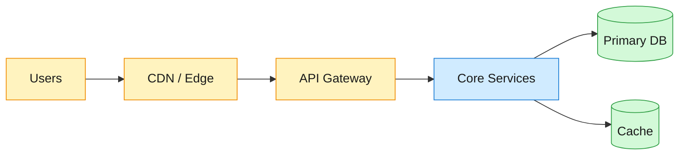
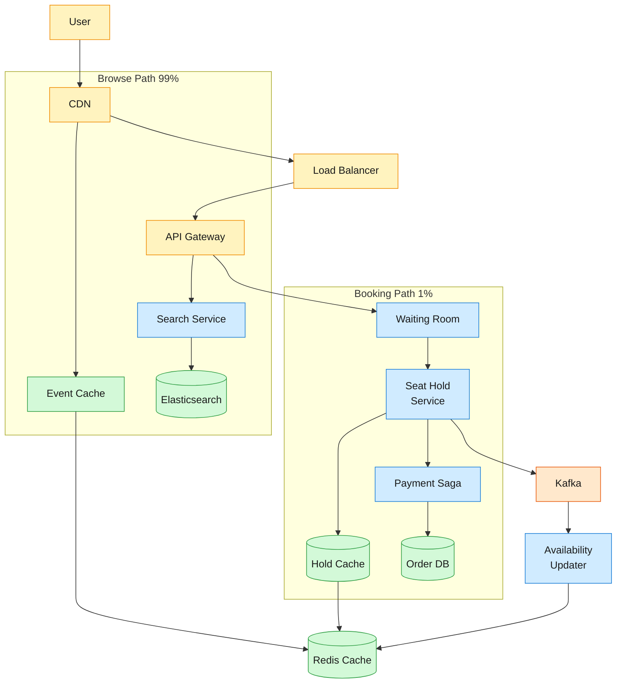
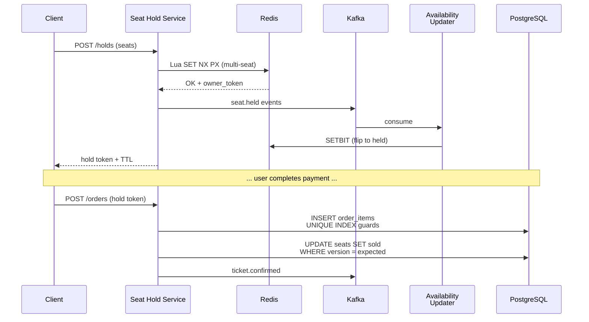

Ticketmaster sells 500M tickets a year across 30 countries as the dominant primary-ticketing marketplace. The hard problem is the flash onsale: 14M people compete for 60,000 seats when Taylor Swift or the Super Bowl goes on sale. Demand outstrips supply 83:1, browse traffic hits 2.

<!--more-->

## 1. Problem

Ticketmaster sells 500M tickets a year across 30 countries as the dominant primary-ticketing marketplace. The hard problem is the flash onsale: 14M people compete for 60,000 seats when Taylor Swift or the Super Bowl goes on sale. Demand outstrips supply 83:1, browse traffic hits 2.8M requests per second, and the booking path must never double-sell a seat. The system splits cleanly into a read-heavy browse path (99% of traffic, served from caches) and a correctness-critical purchase path (1% of traffic, with strong consistency guarantees).



## 2. Requirements

**Functional**

- FR1: Browse events by artist, venue, date, and location
- FR2: View seat maps with real-time availability
- FR3: Reserve seats for a limited time
- FR4: Complete purchase with secure payment
- FR5: Queue fairly for high-demand onsales

**Non-functional**

- NFR1: Browse P99 under 500ms, seat refresh under 2s
- NFR2: No seat sold twice under any failure
- NFR3: 14M concurrent users during flash sales
- NFR4: 100:1 read-to-write ratio at peak

*Out of scope: Dynamic pricing, secondary market resale, venue management tools, anti-bot detection.*

## 3. Back of the envelope

- **Browse peak:** 14M concurrent × 1 poll/5s = 2.8M req/s; at 90% CDN hit rate → 280K origin req/s → origin must sustain 280K req/s; CDN absorption is mandatory
- **Onsale write rate:** 60K seats per venue, admitted at 5K users/sec → peak hold issuance ~5K writes/s → write throughput is modest; the hard problem is admission fairness and ordering, not DB write capacity
- **Storage volume:** 500M tickets/yr × 1 KB/order ≈ 500 GB/yr → 5-year footprint ~2.5 TB → storage volume is modest and not the binding constraint

## 4. Entities

```
Event {
  event_id:    uuid      PK
  venue_id:    uuid      FK
  name:        string
  onsale_at:   timestamp
  status:      enum      ← draft, announced, on_sale, completed
}

Venue {
  venue_id:    uuid      PK
  name:        string
  city:        string
  capacity:    integer
  seat_map:    jsonb     ← serialized layout: sections, rows, seat grid
}

Seat {
  seat_id:     uuid      PK
  event_id:    uuid      PK FK  ← composite PK; shard key for Redis
  section:     string
  row:         string
  number:      smallint
  status:      enum      ← available, held, sold
  price:       decimal(8,2)
  held_until:  timestamp? ← hold TTL; null when available/sold
}

Order {
  order_id:    uuid      PK
  user_id:     uuid      FK
  event_id:    uuid      FK
  total:       decimal(8,2)
  status:      enum      ← pending, confirmed, cancelled
  idem_key:    string    ← idempotency key for payment retry safety
  created_at:  timestamp
}

OrderItem {
  order_id:    uuid      PK FK
  seat_id:     uuid      PK FK
  price:       decimal(8,2)
  -- UNIQUE INDEX (event_id, seat_id) prevents double-booking at DB level
}

User {
  user_id:     uuid      PK
  email:       string
  name:        string
}
```

### API

- `GET /events/search?q=&city=&date=&genre=` — full-text search, returns paginated event list
- `GET /events/{id}` — event detail with seat map layout and pricing
- `GET /events/{id}/seats` — real-time seat availability bitmap for seat map rendering
- `POST /holds` — reserve seats, returns hold token and TTL expiry
- `POST /orders` — confirm purchase with hold token and payment method
- `GET /orders/{id}` — order status and ticket delivery state

## 5. High-Level Design



#### FR1: Browse events by artist, venue, date, and location

**Components:** CDN (CloudFront), Search Service, Elasticsearch cluster, Event Cache (Redis).

**Flow:**

1. User opens Ticketmaster or searches. The CDN serves cached event listing pages — 90% of requests never reach origin.
1. For cache misses or dynamic search, the request hits the Search Service.
1. Search Service queries Elasticsearch with full-text, geo, and date-range filters. Elasticsearch indexes are continuously refreshed from the primary database via CDC (change-data-capture through Kafka).
1. Search results include event metadata and a compact availability summary. Event detail pages are cached in Redis with a 60-second TTL.

**Design consideration:** Search read volume dominates. Elasticsearch handles full-text, faceted filtering, and geo queries far better than SQL `LIKE` — and the CDC pipeline decouples search indexing from the operational database so write pressure on PostgreSQL never slows down search.

#### FR2: View seat maps with real-time availability

**Components:** Availability Cache (Redis bitmap), Seat Service, Kafka availability stream.

**Flow:**

1. User opens an event's seat map. The client requests `GET /events/{id}/seats`.
1. The Seat Service reads a compact bitmap from the Availability Cache — one bit per seat, 7.5 KB for a 60,000-seat venue.
1. The client renders the seat map locally, coloring each seat based on the bitmap (available, held, sold). No per-seat requests to the server.
1. The bitmap is refreshed every 1–2 seconds via a Kafka consumer that replays seat-state-change events. The client polls or receives a server-sent event on bitmap version change.

**Design consideration:** Without the bitmap, 5M concurrent viewers scanning 60K seats would require 300B Redis reads per second — impossible. The bitmap compresses the seat map into a single 7.5 KB payload per event. CDN edge caching of the bitmap further reduces origin load; each CDN edge point serves a slightly stale copy that refreshes every 2 seconds.

#### FR3: Reserve seats for a limited time

**Components:** Seat Hold Service, Hold Cache (Redis), Order DB (PostgreSQL), Kafka.

**Flow:**

1. User selects seats and submits a hold request: `POST /holds` with `{event_id, seat_ids, user_id}`.
1. The Seat Hold Service executes a Lua script on Redis that atomically checks and sets each seat key: `SET seat:{event_id}:{seat_id} {owner_token} NX PX 600000` (set-if-not-exists with a 10-minute TTL). All seats for the same event share the same Redis shard (sharded on `event_id`), so the Lua script runs on a single node.
1. If all seats are acquired, the service returns a hold token. If any seat is already held, the entire reservation is rejected and no seats are locked.
1. On success, a `seat.held` event is published to Kafka, which triggers the Availability Updater to flip those bits in the bitmap.
1. If the user does not complete purchase within 10 minutes, the Redis keys expire automatically. A background sweeper reconciles expired holds against the Order DB.

**Design consideration:** Redis SETNX with TTL is the core mechanism because it provides sub-millisecond atomicity without row-level database contention. The PostgreSQL `UNIQUE INDEX (event_id, seat_id)` on `OrderItem` is the belt-and-suspenders — even if Redis loses a hold (crash, partition), the database rejects a duplicate seat at commit time. The hold TTL of 10 minutes exceeds the 99th-percentile payment latency plus user decision time; a shorter TTL frustrates users mid-checkout, while a longer TTL ties up inventory for bots.

#### FR4: Complete purchase with secure payment

**Components:** Order Service, Payment Saga (Temporal), Order DB (PostgreSQL), Stripe.

**Flow:**

1. User submits `POST /orders` with the hold token and payment details.
1. The Order Service validates the hold token against Redis (the token must match the owner recorded in the seat key). Invalid or expired tokens are rejected immediately.
1. The Payment Saga orchestrator (Temporal) begins a workflow:
  - **Step 1 (Charge):** Call Stripe with a server-generated idempotency key: `hash(user_id, seat_ids, attempt_nonce)`. The key is persisted in the Order DB *before* the Stripe call, so a retry reuses the same key and Stripe returns the original result instead of double-charging.
  - **Step 2 (Confirm):** On successful charge, update each seat's status to `sold` in PostgreSQL. The update uses a fencing token (version column) — `UPDATE seats SET status = 'sold', version = version + 1 WHERE seat_id = $1 AND version = $expected_version AND status = 'held'`. If the hold expired between the charge and the confirm, the version check fails and the saga triggers a refund.
  - **Step 3 (Notify):** Publish `ticket.confirmed` to Kafka. The Ticket Service generates the mobile ticket.
1. On any failure, Temporal retries with the same idempotency key. If the charge succeeded but the confirm failed, the saga issues a refund.

**Design consideration:** Two-phase commit (2PC) is not used because Stripe does not support a prepare/commit protocol. The saga pattern with compensating transactions (refund on confirm failure) provides exactly-once semantics across the payment boundary. The idempotency key generated server-side before the provider call is the critical detail — a client-supplied key can be replayed across sessions.

#### FR5: Queue fairly for high-demand onsales

**Components:** Waiting Room, Smart Queue (Redis sorted sets), JWT Admission Gateway.

**Flow:**

1. 30 minutes before onsale, the waiting room opens. Users sign in and are assigned random queue positions via `ZADD queue:{event_id} {score} {user_id}`, where the score is a random value. This eliminates the advantage of loading the page early.
1. At onsale time, the Admission Worker calls `ZPOPMIN` in batches of 5,000 users. Each admitted user receives a signed JWT token (HS256, 15-minute TTL, with a nonce for replay prevention).
1. The admitted user's browser redirects to the seat selection page, presenting the JWT. The Seat Hold Service validates the JWT before processing any `POST /holds` — unadmitted users cannot bypass the queue.
1. The release rate (5,000/sec) is matched to the Seat Hold Service's sustainable throughput. If the Seat Hold Service slows down, the Admission Worker reduces the batch size — the queue absorbs the backpressure.
1. When all seats are sold, remaining queue members are notified.

**Design consideration:** The JWT token decouples queue admission from seat selection. Without it, an admitted user could share the seat-selection URL with a thousand bots. The 15-minute TTL matches the expected seat-selection and checkout window; expired tokens force re-entry through the queue. The random queue position assignment (lottery, not first-come-first-served) is a business choice that reduces the incentive to script page-load bots. The queue and inventory paths are isolated — if the queue layer buckles under 14M concurrent users, the inventory system (which only sees admitted traffic at 5K/sec) remains stable.

## 6. Deep dives

### DD1: Seat reservation and inventory consistency

**Problem.** 5M users compete for 60K seats at onsale. Every user sees a live seat map refreshed every 2 seconds. A reservation must be atomic (all selected seats or none), must prevent double-booking under any failure, and must release unconfirmed holds so inventory is not stranded. Reads outnumber writes 100:1, and the read path must stay fast while the write path stays correct.

**Approach 1: Database row locking**

Run `SELECT ... FOR UPDATE` on the seats table inside a transaction. The database serializes conflicting reservations through row-level locks.

```sql
BEGIN;
SELECT status FROM seats WHERE event_id = $1 AND seat_id IN ($2, $3)
  FOR UPDATE;
-- If all are 'available', UPDATE to 'held'.
UPDATE seats SET status = 'held', held_by = $4,
  held_until = NOW() + INTERVAL '10 minutes'
  WHERE event_id = $1 AND seat_id IN ($2, $3)
  AND status = 'available';
COMMIT;
```

**Challenges:** Row locks cause contention under high concurrency — each `SELECT FOR UPDATE` blocks others on the same rows. Deadlocks occur when two users select overlapping seat sets in different orders. The database connection pool saturates quickly. For 5K concurrent reservation attempts per second, the lock manager becomes the bottleneck. A background cron job must sweep expired holds, adding write pressure.

**Approach 2: Single-node Redis SETNX with TTL**

Move the hold state out of the database entirely. Use Redis `SET key NX PX` — an atomic "set if not exists" with a built-in expiry. A Lua script acquires multiple seats atomically on a single shard.

```lua
-- Lua script: atomic multi-seat hold
local user_token = ARGV[1]
local ttl_ms = ARGV[2]
for i = 3, #ARGV do
    local key = 'seat:' .. KEYS[1] .. ':' .. ARGV[i]
    local ok = redis.call('SET', key, user_token, 'NX', 'PX', ttl_ms)
    if not ok then
        -- Rollback: release keys already acquired
        for j = 3, i - 1 do
            local rk = 'seat:' .. KEYS[1] .. ':' .. ARGV[j]
            redis.call('DEL', rk)
        end
        return 0
    end
end
return 1
```

**Challenges:** Redis is in-memory and can crash, losing all active holds. A network partition can make holds invisible. Hold expiration during payment (TTL race) leaves a user charged for an unreservable seat. The read path now depends on Redis — if it is down, seat maps show stale data.

**Approach 3: Redis + PostgreSQL UNIQUE INDEX + Availability Bitmap (layered defense)**

Keep Redis for the fast hold path, but add three safety layers:

1. **PostgreSQL UNIQUE INDEX on** **`(event_id, seat_id)`** **in** **`OrderItem`****:** The database is the final arbiter. The `INSERT INTO order_items` at purchase confirmation fails with a unique-constraint violation if the seat was already sold — even if Redis incorrectly reported it available. This is the belt-and-suspenders.
1. **Fencing token on confirm:** The seat row carries a `version` column. The confirm step uses an optimistic concurrency check: `UPDATE seats SET status = 'sold', version = version + 1 WHERE seat_id = $1 AND version = $2 AND status = 'held'`. If the hold expired (status reverted to `available`) between the charge and the confirm, the update affects zero rows and the saga triggers a refund. The version column detects mid-flight hold expiry.
1. **Availability Bitmap in Redis:** The seat map read path does not query individual seat keys. A compact bitmap (1 bit per seat, 7.5 KB for 60K seats) is built from Kafka seat-state-change events and cached in Redis. The client fetches the bitmap and renders locally. CDN edges cache the bitmap for 1–2 seconds, absorbing virtually all read traffic.



**Decision:** Approach 3 — the layered defense.

**Rationale:** A single Redis node (not Redlock) is used because the cost of losing a hold (a user must re-select seats) is far lower than the cost of double-selling a seat (chargeback, customer trust, regulatory action). The PostgreSQL UNIQUE INDEX is the invariant — it cannot be bypassed by any code path. The Availability Bitmap decouples the read path (millions of viewers) from the write path (thousands of buyers) so that Redis hold-key operations only serve the booking path, and the bitmap serves the browse path from CDN edges.

**Edge cases:**

- **Redis crash during onsale:** All active holds are lost. Users holding seats see them revert to available. The background sweeper reconciles PostgreSQL seat status against Redis and restores consistency. The UNIQUE INDEX still prevents double-booking of any seat already sold.
- **Hold expiry mid-payment:** The saga's fencing-token check fails (version mismatch). The saga issues a refund if the charge already completed, and the user must restart seat selection.
- **Multi-seat partial failure:** The Lua script is all-or-nothing — if any seat in the selection is already held, the entire reservation is rejected. No partial holds.
- **Bitmap staleness:** A seat shown as available in a 2-second-old bitmap may already be held. The hold attempt fails at Redis, and the client refreshes the bitmap. The user sees a brief flash of corrected state.

> **Key insight:** A single Redis node (not Redlock) is the right choice because the failure mode is asymmetric: a lost hold (Redis crash) is a recoverable inconvenience — the user re-selects seats. But a broken consensus that double-sells a seat is an unrecoverable violation — chargeback, trust loss, regulatory action. The PostgreSQL UNIQUE INDEX is the invariant, not the lock manager.

> **Why not Redlock?** Redlock adds consensus latency (~3–5 round trips across nodes) and introduces a new failure mode: if the coordinator's clock advances between lock acquisition and confirmation, two nodes can both believe they hold the same seat. The single-node approach accepts availability risk (losing holds) to eliminate consistency risk (double-selling).

### DD2: Onsale queue and traffic management

**Problem.** 14M users arrive within seconds of an onsale. Without a queue, all 14M hammer the seat-selection and reservation endpoints simultaneously — the inventory layer collapses under the connection load regardless of how well the hold mechanism is designed. The queue must admit users at a rate the downstream system can sustain, must prevent bypass (users skipping the queue), and must survive its own load without spilling pressure into the inventory layer.

**Approach 1: Rate-limited API gateway**

Apply per-IP rate limiting at the CDN and API gateway. Users who exceed the rate receive 429 responses. Those who get through compete directly for seats.

**Challenges:** No fairness — users on fast connections or behind large NATs (many users sharing one IP) are penalized or advantaged. No admission control: during a flash onsale, even the "allowed" rate can overwhelm the seat-selection service. Bots can distribute requests across IPs.

**Approach 2: Redis sorted-set queue with JWT admission tokens**

Place every user into a Redis sorted set as they arrive. A background worker admits users in controlled batches by issuing cryptographically signed JWT tokens that the seat-selection endpoint validates.

```javascript
Queue Structure (per event):
  Redis Sorted Set: queue:{event_id}
    Members: user_id, Score: random float
  Admission Worker:
    ZPOPMIN queue:{event_id} 5000  →  returns 5,000 user_ids
    For each: issue JWT(user_id, event_id, exp=+15min, nonce)
  Seat Hold Service:
    Validate JWT signature + expiry + nonce before processing holds
```

**Challenges:** The Redis sorted set itself must handle 14M `ZADD` operations at the start of onsale. At 14M writes over 60 seconds, that is ~233K ops/sec — near the limit of a single Redis node. The admission worker is a single point of bottleneck. JWT validation adds latency to every hold request.

**Approach 3: Multi-layer gating with Queue-it DynamoDB + JWT admission**

Add a pre-queue waiting room on DynamoDB (chosen for its high write throughput — 100K+ writes per second per table) and fan out the admission workers horizontally.

1. **Waiting room layer (DynamoDB):** Users arrive and are registered with a random position. DynamoDB absorbs the 14M write burst with auto-scaling.
1. **Admission layer (Redis sorted set):** A batch process migrates users from DynamoDB into Redis sorted sets for efficient ordered admission. Multiple admission workers run in parallel, each responsible for a partition of the queue.
1. **Rate-matching feedback loop:** The Admission Worker monitors the Seat Hold Service's latency and error rate. If p99 hold latency exceeds 200ms or the error rate rises above 1%, the worker reduces the batch size from 5,000 to 2,500 to 1,000, allowing the inventory layer to recover. When latency drops, the batch size scales back up.
1. **Load isolation boundary:** The queue tier (waiting room + admission) and the inventory tier (seat hold + payment) run on separate service clusters with separate connection pools, Redis instances, and rate limiters. A queue-tier failure (DynamoDB throttling, Redis OOM) saturates *only* the queue — the inventory tier continues serving already-admitted users from its own Redis and PostgreSQL instances.

**Decision:** Approach 3 — multi-layer gating with load isolation and rate-matching feedback.

**Rationale:** The Taylor Swift Eras Tour onsale failure in 2022 was caused by a queue layer that buckled under 3.5B requests (4x the prior peak) and spilled instability into the inventory system. Approach 3 prevents this in two ways: (1) DynamoDB absorbs the initial write burst at a scale Redis cannot match for pure ZADD throughput, and the migration into Redis is paced; (2) the queue and inventory tiers are fully isolated — if the queue crashes, admitted users with valid JWTs continue checking out. The rate-matching feedback loop is critical because a fixed admission rate (always 5,000/sec) either underutilizes the system during normal load or overwhelms it during a degraded state.

**Edge cases:**

- **Queue position randomization:** Users who arrive 30 minutes early get no advantage over users who arrive 1 second before onsale. The Redis ZADD score is `random()`, not `timestamp()`. This eliminates the incentive to script early arrival.
- **JWT replay prevention:** Each JWT carries a server-side nonce stored in Redis with the same 15-minute TTL. The first use of a nonce succeeds; subsequent uses are rejected. A user cannot share their admission token.
- **Queue re-entry:** If a user's browser crashes after admission, the JWT (unexpired) lets them resume. If the JWT expires, they re-enter the waiting room at the back of the queue — no position restoration.
- **Bot surge at admission start:** The waiting room absorbs the initial connection flood. Bots without a valid JWT cannot reach the seat-selection endpoint. A CDN-level rate limiter drops obvious bot patterns (identical headers, no JS execution) before they reach DynamoDB.

> **Key insight:** The queue and inventory tiers must share no state — separate Redis instances, separate connection pools, separate service deployments. When the queue buckles under 14M concurrent arrivals, the inventory tier continues serving already-admitted users from its own resources. The 2022 Eras Tour failure happened precisely because the two tiers were coupled: queue instability cascaded into inventory unavailability, and even admitted users could not complete checkout.

> **Why not a fixed admission rate?** A fixed 5,000/sec release rate either underutilizes the system during normal operations or overwhelms it during degraded states (a database slowdown, a cache miss storm). The rate-matching feedback loop — monitor p99 hold latency, reduce batch size when latency rises, increase when it recovers — lets the system find the sustainable throughput for current conditions without human intervention.

### DD3: Payment idempotency and saga orchestration

**Problem.** A user clicks "Purchase." The request reaches the server, which charges their card, but the response is lost to a network timeout. The user retries. Without idempotency, the second attempt double-charges the card. The payment provider (Stripe) does not support two-phase commit — there is no `PREPARE` phase to coordinate the charge with the seat confirmation. The system must guarantee exactly-once payment and exactly-once seat assignment across retries, network failures, and service crashes.

**Approach 1: Client-supplied idempotency key**

The client generates a UUID and sends it with each purchase request. The server checks a deduplication cache before processing. If the key is seen, return the cached result.

**Challenges:** The client can reuse the same key across different purchase attempts (intentionally or due to a bug). A malicious client can guess or brute-force keys to cause false deduplication hits. If the client crashes and generates a new key on retry, the original charge is orphaned. The client is not a trustworthy source of idempotency.

**Approach 2: Server-side idempotency key with saga pattern**

Generate the idempotency key on the server at reservation time (before the payment call), persist it to the database, and use it to drive a saga workflow that coordinates the charge, the seat confirmation, and the ticket issuance as a single durable workflow.

```javascript
Saga workflow (Temporal):
  Input: hold_token, payment_method, seat_ids, user_id
  State persisted in Order DB row (status = 'pending')

  Step 1 — Charge:
    idem_key = hash(user_id, seat_ids, attempt_nonce)
    INSERT INTO idempotency_keys (key, order_id, status)
      VALUES (idem_key, order_id, 'in_progress')
    result = stripe.PaymentIntent.create(
      amount=total,
      idempotency_key=idem_key  ← Stripe deduplicates on this
    )
    UPDATE idempotency_keys SET status = 'charged', charge_id = result.id

  Step 2 — Confirm seats:
    UPDATE seats SET status = 'sold', version = version + 1
      WHERE seat_id IN (...) AND version = $expected AND status = 'held'
    -- If rows affected < len(seat_ids): a hold expired → compensate

  Step 3 — Issue tickets:
    INSERT INTO tickets (...) VALUES (...)
    UPDATE orders SET status = 'confirmed'

  Compensation (if step 2 fails after step 1 succeeded):
    stripe.Refund.create(charge=charge_id)
    UPDATE orders SET status = 'refunded'
```

**Challenges:** Temporal adds operational complexity — a separate workflow engine to deploy and monitor. The saga must handle the case where the charge succeeds, the confirm fails, and the refund also fails (Stripe downtime). The `attempt_nonce` must be globally unique across retries.

**Approach 3: Outbox pattern with payment polling**

Instead of a workflow engine, write the payment intent to an outbox table. A background worker polls the outbox, calls Stripe, and updates the order. On failure, the worker retries with the same idempotency key.

**Challenges:** Polling introduces latency between the user's purchase click and the charge. The outbox worker must be single-threaded per order to avoid concurrent charge attempts. Error handling (refunds on partial failure) is ad-hoc, not a reusable saga primitive.

**Decision:** Approach 2 — server-side idempotency key with Temporal saga.

**Rationale:** The saga pattern maps directly to the problem: each step has a compensating action. Stripe does not support 2PC, so the compensating-refund model is the only correct path. Temporal provides durable execution — if the server crashes mid-saga, Temporal replays from the last persisted step, with the same idempotency key, so the charge is never duplicated and the seat is never double-confirmed. The server-side key generation (`hash(user_id, seat_ids, attempt_nonce)`) binds idempotency to a specific purchase intent — a retry of the *same* intent reuses the key, while a *new* selection of seats produces a different key. Stripe retains idempotency keys for 24 hours, so retries within that window are safe.

**Edge cases:**

- **Charge succeeds, confirm fails, refund fails:** The saga enters a manual intervention state. An on-call engineer verifies in the Stripe dashboard whether the charge completed and issues the refund manually. The order row is flagged for reconciliation.
- **Stripe timeout:** The saga's charge step times out after 30 seconds. Temporal retries with the same idempotency key. Stripe returns the original result if the first attempt succeeded silently, or processes the charge if it did not. Exactly-once is preserved.
- **Hold expiry during saga:** The fencing-token check in the confirm step catches this. The saga issues a refund and the user is notified that their seats were released due to inactivity.
- **Nightly reconciliation:** A batch job compares the Order DB against Stripe's settlement reports. Any order with `status = 'confirmed'` but no matching settlement, or vice versa, is flagged for investigation.

> **Load-bearing detail:** The idempotency key must be generated server-side and persisted *before* the Stripe call — not supplied by the client. A client can replay an old key for a new purchase; a server-generated key binds idempotency to the specific purchase intent. The key survives process crashes because it's stored in the Order DB row: if the saga worker dies after charging but before confirming, Temporal replays from the persisted state, reuses the same `idem_key`, and Stripe returns the original charge result.

### DD4: Search and discovery at scale

**Problem.** Users search for events by artist name, venue, city, date range, genre, and price tier. Queries can be partial ("tayl"), geo-scoped ("near me"), or faceted ("rock under $100 this weekend"). A naive SQL `WHERE name ILIKE '%tayl%'` on a table with millions of events is slow, blocks on table scans, and cannot support relevance ranking or geo-distance sorting. The search index must stay in sync with the primary event database without adding write latency to event creation or seat-status updates.

**Approach 1: Database full-text search**

Use PostgreSQL's built-in `tsvector` and GIN indexes. Event names and descriptions are tokenized into a `tsvector` column, searched with `@@ to_tsquery`.

```sql
SELECT * FROM events
WHERE tsv @@ to_tsquery('tayl:*')
  AND city = 'Los Angeles'
ORDER BY event_date;
```

**Challenges:** PostgreSQL full-text search lacks relevance scoring tuned for ticket search (artist-name match should outrank venue-description match). Geo-distance sorting requires a separate PostGIS extension and index. Faceted filtering (genre, price range, date buckets) forces the query planner to combine multiple indexes. Under 280K origin req/s, the database becomes the read bottleneck.

**Approach 2: Elasticsearch with CDC indexing**

Use Elasticsearch as the search engine, populated via change-data-capture from the primary PostgreSQL database. The search service queries Elasticsearch directly; the primary database is never touched for search reads.

```javascript
CDC pipeline:
  PostgreSQL WAL → Debezium connector → Kafka topic → Elasticsearch sink
  (events, venues, seat availability)
```

```json
// Elasticsearch query: faceted search with geo + relevance
{
  "query": {
    "bool": {
      "must":   { "multi_match": { "query": "taylor swift", "fields": ["artist^3", "event_name^2", "venue"] } },
      "filter": [
        { "term": { "city": "Los Angeles" } },
        { "range": { "date": { "gte": "2026-07-01", "lte": "2026-07-31" } } },
        { "range": { "min_price": { "lte": 100 } } }
      ]
    }
  },
  "aggs": {
    "by_genre":  { "terms": { "field": "genre" } },
    "by_date":   { "date_histogram": { "field": "date", "interval": "week" } },
    "by_price":  { "histogram": { "field": "min_price", "interval": 25 } }
  }
}
```

**Challenges:** Elasticsearch adds operational complexity — a separate cluster to manage, monitor, and scale. The CDC pipeline introduces eventual consistency: a newly created event is visible in search only after the WAL → Kafka → Elasticsearch pipeline completes (typically under 1 second). Seat-availability changes (held/sold) are high-frequency updates that can overwhelm the Elasticsearch indexing rate.

**Approach 3: Elasticsearch for event metadata + Redis bitmap for availability**

Split the search concern. Elasticsearch indexes event metadata (name, artist, venue, date, genre, price) — fields that change rarely. Seat availability is NOT indexed in Elasticsearch. Instead, search results include an `event_id`, and the client fetches the availability bitmap from the Availability Cache (Redis, as described in DD1) in a separate lightweight call. This keeps Elasticsearch write volume low (only event creation and metadata edits) and keeps availability reads fast (CDN-cached bitmaps).

**Decision:** Approach 3 — split metadata search from availability.

**Rationale:** Elasticsearch handles relevance-ranked full-text search, geo-distance queries, and faceted aggregations efficiently — these are the features that SQL full-text search lacks for a consumer-facing event discovery experience. But seat availability changes at up to 5K updates/sec during onsale, and pushing those through the CDC → Kafka → Elasticsearch pipeline would create indexing backpressure and stale search results. By keeping availability out of Elasticsearch and serving it from the CDN-cached bitmap, the search cluster stays small and stable regardless of onsale activity. The CDC pipeline only carries low-frequency event-metadata changes, keeping indexing lag under 1 second.

**Edge cases:**

- **New event indexing delay:** A newly created event is visible in search within 1 second (CDC pipeline latency). For the event-creation admin workflow, this is acceptable — the event is created days or weeks before onsale.
- **Event cancellation:** When an event is cancelled, the CDC pipeline updates Elasticsearch. A separate cache-invalidation message is sent to CDN to purge cached event pages.
- **Search during onsale:** The Elasticsearch cluster is sized for steady-state search load. During an onsale surge, search for *other* events is unaffected — the onsale event's page is served from CDN, and the availability bitmap is a separate Redis read. The search cluster does not see the onsale traffic spike.
- **Geo-search precision:** Elasticsearch supports geo-distance queries natively. A "near me" search uses the user's lat/lon and a configurable radius (default 50 mi), sorted by distance.

> **Key insight:** Availability data (which seats are held or sold) changes at 5,000 updates per second during onsale. Pumping that through the CDC → Kafka → Elasticsearch pipeline would create indexing backpressure that slows down all search queries — not just for the onsale event, but for every event on the platform. Splitting availability out to the Redis bitmap (served from CDN edges, not Elasticsearch) means the search cluster is sized for steady-state metadata queries and is completely unaffected by onsale activity.

## 7. References

1. [Ticketmaster — Taylor Swift Eras Tour Onsale Explained](https://business.ticketmaster.com/press-release/taylor-swift-the-eras-tour-onsale-explained/)
1. [How Ticketmaster Queue Works](https://blog.ticketmaster.com/how-ticketmaster-queue-works/)
1. [Ticketmaster Smart Queue Technology](https://business.ticketmaster.com/smart-queue/)
1. [SafeTix: Encrypted Digital Ticketing](https://business.ticketmaster.com/safetix-encrypted-digital-ticketing/)
1. [Ticketmaster Optimizes Add-On Offers with AWS Serverless Data Streams](https://aws.amazon.com/blogs/media/ticketmaster-optimizes-add-on-offers-for-fans-with-a-unified-serverless-data-stream-powered-by-aws/)
1. [Confluent — Ticketmaster Customer Case Study](https://www.confluent.io/customers/ticketmaster/)
1. [Revolutionizing the Fan Experience with Search at Ticketmaster — Elastic{ON} 2017](https://speakerdeck.com/elastic/revolutionizing-the-fan-experience-with-search-at-ticketmaster)
1. [Hybrid Cloud Patterns and Architectural Evolution at Ticketmaster — LISA '17](https://www.usenix.org/sites/default/files/conference/protected-files/lisa17_slides_osborn.pdf)
1. [Leveraging Services in Stream Processor Apps at Ticketmaster — Kafka Summit SF 2019](https://www.slideshare.net/slideshow/leveraging-services-in-stream-processor-apps-at-ticketmaster-derek-cline-ticketmaster-kafka-summit-sf-2019/179741428)
1. [Ticketmaster — Enhancing Live Event Experiences with AWS — re:Invent 2025](https://www.antstack.com/talks/reinvent25/aws-reinvent-2025---ticketmaster-enhancing-live-event-experiences-for-fans-with-aws-spf206/)
1. [Ticketmaster Performance Tests: ScyllaDB vs Cassandra — Scylla Summit 2021](https://www.scylladb.com/2022/05/18/benchmarking-apache-cassandra-40-nodes-vs-scylladb-4-nodes/)
1. [Live Nation Entertainment — FY2024 Earnings Release (SEC Filing)](https://www.sec.gov/Archives/edgar/data/1335258/000133525819000022/lyv-2018q4xex991.htm)
