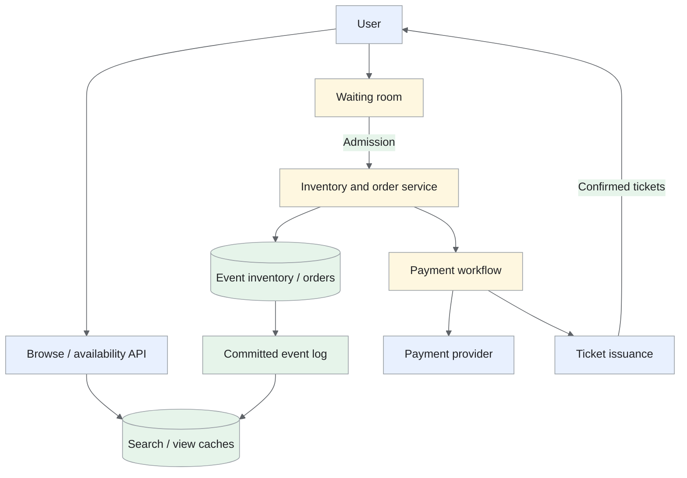
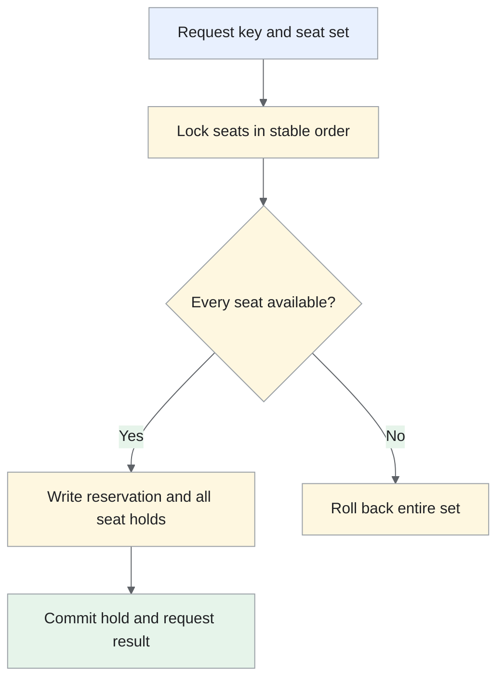

Design of an event-ticketing service with searchable events, seat availability, expiring reservations and retry-safe checkout.

<!--more-->

## Problem

Users browse an event, select seats and complete a purchase. During a popular onsale, many users may choose the same seats at almost the same time. A successful reservation must belong to one user, and checkout must preserve that ownership while the payment outcome is determined.
The service separates cached event browsing from authoritative inventory updates. A waiting room controls how much purchase traffic reaches inventory, while durable reservation and order records coordinate checkout.

## Requirements

### Functional requirements

- **Find events:** search by artist, venue, date and location.

- **View seats:** display the layout, prices and recent availability.

- **Reserve seats:** hold a selected set together for a limited time.

- **Buy tickets:** complete payment, view order status and receive issued tickets.

- **Queue for an onsale:** admit users according to the announced queue policy.

Dynamic pricing, resale, venue administration and detailed bot detection are outside this design.

### Non-functional requirements

- **Scale:** handle an example 14M-user onsale burst, with controlled admission to the purchase path.

- **Latency:** target browse P99 below 500ms and availability-view freshness below 2 seconds.

- **Inventory consistency:** one durable sold assignment per event-seat; acquire all requested seats or none.

- **Retry safety:** repeating the same checkout returns its existing order and payment operation.

- **Availability:** target 99.9% for browsing; pause new reservations when authoritative inventory ownership is uncertain.

- **Security:** validate user identity, admission rights, reservation ownership and payment tokens on the server.

## Back-of-the-envelope calculations

- **Availability polling:** 14M users / 5 seconds = 2.8M requests/s. A hypothetical 90% edge hit rate still leaves 280K origin requests/s.

- **Seat-state payload:** 60K seats need 7.5KB for a one-bit available/unavailable view, or 15KB for two-bit available/held/sold states, before headers and compression.

- **Reservations:** admitting 5K users/s with up to four seats each can cause 20K seat-row updates/s, plus reservation and order writes. Admission must follow measured capacity.

- **Order payload:** 500M tickets/year × 1KB ≈ 500GB/year. Storage is smaller than browsing traffic, though order history and audit data add overhead.

These numbers are workload assumptions rather than Ticketmaster measurements.

## Core entities

- **Event and venue:** event metadata and its reusable seat layout.

- **Event seat:** price and authoritative inventory state for one event-seat.

- **Reservation:** owner, selected seats, expiry and checkout state.

- **Order:** the durable purchase and provider-operation identities.

- **Admission:** an event-specific entitlement to enter seat selection.

```protobuf
message EventSeat {
  string event_id;
  string seat_id; // Composite inventory key: event_id + seat_id.
  int64 price_minor;
  string currency;
  string state; // Available, held, checkout or sold.
  string reservation_id;
  int64 version;
}

message Reservation {
  string reservation_id;
  string user_id;
  string event_id;
  repeated string seat_ids;
  Timestamp expires_at;
  string state; // Held, checkout, completed or released.
}

message Order {
  string order_id;
  string reservation_id;
  string user_id;
  int64 amount_minor;
  string currency;
  string state; // Authorizing, capturing, confirmed or recovery.
  string provider_payment_id;
}

message PaymentOperation {
  string operation_id;
  string order_id;
  string kind; // Authorize, capture, void or refund.
  string provider_idempotency_key;
  string state;
}

message Admission {
  string admission_id;
  string user_id;
  string event_id;
  Timestamp expires_at;
}

```

Prices and totals come from server-side inventory. Each reservation is tied to its authenticated owner; an admission token grants entry to the sale, not ownership of seats.

## API

```yaml
GET /events/search:
  query: {q: "...", city: "...", from: "...", to: "...", cursor: "..."}
  response: {events: [...], next_cursor: "..."}

GET /events/{event_id}:
  response: {event: {...}, seat_layout: {...}}

GET /events/{event_id}/seats:
  response: {version: 123, states: "...", generated_at: "..."}

POST /holds:
  headers: {Idempotency-Key: "...", Admission-Token: "..."}
  body: {event_id: "...", seat_ids: [...]}
  response: {reservation_id: "...", expires_at: "..."}
  errors: [409 seats_unavailable]

POST /orders:
  headers: {Idempotency-Key: "..."}
  body: {reservation_id: "...", payment_method_token: "..."}
  response: {order_id: "...", state: authorizing}

GET /orders/{order_id}:
  response: {state: "...", tickets: [...], payment_state: "..."}

POST /events/{event_id}/queue:
  response: {queue_entry_id: "...", status: waiting}

GET /queue/{queue_entry_id}:
  response: {status: "...", admission_token: "..."}

```

A reused request key with different input returns 409. Order status remains queryable after a client timeout.

## High-level design

The browse path serves indexed event metadata and cached availability. The waiting room admits a bounded number of buyers. Inventory and order services share the event's authoritative database partition; a durable workflow coordinates the external payment provider and ticket issuance.


```mermaid
%%{init: {'theme':'base','themeVariables':{'primaryColor':'#e8f0fe','primaryTextColor':'#202124','primaryBorderColor':'#9aa0a6','lineColor':'#5f6368','secondaryColor':'#e6f4ea','tertiaryColor':'#fef7e0','actorBkg':'#e8f0fe','actorBorder':'#9aa0a6','actorTextColor':'#202124','noteBkgColor':'#fef7e0','noteTextColor':'#202124','noteBorderColor':'#9aa0a6','signalColor':'#5f6368','signalTextColor':'#202124','labelBoxBkgColor':'#fef7e0','labelBoxBorderColor':'#9aa0a6'}}}%%
flowchart TB
  U[User] --> B[Browse / availability API]
  U --> W[Waiting room]
  B --> C[(Search / view caches)]
  W -->|Admission| I[Inventory and order service]
  I --> DB[(Event inventory / orders)]
  DB --> Q[Committed event log]
  Q --> C
  I --> P[Payment workflow]
  P --> X[Payment provider]
  P --> T[Ticket issuance]
  T -->|Confirmed tickets| U
classDef request fill:#e8f0fe,stroke:#9aa0a6,color:#202124;
classDef data fill:#e6f4ea,stroke:#9aa0a6,color:#202124;
classDef control fill:#fef7e0,stroke:#9aa0a6,color:#202124;
class U,B,X,T request;
class C,DB,Q data;
class W,I,P control;

```
## Storage

- **[PostgreSQL](/designs/tech-postgresql/) partitioned by event:** owns seats, reservations, orders and payment operations. Multi-seat transactions run in one event partition. A unique event-seat assignment and ownership/version checks protect inventory.

- **Durable workflow state:** Temporal coordinates payment and recovery steps. External calls use operation identities persisted before dispatch; database records remain the business source of truth.

- **[Kafka](/designs/tech-kafka/) and transaction outbox:** publish committed inventory versions to availability views and ticket delivery. A failed publish is retried from the outbox.

- **[Redis](/designs/tech-redis/)/CDN:** cache event details and compact availability snapshots. These are advisory views; holds always consult authoritative inventory.

- **[Elasticsearch](/designs/tech-elasticsearch/):** indexes event metadata for relevance, location and facets. High-frequency individual seat states stay in the availability view.

- **Queue storage:** a partitioned durable store holds admission entries and outcomes. Redis can accelerate ordering, with durable recovery for already admitted users.

PostgreSQL provides the transactions needed to reserve a set of seats together. Redis TTL locks alone can disappear during failover and are unsuitable as the authoritative reservation record. Database promotion must preserve committed inventory and fence the old writer; uncertain failover pauses new purchases.

## From request to response

### Reservation and checkout flow

```mermaid
%%{init: {'theme':'base','themeVariables':{'primaryColor':'#e8f0fe','primaryTextColor':'#202124','primaryBorderColor':'#9aa0a6','lineColor':'#5f6368','secondaryColor':'#e6f4ea','tertiaryColor':'#fef7e0','actorBkg':'#e8f0fe','actorBorder':'#9aa0a6','actorTextColor':'#202124','noteBkgColor':'#fef7e0','noteTextColor':'#202124','noteBorderColor':'#9aa0a6','signalColor':'#5f6368','signalTextColor':'#202124','labelBoxBkgColor':'#fef7e0','labelBoxBorderColor':'#9aa0a6'}}}%%
sequenceDiagram
  participant U as Buyer
  participant A as Hold and order API
  participant D as Event inventory
  participant W as Payment workflow
  participant P as Payment provider
  rect rgb(254, 247, 224)
    U->>A: Admission grant, seat set and request key
    A->>D: Lock seats; atomically commit complete hold
    D-->>A: Reservation and expiry
    A-->>U: Held seats
  end
  rect rgb(232, 240, 254)
    U->>A: Checkout owned reservation
    A->>D: Persist checkout and payment operation
    D-->>W: Committed workflow command
    W->>P: Authorize with stable operation key
    P-->>W: Authorization evidence
    W->>D: Verify ownership; persist pending capture assignment
    W->>P: Capture authorization
    P-->>W: Confirmed capture
    W->>D: Confirm order and ticket issuance
    A-->>U: Confirmed tickets via order status
  end

```

The hold transaction reserves the entire seat set before checkout. The durable payment workflow preserves that reservation through ambiguous provider outcomes; a successful capture confirms the order, while unresolved payment keeps the order in recovery rather than ordinary hold-expiry release.

### Browsing an event and its seats

The browse API queries the event index and returns metadata. The client fetches a versioned seat snapshot and renders it against the static layout. Cached availability may lag by up to its stated age; selecting a seat triggers an authoritative hold attempt.

### Entering the sale

The waiting room registers one entry per permitted user/event and applies the disclosed pre-sale lottery or arrival-order policy. Admission workers issue short-lived, user-bound grants at a rate matched to inventory latency and checkout backlog. The hold service validates the grant for every reservation request.

### Reserving seats

1. The service checks admission, identity, seat limits and the request key.

2. A transaction locks the requested event-seat rows in a consistent seat-ID order and verifies that every seat is available or belongs to an expired releasable hold.

3. It creates the reservation and updates all seats with that owner, version and expiry. Any unavailable seat aborts the entire transaction.

4. After commit, the service returns the reservation and publishes availability changes through the outbox.
An expiry worker releases ordinary held reservations. A checkout reservation with an unresolved payment outcome follows the recovery workflow rather than ordinary TTL release.

### Completing checkout

1. The order service locks and validates the owned, unexpired reservation, transitions it to checkout, and persists the order and authorization operation.

2. The workflow authorizes the exact server-calculated amount using a stable provider key.

3. After authorization evidence, a transaction confirms the same reservation still owns every seat and records the assignment as pending capture.

4. The workflow captures the authorization. Confirmed capture advances the order and triggers ticket issuance.

5. A definitive payment failure starts void/refund and inventory-release steps. An ambiguous timeout keeps the order in recovery until provider evidence resolves it.
Tickets are issued only for a confirmed order. Recovery records remain durable through process restarts.

### Receiving tickets

An idempotent ticket worker creates one ticket per confirmed order-seat and records delivery state. A retried event returns the existing ticket identity. The user can retrieve tickets from order history even when email delivery fails.

## Deep dives

### How do we reserve multiple seats consistently?

**Problem.** Two users may choose overlapping seat sets, and a client can retry after losing the reservation response.

- **Redis TTL locks:** Acquire temporary locks for selected seats. Admission can be quick, but failover or expiry can remove a lock while checkout still runs, requiring another durable inventory authority.

- **Event-local database transactions — recommended:** Lock every requested seat in stable order and commit the complete reservation together. Overlapping sets serialize correctly; a popular event creates row contention and needs controlled admission.

- **Single event sequencer:** Send all inventory commands through one ordered durable owner. Decisions have clear order, but owner failover, fencing and command replay become a separate correctness mechanism and throughput boundary.
**Recommendation.** Use event-local database transactions behind controlled admission. Lock rows in a consistent order, check the entire set, then update and commit together. [PostgreSQL row locking](https://www.postgresql.org/docs/current/explicit-locking.html) provides the required conflicting-write serialization. Each reservation belongs to one event partition and needs all-or-nothing seat ownership. We accept database lock contention behind admission control, using the existing transactional authority rather than introducing another event owner.

```sql
BEGIN;
SELECT seat_id, state, reservation_id, version
FROM event_seats
WHERE event_id = $1 AND seat_id = ANY($2)
ORDER BY seat_id
FOR UPDATE;
-- Verify every requested seat and record the owned reservation.
-- Update every selected seat, or roll back the transaction.
COMMIT;

```

The request key and input hash are recorded in the same transaction. Deadlock or serialization retries are bounded; a timeout prompts the client to query the existing reservation. Monitor lock wait, rejected holds, expiry backlog and attempts per successful reservation. If one event exceeds a partition's capacity, reduce admission before adding a more complex sequencer.
**An overlapping-seat race.** User A requests seats 10 and 11; user B requests 11 and 12. Both transactions lock seat rows in ascending order. A obtains seat 11 first, verifies that both of its seats are available, writes reservation R1 and commits. B then reads seat 11 as held and rolls back its entire set. Seat 12 remains available.
Store hold expiry and reservation ownership in the authoritative rows. The expiry worker releases seats only if the reservation ID and version still match the expired hold. A delayed expiry job cannot release seats that moved into checkout under a newer version.


```mermaid
%%{init: {'theme':'base','themeVariables':{'primaryColor':'#e8f0fe','primaryTextColor':'#202124','primaryBorderColor':'#9aa0a6','lineColor':'#5f6368','secondaryColor':'#e6f4ea','tertiaryColor':'#fef7e0','actorBkg':'#e8f0fe','actorBorder':'#9aa0a6','actorTextColor':'#202124','noteBkgColor':'#fef7e0','noteTextColor':'#202124','noteBorderColor':'#9aa0a6','signalColor':'#5f6368','signalTextColor':'#202124','labelBoxBkgColor':'#fef7e0','labelBoxBorderColor':'#9aa0a6'}}}%%
flowchart TB
  R["Request key and seat set"] --> L["Lock seats in stable order"]
  L --> C{"Every seat available?"}
  C -->|"Yes"| H["Write reservation and all seat holds"]
  H --> O["Commit hold and request result"]
  C -->|"No"| F["Roll back entire set"]
classDef request fill:#e8f0fe,stroke:#9aa0a6,color:#202124;
classDef data fill:#e6f4ea,stroke:#9aa0a6,color:#202124;
classDef control fill:#fef7e0,stroke:#9aa0a6,color:#202124;
class R request;
class O data;
class L,C,H,F control;

```

A request retry with the same key returns R1. Reusing the key for different seats is rejected by the input-hash check. Read the committed result after an ambiguous transaction response before starting a new hold.

### How does the queue stay fair and protect inventory?

**Problem.** A queue can absorb arrivals while still releasing buyers faster than checkout can handle.

- **Per-IP admission limits:** Throttle requests by connection source. Abuse volume is reduced, but shared networks do not represent one user and IP order is not a fair queue position.

- **Fixed release rate:** Admit buyers at a preconfigured rate. Operation is predictable, but the rate can overload a degraded payment path or waste recovered capacity.

- **Feedback-controlled admission — recommended:** Issue user-bound grants using inventory latency, errors and active checkout backlog. Release rate follows downstream capacity; delayed feedback needs conservative bounds to avoid oscillation and does not define fairness by itself.
**Recommendation.** Use feedback-controlled admission with a disclosed queue policy. Pre-sale users may receive randomized positions; users arriving later are placed behind them. Partition queue entries for capacity while maintaining the chosen global order through an admission coordinator. A waiting room must protect checkout during a demand spike, while the disclosed lottery/arrival policy defines order. We accept a conservatively tuned feedback loop and durable queue outcomes so capacity adjustments do not silently change user positions.
An admission grant is bound to the authenticated user and event. Its durable status supports refresh and reconnect; a nonce is not consumed on the first page request if later hold requests still need it. Queue and purchase tiers have separate resource budgets. Track wait time, fairness by arrival cohort, admission rate and downstream saturation.
**Admission as a control loop.** Measure active checkouts, inventory lock waits, payment latency and error rate. Admit buyers only while those indicators stay within the operating envelope. Increase the release rate gradually after healthy intervals and reduce it promptly when lock waits or provider failures rise.
The grant contains event ID, user ID, grant ID and expiry. Store its durable lifecycle so reloads and server failover preserve the user's admitted position. Validate the grant on hold and checkout requests; copying its URL to another user does not transfer admission.
A simple capacity calculation helps tune the controller: if checkout capacity is 2,000 active sessions and the average session lasts 100 seconds, a steady release rate around 20 sessions/s fills that capacity before accounting for abandonment and variation. This is a planning input, not a fixed guarantee. Queue position follows the disclosed policy even while release rate changes. Expired grants return capacity through a durable state transition and allow a documented re-entry policy.

### How do payment retries preserve seat ownership?

**Problem.** A provider may accept an operation before the response is lost. Releasing its seats immediately could leave a paid order without inventory.

- **Charge before assigning seats:** Capture payment and then try the inventory assignment. The steps are simple, but a failed assignment after charge requires refund recovery.

- **Authorize, assign, then capture:** Hold funds, durably verify seat ownership, then capture. The charge-before-inventory gap narrows; authorization expiry and a capture timeout still require recovery.

- **Durable authorize/assign/capture workflow — recommended:** Persist operation identities and transitions before external calls, then reconcile ambiguous outcomes. Crashes can resume the same payment and reservation; unresolved operations temporarily retain inventory and add reconciliation load.
**Recommendation.** Use authorization followed by durable assignment and capture, coordinated by a persistent workflow. Each provider operation has its own stable key; API request keys are user-scoped and input-checked. [Stripe's idempotency contract](https://docs.stripe.com/api/idempotent_requests) explains the provider boundary. A timeout cannot prove that a payment failed. We accept temporarily retained seats and a recovery queue so provider evidence resolves the payment before inventory is safely released or tickets are issued.

```text
Owned hold → checkout reservation → authorized → assigned / pending capture
→ capture confirmed → tickets issued

Ambiguous provider result → recovery → status lookup / verified event
Definitive failure → void or refund as needed → release inventory

```

A saga supplies durable progress and compensation, not universal exactly-once external behavior. Retain operation IDs beyond provider retry-key windows; query provider status before retrying an old unknown operation. Compensation failures remain visible for reconciliation. Measure unknown-outcome age, capture lag and payment/inventory discrepancies.
**Recovery after capture uncertainty.** Before calling the provider, save the capture operation ID, provider idempotency key and expected amount. If the provider accepts capture and the worker crashes before saving the response, the durable workflow resumes in an unknown-outcome state with the seats still assigned.
Query the provider operation or consume its verified event before advancing. A confirmed capture commits the paid order and ticket-delivery outbox. A definitive capture failure invokes the agreed void/release compensation. A timeout alone leaves the workflow pending; releasing seats at that point could create a paid order with no ticket.
Provider events are deduplicated by event ID and mapped to the existing operation, including out-of-order authorization/capture events. Ticket delivery uses its own stable order/ticket identity. If reconciliation later finds an unmatched charge, it creates a visible recovery case with the original reservation and operation evidence rather than fabricating a new successful checkout.

### How do browse views remain fast during an onsale?

**Problem.** Event metadata changes slowly, while seats change on every hold and checkout.

- **Search index for metadata and seats:** Index every event and seat-state change together. One query surface is convenient, but high-frequency holds create heavy indexing work and stale inventory answers.

- **Primary-database seat reads:** Fetch authoritative seats for every viewer. Freshness is strong, but millions of browse requests compete with reservation transactions.

- **Metadata search with compact versioned availability views — recommended:** Search stable event metadata and serve seat snapshots from caches. Browse work is isolated; snapshots are advisory and selecting seats still needs an authoritative hold.
**Recommendation.** Index event metadata in Elasticsearch and publish versioned seat-state snapshots to Redis/CDN. The snapshot generation uses committed seat versions, so an older event cannot reverse a newer state. Use two bits if the UI distinguishes available, held and sold. Browse traffic is much larger than successful reservations and changes at a different rate. We accept explicitly aged availability views so the transactional database spends capacity on ownership decisions rather than every seat-map refresh.
Clients apply deltas only to a known snapshot version and refetch after a gap. Event cancellation updates both search and delivery policy, while cached details are invalidated. Monitor view lag, edge hit rate and snapshot rebuild time; displayed availability remains advisory until the hold transaction succeeds.
**Snapshot and delta protocol.** A browse response gives the event's immutable seating layout plus availability snapshot version V200. Each delta identifies the preceding version and the changed seat states. A client at V200 can apply V200 → V201; a client receiving V205 without V204 refetches a snapshot.
The projection consumes only committed inventory changes. For each seat, reject a lower seat version so replay cannot turn sold inventory back into available. Publish snapshot generation and high-watermark together, then retain subsequent deltas for reconnects.
Keep browse traffic at the edge and send hold requests to the authoritative event partition. A cached green seat is a candidate selection, not a reservation guarantee. Coalesce popular event updates and cap client refresh rates during an onsale. If the projection falls behind, expose its age and preserve checkout correctness through the hold transaction while the view rebuilds.
