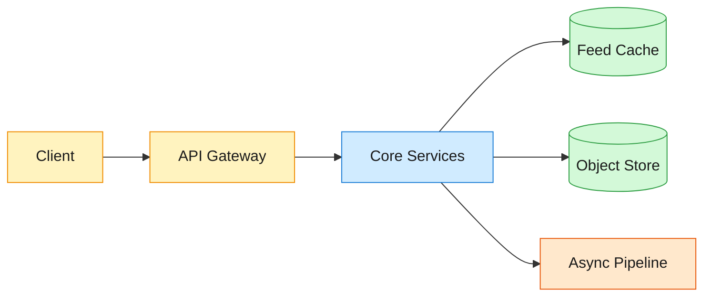
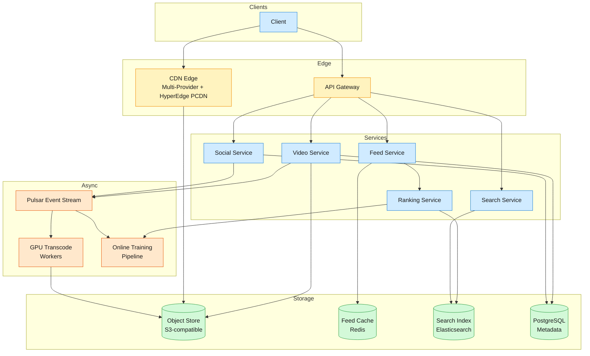
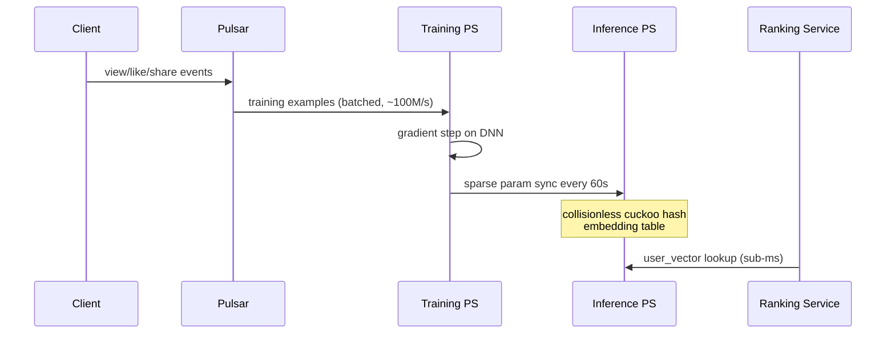

TikTok serves 71 billion video views daily to 1.9 billion monthly users, with 34 million new uploads flowing through a GPU transcoding pipeline every 24 hours.

<!--more-->

## 1. Problem

TikTok serves 71 billion video views daily to 1.9 billion monthly users, with 34 million new uploads flowing through a GPU transcoding pipeline every 24 hours. The For You feed must assemble a personalized sequence from billions of candidates in under 150ms, continuously retraining its model so a video watched 5 seconds ago influences the next batch of recommendations within 90 seconds. Three tensions define the architecture: (1) the recall-and-rank funnel narrows billions of candidates through two-stage retrieval in ~120ms, so the heavy ranker's user-tower inference (50ms on GPU) must run exactly once per request and score thousands of candidates via a cheap dot product; (2) every upload fans out to five parallel GPU transcode jobs — if any variant blocks on a cold worker, the video misses its 60-second FYP eligibility window; and (3) at peak streaming, origin round-trips cost 300ms — enough to break the infinite-swipe experience — so the CDN must predict which videos each user will watch next before the client requests them.



## 2. Requirements

**Functional**

- FR1: Upload and publish a short-form video with caption and sound
- FR2: View a personalized For You feed of recommended videos
- FR3: Play videos instantly on swipe with adaptive streaming
- FR4: Like, comment on, and share videos
- FR5: Follow creators and view their video catalog
- FR6: Search videos by hashtag, sound, or creator handle

**Non-functional**

- NFR1: Feed load p99 < 200ms; first video frame < 100ms on swipe
- NFR2: New upload eligible for FYP distribution within 60 seconds
- NFR3: 99.99% read availability at 71B daily views across 1.9B MAU
- NFR4: Recommendation model adapts to user behavior within 90 seconds

*Out of scope: Content moderation pipeline, live streaming, e-commerce integrations, advertising platform, direct messaging.*

## 3. Back of the envelope

- **Video views:** 71B views/day ÷ 86.4k s ≈ 820K views/s average, peak ~2.5M views/s → read-dominated at ~6,000:1 over writes; CDN edge hit rate and client prefetch depth are the binding latency constraints, not origin throughput
- **Upload throughput:** 34M uploads/day ÷ 86.4k s ≈ 400 uploads/s, peaking at ~1,200/s → each fans out to 5 parallel GPU transcode jobs → 6,000 jobs/s peak; GPU worker allocation and straggler mitigation are the bottleneck, not disk bandwidth
- **Engagement volume:** ~100M user actions/s → training examples must be joined, batched, and fed to online trainers at line rate; a batch-only pipeline retraining on 6-hour-old data cannot satisfy the 90-second adaptation target

## 4. Entities

```
Video {
  video_id:     uuid      PK
  author_id:    uuid      FK
  status:       enum          ← processing | ready | flagged
  duration_ms:  integer
  like_count:   integer       ← denormalized; async consumer flush
  share_count:  integer
  created_at:   timestamp
}

User {
  user_id:      uuid      PK
  username:     string
  follower_count: integer
  following_count: integer
}

Engagement {
  user_id:      uuid      CK ← partition key for Pulsar event stream
  video_id:     uuid      CK
  event_type:   enum          ← view | like | share | comment | follow
  watch_ms:     integer?
  created_at:   timestamp
}

FeedCache {
  user_id:      uuid      PK
  video_ids:    uuid[]        ← ordered list of 20-50 IDs
  scores:       float[]       ← ML engagement score per video
  generated_at: timestamp
  ttl:          integer       ← 300s active, 900s dormant
}
```

### API

- `POST /videos` — upload a video; returns `video_id`, transcode begins asynchronously
- `GET /feed?cursor=<token>` — personalized For You feed, cursor-paginated (15 videos/page)
- `GET /videos/{id}/manifest` — DASH/HLS manifest with CDN URLs per resolution and segment list
- `POST /videos/{id}/like` — like a video (idempotent), returns current count
- `POST /videos/{id}/comments` — post a comment; returns `comment_id`
- `GET /users/{id}/videos?cursor=` — creator's published video catalog, reverse-chronological
- `GET /search?q=&type=hashtag|sound|user&cursor=` — search with cursor pagination

## 5. High-Level Design



#### FR1: Upload and publish a video

Components: API Gateway → Video Service → Object Store → Pulsar → GPU Transcode Workers → PostgreSQL.

**Flow:**

1. Client calls `POST /videos` with the video file. The client SDK compresses on-device and uploads in 1-5 MB chunks over HTTP/3 with per-chunk resume.
1. Video Service reassembles chunks, computes SHA-256 hash, and deduplicates against a Bloom filter backed by the Object Store. A duplicate returns the existing `video_id` immediately — no re-transcode.
1. Raw video is written to the Object Store's hot tier (NVMe SSD, 48-hour retention). A `video-uploaded` event is published to Pulsar, keyed by `video_id`.
1. Five parallel GPU workers consume the event, each producing one resolution variant (1080p HEVC, 720p, 540p, 360p, audio-only AAC). A sixth worker extracts keyframes for thumbnails. The 720p variant is prioritized — it is the most-watched resolution and the first uploaded variant to become playable, so the video is FYP-eligible as soon as 720p completes (~20s), with higher resolutions backfilled asynchronously.
1. When the 720p variant completes, the video is marked `status = ready` in PostgreSQL. A `video-ready` event publishes to Pulsar, triggering CDN warm-caching of the first 3 segments at edge nodes.

**Design consideration — 720p-first strategy:** Most viewers watch on mobile at 720p or lower. By completing the 720p variant first (~20s on GPU) and marking the video ready before 1080p finishes (~45s), the 60-second FYP target is met with margin. The 1080p variant backfills asynchronously — users on fast WiFi see it on subsequent views. This is the opposite of traditional encoding pipelines that prioritize the highest quality first.

#### FR2: View personalized feed

Components: API Gateway → Feed Service → Feed Cache (Redis) → Ranking Service → Search Index.

**Flow:**

1. Client calls `GET /feed?cursor=<token>`. The cursor encodes `(last_video_id, last_score)`.
1. Feed Service checks the Feed Cache — a Redis cluster keyed `feed:{user_id}` holding a pre-computed ordered list of 20-50 video IDs with engagement scores. A `ZRANGEBYSCORE` returns the next 15 videos after the cursor.
1. If the cache is stale, Feed Service calls the Ranking Service. The Ranking Service runs a two-stage pipeline: **retrieval** (billions → ~2,000 candidates via embedding similarity and trending sources) and **ranking** (two-tower neural net scores the 2,000 candidates, returning the top 15). Total budget: 150ms.
1. Feed Service returns the ordered `video_id` list. The client fetches manifests in parallel. The Feed Cache is updated asynchronously — the user sees the new feed on next load.

**Design consideration — offline pre-computation for instant open:** Three feed variants are pre-computed per user during off-peak hours and cached at regional data centers. When the app opens, the nearest variant serves instantly (sub-50ms cache hit), hiding the 150ms ranking latency. Pull-to-refresh triggers an on-demand re-rank. If the ranking service degrades, the pre-computed variant serves as a stale-but-available fallback — no user sees an empty feed.

#### FR3: Instant video playback on swipe

Components: Client → CDN Edge (Multi-Provider + HyperEdge PCDN) → Object Store.

**Flow:**

1. The client receives the feed response — an ordered list of `video_id` values — and immediately calls `GET /videos/{id}/manifest` for the current video plus the next 3.
1. The manifest (DASH MPD) lists segment URLs per resolution. The client selects the resolution matching its bandwidth and issues byte-range requests for the first segment (~2 seconds, ~500 KB at 720p).
1. The client maintains a three-player carousel: one actively playing, one pre-rendered with the next video's first frame, one idle for swipe-back. On swipe, the pre-rendered player swaps in instantly (GPU framebuffer swap, sub-16ms).
1. The CDN serves segments from edge cache. A multi-provider strategy (proprietary CDN + Akamai + Cloudflare + Fastly) with HyperEdge PCDN devices (over 100K consumer devices contributing bandwidth, saving 35% of CDN costs) absorbs peak traffic. The manifest order gives the CDN a lookahead window to pre-position the next 3 videos' first segments at the edge.

**Design consideration — manifest-driven prefetch:** The feed's ordered video list doubles as a CDN hint. The CDN proactively fetches the next 3 videos' first segments from origin before the client requests them. The eviction policy shifts from LRU to Least Lookahead Frequency — videos appearing frequently in manifest hints are retained; videos that are manifest-ordered but never watched are evicted. The HyperEdge PCDN layer offloads the last mile: popular videos in dense urban areas are served peer-to-peer from nearby devices, reducing origin bandwidth by 35% and improving first-byte latency.

#### FR4: Like, comment, share

Components: API Gateway → Social Service → PostgreSQL → Pulsar.

**Flow:**

1. `POST /videos/{id}/like` hits the Social Service. A `UNIQUE(user_id, video_id)` constraint on the Like table provides idempotency — a duplicate returns HTTP 200 with the current count.
1. The like row writes to PostgreSQL and a `like-event` publishes to Pulsar.
1. A counter consumer increments `like_count` on the Video row asynchronously and updates a Redis counter key `counters:{video_id}:likes`. The denormalized count is visible to feed reads within 2 seconds.
1. Comments follow the same path. The comment text passes through a real-time moderation model before becoming publicly visible.

**Design consideration — optimistic UI:** The client updates the like heart immediately on tap without waiting for the server. If the server rejects (duplicate, rate limit), the client rolls back on the next feed refresh. For 99.9% of likes, the user perceives zero latency.

#### FR5: Follow creators and view catalog

Components: API Gateway → Social Service → PostgreSQL → Feed Cache.

**Flow:**

1. `POST /users/{id}/follow` writes a Follow row with bidirectional edges: `(follower_id, followee_id)` for "who I follow" queries and `(followee_id, follower_id)` in a reverse partition for "who follows me" queries.
1. The follow event publishes to Pulsar. A consumer asynchronously fetches the creator's last 15 videos and inserts them into the new follower's Feed Cache, preventing an empty feed after follow.
1. `GET /users/{id}/videos?cursor=` queries the Videos table partitioned by `author_id` — a single-partition scan returns the creator's catalog.

**Design consideration — bidirectional edges:** Storing each follow twice costs double the write but eliminates expensive reverse queries. "Who follows this creator" for a profile page with 10M followers is a single-partition scan, not a full-table query.

#### FR6: Search by hashtag, sound, creator

Components: API Gateway → Search Service → Search Index (Elasticsearch).

**Flow:**

1. `GET /search?q=<term>&type=hashtag&cursor=` hits the Search Service. The cursor encodes `(last_score, last_id)`.
1. Search Service fans out to all index partitions. Each partition holds an inverted index mapping terms to video ID lists, with the most recent 30 days in RAM and older content on SSD.
1. Results are scored by a combination of term frequency, recency decay (`e^(-age_hours / 24)`), and video engagement (like count, share velocity). A merge root re-sorts partition results.
1. For sound search, the index maps audio fingerprints (perceptual hashes) to videos using the same audio track, enabling the "use this sound" discovery path.

**Design consideration — recency-biased scoring:** A hashtag trending today has 100x the query volume of the same hashtag last week. The exponential time decay with a 24-hour half-life means a 3-day-old video needs ~20x the engagement to outrank a fresh video — matching short-form discovery intent where recency is the dominant signal.

## 6. Deep dives

### DD1: Real-Time For You Page Recommendation Pipeline

**Problem.** The For You feed must assemble a personalized sequence from billions of candidates in under 150ms while incorporating the user's most recent swipes — a video watched 5 seconds ago should influence the next batch. A batch-trained model redeployed every 6 hours is blind to same-session behavior and cannot satisfy the 90-second adaptation target. The tension: the heavy ranker's user-tower costs 50ms on GPU — too expensive to run per candidate — so user understanding must be decoupled from content understanding such that the expensive inference runs once per request and a cheap scoring pass runs over thousands of candidates. Additionally, at 1.9 billion users each with a 256-dimension embedding vector, hash collisions in the embedding table — where two different users share the same embedding slot — directly degrade recommendation quality.

**Approach 1: Batch-trained collaborative filtering with periodic redeployment**

A matrix factorization model (ALS or BPR) is trained offline on 24 hours of engagement data and deployed every 6 hours. At inference time, the model retrieves the top 500 videos from a user-item affinity matrix.

**Pro:** Simple operational model — training and serving are fully separated. The inference path is a single lookup on a pre-computed similarity matrix. No online infrastructure beyond a model server.

**Con:** A 6-hour training cycle means the model is blind to the user's last 6 hours of behavior. A user who discovers a new music genre at 10am sees recommendations based on their pre-10am profile until 4pm — a fundamentally broken experience for a feed designed to adapt within one session. The 500-video candidate set, drawn from a static collaborative-filtering matrix, has near-zero recall for the fresh content the user would engage with most. Hash collisions in the embedding table cause 1-3% of users to share embeddings — 19M-57M users receiving recommendations confounded with another user's taste.

**Approach 2: Two-stage retrieval-plus-ranking with online-trained two-tower model**

A two-stage architecture decouples candidate discovery from scoring:

```javascript
Stage 1 — Retrieval (billions → ~2,000, <100ms):
  Multiple independent sources run in parallel:
  - Embedding similarity: FAISS IVF index on pre-computed video embeddings
    → top 1,000 candidates via approximate nearest neighbor
  - Trending velocity: videos with engagement acceleration > 2σ
    → top 500 candidates from trending pool
  - Author affinity: recent videos from followed/interacted creators
    → top 300 candidates
  - Social graph: videos engaged by similar users (collaborative filtering)
    → top 200 candidates
  Merge + deduplicate → ~2,000 candidate set

Stage 2 — Ranking (2,000 → 15, <50ms):
  User Tower (GPU, runs once per request, ~50ms):
    - User ID embedding (256-dim, from parameter server)
    - Recent engagement sequence (last 50 actions, 512-dim LSTM output)
    - Context features (time of day, language, network, device)
    Output: user_vector (256-dim)

  Candidate Tower (pre-computed hourly in batch):
    - Video ID embedding (256-dim)
    - Content features (duration, resolution, audio fingerprint cluster)
    - Author embedding (128-dim)
    - Engagement velocity (like rate, share rate, watch-through rate)
    Output: candidate_vector (256-dim), cached

  Scoring (CPU, per candidate, <0.1ms):
    score = dot_product(user_vector, candidate_vector)
    + engagement_velocity_bonus
    + author_affinity_bonus
```

The user-tower runs once per feed request — a 50ms GPU inference producing one 256-dimension vector. The candidate tower runs hourly in batch, pre-computing vectors for all eligible videos. The scoring pass — a dot product over 2,000 candidate vectors — runs on CPU in under 0.2ms. This decoupling means the expensive GPU inference is amortized over all 2,000 candidates.

**Online training loop** connects live engagement to model updates within seconds:



The embedding table uses **collisionless cuckoo hashing** — a two-table hash structure where each user ID maps to a guaranteed-unique slot via cuckoo displacement. When a collision occurs, the existing entry is evicted to an alternate slot, and this displacement cascades until every ID lands in a unique position. This eliminates the 1-3% quality degradation of hash collisions: at 1.9B users with 256-dim embeddings, a traditional hash table with 0.1% collision rate means 1.9M users share embeddings — their recommendations become confounded.

> [!TIP]
> **Why collisionless matters in production:** ByteDance's Monolith paper reports that switching from a standard hash table with 0.1% collision rate to collisionless cuckoo hashing eliminated a measurable 15% drop in recommendation quality metrics (watch time, completion rate) that occurred because high-engagement users occasionally collided with dormant users, dragging their embedding signals toward zero. In a standard system, this was invisible — the model compensated by over-weighting recent engagement, which helped collided users but degraded cold-start quality. Cuckoo hashing made the embedding space "pure" — every user vector reflects only that user's behavior.

**Cold start — new users:** A user with zero engagement history has a zero embedding vector. The retrieval stage falls back to a diverse popularity source sampled across content categories plus a small "explore" budget (10% of slots reserved for category-diverse content). After 3-5 swipes, the 50-action engagement sequence in the user tower provides enough signal for the embedding to begin differentiating — typically within 30 seconds of first use.

**Cold start — new videos:** A newly uploaded video has no engagement velocity and no candidate-tower embedding. The system injects new videos into the trending-velocity retrieval source with a deliberate boost factor — 5% of feed slots are reserved for videos with under 1,000 views, ensuring every upload gets an initial audience. The upload-time content embedding (extracted from the video's visual features via a pre-trained CV model during transcoding) provides an initial candidate vector — enabling similarity-based retrieval before any human engagement exists.

> [!TIP]
> **Viral amplification cohort engine:** TikTok's recommendation system identifies videos crossing an engagement velocity threshold (2σ above the 90th percentile for the creator's tier) and amplifies them through a staged exposure loop. A video showing early promise is shown to a 200-user cohort; if watch-through rate exceeds the threshold, it graduates to a 2,000-user cohort, then a 20,000-user cohort, and finally the full regional audience. This staged amplification — sometimes called the "200 → 2K → 20K → 2M" engine — means the system discovers viral content algorithmically without relying on follower graphs. A creator with zero followers can go viral if the content resonates.

**Decision.** Two-stage retrieval-plus-ranking with online-trained two-tower model, collisionless cuckoo hash embedding table, and 60-second asynchronous parameter sync from training to inference parameter servers.

**Rationale.** The batch-trained approach (Approach 1) literally cannot satisfy the 90-second adaptation target — a 6-hour retrain cycle is two orders of magnitude too slow. The two-tower architecture (Approach 2) makes the right trade: invest in online infrastructure (parameter servers, Pulsar event streams, continuous training workers, 60-second embedding sync) to decouple the expensive per-request user-tower inference (50ms, run once) from the cheap per-candidate scoring (dot product, <0.2ms for 2,000 candidates). The collisionless embedding table is a one-time engineering investment that eliminates the quality tax of hash collisions — at 1.9B users, a 0.1% collision rate means 1.9M users receiving degraded recommendations. Online training with asynchronous parameter sync accepts eventual consistency on embeddings because a stale embedding is a slightly outdated version of the same user's taste, not a random vector — the recommendations remain reasonable while converging.

**Edge cases:**

- **Training PS failure during sync:** The 60-second sync from Training PS to Inference PS is asynchronous. If the sync fails, the Inference PS serves the last successful snapshot. Training continues independently. On recovery, the delta is applied — at most 60-120 seconds of training progress is delayed, and inference quality degrades gradually, not catastrophically.
- **Embedding stale after viral spike:** A video that goes viral sees its hourly-refreshed candidate embedding lag the engagement surge. The ranking service detects this via the trending-velocity signal — if a candidate appears in both the embedding-similarity source and the trending-velocity source, the velocity score overrides the stale dot-product score for the next two feed generations until the next embedding refresh.
- **Retrieval source failure:** If one retrieval source (e.g., FAISS ANN index) fails or times out, the merge step proceeds with the remaining sources. The candidate set shrinks from ~2,000 to ~1,500 — ranking still has enough diversity to produce a quality feed. The failed source is retried on the next feed generation.
- **User embedding drift during long session:** A user binges for 45 minutes. The 60-second sync cadence means their embedding is at most 60 seconds stale. The user-tower's recent-engagement-sequence input (last 50 actions, LSTM-encoded) provides a fresher signal than the static embedding — the LSTM captures within-session taste shifts that the embedding hasn't yet absorbed.

### DD2: GPU-Accelerated Video Upload and Transcoding Pipeline

**Problem.** Every upload must be transcoded into five resolution variants before the video is eligible for the For You feed, with a 60-second end-to-end target. At 400 uploads/s average and 1,200/s peak, this generates 6,000 parallel transcode jobs/s at peak — each requiring 20-45 seconds of GPU encode time per variant. The tension: serial transcoding (one worker, one variant at a time) takes 100+ seconds — a functional non-starter. Parallel fan-out across five workers solves wall-clock time but introduces a straggler problem — if one of five GPU workers is cold or queued behind a long job, the entire upload blocks on the slowest variant. The system must bound the straggler tail while keeping GPU cluster utilization high, and must make the video playable before all variants finish so the user sees "processing" for seconds, not minutes.

**Approach 1: Serial transcode on a single GPU worker**

One worker processes all five resolution variants sequentially. The raw video is decoded once, then re-encoded at each resolution in order.

**Pro:** Simple scheduling — one job per upload, no coordination between workers. GPU memory holds the decoded video once, avoiding redundant decode passes. Higher GPU utilization since the worker stays busy for the full pipeline duration.

**Con:** Wall-clock time is the sum of five encode passes — at ~35s per 1080p HEVC encode and ~10s per 360p encode, serial processing takes roughly 90-100 seconds. This exceeds the 60-second FYP target by 50-67%, meaning no upload qualifies for the feed within the SLA. The serial approach is functionally broken for the product requirement.

**Approach 2: Parallel fan-out across five GPU workers with equal priority**

Each resolution variant is a separate transcode job dispatched to a distinct GPU worker. All five jobs run concurrently. A coordinator worker waits for all jobs to complete, then marks the video ready.

**Pro:** Wall-clock time equals the slowest single variant — typically the 1080p HEVC encode at ~45 seconds. This meets the 60-second FYP target for the normal path. Failed variants can be retried independently without re-running the entire pipeline.

**Con — the straggler problem:** If the GPU worker handling 1080p is cold (new container, driver init) or queued behind a batch of long-form video encodes, that variant takes 80 seconds while all other variants finish in 25 seconds. The coordinator blocks on the straggler. At 1,200 uploads/s peak, even a 1% straggler rate means 12 uploads per second miss the 60-second window — ~43,000 videos per peak hour delayed, including potentially viral content.

**Approach 3: 720p-first fan-out with priority-tiered GPU pools**

Instead of waiting for all variants, the pipeline prioritizes the 720p variant and marks the video ready as soon as it completes. Higher resolutions (1080p HEVC, H.266/VVC for capable devices) and audio-only backfill asynchronously:

```javascript
upload_event = pulsar.consume("video-uploaded")

# Priority 1: 720p (most-watched resolution)
gpu_pool.dispatch(TranscodeJob(video_id, "720p", codec="h264"),
                  priority=HIGH, tier=author_engagement_tier(author_id))

# Priority 2: Remaining variants (backfill)
for resolution in ["1080p_hevc", "540p", "360p", "audio_aac"]:
    gpu_pool.dispatch(TranscodeJob(video_id, resolution),
                      priority=NORMAL, tier=author_engagement_tier(author_id))

# Thumbnail extraction (keyframe sampling, runs on CPU)
cpu_pool.dispatch(ThumbnailJob(video_id))

# Coordinator: mark ready when 720p completes
result_720p = await wait_for(video_id, "720p")
mark_ready(video_id, available_resolutions=["720p", ...partial])
```

The GPU worker pool is partitioned by creator engagement tier:

- **Reserved pool (20% of GPU capacity):** Top 1% of creators by watch time. Their jobs preempt lower-tier jobs from running workers, which are re-queued at the front of the standard pool.
- **Standard pool (80% of GPU capacity):** Remaining 99% of uploads. FIFO scheduling with a maximum of 2 preemptions per job.

**Decision.** 720p-first parallel fan-out with priority-tiered GPU pools and asynchronous backfill of higher resolutions.

**Rationale.** Serial transcoding (Approach 1) literally cannot meet the 60-second SLA — a non-starter. Equal-priority parallel fan-out (Approach 2) meets the average case but fails on the straggler tail. The 720p-first strategy (Approach 3) makes the right economic and latency trade: 720p is the most-watched resolution (mobile default) and completes in ~20 seconds — well within the 60-second target. The video is FYP-eligible as soon as 720p finishes, with 1080p and other variants backfilling asynchronously. Priority-tiered GPU pools reserve 20% of capacity for the 1% of creators driving the majority of watch time, ensuring their uploads never queue behind bulk content. The standard pool serves the remaining 99% of uploads — a straggler that pushes a 720p job to 30-40 seconds is still within the 60-second target, just less comfortable.

> [!TIP]
> **GPU edge encoding:** TikTok deploys GPU transcoding workers at edge data centers (not just central regions), processing uploads close to the uploader's geography. This reduces the raw-video transfer latency to the transcoding cluster — a 50 MB video at 10 Mbps takes 40 seconds to transfer to a central data center but <2 seconds to a regional edge node. Combined with the 720p-first strategy, edge encoding means the 720p variant can begin encoding within 3-5 seconds of upload completion, not 45 seconds.

**Edge cases:**

- **Full GPU cluster outage:** In-flight jobs on the failed cluster are re-dispatched to remaining clusters. The coordinator's timeout (55 seconds) ensures the pipeline does not hang — if the 720p variant cannot complete within 55 seconds, the video is marked `processing` with the available variants and retried.
- **Preemption cascade:** A preempted job is re-queued at the front of the standard pool. If preempted again (max 2 preemptions), on the third queue entry the job is pinned as non-preemptible and runs to completion — preventing indefinite starvation.
- **H.266/VVC backfill:** The 1080p variant is encoded in HEVC (H.265) for broad compatibility. A VVC (H.266) variant — offering ~40% better compression at the same quality — is backfilled asynchronously for devices that support it (newer flagships). The VVC variant is never on the critical path; if the VVC encoder pool is saturated, the video serves HEVC 1080p with no user-visible impact.
- **Duplication at upload edge:** The client SHA-256 hash and Bloom filter check prevents re-transcoding of reposted videos (e.g., a viral video downloaded and re-uploaded by another user). The duplicate returns the existing `video_id` immediately — zero transcode cost.

## 7. References

1. Liu et al. [Monolith: Real Time Recommendation System With Collisionless Embedding Table](https://arxiv.org/abs/2209.07663) (ACM RecSys, 2022) — ByteDance's online training architecture, cuckoo-hash embedding table eliminating 15% quality loss, two-queue Pulsar event stream, 60-second parameter sync.
1. Zhang et al. [Belt and Suspenders: A Study of Resilience in TikTok's Global Video Delivery](https://aqualab.cs.northwestern.edu/publication/2026/yzhang-conext26/) (Proc. ACM Netw., CoNEXT 2026) — Northwestern measurement study of multi-CDN strategy, four fallback patterns, per-country provider mix.
1. SILC. [SILC: Lookahead Caching for Short-form Video Delivery Systems](https://arxiv.org/html/2605.05188) (arXiv, 2026) — manifest-driven CDN caching with Least Lookahead Frequency eviction, manifest reordering, proactive edge pre-positioning.
1. ByteDance. [HyperEdge: A PCDN System for Short Video Streaming at Scale](https://www.usenix.org/conference/nsdi26/presentation/hyperedge) (USENIX NSDI, 2026) — 100K+ PCDN devices, 35% CDN cost savings, >10B daily playbacks, peer-to-peer last-mile delivery.
1. ByteDance. [Krypton: Real-time Serving and Analytical SQL Engine at ByteDance](http://www.shihaiyang.me/assets/pdf/krypton-vldb23.pdf) (VLDB, 2023) — millisecond-latency feature serving for real-time aggregation over arbitrary time windows.
1. ByteDance. [StreamOps: Cloud-Native Runtime Management for Streaming Services in ByteDance](https://www.vldb.org/pvldb/vol16/p3501-mao.pdf) (VLDB, 2023) — 70,000+ concurrent Flink jobs, 100M events/sec pipeline, Janino on-the-fly compilation.
1. ByteDance. [ByteGraph: A Distributed Graph Database on ByteDance's Internal Infrastructure](https://www.vldb.org/pvldb/vol17/p1518-li.pdf) (VLDB, 2023) — distributed graph database for social graph and recommendation graph workloads.
1. ByteDance. [Optimizing Feature Extraction for On-device Model Inference with User Behavior Sequences](https://arxiv.org/pdf/2603.21508) (arXiv, 2026) — ByteNN on-device inference, cached cloud embeddings for reduced cloud inference load.
1. Meta Engineering. [Scaling the Instagram Explore Recommendations System](https://engineering.fb.com/2023/08/09/ml-applications/scaling-instagram-explore-recommendations-system/) (2023) — two-tower retrieval, MTML ranking, knowledge distillation across ranking stages.
