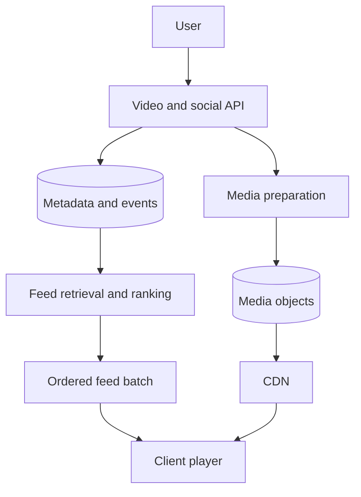
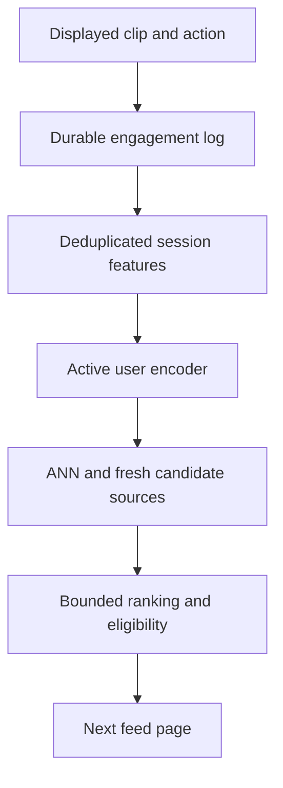

Design of a short-video service with resumable uploads, personalized feeds and low-latency playback.

<!--more-->

## Problem

A user uploads a short video or opens the app and swipes through recommendations. Playback needs to feel immediate, while the next feed batch should reflect what the user has watched, skipped or liked during the current session.

The service separates media preparation from discovery. A video becomes eligible after a playable rendition and required publication checks complete; additional renditions can follow in the background.

## Requirements

### Functional requirements

- **Publish videos:** upload media, add caption and sound, and track processing state.
- **Browse a personalized feed:** return an ordered batch of eligible videos.
- **Play on swipe:** use adaptive streaming and bounded prefetch of likely next videos.
- **Engage:** like, comment, share and follow creators.
- **Discover content:** browse creator catalogs and search by hashtag, sound or handle.

Moderation internals, live streaming, commerce and messaging are separate systems; publication and playback still enforce their eligibility decisions.

### Non-functional requirements

Design targets for the assumed workload:

- **Scale:** 71B plays/day, 34M uploads/day and up to 2.5M playback starts/s at peak.
- **Latency:** feed API p99 below 200ms; prefetched-video first frame below 100ms at p95 on supported devices.
- **Publication:** a supported bounded upload is playable within 60 seconds at p95 after upload completion.
- **Freshness:** session actions influence subsequent feed requests within 90 seconds at p99.
- **Availability:** 99.99% for feed reads and media delivery, with eligible fallback content during ranking outages.
- **Integrity:** retries preserve upload and engagement identity; access and removal decisions propagate to serving consumers.

Cold playback, weak networks and larger uploads have separate latency distributions.

## Back-of-the-envelope calculations

- **Plays:** 71B / 86,400 ≈ 822K/s average; 3× gives about 2.5M/s peak.
- **Uploads:** 34M / 86,400 ≈ 394/s average, about 1,180/s at a threefold peak.
- **Encoding:** five output jobs per upload means about 5,900 jobs/s at peak. Worker demand depends on measured job duration and hardware throughput.
- **Media storage:** at 20MB retained media per upload, 34M uploads add about 680TB/day before replication and retention.
- **Feedback:** three events per play implies about 2.5M events/s average. Device batching and event sampling determine the actual rate.

These are sizing assumptions, not verified TikTok operating figures.

## Core entities

- **Video:** publication state, owner and immutable media versions.
- **Rendition:** codec, resolution and playback manifest for one version.
- **Engagement:** a deduplicated user action or viewing observation.
- **Feed session:** a stable ordered batch with pagination and impression identity.

```protobuf
message Video {
  string video_id;
  string author_id;
  string content_version;
  string status;                 // Uploading, processing, ready, restricted
  string caption;
  string sound_id;
  Timestamp created_at;
}

message Rendition {
  string video_id;
  string content_version;
  string codec;
  int32 height;
  string manifest_ref;
  string status;
}

message Engagement {
  string event_id;
  string user_id;
  string video_id;
  string impression_id;
  string event_type;
  int64 watch_ms;
  Timestamp observed_at;
}

message FeedSession {
  string feed_session_id;
  string user_id;
  repeated string video_ids;
  string model_version;
  Timestamp expires_at;
}
```

An impression identifies a displayed recommendation; a view or like references that impression where available. Content-byte deduplication does not merge different creators' publication records.

## API

```yaml
POST /v1/uploads:
  body: {size_bytes: integer, content_type: string}
  response: {upload_id: string, part_upload_urls: array}

POST /v1/uploads/{upload_id}/complete:
  headers: {Idempotency-Key: completion-request}
  body: {part_checksums: array, caption: string, sound_id: string}
  response: {video_id: string, status: processing}

GET /v1/feed:
  query: {feed_session_id: string, cursor: string}
  response: {videos: array, next_cursor: string}

GET /v1/videos/{video_id}/manifest:
  response: {manifest_url: string, content_version: string}

PUT /v1/videos/{video_id}/like:
  body: {liked: boolean}

POST /v1/engagements:
  body: {events: array}

GET /v1/search:
  query: {q: string, type: hashtag_or_sound_or_creator, cursor: string}
```

## High-level design

The upload pipeline prepares media and publishes eligible metadata. The feed service retrieves and ranks candidates; clients fetch media through a CDN independently of feed generation.


```mermaid
flowchart TB
    U["User"] --> API["Video and social API"]
    API --> M[("Metadata and events")]
    API --> T["Media preparation"]
    T --> O[("Media objects")]
    M --> F["Feed retrieval and ranking"]
    F --> B["Ordered feed batch"]
    B --> P["Client player"]
    O --> C["CDN"]
    C --> P
```

## Storage

- **Partitioned PostgreSQL:** video ownership, rendition state, likes and follows with unique relationship keys. A transactional outbox publishes committed changes.
- **Object storage:** originals, immutable segments, thumbnails and versioned manifests. Upload part checksums support safe completion and retries.
- **Redis:** active feed sessions and recent user features with bounded TTLs; durable metadata remains authoritative.
- **ANN index and search index:** embedding retrieval and hashtag/creator lookup. Index versions and deletion events keep eligibility consistent.
- **Pulsar or Kafka:** engagement, processing and catalog events, partitioned by user or video according to the consumer's ordering needs.
- **Object storage/analytical tables:** replayable training data, model artifacts and feature snapshots.

Large creator catalogs and follower lists use pagination and bounded partitions rather than one unbounded row or scan.

## From request to response

### Uploading and publishing

Create an upload session, send parts directly to object storage and complete it with checksums. Completion verifies the objects, creates the video record and durable preparation jobs, then returns processing state.

Workers write renditions under immutable versioned keys. Once a compatible rendition and required eligibility checks complete, the catalog marks the video ready. A manifest lists only complete outputs.

A Bloom filter can avoid many deduplication lookups, but a positive result still requires an exact lookup and access checks. Reusing encoding outputs preserves each user's independent video record and permissions.

### Loading the feed

Retrieve candidates from user/video similarity, recent popular content, followed creators and bounded exploration. Merge and deduplicate them, fetch current features and rank a limited shortlist.

Apply publication, language, access and diversity filters before returning a feed session. The cursor refers to that session's order, so later model updates do not reorder a page already being traversed.

Scoring every video is impractical. Candidate retrieval and bounded ranking reduce the work per request.

### Swiping to the next video

The player fetches the current manifest and a small amount of the next likely videos. It selects a supported rendition based on available bandwidth and device capability.

A prepared player can display the next frame quickly. The client cancels obsolete downloads after rapid swipes and reduces prefetch on metered or poor connections. Playback telemetry reports startup delay, rebuffering and unused bytes.

### Recording engagement and social actions

A like stores the user's desired state under a unique user/video key. Comments and follow changes commit with an outbox event. Repeated event IDs have one logical effect on counters and features.

The client can update its UI optimistically, then reconcile with the accepted server state. Views and watch-time events are batched; the pipeline updates current-session features independently of full model retraining.

## Deep dives

### How does the feed react within the current session?

Batch models provide useful long-term preferences but cannot encode actions that happened after their snapshot.

- **Offline feed only:** inexpensive reads, limited same-session adaptation.
- **Continuous full-model training:** responsive, with substantial training and release complexity.
- **Stable model plus fresh session features — recommended:** update recent action sequences quickly while versioning model releases separately.

Use a two-tower representation for ANN retrieval, then a richer ranker for a bounded candidate set. A dot product is suitable for candidate similarity; ranking can additionally model watch completion, satisfaction and session context.

[Monolith](https://arxiv.org/abs/2209.07663) is a reference for online training and collisionless embedding tables. Ordinary keyed hash tables already distinguish colliding keys; its relevant contrast is shared hashed embedding buckets versus identity-preserving embedding entries.

Start with a durable engagement log, a recent-action feature store and versioned batch training. Add online parameter updates only when measured freshness and quality gains justify their recovery complexity. Missing features use a known fallback; candidate-source timeouts return the remaining eligible candidates.

**One swipe changes the next retrieval context**

The client emits an impression identity, playback outcome and stable action sequence. A stream consumer deduplicates retries and updates the user's bounded recent-watch/skip window. The next feed request encodes that window with the active user tower and retrieves compatible video vectors.

A skipped clip, a completed clip and a playback failure are distinct outcomes. Keep their event types and timestamps rather than collapsing them into one engagement counter. The ranker can then model current-session interests without changing global parameters after every swipe.


```mermaid
flowchart TB
    A["Displayed clip and action"] --> L["Durable engagement log"]
    L --> F["Deduplicated session features"]
    F --> U["Active user encoder"]
    U --> C["ANN and fresh candidate sources"]
    C --> R["Bounded ranking and eligibility"]
    R --> N["Next feed page"]
```

Record the history cutoff and bundle with each returned page. Older client actions arriving late update only eligible retained windows. Keep session feature age visible; when it exceeds the deadline, a long-term/context fallback is selected explicitly.

### When should a video become playable?

Waiting for every output makes one slow encoding job delay the whole publication.

- **Serial encoding:** fewer worker coordination steps, longer total latency.
- **Parallel encoding with an all-output barrier:** faster normally, sensitive to the slowest output.
- **Playable-rendition first — recommended:** prioritize a compatible rendition and backfill the rest.

The required rendition is selected from device and network coverage rather than assuming one resolution fits every user. Workers deduplicate by video/version/rendition, checkpoint progress where supported and atomically publish completed manifests.

Retry failed outputs independently. Bound queue age and apply admission limits to unusually large uploads. Hardware acceleration is useful only after codec, quality and throughput benchmarks.

**Publish one valid media generation**

An upload creates a video/version record and deterministic rendition jobs. The workflow prioritizes the required playable rendition, validates its segments, and publishes a manifest pointing only to completed immutable outputs. Other renditions join a later compatible manifest generation.

```text
Upload committed → required rendition → validate segments → playable manifest
                   additional renditions ────────────────→ later manifest
```

A worker retry writes the same rendition/version key and verifies checksums before accepting an existing object. A stale worker cannot overwrite a newer generation. If a higher-resolution task fails, the already valid playable rendition remains available.

The client chooses a compatible rendition using device/network capabilities. Publishing “720p ready” is meaningful only for clients that can decode its codec. Track required-rendition completion, quality validation, queue age and independent backfill failure. Admission limits prevent a large upload from occupying all latency-critical encoder capacity.

### How much should playback prefetch?

Downloading many predicted videos improves readiness but wastes mobile data when the user skips or leaves.

- **Demand-only downloads:** efficient bytes, more cold starts.
- **Fixed deep prefetch:** predictable readiness, potentially high waste.
- **Adaptive bounded prefetch — recommended:** prepare the first segment of a small next-video set, adjusted by network and session behavior.

[HTTP Live Streaming](https://developer.apple.com/documentation/http-live-streaming) provides a standard adaptive-delivery format. Use immutable rendition URLs, shared cache keys for public media and authorization compatible with the content's visibility.

CDN hints can support warming, but manifests alone do not guarantee proactive placement. Measure first-frame latency, edge hit rate and unused prefetch bytes before adding lookahead caching or peer-assisted delivery.

**A prefetch decision with an explicit byte budget**

Prefetch the first playable segment of the next small candidate set, then extend only when the clip is likely to be viewed and the network budget allows it. Cancel obsolete requests when the user rapidly skips or leaves the feed.

Estimate usefulness from current-session skip behavior, not only long-term interests. On constrained or metered networks, reduce candidates/rendition bytes; on a stable fast connection, prepare enough to improve first-frame readiness without filling the entire slate.

```text
Next candidate selected → segment eligible within byte budget?
                         yes → fetch first segment
                         no  → wait until it becomes current
```

Use a cache key based on immutable media generation and rendition. Private access tokens should not accidentally fragment a public cache or bypass authorization; the CDN contract must define that boundary. Report unused-prefetch bytes divided by prefetched bytes alongside first-frame latency, so faster starts are not evaluated without their data/egress cost.

### How do updates and removals reach every serving path?

Feed caches, search and media edges hold different copies of publication state.

- **TTL-only refresh:** simple, with a known stale-eligibility window.
- **Synchronous fan-out to every consumer:** immediate coupling to many services.
- **Versioned eligibility events plus read checks — recommended:** publish durable changes, invalidate controllable caches and check access when serving private or restricted media.

Consumers ignore older versions and record propagation lag. Feed generation rechecks eligibility even when reusing a cached candidate batch. Media retention and removal policy determine when objects and CDN copies are revoked.

**Removal follows the version through every copy**

A content authority commits a tombstone/visibility revision and its event together. Search, ANN overlays and feed caches apply only newer versions; replay includes tombstones so rebuilding an old base cannot restore removed content.

The final serving path checks current eligibility before issuing media access. Clients encountering an unavailable prefetched clip advance to another eligible item and log the reason, rather than treating it as a dislike.

```text
Authority revision → search / feed / index invalidation
                   → media access revocation and cache purge policy
```

Retention policy governs source-object deletion, while access revocation controls future reads. Short-lived private URLs limit residual access; already downloaded content is a separate unavoidable exposure. Measure commit-to-filter and commit-to-media-revocation lag independently and test rollback/replay with deleted versions.
