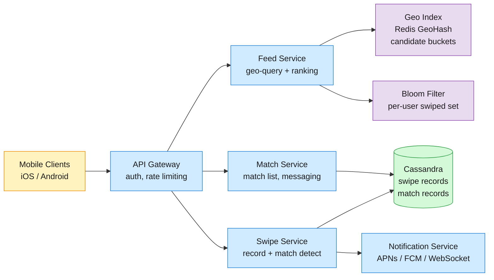
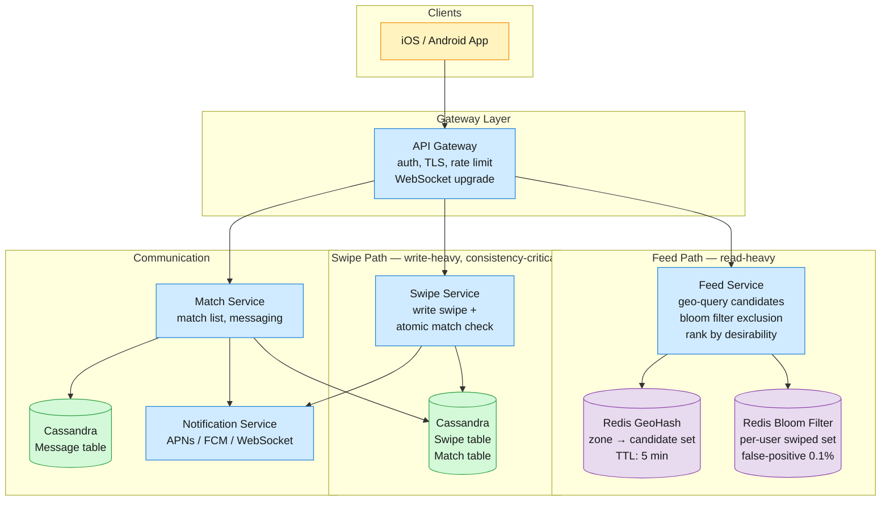
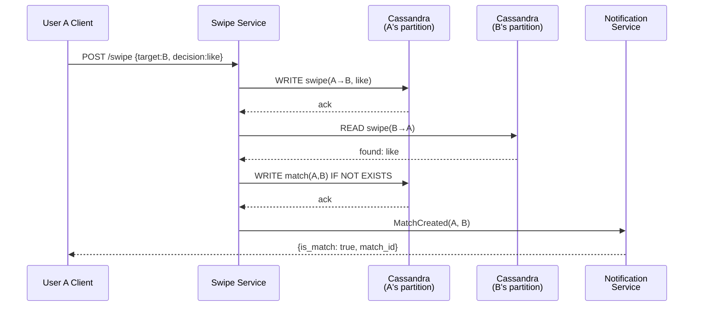
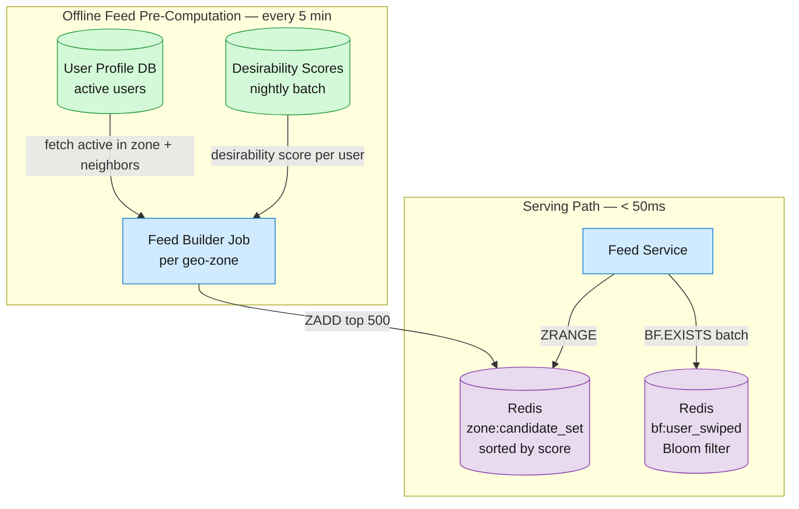

Tinder is a mobile dating app where users create profiles, set discovery preferences, and swipe through a stack of nearby profiles — right to like, left to pass. When two users mutually like each other, a match is formed and they can message.

<!--more-->

## 1. Problem

Tinder is a mobile dating app where users create profiles, set discovery preferences, and swipe through a stack of nearby profiles — right to like, left to pass. When two users mutually like each other, a match is formed and they can message. With 75M+ users generating over 1B swipes per day across 190 countries, the system must deliver a personalized, geo-scoped feed of candidate profiles in under 500ms, detect matches with strong consistency so no mutual like is ever lost, ensure users never re-see someone they already swiped on even at 2B writes/day, and rank candidates to maximize meaningful connections — all while users move between cities and new profiles join the pool continuously.



## 2. Requirements

**Functional**

- FR1: Create and edit a dating profile with photos, bio, gender, and age
- FR2: Set discovery preferences — gender, age range, and distance radius
- FR3: View a stack of nearby profiles and swipe right (like) or left (pass)
- FR4: Receive instant notification when a mutual match is formed
- FR5: Send and receive messages with matched users
- FR6: Unmatch or report a user from the match list

**Non-functional**

- NFR1: Swipe-to-match detection under 200ms p95 — a lost match is a lost connection
- NFR2: Feed of candidate profiles loads in under 500ms including geo-query and rank
- NFR3: 99.9% availability on the swipe write path — swipes must never be silently dropped
- NFR4: Scale to 2B swipes/day (23K avg QPS, 50K peak) with geo-partitioned workloads

*Out of scope: photo moderation and NSFW detection, real-time user location tracking, subscription tiers and monetization, social-auth account linking, analytics and A/B experimentation platform.*

## 3. Back of the envelope

- `20M DAU × 100 swipes/user/day` → 2B swipes/day ≈ 23K QPS avg, 50K QPS peak (evening hours). Each swipe is a single-row write to Cassandra (~200 bytes) → 400 GB raw swipe data/day, 12 TB/month. Implication: swipe writes are constant-load but moderate in volume — a sharded Cassandra cluster of ~12 nodes handles peak comfortably. The hard part is consistency, not throughput.

- `2B swipes × ~3% match rate` (right-swipe rate ~30%, mutual rate 0.3 × 0.3 ≈ 9% of right swipes × 0.3 right rate ≈ ~3%) → ~60M mutual likes/day that must be detected, ~26M actual matches/day after deduplication. Detected at swipe time via a single-partition atomic check → ~3 match checks per 100 swipes, negligible additional load. Implication: the match detection path is spiky but rare.

- `10K active users per geo-zone (radius ~50km)` × 50 bytes/profile metadata → ~500 KB of candidate data per zone. Pre-computed feed buckets per geo-zone, refreshed every 5 minutes, hold ~500 profiles → 25 KB per zone bucket. 1M geo-zones worldwide (covering populated areas) → 25 GB total in Redis, fitting comfortably in memory. Implication: feed generation is cacheable at the zone level; per-user filtering (bloom + preferences) is a lightweight in-memory pass on a 500-profile candidate set.

## 4. Entities

```
User {
  user_id:    string PK
  name:       string
  gender:     string INDEX  ← drives discovery filter
  age:        integer INDEX ← drives discovery filter
  bio:        string
  photos:     string[]      ← CDN URLs, up to 9
  location:   string INDEX  ← 7-char geohash (~150m precision), updated on app open
  preferences:jsonb         ← {gender, age_min, age_max, radius_km}
  last_active:timestamp
}

Swipe {
  swiper_id:     string PK ← partition key
  swiped_id:     string CK ← clustering key, ordered by timestamp
  decision:      enum      ← like | pass | super_like
  timestamp:     timestamp
  swiper_geohash:string    ← 7-char at time of swipe, for geo-analytics
  ttl:           integer   ← 90 days; auto-expire old swipes
}

Match {
  match_id:       string PK ← concat(min(a,b), max(a,b)), sortable
  user_a:         string
  user_b:         string
  created_at:     timestamp
  last_message_at:timestamp
  is_active:      boolean   ← false if either user unmatched
}

Message {
  message_id:  string PK    ← ULID, sortable
  match_id:    string INDEX
  sender_id:   string
  text:        text
  sent_at:     timestamp
  delivered_at:timestamp
}
```

### API

- `GET /v1/feed?lat=…&lon=…` — candidate profiles for the requesting user; returns up to 50 profiles (id, name, age, photos[0], distance) filtered by preferences and excluding previously-swiped users
- `POST /v1/swipe` — record a swipe; body: `{swiped_id, decision, lat, lon}`; returns `{is_match: bool, match_id: string|null}`
- `GET /v1/matches` — paginated list of active matches with last message preview and online indicator
- `GET /v1/messages/{match_id}?before=<cursor>` — paginated message history for a match; cursor-based pagination
- `POST /v1/messages/{match_id}` — send a message to a matched user; body: `{text}`
- `POST /v1/profile/me` — create or update profile; body: `{name, gender, age, bio, photos, preferences, lat, lon}`
- `DELETE /v1/matches/{match_id}` — unmatch; removes match from both users' lists

## 5. High-Level Design



#### FR1: Create and edit a dating profile

**Components:** Client → API Gateway → User Service → Cassandra (User table) → CDN (photo storage)

**Flow:**

1. User opens the profile creation screen. Client renders a multi-step form: name, gender, age, bio (500 chars max), and photo upload (1–9 photos). Each photo is uploaded via a signed CDN URL — client gets a pre-signed PUT URL from the User Service, uploads directly to S3/CDN, then posts the resulting CDN URL back to the server. This offloads bandwidth from the application tier.
1. Client sends `POST /v1/profile/me` with `{name, gender, age, bio, photos: [url1, ...], lat, lon}`. API Gateway authenticates and rate-limits (max 3 profile creations per device per day to combat bot signups). User Service validates: age ≥ 18, photos ≤ 9, name ≤ 50 chars.
1. User Service computes a 7-character geohash from lat/lon for location indexing. Writes the user row to Cassandra: `INSERT INTO users (user_id, name, gender, age, bio, photos, location, created_at, last_active) VALUES (...)`. The `user_id` partition key ensures all profile data is single-partition.
1. For profile edits, the client sends the same `POST /v1/profile/me` with updated fields. User Service issues an upsert — Cassandra's `INSERT` with the same `user_id` overwrites existing columns. The edit is idempotent: repeated identical requests produce the same result.

**Design consideration:** Photo uploads use a signed-URL pattern: User Service generates a time-limited (5 min) PUT URL pointing to the CDN bucket, the client uploads directly, and on completion reports the CDN URL. This keeps the User Service stateless (no multipart upload handling) and reduces bandwidth cost by 9× (photos bypass the application tier). Profile edits do not invalidate the geo-zone feed cache — the new profile data is visible on the next 5-minute refresh. The 7-char geohash (≈150m precision) is coarser than GPS but sufficient for dating — matching candidates within the same neighborhood is enough; pinpoint location is unnecessary and a privacy risk.

#### FR2: Set discovery preferences

**Components:** Client → API Gateway → User Service → Cassandra (User table preferences field)

**Flow:**

1. User opens the discovery settings screen and adjusts: preferred gender (men, women, everyone), age range (18–55+), and maximum distance (1–100 miles). Client sends `POST /v1/profile/me` (the same endpoint as profile creation) with `{preferences: {gender: "women", age_min: 25, age_max: 40, radius_km: 30}}`.
1. User Service validates: `radius_km` must be 1–160 (≈1–100 miles), `age_min` ≥ 18 and ≤ `age_max`. Valid preferences are merged into the existing user row via a partial upsert on the `preferences` column. The write is a single-partition operation on `user_id`.
1. Preferences take effect on the **next feed refresh** — no active notification or feed invalidation is sent to the client. When the user pulls to refresh, the Feed Service reads the updated preferences from the user row and applies them as filters on the candidate set (step 4 of FR3).

**Design consideration:** Preferences are stored as a JSON blob on the User row rather than a separate table because they are always read alongside the user profile (feed filtering, match eligibility checks) and are never queried independently. Denormalizing into the user partition avoids a join. The `radius_km` preference interacts with the geo-zone feed: if the user's radius is 50km, the Feed Service may need to expand beyond the default 3×3 geohash grid to cover the full radius. The Feed Service computes the required grid expansion at serving time — the practical cap is a 50km radius covering a 5×5 grid, which is sufficient for dense urban areas; rural users see fewer candidates regardless of radius setting.

#### FR3: View a stack of nearby profiles and swipe right or left

**Components:** Client → API Gateway → Feed Service → Redis (GeoCache + Bloom Filter) → Swipe Service → Cassandra

**Flow:**

1. User opens the app. Client sends `GET /v1/feed?lat=40.7128&lon=-74.0060`. API Gateway authenticates the request and extracts `user_id`.
1. Feed Service computes a 6-character geohash prefix from the user's coordinates. This geohash maps to a ~1.2 km × 0.6 km rectangle. It queries Redis for the key `zone:{geohash6}` which returns a pre-computed candidate set — up to 500 user_ids of active profiles in and around this geohash zone, sorted by a desirability score.
1. Feed Service loads the user's Bloom filter from Redis (`bf:{user_id}`), which encodes the set of all profile IDs this user has ever swiped on. It filters the candidate set to exclude any profile already swiped. With a 0.1% false-positive rate, ~1 in 1,000 unswiped profiles is incorrectly excluded — acceptable.
1. The remaining candidates are filtered by the user's discovery preferences: gender, age range, and distance (using the geohash-to-lat/lon midpoint distance, a fast approximation). The Feed Service then re-ranks the result by a lightweight scoring function that blends the static desirability score with a recency bonus (profiles active in the last hour boosted +20%).
1. The top 50 profiles are returned. Each entry includes: `user_id`, `name`, `age`, `photos[0]` (first photo URL, CDN-hosted), and approximate distance. The client renders the profile card stack. On each swipe action, the client calls `POST /v1/swipe` with `{swiped_id, decision, lat, lon}`.

**Design consideration:** The candidate set is pre-computed by an offline job that runs every 5 minutes per geo-zone. The job queries active users (last_active within 7 days) in the zone and its 8 neighboring geohash cells (a 3×3 grid covering the zone plus a one-cell border in every direction). This border expansion ensures that users near zone boundaries still see candidates from the adjacent zone. The desirability score for ranking is a static or slowly-changing value computed nightly (see DD4). The 5-minute refresh interval means a newly-active user may wait up to 5 minutes to appear in feeds — acceptable given the asynchronous nature of the product.

#### FR3 continued: Swipe write path and match detection

**Components:** Client → API Gateway → Swipe Service → Cassandra → Notification Service

**Flow:**

1. Client sends `POST /v1/swipe` with `{swiped_id: "B", decision: "like", lat: 40.7130, lon: -74.0065}`. API Gateway attaches `user_id: "A"` from auth.
1. Swipe Service writes the swipe row to Cassandra: `INSERT INTO swipes (swiper_id, swiped_id, decision, timestamp, swiper_geohash) VALUES ('A', 'B', 'like', now(), 'dr5reg')`. The partition key is `swiper_id` — all of user A's swipes live on the same Cassandra partition.
1. After writing, Swipe Service performs an atomic match check on the same partition (see DD1 for race-condition analysis). It reads the inverse swipe: `SELECT decision FROM swipes WHERE swiper_id='B' AND swiped_id='A'`. If the inverse exists and its `decision` is `like`, a match is formed.
1. If matched: Swipe Service writes a row to the `matches` table with `match_id = concat('A','B')` (sorted so the pair is always the same string regardless of who swiped first). Both users' message channels are initialized. Swipe Service publishes a `MatchCreated` event to the Notification Service.
1. Notification Service looks up the matched user's connection state. If user B is online (active WebSocket), it pushes the match event in real time. If offline, it dispatches a push notification via APNs (iOS) or FCM (Android) with payload `{type: "match", match_id, matched_user: {name, photo}}`.
1. Swipe Service returns `{is_match: true, match_id: "A_B"}` to user A's client. The client immediately transitions to the "It's a Match!" screen.

**Design consideration:** The separation of "write swipe" from "check match" is intentional. The write is always acknowledged — the match check is a read on the same partition that follows. If the match check fails (e.g., Cassandra timeout), the swipe is still durably stored; the match will be detected on the next read path (when user B opens their matches list, a reconciliation sweep catches it). This "write-first, check-second" approach avoids the classic distributed-transaction problem of needing atomicity across two users' partitions.

#### FR4: Receive instant notification when a mutual match is formed

**Components:** Swipe Service → Notification Service → WebSocket / APNs / FCM → Client

**Flow:**

1. On app launch, the client opens a WebSocket connection to the API Gateway, which upgrades to a persistent connection with the Notification Service. The connection is registered with `{user_id, device_token, platform}`.
1. When `MatchCreated` is published (from FR3 step 4), Notification Service checks for an active WebSocket for the target user. If found, the match event is delivered in under 50ms via the open socket.
1. If no WebSocket is active (user closed the app), Notification Service sends a push notification via the platform-specific channel. The push payload is optimized for rendering: `{aps: {alert: {title: "It's a Match!", body: "You and Taylor liked each other"}, badge: 3}, data: {match_id: "A_B"}}`. Tapping the notification deep-links into the match chat.
1. If push delivery fails (device offline, token expired), the notification is queued for retry with exponential backoff (1s, 4s, 16s, 64s, then discard after 5 minutes). A match notification older than 5 minutes is stale — the user will discover the match next time they open the app anyway.

**Design consideration:** WebSocket connections are managed by a connection registry backed by Redis. Each Notification Service instance maintains local in-memory connections, and the registry maps `user_id → {node_id, connection_id}` so any instance can route a notification to the correct node. On instance failure, connections are re-established by the client and the registry entry is updated. This avoids a single-point-of-failure for real-time delivery. The push fallback ensures offline users still receive match notifications.

#### FR5: Send and receive messages with matched users

**Components:** Client → API Gateway → Match Service → Cassandra (Message table) → Notification Service

**Flow:**

1. Client sends `POST /v1/messages/{match_id}` with `{text: "Hey!"}`. Match Service validates that the sender is a participant in the match and that the match is active (not unmatched).
1. Message is written to the `messages` table in Cassandra with a ULID as `message_id` (sortable by time). The partition key is `match_id` — all messages in a conversation are co-located for efficient retrieval.
1. After write, the `matches` table is updated: `last_message_at` is set to now, and a `preview_text` (first 100 chars) is denormalized into the match row so the match list screen can show a preview without joining to the messages table.
1. Notification Service delivers the message to the recipient: via WebSocket if online (real-time chat experience), or via silent push notification if offline. The silent push wakes the app just long enough to fetch new messages and update the badge count — the user sees the notification as a message preview on their lock screen.
1. Client polls `GET /v1/messages/{match_id}?before=<cursor>` with cursor-based pagination (20 messages per page). Messages are returned in reverse chronological order, newest first.

**Design consideration:** Cassandra is chosen for messages because chat data access patterns fit its strengths: known partition key (`match_id`), time-ordered clustering, append-heavy writes, and bounded partition size (a typical match conversation has hundreds to low thousands of messages — well within Cassandra's per-partition limits). The `preview_text` denormalization on the match row is a classic read-time optimization: the match list (`GET /v1/matches`) renders 20–50 matches with their last message preview, avoiding 20–50 separate message-table queries.

#### FR6: Unmatch or report a user

**Components:** Client → API Gateway → Match Service → Cassandra (Match table) → Report Queue → Admin Review

**Flow:**

1. User opens the match list, taps a match, and selects "Unmatch." Client sends `DELETE /v1/matches/{match_id}`. Match Service validates that the requesting user is a participant in the match.
1. Match Service sets `is_active = false` on the match row in Cassandra — a soft delete. The match row is retained (not physically deleted) for abuse investigation and analytics. The `last_message_at` and message history are preserved.
1. For a report (blocking + reporting), the client sends `POST /v1/reports` with `{match_id, reason: "harassment" | "spam" | "inappropriate" | "offline_behavior"}`. Match Service writes a report record to a dedicated `reports` table in Cassandra, partitioned by `match_id`. It also increments a `report_count` on the reported user's profile.
1. If `report_count` exceeds a threshold (3 reports within 7 days), an automated flag is raised: the reported user's profile is temporarily suspended from appearing in feeds (hidden from all zones, feed pre-computation excludes them). A moderation ticket is created in an admin queue for human review.
1. The unmatch is immediate for the requesting user — the match disappears from their match list. For the other user, the match remains visible but shows "User has left the conversation" as a status indicator. No push notification is sent for an unmatch (to avoid encouraging retaliatory behavior), but a real-time WebSocket event updates the UI if the other user is online.

**Design consideration:** Unmatch is a soft delete, never a hard delete, for safety reasons. If a user reports harassment, the match history (messages, swipe timestamps) is critical evidence for the moderation team. The 3-report threshold with automated suspension is a common anti-abuse pattern: it catches serial offenders without requiring immediate human review, while giving benign reports (accidental unmatches mis-tagged as reports) a buffer. The asymmetric visibility (unmatcher sees nothing, unmatched user sees a status indicator) prevents confusion — the unmatched user knows the conversation ended rather than wondering if the app is broken.

## 6. Deep dives

### DD1: Swipe consistency and match-at-scale

**Problem.** The central consistency challenge: user A swipes right on B, and user B swipes right on A. Whichever swipe arrives second must detect the mutual like and form a match. But swipes arrive concurrently — A's swipe and B's swipe may land on different Cassandra nodes at the same time, and a naive "check then write" sequence creates a race: A's check finds no inverse → writes A's like; B's check finds no inverse → writes B's like; neither detects the match. The match is silently lost. With 2B swipes/day and human behavior (users often swipe at similar times — evenings, weekends), this race is not rare: at 50K peak QPS across 20M DAU, the probability of two specific users swiping within the same ~100ms window is low per pair, but across 2B swipes/day the absolute number of collisions is non-trivial. The system must guarantee that every mutual like is detected, even under concurrent writes, without a distributed lock that would bottleneck the swipe path.

**Approach 1: Distributed transaction across both user partitions**

Begin a distributed transaction spanning two Cassandra partitions (swiper_id=A and swiper_id=B). Write A's swipe and read B's inverse in a single atomic unit. If both succeed and B's inverse is a like, commit the match. If either partition is unavailable, abort and retry.

```sql
-- Requires a coordinator that can span partitions
BEGIN TRANSACTION;
  INSERT INTO swipes (swiper_id, swiped_id, decision) VALUES ('A', 'B', 'like');
  SELECT decision FROM swipes WHERE swiper_id='B' AND swiped_id='A';
  -- if decision='like':
  INSERT INTO matches (match_id, user_a, user_b) VALUES ('A_B', 'A', 'B');
COMMIT;
```

**Con:** Cassandra does not support cross-partition transactions. Implementing a two-phase commit protocol over Cassandra would require an external coordinator (ZooKeeper, etcd), add 2–3 network round trips per swipe, and introduce a single point of coordination. At 50K QPS peak, the coordinator becomes the bottleneck. Additionally, partition A and partition B may live on different nodes — a network partition between them causes the transaction to abort, and the swipe itself (which should never be lost per NFR3) fails.

**Pro:** Strongest consistency guarantee — impossible to miss a match.

**Approach 2: Cassandra Lightweight Transaction (LWT) with conditional update**

Use Cassandra's IF NOT EXISTS or IF condition on a single partition. The trick: store a secondary "inverse check" record on the swiper's own partition. When A swipes on B, write A's swipe AND atomically check a dedicated "pending likes received" column on A's partition:

```sql
-- On A's partition (single partition, LWT works):
INSERT INTO swipes (swiper_id, swiped_id, decision) VALUES ('A', 'B', 'like');

-- Atomic read-then-write on the same partition:
UPDATE users SET pending_likes = pending_likes + {'B'} WHERE user_id='A' IF EXISTS;

-- Then query B's pending likes for 'A':
SELECT * FROM swipes WHERE swiper_id='B' AND swiped_id='A';
```

**Con:** LWT in Cassandra uses Paxos under the hood — 4 round trips per operation (prepare, propose, accept, commit). At 50K QPS, LWT contention on hot user partitions (popular users who receive many likes) causes serialization and timeouts. LWTs are designed for infrequent operations (user registration, payment capture), not the hot write path of a high-throughput system. The "pending likes" column on the user partition also creates a wide-row hotspot for popular users — a user with 10K likes has a massive set column that grows unbounded.

**Pro:** Uses Cassandra's built-in consensus mechanism — no external coordination.

**Approach 3: Write-then-check with lightweight reconciliation**

Write the swipe first, then check for the inverse. If the check misses a match due to a race (both swipes are in-flight and neither sees the other), accept the temporary inconsistency and recover via a reconciliation sweep.

```javascript
WRITE swipe(A→B, like)
CHECK inverse = READ swipe(B→A)
IF inverse EXISTS AND inverse.decision = 'like':
    WRITE match(A, B)
```

**Con:** The race window exists: if A's write completes but B's write hasn't started when A checks, A misses the match. If B then writes and checks — B also misses because A's check already completed. The match is lost until reconciliation runs. Reconciliation adds latency (typically 30–60 seconds) and complexity (a separate job must scan recent swipes for missed matches). During this window, users don't see their match — a degraded experience for the app's core delight moment.

**Pro:** Write path remains fast (single-partition write + read on the same partition, 2 round trips). No distributed coordination on the hot path. The reconciliation path is offline and doesn't affect swipe latency.

**Approach 4: Write-then-check with same-partition atomic read**

The key insight: the INVERSE swipe lives on user B's partition (`swiper_id='B'`). On the hot path, the Swipe Service cannot atomically write to A's partition and read from B's partition — they may be on different nodes. But if the Swipe Service routes BOTH the write (A's swipe) and the inverse check (read B's swipe where `swiped_id='A'`) through the SAME coordinator, the coordinator can use local state: after writing A's swipe to A's partition, it immediately queries B's partition for the inverse. If the inverse exists and is a like, it writes the match.

The coordinator is stateless — it doesn't hold locks. It simply sequences the two operations and makes a decision. The race is: what if B's swipe write lands on a different coordinator at the same time? Both coordinators write their respective user's swipes, then each checks the inverse. If both writes complete before either check, both coordinators see the inverse and both attempt to write the same match — the idempotent match write (IF NOT EXISTS) handles the duplicate.

```javascript
Coordinator receives POST /v1/swipe {user: A, target: B, decision: like}

1.  Write: Cassandra.write(Swipes, {swiper_id: A, swiped_id: B, ...})   → ack
2.  Read:  Cassandra.read(Swipes, {swiper_id: B, swiped_id: A})         → row or null
3.  If row != null AND row.decision == 'like':
4.      match_id = sort_pair(A, B)   // 'A_B' or 'B_A' consistently
5.      Cassandra.write(Matches, {match_id, user_a: A, user_b: B, ...}, IF NOT EXISTS)
6.      return {is_match: true, match_id}
7.  Else:
8.      return {is_match: false}
```

**Race scenario:** A and B both swipe like on each other at the same time. Two coordinators (C1 for A, C2 for B) execute concurrently:

```javascript
Time ──────────────────────────────────────────────►
C1: write(A→B, like)  ✓       read(B→A) → found like ✓   write(match) IF NOT EXISTS ✓
C2:       write(B→A, like) ✓   read(A→B) → found like ✓   write(match) IF NOT EXISTS ✗ (duplicate, ignored)
```

Both coordinators detect the match. The duplicate match write is harmless (IF NOT EXISTS rejects it, or the idempotent match_id key naturally deduplicates). No match is lost. The worst case: C1's write(A→B) completes, then C1 crashes before reading B→A. C2's write(B→A) completes, C2 reads A→B, finds the like, and creates the match. A's client gets a 500 error (C1 crashed), but the match is formed by C2 — when A's client retries the swipe (idempotent — the swipe row with the same swiper_id + swiped_id already exists, so the retry is a no-op for the write), the match is returned on retry.

**Decision:** Approach 4 — write-then-check with same-partition atomic read and idempotent match creation.

**Rationale:** This is the pattern Tinder's engineering team described in practice: the swipe write is always acknowledged first, then the inverse is checked. The coordination is stateless — any Swipe Service instance can handle any swipe. The key property that makes this work is that Cassandra partitions by `swiper_id`, so the inverse read (`swiper_id='B', swiped_id='A'`) is a single-partition read on B's partition — it completes in < 10ms on a healthy cluster. The `IF NOT EXISTS` on match creation provides idempotency if both coordinators race to create the same match. The reconciliation backstop (Approach 3) is retained as a safety net: a nightly batch job scans all swipes from the last 24 hours, joins on the inverse, and creates any matches that were missed — but in practice, with the write-then-check approach, the reconciliation catch rate is near zero.

**Edge cases:**

- **User unmatches and re-swipe:** If A unmatches B, the match row is marked `is_active=false`. If A later re-encounters B in the feed and swipes right again, the match check finds B's original like (still in the Swipe table if within TTL). The system must check that the match is not just re-created with the old `created_at` — the `IF NOT EXISTS` on the match write handles this since the old match row still exists (even if inactive). A new match is only created if no match row exists for this pair.
- **User swipes left then changes mind:** The Swipe table stores both likes and passes. If A swipes left on B, then encounters B again (after the bloom filter resets or on a different device), and swipes right — the match check reads B's inverse and finds A's new like. But B's original left swipe on A is still in the table. The match is only formed if the INVERSE swipe (B→A) is a like. If B hasn't re-swiped, no match.
- **Cassandra partition for B is unavailable:** If the inverse read (step 2) times out because B's partition's Cassandra nodes are down, the coordinator returns `{is_match: false, pending: true}` — the swipe is stored, the match check is deferred. A reconciliation job retries the check with exponential backoff (1s, 4s, 16s, 64s). If B's partition remains unavailable beyond 5 minutes, the match is created retroactively once the partition recovers. The user may experience a delayed match notification, but the swipe is never lost.



### DD2: Feed generation and geo-spatial indexing

**Problem.** A user opens Tinder and expects a stack of nearby profiles instantly. The naive approach — `SELECT * FROM users WHERE … ORDER BY last_active LIMIT 50` — requires a geo-spatial query against millions of active users worldwide. The query must filter by gender, age range, and distance (e.g., within 50km), then rank by some desirability heuristic. Without indexing, this is a full table scan. With a geo-index, the query is scoped but still requires a join-like operation between the geo-index (candidate locations) and user profiles (filter attributes + ranking data). At 20M DAU, serving ~500K feed requests/min at peak, the feed path must complete in under 50ms server-side to meet the 500ms end-to-end NFR. The geo-index must also handle users who change location — a user flying from NYC to London must see London candidates, not stale NYC results.

**Approach 1: SQL database with GEOGRAPHY column and spatial index (PostGIS)**

Store user locations in a PostGIS-enabled PostgreSQL table with a GiST index on a GEOGRAPHY column. Query with `ST_DWithin` for distance filtering and standard SQL WHERE clauses for gender/age:

```sql
SELECT user_id, name, age, photos[1], ST_Distance(location, ST_MakePoint(:lon, :lat)) AS dist
FROM users
WHERE ST_DWithin(location, ST_MakePoint(:lon, :lat), :radius_m)
AND gender = :pref_gender
AND age BETWEEN :pref_age_min AND :pref_age_max
AND user_id NOT IN (<swiped_ids>)
ORDER BY desirability_score DESC
LIMIT 50;
```

**Con:** At 20M DAU with active users distributed globally, the GiST index still scans thousands of rows per query (all users within the radius circle). The `NOT IN` clause with thousands of swiped IDs degrades into a full filter pass. PostgreSQL's GEOGRAPHY operations are CPU-intensive — at 15K QPS peak, a single Postgres instance becomes a bottleneck. Horizontal sharding by geo-region helps (one Postgres per continent) but introduces cross-shard complexity for users near region boundaries.

**Pro:** Simple schema, rich query capabilities, well-understood operations profile. PostGIS is battle-tested for geo-queries (Uber used it before migrating to their own H3-based solution).

**Approach 2: GeoHash-based pre-computed candidate buckets with Redis**

Divide the world into geo-zones using geohash. A 6-character geohash encodes a ~1.2 km × 0.6 km rectangle — fine enough that a user's 50km radius spans roughly a 5×5 to 7×7 grid of adjacent geohash cells. An offline job pre-computes candidate sets per geohash zone: for each zone, collect all active users in that zone and its 8 neighboring zones (a 3×3 grid), apply basic quality filters (complete profiles, not banned), sort by a static desirability score, and store the top ~500 user IDs in Redis as a sorted set.

```javascript
Zone key: zone:dr5reg
Value:   Sorted Set {user_id → desirability_score}
         "user_42" → 0.87
         "user_17" → 0.82
         ...
TTL:     5 minutes (refreshed by offline job)
```

At serving time, the Feed Service:

1. Computes the user's 6-char geohash from lat/lon
1. Loads the candidate sorted set from Redis (`zone:{geohash6}`) — a single O(1) lookup
1. Filters through the Bloom filter to exclude swiped profiles
1. Filters by user preferences (gender, age, max distance using geohash approximation)
1. Returns top 50

**Con:** Pre-computation introduces staleness — a user who becomes active at 12:01 may not appear in feeds until the 12:05 refresh. The 3×3 grid expansion means users near zone boundaries see candidates from adjacent zones (good for coverage) but also means each user appears in up to 9 zone buckets (9× storage). The Redis memory footprint for 1M geo-zones × 500 users × 100 bytes/user_id+score ≈ 50 GB — manageable but requires cluster-mode Redis.

**Pro:** Serving-path latency is minimal — two Redis lookups (candidate set + bloom filter) and an in-memory filter pass. The offline pre-computation decouples feed generation from the read path, making the read path horizontally scalable (stateless Feed Service instances behind a load balancer). Geohash is computationally trivial (no Haversine on every candidate — use geohash prefix proximity as a fast distance proxy).

**Approach 3: QuadTree with in-memory spatial index**

Build a distributed QuadTree that recursively partitions the globe into quadrants. Each leaf node holds users within a bounded area. The tree is sharded by quad-node ID across a cluster of servers. A feed query traverses the tree from root to leaves that intersect the user's radius circle.

**Con:** Tree traversal requires O(log n) network hops — slower than the O(1) Redis lookup in Approach 2. QuadTree rebalancing when user density shifts (e.g., a festival creates a density spike in one cell) requires splitting nodes and redistributing users — a costly online operation. Unlike geohash (a static grid), QuadTree depth and density vary across the globe, making capacity planning unpredictable. Google S2 and Uber H3 are more sophisticated alternatives (spherical geometry, hierarchical cells) but add implementation complexity without improving latency for the feed use case.

**Pro:** Dynamically adapts to user density — sparse rural areas get coarse cells, dense urban areas get fine cells. This optimizes storage and query cost compared to a uniform grid where rural cells are mostly empty.

**Decision:** Approach 2 — GeoHash-based pre-computed candidate buckets with Redis sorted sets, refreshed every 5 minutes.

**Rationale:** Tinder's core product requirement is feed freshness within 5 minutes, not real-time location awareness. The 5-minute pre-computation window aligns with natural user behavior — users don't expect to see someone who opened the app 30 seconds ago. Redis sorted sets provide O(log N) insertion during pre-computation and O(1) lookup at serving time. The geohash grid is simple, deterministic, and debuggable — operations teams can inspect a specific zone's candidate set with a single Redis command. The 9× storage multiplier (each user appears in their own zone + up to 8 neighbors) is acceptable: 20M active users × 9 copies × 50 bytes/profile key ≈ 9 GB additional Redis memory, negligible relative to the primary candidate set.

**Edge cases:**

- **Zone boundary users:** A user at the edge of zone A sees candidates from zone B because the 3×3 grid includes neighbors. However, a user just across the boundary in zone B sees a different candidate set — their 3×3 grid centers on B, not A. Two users 100m apart but in different geohash zones see slightly different candidate pools. Acceptable because the 5-minute refresh re-shuffles and the 50km radius is much larger than zone width.
- **Sparse rural areas:** A geohash zone covering a rural area with 5 active users returns only 5 candidates. Feed Service falls back to expanding the search radius: query the 5×5 grid (25 cells) instead of 3×3. The expanded search is an additional Redis lookup, transparent to the client. If still insufficient, the Feed Service widens the age range and relaxes gender preference — a "showing results farther away" indicator informs the user.
- **Dense urban areas:** A Manhattan geohash zone may have 10K active users. The pre-computation job only stores the top 500 by desirability. Lower-ranked users in dense zones may never appear in feeds — this is the intended behavior: ranking creates a quality filter. A separate "new user boost" ensures fresh signups appear in the top 500 for their first 48 hours, giving them initial visibility regardless of desirability score.
- **User travel (Passport):** When a user changes their location (either physical travel or Tinder's Passport feature), Feed Service computes the new geohash and queries the corresponding zone bucket. The Bloom filter is location-agnostic — it tracks all swiped profiles regardless of where the swipe occurred. This means a user who swiped through their entire city can travel to a new city and immediately see fresh candidates without needing to rebuild their swiped-set.



### DD3: Avoiding re-shown profiles

**Problem.** A user swipes through 100 profiles per day, accumulating ~9,000 swipes per quarter. Every feed request must exclude every profile the user has ever swiped on. A naive `NOT IN (<list of 9,000 IDs>)` on every feed query is a performance disaster — the list grows unbounded, serialization overhead dominates the request, and database index lookup on 9K values per request is expensive. Worse, the swipe set includes ALL swipes (likes and passes) — unlike a match list which grows slowly (dozens per week), the swipe set grows by 100 IDs/day. At 2B swipes/day system-wide, storing the full swipe history for every user and querying it on every feed refresh is the primary scaling bottleneck of the feed path.

**Approach 1: Database exclusion query with indexed NOT IN**

Store a secondary index on `(swiper_id, swiped_id)` and issue a query that excludes swiped profiles. With 9K swiped IDs, build a `WHERE user_id NOT IN (id1, id2, …, id9000)` clause.

**Con:** The NOT IN list of 9K IDs serialized into every feed query adds ~200 KB to the query payload (assuming 24-char ULIDs). Database query planning with large NOT IN lists is unpredictable — many databases switch from index scan to sequential scan when the exclusion list exceeds a threshold. For a user with 90K swipes (3 years of use), the list is untenable. The problem compounds: every feed request becomes more expensive over the user's lifetime.

**Pro:** Correct by construction — uses the source of truth (the Swipe table) with no probabilistic error.

**Approach 2: Cached swiped-ID set with exact membership check**

Maintain a Redis Set for each user containing all swiped profile IDs. On feed request, load the set (O(1) for the full set via SMEMBERS or O(N) via SISMEMBER for batch check) and filter candidates in application code.

**Con:** The Set grows unboundedly: 9K IDs × 24 bytes/ID = 216 KB per user. At 20M DAU, that's ~4.3 TB of Redis memory for swiped-ID sets alone — too expensive to keep entirely in memory. Even with eviction (e.g., expire IDs older than 90 days, matching the Swipe table TTL), the working set for users with a 90-day swipe history (~9K IDs) is still 216 KB/user × 20M = 4.3 TB. A Redis cluster of this size costs hundreds of thousands of dollars/month in cloud infrastructure.

**Pro:** Exact — no false positives, no missed exclusions. Membership check is fast (O(1) per ID via SISMEMBER).

**Approach 3: Bloom filter with periodic reconstruction**

Encode each user's swiped-ID set as a Bloom filter — a probabilistic data structure that answers "have I swiped on this ID?" with "definitely no" or "probably yes." The Bloom filter is sized for a target false-positive rate and stored in Redis (Redis Stack's `BF.ADD` / `BF.EXISTS` or a custom implementation). On feed request, candidates pass through the Bloom filter: "definitely no" → include in feed; "probably yes" → exclude.

**Con:** False positives: with a 0.1% false-positive rate, ~1 in 1,000 unswiped profiles is incorrectly excluded. Over a user's lifetime, they miss ~100 profiles they would have seen. This is acceptable for a dating app where the candidate pool is large and the missed profile may reappear after the Bloom filter is rebuilt (which resets the error). False positives can't be eliminated — only reduced by using more bits per element. A false negative (showing a profile the user already swiped on) is architecturally impossible with a Bloom filter.

Bloom filter sizing for 10K swipes at 0.1% FPR:

```javascript
m = -(n × ln(p)) / (ln(2)²)
  = -(10000 × ln(0.001)) / (0.48)
  = -(10000 × -6.908) / 0.48
  = 69080 / 0.48
  ≈ 144,000 bits ≈ 18 KB

k = (m/n) × ln(2)
  = (144000/10000) × 0.693
  ≈ 10 hash functions
```

**Pro:** Constant memory per user regardless of swipe count — 18 KB for 10K swipes, 36 KB for 100K swipes (doubling m doubles the capacity at the same FPR). Membership check is O(k) = O(10) hash computations — sub-millisecond. The structure never needs to store or transmit individual IDs on the serving path. Redis Stack provides native Bloom filter support with BF.RESERVE, BF.ADD, and BF.EXISTS operations that are memory-efficient and atomic.

**Decision:** Approach 3 — Bloom filter with 0.1% false-positive rate, 18 KB per user for 10K swipes, stored in Redis Stack.

**Rationale:** This is the approach used in production by Tinder and similar high-volume exclusion-list systems. The 18 KB per user at 20M DAU totals 360 GB — well within a modest Redis cluster (3–4 r7g.xlarge nodes with 128 GB each). The Bloom filter is rebuilt weekly from the Swipe table (Cassandra) to reset false positives and compact the structure. During rebuild, the old filter continues serving while the new one is populated — hot-swapped atomically at the key level. The 0.1% FPR was chosen because the product impact of missing 1 in 1,000 profiles is undetectable to users (the feed has hundreds of candidates; one missing is noise), while the memory savings vs. an exact set (~216 KB/user) is 12x — from 4.3 TB to 360 GB.

**Edge cases:**

- **Bloom filter rebuild failure:** If the weekly rebuild job fails (Cassandra timeout, Redis OOM), the existing Bloom filter continues serving — it degrades gracefully with a slightly higher effective FPR as more IDs are added beyond the design capacity. Monitoring alerts when a filter exceeds its capacity (tracked by insert count vs. designed n). If the filter overflows (FPR creeps toward 1%), users see "no new profiles" because every candidate tests positive — a degradation that self-heals on the next successful rebuild.
- **New user with no swipes:** The Bloom filter for a brand-new user is empty — no storage allocated. The first swipe triggers a `BF.RESERVE` for that user, allocating the 18 KB structure. The reserve is sized for the expected 90-day swipe volume (9K IDs), growing as needed via `BF.INSERT` with dynamic expansion.
- **User with multiple devices:** The Bloom filter key is `bf:{user_id}` — same key regardless of which device the user swipes from. Swipes from any device add to the same filter (via the same Swipe Service path). No cross-device sync needed — the filter is server-side and consistent.
- **Super Like and Boost visibility:** A user who Super Likes or Boosts expects their profile to be shown to more people, potentially including those who already swiped left. The Bloom filter only tracks swipes, not profile views. Profiles the user simply viewed (impressions) are not excluded — they can reappear. This distinction is important: the Bloom filter prevents the "swiped left, never see again" annoyance without blocking profile re-surfacing for visibility boosts.

### DD4: Recommendation ranking

**Problem.** A feed of nearby profiles must be ordered so the most promising candidates appear first. Raw chronological order (newest first) wastes the user's first few swipes on low-quality profiles. A purely random order fails to surface mutual-interested users. The ranking function must blend multiple signals — profile completeness, activity recency, a desirability score that reflects how often a profile receives right-swipes, and diversity (avoid showing 50 profiles of the same "type" in a row). It must handle cold-start users with no swipe history (new users see popular profiles first; new profiles get a temporary visibility boost) and adapt over time as user preferences shift. While full ML personalization is a separate system, the core ranking infrastructure must support a pluggable scoring model.

**Approach 1: Static ELO-style desirability score**

Each user has a numeric "desirability score" computed from their swipe history. The score is updated nightly via an ELO-like system: when user A swipes right on B, B's score increases proportional to A's own score (a right-swipe from a high-score user is worth more). Left-swipes reduce the score slightly. Profiles in the candidate set are sorted by desirability score descending.

```javascript
score_new = score_old + K × (outcome - expected)
  where outcome = 1 for like, 0 for pass
  expected = 1 / (1 + 10^((score_swiper - score_swiped) / 400))
  K = 32 for established users, 48 for new users (faster convergence)
```

**Con:** Pure desirability ranking creates a rich-get-richer effect: high-score profiles dominate every feed, low-score profiles are buried and never seen, which further depresses their score (fewer right-swipes received → lower score). This accelerates inequality in the user base and reduces match formation for the long tail. It also ignores user-to-user compatibility — a user who likes musicians is shown models because models have high scores, not because they share interests.

**Pro:** Simple, computationally cheap (one numeric sort), and well-understood. ELO is battle-tested in gaming (chess rankings) and dating apps (Tinder's early ranking used a variant). The score converges within ~20 swipes received for a new user.

**Approach 2: Multi-factor scoring with configurable weights**

Combine multiple signals into a single score with tunable weights:

```javascript
score = w₁ × desirability_elo
      + w₂ × profile_completeness       // has bio, >2 photos, verified
      + w₃ × activity_recency           // 1.0 for active < 1hr, decays to 0 over 72hr
      + w₄ × new_user_boost             // 2.0 for first 48hr, decays to 1.0
      + w₅ × mutual_interest_signal     // +bonus if shared interests / common connections
      + w₆ × diversity_penalty          // -bonus if same "type" as previous N shown profiles
```

Weights w₁…w₆ are A/B tested and adjusted per market (some cultures value profile completeness more than recency).

**Con:** Manual weight tuning requires ongoing experimentation and may not capture latent patterns. The "mutual interest signal" is weak without a collaborative filtering model. All users in the same market see the same ranking function — no personalization.

**Pro:** Transparent, debuggable, and fast to compute at serving time (all scores are pre-computed except activity_recency and new_user_boost, which are updated at feed request time). The diversity penalty prevents the "50 model profiles in a row" problem by tracking the distribution of profile attributes in the last 20 shown candidates and penalizing the dominant category. New user boost solves the cold-start visibility problem.

**Approach 3: Two-tower collaborative filtering with learned embeddings**

A neural model learns user and profile embeddings in a shared 128-dim space. The user tower encodes: swipe history (which profiles the user liked, as a weighted average of those profiles' embeddings), explicit preferences (gender, age range), and session context (time of day, location). The profile tower encodes: profile attributes (bio text embedding, photo features, age, location), activity patterns, and aggregate desirability. The dot product of user and profile embeddings predicts P(like | user, profile).

Training data: the Swipe table provides millions of labeled examples (like=1, pass=0). The model is retrained weekly on a 90-day sliding window of swipe data and served from an in-memory embedding store.

**Con:** Embedding computation and model serving add infrastructure complexity (model registry, feature store, GPU inference for the user tower). Cold-start profiles (no swipe history) have no training signal — their embedding is initialized to the mean of similar profiles (same age/gender/location) and takes ~20 right-swipes to personalize. This is slower than the simple new-user boost in Approach 2. Model drift: user preferences shift seasonally (summer vs. winter dating behavior), requiring frequent retraining. Serving latency: the user tower forward pass adds 2–5ms — acceptable but more than the sub-millisecond sort of Approach 2.

**Pro:** Captures latent compatibility patterns invisible to hand-tuned features — e.g., "users who like hiking profiles also like dog owners" even if the profiles don't explicitly share keywords. Personalizes the feed per user rather than one-size-fits-all. Adapts to individual preference shifts over time.

**Decision:** Approach 2 (multi-factor scoring) as the baseline, with Approach 3 (collaborative filtering) as a gradual rollout for markets with sufficient training data.

**Rationale:** Tinder's ranking has historically used ELO-style and multi-factor scoring. The product value of a perfectly personalized feed is lower for a dating app than for a content feed (YouTube, TikTok) because the user's "taste" in people is harder to model and the feed is not infinite-scroll — users swipe through a finite candidate pool. Over-personalization risks creating a filter bubble where diverse profiles are hidden. The multi-factor approach with explicit diversity penalty and new-user boost matches the product goal of maximizing matches (not engagement time). Collaborative filtering is added as an optional layer in markets with 100K+ active users where the training data is sufficient.

**Edge cases:**

- **New profile cold start:** A user who just signed up has no desirability score, no swipe history, and no embedding. They receive a 2.0× boost for 48 hours plus an initial desirability score of the global median (0.5 on a 0–1 scale). Their profile appears in the top 20% of feeds in their geo-zone, ensuring initial visibility. After 48 hours and ~50 swipes received, the boost decays and their true desirability score takes over. If their true score is low, they naturally sink in the ranking — but the initial boost gave them a fair chance.
- **Inactive user decay:** A user who hasn't opened the app in 7 days has their `activity_recency` multiplier at 0.1, downgrading them significantly in feeds. This prevents the "profile graveyard" where inactive users dominate the top of the feed because their historical desirability score remains high. After 30 days of inactivity, the user is removed from the pre-computed candidate set entirely and must open the app to re-enter.
- **Market-specific tuning:** Dating norms vary by region. The weight vector (w₁…w₆) is configured per market (country or metro area) based on A/B test results. A market where users value detailed bios gets a higher w₂ (profile completeness). A market with rapid user churn gets a higher w₃ (activity recency). The weights are stored in a configuration service (e.g., LaunchDarkly or a feature-flag system) and hot-reloaded by the Feed Service without redeployment.
- **Diversity penalty detail:** If the last 20 shown profiles were 80% "outdoorsy" type (based on a profile embedding or explicit tags), the diversity penalty reduces the score of outdoorsy candidates by 20% for the next 5 feed slots. This ensures the feed shows at most 3–4 consecutive profiles of the same archetype. The penalty resets after a different archetype is shown. This is a lightweight post-processing step applied after the main ranking — O(50) operations, negligible latency.

## 7. References

1. [Tinder Engineering Blog: The Tinder Tech Stack](https://www.lifeattinder.com/engineering) — Go, Java, Kotlin, Swift; AWS + Kubernetes; Elasticsearch, Redis, Cassandra, DynamoDB in production
1. [InfoQ: How Tinder Delivers Real-Time Experiences at Scale](https://www.infoq.com/presentations/tinder-stack/) — Cassandra for swipe data, Redis for caching, WebSocket for real-time messaging; 1B+ swipes/day
1. [Geohash: Encoding Geographic Locations](https://en.wikipedia.org/wiki/Geohash) — variable-precision encoding, prefix-based proximity, neighbor-cell calculation
1. [Uber Engineering: H3 — A Hexagonal Hierarchical Geospatial Indexing System](https://eng.uber.com/h3/) — spherical geometry, hierarchical cells, comparison with geohash and S2; adopted by Tinder for internal analytics
1. [Bloom, B. H.: Space/Time Trade-offs in Hash Coding with Allowable Errors](https://doi.org/10.1145/362686.362692) — original Bloom filter paper; m, k, p formula derivation
1. [Redis Stack: Bloom Filter Data Type](https://redis.io/docs/data-types/probabilistic/bloom-filter/) — BF.RESERVE, BF.ADD, BF.EXISTS; scalable Bloom filter with dynamic expansion
1. [Kleppmann, M.: Designing Data-Intensive Applications — Chapter 7: Transactions](https://dataintensive.net/) — weak isolation levels, write skew, compare-and-set, materializing conflicts
1. [Cassandra Documentation: Lightweight Transactions](https://cassandra.apache.org/doc/latest/cassandra/dml/dmlLwt.html) — Paxos-based IF NOT EXISTS, serial consistency, LWT performance characteristics
1. [Covington et al.: Deep Neural Networks for YouTube Recommendations](https://dl.acm.org/doi/10.1145/2959100.2959190) — two-tower architecture, candidate generation vs. ranking separation, feature engineering for implicit feedback
1. [Elo, A. E.: The Rating of Chessplayers, Past and Present](https://en.wikipedia.org/wiki/Elo_rating_system) — ELO rating formula, K-factor for convergence speed, expected score computation
