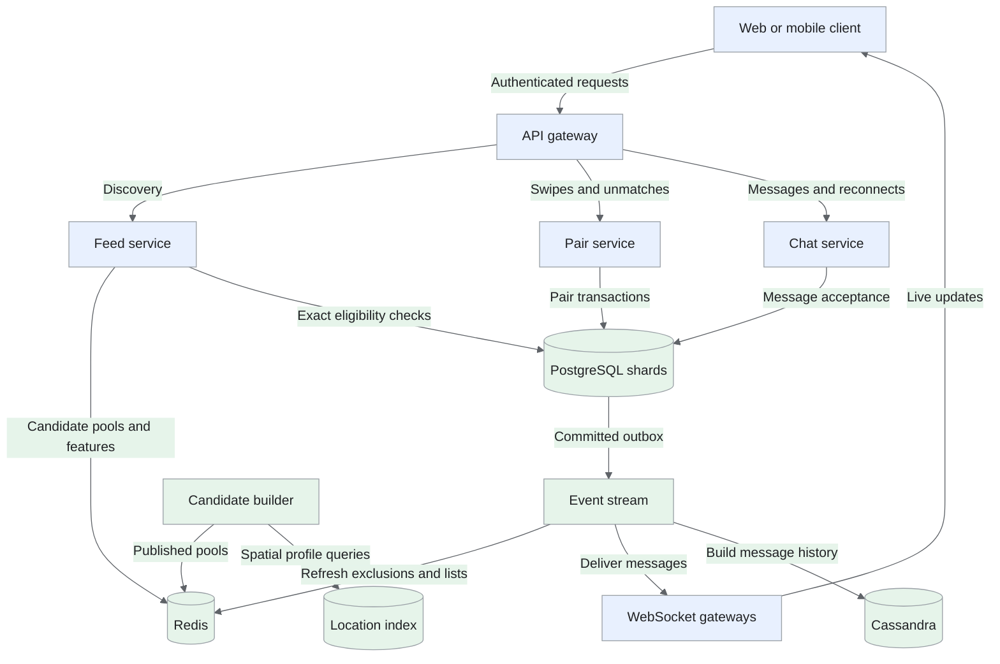
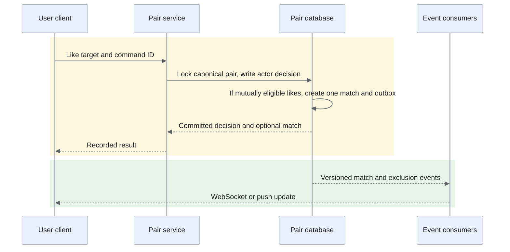
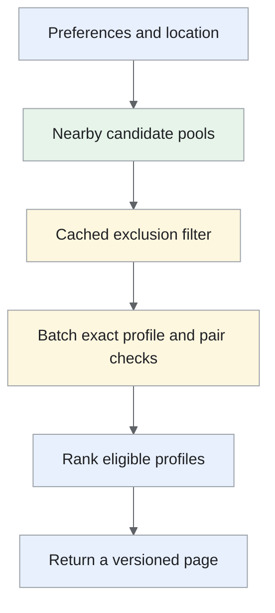
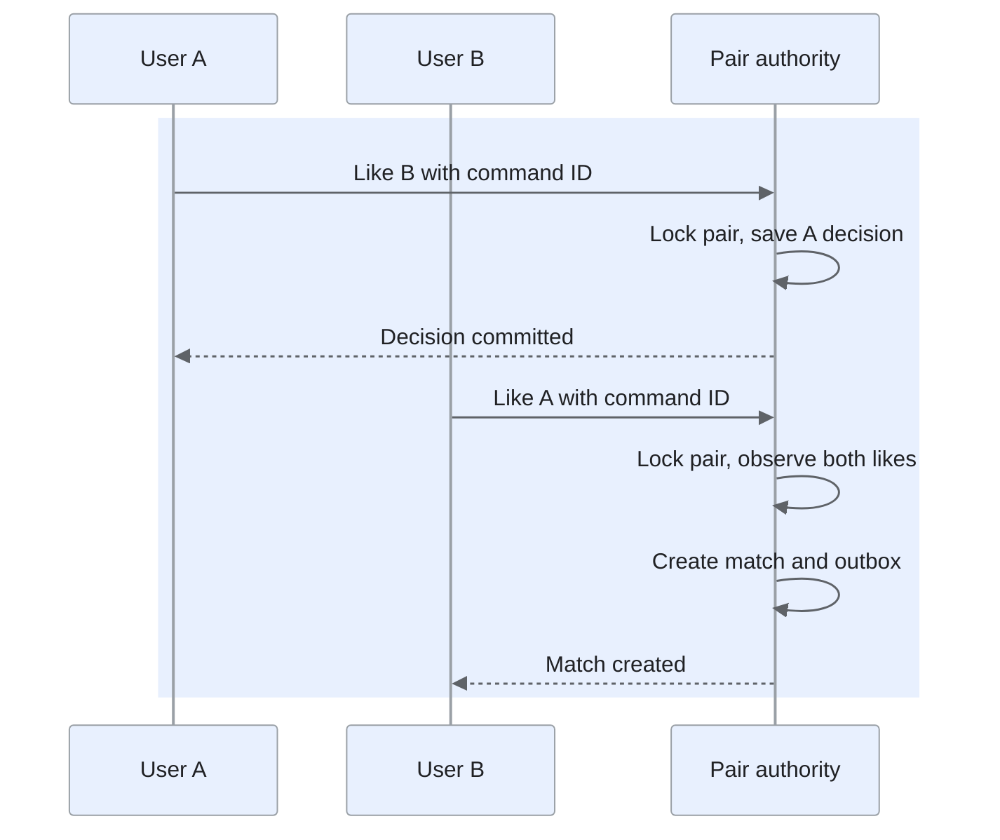

A Tinder-style service for discovering nearby profiles, recording likes and passes, creating mutual matches and messaging matched users.

<!--more-->

## Problem

A user browses nearby profiles and decides whether to like or pass on each one. When two users like each other, the service creates a match and lets them start a conversation.
The main engineering challenges are serving a relevant feed quickly, detecting mutual likes under concurrent requests and keeping match permissions consistent with chat. Feed ranking can tolerate some staleness; a confirmed swipe, match or unmatch needs a durable outcome.

## Requirements

### Functional requirements

- **Manage a profile.** Edit profile details, preferences and photos; control whether the profile is discoverable.

- **Browse nearby profiles.** Return a ranked feed within the user's distance, age and preference filters, excluding profiles already swiped on.

- **Like or pass.** Record one decision for each user pair and create a match when both decisions are likes.

- **Chat after matching.** Deliver ordered messages, retain conversation history and synchronize across devices.

- **Unmatch or report.** End the conversation, remove the pair from discovery and submit a report for review.

### Non-functional requirements

- **Scale:** 20M daily active users and 2B swipes/day; plan for 50K swipes/s at peak.

- **Latency:** P95 below 500ms for a feed response and 200ms for swipe processing in the serving region.

- **Availability:** 99.9% for accepting swipes and retrieving existing matches.

- **Consistency:** acknowledge swipes after commit; create one match per eligible pair; serialize unmatching with message acceptance.

- **Freshness:** refresh candidate pools within five minutes; apply committed pair decisions and blocks during the final feed check.

- **Privacy:** authorize every conversation request, restrict access to precise coordinates and expose approximate distance in the feed.

## Back-of-the-envelope calculations

- **Swipe load:** 2B / 86,400 ≈ 23K swipes/s average; a 2× peak is about 46K, rounded to 50K.

- **Swipe storage:** at 100 bytes per decision, 2B/day produces 200GB/day before indexes, replicas and transaction overhead.

- **Feed load:** assuming ten feed requests per active user per day, 20M × 10 / 86,400 ≈ 2.3K requests/s average.

- **Exclusion cache:** a Bloom filter for 10K IDs at 0.1% false positives uses about 18KB; 20M such filters use 360GB before [Redis](/designs/tech-redis/) and replication overhead. Capacity grows with history.

Match and chat load should be sized from observed mutual-like and messaging rates; two independent like probabilities do not describe real user behavior.

## Core entities

```protobuf
message Profile {
  string user_id;
  string display_name;
  string birth_date;             // Derive age when applying preferences
  repeated string photo_ids;
  Preferences preferences;
  string visibility;
  uint64 version;
}

message Preferences {
  uint32 minimum_age;
  uint32 maximum_age;
  uint32 maximum_distance_km;
  repeated string interested_in;
}

message Pair {
  string user_low_id;             // Canonical ordered pair: database key
  string user_high_id;
  string low_user_decision;       // LIKE, PASS or unset
  string high_user_decision;
  string state;                  // UNMATCHED, MATCHED or CLOSED
  string match_id;
  uint64 version;
  uint64 last_message_sequence;
}

message SwipeCommand {
  string actor_id;
  string client_swipe_id;         // Retry identity; bound to target and decision
  string target_id;
  string decision;
}

message Message {
  string match_id;
  uint64 sequence;               // Assigned by the pair's transaction
  string client_message_id;
  string sender_id;
  string body;
  google.protobuf.Timestamp sent_at;
}

message Report {
  string report_id;
  string reporter_id;
  string target_id;
  string category;
  string review_status;
}

```

Both directions of a swipe belong to the same `Pair` record. `CLOSED` retains the unmatch or block decision so delayed events cannot recreate the conversation. Precise location is stored separately from the public profile with restricted access.

## API

```yaml
GET /v1/feed:
  query: {cursor: string, limit: integer}
  result: {profiles: array, next_cursor: string, feed_version: string}

POST /v1/swipes:
  body: {target_id: string, decision: LIKE_or_PASS, client_swipe_id: string}
  result: {recorded: boolean, is_match: boolean, match_id: string}
  errors: [400_invalid_decision, 409_reused_id_with_different_body, 503_unavailable]

GET /v1/matches:
  query: {cursor: string, limit: integer}
  result: {matches: array, next_cursor: string}

POST /v1/matches/{match_id}/messages:
  body: {client_message_id: string, body: string}
  result: {sequence: integer, sent_at: timestamp}
  errors: [403_inactive_match, 409_reused_message_id, 429_rate_limit]

GET /v1/matches/{match_id}/messages:
  query: {after_sequence: integer, limit: integer}
  result: {messages: array, last_sequence: integer}

POST /v1/matches/{match_id}/unmatch:
  result: {state: CLOSED}

POST /v1/reports:
  body: {target_id: string, category: string, details: string}
  result: {report_id: string}

```

Authentication supplies the actor's user ID. Profile and media-upload endpoints validate ownership; photos use scoped object-storage upload URLs and become visible after processing completes.

## High-level design

Feed generation uses location-based candidate pools and cached ranking features. The swipe and chat services route each pair to one durable shard, which serializes decisions, match state and message acceptance. Committed events update feed exclusions, match lists and WebSocket delivery.


```mermaid
%%{init: {'theme':'base','themeVariables':{'primaryColor':'#e8f0fe','primaryTextColor':'#202124','primaryBorderColor':'#9aa0a6','lineColor':'#5f6368','secondaryColor':'#e6f4ea','tertiaryColor':'#fef7e0','actorBkg':'#e8f0fe','actorBorder':'#9aa0a6','actorTextColor':'#202124','noteBkgColor':'#fef7e0','noteTextColor':'#202124','noteBorderColor':'#9aa0a6','signalColor':'#5f6368','signalTextColor':'#202124','labelBoxBkgColor':'#fef7e0','labelBoxBorderColor':'#9aa0a6'}}}%%
flowchart TB
  U[Web or mobile client] -->|Authenticated requests| G[API gateway]
  G -->|Discovery| F[Feed service]
  G -->|Swipes and unmatches| S[Pair service]
  G -->|Messages and reconnects| C[Chat service]
  F -->|Candidate pools and features| R[(Redis)]
  F -->|Exact eligibility checks| P[(PostgreSQL shards)]
  S -->|Pair transactions| P
  C -->|Message acceptance| P
  P -->|Committed outbox| K[Event stream]
  K -->|Refresh exclusions and lists| R
  K -->|Deliver messages| W[WebSocket gateways]
  W -->|Live updates| U
  K -->|Build message history| H[(Cassandra)]
  B[Candidate builder] -->|Published pools| R
  B -->|Spatial profile queries| L[(Location index)]
classDef request fill:#e8f0fe,stroke:#9aa0a6,color:#202124;
classDef data fill:#e6f4ea,stroke:#9aa0a6,color:#202124;
classDef control fill:#fef7e0,stroke:#9aa0a6,color:#202124;
class U,G,F,S,C,W request;
class R,P,K,H,B,L data;

```
## Storage

- **[PostgreSQL](/designs/tech-postgresql/):** profile and preference records use `user_id`; pair shards use `(user_low_id, user_high_id)`. Each pair transaction locks its row, applies a swipe or unmatch, records the command outcome and writes outbox events. Unique command keys return the same committed result on retries. Pair routing uses a stable hash of both IDs, so two users' concurrent swipes reach the same shard.

- **Location index:** region-partitioned PostgreSQL with PostGIS supports radius queries and exact distance checks using a spatial index. [ST_DWithin](https://postgis.net/docs/ST_DWithin.html) provides the radius predicate. Redis caches candidate IDs by spatial cell; the cell set must cover the requested radius, including boundaries.

- **Redis:** candidate pools, ranking features, exclusion accelerators and connection presence. These can be rebuilt from durable records. Final eligibility reads the authoritative pair and profile state when freshness affects visibility or permissions.

- **[Cassandra](/designs/tech-apache-cassandra/):** asynchronous message-history projection, partitioned by `(match_id, time_bucket)` and ordered by message sequence. The accepted-message log and outbox remain durable in PostgreSQL until projection is verified; the API merges a recent unprojected tail when necessary.

- **Object storage and CDN:** original photos and processed variants live in object storage; the CDN serves approved variants. Private media uses access-scoped URLs, and profile deletion invalidates the corresponding versions.

Cross-pair queries group IDs by shard and issue bounded parallel batches. Shard migrations preserve the pair's routing version and drain old writers before transferring ownership.

## From request to response

### Swipe and match flow


```mermaid
%%{init: {'theme':'base','themeVariables':{'primaryColor':'#e8f0fe','primaryTextColor':'#202124','primaryBorderColor':'#9aa0a6','lineColor':'#5f6368','secondaryColor':'#e6f4ea','tertiaryColor':'#fef7e0','actorBkg':'#e8f0fe','actorBorder':'#9aa0a6','actorTextColor':'#202124','noteBkgColor':'#fef7e0','noteTextColor':'#202124','noteBorderColor':'#9aa0a6','signalColor':'#5f6368','signalTextColor':'#202124','labelBoxBkgColor':'#fef7e0','labelBoxBorderColor':'#9aa0a6'}}}%%
sequenceDiagram
  participant U as User client
  participant A as Pair service
  participant D as Pair database
  participant E as Event consumers
  rect rgb(254, 247, 224)
    U->>A: Like target and command ID
    A->>D: Lock canonical pair, write actor decision
    D->>D: If mutually eligible likes, create one match and outbox
    D-->>A: Committed decision and optional match
    A-->>U: Recorded result
  end
  rect rgb(230, 244, 234)
    D-->>E: Versioned match and exclusion events
    E-->>U: WebSocket or push update
  end

```

Both users' commands route to the same canonical pair authority, so the later locked transaction observes the earlier committed like. The match is durable before notification; a missed live update is recovered from match state on reconnect.

### Browsing the feed

The feed service loads the user's preferences and current location, selects candidate cells covering the requested radius and fetches a bounded pool of profile IDs. It filters by mutual preferences, current visibility, distance and pair decisions, then ranks the remaining profiles.


```mermaid
%%{init: {'theme':'base','themeVariables':{'primaryColor':'#e8f0fe','primaryTextColor':'#202124','primaryBorderColor':'#9aa0a6','lineColor':'#5f6368','secondaryColor':'#e6f4ea','tertiaryColor':'#fef7e0','actorBkg':'#e8f0fe','actorBorder':'#9aa0a6','actorTextColor':'#202124','noteBkgColor':'#fef7e0','noteTextColor':'#202124','noteBorderColor':'#9aa0a6','signalColor':'#5f6368','signalTextColor':'#202124','labelBoxBkgColor':'#fef7e0','labelBoxBorderColor':'#9aa0a6'}}}%%
flowchart TB
  A[Preferences and location] --> B[Nearby candidate pools]
  B --> C[Cached exclusion filter]
  C --> D[Batch exact profile and pair checks]
  D --> E[Rank eligible profiles]
  E --> F[Return a versioned page]
classDef request fill:#e8f0fe,stroke:#9aa0a6,color:#202124;
classDef data fill:#e6f4ea,stroke:#9aa0a6,color:#202124;
classDef control fill:#fef7e0,stroke:#9aa0a6,color:#202124;
class A,E,F request;
class B data;
class C,D control;

```

Pagination pins the candidate-pool version and remembers recently delivered IDs. Profiles already committed as liked, passed, blocked or unmatched are removed in the final check. A profile included in an earlier response may still be visible on a second device until that device receives the updated decision.
Repeated feature reads and scattered pair checks make this path expensive. Candidate precomputation and batched membership checks reduce that work; the feed deep dive describes the coverage and freshness trade-offs.

### Recording a swipe and detecting a match

The pair service validates the target and decision, derives the canonical pair key and starts a transaction on that shard. It inserts an empty pair row if needed, locks the row, checks the command identity and writes the actor's decision. If both decisions are likes and the pair is eligible, it creates the match and its outbox event in the same transaction.
After commit, the API returns the recorded result. Event consumers update each user's match list and exclusion cache, then send WebSocket or push notifications. Reconnecting clients fetch durable match state, so a missed notification does not lose a match.

### Sending a message

The chat service validates membership and locks the pair row. For an active match, it assigns the next sequence, stores the message and its outbox event, then commits before returning success. A repeated `client_message_id` returns the existing result.
The outbox consumer delivers the message to connected devices and projects it into history storage. Recipients deduplicate by `(match_id, sequence)` and request missing sequences after reconnecting. Delivery and read receipts are separate from the durable acceptance response.

### Unmatching and reporting

Unmatching locks the same pair record used for message acceptance and changes it to `CLOSED`. A message committed before that transaction remains part of the retained history; a later message request is rejected. The close event disconnects live conversation views and updates discovery exclusions.
Reports are retained in restricted review storage. Moderation decisions update profile eligibility and pair restrictions, with an audit trail for review. Report counts alone are insufficient for an automatic account ban.

## Deep dives

### How do simultaneous likes create exactly one match?

**Problem.** If A's swipe and B's swipe are stored in separate user partitions, two handlers can each read an older inverse decision and miss the mutual like. Sending both operations through one stateless coordinator does not make writes to different partitions atomic.

- **Independent writes with reconciliation:** Write each user's decision and check the inverse afterward. User-partition throughput is high, but simultaneous reads can both miss the reciprocal like and require delayed repair.

- **Cassandra pair partition with LWT:** Co-locate pair decisions and use a conditional version transition. Distributed storage is retained; consensus rounds and contention retries add latency and need a bounded policy.

- **PostgreSQL pair transaction — recommended:** Lock one canonical pair row and commit decisions, match identity, command outcome and outbox together. Mutual likes serialize directly; pair-shard routing and writer fencing become explicit operational requirements.
**Recommendation: use the PostgreSQL pair transaction.** [Row locking](https://www.postgresql.org/docs/current/explicit-locking.html#LOCKING-ROWS) serializes concurrent updates to the pair. A later transaction sees the earlier committed decision and creates the match when both are likes. The design needs one recoverable match transition and messages/unmatches already share pair authority. We accept pair-row contention and shard ownership in exchange for an account-independent transactional boundary that covers the entire state change.

```python
# One transaction on the pair's shard.
ensure_pair_exists(pair_key)
pair = select_pair_for_update(pair_key)
if command_outcome_exists(actor_id, client_swipe_id):
    return stored_outcome
validate_pair_is_eligible(pair)
apply_decision(pair, actor_id, decision)
if pair.both_like() and pair.state == "UNMATCHED":
    pair.create_match()
    append_outbox("MatchCreated", pair.match_id)
store_command_outcome(actor_id, client_swipe_id, pair.result())
commit()

```

The first transaction may return no match; the second creates it and notifies both users. A crash before commit leaves a retryable command. A crash after commit returns the stored result on retry and leaves the outbox event available for delivery. Command identity is retained for the documented retry window.
Unmatching closes the pair permanently under the current product policy. Re-matching would need a new consent generation and a new conversation identity, rather than replaying old likes. Track pair-lock wait, retry rate, outbox age and reconciliation mismatches.
**The simultaneous-like transaction.** Canonicalize A/B as `(min_id, max_id)` and route both swipes to the same pair shard. Create the pair row through a unique-key insert if necessary, then lock it. A's transaction writes A=LIKE and commits. B's waiting transaction reads that state, writes B=LIKE, creates one match and commits its notification outbox.


```mermaid
%%{init: {'theme':'base','themeVariables':{'primaryColor':'#e8f0fe','primaryTextColor':'#202124','primaryBorderColor':'#9aa0a6','lineColor':'#5f6368','secondaryColor':'#e6f4ea','tertiaryColor':'#fef7e0','actorBkg':'#e8f0fe','actorBorder':'#9aa0a6','actorTextColor':'#202124','noteBkgColor':'#fef7e0','noteTextColor':'#202124','noteBorderColor':'#9aa0a6','signalColor':'#5f6368','signalTextColor':'#202124','labelBoxBkgColor':'#fef7e0','labelBoxBorderColor':'#9aa0a6'}}}%%
sequenceDiagram
  participant A as User A
  participant B as User B
  participant P as Pair authority
  rect rgb(232, 240, 254)
  A->>P: Like B with command ID
  P->>P: Lock pair, save A decision
  P-->>A: Decision committed
  B->>P: Like A with command ID
  P->>P: Lock pair, observe both likes
  P->>P: Create match and outbox
  P-->>B: Match created
  end

```

Retrying either command reads its retained outcome. Match delivery may repeat, but the match identity remains one. Profile blocking/eligibility changes use versions checked under the selected pair policy; new consent after an unmatch requires an explicit new generation.

### How do we build a nearby feed efficiently?

**Problem.** A full radius query with preference joins and ranking for every request becomes expensive in dense areas. Precomputed pools reduce that load, but can miss eligible users near boundaries or omit lower-ranked candidates.

- **Direct PostGIS queries:** Run indexed radius and preference queries per request. Coverage and distance semantics are clear, but dense regions and repeated ranking joins raise serving cost.

- **Precomputed spatial-cell pools — recommended:** Publish candidate IDs for all cells covering the radius, oversample, then verify current distance and eligibility. Repeated lookup work falls; stale pools and incomplete boundary coverage can lower recall.

- **Distributed spatial index:** Partition a frequently changing location index across owners. Capacity grows horizontally, but movement, neighborhood fan-out and ownership changes complicate recovery and query coverage.
**Recommendation: use indexed regional spatial storage and precomputed Redis pools.** Select all cells intersecting the radius, oversample candidates from those pools, then verify actual distance and preferences. A fixed 3×3 geohash neighborhood does not cover an arbitrary 50km radius. Regional candidate reuse is valuable at discovery volume, while final pair/profile checks protect visibility. We accept pool-refresh lag and oversampling work, testing boundary and dense-region recall rather than assuming a fixed cell neighborhood covers every radius.
Candidate builders publish versioned pools atomically. Rebuilds include active profiles and allocate exposure for new users; pagination reads one version. In sparse areas, offer an explicit distance change instead of silently changing age or preference filters. Dense areas use larger or rotating pools to avoid permanently hiding the same profiles.
Location changes select the new cell coverage immediately. Profile removal and safety restrictions use current eligibility checks even when the pool is several minutes old. Measure radius coverage, eligible-pool size, refresh lag and exposure distribution.
**Radius coverage and pool generation.** A request for users within 20 km first selects every cell intersecting that circle, including boundary cells. Pools provide candidate IDs; exact distance and current preferences remove the extra area covered by whole cells.
In a dense city, each cell pool is a sampled/rotating eligible set rather than an unexplained permanent popularity cutoff. Publish pool generation G with a source cutoff and exposure policy. A feed session pins G so refreshes do not repeatedly show the first high-ranked profiles while the user paginates.
Batch profile and pair checks under a candidate budget, then fetch another bounded batch if many candidates were excluded. A sparse result invites an explicit distance change. Changing location immediately selects new cell coverage; stale cells do not override the user's current request or bypass safety restrictions.

### How do we exclude earlier swipes without loading the entire history?

**Problem.** A heavy user's swipe history can contain many thousands of IDs. Fetching and transmitting the complete set for every feed page adds memory and network work.

- **Exact candidate membership checks — recommended:** Batch only the candidate pair IDs on their authoritative shards. Correctness work is proportional to the current page; shard fan-out and database latency remain bounded serving costs.

- **Redis exact history sets:** Cache all retained decisions for quick membership. Reads are fast, but memory grows with heavy-user histories and stale entries need reconciliation.

- **Bloom-filter acceleration:** Use a compact probabilistic history representation before exact checks. Memory is smaller; false positives can hide unseen profiles, while an incomplete or stale filter can miss a recorded decision.
**Recommendation: batch exact checks, with a Bloom filter as an optional accelerator.** Use [Redis Bloom filters](https://redis.io/docs/latest/develop/data-types/probabilistic/bloom-filter/) to cheaply discard likely repeats, then check surviving candidates against current pair records. This keeps database work proportional to the candidate batch. Exclusions affect user-visible correctness and permissions, so exact checks remain final. We accept bounded shard reads and optionally use a measured Bloom-filter accelerator, tracking coverage loss and freshness rather than calling it an exact history.
A complete Bloom filter has no false negatives for inserted IDs. That property does not cover dropped updates, resets or stale cache replicas. Rebuild from a consistent checkpoint, replay newer outbox updates into the replacement and swap versions after catching up.
Retain compact pair decisions for as long as the product promises to exclude earlier swipes. A 90-day event-log TTL can remove detailed history while keeping those decisions. At a fixed false-positive rate, ten times the filter capacity needs approximately ten times the bits; rebuilding the same set does not inherently eliminate false positives.
Monitor filter capacity, update lag, exact-check load and repeated-profile reports. If the accelerator is unavailable, bounded exact checks remain the fallback.
**Candidate-scoped history checks.** Instead of transferring 100,000 previous swipe IDs, a page might retrieve 200 candidates and batch-check their pair records grouped by shard. The response work remains proportional to 200 candidates, with bounded shard concurrency.
A complete Bloom filter can skip likely repeats cheaply, but false positives can hide unseen profiles. If exposure completeness matters, verify positives exactly too; otherwise declare and measure the tolerated suppression. Surviving candidates still receive exact checks because an incomplete or lagging filter can miss recent swipes.
Build a replacement filter from a consistent pair checkpoint, replay changes after that cutoff, then atomically switch generations. Keep previous decisions as compact authoritative rows even after detailed event history expires. Cache loss falls back to bounded exact checks rather than showing repeat profiles or loading the entire history.

### How should profile ranking evolve?

**Problem.** Distance alone gives a relevant area, but users still need a useful ordering within it. Ranking solely by popularity concentrates exposure and provides weak evidence of mutual compatibility.

- **Activity and completeness baseline:** Order eligible profiles using transparent freshness and completion features. Operations and explanations are simple, but mutual interest is weakly represented.

- **Versioned multi-signal ranker — recommended:** Combine normalized activity, interests, reciprocal context and bounded exploration. More useful ordering is possible without a training pipeline; manual weights still require product-quality evaluation and exposure monitoring.

- **Learned retrieval and ranking:** Estimate compatibility from impression-linked interactions. Personalization can improve with mature labels, but exposure bias, model/index compatibility and safety controls add substantial release work.
**Recommendation: start with the multi-signal ranker and evaluate learned ranking against it.** Score only eligible candidates, include exploration for new profiles and measure mutual matches and useful conversations alongside exposure coverage and safety reports. Start with a measurable multi-signal baseline while independent interaction evidence accumulates. We accept less expressive personalization initially, promoting learned ranking only when mutual matches and useful conversations improve without concentrating exposure or weakening safety.
Training uses actual displayed profiles and later outcomes so an unseen profile is not treated as a rejection. Keep feature and model versions in impression events. Cold-start users rely on declared preferences and location; new profiles receive measured exploration exposure.
Evaluate by market and activity cohort with controlled experiments. Ranking changes preserve explicit user preferences and moderation restrictions. This is the proposed ranking approach; it does not describe Tinder's current production algorithm.
**Eligibility, scoring and exploration.** Apply age, distance, reciprocity, safety and prior-decision filters before scoring. Normalize the remaining activity/interest features and score a bounded candidate set under a pinned policy version. Add controlled exploration slots for new or underexposed profiles.
Log the actual displayed profile, position, model/features and later outcomes. A user who never saw a profile supplied no rejection label for it. Evaluate mutual matches and subsequent useful conversations, not only one-sided likes, and include exposure/safety guardrails.
A learned model can rerank the same eligible candidate set once it beats the baseline under controlled tests. Missing optional features use trained defaults; unavailable required eligibility checks reduce the result set. Model changes do not broaden user preferences or restore profiles excluded by moderation.
