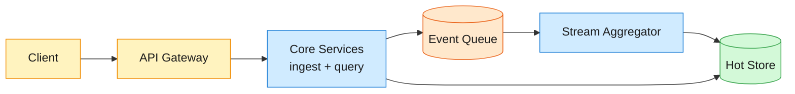
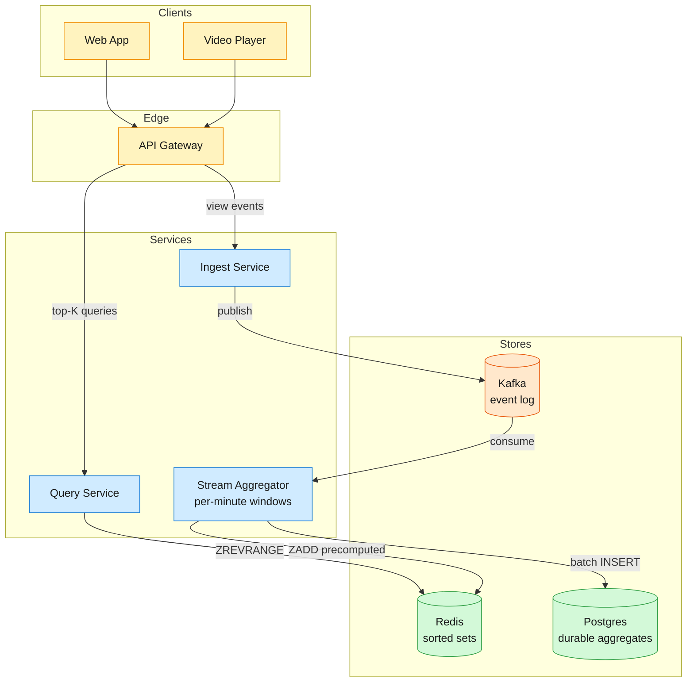

A video platform ingests view events at massive scale — 70 billion per day across billions of videos — and must surface the most-viewed videos per time window at sub-50ms read latency.

<!--more-->

## 1. Problem

A video platform ingests view events at massive scale — 70 billion per day across billions of videos — and must surface the most-viewed videos per time window at sub-50ms read latency. The hard tension is that exact counting requires tens of GB of memory and per-event database writes would collapse at 700K+ writes/sec, yet users expect near-real-time rankings that reflect what is trending now, not an hour ago.



## 2. Requirements

**Functional**

- FR1: View top K most-viewed videos for the past hour, day, month, and all-time.
- FR2: View top K videos filtered by category or region.
- FR3: Ingest view events at high throughput for counting.

**Non-functional**

- NFR1: Ranking delay no more than 1 minute from view occurrence.
- NFR2: Read latency under 50ms for top-K queries.
- NFR3: Write path absorbs sustained 700K events/sec, peaks above 1M/sec.
- NFR4: Memory footprint fits commodity hardware — not linear in total video count.

*Out of scope: arbitrary time ranges, per-user personalized rankings, bot detection, ad placement, video recommendations.*

## 3. Back of the envelope

- **Write peak:** 70B views/day ÷ 86.4K s × 5 (daily spike) ≈ 4M peak writes/s → two orders of magnitude beyond what a single-row counter update can absorb.
- **Naive storage:** 3.6B videos × 16 bytes (8-byte id + 8-byte count) ≈ 58 GB → fits in memory of a modest cluster; raw storage is not the constraint.
- **Read budget:** 50ms p99 leaves maybe 10ms for data retrieval → a naive scan of raw event tables would touch billions of rows and blow the budget.

## 4. Entities

```
Video {
  video_id:    uuid    PK
  title:       string
  category:    string
  region:      string
  upload_time: timestamp
}

ViewEvent {
  event_id:    uuid    PK
  video_id:    uuid    FK
  viewer_id:   string
  timestamp:   timestamp
  category:    string    ← denormalized for dimensional aggregation
  region:      string    ← denormalized for dimensional aggregation
}

WindowAggregate {
  window_key:  string   PK   ← e.g. "1h:2026-07-01T12:00:00Z:music:us"
  video_id:    uuid     CK
  count:       integer
}
```

### API

- `POST /events/view` — ingest a view event, returns `202 Accepted`
- `GET /top-k?window={1h|1d|1m|all}&k={1..1000}` — top K videos for a time window
- `GET /top-k?window={1h|1d|1m|all}&k={1..1000}&category={name}` — top K by category
- `GET /top-k?window={1h|1d|1m|all}&k={1..1000}&region={code}` — top K by region
- `GET /videos/{id}/rank?window={1h|1d|1m|all}` — current rank of a specific video

## 5. High-Level Design



#### FR1: View top K most-viewed videos (all windows)

**Components:** Player → API Gateway → Ingest Service → Kafka → Stream Aggregator → Redis → Query Service.

**Flow:**

1. Player fires `POST /events/view` with `{video_id, viewer_id, timestamp, category, region}`.
1. Ingest Service validates, assigns a monotonic event id, and publishes to Kafka topic `view-events` partitioned by `video_id`.
1. Stream Aggregator consumes from Kafka in per-minute micro-batches, aggregates counts per `(video_id, window, category, region)`.
1. For each time window, the aggregator writes the precomputed top-K list to Redis as a sorted set: `ZADD topk:{window}:{category}:{region} <score> <video_id>`.
1. Query Service responds to `GET /top-k?window=1h&k=100` with `ZREVRANGE topk:1h::: 0 99 WITHSCORES`, returning video IDs and counts.

**Design consideration:** The sorted set stores absolute counts as scores, overwritten every aggregation cycle rather than incremented. This means Redis is a pure cache — the aggregator's in-memory state and the Kafka log are the canonical sources. If Redis restarts, the aggregator repopulates it from its own state on the next cycle. Keeping the sorted set trimmed to the top 1000 entries bounds memory per window.

#### FR2: View top K by category or region

**Components:** (same write path) → Stream Aggregator maintains per-dimension sketches → Redis → Query Service.

**Flow:**

1. View events carry `category` and `region` denormalized at ingest (copied from the video metadata cache).
1. Stream Aggregator maintains separate aggregation state per `(video_id, window, category)` and `(video_id, window, region)`.
1. Each dimension's top-K is written to its own Redis sorted set: `topk:1h:music:`, `topk:1h::us`.
1. Query Service resolves `GET /top-k?window=1h&k=50&category=music` to the corresponding sorted set key and returns the range.

**Design consideration:** Dimensional aggregation multiplies state by the cardinality of each dimension (100 categories × 200 regions = 20K key spaces per window). At 50M distinct videos, storing per-dimension aggregates for every video would exhaust memory. Instead, the aggregator applies a threshold: only videos crossing a minimum count per dimension get persisted. This is a form of early pruning — the bottom 99% of videos never appear in any dimension's top-K, so their per-dimension state is dropped at the aggregator.

#### FR3: Ingest view events at high throughput

**Components:** Player → API Gateway → Ingest Service → Kafka.

**Flow:**

1. Player sends view event as a fire-and-forget POST. The gateway returns `202 Accepted` immediately — the event is durably written to Kafka before the response.
1. Ingest Service batches writes to Kafka: accumulates events for up to 10ms or 1000 events, then flushes. At 1M events/sec, this is roughly one flush per 10K-event batch.
1. Kafka partitions by `video_id` so all views of the same video land on the same partition, enabling the aggregator to maintain per-video state locally without cross-partition coordination.

**Design consideration:** The ingest path is deliberately decoupled from ranking. The aggregator processes events asynchronously on its own cadence (every 30s for the 1h window, every 60s for larger windows). This means a view just submitted may not appear in rankings for up to 60 seconds — acceptable per NFR1's 1-minute delay target. The trade-off is that the write path never blocks on aggregation; under load spikes, Kafka absorbs the backlog and the aggregator catches up.

## 6. Deep dives

### DD1: Scaling reads — cache vs precompute

**Problem.** A top-K query scanning raw event tables would touch billions of rows. At 50ms p99 latency, the query has a ~10ms data-fetch budget — far too little for an on-demand scan. We need precomputed answers that are always ready, but precomputing naively means stale rankings between recomputation cycles.

**Approach 1: Cache query results with a TTL**

Query the aggregate table on demand, cache the result in Redis with a 30s TTL. The first request after TTL expiry recomputes and repopulates.

```javascript
GET topk:1h::
→ miss → SELECT video_id, SUM(count) FROM window_aggregate
          WHERE window_key LIKE '1h:%'
          GROUP BY video_id ORDER BY SUM(count) DESC LIMIT 100
→ SET topk:1h:: <result> EX 30
→ return result
```

**Challenges:** Cache stampede. When the TTL expires during a traffic spike, all concurrent requests hit the database simultaneously with the same expensive query, multiplying load by fan-in. At peak read rates (100K QPS for a trending page), even a 1-second stampede window saturates the database.

**Approach 2: Precompute on a cron cycle**

A background worker recomputes top-K for every active window on a fixed schedule (every 30s) and writes results to Redis, overwriting the previous key. Readers never miss — they always read a precomputed sorted set.

- **Normal path:** Cron runs, queries the aggregate table, writes `ZADD` to Redis, readers hit the sorted set.
- **Stale-data path:** If the cron job is late (backpressure, GC pause), readers see the previous cycle's data. Extend the Redis key TTL to 90s so the stale entry survives a missed cycle.

```sql
-- Cron job (runs every 30s):
SELECT video_id, SUM(count) AS total
FROM window_aggregate
WHERE window_key >= '1h:' || (NOW() - INTERVAL '1 hour')
GROUP BY video_id
ORDER BY total DESC
LIMIT 1000;
-- Write to Redis:
-- ZADD topk:1h:: <total> <video_id> for each row
```

**Decision:** Precompute on a cron cycle. Avoids cache stampede entirely because writes are push-based and decoupled from reads. The 30s staleness window is well within the 1-minute NFR. The cron job's database query gets cheaper as we add pre-aggregation at coarser grains (see DD3).

**Rationale:** The fundamental insight is that top-K reads are highly predictable — every user asking for the 1h trending list wants the same answer. Precomputing once and serving many times is the correct shape for this workload. Cache-aside (Approach 1) works for sparse, long-tail queries where precomputing everything is wasteful; top-K is the opposite — dense, concentrated, every key gets read heavily.

**Edge cases:**

- **Empty window:** A brand-new hour with zero views returns an empty list. The cron job writes an empty sorted set rather than skipping the window, so readers get `[]` not an error.
- **Cron job crash:** Redis keys carry a 90s TTL. If the cron job is down for 2 minutes, keys expire and readers get empty results — better than serving hours-old data as if it were current. A health-check monitor alerts on missing keys.

### DD2: Scaling writes — sharding and batching

**Problem.** At 70B events/day, the write path must absorb ~4M peak writes/sec. A single database row updated per event would hit ~10K row-writes/sec at best — two orders of magnitude short. The write path must batch aggressively, and the aggregation state must be partitioned so no single node becomes the bottleneck.

**Approach 1: Shard the aggregate store by video ID**

Partition the aggregate database across N shards, each owning a subset of videos. Events for a given video always route to the same shard (Kafka partitioning by `video_id` ensures this). To answer a top-K query, query each shard for its local top-K and merge the results — the global top-K is guaranteed to be among the union of local top-Ks.

```javascript
-- Per shard:
SELECT video_id, SUM(count) AS total
FROM window_aggregate_shard_3
WHERE window_key >= ...
GROUP BY video_id ORDER BY total DESC LIMIT 1000;
-- Merge: take the top 1000 from the union of all shard results.
```

**Challenges:** At 4M writes/sec, even N=16 shards means 250K writes/sec per shard — still above what a relational database handles for point-update-in-place. The bottleneck shifts from total throughput to per-row update rate.

**Approach 2: Micro-batch at ingest, bulk-write aggregates**

Instead of updating a counter per event, the Stream Aggregator collects events into per-minute micro-batches and emits a single aggregate row per `(video_id, window_key)`. A batch of 10K events for one video becomes one `INSERT … ON CONFLICT … DO UPDATE SET count = count + <batch_total>` — reducing write operations by 10,000×.

```sql
INSERT INTO window_aggregate (window_key, video_id, count)
VALUES ('1h:2026-07-01T12:00:00Z', 'vid_123', 847)
ON CONFLICT (window_key, video_id)
DO UPDATE SET count = window_aggregate.count + 847;
```

**Approach 3: In-memory aggregation with periodic flush**

The Stream Aggregator maintains per-video counts entirely in memory (RocksDB-backed for durability across restarts). It never writes intermediate counts to the database — only the final precomputed top-K sorted set to Redis every 30s. The database receives hourly checkpoint snapshots for disaster recovery, not for the read path.

```javascript
-- Hourly checkpoint only (not per-query):
COPY window_aggregate_snapshot FROM 's3://checkpoints/2026-07-01T12:00:00Z.parquet';
```

- **Normal path:** Aggregator reads from Kafka, accumulates in RocksDB, emits top-K to Redis every 30s. Database is untouched.
- **Recovery path:** Aggregator restarts, restores RocksDB from the last checkpoint + replays Kafka from the checkpointed offset.

**Decision:** Approach 3 (in-memory aggregation + periodic flush). The database's role shrinks to durable checkpointing; the hot path is Kafka → RocksDB → Redis. This keeps the per-event write cost at O(1) in-memory and defers all database writes to a background hourly batch.

**Rationale:** A relational database is the wrong store for per-event aggregation at 4M writes/sec — it is designed for indexed point queries and transactions, not high-frequency counter increments. RocksDB (LSM-tree, write-optimized) absorbs the write volume efficiently because it turns random counter updates into sequential sorted-string-table flushes. Redis sorted sets handle the read path at O(log N) per query, well within the 50ms budget for k=1000. Kafka serves as the durable event log and replay source, so no event is lost even if the aggregator crashes mid-cycle.

**Edge cases:**

- **Late-arriving events:** Events arriving after the window has closed (network delay, mobile offline) are handled by the watermark. The aggregator allows 30s of lateness: events with `timestamp < now() - 30s` are dropped for the current window but counted in the next hourly checkpoint reconciliation.
- **RocksDB state growth:** State grows with distinct video count (3.6B). RocksDB's compaction keeps the LSM-tree balanced; videos with zero views in the current window are dropped from memory at the next checkpoint.

### DD3: Sliding windows — balancing precision and cost

**Problem.** Tumbling windows (fixed hour/day/month boundaries) are simple but produce jarring ranking changes at window boundaries. A sliding window (past 60 minutes, updated every minute) gives smoother rankings but multiplies state by the slide count — a 1h window with 1-minute slides requires maintaining 60 sub-windows per video, each with its own aggregate.

**Approach 1: Full sliding — maintain per-minute buckets, sum on query**

Store aggregate counts per `(video_id, minute_bucket)`. On query, sum the last 60 buckets per video. This gives exact sliding-window counts at the cost of 60× storage.

```javascript
-- Storage: one row per (video_id, minute) — 60× blowup
-- Query:
SELECT video_id, SUM(count) FROM minute_aggregate
WHERE minute_bucket BETWEEN now() - INTERVAL '60 minutes' AND now()
GROUP BY video_id ORDER BY SUM(count) DESC LIMIT 100;
```

**Challenges:** At 3.6B videos × 60 buckets × 16 bytes = 3.5 TB for just one window. Adding categories and regions multiplies further — infeasible to keep entirely hot.

**Approach 2: Two-pointer incremental update**

Maintain one aggregate per video for the sliding window. Each minute, increment by the new minute's count and decrement by the count from 61 minutes ago. This keeps exactly one aggregate per video regardless of window size.

```javascript
-- Per-minute update:
-- For each active video:
--   window_count += new_minute_count[vid]
--   window_count -= old_minute_count[vid]  (from 61 minutes ago)
-- ZADD topk:sliding:1h <window_count> <vid>
```

- **Normal path:** The aggregator holds a ring buffer of the last 61 per-minute counts per active video (only videos with non-zero counts in the window). Each minute it advances the pointer, reads the retiring bucket, and updates the running total.
- **Storage:** 61 integers per active video. At 10M active videos per hour, this is 10M × 61 × 8 bytes ≈ 4.9 GB — manageable in RocksDB.

**Decision:** Approach 2 (two-pointer) for the 1h sliding window. The storage is bounded by active videos, not total videos, and the per-minute update cost is O(active videos) — roughly 10M increment-decrement operations per minute, well within a single-node throughput.

> [!TIP]
> **Key insight:** The two-pointer method works because view counts are monotonic within the window — we only add, never subtract below zero. A video that had views 61 minutes ago and none since will correctly decrement to zero and drop out of the active set, freeing its ring-buffer slot.

**Rationale:** The two-pointer method's space efficiency comes from tracking only active videos (those with views in the current window), which is typically 0.3% of the total catalog. The ring buffer of per-minute counts also serves as the source for the next coarser grain (hourly tumbling), so we get the sliding window and the hour rollup from the same data structure.

### DD4: Approximation — trading exactness for memory

**Problem.** Even with the optimizations above, exact counting of 3.6B distinct videos requires 58 GB just for the IDs, plus per-video aggregation state. For dimensional breakdowns (categories × regions × windows), exact state exceeds available memory on a single node. We need approximate counting that fits in a few hundred MB and stays within the acceptable error bound for a public ranking display.

**Approach 1: Count-Min Sketch + heavy-hitters heap**

A Count-Min Sketch (CMS) is a 2D array of counters indexed by hash functions. Each view event increments `d` counters (one per hash row). To estimate a video's count, take the minimum across the `d` rows — CMS never underestimates. Pair it with a min-heap of the top `K + δ` candidates: on each increment, query the sketch for the video's current estimate; if it beats the heap's minimum, promote the video into the heap and evict the current minimum.

```python
def add(self, item, weight=1):
    for i in range(self.d):
        j = hash(self.seeds[i], item) % self.w
        self.cells[i][j] += weight

def estimate(self, item):
    return min(self.cells[i][hash(self.seeds[i], item) % self.w]
               for i in range(self.d))
```

- **Space:** With width `w = 2,000,000` and depth `d = 5`, the sketch uses 2M × 5 × 4 bytes = 40 MB, plus the heap for top-1000 (~24 KB).
- **Error bound:** Overestimate by at most `2N/w` with probability `1 - (1/2)^d`. For 500M events/hour, `2 × 500M / 2M = 500` — the sketch overestimates any single video by at most ~500 views, with ~97% confidence.

**Challenges:** CMS tracks frequencies but not identities. The sketch alone cannot answer "which videos are in the top K?" — it needs the separate heap. The heap must be maintained alongside the sketch, and items that fall below the heap's minimum must be evicted, which introduces a second source of error (false negatives from premature eviction).

**Approach 2: Space-Saving algorithm**

Space-Saving maintains a fixed-size map of at most `m` counters, each storing `(item, count, error)`. On each view event: if the item is already tracked, increment its count. If not and the map has fewer than `m` entries, insert it with `count=1, error=0`. If the map is full, evict the item with the smallest count, then insert the new item with `count = min_count + 1` and `error = min_count`, effectively transferring the evicted item's count as error to the new item.

```python
def add(self, item):
    if item in self.counters:
        self.counters[item] = (self.counters[item][0] + 1, self.counters[item][1])
    elif len(self.counters) < self.m:
        self.counters[item] = (1, 0)
    else:
        min_item = min(self.counters, key=lambda x: self.counters[x][0])
        min_count, min_error = self.counters[min_item]
        del self.counters[min_item]
        self.counters[item] = (min_count + 1, min_count)

def query(self, item):
    if item in self.counters:
        count, error = self.counters[item]
        return (count - error, count)  # (lower_bound, upper_bound)
    return (0, 0)
```

- **Space:** `m = 5000` entries × 24 bytes = 120 KB.
- **Guarantee:** Any item with true frequency > `N/m` is guaranteed to be in the monitored set. For 500M events and m=5000, any video with >100K views is guaranteed tracked. The per-item error is bounded by `error` — always ≤ the true count.
- **No separate heap needed:** The monitored set itself is the top-K candidate list, sorted by `count - error` (lower bound) for the final ranking.

**Approach 3: Hybrid — Space-Saving for top-K, CMS for per-video rank lookup**

Maintain Space-Saving for the top-K list displayed to users, and a separate CMS for point queries like "what is the current rank of video X?" Space-Saving gives exact-enough top-K ordering; CMS gives a fast approximate count for any video without the O(m) Space-Saving map lookup.

**Decision:** Space-Saving (Approach 2) for the ranking path; CMS (Approach 1) for the per-video rank lookup path. The two algorithms complement each other: Space-Saving nails the core use case (fast, memory-efficient top-K with identity tracking), and CMS handles the long-tail point query without polluting the monitored set.

**Rationale:** Space-Saving is purpose-built for top-K: it tracks identities natively (no separate heap), gives a bounded per-item error, and guarantees any item above the frequency threshold is tracked. CMS is a better fit for the point-query case because it answers `estimate(any_video_id)` in O(d) time regardless of whether the video is popular. Keeping both lets each algorithm do what it is best at. At m=5000, Space-Saving uses 120 KB — small enough to replicate per category/region/window without exhausting memory.

> [!TIP]
> **Why not keep just the exact sorted set in Redis?** At 3.6B distinct videos, a single Redis sorted set would be ~58 GB. Replicating that per category and region blows up to terabytes. Redis sorted sets are the correct *delivery* format (what the Query Service reads from), but the *aggregation* must use a sub-linear-memory sketch to avoid storing every video's exact count in the hot path.

**Edge cases:**

- **Cold-start ranking:** A brand-new video with a sudden spike may not yet have crossed the Space-Saving insertion threshold. The system falls back to the CMS estimate — if the estimate places it in the top K, it is force-promoted into Space-Saving on the next cycle.
- **Sketch merge for multi-node aggregation:** CMS sketches are mergeable (element-wise addition of the 2D arrays); Space-Saving monitored sets are not. When aggregating across shards, each shard runs Space-Saving locally, then a coordinator merges the top-K lists from all shards by summing CMS-backed counts and re-ranking. The merge is approximate but correct within the CMS error bound.
- **Hash collisions in CMS:** Two different video IDs hashing to the same cells cause mutual overestimation. With `w = 2M`, the collision probability is `1 - (1 - 1/2M)^(3.6B)` ≈ high per-cell, but CMS's `d = 5` independent hash functions make the minimum across rows robust: a collision must hit all 5 rows simultaneously to inflate the estimate, which is exponentially unlikely.

## 7. References

1. [Count-Min Sketch: the art and science of estimating stuff](https://redis.io/blog/count-min-sketch-the-art-and-science-of-estimating-stuff/) — Redis blog.
1. Cormode, G., & Muthukrishnan, S. (2005). ["An Improved Data Stream Summary: The Count-Min Sketch and its Applications"](https://dimacs.rutgers.edu/~graham/pubs/papers/cm-full.pdf). Journal of Computer and System Sciences.
1. Metwally, A., Agrawal, D., & El Abbadi, A. (2005). ["Efficient Computation of Frequent and Top-k Elements in Data Streams"](https://www.cse.ust.hk/~dimitris/CSIT690/readings/space-saving.pdf). ICDT 2005.
1. [YouTube runs on Bigtable](https://cloud.google.com/blog/products/databases/youtube-runs-on-bigtable) — Google Cloud Blog.
1. [Sharded Counters: the problem with counting at scale](https://sujeet.pro/articles/sharded-counters) — Sujeet Jaiswal.
1. [YouTube Hype: a production leaderboard system](https://blog.youtube/news-and-events/youtube-hype/) — YouTube Official Blog.
1. [Flink fault tolerance and checkpointing](https://nightlies.apache.org/flink/flink-docs-stable/docs/learn-flink/fault_tolerance/) — Apache Flink documentation.
