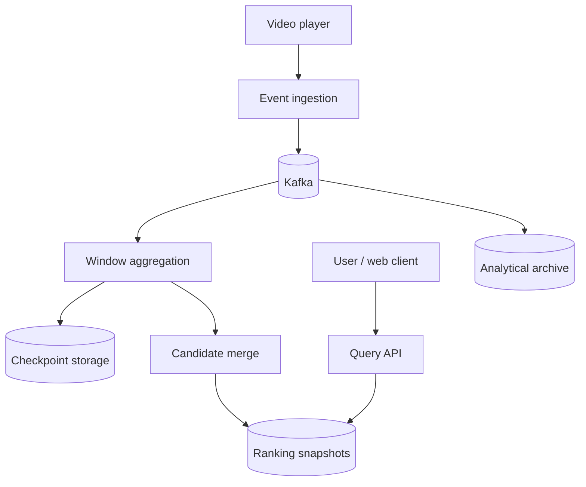
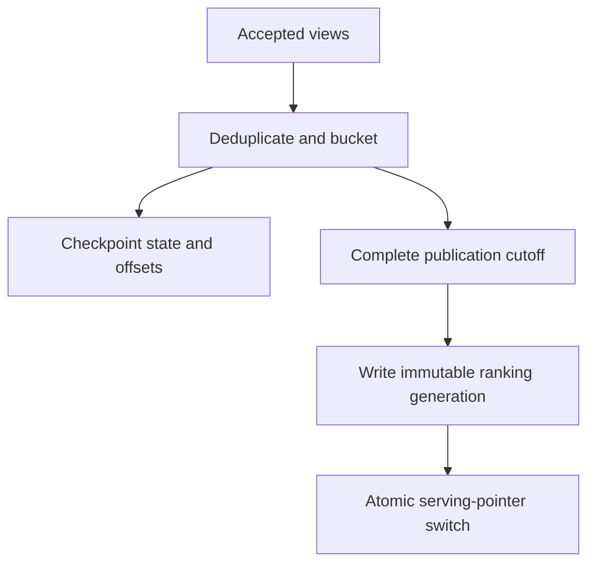

Design of a streaming leaderboard for the most-viewed videos over recent and all-time windows.

<!--more-->

## Problem

Users want to see which videos are popular now. Counting every view is straightforward at small scale, but a popular video can concentrate millions of updates on one counter.

The service accepts view events into a durable log, aggregates them in partitions and publishes precomputed ranking snapshots. Approximate summaries bound the live ranking state; responses identify their freshness and uncertainty.

## Requirements

### Functional requirements

- **Count views:** accept retry-safe events under a defined view-eligibility rule.
- **Rank videos:** return up to 1,000 entries for the past hour, day, 30 days or all time.
- **Filter:** support configured category and viewer-region leaderboards.
- **Inspect counts:** return a video's approximate count where supported.

Arbitrary time ranges, personalized recommendations and view-fraud detection are outside this design.

### Non-functional requirements

Design targets:

- **Throughput:** 810K events/s average and 4M/s peak.
- **Latency:** leaderboard reads p99 below 50 ms.
- **Freshness:** p95 event-to-ranking delay below one minute for on-time events.
- **State:** configurable bounded summaries for live approximate rankings.
- **Recovery:** restore aggregation state and input positions consistently.
- **Accuracy:** evaluate top-K recall and count error against exact samples; disclose approximate results.

## Back-of-the-envelope calculations

- **Events:** 70B/day ÷ 86,400 ≈ 810K/s average; a 5× peak is about 4M/s.
- **Raw log:** 70B × 100 bytes ≈ 7 TB/day before compression and replication.
- **Exact counters:** 3.6B videos × 16 bytes ≈ 58 GB of raw IDs/counts, before maps, windows and dimensions.
- **Count-Min Sketch:** width 2M × depth five × eight-byte counters = 80 MB per summary.
- **Candidates:** 50K entries × 24 bytes ≈ 1.2 MB before data-structure overhead. Bucket retention and dimension count multiply this cost.

Dimension combinations are explicitly configured; arbitrary filters would require additional state or slower analytical queries.

## Core entities

```protobuf
message ViewEvent {
  string event_id; // Stable across client retries.
  string video_id;
  Timestamp occurred_at;
  Timestamp received_at;
  string category;
  string viewer_region;
}

message WindowBucket {
  Timestamp start_at;
  Timestamp end_at;
  string dimension_key;
  bytes count_sketch;
  bytes candidate_summary;
}

message RankingSnapshot {
  string generation;
  string window;
  string dimension_key;
  repeated RankedVideo entries;
  Timestamp processed_through;
  bool approximate;
}

message RankedVideo {
  string video_id;
  int64 estimated_views;
  int64 lower_bound;
  int64 upper_bound;
}
```

Viewer region describes the view's coarse attribution, rather than the video's upload location.

## API

```yaml
ingest:
  method: POST
  path: /events/views
  body: {events: array}
  response: {accepted_event_ids: array}
leaderboard:
  method: GET
  path: /top-k
  query: {window: hour_or_day_or_30days_or_all, k: integer, category: string, region: string}
  response: {entries: array, generation: string, processed_through: timestamp, approximate: true}
count:
  method: GET
  path: /videos/{video_id}/count
  query: {window: string}
  response: {estimated_views: integer, error_bound: integer}
```

A count estimate does not establish a video's global rank. Rank positions apply to the returned leaderboard.

## High-level design

Ingestion batches durable events. Stream workers maintain window summaries; a coordinator gathers candidates, estimates their totals and publishes immutable leaderboard generations. The query service reads the latest complete generation.


```mermaid
flowchart TB
  P["Video player"] --> I["Event ingestion"]
  I --> K[("Kafka")]
  K --> A["Window aggregation"]
  A --> S[("Checkpoint storage")]
  A --> M["Candidate merge"]
  M --> R[("Ranking snapshots")]
  U["User / web client"] --> Q["Query API"]
  Q --> R
  K --> O[("Analytical archive")]
```

## Storage

- **Kafka:** accepted view events, replicated before acknowledgement and retained through the recovery window.
- **Flink with RocksDB state:** bucket summaries, deduplication state and watermarks. [Checkpoints](https://nightlies.apache.org/flink/flink-docs-stable/docs/learn-flink/fault_tolerance/) bind state to input positions; RocksDB is disk-backed, with caches.
- **Object storage:** checkpoint artifacts and raw-event archives for exact reconciliation.
- **Redis:** immutable top-K result blobs or bounded sorted sets, plus an atomic pointer to the latest complete generation.
- **PostgreSQL:** video metadata and configuration, rather than one transaction per view.

## From request to response

### Accepting events

The ingest service validates event IDs, time bounds and the counting rule. It enriches category and coarse region using trusted metadata, then appends a batch to Kafka. Retries carry the same IDs and are deduplicated within the promised replay window.

### Publishing rankings

Workers update event-time buckets and candidate summaries. The coordinator unions candidate IDs, estimates each candidate across the relevant buckets/partitions and builds a deterministic list with video ID as the tie-breaker.

A snapshot is published only after all required partitions reach its watermark. Readers see a complete generation or the previous generation with its age.

Updating a database counter for every event would amplify writes and create hot rows. Stream-local aggregation batches that work; precomputed snapshots keep reads independent of aggregation cost.

## Deep dives

### Partitioning popular videos

**Problem.** Partitioning only by video ID concentrates a viral video's traffic.

**Options.** Video-ID ownership, randomly salted partial counters or hierarchical aggregation.

**Recommendation.** Use salted partial aggregation for hot traffic, then combine counts/summaries at publication time. Stable event IDs retain retry deduplication even when routing changes.

Exact per-video ownership permits merging local top-K lists into an exact global list. Salted partitions split a video's count, so local top-K unions alone are insufficient: a globally popular item may be absent locally. Approximate candidate summaries need explicit coverage/error accounting and evaluation.

**Why partial rankings can miss the winner.** For K=1, imagine two salted lanes. Lane one has A=12 and H=11; lane two has B=12 and H=11. Their local winners are A and B, but H has 22 total views and is the global winner.

| Video | Lane 1 | Lane 2 | Total |
| --- | --- | --- | --- |
| A | 12 | 0 | 12 |
| B | 0 | 12 | 12 |
| H | 11 | 11 | 22 |

For an exact path, partial lanes emit per-video bucket deltas to one final video owner, which combines every lane before ranking. Batch these deltas so one viral video's raw event rate does not become the final owner's update rate. Local top-K can then be merged across those final owners because each owner holds a complete count for its videos at the same cutoff.

The approximate path retains broader heavy-hitter candidates with stated error/coverage bounds. A larger arbitrary heap alone does not prove that the hidden H case is covered.

### Recent windows without unbounded state

**Problem.** A sliding hour needs old contributions to expire as new events arrive.

**Options.** Exact per-minute counts, incremental exact totals with retained bucket deltas, or bounded bucket summaries.

**Recommendation.** Keep minute-level summaries for the hour and coarser summaries for longer windows. Combine the buckets for each publication; retain finer boundary buckets when the promised precision requires them.

```text
hour window:  [retained minute buckets ...] + newest bucket
advance:      drop oldest bucket, retain newer buckets
publish:      combine selected buckets → candidate counts → top K
```

Coarser buckets introduce boundary approximation. Declare that granularity, accept late events within a configured allowance and rebuild corrected generations when needed. A late event belongs to its original event-time bucket, rather than the next hour.

**Bucket alignment.** For a publication at 12:00, an aligned one-hour window uses buckets \[11:00,11:01) through \[11:59,12:00). Advance to 12:01 by excluding 11:00 and including 12:00. Exact bucket counters can maintain totals by subtracting the expired bucket and adding the completed new bucket.

A query ending at 12:00:30 cuts both boundary buckets. Minute summaries cannot reconstruct the exact half-minute contributions. Either retain finer data for those boundaries or declare minute-aligned windows in the API.

Watermarks determine when the system considers a bucket complete under its lateness policy. An accepted late event updates its original bucket and triggers a corrected generation. Expired events go to the documented reconciliation path. Sketch summaries are generally recombined from retained buckets; deleting an old item from a single all-time sketch does not recreate an exact sliding window.

### Approximate counts and candidate discovery

**Problem.** A frequency sketch answers how often an ID appeared, but does not enumerate IDs.

**Options.** Exact counters, Count-Min Sketch with candidate tracking, or Space-Saving candidate summaries.

**Recommendation.** Use Space-Saving for candidate identities and compatible Count-Min Sketches for estimating candidate totals. [Redis's Count-Min explanation](https://redis.io/blog/count-min-sketch-the-art-and-science-of-estimating-stuff/) describes collision-based count overestimation.

For nonnegative streams, choose sketch width and depth from the required additive error and failure probability. Space-Saving retains items above its documented frequency threshold; an untracked item may still have nonzero frequency.

Merge sketches only with identical hashes and dimensions. Combine candidate summaries using an algorithm preserving error bounds; do not treat an ordinary heap union as a proof of top-K completeness. Near ties require wider candidate sets or exact recounts.

**Update and query mechanics.** A Count-Min Sketch hashes each accepted video ID into one counter per row. Query that ID by taking the minimum of those counters; collisions can increase the estimate. Keep a separate candidate structure because the counters do not store the identities needed to enumerate a ranking.

The [original Count-Min paper](https://www.cs.ox.ac.uk/people/graham.cormode/pubs/html/CormodeMuthukrishnan04CMLatin.html) derives an additive-error bound for nonnegative streams. With an error allowance of 0.001 times a million-event stream, the tolerated overestimate is up to 1,000 for a queried item at the configured confidence. That can be acceptable for a 200,000-view leader but dominate a 20-view tail item.

Publish approximate counts with the window/cutoff and error policy. If candidate confidence intervals overlap near the Kth position, exact recount those candidates from retained bucket data before claiming a precise order. Candidate recall and count error are separate measurements.

### Retry-safe aggregation and publication

**Problem.** A crash can replay events or publish only part of a new ranking.

**Options.** Increment Redis directly, replay from raw events, or checkpoint state and publish versioned results.

**Recommendation.** Deduplicate logical view IDs, checkpoint aggregation state with source offsets, and write absolute versioned outputs. Atomically switch the serving pointer after the generation is complete.

Restoring from a checkpoint replays only later events under the same deduplication contract. Missing dimensions or lagging partitions are reported explicitly. Track duplicate rate, watermark lag, checkpoint age, top-K recall and exact-versus-approximate count drift.

**Checkpoint to serving generation.** A checkpoint contains bucket counters, candidate/deduplication state and source positions. Restoring it resumes the same logical aggregation; events replayed after the checkpoint are deduplicated by their stable view identity within the supported replay window.


```mermaid
flowchart TB
  E["Accepted views"] --> A["Deduplicate and bucket"]
  A --> C["Checkpoint state and offsets"]
  A --> P["Complete publication cutoff"]
  P --> G["Write immutable ranking generation"]
  G --> S["Atomic serving-pointer switch"]
```

Write complete output values under generation G, not repeated increments into a live ranking. If the publisher crashes halfway through G, readers remain on G-1. Recovery can finish or discard unpublished G without doubling totals. The publication manifest lists expected partitions and their watermarks; lagging partitions produce an explicit incomplete result or delay publication according to policy.
