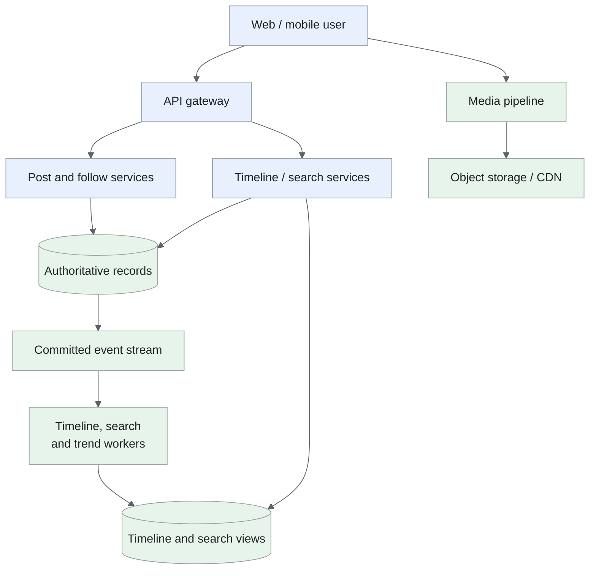
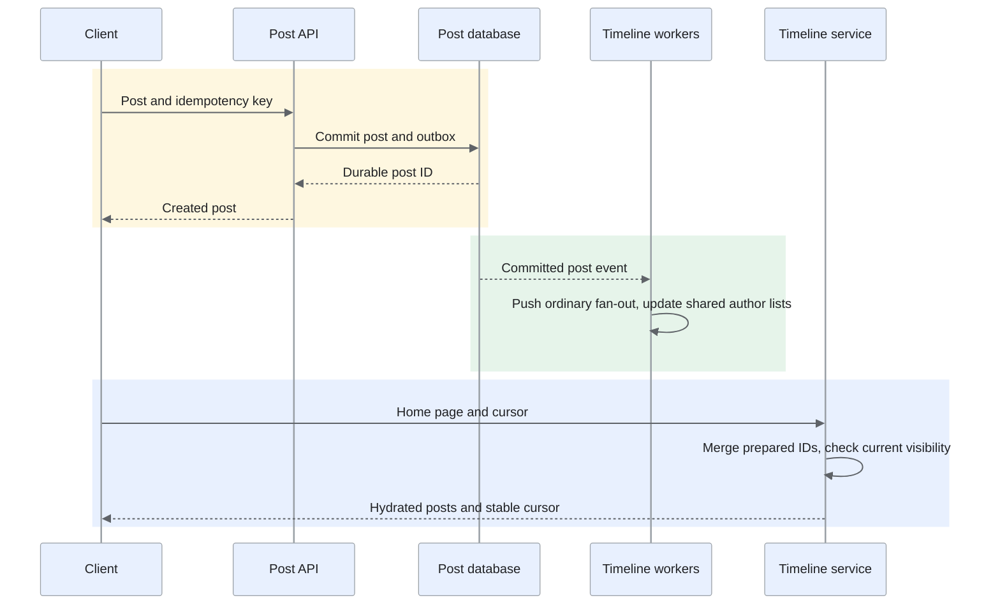
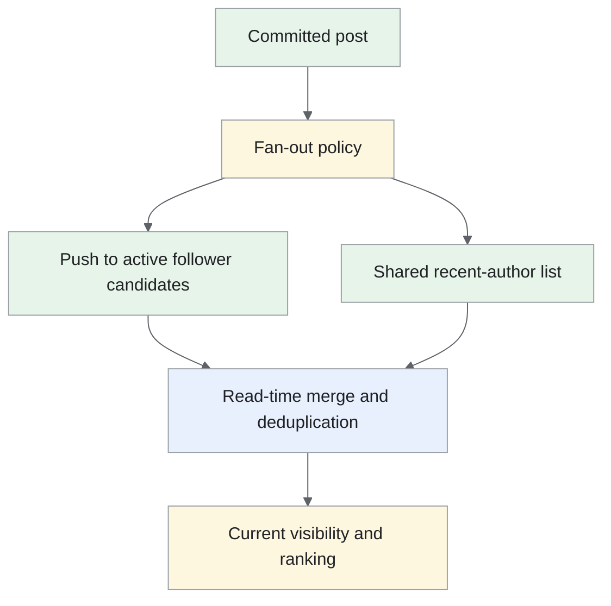

A microblogging service for publishing short posts, following users and reading a chronological home timeline.

<!--more-->

## Problem

Users publish short updates and follow other users to keep up with their posts. The service needs to make new posts available quickly, even when an author has millions of followers. Search and trending topics provide another way to discover public posts.
The main challenge is timeline delivery: preparing every follower's timeline makes reads simple, but popular authors can generate far more background writes than ordinary authors. This design combines prepared timelines with read-time merging for those high-fan-out authors.

## Requirements

### Functional requirements

- **Publish posts:** create a post of up to 280 characters, with optional replies, reposts and ready-to-serve media.

- **Read a home timeline:** show recent posts from followed users with cursor-based pagination.

- **Follow users:** add or remove a follow; enforce blocks and private-account permissions.

- **Search public posts:** search text, hashtags and authors, ordered by relevance or recency.

- **Engage with posts:** like or unlike a post and display eventually updated engagement counts.

- **Discover trends:** show recent topics by region, with controls for repetitive and abusive activity.

### Non-functional requirements

- **Scale:** design for 500M new posts/day, 300M daily users making 50 timeline reads/day, and bursts of 150K post writes/s.

- **Latency:** home timeline P99 below 500ms; search P99 below 1s, measured at the API within the serving region.

- **Availability:** target 99.99% for posting and timeline reads, 99.9% for search.

- **Durability:** acknowledge posts after the authoritative database transaction and configured synchronous replication complete.

- **Freshness:** target timeline propagation and public search indexing within 5s at P99 under provisioned load.

- **Consistency:** a user's follow changes are authoritative immediately; materialized timelines and counts update asynchronously.

- **Security:** check current visibility and blocks before returning content; authenticated writes are rate-limited.

Direct messaging, ads and ML feed ranking are outside this design. Workload figures are planning assumptions, not measurements of X.

## Back-of-the-envelope calculations

- **Posts:** 500M/day ÷ 86,400 ≈ 5.8K writes/s average; 150K/s is a roughly 26× burst.

- **Timeline:** 300M × 50/day ≈ 174K reads/s average. At 20 posts/page, hydration can exceed 3.4M object reads/s before caching.

- **Storage:** 1KB/post gives 500GB/day or 183TB/year before indexes and replicas. An assumed 1.5TB/day of media adds 548TB/year.

- **Fan-out:** background writes/s = sum of each author's post rate × active followers receiving push delivery. Measure this distribution; average follower count alone hides popular-author bursts.

## Core entities

- **Post** stores the author, content and references to replies, reposts or media.

- **Follow** records who a user follows; the reverse follower list is a derived index for fan-out.

- **Engagement** stores a user's like state; displayed counts are derived.

- **Media** tracks upload ownership and whether processing has completed.

```protobuf
message Post {
  string post_id;
  string author_id;
  string body;
  Timestamp created_at;
  string reply_to;
  string repost_of;
  repeated string media_ids;
  int64 version;                 // Orders edits and deletion events.
}
message Follow {
  string follower_id;            // Partition key for a user's follows.
  string followee_id;
  Timestamp created_at;
}
message Engagement {
  string user_id;
  string post_id;                // Unique with user_id and kind.
  string kind;
  bool active;
}
message Media {
  string media_id;
  string owner_id;
  string object_key;
  string processing_status;
}

```

Post IDs are returned as strings so JavaScript clients preserve 64-bit values. Timeline order uses `(created_at, post_id)` as a stable tie-breaker.

## API

```yaml
POST /posts:
  headers: {Idempotency-Key: client-request}
  body: {body: text, media_ids: [], reply_to: optional-post}
  result: {status: 201, post_id: id}
GET /timeline/home:
  query: {limit: 20, cursor: opaque}
  result: {posts: [], next_cursor: opaque, generated_at: timestamp}
PUT /me/follows/{user_id}:
  result: {status: 204}
DELETE /me/follows/{user_id}:
  result: {status: 204}
PUT /posts/{post_id}/like:
  result: {status: 204}
DELETE /posts/{post_id}/like:
  result: {status: 204}
GET /search:
  query: {q: text, sort: recent-or-relevant, cursor: opaque}
  result: {posts: [], next_cursor: opaque, partial: false}
POST /media/uploads:
  body: {type: image-or-video, size_bytes: integer}
  result: {media_id: id, upload_url: signed-url}
GET /trends:
  query: {region: region-id}
  result: {topics: [], window_end: timestamp}

```

Writes require authentication and permission checks. Invalid input returns 400; throttled requests return 429 with `Retry-After`.

## High-level design

The post service commits posts and events together. Background consumers prepare timelines, update search and compute trends. Timeline reads merge prepared entries with recent posts from high-fan-out authors, then load the post objects.


## Storage

- **[PostgreSQL](/designs/tech-postgresql/) shards:** durable posts, follows, engagements and transactional outbox events. Route post writes by author and time bucket; keep a write and its outbox event on the same shard. Index `(author_id, created_at, post_id)` for author histories. Follow records are partitioned by follower; reverse follower indexes are built from committed events.

- **[Redis](/designs/tech-redis/):** bounded home timelines, recent-author lists and hydrated objects. Store post IDs rather than complete objects in each timeline. Missing cache entries can be reconstructed from durable author histories.

- **[Elasticsearch](/designs/tech-elasticsearch/):** text, hashtag and author indexes, partitioned by time with controlled shard fan-out. Index versions and deletion tombstones prevent replay from restoring older content.

- **[Kafka](/designs/tech-kafka/) and object storage:** committed events for fan-out, indexing and replay; originals and processed media in object storage, delivered through a CDN. Consumers checkpoint progress and deduplicate repeated events.

Each database shard has a single write leader and configured synchronous replicas across zones. A regional failover requires fencing the former leader; this design does not use concurrent cross-region writes.

## From request to response

### Post and timeline flow



Post acceptance depends on the database commit, while follower delivery is asynchronous. Timeline reads combine prepared IDs and high-fan-out author lists, then enforce current visibility; pagination pins an ordering boundary so later posts appear on refresh.

### Publishing a post

The API authenticates the user, checks text length and media ownership, then reserves the idempotency key with a hash of the submitted request. It creates the post and outbox event in one transaction. A retry with the same key returns the same post; changed input with that key returns a conflict.
After commit, event consumers update the author history, prepared timelines and search index. The author can read their committed post directly while those views catch up. Publishing synchronously to every follower would make posting depend on the largest fan-out; background delivery removes that work from the request.

### Reading the home timeline

The timeline service reads prepared IDs and recent posts from followed high-fan-out authors. It merges them by `(created_at, post_id)`, removes duplicates and batch-loads post objects. Current follows, privacy, deletions and blocks are checked before response.
The cursor carries the ordering boundary and a snapshot cutoff so new posts appear on refresh instead of shifting later pages. A missing prepared timeline triggers bounded reconstruction from author histories. Following thousands of authors still makes merging expensive; the fan-out deep dive controls that cost.

### Following and engaging

A follow or unfollow updates the user's authoritative follow records and emits an event in the same transaction. Follow events backfill a bounded recent history; unfollow events purge prepared entries. Read-time membership checks enforce the change while the derived view updates.
Like requests set a desired state under a unique `(user_id, post_id, kind)` key. Only a state transition emits a count delta. Reposts and replies create posts with references to the original; deleted or inaccessible originals remain subject to visibility checks.

### Searching and viewing trends

Search queries select relevant time shards, retrieve candidate IDs and load currently visible posts. If an optional shard times out, the response marks results as partial; authorization checks still run for every returned post. Search freshness includes event lag, indexing and index refresh.
Trend workers normalize topics and aggregate regional time buckets. Results include their window end so users can distinguish a recent trend from an older cached response.

### Attaching media

The user uploads directly to a signed object-storage destination. Workers validate and scan the upload, create an initial playable rendition or image variant and mark it ready. A post references only media owned by its author and ready under the publication policy. Additional video renditions can follow asynchronously.
Preparing the first usable variant before publication gives the first reader a predictable response; transcoding on that reader's request would add a substantial delay.

## Deep dives

### How should we deliver timelines for popular authors?

**Problem:** one post from an author with millions of followers can dominate the fan-out queue.

- **Push on write:** Insert each post into follower timelines. Read work is small, but popular authors and inactive followers multiply writes and queue backlog.

- **Pull on read:** Merge followed-author histories when a user asks for a page. Posting is cheap, but users following many authors create large read fan-out and repeated merge work.

- **Hybrid delivery — recommended:** Push ordinary active-follower work and merge high-fan-out author lists at read time. Work follows usage, but thresholds, backfill and two-source pagination need coordination.
**Recommendation:** use hybrid delivery, choosing thresholds from measured fan-out cost and read latency rather than a fixed celebrity label. Split large follower lists into checkpointed jobs; writing the same post ID twice must preserve one timeline entry. Cache recent high-fan-out author lists and batch hydration. Follower counts and activity vary widely. We accept a hybrid merge path and measured policy thresholds so one large author cannot make every post wait on a massive fan-out job.
A transition between push and pull can overlap safely when reads deduplicate by post ID. Monitor oldest pending fan-out event, writes/post, reconstruction load and P99 merge latency. Under overload, reduce backfill and precomputation for inactive users before delaying committed-post reads.
**A hybrid timeline and its transition**
A post commit emits one event. The fan-out consumer pages through active followers for push-mode authors and inserts the post ID into their bounded candidate timelines. Pull-mode authors retain shared recent-post lists that feed reads merge with pushed IDs.



A post from a high-degree author can generate millions of candidate writes; represent that work as checkpointed follower-range jobs and cap its queue share. Retry inserts are keyed by timeline/post ID.
When policy switches an author from push to pull, record a cutover watermark. During overlap, the read merge checks both sources and deduplicates. End overlap only after old fan-out work and the recent-author source cover the transition. The threshold depends on actual active followers and posting/read rates, not follower count alone.

### How do posts become searchable quickly?

**Problem:** new posts arrive continuously while queries compete with indexing and segment merges.

- **Batch index rebuild:** Publish periodic complete snapshots. Recovery is simple, but freshness follows the build schedule and newly committed posts wait.

- **Incremental Lucene-based indexing — recommended:** Consume versioned post events and expose refreshed segments. Mature text search and replication are reused; refresh frequency, segment merging and indexing compete for resources.

- **Custom real-time index:** Build a specialized recency and memory layout. Hot-post control can improve, but query semantics, replication, rebuilds and recovery become product-specific engineering work.
**Recommendation:** use incremental Elasticsearch indexing with a measured refresh and indexing budget. [Elastic's near-real-time search documentation](https://www.elastic.co/docs/manage-data/data-store/near-real-time-search) explains how refresh exposes new segments. Keep recent time partitions hot and route older queries explicitly. Twitter's [Earlybird paper](https://ieeexplore.ieee.org/document/6228426) is a useful specialized alternative, not a capacity guarantee for this deployment. The design needs continuous post freshness with conventional text-query behavior. We accept measured Elasticsearch indexing and refresh budgets instead of maintaining a custom index before capacity evidence justifies it.
Use post ID and version for idempotent index updates. Rebuild a failed shard from a snapshot plus event offsets, and replay deletions as well as creates. Observe indexing lag, shard timeouts, merge pressure and partial-result rate.
**Index progress includes refresh**
The post outbox emits ID, content version, creation/deletion state and event sequence. An indexer writes it with an external version condition, so a delayed update cannot replace a later delete. A successful index write is not yet search visibility; refresh makes the new segment queryable.

```text
Post commit → event delivery → index write → refresh → searchable

```

Measure each stage. Choose refresh frequency under combined write, search and segment-merge load; more frequent refresh can increase overhead. Queries default to recent time partitions, expanding only for the requested history.
A failed shard loads a snapshot and replays events after its checkpoint, including tombstones. Publish the rebuilt generation before routing reads to it. Track searchable watermark per shard so a response can disclose lag/partial coverage instead of treating a healthy HTTP response as proof of complete fresh search.

### How do we keep IDs unique and pagination stable?

**Problem:** independent write shards need unique IDs, while timeline pages need deterministic ordering.

- **Database sequences:** Allocate IDs within a write shard or reserve disjoint ranges. Uniqueness is clear, but cross-shard allocation needs coordination and ranges can leave gaps.

- **UUIDs:** Generate decentralized identifiers, using a time-ordered variant where locality matters. Coordination is small, but IDs are wider and timeline order still needs an explicit timestamp/ID boundary.

- **Snowflake-style IDs — recommended:** Combine timestamp, uniquely owned worker and local sequence fields. IDs are compact and ordered by their layout; worker reassignment and clock rollback can cause duplicates unless issuance is fenced.
**Recommendation:** use a Snowflake-style generator with uniquely leased worker IDs, fencing on reassignment and a defined response to clock rollback. Stop that worker's issuance while its clock is behind the last issued timestamp; serve writes through healthy workers. Independent post shards benefit from compact locally generated IDs. We accept worker leases and clock handling, while deterministic pagination still uses its saved cutoff and tie-breaker rather than assuming ID generation alone freezes a timeline.
Timestamp-based IDs do not establish a global causal order. Store the post timestamp separately and use a stable tie-breaker in pagination. The [archived Snowflake repository](https://github.com/twitter-archive/snowflake) provides historical context; generation rate and worker count must be sized for this service.
**Worker ownership and cursor order**
Lease each generator's worker ID with a fencing epoch. The generator persists/retains its last issued timestamp and advances a local sequence within that timestamp. On sequence exhaustion it waits for the next allowed tick; on backward time it pauses issuance under the defined policy.
A partitioned controller must not assign the same worker ID concurrently. Expiry alone is insufficient if a paused worker can resume issuing IDs; it checks the fenced ownership epoch before continued issuance.

```text
ID uniqueness: timestamp + exclusively owned worker ID + sequence
Page order: stored publication timestamp + post ID tie-breaker

```

A cursor records the last ordering tuple and feed snapshot/session, not just a timestamp. Equal timestamps then paginate deterministically. Edits and deletions may change visibility, so every page still filters current state. A time-shaped ID helps locality but does not prove that two cross-shard actions occurred in causal order.

### How should trending topics be counted?

**Problem:** exact counters for every regional topic can consume substantial memory, while repeated posts can distort the ranking.

- **Exact keyed counters — recommended initially:** Count bounded author/topic contributions in explicit regional buckets. Semantics and reconciliation are clear; active topic cardinality determines memory and must be capped.

- **Count-Min sketches:** Update compact hashed counters. State is predictable, but collisions overestimate frequency and another structure must discover topic IDs.

- **Sampled events:** Process a recorded fraction of traffic. Ingest work falls, but rare or regional topics have larger sampling error and need inclusion probabilities.
**Recommendation:** first use partitioned exact counters over five-minute buckets with a cardinality budget. Count at most one contribution per author/topic/bucket, then sum buckets for recent-activity ranking. That sum measures contributions, not distinct authors across the entire combined window. A cardinality budget makes exact bucket counters a simpler initial quality anchor. We accept bounded retained topics and measure memory before switching to approximation; summed per-bucket contributions are not whole-window distinct-author counts.
For regions exceeding the budget, a sketch can identify candidate frequencies alongside an explicit bounded candidate tracker. Validate the final candidates against retained events or exact candidate counters; a sketch alone cannot enumerate every topic or guarantee an exact top-K. Replayed events use stable IDs, expired buckets are removed, and bot policy is applied before contribution counting.
**Count a topic contribution once**
The stream normalizes the hashtag, applies eligibility/abuse policy and maps an event into an event-time bucket. A durable contribution key `(region, topic, author, bucket)` admits one counted contribution, even if the same author posts repeatedly or an event is retried.
Sum bucket counts for a rolling contribution total. If one author appears in two buckets, they contribute twice to that sum; exact distinct authors across the window require unioning identities or a suitable distinct-count representation.

```text
Post → normalized eligible topics → deduplicated author/bucket contributions
     → per-topic bucket counts → window sum → regional ranking

```

For a popular topic, aggregate salted partials before updating its final owner. Expiration subtracts or drops the oldest bucket under the same replay-safe checkpoint. A sketch supplies frequency estimates only for known queried candidates; keep a bounded candidate tracker and measure its recall against exact retained events.

### How do counts and deletions survive retries?

**Problem:** an event may be delivered more than once, and cached posts may outlive a deletion.

- **Direct cache increments:** Apply every engagement event as a counter change. Latency is small, but repeated delivery inflates counts and lost cache state has no authoritative repair source.

- **Transactional engagement state with derived aggregates — recommended:** Commit desired relationship state and transition events, then deduplicate consumers. Display counts are rebuildable; outbox lag and reconciliation add background work.

- **Recount on every read:** Aggregate the durable relationships for each displayed post. Results match their database snapshot, but popular-post reads repeatedly pay substantial aggregation cost.
**Recommendation:** persist engagement state, emit transition events and have consumers deduplicate event IDs before applying deltas. Reconcile cached counts against durable state and return a version or update time when freshness matters. Engagement retries need one logical effect while reads need inexpensive counts. We accept derived-value lag and reconciliation, keeping current deletion and visibility checks separate from the cached display count.
Deletion increments the post version and emits a tombstone. Serving checks the authoritative deletion/visibility state before returning content; caches and search consume that versioned change. Track purge lag and replay retention, and rebuild derived views when event gaps exceed the supported replay window.
**An engagement transition, not a repeated increment**
A like request creates the unique user/post relationship transactionally. Only a real state change emits a `liked` event. Retrying the request returns the same relationship and emits no additional logical transition.
A consumer records event identity/version with the resulting aggregate update or derives absolute versioned counts from retained relationship state. A blind repeated increment would double-count at-least-once delivery.
Deletion commits a higher post version and a tombstone. Search, caches and timeline hydration reject older visible versions. Rebuilds carry the deletion state through the replay horizon; a fresh cache filled from an old snapshot must still apply current authority checks.
Expose count age when relevant and reconcile derived counts periodically. Count cache loss reduces display freshness, whereas post/relationship authority remains durable.
