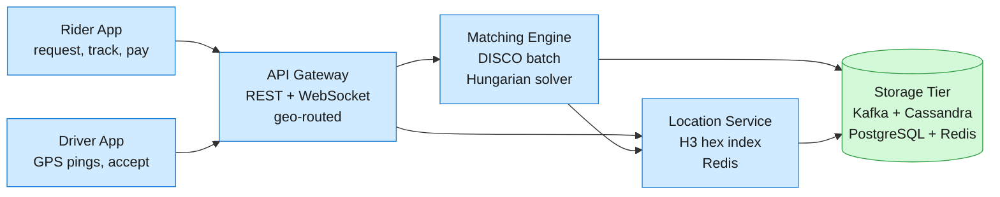
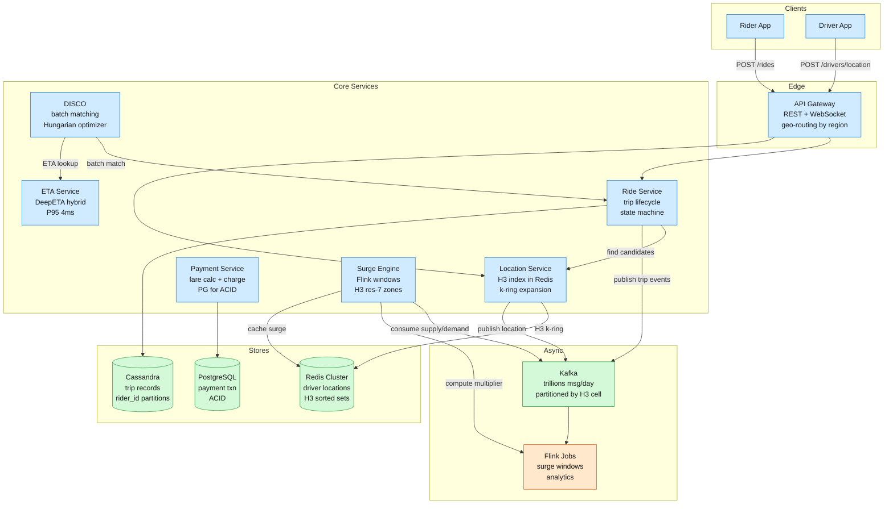

Uber connects 170M+ monthly active riders with 5M+ drivers across 10,000+ cities in 70+ countries, processing 15M+ daily trips.

<!--more-->

## 1. Problem

Uber connects 170M+ monthly active riders with 5M+ drivers across 10,000+ cities in 70+ countries, processing 15M+ daily trips. The core challenge is real-time geospatial matching: every ride request must find an optimal driver from a constantly-moving pool, factoring in ETA, supply-demand balance, surge pricing, and driver earnings — all under two seconds, at millions of concurrent operations, with exactly-once dispatch guarantees. A matching failure doesn't just degrade UX; it triggers a "wild goose chase" feedback loop where mismatched drivers travel empty, earnings drop, drivers log off, supply shrinks, and the marketplace collapses.



## 2. Requirements

**Functional**

- FR1: Request a ride with pickup, dropoff, and product selection.
- FR2: Match rider to optimal driver considering ETA, surge, and marketplace balance.
- FR3: Track driver location in real-time from dispatch through pickup.
- FR4: Complete trip with automated payment, receipt, and rating.
- FR5: View trip history with route, fare breakdown, and driver details.
- FR6: Apply dynamic surge pricing based on local supply-demand ratio.

**Non-functional**

- NFR1: Sub-2s p99 match latency from request to driver assignment.
- NFR2: 99.99% availability for ride request flow across all regions.
- NFR3: Exactly-once matching — no double dispatch or lost requests.
- NFR4: Scale to 1M+ concurrent drivers pinging location every 4 seconds.

*Out of scope: driver onboarding and background checks, vehicle registration, insurance claims, Uber Eats restaurant management, freight logistics.*

## 3. Back of the envelope

- Location firehose: 1M drivers / 4s interval = 250K writes/s sustained → Redis must absorb 250K ZADD/s across H3-cell sharded keys.
- Ride requests: 15M trips/day / 86.4K s ≈ 175 req/s avg; 5× rush-hour peak ≈ 900 req/s → each request fans out to ~50 candidate drivers = 45K match attempts/s at peak.
- Batch matching: Hungarian O(n³) with n=30–50 per zone = ~125K operations → microsecond-range completion for practical batch sizes; zone parallelism is unlimited.

## 4. Entities

```
Driver {
  driver_id:      uuid PK
  status:         enum              ← ONLINE / BUSY / OFFLINE
  vehicle_type:   enum              ← UberX / Black / XL / Comfort
  last_ping_h3:   int64             ← H3 res-9 cell; hot path in Redis only
  last_seen:      timestamp         ← for staleness detection (30s heartbeat)
  rating:         float
}

Rider {
  rider_id:       uuid PK
  payment_token:  string            ← tokenized payment method reference
  last_pickup_h3: int64
}

Trip {
  trip_id:        uuid PK
  rider_id:       uuid CK           ← partitions rider history in Cassandra
  driver_id:      uuid
  status:         enum              ← REQUESTED / MATCHED / EN_ROUTE / PICKED_UP / COMPLETED / CANCELLED
  pickup_h3:      int64             ← H3 res-9; shard key for active-trip proximity queries
  fare_cents:     integer
  surge_mult:     float             ← locked at request time
  created_at:     timestamp
}

Location {
  driver_id:      uuid              ← Redis sorted-set member
  h3_cell:        int64             ← Redis sorted-set key; TTL 30s
  lat:            float
  lng:            float
  speed_mps:      float
  heading:        int
  timestamp:      timestamp
}
```

### API

- `POST /rides` — request a ride with pickup, dropoff, product; returns trip_id and upfront fare.
- `PATCH /rides/{trip_id}` — driver accepts or declines a ride offer.
- `POST /drivers/location` — periodic GPS ping from driver app (adaptive interval).
- `GET /rides/{trip_id}` — current trip status, driver ETA, vehicle details.
- `WS /rides/{trip_id}/tracking` — WebSocket stream of real-time driver position updates.
- `GET /rides/history` — paginated trip history for authenticated rider.

## 5. High-Level Design



#### FR1: Request a Ride

Components: Rider App → API Gateway → Ride Service → Surge Engine → ETA Service.

Flow:

1. Rider opens app, sets pickup and dropoff on map, taps "Confirm."
1. Rider App calls `POST /rides` with pickup H3 cell, dropoff H3 cell, and product type.
1. Gateway geo-routes to nearest regional cluster based on pickup location.
1. Ride Service queries Surge Engine: `GET surge:{pickup_h3}` from Redis → current multiplier.
1. Ride Service calls ETA Service with pickup→dropoff route → receives time/distance estimate.
1. Ride Service computes upfront fare: `base_rate + (distance × per_mile) + (time × per_min) + surge_bump`.
1. Ride Service creates Trip in Cassandra (status=REQUESTED), stores locked surge multiplier.
1. Returns `{trip_id, upfront_fare_cents, eta_seconds}` to Rider App.

Design consideration: Uber moved from displaying a surge multiplier ("2.3x") to showing an upfront guaranteed price. The surge multiplier is still computed internally by the Surge Engine, but the rider sees a fixed dollar amount locked at request time. This shifts route-deviation risk from rider to platform — DeepETA must predict the actual driven route, not just the shortest path. The locked fare is stored in Redis with a 60s TTL so the completed trip record has a non-repudiable fare anchor.

#### FR2: Match Rider with Driver

Components: Ride Service → Kafka → DISCO → Location Service → ETA Service → RAMEN Push.

Flow:

1. Ride Service publishes `trip.requested` event to Kafka, partition key = pickup H3 cell.
1. DISCO consumer reads batches of ride requests within a 2–5s window per geographic zone.
1. For each batch, DISCO calls Location Service: `gridDisk(pickup_h3, k=7)` → ~127 H3 cells.
1. Location Service queries Redis: `ZRANGE loc:h3:{cell} 0 -1` on each cell → 20–50 candidate drivers.
1. DISCO calls ETA Service for each candidate's ETA to each rider's pickup.
1. DISCO builds bipartite cost matrix: `Cost(rider_i, driver_j) = ETA + surge_penalty + supply_value`.
1. Hungarian algorithm solves N×M assignment in O(n³), producing optimal rider→driver pairs.
1. DISCO publishes `trip.matched` event → Ride Service updates Trip status to MATCHED.
1. RAMEN pushes ride offer to selected driver's app via gRPC/QUIC with 15s acceptance timeout.

Design consideration: Greedy nearest-driver matching produces locally optimal but globally worse outcomes. When demand exceeds supply, greedy dispatch sends distant drivers on long pickups, removing them from the pool for longer, thinning out available drivers, triggering a collapse spiral. Batching for 2–5 seconds and solving globally eliminates this: the Hungarian algorithm minimizes total system ETA, and the RL-derived supply-value term positions drivers where future demand is predicted. In dense markets like Manhattan, batching yields ~22% lower average pickup time versus greedy. In sparse rural markets where the next request may not arrive for 30+ seconds, the system falls back to greedy matching automatically.

#### FR3: Track Driver in Real-Time

Components: Driver App → API Gateway → Kafka → Location Service → Redis → WebSocket → Rider App.

Flow:

1. Driver app sends GPS ping at adaptive interval (2s highway, 4s city, 10s idling).
1. Gateway validates, deduplicates, and converts lat/lng → H3 res-9 cell via `geoToH3()`.
1. Gateway publishes location to Kafka topic `driver.location`, partition key = H3 cell.
1. Location Service consumes Kafka → writes to Redis: `ZADD loc:h3:{cell} {driver_id} {timestamp}` with 30s TTL.
1. Rider app opens WebSocket to Gateway: `WS /rides/{trip_id}/tracking`.
1. On driver match, Gateway subscribes to `trip:{trip_id}:position` updates.
1. Gateway queries Location Service for driver's current H3 cell + k=1 ring neighbors.
1. As new location events arrive, Gateway pushes `{lat, lng, heading, speed_mps, eta_seconds}` to Rider App.

Design consideration: Storing driver locations directly in a database and querying at match time would require 250K spatial-index writes per second — unsustainable for any relational DB. Uber's hot path is entirely in-memory and event-driven: Kafka buffers the location firehose, Redis provides O(1) hash lookup per H3 cell, and the 30s TTL auto-evicts stale drivers. The adaptive ping interval (velocity-based) cuts total location volume by 20–30% without loss in positional accuracy for matching and ETA purposes.

#### FR4: Complete Trip and Process Payment

Components: Ride Service → Payment Service → PostgreSQL → Kafka → Analytics.

Flow:

1. Driver picks up rider → driver app sends `pickup` event → Ride Service transitions Trip to PICKED_UP.
1. During trip, Location Service continuously streams route polyline to Cassandra for trip record.
1. On dropoff, driver app sends `dropoff` event → Ride Service finalizes Trip (status=COMPLETED).
1. Ride Service publishes `trip.completed` event to Kafka.
1. Payment Service consumes event → reads locked fare from Cassandra → calculates final fare.
1. Payment Service checks Redis idempotency set: `SISMEMBER processed_trips {trip_id}`.
1. If not present, charges stored payment method via tokenized reference → INSERTs payment row into PostgreSQL with UNIQUE constraint on `trip_id`.
1. Payment Service publishes `payment.processed` → driver earnings updated, receipt generated.

Design consideration: Payment is the one place where at-least-once delivery is unacceptable. A double-charge is existential. The Payment Service uses `trip_id` as idempotency key: first a Redis fast-path check (`processed_trips` set with 90-day TTL), then PostgreSQL's UNIQUE constraint as the hard guarantee. This dual-guard pattern prevents double-charging even if Kafka redelivers the `trip.completed` event across region failovers.

#### FR5: View Trip History

Components: Rider App → API Gateway → Ride Service → Cassandra.

Flow:

1. Rider requests `GET /rides/history?cursor={}&limit=20`.
1. Ride Service queries Cassandra: `SELECT * FROM trips WHERE rider_id = ? ORDER BY created_at DESC LIMIT 21`.
1. Cassandra wide-row model: `rider_id` is partition key, `created_at` is clustering column — all trips for one rider live in one partition.
1. If 21 rows returned, there's a next page → encode last `created_at` as cursor.
1. Returns paginated list with trip status, route summary, fare, driver rating.
1. Individual trip detail fetches full polyline and receipt via `GET /rides/{trip_id}`.

Design consideration: Cassandra's wide-row model maps naturally to trip history. A single rider might accumulate thousands of trips over years. With `rider_id` as partition key and `created_at` clustering, all trips are co-located, range-scanned efficiently, and the workload is a pure append-and-range-scan pattern — no joins, no ad-hoc queries. PostgreSQL would require either massive sharding or painful archiving for the same scale.

#### FR6: Apply Dynamic Surge Pricing

Components: Kafka → Flink → Redis → Surge Engine → Gateway.

Flow:

1. Driver location pings and ride requests published to Kafka, partitioned by H3 res-7 cell.
1. Flink stream processors maintain 5-minute sliding window per H3 cell: supply (distinct drivers pinging from cell) and demand (ride requests + app-opens in cell).
1. Per cell, Flink computes `ratio = demand / max(supply, 1)` every few seconds.
1. Multiplier derived from calibrated lookup table: gentle curve at low ratios, plateau at extreme ratios.
1. Spatial smoothing applied: average multiplier of cell + k=1 ring neighbors prevents price cliffs.
1. Multipliers written to Redis: `SET surge:{h3_cell} {multiplier} EX 60`.
1. When Ride Service calls `GET surge:{pickup_h3}`, the multiplier is read in <1ms.
1. Multiplier locked at booking time — rider sees upfront fare, not fluctuating surge.

Design consideration: Surge pricing raises ride fares in real-time when local demand exceeds driver supply, incentivizing more drivers to move to the area and encouraging riders to wait or share. Without it, high-demand events (stadium exit, sudden rain) drain supply faster than drivers can reposition, triggering the **wild goose chase collapse**. Surge dampens demand while attracting drivers to the undersupplied area. H3 resolution 7 (~5.16 km²) was chosen as the surge atom because it's large enough to be statistically significant (dozens of drivers/requests per window) but small enough to be hyper-local — roughly "a neighborhood." Square cells (geohash) would introduce directional bias: diagonal neighbors are 1.4× farther than edge neighbors, distorting the supply/demand ratio. H3 hexagons give uniform neighbor distances, ensuring surge reflects a roughly circular region at any latitude.

## 6. Deep dives

### DD1: Geospatial Indexing with H3

**Problem.** A million drivers send GPS pings every few seconds. When a rider requests a ride, the system must find the 20–50 closest available drivers in under 5ms. The underlying data is overwritten 250K times per second. A global brute-force scan or SQL `WHERE lat BETWEEN` query collapses under this load. The spatial index must partition the world so that proximity queries touch as few shards as possible, and cell geometry must be uniform across all latitudes.

**Approach 1: Geohash square grid**

Encode lat/lng as a base-32 geohash string, index drivers by the hash prefix, and query the 9 surrounding cells for proximity.

```javascript
// Geohash lookup
prefix := geohash.Encode(lat, lng, 7)  // ~153m x 153m cell
neighbors := geohash.GetNeighbors(prefix)  // 8 neighbors + center = 9 cells
candidates := redis.SMembers("geo:" + neighbors[i]) for each neighbor
```

**Challenges:** Geohash cells are rectangular with variable aspect ratio depending on latitude. At Stockholm's latitude, a geohash cell is roughly twice as tall as it is wide — "neighbors" in the north-south direction are up to twice as far as east-west neighbors at the same precision. The "9 surrounding cells" search produces a rectangular area, not a true radius — drivers at the corners are missed while distant drivers along the axes are included. Surge ratios computed on rectangular cells inherit this directional bias.

**Approach 2: Google S2 square cells**

Project Earth onto a cube, tile with square cells at 30 hierarchical levels, indexed as 64-bit integers.

```go
cell := s2.CellIDFromLatLng(s2.LatLngFromDegrees(lat, lng)).Parent(15)
// Level 15: ~300m² cells
neighbors := cell.EdgeNeighbors() // varies: 4-8 neighbors depending on cube-face boundary
```

**Challenges:** S2 gives near-uniform cell areas globally (much better than geohash), but squares still have two neighbor distances — edge-neighbor and corner-neighbor. A k-ring expansion with squares is non-circular by definition. S2's hierarchy uses different projections at different levels (Hilbert curve on cube faces), making cross-resolution operations complex. Uber used S2 in early DISCO (2015) but moved away specifically because the square geometry introduced artifacts into surge pricing and ML feature engineering.

**Approach 3: H3 hexagonal tiling**

Tile Earth with hexagons on an icosahedron projection at 16 resolutions, encoding each cell as a 64-bit integer. Every hexagon has exactly 6 equidistant neighbors.

```go
// Driver location ingestion
cell := h3.LatLngToCell(h3.NewLatLng(lat, lng), 9)  // res-9: ~0.105 km², edge ~174m
redis.ZAdd("loc:h3:" + cell.String(), redis.Z{Score: float64(now.Unix()), Member: driverID})
redis.Expire("loc:h3:" + cell.String(), 30 * time.Second)

// Proximity search
pickupCell := h3.LatLngToCell(h3.NewLatLng(riderLat, riderLng), 9)
searchCells := h3.GridDisk(pickupCell, 7)  // k=7 → ~127 cells → ~1.3km radius
for _, cell := range searchCells {
    ids := redis.ZRange("loc:h3:" + cell.String(), 0, -1)
    drivers = append(drivers, ids...)
}
```

**Normal path:** At resolution 9 (~0.105 km²), a dense city intersection gets its own cell while query expansion to 2–3 rings covers a typical 3–5 km dispatch radius. Each ring adds 6k cells — `gridDisk(cell, k)` returns O(k²) cells in constant time per ring. The Redis `ZRANGE` on each cell's sorted set is O(log N) where N is drivers in that cell. Total query: ~127 Redis lookups, each returning ~1–3 drivers, all in parallel — <5ms total.

**Sparse path:** If k-ring expansion doesn't accumulate enough candidates, the dispatch radius expands iteratively: k=10 → k=15, up to ~15 km equivalent. The Location Service reports the actual radius used so DISCO can adjust its cost function.

Decision. H3 resolution 9 for driver location indexing, resolution 7 for surge pricing zones.

Rationale. Uber open-sourced H3 in 2018 specifically to replace their earlier S2-based index. The Uber Engineering blog calls out uniform neighbor distance as the deciding factor: "H3 enables us to analyze geographic information to set dynamic prices and optimize dispatch." Hexagons give exactly one neighbor distance (squares have two), so `gridDisk(cell, k)` returns a roughly circular region regardless of latitude. This single primitive powers dispatch, surge, and ML feature engineering with identical geometric properties everywhere — reducing the class of spatial bugs that plague multi-system platforms. The Redis sorted-set approach with 30s TTL absorbs 250K writes/s because writes are hash-sharded by H3 cell across a Redis cluster — no single key is hot.

Edge cases:

- **Pentagon cells:** The 12 pentagon cells per resolution (artifacts of icosahedron projection) have only 5 neighbors. `gridDisk` handles them correctly — they land on oceans in practice.
- **Cross-cell velocity:** A driver at highway speed crosses a res-9 cell (~174m edge) in under 2 seconds. The Location Service writes to the new cell on every ping; the old cell's TTL expires naturally — no explicit cleanup.
- **Stale location:** Drivers whose last ping is older than 30s are excluded from search (Redis TTL auto-evicts them). The heartbeat timeout handles app crashes, tunnel blackouts, and driver logouts without explicit signaling.

### DD2: Batch Matching with DISCO

**Problem.** Matching riders to drivers is not a "find the closest driver" problem. When demand exceeds supply, greedy nearest-driver assignment triggers a feedback loop: idle drivers are snapped up rapidly, remaining drivers are farther away, pickup distances grow, drivers spend more time traveling empty (not earning), earnings drop, drivers log off, supply shrinks further — the "wild goose chase" documented by Castillo et al. (2017). The system must optimize globally across a batch of requests while completing within a human-imperceptible window, and must do so across thousands of independent geographic zones.

**Approach 1: Greedy nearest-driver (per-request)**

For each incoming ride request, find the closest available driver and assign immediately.

```javascript
func matchGreedy(rider Rider) *Driver {
    candidates := findNearbyDrivers(rider.pickupH3, k=7)
    sort.Slice(candidates, func(i, j int) bool {
        return etaSeconds(candidates[i], rider) < etaSeconds(candidates[j], rider)
    })
    return candidates[0]  // closest driver wins
}
```

**Challenges:** Produces the wild goose chase at scale. Ignores future requests entirely — a driver 3 minutes from Rider A might be 30 seconds from Rider B who requests 1 second later, but greedy dispatch assigns them to A. The global ETA sum is provably worse. Empirically: higher pickup times, lower driver utilization, higher cancellation rates. Uber used this pre-2012 and abandoned it.

**Approach 2: Batched bipartite matching (DISCO)**

Buffer ride requests for 2–5 seconds per geographic zone, build a bipartite graph of all open requests vs. all nearby available drivers, weight edges by ETA, and solve the minimum-cost assignment globally via the Hungarian algorithm.

```javascript
// Batch window: 2-5 seconds per H3 res-7 zone (~5.16 km²)
func matchBatch(riders []Rider, drivers []Driver) map[rider]driver {
    // Build cost matrix: N riders × M drivers
    costs := make([][]float64, len(riders))
    for i, r := range riders {
        costs[i] = make([]float64, len(drivers))
        for j, d := range drivers {
            costs[i][j] = etaSeconds(d, r) +    // ETA weight
                          surgePenalty(r) +      // discourage long waits
                          supplyValue(d.destination)  // RL: value of driver's post-trip position
        }
    }
    // Hungarian O(n³): optimal assignment for N×M
    assignment := hungarian.Solve(costs)  // returns min-cost 1:1 mapping
    return assignment
}
```

**Normal path:** Zones are H3 resolution-7 cells (~5.16 km²), each independently batched on a 2–5s window tuned per city by request density. A typical batch contains 20–50 riders and 20–50 drivers — Hungarian on a 50×50 cost matrix completes in microseconds, well under the match latency budget. Zones are processed in parallel across DISCO workers.

**Sparse path:** In rural or late-night areas where the next request may not arrive for 30+ seconds, the system detects low batch density and falls back to greedy matching automatically. The switch is a real-time density signal: if fewer than 5 requests accumulate in the 5s window, skip batching.

Decision. Batched bipartite matching with Hungarian algorithm per H3 zone, augmented with an RL-derived spatial value function.

Rationale. Uber's 2015 QCon talk by then-Chief Systems Architect Matt Ranney described DISCO's evolution from nearest-driver to batched optimization as the single biggest improvement to marketplace efficiency. The Uber Engineering blog on RL for marketplace balance (2020) reports that integrating a learned value function into the matching cost matrix yielded a 0.52% driver earnings increase and 2.2% rider cancellation reduction across 400+ cities. The Hungarian algorithm is O(n³) worst case, but practical batch sizes of 30–50 keep it in the microsecond range — far below the 2s match latency budget.

Edge cases:

- **Airport queues:** Airports use a first-in-first-out queue for drivers in a staging lot. DISCO overrides normal matching for airport pickups — the rider is matched with the driver at the head of the queue, bypassing the cost matrix.
- **Pre-matched drivers:** Drivers currently on a trip but within 2 minutes of dropoff are included as candidates, with ETA accounting for remaining trip time. This is how Uber shows "your driver is finishing a nearby trip" — DISCO pre-computed the match.
- **Zone boundary artifacts:** A driver 50m across a zone border is invisible to the adjacent zone's batch. Zones are defined dynamically per batch (centroid of the batch's requests, radius = minimum capturing 20+ riders), making boundaries fluid and reducing edge effects.

### DD3: ETA Prediction with DeepETA Hybrid

**Problem.** ETA prediction is the single most business-critical model at Uber — every matching decision, fare estimate, and rider notification depends on it. A pure routing engine (Dijkstra/A* on a road graph) misses systematic errors: "OSRM says 20 minutes on I-95 at 5pm Friday, but it's actually 28 minutes." A pure ML model can learn these patterns but loses the physical constraints of the road network — it might route through a building or predict an impossible arrival time. The system must serve 500K+ requests/second with P95 inference latency under 4ms, while correcting for historical traffic patterns, real-time conditions, road closures, and trip-type-specific biases.

**Approach 1: Pure routing engine (OSRM/Dijkstra)**

Use a road-network graph with edge weights = historical or real-time segment speeds, run A* from origin to destination, sum edge weights.

```javascript
// OSRM routing
route := routing.Table(origin, destination)  // A* on sharded graph
baseEta := sum(route.edges[*].traversalTime)  // segment-level sum
```

**Challenges:** No learning from historical patterns. The routing engine doesn't know that Tuesday 5pm on I-95 is consistently 40% slower than the speed-limit weight. Real-time traffic data (HERE/Waze) helps, but it's reactive — it doesn't predict congestion that hasn't formed yet. Adding "predicted traffic" to every edge is an O(E) operation updated every 5 minutes, which at Uber's road-graph scale (hundreds of millions of edges globally) is a massive state management problem in itself.

**Approach 2: Pure ML end-to-end**

Train a deep neural network to predict ETA directly from origin/destination coordinates, time-of-day, and real-time features — no routing engine at all.

```javascript
eta := deepModel.Predict(originH3, destH3, hourOfWeek, weather, requestType)
```

**Challenges:** The model must implicitly learn the road network from scratch. Road closures, new roads, and detours require retraining — the model has no physical grounding. At Uber's geographic scale, training a model that memorizes the global road network is prohibitively expensive. Inference latency for a full Transformer on long path sequences exceeds the 4ms budget. The model may output physically impossible ETAs (e.g., 30 seconds to cross a city).

**Approach 3: Hybrid — routing engine base + ML residual correction**

Use a production routing engine (Gurafu, Uber's in-house successor to OSRM) to compute a physically-grounded base ETA, then apply a lightweight ML model to predict the residual error. The two are decoupled by a segment-level contract.

```javascript
// Segment-level contract (every 5 min, 3-hour horizon)
// For each road segment, DeepETT predicts: ETT(segment, timestamp, traffic)
// Gurafu consumes segment ETTs as edge weights, unaware of ML

// Trip-level: routing engine sums segment ETTs → base ETA
baseEta := gurafu.Route(origin, destination).ETA  // A* on updated edge weights

// DeepETA: residual correction
features := featureVector(originH3, destH3, hourOfWeek, weather, requestType, baseEta)
residual := deepEtaModel.Predict(features)  // Linear Transformer, P95 ~4ms
finalEta := baseEta + residual
```

**Normal path:** The routing engine provides physical guarantees — the path is a valid sequence of connected road segments. DeepETA only corrects systematic errors: "Gurafu's base ETA is 20% optimistic on I-95 at 5pm Fridays." The decoupling means routing changes (new roads, construction closures) are handled by the engine without model retraining.

**Stale-model path:** If DeepETA is unavailable or its inference times out, the system falls back to routing-engine-only ETA. This is a safe degradation — the ETA is physically correct (the car can drive that route), just less accurate for rush-hour patterns.

Decision. Hybrid architecture: Gurafu routing engine + DeepETA residual model with Kernelized Linear Transformer.

Rationale. The Uber DeepETA blog post (2022) reports that this hybrid approach achieves P95 inference latency of ~4ms — vs. ~15ms for a standard Transformer at the same accuracy — by using a Linear Transformer with the kernel trick (`φ(Q)φ(K)ᵀV` instead of `softmax(QKᵀ/√d)V`), reducing attention from O(n²) to O(n). The segment-level contract (ETT predictions every 5 minutes, consumed by Gurafu) means the ML model never needs to know about routing — it predicts per-segment traversal times, and routing consumes them as edge weights. This is the highest-QPS model at Uber, serving 500K+ requests/second across all products (Rides, Eats, Freight).

Edge cases:

- **Road closure:** Gurafu picks an alternate route automatically — DeepETA applies the same residual model to the new route, which may be less accurate temporarily, but the physical route is valid.
- **Model staleness:** DeepETA is retrained weekly on the latest trip data. Day-of-week and hour-of-week features capture recurring patterns. Sudden anomalies (unplanned bridge closure) are absorbed by the routing engine's re-route.
- **Cold-start areas:** New cities with sparse trip data use only the routing engine ETA until enough trips accumulate to train a reliable residual model.

> [!TIP]
> The two-contract design is the key insight: Uber explicitly chose NOT to replace the routing engine with ML. The routing engine provides an inductive bias that "roads exist and connect in specific ways" — the ML model only needs to learn the delta from physical to actual. This reduces the model's task from "predict the world" to "predict the world's deviations from physics," which is a strictly smaller learning problem with fewer failure modes.

### DD4: Exactly-Once Dispatch via Event Sourcing

**Problem.** A ride request must result in exactly one driver assignment — never zero (lost request) and never two (two drivers arrive, one gets penalized). The system is distributed across regions, location data arrives asynchronously, driver state changes independently, and network partitions are a reality. Standard at-least-once Kafka delivery means a DISCO worker crash-and-retry could double-dispatch. Distributed locks introduce TTL nightmares.

**Approach 1: Distributed lock per driver**

Before dispatching, acquire a distributed lock (Redis Redlock) on the driver's ID. If the lock is held, skip — driver is already busy.

```javascript
lock := redis.SetNX("lock:driver:" + driverID, workerID, 30*time.Second)
if !lock {
    return ErrDriverBusy  // another worker already claimed
}
defer redis.Del("lock:driver:" + driverID)
// ... dispatch driver
```

**Challenges:** Lock TTLs are the fundamental problem. If the lock expires while the driver is en route, another worker can double-assign. If the lock doesn't expire fast enough after a cancellation, the driver is stuck unavailable. Redlock has documented safety issues under clock skew — two workers can both believe they hold the lock. At 250K state transitions per second, lock contention becomes a throughput bottleneck.

**Approach 2: Compare-and-swap on driver state**

Store driver state in Cassandra with a version column. Before dispatching, run a conditional update: only modify the row if the driver is still ONLINE with the expected version.

```sql
UPDATE drivers
SET status = 'BUSY', version = version + 1
WHERE driver_id = ? AND version = ? AND status = 'ONLINE';
-- If rows_affected == 0: driver was claimed by another worker → retry next candidate
```

**Challenges:** CAS requires a strongly consistent read before write (QUORUM), adding cross-AZ latency to every dispatch. Version management adds application complexity. At 250K state transitions per second, Cassandra row-level contention is manageable (a busy driver only changes state a few times per hour), but the read-then-write pattern still doubles latency per dispatch decision.

**Approach 3: Event-sourced state with idempotency keys**

Driver state is a projection derived from an ordered event log in Kafka. Every state-modifying action carries a unique `idempotency_key = {trip_id}:{event_type}`. Kafka's ordering guarantee within a partition ensures all consumers see events in the same order.

```javascript
// Each event carries an idempotency key
type DispatchEvent struct {
    TripID         string
    DriverID       string
    IdempotencyKey string  // "trip_abc123:dispatch"
    Timestamp      int64
}

// Downstream consumer deduplication
func processDispatch(event DispatchEvent) {
    if dedupStore.Exists(event.IdempotencyKey) {
        return  // already processed — duplicate, discard
    }
    dedupStore.Put(event.IdempotencyKey, 24*time.Hour)
    // ... update driver state projection, notify driver app
}
```

**Normal path:** The Ride Service is the authoritative writer. When DISCO produces a match, it writes a `trip.matched` event to Kafka, keyed by `driver_id` so all events for that driver land in the same partition. If two DISCO workers both attempt to dispatch the same driver (e.g., due to zone overlap), whichever event is committed to Kafka first wins. The second event is rejected by the deduplication store — the driver's state projection already reflects the first dispatch.

**Stale-worker path:** A DISCO worker that crashes mid-dispatch and restarts will replay the same `trip.matched` event. The dedup store catches it by idempotency key — the driver was already dispatched, the rider was already matched, nothing changes. The worker simply moves on.

Decision. Event-sourced driver state with idempotency keys on all trip-related events.

Rationale. Uber's 2015 QCon talk emphasized "make everything retryable, which means making every operation idempotent." The Ringpop library (consistent hashing + SWIM gossip) ensured that for any given `driver_id`, exactly one worker node was responsible for processing that driver's state transitions. Combined with Kafka's ordering guarantee per partition, this gives effectively exactly-once dispatch semantics without a distributed lock manager. The RocksDB-backed deduplication store with 24-hour TTL covers the maximum trip lifecycle (a trip never spans more than a few hours), so the storage footprint is bounded.

Edge cases:

- **Split-brain zone ownership:** If a network partition causes two DISCO workers to believe they own overlapping zones, both may produce dispatch events for the same driver. The driver's Kafka partition processes events sequentially — the first commit wins, the second is deduplicated.
- **Driver app crash during match:** If the driver app crashes after receiving a dispatch but before acknowledging, the Ride Service detects a timeout (no `en_route` event within 30s), publishes a `match.expired` event, and re-queues the rider for the next batch. The driver's state transitions back to ONLINE via the event log.
- **Late-arriving location data:** A driver's GPS ping from 10 seconds ago arrives after a dispatch decision. The Location Service writes it to Redis, but the driver's state is already BUSY — the stale location is filtered out by DISCO's status check.

## 7. References

1. [H3: Uber's Hexagonal Hierarchical Spatial Index](https://www.uber.com/us/en/blog/h3/) — Uber Engineering Blog, 2018. Architecture and rationale for H3.
1. [H3 GitHub Repository](https://github.com/uber/h3) — Open-source hexagonal geospatial indexing library.
1. [DeepETA: How Uber Predicts Arrival Times Using Deep Learning](https://www.uber.com/us/en/blog/deepeta-how-uber-predicts-arrival-times/) — Uber Engineering Blog, 2022. Hybrid routing + neural residual model with P95 4ms.
1. [Reinforcement Learning for Modeling Marketplace Balance](https://www.uber.com/us/en/blog/reinforcement-learning-for-modeling-marketplace-balance/) — Uber Engineering Blog, 2020. RL value function integrated into DISCO matching.
1. [Real-Time Push Platform: RAMEN](https://www.uber.com/us/en/blog/real-time-push-platform/) — Uber Engineering Blog, 2015. Push messaging architecture from SSE to gRPC/QUIC.
1. [Schemaless Part 1: MySQL Datastore](https://www.uber.com/us/en/blog/schemaless-part-one-mysql-datastore/) / [Part 2: Architecture](https://www.uber.com/us/en/blog/schemaless-part-two-architecture/) — Uber Engineering Blog, 2016. Sharded MySQL KV store.
1. [How Uber Serves Over 40 Million Reads Per Second Using an Integrated Cache](https://www.uber.com/us/en/blog/how-uber-serves-over-40-million-reads-per-second-using-an-integrated-cache/) — Uber Engineering Blog, 2021. CacheFront + Docstore read path.
1. [Disaster Recovery for Multi-Region Kafka at Uber](https://www.uber.com/jp/en/blog/kafka/) — Uber Engineering Blog, 2021. Active-active Kafka with surge pricing as case study.
1. [Enabling Seamless Kafka Async Queuing with Consumer Proxy](https://www.uber.com/us/en/blog/kafka-async-queuing-with-consumer-proxy/) — Uber Engineering Blog, 2021. Scaling Kafka consumption to 12M msg/s.
1. [Migrating Uber's Compute Platform to Kubernetes](https://www.uber.com/en-EG/blog/migrating-ubers-compute-platform-to-kubernetes-a-technical-journey/) — Uber Engineering Blog, 2024. 3M+ cores migrated from Mesos to K8s.
1. [Scaling Uber's Realtime Market Platform](https://qconlondon.com/london-2015/presentation/scaling-ubers-realtime-market-platform.html) — Matt Ranney, QCon London 2015. Original DISCO architecture reveal.
1. [Surge Pricing Solves the Wild Goose Chase](http://conferences.sigcomm.org/imc/2015/papers/p495.pdf) — Castillo, Knoepfle & Weyl, IMC 2015. Empirical proof that greedy matching fails without surge.
