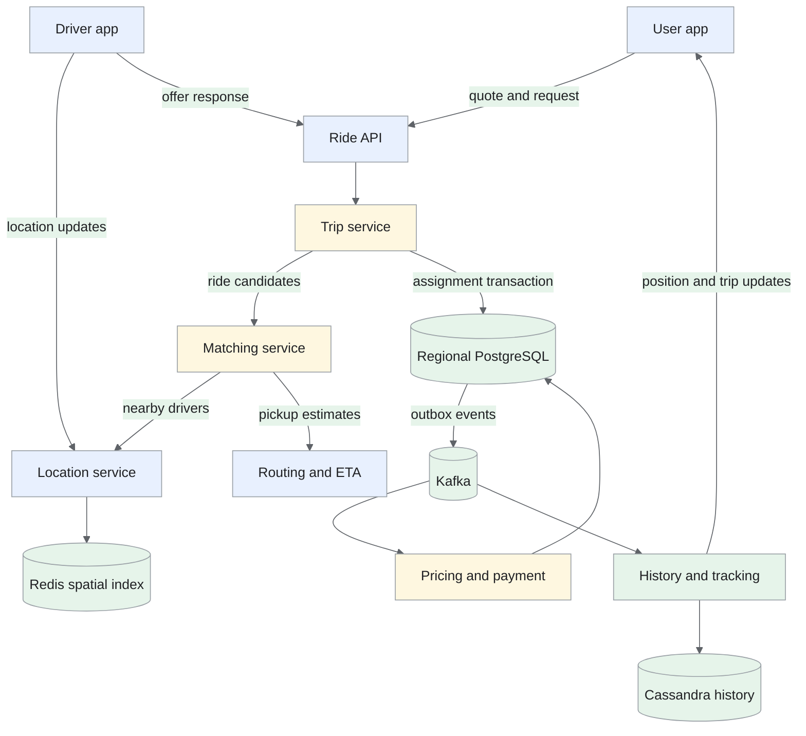
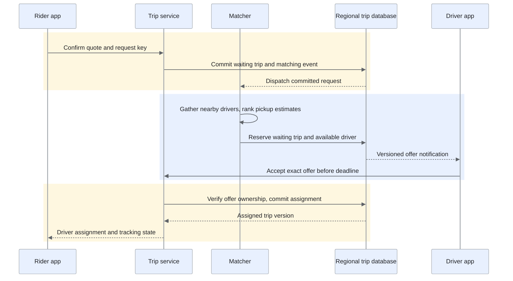
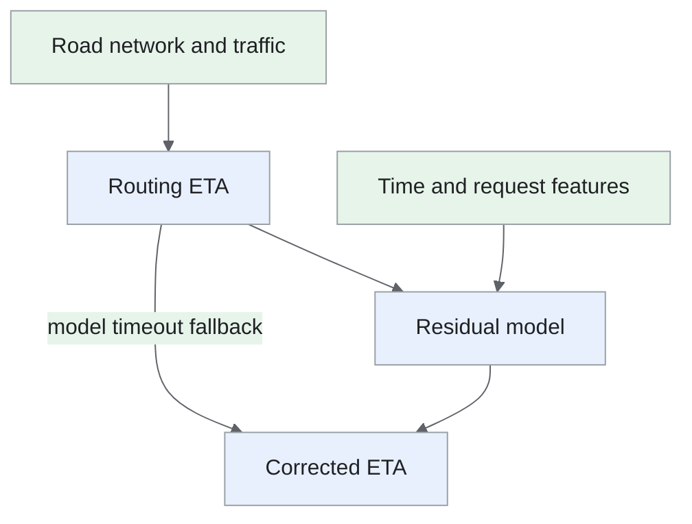
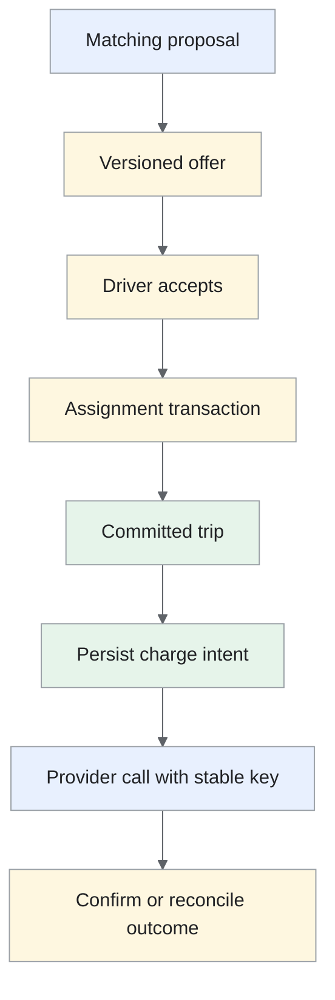

Design of a ride-hailing service that matches ride requests with available drivers, tracks trips and records fares and payments.

<!--more-->

## Problem

A user requests a ride and expects a nearby driver with a reasonable pickup time. Drivers are moving continuously, so the matching service must work from fresh location data and reserve a driver before sending an offer.
The trip service owns assignment and trip state. Location indexes find candidates, ETA estimates rank them, and background events update tracking, pricing and history. A retry must return the same ride request or offer outcome rather than create a second assignment.

## Requirements

### Functional requirements

- **Request a ride:** choose pickup, destination and vehicle product, then confirm a quoted fare.

- **Match a driver:** select eligible nearby drivers, issue offers and handle acceptance, decline or timeout.

- **Track the trip:** show driver position, pickup ETA and trip status.

- **Complete the ride:** finalize the fare, request payment, issue a receipt and accept ratings.

- **View history:** retrieve completed and canceled rides with their fare and route summaries.

- **Adjust pricing:** compute local demand/supply signals and publish versioned fare quotes.

### Non-functional requirements

- **Scale:** handle 1M online drivers sending locations every 4s and about 900 ride requests/s at the modeled peak.

- **Latency:** target P99 below 2s to issue the first viable driver offer; driver response time is separate.

- **Availability:** target 99.99% for regional ride-request acceptance.

- **Consistency:** allow at most one active assignment per driver and one accepted assignment per trip.

- **Freshness:** use driver locations received within 30s and mark older tracking positions as stale.

- **Recovery:** retain accepted requests, retry notifications and reconcile uncertain payment outcomes.

- **Privacy:** expose location only to authorized trip participants and restrict raw-route access.

Driver onboarding, insurance, freight and food delivery are outside this design.

## Back-of-the-envelope calculations

- **Location load:** 1M drivers ÷ 4s = 250K updates/s. At an assumed 200B/update, ingress is 50MB/s before replication.

- **Ride load:** 15M modeled trips/day ÷ 86,400s ≈ 174 requests/s; a 5× peak is about 870/s.

- **ETA work:** 900 requests/s × 50 candidates = 45K candidate ETA evaluations/s before reuse and batching.

- **Matching batches:** a 50×50 dense cost matrix has 2,500 edges. Solver time, routing calls and batch wait all count toward the 2s offer budget.

## Core entities

```protobuf
message Driver {
  string driver_id;
  string product;
  string dispatch_region;
  string state;                 // available, reserved, on_trip, offline
  string active_trip_id;
  int64 assignment_version;
}

message DriverLocation {
  string driver_id;
  string session_id;
  int64 sequence;
  double latitude;
  double longitude;
  string h3_cell;
  Timestamp received_at;
}

message FareQuote {
  string quote_id;
  int64 amount_minor;
  string currency;
  string pricing_version;
  Timestamp expires_at;
}

message Trip {
  string trip_id;
  string rider_id;
  string driver_id;
  string state;                 // requested, offered, accepted, picked_up, completed, canceled
  bytes pickup;
  bytes destination;
  string quote_id;
  int64 version;
}

message DriverOffer {
  string offer_id;
  string trip_id;
  string driver_id;
  int64 assignment_version;      // Rejects late responses to an older offer
  Timestamp expires_at;
}

message PaymentAttempt {
  string trip_id;
  string provider_key;
  int64 amount_minor;
  string currency;
  string status;                // pending, succeeded, failed, unknown
}

```
## API

```yaml
POST /fare-quotes:
  body: [pickup, destination, product]
  response: [quote_id, amount, currency, expires_at]

POST /rides:
  headers: {Idempotency-Key: string}
  body: [pickup, destination, product, quote_id]
  response: [trip_id, state]

POST /offers/{offer_id}/response:
  body: [accept, assignment_version]
  response: committed offer outcome

POST /drivers/location:
  body: [session_id, sequence, latitude, longitude, measured_at]
  response: latest accepted sequence

POST /rides/{trip_id}/transitions:
  body: [action, expected_version]
  actions: [cancel, pickup, complete]

GET /rides/{trip_id}:
  response: [state, driver, fare, tracking_freshness]

WS /rides/{trip_id}/tracking:
  event: versioned position and trip state

GET /rides/history:
  query: [cursor, limit]

```
## High-level design

Requests enter the user's dispatch region. The matcher finds candidates and ranks them by pickup ETA, while the trip service transactionally reserves assignments. Location ingestion and live tracking have their own path. Payment and history consume committed trip events.


```mermaid
%%{init: {'theme':'base','themeVariables':{'primaryColor':'#e8f0fe','primaryTextColor':'#202124','primaryBorderColor':'#9aa0a6','lineColor':'#5f6368','secondaryColor':'#e6f4ea','tertiaryColor':'#fef7e0','actorBkg':'#e8f0fe','actorBorder':'#9aa0a6','actorTextColor':'#202124','noteBkgColor':'#fef7e0','noteTextColor':'#202124','noteBorderColor':'#9aa0a6','signalColor':'#5f6368','signalTextColor':'#202124','labelBoxBkgColor':'#fef7e0','labelBoxBorderColor':'#9aa0a6'}}}%%
flowchart TB
  U[User app] -->|quote and request| API[Ride API]
  D[Driver app] -->|location updates| L[Location service]
  D -->|offer response| API
  API --> T[Trip service]
  T -->|ride candidates| M[Matching service]
  M -->|nearby drivers| L
  L --> R[(Redis spatial index)]
  M -->|pickup estimates| E[Routing and ETA]
  T -->|assignment transaction| DB[(Regional PostgreSQL)]
  DB -->|outbox events| K[(Kafka)]
  K --> P[Pricing and payment]
  K --> H[History and tracking]
  H -->|position and trip updates| U
  H --> C[(Cassandra history)]
  P --> DB
classDef request fill:#e8f0fe,stroke:#9aa0a6,color:#202124;
classDef data fill:#e6f4ea,stroke:#9aa0a6,color:#202124;
classDef control fill:#fef7e0,stroke:#9aa0a6,color:#202124;
class U,API,D,L,E request;
class R,DB,K,H,C data;
class T,M,P control;

```
## Storage

- **Regional [PostgreSQL](/designs/tech-postgresql/):** owns trip state, driver reservations, quotes and payment attempts. Keep assignment rows for a dispatch region in the same transactional database. Unique active-assignment constraints cover driver and trip IDs.

- **[Redis](/designs/tech-redis/) location index:** stores the latest driver record and H3-cell membership scored by last received time. Queries recheck current cell, freshness and availability; a sorted-set key TTL does not expire each driver member independently.

- **[Kafka](/designs/tech-kafka/):** partitions location updates by driver ID so a moving driver keeps its update order. Committed trip events use an outbox and stable event identity.

- **[Cassandra](/designs/tech-apache-cassandra/):** serves history projections keyed by rider/time bucket and trip time. Driver history has its own query-oriented table. Time buckets prevent unlimited partition growth.

- **Object storage:** retains route and receipt objects under access and retention controls.

- **Payment storage:** records a unique trip charge intent before contacting the provider. Provider idempotency and status reconciliation handle retries and unknown responses.

## From request to response

### Ride assignment flow


```mermaid
%%{init: {'theme':'base','themeVariables':{'primaryColor':'#e8f0fe','primaryTextColor':'#202124','primaryBorderColor':'#9aa0a6','lineColor':'#5f6368','secondaryColor':'#e6f4ea','tertiaryColor':'#fef7e0','actorBkg':'#e8f0fe','actorBorder':'#9aa0a6','actorTextColor':'#202124','noteBkgColor':'#fef7e0','noteTextColor':'#202124','noteBorderColor':'#9aa0a6','signalColor':'#5f6368','signalTextColor':'#202124','labelBoxBkgColor':'#fef7e0','labelBoxBorderColor':'#9aa0a6'}}}%%
sequenceDiagram
  participant U as Rider app
  participant T as Trip service
  participant M as Matcher
  participant D as Regional trip database
  participant A as Driver app
  rect rgb(254, 247, 224)
    U->>T: Confirm quote and request key
    T->>D: Commit waiting trip and matching event
    D-->>M: Dispatch committed request
  end
  rect rgb(232, 240, 254)
    M->>M: Gather nearby drivers, rank pickup estimates
    M->>D: Reserve waiting trip and available driver
    D-->>A: Versioned offer notification
    A->>T: Accept exact offer before deadline
  end
  rect rgb(254, 247, 224)
    T->>D: Verify offer ownership, commit assignment
    D-->>T: Assigned trip version
    T-->>U: Driver assignment and tracking state
  end

```

Location search proposes candidates, while the regional transaction owns assignment. Acceptance checks the offer identity, version and deadline, so stale responses or overlapping matchers cannot independently assign the same driver; the first-offer target excludes human response time.

### Quoting and requesting a ride

The quote service combines product rules, route estimates and a versioned local pricing signal. It saves the quote with an expiry. On confirmation, the ride service validates it and atomically creates the trip, idempotency record and matching outbox event.
The confirmed fare reference is durable for the trip; it is not a short-lived cache entry. Changes permitted by the fare policy are recorded as explicit adjustments.

### Selecting and reserving a driver

The matcher gathers nearby, eligible drivers, filters stale locations and computes pickup ETA for a bounded candidate set. Dense regions use a short matching batch; sparse regions can issue an offer immediately.
The trip service transaction checks that the trip is still waiting and the driver is available. It reserves both using an offer ID and assignment version, then commits an offer notification. Competing matchers cannot reserve the same driver.
Acceptance checks that exact offer and its deadline. Declines and timeouts release the reservation only if its version still matches, then return the trip to matching. Human response time is outside the first-offer latency target.
Location search and optimization are advisory. The reservation transaction handles overlap between neighboring matching zones and stale availability.

### Tracking and completing the trip

The location service accepts only newer updates from the driver's active session. It updates the current location and cell membership, then pushes authorized tracking updates. The client smooths display movement but shows freshness from the last received position.
Pickup and completion transitions check the actor, expected trip version and allowed previous state. Completion commits the final fare and payment event. The payment worker creates or reads the existing charge intent, calls the provider using its stable key and records the result. An ambiguous response remains pending reconciliation.

### Updating history and pricing

History projections consume versioned trip events and support cursor-based listing. They can lag the active trip API; a trip detail can be read from authoritative state when necessary.
Pricing workers aggregate eligible supply and ride demand over local windows. They smooth zone boundaries, publish signal versions and enforce product pricing bounds. An expired signal falls back to the configured baseline or last acceptable quote policy rather than an arbitrary multiplier.

## Deep dives

### How should nearby-driver search work?

**Problem.** Drivers cross cell boundaries constantly. An old membership entry can make one driver appear in multiple cells, and straight-line distance may differ greatly from pickup time.

- **Relational spatial index:** Update current positions in an indexed geometry store and query radius directly. Geometry semantics are flexible, but frequent writes and dense-region reads need measured capacity.

- **Geohash or S2 cell candidates:** Partition drivers into cells and expand neighboring cells for lookup. Mature spatial tools are available; boundary coverage and exact distance still require current-position filtering.

- **H3 candidates with current-location validation — recommended:** Use cell neighborhoods for reusable geographic features, then recheck freshness, actual position and road pickup ETA. Neighborhood traversal is convenient; stale memberships, variable geometry and pentagons need explicit handling.
**Recommendation:** use H3 for candidate indexing, then filter by current position and road-network ETA. [H3 grid traversal](https://h3geo.org/docs/api/traversal/#griddisk) returns nearby cells, not an exact distance radius. A regular grid disk has up to `1 + 3k(k+1)` cells; k=7 is up to 169, not 127. Cell shape varies and pentagon handling matters. Matching and pricing can share a bounded cell interface, while road ETA makes the final proximity decision. We accept approximate candidate geometry and validation work rather than treating an H3 disk as an exact radius.
On movement, write the driver's new current-location version, add new membership and remove old membership asynchronously. Across Redis shards these writes may not be one atomic operation, so candidate queries deduplicate IDs and verify each latest record. Periodic pruning removes old member timestamps even in busy cell keys.
Bound the expansion radius and candidate count, and batch cache requests. During index recovery, use conservative freshness filtering and show reduced matching availability. Monitor location age, duplicate membership, pruning backlog and candidate recall.
**Cell expansion and validation.** Convert the pickup to a cell, query neighboring cells in bounded rings, and deduplicate returned driver IDs. Batch-load each driver's latest location, session sequence and availability. A driver listed in two cells contributes one candidate at their current position.
Suppose a river separates two nearby coordinates. Straight-line distance may put a driver first, while the available bridge makes pickup take 15 minutes. Use geography for cheap candidate retrieval, then route-time estimation for the smaller verified set.
Each location projection applies only a newer driver epoch/sequence. Movement adds the new membership and asynchronously removes the old; read validation covers that transition. Per-member timestamps and pruning handle disconnected drivers in busy cells whose keys never expire. Stop expansion after a radius/work budget and expose reduced coverage when the index is stale instead of assigning from unverified historical positions.

### When should matching use a batch?

**Problem.** Assigning the nearest driver to the first request can leave a nearby second request with a much longer pickup. Waiting too long for a batch consumes the latency budget.

- **Immediate greedy assignment:** Offer the best available driver to each request as it arrives. First-offer latency is low, but one early assignment can leave the next rider with a much worse pickup.

- **Large global batch:** Optimize many riders and drivers together. More alternatives are visible, but waiting, cross-region coordination and solve time consume the matching deadline.

- **Short regional batch with sparse immediate path — recommended:** Build a bounded dense-region rider/driver graph and retain an immediate path where arrivals are sparse. Local competition is handled; batching adds deliberate waiting and needs reservation checks after the advisory solve.
**Options:** immediate greedy matching; a fixed multi-second batch; or short density-aware batches with a bounded optimizer.
**Recommendation:** start with a 100–250ms dense-region batch and a sparse-region immediate path. Build a sparse rider-driver graph using pickup ETA, eligibility and a calibrated marketplace-value term. Use minimum-cost matching with unmatched alternatives rather than forcing unsuitable assignments. Dense regions benefit from seeing competing riders, while sparse regions may gain little from waiting. We accept a short measured batch delay, preserving unmatched alternatives and transactional reservations instead of forcing every solver edge into an assignment.
The batch optimizer proposes pairs; storage reserves them. If one reservation fails because another zone claimed the driver, remove that candidate and retry within the remaining request budget.
Solver complexity depends on graph size and implementation. Benchmark end-to-end batch time rather than deriving microsecond latency from an asymptotic formula. Track pickup ETA, offer acceptance, cancellation, unmatched requests and waiting-time fairness.
**A small assignment graph.** Rider A can use X in two minutes or Y in three. Rider B can use X in two minutes or Y in 20. Greedily giving X to A leaves a 22-minute total; matching A→Y and B→X gives five minutes total.

| Pickup ETA | Driver X | Driver Y |
| --- | --- | --- |
| Rider A | 2 min | 3 min |
| Rider B | 2 min | 20 min |

Build the graph only from fresh eligible pairs and include an unmatched option for requests with no suitable driver. The optimizer is a proposal, not a reservation. Commit pairs under authoritative driver/trip constraints; if X was claimed elsewhere, remove that edge and replan within the remaining budget.
The short batch's waiting cost is part of pickup latency. Use immediate matching in sparse markets where another arrival is unlikely to improve the result.

### How do ETA estimates improve without replacing routing?

**Problem.** Routing provides a plausible road path, while historical behavior reveals systematic differences between its travel-time estimate and actual arrival.

- **Routing estimate only:** Use road topology and traffic speeds directly. Coverage is available in new areas, but repeated local timing bias remains.

- **End-to-end learned duration:** Predict the complete pickup time from features. Interactions are flexible, but route coverage and data shifts make unfamiliar-region behavior harder to control.

- **Routing plus residual correction — recommended:** Learn the signed difference between observed arrival and a versioned route baseline. The road-aware fallback remains useful; routing, feature and model versions must align and corrections need held-out regional evaluation.
**Options:** routing alone; a direct coordinate-to-time model; or routing plus a learned residual correction.
**Recommendation:** use route ETA as the baseline and train a model to correct its error. This follows the hybrid approach described in [Uber's DeepETA article](https://www.uber.com/blog/deepeta-how-uber-predicts-arrival-times/). Keep model evaluation and rollout separate from the routing engine. The matcher needs plausible estimates even for sparsely labeled roads. We accept residual-model version coordination and bounded corrections to improve measured routing bias without replacing the topology-aware baseline.


```mermaid
%%{init: {'theme':'base','themeVariables':{'primaryColor':'#e8f0fe','primaryTextColor':'#202124','primaryBorderColor':'#9aa0a6','lineColor':'#5f6368','secondaryColor':'#e6f4ea','tertiaryColor':'#fef7e0','actorBkg':'#e8f0fe','actorBorder':'#9aa0a6','actorTextColor':'#202124','noteBkgColor':'#fef7e0','noteTextColor':'#202124','noteBorderColor':'#9aa0a6','signalColor':'#5f6368','signalTextColor':'#202124','labelBoxBkgColor':'#fef7e0','labelBoxBorderColor':'#9aa0a6'}}}%%
flowchart TB
  R[Road network and traffic] --> B[Routing ETA]
  B --> C[Residual model]
  F[Time and request features] --> C
  C --> E[Corrected ETA]
  B -->|model timeout fallback| E
classDef request fill:#e8f0fe,stroke:#9aa0a6,color:#202124;
classDef data fill:#e6f4ea,stroke:#9aa0a6,color:#202124;
classDef control fill:#fef7e0,stroke:#9aa0a6,color:#202124;
class B,C,E request;
class R,F data;

```

Clip impossible predictions and measure error by city, product and trip type. A model timeout falls back to the routing estimate with its source recorded. Road data and incident freshness remain important even with an accurate model.
**Residual prediction example.** A route engine estimates 600 seconds. The learned model predicts a +120-second residual for the current road/time/request features, so the final estimate is 720 seconds. Training labels are actual elapsed time minus the route estimate produced with information available at that request.
Version route and feature inputs with the model. Using today's traffic or final route in a historical training example would leak information unavailable to the live predictor. Evaluate both corrected and baseline errors by market and trip phase; improvement averaged across all trips can hide a degraded city.
Return routing ETA if the model misses its deadline, recording fallback source and prediction version. Calibrated intervals describe uncertainty separately from the point estimate. Once the trip changes state, a newer trip-version prediction supersedes the older one rather than mixing pickup and destination-arrival estimates.

### How can retries avoid double assignment or charging?

**Problem.** Event deduplication recognizes repeated messages, but two different ride requests can still compete for the same driver. Likewise, a database uniqueness check performed after a provider charge cannot prevent duplicate external charges.

- **Event deduplication alone:** Ignore repeated event IDs. Replay is handled, but two distinct requests can still compete for one driver and an uncertain provider response remains unresolved.

- **Post-action uniqueness checks:** Assign or charge first, then reject duplicate local records. Local conflicts become visible, but the external or assignment effect may already have occurred twice.

- **Atomic reservations and durable payment intents — recommended:** Reserve trip/driver state together, version offers, and persist one charge intent before calling the provider with its stable key. Competing work is coordinated; ownership fencing and ambiguous-payment reconciliation add recovery state.
**Options:** cache locks; deduplicate notifications alone; or authoritative assignment transactions plus stable external-operation keys.
**Recommendation:** commit driver and trip reservations together, enforce unique active assignments and version every offer. A region handoff drains active reservations or uses a coordinated ownership transfer; active-active writers must not independently assign the same driver. Assignment and payment cross different authorities. We accept versioned offers, fenced regional writers and pending payment states so retries recover the original operation instead of creating another side effect.
For payment, store a charge intent first, use the same provider idempotency key on retry and query its status after uncertainty. Completion notifications can be delivered repeatedly without creating another intent. Monitor reservation conflicts, expired offers, unknown payment outcomes and reconciliation age.
**Offer and charge lifecycle.** Persist offer ID, driver, trip, expiry and generation before delivery. Acceptance locks or conditionally updates driver capacity and trip assignment together. If two riders compete for one driver, one active-assignment constraint admits a winner; the other replans.


```mermaid
%%{init: {'theme':'base','themeVariables':{'primaryColor':'#e8f0fe','primaryTextColor':'#202124','primaryBorderColor':'#9aa0a6','lineColor':'#5f6368','secondaryColor':'#e6f4ea','tertiaryColor':'#fef7e0','actorBkg':'#e8f0fe','actorBorder':'#9aa0a6','actorTextColor':'#202124','noteBkgColor':'#fef7e0','noteTextColor':'#202124','noteBorderColor':'#9aa0a6','signalColor':'#5f6368','signalTextColor':'#202124','labelBoxBkgColor':'#fef7e0','labelBoxBorderColor':'#9aa0a6'}}}%%
flowchart TB
  M["Matching proposal"] --> O["Versioned offer"]
  O --> A["Driver accepts"]
  A --> T["Assignment transaction"]
  T --> R["Committed trip"]
  R --> P["Persist charge intent"]
  P --> C["Provider call with stable key"]
  C --> Q["Confirm or reconcile outcome"]
classDef request fill:#e8f0fe,stroke:#9aa0a6,color:#202124;
classDef data fill:#e6f4ea,stroke:#9aa0a6,color:#202124;
classDef control fill:#fef7e0,stroke:#9aa0a6,color:#202124;
class M,C request;
class R,P data;
class O,A,T,Q control;

```

A delayed acceptance is rejected after offer generation changes. Payment retries use the existing charge intent, including after a completion-event replay. If a provider reply is lost, keep the intent unresolved and query status before creating any new operation. Trip completion and a confirmed payment are separately recorded outcomes.
