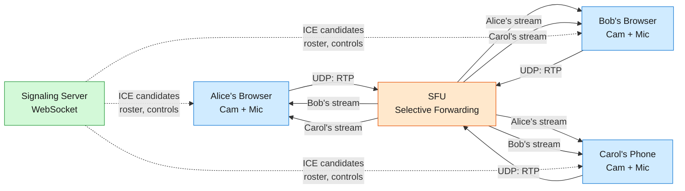
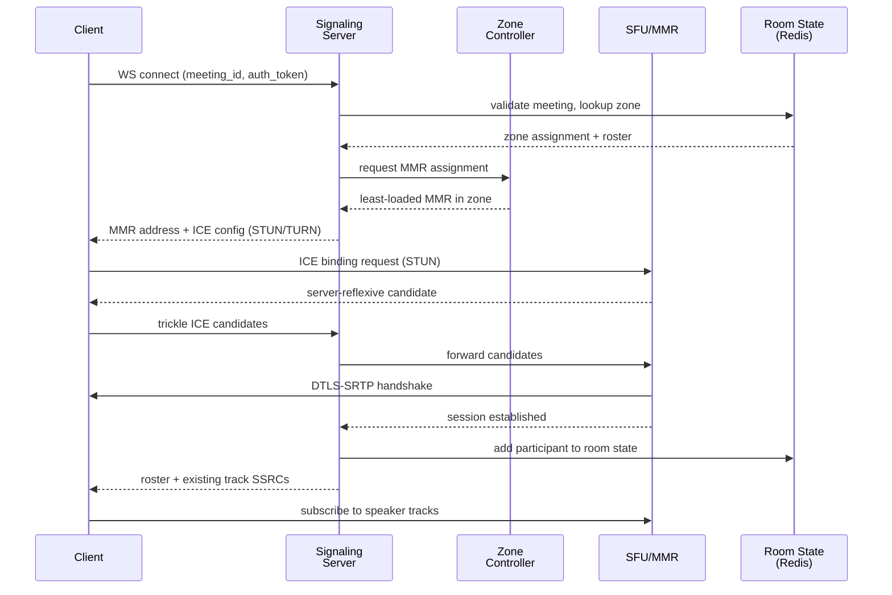
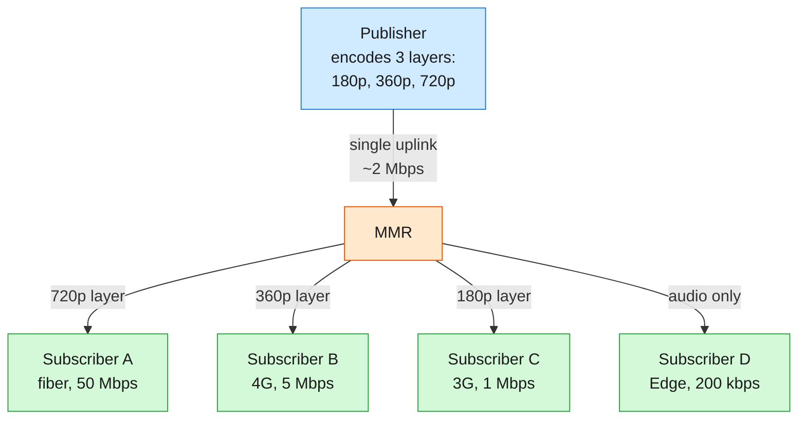
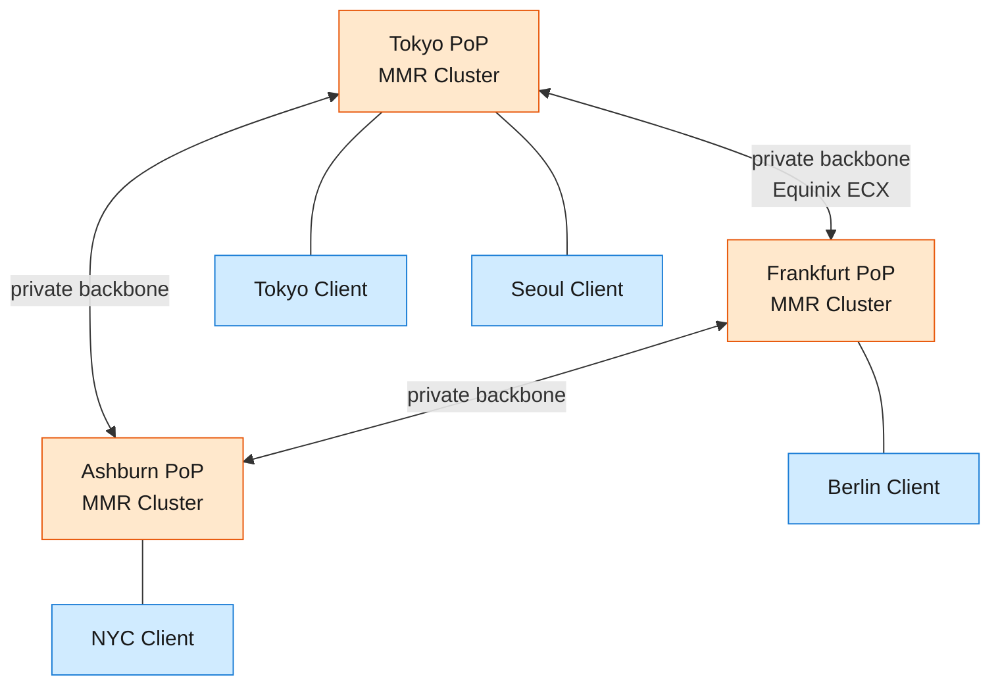

Video conferencing connects hundreds of participants in a real-time audio/video session where every frame must travel from a speaker's camera to every listen...

<!--more-->

## 1. Problem

Video conferencing connects hundreds of participants in a real-time audio/video session where every frame must travel from a speaker's camera to every listener's screen in under 150ms. At Zoom's scale — 300 million daily meeting participants, 10,000+ SFU servers across 17+ global data centers — the system forwards millions of concurrent media streams through NAT firewalls, asymmetric home broadband, and congested mobile networks without dropping a syllable. The central tension: a 20-person meeting generates 380 media subscriptions from only 20 published streams, and the server must forward the right resolution to each receiver without ever decoding the video — because CPU cycles spent on transcoding are cycles stolen from latency.



## 2. Requirements

**Functional**

- FR1: Stream real-time audio and video between meeting participants
- FR2: Share screen content with content-adaptive resolution and frame rate
- FR3: Create meetings, join by ID/link, leave, and enforce host controls
- FR4: Record meetings to cloud storage with per-participant track isolation
- FR5: Send in-meeting chat messages and ephemeral reactions
- FR6: Adapt video quality per receiver based on available bandwidth

**Non-functional**

- NFR1: Glass-to-glass media latency under 150ms for all participants
- NFR2: Meeting join completes within 3 seconds from click to visible
- NFR3: 99.9% uptime globally; SFU failure recovers with <5s disruption
- NFR4: Graceful quality degradation under packet loss up to 45%

*Out of scope: one-to-many webinar broadcasting, breakout rooms, calendar integration, PSTN dial-in, AI transcription/summarization, virtual backgrounds (client-side only).*

## 3. Back of the envelope

- **Media ingress:** 10M concurrent participants × 2 Mbps avg uplink → **20 Tbps** aggregate → cannot fit in one data center; requires globally distributed SFU PoPs.
- **TURN relay bandwidth:** 10M concurrent × 10% TURN rate × 2 Mbps × 2 (bidirectional relay) → **4 Tbps** → TURN is the single largest bandwidth line item despite serving a minority of sessions.
- **Recording storage:** 5M recordings/day × 45 min × 1.5 Mbps avg per-track → **~2.5 PB/day** → post-meeting batch compositing is mandatory; real-time compositing at this scale is cost-prohibitive.

## 4. Entities

```
Meeting {
  id:            uuid        PK
  host_id:       uuid           ← creator; holds leader key for E2EE
  status:        enum           ← created, active, ended
  meeting_code:  string         ← human-readable join code (123-456-789)
  max_participants: integer     ← 1,000 for video; 10,000+ for webinars
  e2ee_enabled:  boolean        ← if true, SFU forwards opaque ciphertext
  created_at:    timestamp
}

Participant {
  id:            uuid        PK
  meeting_id:    uuid        FK
  user_id:       uuid
  role:          enum           ← host, co_host, attendee
  joined_at:     timestamp
  left_at:       timestamp?
}

MediaSession {
  id:            uuid        PK
  participant_id:uuid       FK
  sfu_node:      string         ← which MMR/zone handles this connection
  ice_ufrag:     string         ← ICE username fragment for SFU-side demux
  transport:     enum           ← udp, tcp_fallback, turn_relay
  ssrc_audio:    integer        ← RTP SSRC for audio track
  ssrc_video:    integer        ← RTP SSRC for video track
  ssrc_screen:   integer?       ← RTP SSRC for screen share track
  created_at:    timestamp
}

Recording {
  id:            uuid        PK
  meeting_id:    uuid        FK
  status:        enum           ← pending, recording, compositing, ready
  storage_path:  string         ← S3 prefix for per-track RTP dumps
  composite_url: string?        ← populated after batch compositor finishes
  started_at:    timestamp
  completed_at:  timestamp?
}

ChatMessage {
  id:            uuid        PK
  meeting_id:    uuid        FK
  sender_id:     uuid
  content:       text
  type:          enum           ← text, reaction, file_share, system
  created_at:    timestamp      ← TTL: ephemeral for reactions; persistent for messages
}
```

### 5. API

- `POST /meetings` — create a meeting, returns meeting_id and join_code
- `WS wss://signal.example.com/{meeting_id}` — signaling channel: join/leave, ICE candidate exchange, roster updates, host controls (mute, kick, lock)
- `WebRTC (UDP/TCP/TLS) → assigned SFU node` — media plane: publish audio/video/screen tracks; subscribe to other participants' tracks; SDP offer/answer negotiated over the signaling WebSocket
- `POST /meetings/{id}/recording` — start cloud recording; body includes `{action: "start"|"stop"}`
- `WS wss://signal.example.com/{meeting_id}/chat` — send and receive in-meeting chat messages and reactions (multiplexed on signaling channel in practice)
- `GET /meetings/{id}/recording/{rid}` — get recording status and download URL once compositing completes

## 5. High-Level Design

Two independent planes: a **signaling plane** over WebSocket (low bandwidth, stateful, needs exactly-once delivery) and a **media plane** over UDP/RTP (high bandwidth, loss-tolerant, needs sub-150ms forwarding). They share nothing except the meeting ID that binds them.

### Joining a meeting



### Media path (SFU forwarding)



The SFU never decodes a video frame. It reads RTP headers (SSRC, sequence number, timestamp), decides which simulcast layer to forward per subscriber based on TWCC bandwidth estimates, rewrites the RTP continuity fields so the decoder sees one seamless timeline, and forwards the encrypted frame payload untouched. This is why an SFU with a single CPU core can serve hundreds of participants — it does no media processing, only packet inspection and routing.

### Screen sharing

Screen share is a separate video track (separate SSRC) with content-adaptive encoding: 1080p at 5–15 fps when content changes, near-zero bitrate when static. The SFU treats it identically to a camera track — forwarding unchanged RTP packets. The receiver's client renders it as a distinct tile in the gallery or as the main view in share mode.

## 6. Deep dives

### 7.1 NAT Traversal — STUN, TURN, and the 15% that costs 80% of bandwidth

Every participant sits behind some combination of NAT, firewall, and carrier-grade NAT. The challenge: establish a direct UDP path between the client and the SFU without the media touching a relay that doubles bandwidth and adds latency.

**Option A: TURN-only (relay everything)**

- Pro: Works through any NAT; no connectivity failures.
- Con: Doubles every byte (client → TURN → SFU → TURN → client). At 20 Tbps ingress, this becomes 40 Tbps through TURN servers. Cost-prohibitive.

**Option B: STUN-only (hope for direct path)**

- Pro: Zero relay bandwidth; media flows direct.
- Con: ~15–20% of users are behind symmetric NATs where STUN fails (different external port per destination). These users simply cannot connect.

**Option C: Hybrid ICE — STUN-first, TURN fallback (Zoom's approach)**

- Pro: 80–85% of sessions go direct via STUN-discovered server-reflexive candidates; only 15–20% fall through to TURN. Covers everyone.
- Con: Must deploy and capacity-plan TURN infrastructure globally for the minority case, even though it handles the majority of bandwidth cost.

**Decision:** Hybrid ICE. You cannot leave 15% of users behind, and you cannot afford to relay 100% of traffic through TURN servers.

**Rationale:** Zoom's production architecture runs this exact model. Their Connection Process document describes probing: client sends UDP to port 8801 first, falls back to TCP 8801–8804, then TLS 443. A single 10 Gbps TURN server handles ~1,400 simultaneous relay sessions at ~7 Mbps average. At global scale, TURN bandwidth alone reaches 1–4 Tbps — it's the dominant infrastructure cost. Google Meet and Microsoft Teams follow the same pattern.

**Edge cases:**

- **Symmetric NAT detection**: STUN response returns a mapped address that differs from the host candidate, but that mapped address works only for the STUN server — not for the SFU. The client must recognize this and fall back to TURN.
- **TURN server saturation**: When a regional TURN cluster approaches capacity, the zone controller redirects new connections to the next-nearest PoP. Pre-provision at 2× expected peak per region.
- **ICE restart on network change**: Mobile clients switching from Wi-Fi to cellular trigger a full ICE restart (new candidates, new DTLS handshake). SFU detects the new transport by matching the ICE ufrag, migrates the session without dropping the user from the meeting — recovery within 1–3 seconds.
- **TCP fallback for UDP-blocked networks**: Corporate firewalls that block UDP force all media over TCP or TLS to port 443. TCP's head-of-line blocking degrades latency but keeps the meeting alive. The SFU must handle mixed transports within the same room.

### 7.2 SFU Design — Selective Forwarding, Simulcast, and Congestion Control

The SFU is the heart of the system. Every participant publishes one encoded stream; the SFU forwards it to every other subscriber, selecting the right quality layer per subscriber.

**Option A: P2P full mesh**

- Pro: No server infrastructure for media.
- Con: Each participant uploads N-1 copies of their stream. At 5 participants with 720p video, that's 4 × 2 Mbps = 8 Mbps uplink — saturates most home connections. Breaks at 4+ participants. Zoom uses P2P only for 1:1 calls.

**Option B: MCU (Multipoint Control Unit)**

- Pro: Single composite stream per participant — constant ~2 Mbps downlink regardless of room size.
- Con: Server must decode N streams, compose them into one layout, re-encode. CPU-bound at ~80 participants. Adds 30–50ms of encode/decode latency. Loses flexibility — every participant sees the same layout.

**Option C: SFU (Selective Forwarding Unit)**

- Pro: Server never decodes video. CPU scales as O(N × packet rate), not O(N × encode complexity). Supports 1,100+ participants on a single node (Zoom's MMR vs ~80 for MCU). Each client chooses its own layout.
- Con: Each subscriber receives N-1 streams, consuming (N-1) × selected_layer_bitrate in downlink bandwidth. For a 50-person meeting at 360p per non-speaker tile, that's ~49 × 150 kbps ≈ 7.4 Mbps downlink — manageable on broadband.

**Decision:** SFU with simulcast layer selection.

**Rationale:** Zoom's CEO letter (March 2020) states each MMR supports "approximately 1,100 more meeting participants than a standard MCU, which generally supports up to 80." That's a 15× capacity multiplier. The key insight: video encoding is expensive (~1 core per 720p30 encode), but packet forwarding is cheap. An SFU does RTP header rewriting — SSRC, sequence number, timestamp — so the decoder sees one continuous timeline across layer switches. It never touches the payload.

> [!TIP]
> **The simulcast trick:** The publisher encodes their camera at 3 resolutions simultaneously (180p, 360p, 720p) and sends all three on a single uplink (~2.5 Mbps). The SFU, per subscriber, selects exactly one layer to forward based on TWCC (Transport-Wide Congestion Control) bandwidth estimates. When a subscriber's bandwidth drops, the SFU switches them from the 720p feed to the 360p feed, rewriting the RTP sequence number and timestamp so the decoder sees a seamless transition — no keyframe request, no glitch.

**Congestion control loop:**

```javascript
Receiver sends RTCP feedback every ~100ms →
  "I received 48 of 50 packets in the last window, delay gradient +3ms"
SFU aggregates feedback from ALL subscribers of a publisher →
  sends unified REMB (Receiver Estimated Maximum Bitrate) to publisher
Publisher's encoder adjusts: reduces resolution, frame rate, or both
```

**Edge cases:**

- **Active speaker detection**: In a 1,000-person meeting, the SFU forwards only the active speaker's 720p stream and 720p tiles for the last ~5 speakers. Everyone else gets 180p thumbnails or audio-only. RTCP audio energy reports drive this — server-side, lightweight, no audio decoding needed.
- **Keyframe on layer switch**: When a new subscriber joins, they need a keyframe before they can decode. The SFU caches the last keyframe per layer per publisher and sends it immediately on subscribe — avoids the 2–5 second "frozen tile" on join.
- **Cascaded SFU for large meetings**: When participants span multiple regions, local SFU nodes relay between each other over the private backbone. Each regional SFU sends one copy of each stream to peer SFUs, which then fan out locally — avoiding N×M cross-region bandwidth.

### 7.3 Global Infrastructure — Geo-Routing and the Private Backbone

Users in Tokyo, London, and São Paulo join the same meeting. Media must travel between continents in under 150ms, and the system must survive a data center outage without dropping active calls.

**Option A: Single-region with cloud CDN**

- Pro: Simple to operate; one database, one control plane.
- Con: 300ms+ latency for remote participants. CDNs are pull-through caches — useless for live bidirectional media. Non-starter.

**Option B: Multi-region active/passive**

- Pro: Disaster recovery with one hot standby.
- Con: Wastes 50% of provisioned capacity sitting idle. Failover still disrupts active sessions (new ICE negotiation, 5–10 second gap).

**Option C: Geo-routed active/active with cascaded SFU mesh (Zoom's approach)**

- Pro: Every client connects to the nearest PoP. Cross-region traffic travels over a private backbone (Equinix Cloud Exchange Fabric) with guaranteed bandwidth and lower jitter than public internet. A data center outage shifts load to neighbors with zero disruption for meetings that span zones (cascaded SFU picks up the relay).
- Con: Operational complexity of 17+ colocation facilities, private backbone management, and distributed state (room state in Redis per zone, with cross-zone replication).

**Decision:** Active/active geo-routed SFU mesh with private backbone.

**Rationale:** Zoom's infrastructure runs on 17+ Equinix colocation data centers with 50% excess capacity maintained at all times. The Zone Controller assigns each new meeting to the data center closest to the host, then Geo-IP steers participants to that zone. Cross-zone meetings cascade between MMRs over private Equinix ECX Fabric links. During the pandemic surge (10M → 300M daily participants, a 30× increase in 4 months), Zoom burst to AWS and Oracle Cloud for non-real-time workloads while video stayed on colocated hardware — the core SFU code didn't change, only capacity provisioning scaled.



**Edge cases:**

- **Zone controller failure**: Zone Controller state is soft (which MMRs are healthy, load metrics). If it crashes, MMRs continue forwarding existing sessions. New session assignment pauses until a standby controller takes over (seconds). Meeting state in Redis survives independently.
- **Cross-zone cascade degradation**: If the Tokyo-Frankfurt backbone link saturates, cascaded SFU nodes throttle to the lowest common simulcast layer (180p) rather than dropping the relay entirely. Participants see degraded quality, not disconnection.
- **Geo-IP misrouting**: A user in Dubai might be routed to Frankfurt (120ms) when Mumbai (40ms) would be better. The client probes multiple data centers during connection setup and selects the one with lowest RTT — Geo-IP is a hint, not a mandate.

### 7.4 End-to-End Encryption — Forwarding Ciphertext Through an SFU

Encryption is straightforward between two parties. In a group call with an SFU in the middle, the server must forward streams it cannot read to subscribers it cannot impersonate — while still doing layer selection based on RTP headers.

**Option A: Hop-by-hop encryption (DTLS-SRTP per leg)**

- Pro: Standard WebRTC — every leg between client and SFU is encrypted with DTLS-SRTP. Simple to implement.
- Con: The SFU decrypts every packet, reads the payload, re-encrypts for each subscriber. The server has access to all media. A compromised SFU node compromises all meetings on that node. This was Zoom's pre-October 2020 architecture, and it was misleadingly marketed as "end-to-end."

**Option B: Full end-to-end encryption with client key exchange**

- Pro: Media is encrypted with a key the server never possesses. SFU forwards opaque ciphertext. A compromised server sees only encrypted frames. Enables compliance with regulated industries (healthcare, finance, government).
- Con: SFU cannot transcode, record, caption, or apply noise suppression — all server-side processing is disabled. Every participant must encrypt/decrypt per-stream, adding CPU overhead. Key distribution for group calls requires a group key agreement protocol.

**Option C: E2EE with per-stream keys and SFU-friendly RTP headers (Zoom's approach since Oct 2020)**

- Pro: Media payload is AES-256-GCM encrypted with keys derived via client-side DH + HKDF from a seed key the server never sees. RTP headers (SSRC, sequence number, timestamp, PictureID) remain plaintext — the SFU can still do simulcast layer selection and header rewriting. Post-quantum hybrid (Kyber768 + Curve25519) since client v6.3.0. Key rotation on every participant join/leave via LL-CGKA protocol.
- Con: Disables cloud recording composition, live transcription, AI Companion features, and server-side noise suppression. These become client-only features. Users must choose: E2EE or AI features; they cannot have both in the same meeting. Formal protocol analysis (IACR 2021/486) proved security under Gap-DH assumption but later work (IACR 2023/1829) found insider-collusion attacks.

**Decision:** E2EE with plaintext RTP headers and client-side key management (LL-CGKA).

**Rationale:** The killer insight is that RTP headers are already outside the SRTP encrypted payload (they're the AAD — Additional Authenticated Data — in AES-GCM). The SFU reads them for forwarding regardless. Zoom's E2EE whitepaper formalized the LL-CGKA protocol: the meeting leader generates a 32-byte seed key, encrypts it to each participant's public key using committing AEAD (CtE1 to prevent key-wrapping oracle attacks), and posts the encrypted shares to a bulletin board (the Zoom server). The server stores ciphertext it cannot decrypt. This is the same pattern Signal uses for group messaging, adapted for real-time media.

**Edge cases:**

- **Leader departure**: When the host leaves, the protocol designates a new leader who performs a key rotation (epoch increment). All participants derive new keys via the ratchet. This takes ~100–200ms — below perception threshold.
- **Late joiners**: A participant joining mid-meeting receives the current epoch's encrypted seed key from the bulletin board, decrypts with their private key, derives current media keys. They do not get access to prior epochs' keys (forward secrecy via PRG ratchet).
- **Recording incompatibility**: E2EE meetings cannot be cloud-recorded. Zoom's UX presents this as a toggle — enabling E2EE disables recording and transcription. The trade-off is explicit and user-facing.
- **Insider threat**: A malicious participant who joins the meeting has the media keys by design. E2EE protects against server compromise, not participant compromise. Screen sharing watermarking and participant audit logs are the mitigation, not cryptography.

## 7. References

1. **Zoom — Architected for Reliability** (official): SFU/MMR architecture, 50% excess capacity, 99.9% uptime, packet loss tolerance — https://library.zoom.com/admin-corner/architecture-and-design/zoom-architected-for-reliability
1. **Zoom CEO Letter (March 2020)**: 17 co-located data centers, MMR vs MCU capacity comparison — https://pdp.sjsu.edu/workanywhere/docs/Zoom%20Message.pdf
1. **Zoom E2EE Whitepaper (v4+, GitHub)**: LL-CGKA protocol, Kyber768 post-quantum hybrid, CtE1 committing AEAD — https://github.com/zoom/zoom-e2e-whitepaper
1. **Zoom Connection Process (PDF, Jan 2025)**: Port hierarchy (8801 UDP → TCP → 443 TLS), Geo-IP steering, ICE/STUN/TURN — https://media.zoom.com/download/assets/Zoom+Connection+Process+Jan-09-2025.pdf
1. **Google Research — Background Features in Google Meet**: WebGPU/WebGL inference performance, MediaPipe model size (193K params, 400KB) — https://research.google/blog/background-features-in-google-meet-powered-by-web-ml/
1. **IACR ePrint 2021/486**: Formal security analysis of Zoom's E2EE protocol under Gap-DH assumption — https://eprint.iacr.org/2021/486
1. **Data Center Frontier — Inside Zoom's Infrastructure**: Equinix colocation, AWS/OCI cloud burst (5,000-6,000 servers at a time, 7 PB/day on OCI in May 2020) — https://www.datacenterfrontier.com/cloud/article/11428986/inside-zoom8217s-infrastructure-scaling-up-massively-with-colo-and-cloud
