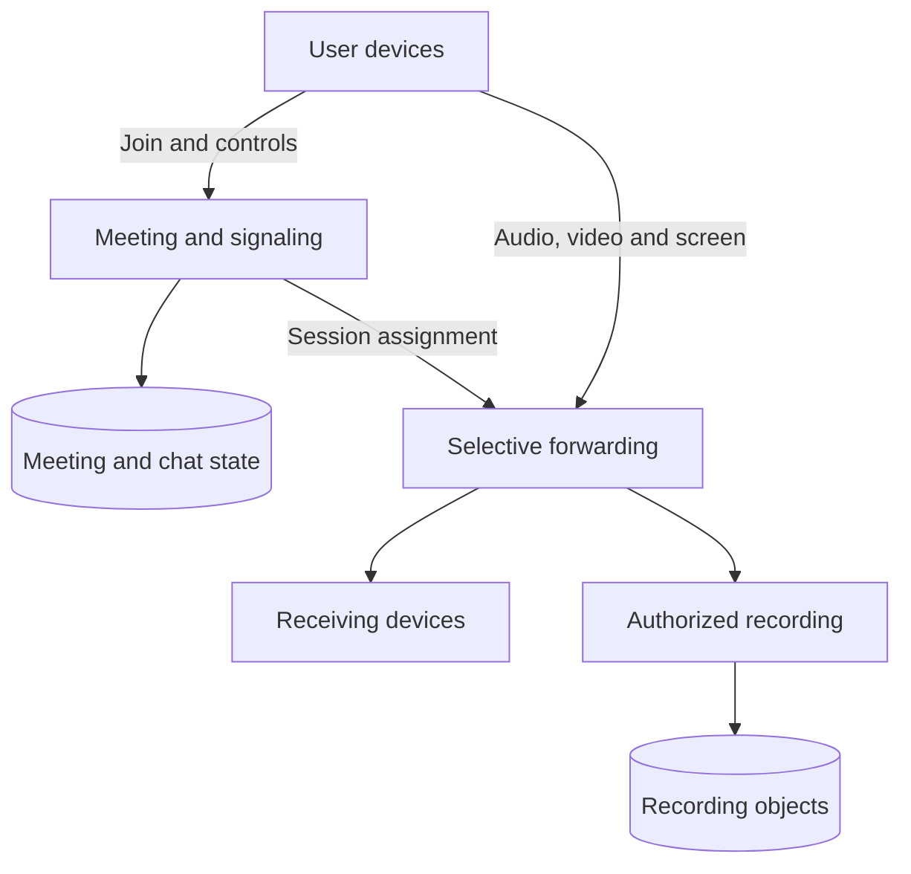
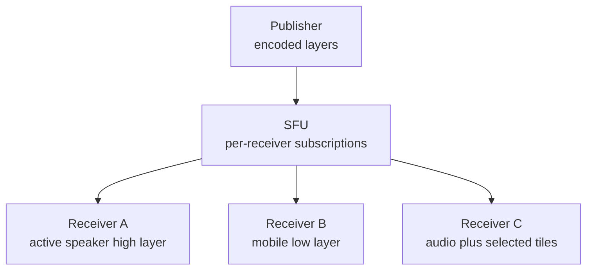

Design of a meeting service with live audio, video, screen sharing, chat and optional recording.

<!--more-->

## Problem

Users need to join a meeting quickly, hear each other clearly and share content across home, mobile and corporate networks. Each participant has a different connection and device, so the service must adapt the streams delivered to each receiver.

Meeting setup and host controls use a reliable application connection. Audio and video use a separate real-time transport, where late packets can be less useful than a lower-quality frame delivered on time.

## Requirements

### Functional requirements

- **Manage meetings:** create and join meetings, maintain the participant roster and enforce host permissions.
- **Exchange media:** publish microphone and camera streams and subscribe to other participants.
- **Share a screen:** publish a separate track with resolution and frame rate suited to the content.
- **Adapt quality:** select video layers and prioritize audio as network conditions change.
- **Chat and react:** deliver meeting messages and lightweight reactions.
- **Record a meeting:** capture authorized tracks and make the completed recording available to permitted users.

### Non-functional requirements

Design targets:

- **Scale:** 10M concurrent participants, including meetings with up to 1,000 participants.
- **Latency:** media under 150ms glass-to-glass at p95 for supported regional network conditions; join within three seconds at p95.
- **Availability:** 99.9% for meeting setup; target media recovery within five seconds after a single forwarding-node failure.
- **Security:** authenticated meeting access, encrypted transport and an explicit end-to-end encryption option.
- **Resilience:** reduce video quality and preserve audio during congestion; display reconnection state when a path fails.

Intercontinental propagation, device encoding and restrictive networks can exceed the latency target. Webinars, telephone dial-in and breakout rooms are outside this design.

## Back-of-the-envelope calculations

- **Media ingress:** 10M × 2Mbps average uplink = 20Tbps, before transport overhead.
- **Subscriptions:** a fully subscribed 20-person meeting has 20 × 19 = 380 receiver/stream relationships. Egress depends on visible tiles and their selected bitrates.
- **Relay traffic:** if 10% of participants relay 2Mbps in each direction, TURN carries about 4Tbps across those directions. Measure the actual relay share and downstream bitrate mix.
- **Recording:** 5M recordings/day × 45 minutes × 1.5Mbps / 8 ≈ 2.5PB/day for one retained track per recording. Isolated multi-track recording multiplies this by the retained track count.

Bandwidth, recording retention and per-meeting fan-out determine capacity; server counts require measured forwarding throughput.

## Core entities

- **Meeting:** access policy, host and current lifecycle state.
- **Participant:** identity and permissions within a meeting.
- **Media session:** the participant's transport and forwarding assignment.
- **Recording:** retained track objects, consent and processing state.

```protobuf
message Meeting {
  string meeting_id;
  string host_user_id;
  string status;
  string encryption_mode;         // Transport or end_to_end
  Timestamp created_at;
}

message Participant {
  string participant_id;
  string meeting_id;
  string user_id;
  string role;
  bool recording_consent;
}

message MediaSession {
  string session_id;
  string participant_id;
  string forwarding_node;
  int64 assignment_epoch;          // Reject stale control commands
  repeated string published_tracks;
}

message Recording {
  string recording_id;
  string meeting_id;
  string status;
  repeated string track_objects;
  Timestamp started_at;
}

message ChatMessage {
  string message_id;
  string meeting_id;
  string sender_id;
  int64 sequence;
  string body;
}
```

## API

```yaml
POST /v1/meetings:
  body: {access_policy: object, encryption_mode: string}
  response: {meeting_id: string, join_url: string}

POST /v1/meetings/{meeting_id}/join:
  body: {user_token: string, device_capabilities: object}
  response: {participant_id: string, session_token: string, signaling_url: string}

WebSocket /v1/meetings/{meeting_id}/signal:
  commands: [offer, answer, ice_candidate, subscribe, host_control, chat, reaction]
  envelope: {command_id: string, session_epoch: integer, payload: object}

POST /v1/meetings/{meeting_id}/recordings:
  headers: {Idempotency-Key: recording-request}
  response: {recording_id: string, status: starting}

POST /v1/recordings/{recording_id}/stop:
  response: {status: processing}

GET /v1/recordings/{recording_id}:
  response: {status: string, authorized_download_url: string}
```

WebRTC carries negotiated media tracks. Signaling commands have IDs and sequence-aware replay; repeated delivery produces the same logical result.

## High-level design

The meeting service authorizes users and assigns media sessions. A selective forwarding unit (SFU) receives encoded tracks and forwards suitable layers to subscribers. Recording workers and chat storage are separate from media forwarding.


```mermaid
flowchart TB
    U["User devices"] -->|"Join and controls"| M["Meeting and signaling"]
    M --> D[("Meeting and chat state")]
    M -->|"Session assignment"| S["Selective forwarding"]
    U -->|"Audio, video and screen"| S
    S --> R["Receiving devices"]
    S --> W["Authorized recording"]
    W --> O[("Recording objects")]
```

## Storage

- **PostgreSQL:** meeting metadata, host permissions, recording jobs and retained chat messages need durable updates and indexed access by meeting. Message IDs deduplicate retries; a meeting-local sequence supports replay.
- **Redis:** active session routing, roster snapshots and presence are short-lived coordination state. Forwarding nodes can continue an established media session during a temporary control-store outage.
- **Object storage:** immutable recording segments, manifests and final outputs support large sequential writes and authorized downloads. A manifest identifies the segments that completed before an interruption.
- **Durable job queue:** recording finalization and retention work are replayable jobs, separate from the live meeting.

Chat retention follows the meeting policy. Media packets remain in bounded transport and retransmission buffers; recording is an explicit operation.

## From request to response

### Joining a meeting

The client authenticates and submits the meeting ID. The meeting service checks access and capacity, creates a participant session and returns a short-lived signaling token and forwarding assignment.

The client exchanges its media capabilities and session description through signaling, gathers ICE candidates and checks connectivity. [ICE](https://www.rfc-editor.org/rfc/rfc8445) selects a working candidate pair; TURN provides a relay path where direct connectivity fails. Once transport security is established, the client publishes its tracks and subscribes to others.

A reconnect reuses the participant identity with a newer session epoch. Commands from the old session are rejected.

### Sending and receiving audio and video

The client encodes media into negotiated layers. The SFU tracks subscriptions, feedback and available bitrate, then forwards the selected layers to each receiver. Receivers buffer briefly, decode and render.

Audio receives priority during congestion. Forwarding all camera streams at full quality grows downstream bandwidth rapidly; selective subscriptions and layer selection address that cost.

### Sharing a screen

A user with permission publishes a screen track alongside the camera. The client selects encoding settings appropriate to text or motion, and the SFU adjusts subscribers' layouts and layer choices.

Stopping sharing unpublishes that track. Host controls request a permitted action; device permissions and the user's microphone/camera controls remain enforced by the client.

### Sending chat and reactions

The signaling service validates membership and assigns a sequence to a retained chat message before acknowledging it. Repeated message IDs return the existing result. Reconnecting clients request messages after their last sequence.

Reactions are short-lived events and can tolerate loss. Separating their retention prevents high reaction rates from expanding the durable chat log.

### Recording a meeting

The host starts an authorized recording and participants see its state and consent requirements. A recording subscriber receives permitted tracks, writes segments and records progress in a manifest. Finalization assembles the output and updates the recording status.

Transport-encrypted meetings can support a trusted cloud recorder. End-to-end encrypted meetings require an explicitly authorized key-holding recorder or client-side recording, according to the meeting policy.

## Deep dives

### Which media topology fits group meetings?

A group call creates many subscriptions, and users have limited uplink and decoding capacity.

- **Peer-to-peer mesh:** simple for small calls, but each sender uploads separate copies to other participants.
- **Server mixing:** produces a composite stream and reduces client decoding work, while adding server decode/encode cost.
- **Selective forwarding — recommended:** forward encoded streams and choose subscriptions and layers per receiver.

The [RTP topology specification](https://www.rfc-editor.org/rfc/rfc7667.html) distinguishes these forwarding and mixing approaches. Use simulcast or scalable video coding supported by the clients, and bound the number of visible video subscriptions.

Switch to a decodable layer at an appropriate keyframe or codec-defined switching point. RTP sequence handling alone does not make every layer switch seamless. Forwarders keep bounded retransmission buffers and request keyframes when required.

**What the SFU forwards**

A publisher encodes several layers or simulcast streams and sends them once to its assigned SFU. The SFU maintains receiver subscriptions: active-speaker high quality for one user, a low-resolution tile for another. It forwards encoded packets from the selected decodable stream instead of decoding and recompositing every frame.

For a mesh of N participants, each publisher sends up to N-1 copies. With forwarding, the publisher sends a bounded set of encoded layers; server egress still scales with subscriptions and must be budgeted.


```mermaid
flowchart TB
    P["Publisher<br>encoded layers"] --> S["SFU<br>per-receiver subscriptions"]
    S --> A["Receiver A<br>active speaker high layer"]
    S --> B["Receiver B<br>mobile low layer"]
    S --> C["Receiver C<br>audio plus selected tiles"]
```

On a layout change, the receiver requests a new subscription. The SFU switches at a codec-valid point and uses a keyframe request when necessary. Keep bounded packet history for retransmission; a packet whose playback deadline passed is dropped rather than indefinitely queued. Measure sender uplink, SFU egress and receiver decode load separately.

### How do meetings survive restrictive networks?

A direct UDP path gives useful latency, but firewalls and NAT behavior vary.

- **Direct transport only:** low relay cost with incomplete connectivity.
- **Relay every session:** simplifies connectivity at higher bandwidth cost.
- **ICE with relay fallback — recommended:** test supported candidates and select a working path.

Deploy TURN near users, require short-lived credentials and monitor allocations, relay bandwidth and transport mix. TCP or TLS fallback can help restrictive networks, with head-of-line blocking affecting media latency.

An ICE restart establishes a replacement path after a network change. Retrying signaling alone does not repair a failed media transport.

**Connection establishment and network change**

Signaling exchanges transport credentials and candidate addresses. ICE connectivity checks test candidate pairs and nominate a working path; TURN supplies relay candidates when direct transport cannot connect.

```text
Signaling exchange → candidate gathering → connectivity checks → nominated pair
Network changes    → ICE restart with new credentials/candidates
```

The media path carries authenticated encrypted transport independently of signaling. A healthy WebSocket does not imply healthy audio/video. Keep metrics for candidate type, RTT, loss and relay use so connectivity failures can be localized.

TURN allocations require bounded lifetimes and short-lived credentials, with per-user abuse limits. A TCP/TLS fallback improves reachability but can delay newer media behind a lost packet. Test enterprise firewalls and Wi-Fi-to-mobile handoff with real clients. After a path changes, adapt congestion estimates instead of immediately sending the old high bitrate over the new link.

### How do we keep quality consistent across receivers?

A fast connection and a congested mobile connection can subscribe to the same publisher.

- **One fixed quality:** easy to operate, poorly suited to heterogeneous receivers.
- **Transcode separately for each receiver:** flexible, with substantial compute and latency cost.
- **Layer selection and feedback — recommended:** choose a layer per subscription and adjust published bitrate when necessary.

Use receiver feedback, queue delay and packet loss to estimate available capacity. Allocate audio first, then screen content or the active speaker, then other tiles. Bound the jitter buffer and retransmission deadline so old packets do not prolong congestion.

Load tests cover loss, bursty delay, mobile handoff and changing subscription layouts. Measure frozen-frame time and audio interruptions alongside bitrate.

**Allocate bandwidth per receiver**

Estimate a receiver's available budget from transport feedback and queue delay. Reserve audio first, then screen content/active speaker, then selected secondary tiles. Choose existing encoded layers that fit that budget and request sender adaptation when none is feasible.

```text
Receiver budget
  → audio reservation
  → active speaker / screen share
  → secondary tiles within remaining capacity
```

Use hysteresis for upgrades so small fluctuations do not repeatedly switch layers. Downgrade sooner when loss or queue delay rises, and bound retransmission against playout deadlines. The jitter buffer absorbs limited variation at the cost of added delay; growing it without limit preserves old packets while ruining conversation latency.

Feedback is per subscription, so a slow receiver does not automatically force all participants to the same quality. Sender CPU/uplink limits still constrain the available layers. Test the full interaction under loss and bursts, reporting audio gaps and frozen-frame time in addition to average bitrate.

### How do we route a meeting across regions?

One region is operationally simple, but users far from that region pay extra propagation delay.

- **Single meeting region:** fewer relay relationships and easier state ownership.
- **Every participant on a local SFU:** short access paths, with more cross-region coordination.
- **Regional SFU groups — recommended:** keep participants on nearby nodes and relay only subscribed streams between regions.

Meeting placement accounts for geography, capacity and data-residency requirements. A controller assigns sessions; media nodes retain enough current state to continue forwarding during a controller restart.

On SFU failure, clients receive a new assignment, establish a new transport and republish or resubscribe. Capacity reserves and regional admission limits keep failover from overloading healthy nodes. The recovery target remains a measured objective, rather than a guarantee for every network.

**A cross-region subscription**

Assign each participant to a nearby capacity-qualified SFU. If users in another region subscribe to a publisher, relay the required encoded layers once between regional nodes and fan them out locally.

```text
Publisher → local SFU → regional relay → remote SFU → remote subscribers
```

The controller owns versioned assignments; media nodes own active packet forwarding. If the controller restarts, established media can continue from retained session state. If a media node fails, its clients need new transport credentials, publication/subscription setup and fresh decodable frames.

Reserve failover capacity before accepting meetings at the advertised target. A new assignment epoch fences stale control decisions so a delayed controller response cannot send a client back to a failed owner. Data-residency constraints can override nearest-region placement; expose that policy instead of presenting geographic locality as an unconditional guarantee.

### How does end-to-end encryption change recording and trust?

Transport encryption secures each client/server leg. End-to-end encryption additionally protects media payloads from the forwarding service.

- **Transport encryption:** supports trusted server-side processing.
- **Client-managed media encryption:** protects content from servers, with key-distribution and feature constraints.
- **Explicit meeting modes — recommended:** select the trust model before joining and expose its recording policy.

Use a reviewed group-key protocol and rotate keys as membership changes. The SFU retains only the routing metadata required for forwarding. [Zoom's cryptography whitepaper](https://github.com/zoom/zoom-e2e-whitepaper) provides a concrete group-call design; its protocol details should be treated as a versioned reference.

A member who receives media keys can access that meeting's media. Membership verification, consent and client security therefore remain part of the trust model.

**Trust boundaries and recording**

In transport-encrypted mode, the SFU terminates the transport and trusted server recording can process payloads. In client-managed media encryption mode, forwarding uses routing metadata while payload decryption belongs to authorized meeting members.

```text
Transport-only: client ↔ trusted media service ↔ client
End-to-end:     authorized clients share media keys;
               forwarding service handles encrypted payloads
```

Membership changes trigger the protocol's group-key update. A removed member should not receive future keys; previously received keys or decoded media remain part of the prior trust exposure. Authenticate the roster and host actions so signaling manipulation cannot silently add a receiver.

If E2EE recording is required, use an explicitly authorized recording participant/client under the chosen trust policy, rather than claiming the SFU can decrypt transparently. Display the mode and consent before joining. Verify key-rotation and late-join behavior against the reviewed protocol version; a generic “encrypted” label does not explain who can access the content.
