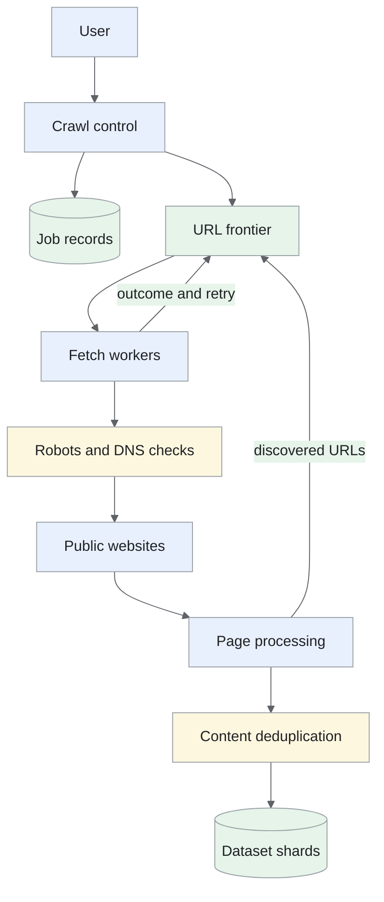
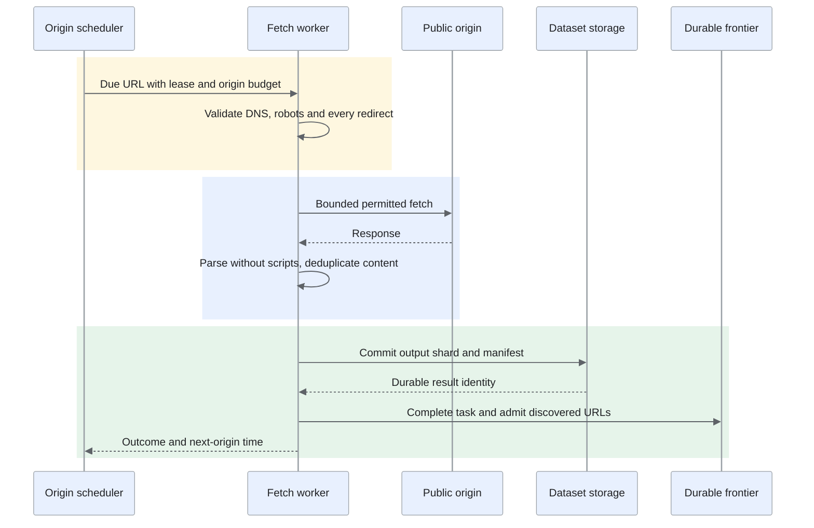
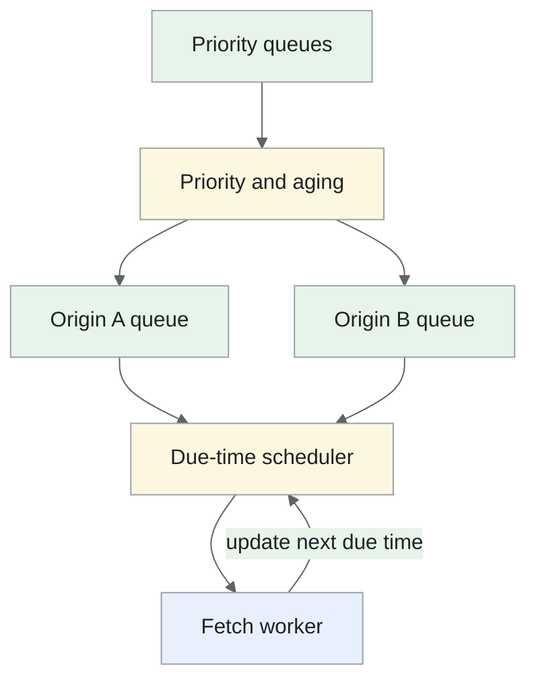
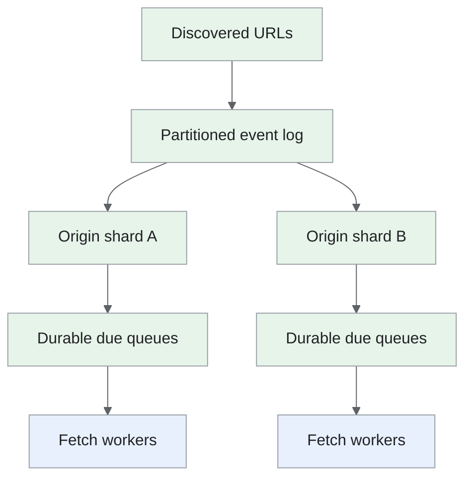
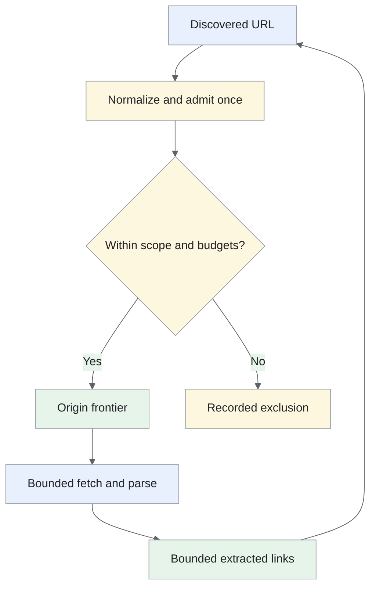

Crawl public web pages, extract text and links, and produce a recoverable dataset while respecting each site's access rules and capacity.

<!--more-->

## Problem

A user submits seed URLs and a crawl scope. The crawler fetches eligible pages, extracts their text and follows discovered links until it reaches the job's limits.

The difficulty is coordinating that work across many websites. One site may respond quickly, another may be unavailable, and a calendar can generate an effectively unlimited set of URLs. Scheduling needs to keep workers busy while controlling requests to each origin.

## Requirements

### Functional requirements

- **Start a crawl:** accept seeds, allowed domains, depth and page/byte limits.

- **Collect pages:** fetch HTML, extract main text and discover eligible links.

- **Avoid repeated work:** track fetched URLs and exact duplicate content; identify near-duplicates separately.

- **Control jobs:** pause, resume, cancel, inspect failures and export a dataset manifest.

- **Respect sites:** evaluate robots.txt and per-origin request budgets with an identifiable user agent.

### Non-functional requirements

- **Scale:** plan for 10B pages over five days, subject to site policies, available bandwidth and crawl scope.

- **Durability:** resume accepted work after a worker failure without losing completed results.

- **Politeness:** enforce origin concurrency and minimum delays across worker ownership changes.

- **Security:** fetch only approved public HTTP(S) targets; bound response size, redirects and parser resources.

- **Coverage:** preserve distinct URLs when duplicate detection is uncertain; measure near-duplicate precision and recall.

Authenticated pages, browser-executed applications and content licensing decisions are outside this crawler. Dataset use requires its own permissions and retention policy.

## Back-of-the-envelope calculations

- **Fetch rate:** 10B / 432,000s ≈ 23.1K pages/s.

- **Network:** 500KB/page × 23.1K/s ≈ 11.6GB/s, or 93Gb/s before protocol overhead and retries.

- **Extracted text:** 10B × 2KB = 20TB; raw HTML at 500KB/page would be 5PB.

- **URL state:** 10B × 60 bytes = 600GB before index, replication and storage overhead.

- **Bloom filter:** 10 bits/URL needs 12.5GB for 10B URLs. It accelerates membership checks; the durable URL index decides uniqueness.

Worker count depends on fetch duration, connection limits, parsing CPU and output throughput, rather than bandwidth alone.

## Core entities

- **CrawlJob** defines the seeds, scope and resource budget.

- **URLTask** records discovery, due time and recoverable execution state.

- **OriginState** coordinates robots rules, delay and worker ownership.

- **PageResult** preserves the source URL and points to committed dataset content.

```protobuf
message CrawlJob {
  string job_id;
  repeated string seeds;
  repeated string allowed_domains;
  int64 page_limit;
  int64 byte_limit;
  string state;                     // Running, paused, cancelled or complete.
}
message URLTask {
  string job_id;
  string url;                       // Unique within the job after safe normalization.
  string origin;
  int32 depth;
  Timestamp next_fetch_at;
  string state;
  int64 lease_epoch;
}
message OriginState {
  string origin;
  Timestamp next_allowed_at;
  Timestamp robots_expires_at;
  string owner;
  int64 lease_epoch;                 // Reject writes from an older owner.
}
message PageResult {
  string job_id;
  string url;
  string final_url;
  int32 http_status;
  bytes content_sha256;
  string dataset_shard;
  int64 shard_offset;
  Timestamp fetched_at;
}

```
## API

```yaml
POST /crawls:
  body: {seeds: [], allowed_domains: [], max_depth: integer, page_limit: integer, byte_limit: integer}
  result: {job_id: id, state: running}
GET /crawls/{job_id}:
  result: {state: string, fetched: integer, failed: integer, bytes: integer}
POST /crawls/{job_id}/pause:
  result: {state: pausing}
POST /crawls/{job_id}/resume:
  result: {state: running}
POST /crawls/{job_id}/cancel:
  result: {state: cancelling}
GET /crawls/{job_id}/results:
  result: {manifest_url: signed-url, checkpoint: id}

```

Control operations are idempotent. A pause completes after active fetches finish or time out and their state is checkpointed.

## High-level design

The control service persists jobs and seed tasks. A distributed frontier schedules URLs by origin and due time. Fetchers retrieve pages, processors extract text and links, and committed output feeds both the dataset and further discovery.


## Storage

- **[PostgreSQL](/designs/tech-postgresql/):** jobs, scope, control state and committed dataset manifests. Job changes use transactions and version checks.

- **Distributed URL index:** hash-partitioned durable key-value storage, such as Bigtable, keyed by job and normalized URL. Conditional insertion admits each URL once; states retain retry and completion information.

- **[Kafka](/designs/tech-kafka/):** discovery and result events keyed by origin or URL as appropriate. It transports work; a FIFO log alone does not implement a due-time scheduler.

- **RocksDB-backed frontier shards:** per-origin queues, priority and due-time indexes. Replicated changelogs/checkpoints recover queue state and consumer offsets together.

- **Object storage:** compressed, batched text/HTML shards plus manifests. Upload complete shards before publishing their references; garbage-collect abandoned uploads after a recovery grace period.

- **Deduplication index:** exact content hashes and a separate near-duplicate candidate index. Bloom filters are rebuildable accelerators.

Keeping one tiny object per page would produce billions of storage operations. Sharded output reduces that overhead while retaining a URL-to-result lookup.

## From request to response

### Fetch and commit flow



The scheduler owns per-origin timing, and a worker fetches only while its lease and safety checks permit it. A task becomes complete after its result is recoverable; discovered links use independent conditional admission, allowing retry without duplicate scheduling or lost frontier work.

### Discovering and admitting URLs

Resolve relative links against the page's final URL. Lowercase the scheme and hostname, remove fragments and normalize default ports. Preserve path case, trailing slashes and query parameters unless a verified site-specific rule establishes equivalence.

Check scheme, scope, depth and resource limits. Consult the Bloom filter, then use the URL index's conditional insert to admit new work. A positive filter result requires a durable lookup; a negative result still needs a conditional insert because discoveries can race.

Broad normalization can merge different pages. Crawl-trap controls instead bound repeated path patterns, parameter combinations and per-origin discovery volume.

### Scheduling and fetching

The origin owner selects a due URL, confirms a valid lease and reserves its concurrency budget. Before connecting, validate the resolved IP against allowed public ranges and recheck every redirect target. Pin the validated address for that connection to reduce DNS-rebinding risk.

Evaluate robots rules before fetching content. Under [RFC 9309](https://www.rfc-editor.org/rfc/rfc9309), unreachable robots.txt requires a conservative disallow state; a missing file can permit access. Cache rules with bounded freshness. An optional Crawl-delay is a site-policy extension, not a standardized RFC directive.

Fetch with connection/read deadlines, redirect and response-size limits. Parse HTML with script execution disabled. Record status and retry time; honor applicable Retry-After guidance and reduce origin load after throttling or errors.

### Committing a page

Extract text, calculate an exact content digest and search the near-duplicate index when needed. Preserve URL provenance even when multiple URLs share stored content.

Append the result to an output shard and commit its manifest before marking tasks complete. Replayed processing uses the same task/result identity. Discovered links enter durable admission independently, so a crash can resume without losing the next frontier.

### Pausing and recovering

Stop issuing new leases, allow bounded in-flight work to finish, then checkpoint queues, origin delays and offsets. Resume restores those states before dispatch.

A replacement owner waits out the old origin's lease and maximum fetch duration, or confirms that the old worker drained, before starting requests. Epoch checks prevent stale completion writes; the drain interval protects the website from overlapping fetches.

## Deep dives

### How do we balance useful work with polite crawling?

**Problem:** one global FIFO queue can leave many workers waiting behind URLs from the same website.

- **Global FIFO:** Dispatch URLs in arrival order. The queue is simple, but many URLs for one delayed origin can block useful work for others and origin fairness is weak.

- **Local dual queues:** Separate priority selection from per-origin due time in one scheduler. Politeness and useful work are explicit; one owner limits total dispatch capacity.

- **Sharded origin schedulers — recommended:** Assign one fenced owner per origin and run priority/aging plus due-time queues on each shard. Scheduling scales across origins; ownership changes and checkpoint recovery must preserve delays and in-flight leases.

**Local dual-queue scheduling**

[The URL-frontier model](https://nlp.stanford.edu/IR-book/html/htmledition/the-url-frontier-1.html) separates URL priority from per-host timing. Priority selection feeds origin queues; a due-time heap selects an origin that can currently be fetched.



**Distributed frontier**

**Recommendation:** shard by origin and run the dual-queue scheduler within each shard. Add aging so lower-priority URLs make progress. Discovery topics have a fixed partition count; ownership changes rebuild scheduler state from checkpoints and its changelog. The crawler needs parallel progress across many sites while honoring each site's limits. We accept durable scheduler ownership and recovery work so adding workers does not multiply permitted load on one origin.



Origin ownership also includes a concurrency cap and delay policy. Sites sharing infrastructure may need an additional IP-level budget. Monitor queue age, active origins, fetch rate and throttling, rather than treating fast responses as evidence of spare server capacity.

**Dispatching one origin safely.** Each origin queue has a next-eligible time, concurrency count and ownership epoch. The scheduler pops the earliest eligible origin, reserves one fetch slot durably and returns a URL with the current epoch. Completion releases that slot and updates the next due time according to robots policy, configured delay and any source throttling.

If origin A has 10,000 queued URLs and origin B has ten, A's delay makes it temporarily ineligible while B can still progress. Priority chooses useful URLs within the eligible set; aging raises old work so low-priority origins are not indefinitely ignored.

After owner failure, the successor restores queues, due times and outstanding reservations from the checkpoint/changelog and fences old dispatch state. Already-started HTTP requests cannot be recalled, so recovery preserves a conservative delay/concurrency grace period before issuing replacements. Avoid resetting every origin to immediately eligible on restart.

Robots refreshes and IP-level limits are additional eligibility checks. Store the policy generation with the dispatch decision so an operator can explain why a URL was fetched or deferred.

### Which duplicate checks are safe?

**Problem:** URLs and content have different forms of duplication.

- **URL normalization and conditional insertion:** Normalize only established equivalences and insert each fetch target once. Repeated discovery is handled, but different URLs can still contain identical content.

- **Exact content digests:** Hash the recorded raw or normalized content representation. Identical outputs can share storage; meaningful normalization must be specified and near-duplicates still differ.

- **Exact checks plus near-duplicate retrieval — recommended:** Use exact URL/content identities first, then retrieve SimHash/MinHash candidates for verification. Similar pages can be grouped; thresholds can merge distinct meaning or miss variations and therefore require corpus evaluation.

**Recommendation:** use exact URL/content checks first, then approximate retrieval for near-duplicates. Verify candidate distance and meaningful text differences before collapsing results. Preserve uncertain candidates and their source URLs. Scheduling identity and content identity answer different questions. We accept a separate approximate candidate stage and preserve URL provenance, verifying meaningful differences before collapsing near-duplicate results.

A Bloom-filter false positive must not discard a unique page. Near-duplicate indexes also need bounded, measured candidate search: splitting a 64-bit signature into four 16-bit buckets can create large candidate lists at billions of pages. Partition and index those signatures deliberately; report recall when search is capped.

**Admission and content deduplication.** Canonicalize a discovered URL under explicit rules, then conditionally insert its job/URL key. Lowercasing the hostname is generally safe; dropping arbitrary query parameters can change the resource, so only remove documented tracking parameters. Redirect destinations are discovered/admitted separately while retaining the redirect chain.

After fetching, hash the recorded normalized text for exact duplicate content. Store raw/source identities too: two URLs with identical extracted text can have different attribution or crawl policies. A Bloom-filter positive triggers an exact lookup rather than automatic rejection.

Near-duplicate candidates pass a bounded verification step. For example, two product pages differing only in boilerplate may be near-duplicates, but a changed price or safety notice can be meaningful. Record the normalization/signature version and decision so rebuilding the index reproduces it. Limit candidate work and preserve uncertain pages instead of silently equating a capped search with proof of uniqueness.

### How do we avoid crawl traps and retry storms?

**Problem:** calendars, session identifiers and generated paths can expand faster than useful pages are collected.

- **Depth-only limits:** Stop beyond a configured link depth. Control is easy, but calendars or session URLs can create an unlimited shallow graph.

- **Per-origin budgets and pattern controls — recommended:** Bound fetches, bytes, parameter combinations and repeated templates, with categorized retry budgets. Resource use is explicit; legitimate large sites can be truncated and exclusions must be reported.

- **Novelty-based scheduling:** Prioritize URLs likely to produce new content. Useful-work yield can improve, but unusual low-frequency pages may receive insufficient exposure and the signal needs evaluation.

**Recommendation:** enforce explicit budgets and pattern limits, then use measured novelty as a scheduling signal. Back off failures with jitter and a retry budget; separate DNS failures, throttling and permanent HTTP outcomes. A crawler must remain bounded even when a site generates endlessly changing URLs. We accept explicit coverage limits and recorded exclusions, using novelty to prioritize within those bounds rather than as the only safety control.

Keep reasons for exclusions and failures in the job report. Fetch deadlines, parser memory limits and maximum extracted links bound the work caused by one hostile page. Recovery tests should include a failed owner, duplicated events, an interrupted shard upload and a robots-policy change.

**A bounded crawl expansion.** A calendar page can expose a link to every future date. Track per-origin URL count, total bytes, depth, parameter cardinality and repeated templates. If dates advance indefinitely with little new content, apply the configured pattern budget and record why the remaining URLs were excluded.



Fetch workers impose connect/read deadlines, compressed and decoded byte limits, and parser memory/link limits. A compressed response can expand far beyond its transfer size, so enforce both limits. Retry only transient outcomes with jitter and origin budgets. A failed fetch remains a recorded failed result; repeated rediscovery does not reset its retry history and create a new storm.
