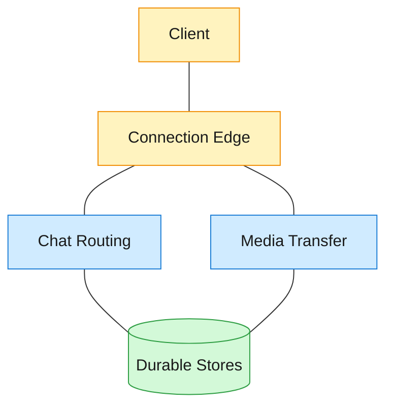
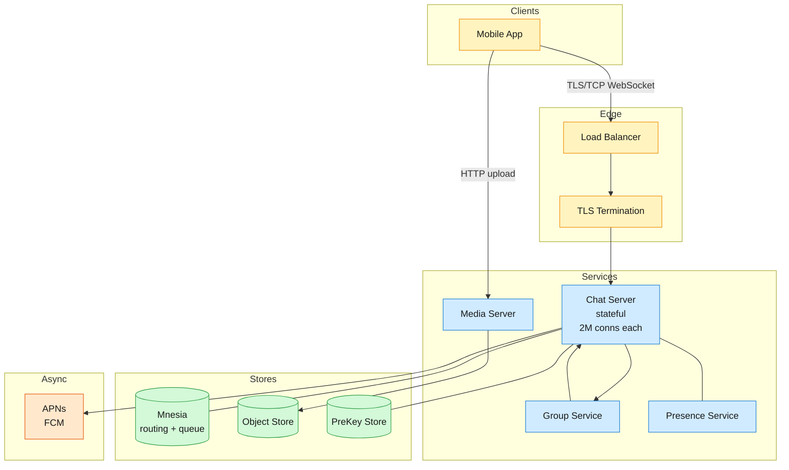

A global messaging platform serving 3B+ users who exchange over 100B messages and 10 PB of media daily.

<!--more-->

## 1. Problem

A global messaging platform serving 3B+ users who exchange over 100B messages and 10 PB of media daily. Users expect sub-second delivery to online recipients, durable delivery to offline ones, end-to-end encryption that keeps all plaintext inaccessible to the server, and presence indicators for contacts. The system must handle 450M concurrent connections at peak with a small operational footprint.



## 2. Requirements

**Functional**

- FR1: Send and receive text messages in 1:1 chats.
- FR2: Send and receive messages in group chats (up to 1,024 members).
- FR3: Share media attachments (images, video, voice, documents).
- FR4: View message delivery and read receipts.
- FR5: View contact online presence and last-seen status.

**Non-functional**

- NFR1: End-to-end encrypted — server never accesses message plaintext.
- NFR2: At-least-once delivery; no accepted message is permanently lost.
- NFR3: Sub-second delivery latency for online recipients.
- NFR4: Survive 2M concurrent connections per server; scale horizontally.

*Out of scope: Multi-device sync, audio/video calling, status stories, business interactions.*

## 3. Back of the envelope

- **Message peak:** ~100B msgs/day ÷ 86.4k s × 3 (peak multiplier) ≈ 3.5M msgs/sec → the write and fan-out path is the bottleneck.
- **Concurrent connections:** ~3B users × 15% online at peak ≈ 450M → ~225 servers at 2M connections each; server count stays a manageable operational concern.
- **Media ingestion:** ~10 PB/day → the media store is the storage bottleneck; media dwarfs text payloads by ~1000x.

## 4. Entities

```
Message {
  message_id:   uuid PK
  chat_id:      uuid CK        ← partitions conversation history
  sender_id:    uuid FK
  ciphertext:   blob           ← encrypted body, opaque to server
  seq_num:      bigint         ← monotonic per-chat ordering
  created_at:   timestamp
}

InboxEntry {
  user_id:      uuid CK        ← partition key for per-user queue
  message_id:   uuid PK
  chat_id:      uuid
  sender_id:    uuid
  status:       enum           ← pending, delivered, read
  created_at:   timestamp
  ttl:          30 days        ← auto-expire undelivered messages
}

Chat {
  chat_id:      uuid PK
  chat_type:    enum           ← direct, group
  member_ids:   uuid[]         ← denormalized for fan-out
  group_name:   string?
  created_at:   timestamp
}

MediaBlob {
  media_id:     uuid PK
  content_hash: string         ← SHA-256; dedup key
  blob_ref:     string         ← S3 object key
  ref_count:    integer        ← garbage-collect at zero
  size_bytes:   bigint
  ttl:          30 days
}

User {
  user_id:      uuid PK
  phone_hash:   string
  last_seen:    timestamp
  created_at:   timestamp
}

PreKeyBundle {
  user_id:      uuid CK
  device_id:    uuid CK
  identity_key: blob
  signed_prekey: blob
  one_time_prekeys: blob[]
}
```

### API

- `CONNECT` via persistent WebSocket — establish bidirectional session; server returns assigned `session_id`
- `SEND_MESSAGE {chat_id, ciphertext, message_id}` — send encrypted message to chat
- `SEND_ACK {message_id, status}` — confirm delivery (`delivered`) or read (`read`)
- `POST /media/upload` — upload encrypted media blob; returns `media_id`
- `GET /media/{media_id}` — download encrypted media blob
- `PUT /presence` — update online/offline status; server publishes to contacts

## 5. High-Level Design



#### FR1: Send and receive text messages in 1:1 chats

**Components:** Mobile App → Load Balancer → Chat Server (stateful Erlang process) → Mnesia (routing table + offline queue) → Recipient's Chat Server → Recipient App

**Flow:**

1. Sender app encrypts plaintext with the recipient's Signal Protocol session key, producing a `ciphertext` blob.
1. App sends `SEND_MESSAGE {chat_id, ciphertext, message_id}` over the persistent WebSocket.
1. Chat Server looks up the recipient's server assignment from the Mnesia routing table (`user_id → server_id`).
1. **Hot path (recipient online, server reachable):** Chat Server forwards the message directly to the recipient's Chat Server process, which pushes it over the recipient's persistent WebSocket. No disk I/O.
1. **Cold path (recipient offline):** Chat Server writes an `InboxEntry` row (ciphertext, sender_id, chat_id, status=pending) to the durable offline queue, then dispatches a push notification via APNs or FCM to wake the recipient's device.
1. On reconnect, the recipient's Chat Server reads all `InboxEntry` rows for that user with `status=pending`, ordered by `created_at`, and streams them over the WebSocket.
1. Recipient app decrypts the ciphertext, displays the message, and sends `SEND_ACK {message_id, status=delivered}`.
1. Server deletes the `InboxEntry` on `delivered` ACK; the message data now lives only on the client devices.

**Design consideration:** The two-path delivery (direct server-to-server for online, offline queue for disconnected) keeps the hot path pure in-memory, with zero persistence or disk I/O, so delivery is sub-millisecond within the same cluster. The offline queue acts as a 30-day buffer; entries expire via TTL if the recipient never reconnects. The `message_id` (sender-generated UUID) serves as the idempotency key: a duplicate `SEND_MESSAGE` with the same `message_id` is silently dropped.

#### FR2: Send and receive messages in group chats

**Components:** Sender App → Chat Server → Group Service → Per-member Chat Server fan-out → Member Apps

**Flow:**

1. Sender app encrypts the message once using the group's Sender Key (see DD2 and DD4), producing a single `ciphertext`.
1. App sends `SEND_MESSAGE {chat_id, ciphertext, message_id}` over the WebSocket.
1. Chat Server forwards to the Group Service process responsible for this `chat_id`.
1. Group Service reads the member list from the `Chat.member_ids` field (loaded in Mnesia memory), resolves each member's current Chat Server from the routing table, and fans out the ciphertext concurrently to all online members' Chat Servers.
1. Each recipient's Chat Server pushes the ciphertext over the persistent WebSocket.
1. For offline members: Group Service writes one `InboxEntry` per offline member (same ciphertext, same message_id).
1. Each member's app decrypts independently with the group Sender Key and sends individual `delivered`/`read` ACKs back.

**Design consideration:** The sender encrypts once regardless of group size (O(1) client-side work). Server-side fan-out uses lightweight concurrent processes — each member delivery is an independent fire-and-forget push, so a single slow recipient does not block the others. The Group Service process holds the member list in memory for microsecond lookups. On membership change, the member list is updated and all participants rotate their Sender Keys (see DD2 and DD4).

#### FR3: Share media attachments

**Components:** Sender App → Media Server → Object Storage (media path); Sender App → Chat Server (message path)

**Flow:**

1. Sender app generates a random AES-256 key, encrypts the media file client-side.
1. App uploads the encrypted blob to the Media Server via `POST /media/upload`.
1. Media Server computes the SHA-256 hash of the encrypted blob and checks for an existing `MediaBlob` with that `content_hash`. If found, it increments `ref_count` and returns the existing `media_id`. Otherwise, it stores the blob in S3, creates a new `MediaBlob` row with `ref_count=1`, and returns the new `media_id`.
1. App sends a thin text message over the chat path (FR1 or FR2) containing the `media_id` and the AES-256 key (encrypted within the Signal Protocol ciphertext).
1. Recipient app receives the thin message, extracts `media_id`, and downloads the encrypted blob via `GET /media/{media_id}`.
1. Recipient decrypts with the AES-256 key, renders the media.

**Design consideration:** The media path is fully separated from the chat path. The Chat Server never touches media bytes — it only routes the thin message containing the `media_id`. This keeps the message hot path (3.5M msgs/sec) unburdened by multi-MB blob transfers. Client-side encryption ensures the Media Server stores only ciphertext. Content-hash deduplication means a forwarded meme stored once serves thousands of recipients; `ref_count` tracks how many chat threads reference the blob, and the blob is eligible for deletion when `ref_count` reaches zero.

> [!WARNING]
> **Dedup on encrypted blobs:** Two users who independently upload the same image will produce different ciphertexts (different AES keys, different IVs), so dedup works only on forwarded media — where the same ciphertext blob is reused. This is an inherent trade-off of client-side encryption: the server cannot see the plaintext to do semantic dedup.

#### FR4: View message delivery and read receipts

**Components:** Recipient App → Chat Server → Sender's Chat Server → Sender App

**Flow:**

1. On receiving a message push over WebSocket, the recipient app sends `SEND_ACK {message_id, status=delivered}`.
1. Recipient's Chat Server forwards the ACK to the sender's Chat Server (via routing table lookup).
1. Sender's Chat Server pushes the `delivered` status update to the sender's WebSocket; sender's app displays a "delivered" indicator.
1. When the recipient opens the conversation, the app sends `SEND_ACK {message_id, status=read}`.
1. The read ACK follows the same routing path; sender's app updates the indicator to "read."

**Design consideration:** ACKs are fire-and-forget at each hop — a lost ACK between servers is recovered by the durability layer (the `InboxEntry` still exists with `status=pending` and is re-delivered on reconnect; the recipient re-ACKs). The `message_id` on the ACK lets the sender's server match it to the original send. The three states (sent, delivered, read) are tracked entirely in-memory on the Chat Servers — only the initial message write to the offline queue is durable, and that row is deleted on the `delivered` ACK.

#### FR5: View contact online presence and last-seen status

**Components:** App → Chat Server → Presence Service → Contact Apps

**Flow:**

1. App sends a heartbeat over the WebSocket every 30 seconds. The Chat Server forwards `{user_id, timestamp}` to the Presence Service.
1. Presence Service stores each user's last heartbeat timestamp in a sorted in-memory structure and publishes a status change (`online`) to the pub/sub channels of that user's contacts when they first connect.
1. When a user's heartbeats stop (TTL expires after 90 seconds), Presence Service marks the user `offline`, updates `User.last_seen` to the last heartbeat timestamp, and publishes the status change to contacts.
1. On connect, the Chat Server subscribes to presence updates for the user's contact list and pushes any initial statuses to the app.

**Design consideration:** Presence is soft-state — heartbeats are best-effort UDP-style notifications. If a heartbeat is dropped, the 90-second TTL window absorbs the gap before marking a user offline. The 30-second interval and 90-second TTL balance responsiveness against server load: at 450M concurrent connections, 15M heartbeats/sec. A per-user sorted set with TTL-based eviction keeps the working set in memory while auto-purging stale entries.

## 6. Deep dives

### DD1: Message delivery and durability

**Problem.** Messages must reach recipients reliably across flaky mobile networks, multi-hour offline periods, and server failures. At 3.5M msgs/sec peak, every redundant disk write or retransmission multiplies infrastructure cost. The server must delete messages after confirmed delivery since plaintext is never available server-side. The challenge is at-least-once delivery without the server holding plaintext, while keeping the hot path at sub-millisecond latency for the 50%+ of messages where both parties are online.

**Approach 1: In-memory offline queue with per-user partition**

Each Chat Server holds a partition of the offline queue as an in-memory table, keyed by `{user_id, message_id}`, backed by an append-only commit log for crash recovery. The queue is an LSM-tree on SSD — writes are sequential appends (fast), reads are point lookups by `user_id` (fast with a bloom filter).

- **Online path (hot):** Both parties connected to servers within the same cluster — the message is forwarded directly between Erlang processes with no disk writes or persistence, so delivery is sub-millisecond.
- **Offline path (cold):** Recipient's server is unreachable or the recipient is disconnected. The sender's server writes the message to the recipient's offline queue partition. A push notification is dispatched to wake the device.
- **Reconnect path:** Recipient's app connects with its last known `seq_num`. The server scans the offline queue for entries with `seq_num > last_seen`, streams them in order, and the client ACKs each. ACKed entries are deleted from the queue.
- **Challenges:** The offline queue working set must fit in RAM for low-latency scans on reconnect. A 30-day TTL keeps the queue bounded — messages older than 30 days are reclaimed at compaction time. The 98% cache-hit rate for recent messages (most reconnects happen within hours) means the working set is small relative to total capacity.

**Approach 2: Three-state ACK pipeline for exactly-once delivery**

Each message progresses through three server-tracked states:

1. **SENT:** Server has accepted the message from the sender and written it to the recipient's offline queue. Sender sees a "sent" indicator.
1. **DELIVERED:** Recipient's app has received the message over WebSocket and sent an ACK. The server deletes the offline queue entry. Sender sees a "delivered" indicator.
1. **READ:** Recipient opened the conversation and the app sent a read ACK. Sender sees a "read" indicator. The read state is a lightweight metadata flag — the message content is already gone from the server.

```sql
-- Write on message receipt
INSERT INTO inbox (user_id, message_id, chat_id, sender_id, ciphertext, status, created_at)
VALUES ($recipient, $msg_id, $chat_id, $sender, $ct, 'pending', now());

-- On delivered ACK
DELETE FROM inbox WHERE user_id = $recipient AND message_id = $msg_id;

-- On read ACK (lightweight metadata only)
UPDATE message_status SET read_at = now()
WHERE message_id = $msg_id AND sender_id = $sender;
```

- **Challenges:** A lost ACK between servers means the inbox entry persists and is re-delivered on the next reconnect. The client uses `message_id` as a dedup key — if it sees a message it has already processed, it sends the ACK again and discards the duplicate. This gives at-least-once delivery with client-side dedup approximating exactly-once.

**Approach 3: Binary wire protocol for bandwidth efficiency**

A compact binary framing replaces verbose text-based protocols. Common tokens (stanza types, attribute names, JID domains) are encoded as single-byte dictionary codes. A short text message compresses from ~180 bytes in XML to ~20 bytes on the wire.

- **Challenges:** The token dictionary is shared between client and server — adding new tokens requires coordinated rollout. The benefit is a 50-70% bandwidth reduction, which is critical for users on 2G networks and metered data plans.

**Decision:** In-memory offline queue (Approach 1) plus the three-state ACK pipeline (Approach 2) plus binary wire encoding (Approach 3). The three mechanisms are complementary layers, not alternatives.

**Rationale:** At 3.5M msgs/sec, the architecture's key insight is keeping the common case (both parties online) at zero I/O — direct process-to-process forwarding. The offline queue exists only for the minority of messages where the recipient is disconnected. The ACK pipeline bounds the server's retention window: a message lives on the server for seconds (online) to hours (offline reconnection), then is deleted. The binary protocol reduces the per-message tax on bandwidth, CPU, and battery. Together, these three layers let ~225 servers handle 3B users.

**Edge cases:**

- **Duplicate delivery (lost ACK):** Client deduplicates by `message_id`. Only the first delivery is processed; subsequent deliveries trigger a re-ACK.
- **Reconnection storm:** When a network partition heals, thousands of clients reconnect simultaneously. Each Chat Server applies per-user exponential backoff with jitter on the reconnect handshake to smooth the load spike.
- **Server crash:** The offline queue is backed by an append-only commit log. On restart, the server replays the log to rebuild the in-memory queue state. Messages written but not yet fanned out to recipient servers are replayed as well.

> [!TIP]
> **Key insight:** The offline queue is the durability anchor. Real-time delivery (process-to-process, pub/sub) is a best-effort nudge — if it fails, the message is still in the inbox and arrives on the next reconnect. This decouples latency from durability.

> [!TIP]
> **Why not a message broker?** Kafka would persist every message — even the 50%+ delivered instantly — adding disk I/O and replication overhead to the hot path. The inbox pattern persists only the minority of messages that need it, keeping the fast path pure in-memory.

### DD2: Group messaging at scale

**Problem.** A message to a 1,024-member group requires 1,024 deliveries. With pairwise encryption (Double Ratchet per recipient), the sender would encrypt the message 1,024 times and transmit 1,024 distinct ciphertexts — O(n) client CPU and bandwidth. Server-side fan-out must be concurrent to avoid head-of-line blocking where one slow recipient stalls the entire group.

**Approach 1: Server-side fan-out via lightweight concurrent processes**

The Group Service fans out each group message to members' Chat Servers as concurrent, independent sends. Each member delivery is its own lightweight process — if one member's server is slow or unreachable, the other 1,023 deliveries proceed unimpeded.

```javascript
Sender App → Chat Server → Group Service
                                │
                    ┌───────────┼───────────┐
                    ▼           ▼           ▼
               Member A     Member B     Member C
               CS Process   CS Process   CS Process
```

- **Normal path:** Group Service reads the member list (cached in memory), resolves each member's Chat Server from the routing table (microsecond Mnesia lookup), and dispatches the ciphertext to each member's server via Erlang message passing. For offline members, the ciphertext goes to the offline queue (see DD1).
- **Edge case (partial failure):** If a member's Chat Server is unreachable, the Group Service writes the message to that member's offline queue and moves on. The delivery retries on reconnect.

**Approach 2: Sender Keys for O(1) encryption**

Instead of encrypting the message N times with N pairwise Double Ratchet sessions, the sender encrypts once with a symmetric Sender Key shared with all group members.

```python
# Setup: distribute Sender Key to each member's devices
# (runs once per member-add, using pairwise Double Ratchet)
def distribute_sender_key(group_id, sender_id, member_devices):
    chain_key = os.urandom(32)           # 32-byte seed
    sign_key = nacl.sign.SigningKey.generate()
    sender_key_msg = pack(chain_key, sign_key.verify_key)

    for device in member_devices:
        session = get_double_ratchet_session(device)
        device.send(session.encrypt(sender_key_msg))

# Each subsequent message: encrypt once, ratchet forward
def encrypt_group_message(plaintext, chain_key, sign_key):
    msg_key = HKDF(chain_key, salt=b"msg")      # derive per-message key
    chain_key = HKDF(chain_key, salt=b"chain")   # advance chain
    iv = os.urandom(16)
    ciphertext = AES_CBC_encrypt(plaintext, msg_key, iv)
    signature = sign_key.sign(ciphertext)
    return ciphertext, signature, chain_key      # single blob for all members
```

- **Forward secrecy:** The hash ratchet on the Chain Key is one-way — compromising the current Chain Key reveals future message keys but never past ones.
- **Member removal:** When a member leaves, all remaining participants discard their Sender Keys and re-establish. The new Sender Key is distributed only to remaining members via pairwise Double Ratchet — the departed member cannot decrypt new messages.

**Approach 3: Read-based fan-out for very large groups**

For groups above ~1,024 members, fan-out on write becomes expensive: the sender's Group Service process must touch thousands of member servers. An alternative is fan-out on read: write the message once to a group feed, and have members pull on reconnect or poll periodically.

- **Pro:** Write cost is O(1) regardless of group size.
- **Con:** Adds latency — online members don't get an instant push. Requires a polling infrastructure. Breaks the real-time expectation for smaller groups.

**Decision:** Server-side fan-out (Approach 1) with Sender Keys (Approach 2) for groups up to 1,024. Read-based fan-out (Approach 3) is reserved for broadcast-style channels if needed beyond the 1,024 limit.

**Rationale:** At WhatsApp's scale, the vast majority of groups have fewer than 256 members. Server-side fan-out via lightweight processes handles 256-member groups comfortably — 256 concurrent Erlang message sends complete in microseconds. Sender Keys make the client-side cost O(1) per message regardless of group size, which is critical on mobile where CPU and battery are constrained. The 1,024-member cap keeps Sender Key re-distribution (on member churn) bounded: a member join/leave triggers at most 1,023 pairwise Double Ratchet encryptions to distribute the new key.

**Edge cases:**

- **Member churn (join):** New member gets the current Sender Key encrypted over a pairwise Double Ratchet session. Existing members continue using the current key.
- **Member churn (leave):** All remaining members discard their Sender Keys. Everyone re-establishes — each remaining member distributes a new Sender Key to the other members. For a 256-member group, this is ~256 × 255 pairwise encryptions, amortized across all members.
- **Large fan-out skew:** A member on a slow 2G connection does not block the group — the Group Service sends concurrently and the slow member's message lands in the offline queue for later delivery.

> [!TIP]
> **Key insight:** The combination of server fan-out and Sender Keys decouples the sender's cost from group size. The sender does O(1) work; the server does O(n) fan-out in parallel. This is the only arrangement that keeps group messaging fast on the sender's device while handling groups of hundreds.

### DD3: Media sharing

**Problem.** Media bandwidth dwarfs text messaging: 10 PB ingested daily, with peak output bandwidth of ~30 Gbps. Routing multi-MB blobs through the Chat Server saturates the message hot path, which is tuned for sub-millisecond text delivery at 3.5M msgs/sec. The media path must be separated, and storage cost must be controlled through deduplication.

**Approach 1: Separate media path with direct-to-storage upload**

The client uploads media directly to a dedicated Media Server over HTTP, bypassing the Chat Server entirely. The Chat Server sees only a thin message containing a `media_id` reference.

```javascript
Sender App ──HTTP POST /media/upload──→ Media Server ──→ Object Storage
     │
     └──WebSocket SEND_MESSAGE {media_id, key}──→ Chat Server ──→ Recipient
                                                                      │
                              Recipient App ←──HTTP GET /media/{id}───┘
```

- **Upload:** App encrypts the media file with a random AES-256 key, uploads the ciphertext to the Media Server. The server stores the blob in object storage, records the content hash for dedup, and returns a `media_id`.
- **Download:** Recipient app fetches the blob via HTTP GET, decrypts with the key from the thin message. The Media Server can serve directly or redirect to a CDN edge for popular content.
- **Challenges:** The Media Server becomes a bandwidth funnel if every download hits it directly. CDN caching (with short-lived signed URLs) distributes the load for popular blobs. For unpopular blobs (the long tail), direct serve from object storage with an edge cache is sufficient.

**Approach 2: Client-side encryption with server-opaque blobs**

The server stores and forwards ciphertext it cannot decrypt. This preserves the E2E guarantee: a compromised Media Server yields zero plaintext.

- **Normal path:** Sender generates a fresh AES-256 key per upload, encrypts the file, uploads the ciphertext. The key is transmitted inside the Signal Protocol ciphertext over the chat path — the Chat Server cannot read it either.
- **Edge case (key loss):** If the thin message with the AES key is lost (recipient offline, message expires), the media blob is unrecoverable. The `MediaBlob` has a 30-day TTL; if no thin message references it within that window, the blob is garbage-collected.

**Approach 3: Content-hash deduplication**

When multiple users share the same media (forwarded memes, viral videos), the server stores one copy and reference-counts it. The dedup key is the SHA-256 hash of the encrypted blob.

```python
def handle_upload(encrypted_blob):
    h = sha256(encrypted_blob)
    existing = db.query("SELECT media_id, ref_count FROM media WHERE content_hash = ?", h)
    if existing:
        db.execute("UPDATE media SET ref_count = ref_count + 1 WHERE content_hash = ?", h)
        return existing.media_id
    else:
        media_id = uuid4()
        s3.put_object(Key=media_id, Body=encrypted_blob)
        db.execute("INSERT INTO media (...) VALUES (...)", media_id, h, ref_count=1)
        return media_id
```

- **Challenges:** The dedup works only on identical ciphertext blobs — two users who independently photograph the same scene will produce different ciphertexts (different AES keys, different IVs). The effective dedup rate applies primarily to forwarded media, where the same ciphertext blob is reused.

**Decision:** Separate media path (Approach 1) with client-side encryption (Approach 2) and content-hash dedup (Approach 3). All three are kept as complementary layers.

**Rationale:** Removing the Chat Server from the media path is the non-negotiable starting point — at 10 PB/day, media traffic would overwhelm the message routing infrastructure. Client-side encryption follows from the E2E requirement (NFR1). Dedup by content hash reclaims significant storage on forwarded content without the server needing plaintext access.

**Edge cases:**

- **Upload interrupted:** Client retries with a fresh upload. If the first upload partially completed, the orphaned blob is garbage-collected when no `MediaBlob` row points to it and TTL expires.
- **Chunked upload for large files:** Files above ~10 MB are split into chunks, each uploaded independently with a manifest. The thin message carries the manifest reference.
- **Reference count races:** Two simultaneous uploads of the same content hash both see `ref_count=0` and both create a `MediaBlob` row. The unique constraint on `content_hash` ensures only one row survives; the duplicate blob in S3 is garbage-collected.

> [!TIP]
> **Key insight:** The media path and chat path are independent failure domains. If the Media Server is degraded, text messaging continues unaffected. The thin message (under 1 KB) is the only coupling point — it carries the `media_id` and the decryption key, both opaque to the Chat Server.

> [!TIP]
> **Why not stream through the chat server?** At 3.5M msgs/sec for text, the Chat Server processes are CPU-bound on message routing. Adding 30 Gbps of media pass-through would require 10× the servers and introduce head-of-line blocking where a 5 MB video delays the text messages queued behind it.

### DD4: End-to-end encryption

**Problem.** Messages must be unreadable to the server, the network, and the storage infrastructure. The encryption must work asynchronously (Alice can message Bob while Bob is offline), provide forward secrecy (compromising today's keys does not expose yesterday's messages), and scale to groups without O(n) per-message overhead.

**Approach 1: X3DH for asynchronous key agreement**

Every client generates a long-term Identity Key, a medium-term Signed Prekey (rotated periodically), and a pool of one-time Prekeys (100 per batch). These are uploaded to the PreKey Store as a bundle.

When Alice first messages Bob (who may be offline):

```javascript
Alice fetches Bob's prekey bundle from server
  ┌─────────────────────────────────────────┐
  │ IK_B (identity), SPK_B (signed prekey), │
  │ OPK_B (one-time prekey, if available)   │
  └─────────────────────────────────────────┘

Alice computes shared secret via 3-4 DH operations:
  DH1 = DH(IK_A, SPK_B)
  DH2 = DH(EK_A, IK_B)       ← EK_A is fresh ephemeral
  DH3 = DH(EK_A, SPK_B)
  DH4 = DH(EK_A, OPK_B)      ← if OPK available
  RootKey = KDF(DH1 || DH2 || DH3 || DH4)
```

The `RootKey` seeds the Double Ratchet. Bob, on receiving Alice's initial message (which includes her ephemeral public key `EK_A`), performs the same DH operations using his private keys to derive the same `RootKey`.

- **Asynchronous:** Bob does not need to be online. Alice fetches his prekey bundle from the server, performs the handshake, and sends the first message — Bob computes the shared secret when he comes online and receives it.
- **Deniability:** Either party could have generated the ephemeral keys used in the handshake. Neither side can cryptographically prove the other participated.

**Approach 2: Double Ratchet for per-message forward secrecy**

After X3DH establishes the `RootKey`, the Double Ratchet derives a unique key for every message. It combines two mechanisms:

**Symmetric ratchet (hash chain) — forward secrecy:**

```python
def symmetric_ratchet(chain_key):
    msg_key = HMAC_SHA256(chain_key, b"\x01")     # per-message key
    next_chain_key = HMAC_SHA256(chain_key, b"\x02")  # advance
    return msg_key, next_chain_key
```

Each message consumes one `msg_key` and advances the chain. Since the hash is one-way, compromising the current `chain_key` reveals future keys but never past ones — hence forward secrecy.

**DH ratchet — post-compromise security:**

Every message from Alice includes a fresh DH public key. When Bob receives it, he performs a DH with his own keypair, mixing the output into the root key:

```python
def dh_ratchet(their_dh_public, our_dh_private, root_key):
    dh_output = DH(our_dh_private, their_dh_public)
    new_root = HMAC_SHA256(root_key, dh_output || b"\x01")
    new_chain = HMAC_SHA256(root_key, dh_output || b"\x02")
    return new_root, new_chain
```

After one round trip, fresh DH entropy is introduced that an attacker who compromised the previous state cannot derive — the session "heals."

- **Message encryption:** `ciphertext = AES-256-CBC(plaintext, msg_key, random_iv)`, authenticated with an HMAC.
- **Out-of-order delivery:** The Double Ratchet handles skipped messages by advancing the chain key forward and storing skipped message keys (up to a configurable window) for later decryption.

**Approach 3: Sender Keys for O(1) group encryption**

Groups use Sender Keys (see DD2 for the fan-out side, here for the cryptographic side): each sender generates a per-group Chain Key and Signing Key pair, distributes them to all group members via pairwise Double Ratchet sessions, then encrypts each subsequent group message once with the Chain Key.

```python
# Per-message encryption (identical mechanism to symmetric ratchet)
msg_key = HMAC_SHA256(chain_key, b"\x01")
chain_key = HMAC_SHA256(chain_key, b"\x02")
ciphertext = AES-256-CBC(plaintext, msg_key, iv)
signature = Ed25519_Sign(sign_key, ciphertext)
```

- **Forward secrecy:** Same hash ratchet as the Double Ratchet — compromising the current Chain Key cannot recover past `msg_key` values.
- **Member removal:** On member departure, all participants discard their Sender Keys. The departing member can no longer decrypt new messages because the new Sender Key is distributed only to remaining members.
- **Sender authentication:** The Ed25519 signature on each ciphertext proves the message came from the claimed sender, preventing in-group impersonation.

**Decision:** Full Signal Protocol: X3DH (Approach 1) for session establishment, Double Ratchet (Approach 2) for 1:1 forward secrecy, and Sender Keys (Approach 3) for O(1) group encryption.

**Rationale:** X3DH is the only asynchronous key agreement that provides forward secrecy and deniability without requiring both parties to be online simultaneously — essential for mobile messaging. The Double Ratchet's combination of symmetric hash ratchet (forward secrecy) and DH ratchet (post-compromise security) gives both properties with per-message granularity. Sender Keys keep group encryption O(1) at the sender, critical for mobile battery and CPU. The server stores only ciphertext and public key material — a full server compromise yields no plaintext.

**Edge cases:**

- **Prekey exhaustion:** If Bob's one-time prekey pool is depleted (Alice is the 101st person to message him since his last upload), the handshake falls back to 3-DH without the one-time prekey. Forward secrecy still holds via the ephemeral key.
- **Identity key change:** If Bob reinstalls the app (new Identity Key), Alice sees a "security code changed" notification. She must manually verify the new identity before the session continues.
- **Group key rotation on member leave:** All remaining members discard Sender Keys and re-establish with each other. The departing member's pairwise Double Ratchet sessions are also terminated, preventing them from being re-added silently.

> [!TIP]
> **Key insight:** The encryption architecture is layered: X3DH establishes the session, Double Ratchet rotates keys per message for 1:1 chats, and Sender Keys abstract groups into a single symmetric session per sender. The server's role is limited to storing and forwarding ciphertext blobs and public key material — it is cryptographically excluded from the plaintext at every layer.

> [!TIP]
> **Why not server-side encryption?** If the server held the keys, a compromise would expose every message ever sent. Client-held keys with per-message ratcheting mean the server stores only ciphertext — even a total infrastructure breach yields no plaintext. This is the fundamental difference between privacy-by-policy and privacy-by-cryptography.

## 7. References

1. Rick Reed. (2014). ["That's Billion with a B: Scaling WhatsApp"](https://www.infoq.com/presentations/whatsapp-scalability/). Erlang Factory SF.
1. Rick Reed. (2012). ["Scaling to Millions of Simultaneous Connections"](http://www.erlang-factory.com/upload/presentations/558/efsf2012-whatsapp-scaling.pdf). Erlang Factory SF.
1. WhatsApp Security Whitepaper. (2026). ["WhatsApp Encryption Overview"](https://www.whatsapp.com/security/WhatsApp-Security-Whitepaper.pdf).
1. Meta Engineering. (2021). ["How WhatsApp enables multi-device capability"](https://engineering.fb.com/2021/07/14/security/whatsapp-multi-device/).
1. Signal Protocol. ["The X3DH Key Agreement Protocol"](https://signal.org/docs/specifications/x3dh/).
1. Signal Protocol. ["The Double Ratchet Algorithm"](https://signal.org/docs/specifications/doubleratchet/).
1. Maxim Fedorov. (2020). [Erlang OTP 23: pg module replaces pg2](https://erlang.org/download/OTP-23.0). Erlang OTP Team.
