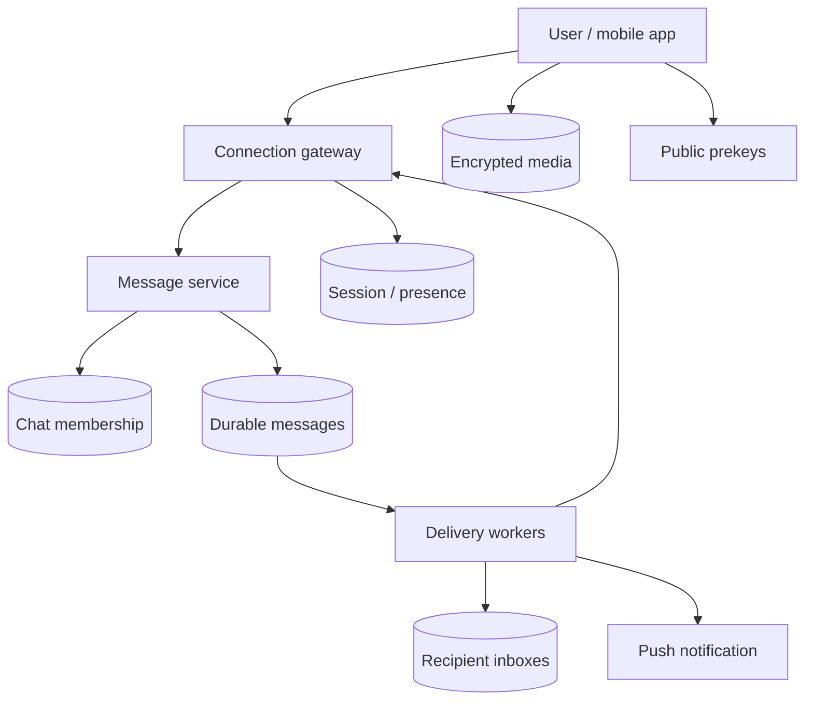
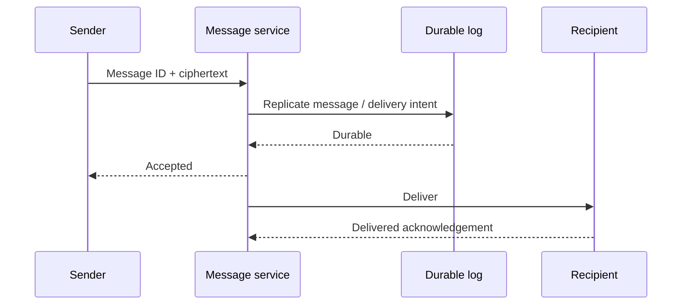
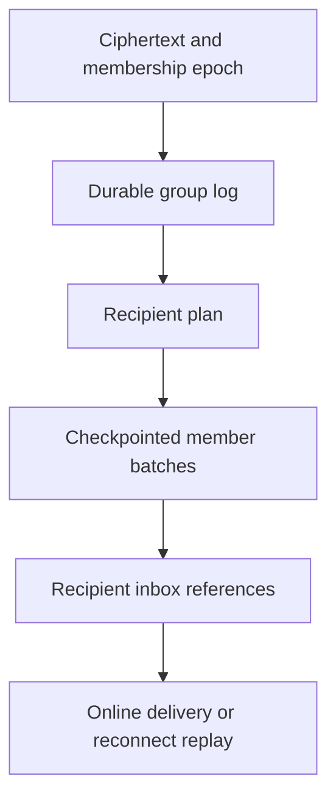

Design of an encrypted messaging service for direct chats, group messages, media sharing and delivery receipts.

<!--more-->

## Problem

Users expect a message to arrive promptly when the recipient is online and to remain available when they reconnect later. Mobile connections can disappear during a send, so the service must distinguish durable acceptance from delivery and support safe retries.

Message content is encrypted on the devices. The server routes ciphertext and retains pending deliveries; clients manage encryption keys, decryption and local message history.

## Requirements

### Functional requirements

- **Direct and group chats:** send text messages, including groups of up to 1,024 members.
- **Media sharing:** upload encrypted images, videos, voice recordings and documents.
- **Receipts:** show accepted, delivered and read states, subject to user privacy settings.
- **Presence:** show online and last-seen information to permitted contacts.

Multi-device synchronization, calls and status stories are outside this design.

### Non-functional requirements

Design targets:

- **Latency:** online delivery p95 below one second within supported network conditions.
- **Delivery:** at-least-once attempts until recipient acknowledgement or the documented retention deadline.
- **Durability:** acknowledge acceptance after the message and delivery intent are durably replicated.
- **Privacy:** message and media plaintext remain on authorized devices; protect routing metadata separately.
- **Availability:** 99.99% for message acceptance and reconnect delivery.
- **Scale:** assume 100B messages/day and 450M concurrent connections at peak.

## Back-of-the-envelope calculations

- **Messages:** 100B/day ≈ 1.16M/s average, or 3.5M/s at 3× peak, before group fan-out.
- **Connections:** 450M × 16 KB assumed connection state ≈ 7.2 TB across gateways, before runtime overhead.
- **Heartbeats:** 450M connections ÷ 30 seconds ≈ 15M heartbeats/s; batch and stagger processing.
- **Media:** an assumed 10 PB/day ≈ 116 GB/s average ingress, or roughly 926 Gbit/s before replication.
- **Pending messages:** size storage from message bytes, recipient fan-out and measured offline duration rather than assuming every message remains for the full 30-day limit.

Gateway capacity depends on memory, CPU, TLS and reconnect load; benchmark connections per node instead of treating a fixed count as guaranteed.

## Core entities

```protobuf
message Message {
  string message_id; // Stable across sender retries.
  string chat_id;
  string sender_id;
  int64 sequence;
  int64 membership_version;
  bytes ciphertext;
  Timestamp accepted_at;
}

message Delivery {
  string recipient_id;
  string message_id;
  string state; // Pending, delivered or read.
  Timestamp expires_at;
}

message Chat {
  string chat_id;
  string type;
  repeated string member_ids;
  int64 membership_version;
}

message Media {
  string media_id;
  string object_key;
  bytes ciphertext_hash;
  int64 size_bytes;
  Timestamp expires_at;
}

message PublicKeyBundle {
  string user_id;
  bytes identity_key;
  bytes signed_prekey;
  repeated bytes one_time_prekeys;
}
```

Private keys remain on the client. A media decryption key travels inside the encrypted chat message.

## API

```yaml
connection:
  transport: authenticated_websocket
send:
  frame: SEND_MESSAGE
  fields: {message_id: string, chat_id: string, membership_version: integer, ciphertext: bytes}
  response: {state: accepted, sequence: integer}
receipt:
  frame: ACK
  fields: {message_id: string, state: delivered_or_read}
resume:
  frame: RESUME
  fields: {cursor: opaque_token}
media_upload:
  method: POST
  path: /media/uploads
  response: {media_id: string, upload_url: string}
prekeys:
  method: GET
  path: /users/{user_id}/prekeys
  response: {public_bundle: object}
```

Message IDs are scoped to the authenticated sender. Changed ciphertext under an existing ID is rejected.

## High-level design

Connection gateways own live sockets. Message services validate membership and durably accept ciphertext, then delivery workers route it to active sessions or retain it for reconnect. Media transfers use a separate storage path.


```mermaid
flowchart TB
  U["User / mobile app"] --> G["Connection gateway"]
  G --> M["Message service"]
  M --> C[("Chat membership")]
  M --> D[("Durable messages")]
  D --> F["Delivery workers"]
  F --> G
  F --> I[("Recipient inboxes")]
  F --> P["Push notification"]
  G --> R[("Session / presence")]
  U --> O[("Encrypted media")]
  U --> K["Public prekeys"]
```

## Storage

- **Sharded PostgreSQL:** users, group membership versions and public prekey inventories; one-time prekey claims use atomic updates.
- **Partitioned durable message log:** accepted ciphertext and recipient-delivery intent, ordered by chat. A quorum-backed log or Cassandra-based message service can support this workload; ordering and conditional writes must be implemented explicitly.
- **Cassandra inbox partitions:** pending message references by recipient and time bucket, with bounded retention. Fan-out workers checkpoint after durable writes and tolerate replay.
- **Redis:** live connection routing and presence leases. Gateways can rebuild this soft state after failure.
- **Object storage / CDN:** encrypted media objects and integrity hashes, served through authorized, short-lived URLs.

Delivery receipts are durable metadata until their own retention deadline. Message bodies can be reclaimed after required acknowledgements and retention checks.

## From request to response

### Sending and reconnecting

The sender encrypts locally and submits a stable message ID. The message service checks chat membership, records the ciphertext and recipient set durably, and returns accepted. Delivery workers write pending recipient references and notify the recipient's gateway.

The recipient stores the message locally, deduplicates by ID and acknowledges delivery. Reconnect requests resume the pending inbox with a cursor; a lost acknowledgement produces another delivery attempt and another acknowledgement.

Direct socket delivery alone would leave a failure window after acceptance. Persisting delivery intent first adds a write but provides a reliable recovery path.

### Group messages

The service validates the membership version used for the send, assigns a chat sequence and records the recipient set for that version. Workers fan out independently so one disconnected member does not delay others.

Client-side sender-key distribution occurs through authenticated pairwise sessions. Membership changes establish a new key epoch; remaining members receive the keys needed for subsequent messages.

### Media, receipts and presence

The sender encrypts a media object, uploads it and verifies completion before publishing its reference and key inside a chat message. Recipients fetch and verify the ciphertext before decrypting locally.

Receipts progress monotonically and survive routing retries. Presence uses renewable leases and privacy-filtered subscriptions; an expired lease shows the user as offline.

## Deep dives

### Reliable delivery across disconnects

**Problem.** Either socket endpoint can disappear after the server accepts a message.

**Options.** Memory-only forwarding, persistence only for offline users, or durable acceptance for all messages. Detecting that a recipient is online does not establish that delivery will complete.

**Recommendation.** Persist every accepted message and delivery intent, then attempt low-latency forwarding. Replay unfinished fan-out and pending inbox entries after failures.


```mermaid
sequenceDiagram
  participant S as Sender
  participant M as Message service
  participant D as Durable log
  participant R as Recipient
  S->>M: Message ID + ciphertext
  M->>D: Replicate message / delivery intent
  D-->>M: Durable
  M-->>S: Accepted
  M->>R: Deliver
  R-->>M: Delivered acknowledgement
```

Client deduplication makes repeated network delivery appear once in the local conversation. Define the retention expiry outcome explicitly and track acceptance-to-delivery latency, pending age and reconnect backlog.

**Durable recipient inbox.** The sender assigns a stable message ID before sending. Acceptance appends ciphertext and a recipient-delivery plan durably; the server responds only after that boundary. A fan-out worker writes a unique recipient/message reference and advances its checkpoint after the reference is durable.

On reconnect, the recipient requests inbox entries after its persisted cursor. The client stores the message locally before acknowledging delivery. If the acknowledgement is lost, the same reference is redelivered and the local unique message ID prevents another visible copy.

Delivered and read are separate states. A read receipt is an explicit client event, not an inference from the gateway having written bytes to a socket. If retention expires before delivery, record an expired outcome and show the documented behavior. Large replay backlogs are paginated and rate-limited so reconnecting offline clients do not overwhelm live delivery.

### Efficient group fan-out

**Problem.** A group message needs delivery to many members, including disconnected clients.

**Options.** Encrypt separately for every recipient, use a per-sender group key with server fan-out, or let members pull a shared encrypted log.

**Recommendation.** Use sender-key encryption and asynchronous per-member delivery for bounded chat groups. Store one ciphertext body with recipient references; checkpoint fan-out progress so a worker can resume after a crash. The cryptographic setup cost still grows with membership.

A removed member retains old keys but receives no keys for the new epoch. Validate membership changes and pending sends consistently, and monitor fan-out queue age and per-group throughput. Large broadcast channels can use pull-based delivery with online notifications.

**Fan-out across membership changes.** Record the group membership epoch with the accepted message. The delivery plan uses that validated epoch, giving the worker a stable recipient set instead of rereading a mutable group halfway through fan-out. Recipient references are idempotent under group/message/member keys.


```mermaid
flowchart TB
  M["Ciphertext and membership epoch"] --> L["Durable group log"]
  L --> P["Recipient plan"]
  P --> B["Checkpointed member batches"]
  B --> I["Recipient inbox references"]
  I --> G["Online delivery or reconnect replay"]
```

A removal advances membership and the cryptographic sender-key epoch according to protocol. New messages use the new epoch; old ciphertext and previously learned keys retain their original access implications. Pending acceptance must compare the validated membership version before committing. This prevents a worker from deciding authorization from a stale cache after removal.

For a very large broadcast channel, shared-log pull avoids millions of per-member writes, but it needs a different read-access and retention policy from bounded private groups.

### Keeping media transfer separate

**Problem.** Large files can consume bandwidth and queue capacity intended for message delivery.

**Options.** Relay bytes through chat gateways, use a separate media service, or upload directly to object storage.

**Recommendation.** Use direct signed uploads and downloads of encrypted objects, with a media service authorizing access and checking completion. Transfer and retry chunks independently for large files.

Identical ciphertext can be reused for authorized forwarding. Independently encrypted copies usually have different hashes, so plaintext-level deduplication is unavailable to the server. Scope reuse checks to permitted objects to avoid exposing whether another user uploaded particular content. Garbage collection accounts for delivery retention, references and an orphan grace period.

**Encrypted object lifecycle.** The client encrypts media with a randomly generated content key, uploads ciphertext through a scoped URL, and sends the ciphertext object reference and encrypted key material inside the message. The media service verifies completed upload size and ciphertext integrity before the reference is accepted.

A download goes directly through the authorized object/CDN path; the client verifies and decrypts it locally. Chunk retries affect only media transfer, leaving small message delivery independent. The server can validate ciphertext hashes and sizes without gaining plaintext visibility.

Forwarding may reuse an existing authorized ciphertext object, but access checks remain reference-specific. Avoid a global content-existence API, which would reveal other users' uploads. Garbage collection checks durable message references, retention and active uploads before marking an object collectible, then waits a grace period before deletion. A short-lived URL limits renewed access but does not erase a copy already downloaded.

### Key agreement and compromise recovery

**Problem.** A sender needs to establish a secure session while the recipient is offline, and key compromise should have a bounded effect.

**Options.** Server-held encryption keys, an audited end-to-end protocol, or a custom protocol.

**Recommendation.** Use a maintained, audited implementation of the selected end-to-end protocol. [X3DH](https://signal.org/docs/specifications/x3dh/) describes asynchronous prekey-based agreement; the [Double Ratchet specification](https://signal.org/docs/specifications/doubleratchet/) describes per-message key derivation and fresh key agreement.

Deleting old message keys protects earlier messages. A compromised symmetric chain can expose later keys until fresh uncompromised key agreement occurs. A new ratchet key is generated on ratchet transitions, rather than for every message.

Authenticate identity keys, consume one-time prekeys atomically and bound skipped-key storage for out-of-order delivery. Identity changes require a clear verification flow; encrypted content still leaves traffic and membership metadata for the service to protect.

**Client-owned key state.** The server stores public identity/prekey material and delivers encrypted messages; private identity, ratchet and message keys stay on the client. A new sender fetches and verifies the recipient's prekey bundle, establishes the session through the audited library, then persists session state before advancing it.

The ratchet carries ordering information needed for messages arriving out of order. Keep skipped message keys under strict count and age limits; an attacker must not force unbounded key storage by claiming an enormous gap. Persist the updated ratchet state and accepted message locally in one crash-safe operation.

Identity-key changes trigger the chosen user verification policy before trust is carried forward. Recovery protects encrypted key backups separately from server message storage. Assess compromise recovery at the protocol's actual key-update boundary: a new server connection or a symmetric-chain step alone does not establish a fresh uncompromised agreement.
