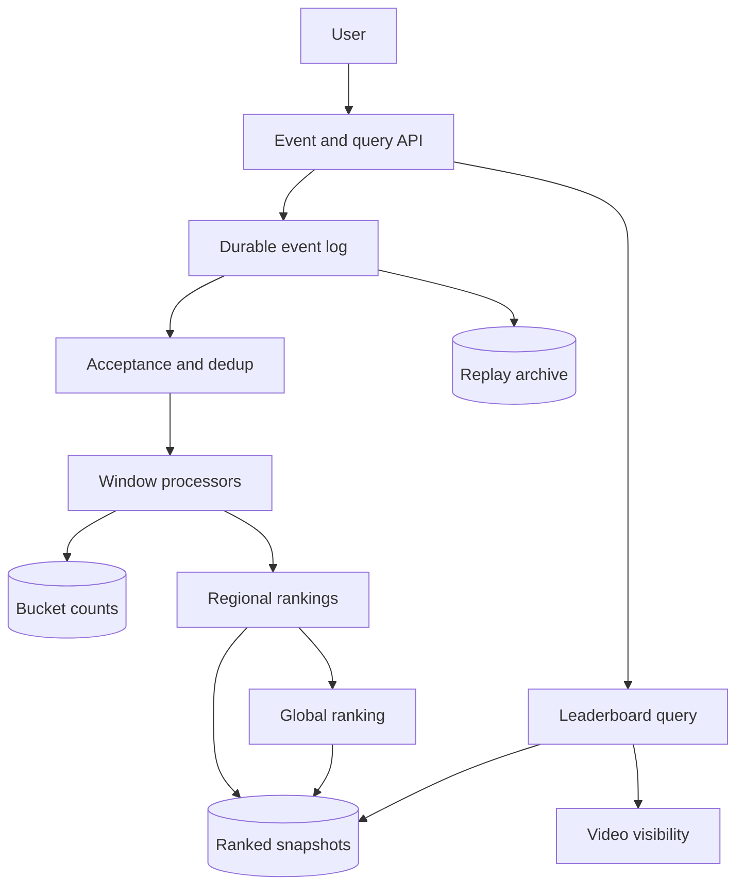
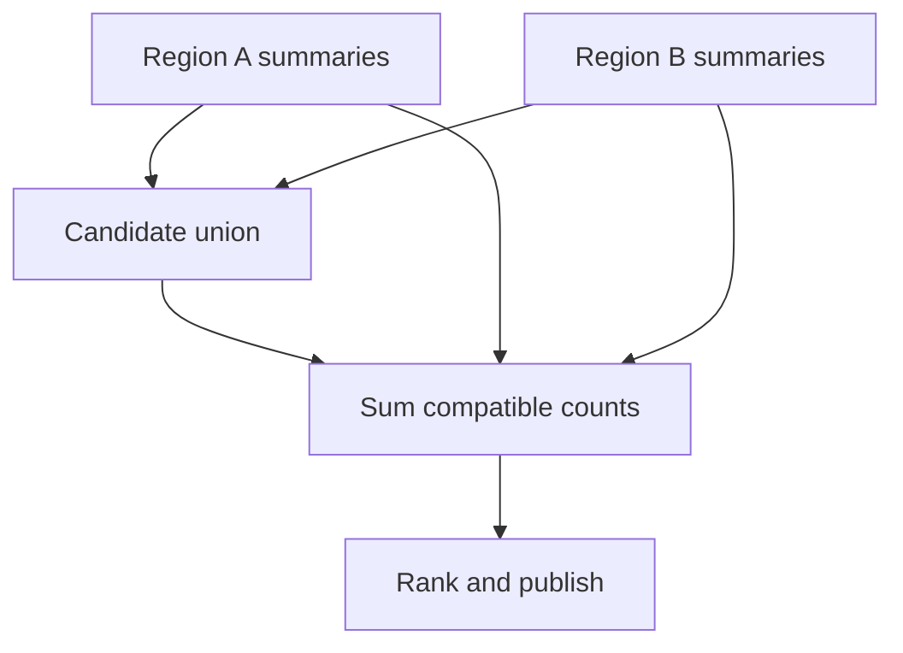
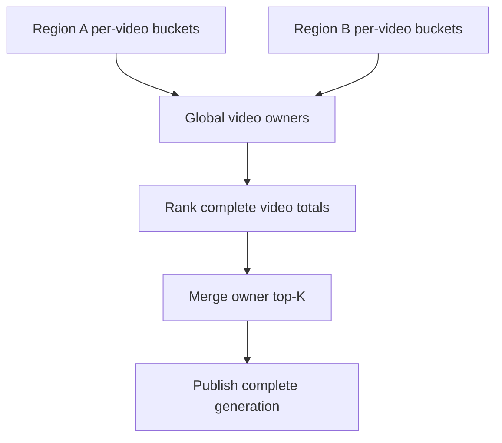

Build a YouTube-style video leaderboard for recent, hourly, daily and monthly view counts, with regional and category filters.

<!--more-->

## Problem

Users want to see which videos are being watched most during a chosen period. View events arrive continuously, and a popular video can attract a disproportionate share of them.

This page covers leaderboard computation rather than video upload or playback. It separates accepted-event counting from fast ranked snapshots, so clients can see both the reporting interval and the result's freshness.

## Requirements

### Functional requirements

- **Rank videos:** return top-K by accepted view count for a supported time window.
- **Track recent activity:** maintain a rolling ten-minute leaderboard, refreshed on a defined cadence.
- **Filter rankings:** support country and category scopes plus an explicitly computed global scope.
- **Read counts:** expose per-video totals with their window and processing status.
- **Recover processing:** replay accepted events and republish results after failures.

### Non-functional requirements

- **Scale:** assume 70B events/day, about 810K/s average and 2M/s peak.
- **Latency:** leaderboard reads P95 below 100ms within the serving region.
- **Freshness:** target regional snapshot age below 5s and global age below 30s under normal load.
- **Availability:** target 99.9%; expose stale or incomplete coverage during a processing outage.
- **Memory:** bound in-memory candidate tracking; shard larger exact state on disk.
- **Quality:** measure candidate recall and count error; approximate ranking is identified in responses.

Personalized recommendations, transcoding and advertising billing are outside this design. One accepted playback event has one stable ID; acceptance rules for bots and repeated playback are versioned.

## Back-of-the-envelope calculations

- **Ingest:** 70B/day / 86,400 ≈ 810K events/s.
- **Raw data:** an assumed 200-byte event produces 14TB/day before compression and replicas.
- **Exact counters:** 4B × 8 bytes = 32GB for count values alone; IDs, indexes and windows add substantially more.
- **Candidates:** 5,000 entries × an assumed 48 bytes ≈ 240KB per sketch before implementation overhead.
- **Scopes:** 200 countries × 20 categories can create 4,000 combinations; multiply state by active scopes, windows and shards.

A ten-token or hundred-event batch saves work only when those events share an aggregation key. Global event volume cannot be treated as one video's batch.

## Core entities

- **ViewEvent** is a retry-stable playback event with validated time and scope.
- **WindowCount** records one video's count within a bucket.
- **LeaderboardSnapshot** publishes an immutable ranked result and its coverage.

```protobuf
message ViewEvent {
  string event_id;
  string video_id;
  Timestamp event_time;
  Timestamp received_at;
  string country;
  string category;
  string acceptance_version;
}
message WindowCount {
  string video_id;
  string scope;
  Timestamp bucket_start;
  int64 accepted_views;
  int64 revision;                    // Absolute total, not an additive retry.
}
message RankedVideo {
  string video_id;
  int64 estimated_views;
  int64 error_bound;
}
message LeaderboardSnapshot {
  string generation;
  string scope;
  Timestamp window_start;
  Timestamp window_end;
  Timestamp processed_through;
  repeated RankedVideo videos;
  bool approximate;
  repeated string missing_regions;
}
```

## API

```yaml
POST /v1/events/view/batch:
  body: {events: []}
  result: {accepted_ids: [], rejected_ids: []}
  acknowledgement: after-durable-event-append
GET /v1/top-k:
  query: {window: hour-or-day-or-month, k: bounded-integer, country: optional, category: optional}
  result: {generation: id, videos: [], processed_through: timestamp, approximate: boolean, missing_regions: []}
GET /v1/top-k/trending:
  query: {window: 10m, k: bounded-integer, country: optional}
  result: {window_start: timestamp, window_end: timestamp, videos: [], stale: boolean}
GET /v1/videos/{video_id}/count:
  query: {from: timestamp, to: timestamp, country: optional}
  result: {accepted_views: integer, processed_through: timestamp, final: boolean}
```

The count endpoint reads durable bucket totals; an approximate leaderboard score is not substituted for that count.

## High-level design

Regional pipelines validate and deduplicate events, maintain window state and publish ranked snapshots. Global computation combines compatible summaries or count partitions from all regions. The query service reads a complete generation and checks current video visibility.



## Storage

- **Kafka:** raw and accepted events with stable IDs, replication, acknowledgement settings and retention sized for replay. Filtered events go to a separate topic, avoiding a feedback loop.
- **Flink with RocksDB:** partitioned bucket counts, deduplication state and candidate summaries. Checkpoints include input positions and operator state; disk-backed state still needs RAM and checkpoint I/O budgeting.
- **Bigtable or a similarly partitioned count store:** absolute versioned totals keyed by scope, video and bucket. Timestamp ordering supports per-video range reads.
- **Object storage:** accepted-event archive, checkpoints and immutable leaderboard generations.
- **Redis:** hot copies of completed ranked generations, with a pointer switched only after all rows and metadata are available.
- **PostgreSQL:** policy/configuration and snapshot manifests, rather than individual updates for every view.

[Procella](https://www.vldb.org/pvldb/vol12/p2022-chattopadhyay.pdf) provides background on YouTube analytics. The storage choices here are a proposed architecture, not a claim about YouTube's current deployment.

## From request to response

### Recording and accepting views

The ingestion service validates video/session evidence, payload bounds and timestamp plausibility, then appends the event before acknowledging acceptance into the pipeline. A retry carries the same event ID.

A separate acceptance stage evaluates playback and abuse rules, preserving the rule version and rejection reason. Deduplication uses exact event-ID state over the supported retry horizon; archive reconciliation covers older replays.

### Updating counts and rankings

Partition accepted events by video and scope. Busy videos can use salted partial counts, followed by a merge of those partials. Emit versioned absolute totals rather than retrying additive increments.

Hourly buckets support longer reporting windows. Recent rankings use aligned minute slices and a partial current slice, with each slice included once. Publication includes the actual event-time interval and processing watermark.

### Reading a leaderboard

The query service loads a published generation for the requested scope and interval. It removes private or deleted videos using current metadata, hydrates titles and returns freshness/coverage alongside ranks.

A cache miss reads the durable snapshot and repopulates Redis. If a region is delayed, serve an explicitly stale complete generation or a marked partial result according to the endpoint policy.

### Recovering a processor

Restore input offsets, dedup state, counts and candidate summaries from one checkpoint. Replayed sink writes replace the same aggregate revision or generation. Publish a new pointer only after recovery produces a coherent result.

Checkpoint consistency does not make arbitrary external writes exactly-once; each sink needs a supported transaction or idempotent versioned protocol.

## Deep dives

### How do we prevent a viral video from creating a hot partition?

**Problem:** hashing only by video ID puts all events for that video on one aggregation task.

- **Single counter:** simple, but serializes all of that video's updates.
- **Salted partial counts:** spreads updates and merges much smaller count records.
- **Larger batches only:** reduces commands but retains one-key processing limits.

**Recommendation:** batch locally and use stable event-ID salting for sufficiently hot videos. Merge absolute partial totals by video, scope, bucket and salt; update a partial only when its revision advances.

Redis hash tags must not force every salt onto the same slot. Cross-slot reads use cluster-aware individual commands or a precomputed merged value, rather than an unsupported cross-slot MGET.

Measure per-partition lag, key skew and batch efficiency. Salt count changes are versioned so old and new partials can be reconciled without double counting.

**Hot-key batching.** Salt each accepted event deterministically from its stable event ID into a versioned number of lanes. A lane keeps an exact count for each video/bucket and periodically emits its absolute total plus revision. The final merger remembers the latest total for every lane and computes the video total from those values.

If lane three advances from 100 to 125, the merger contributes an additional 25; replaying revision 8 with value 125 contributes nothing again. Store the latest lane values with the merged generation so recovery does not add each polled total as if it were a new delta.

A hot video's millions of raw events become bounded lane-summary updates. Increasing the number of lanes creates a new routing generation; reconcile both generations under an explicit cutover cutoff. Otherwise old and new lanes may double-count the same accepted events.

### How do rolling windows expire old views?

**Problem:** recent rankings must remove views once they leave the reporting interval.

| Approach | Tradeoff |
| --- | --- |
| Rescan raw events | Straightforward but expensive at this event volume |
| Aligned time slices | Reuses bucket state; interval precision follows slice width |
| Increment/decrement one sketch | Requires a deletion-safe algorithm and coordinated streams |

**Recommendation:** use aligned slices with a declared one-minute resolution. A snapshot sums disjoint slices for its interval; a live current slice is added once, not on top of an overlapping completed window.

[Apache Flink's windowing](https://nightlies.apache.org/flink/flink-docs-stable/docs/sql/reference/queries/window-tvf/) and [window Top-N](https://nightlies.apache.org/flink/flink-docs-stable/docs/sql/reference/queries/window-topn/) support this processing model. Verify the execution plan instead of assuming every operator automatically shares slice state.

Late accepted events update their original bucket under a new revision. Watermarks and allowed lateness govern fast publication; the archive supplies later correction generations.

**An aligned-window example.** At 12:00, the hour ranking sums minute buckets from 11:00 through 11:59. At 12:01, it removes 11:00 and adds 12:00. The live 12:00 bucket is included exactly once; adding it to a completed hour that already contains it would inflate counts.

For an arbitrary 12:00:30 endpoint, minute buckets approximate the two boundaries. Declare minute alignment or retain finer boundary data when exact arbitrary intervals are required. The current snapshot carries start/end, watermark and bucket revision generation.

A late event with event time 11:58 updates that bucket, not the current 12:00 bucket. The next corrected snapshot includes the new revision if the interval still covers 11:58. Data older than the online correction horizon is reconciled from the archive through a separate versioned publication.

### How much approximation is acceptable?

**Problem:** maintaining all video identities and every active window in memory is expensive.

- **Exact partitioned counts:** strongest count semantics, larger storage and rank computation cost.
- **Space-Saving:** bounded candidate identities with count/error information.
- **Count-Min Sketch:** compact frequency estimates, requiring a separate candidate-identity source.

**Recommendation:** retain durable exact bucket totals for count queries and use bounded candidate summaries for fresh ranking when required. Rank a candidate union using compatible count summaries; disclose error bounds and measure recall against exact samples.

Space-Saving's replacement error remains attached to an entry after further increments. An item's absence from a local candidate set is not proof that it cannot be globally important. Standard Space-Saving also does not support simply decrementing expired events.

**Candidate confidence.** Keep exact durable bucket totals, but let a bounded candidate summary nominate videos for a fast ranking. A candidate's estimate/error interval guides whether it is safely above the cutoff or needs an exact read.

For example, if the estimated Kth video has 10,100 ± 500 views and another has 10,000 ± 500, their intervals overlap. The fresh approximate order is uncertain; query exact totals for that wider candidate group before presenting an exact ranking. An item absent from the candidate summary still needs a coverage bound.

Retain candidate summaries per aligned slice and combine them with a supported merge algorithm. Expiring a slice drops that summary; decrementing a standard Space-Saving summary is not equivalent. Evaluate candidate recall against complete exact samples, including concentrated regional popularity and nearly tied videos, rather than checking only average count error.

### Can we merge regional top-K lists safely?

**Problem:** a globally popular video may fall below the local cutoff in every region.

- **Union of local top-K:** inexpensive but incomplete in the general case.
- **Larger candidate unions with bounds:** approximates global ranking with measurable uncertainty.
- **Globally partitioned per-video totals:** exact, with more cross-region summary work.

**Recommendation:** send regional partial counts or compatible heavy-hitter summaries with omitted-count bounds. Retrieve all regional contributions for candidate videos before ranking. Use exact global count aggregation when product requirements demand an exact global list.



**Why regional winners are insufficient.** Region A has local winner X=12 and video H=11. Region B has winner Y=12 and H=11. A union of the two local top-one lists contains X and Y, while H's total of 22 makes it the global winner.

For exact ranking, aggregate every video's regional contributions at a globally assigned video owner, then compute local rankings across those complete totals. The final top-K merge is valid when each video has one complete owner and all owners use the same interval/cutoff. Partial regional lists do not satisfy that condition.



For an approximate fresh path, use candidate summaries with omitted-count bounds and fetch all regional contributions for each candidate. Missing regions make the result incomplete, regardless of how quickly the available candidates can be sorted.

Regional generation IDs and window boundaries prevent repeated polls from adding the same total twice. Missing regions remain visible in response metadata. For the broader algorithm discussion, see [System Design: Top-K](/designs/system-design-top-k/).
