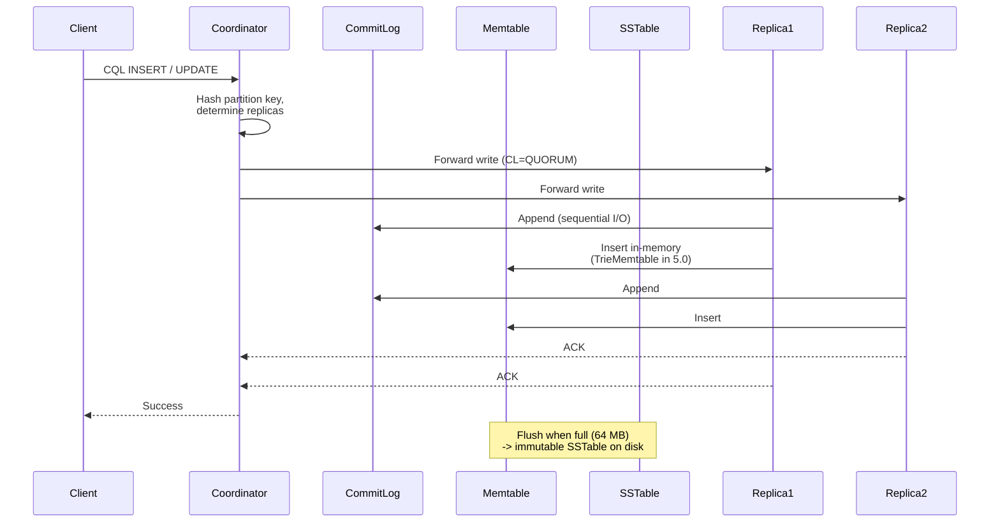

Apache Cassandra is the default AP (availability + partition-tolerant), masterless wide-column store for write-heavy, always-on workloads. The one big design choice: availability and partition-tolerance are non-negotiable; consistency comes from tunable quorums on a per-operation basis.

<!--more-->

## What It Is & Where It Fits

Apache Cassandra is the default AP (availability + partition-tolerant), masterless wide-column store for write-heavy, always-on workloads. The one big design choice: availability and partition-tolerance are non-negotiable; consistency comes from tunable quorums on a per-operation basis. You get a database that never has a single point of failure, can span multiple datacenters, and handles time-series or event ingestion at any scale - but you give up joins, cross-partition ACID, and ad-hoc analytics.

Originally built at Facebook (2008, open-sourced 2009) for inbox search, Cassandra is now an Apache Software Foundation Top-Level Project (not CNCF - a common misconception). The canonical repo is [apache/cassandra](https://github.com/apache/cassandra) (9,914 stars, 4,042 forks, Apache-2.0), and 5.0.8 (2026-04-10) is the latest stable release.

## Core Model & Abstractions

### Keyspaces, Tables, Rows, and Wide Columns

Cassandra's data model is a four-level hierarchy:

```javascript
Keyspace (replication strategy + factor)
  -> Table (schema: partition key + clustering columns + regular columns)
    -> Row (identified by partition key value)
      -> Cell (each column value has its own write timestamp -- LWW)
```

Every table must declare a **partition key** (the first column in the PRIMARY KEY definition) and optional **clustering columns**. The partition key is hashed (Murmur3Partitioner by default) to determine which node owns the row. Clustering columns control sort order within a partition. No two rows in the same partition share the same clustering key.

```javascript
CREATE TABLE timeline (
  user_id    uuid,
  posted_at  timestamp,
  post_id    uuid,
  content    text,
  PRIMARY KEY (user_id, posted_at, post_id)
) WITH CLUSTERING ORDER BY (posted_at DESC);
```

Above, `user_id` is the partition key (everything with the same user_id lives on the same node), and `posted_at DESC` means rows within a partition are stored in reverse-chronological order - a single query returns the most recent posts first.

### Multi-Leader (Masterless) Replication

Every node in a Cassandra cluster accepts reads and writes. There is no primary, no secondary, no failover to script. The replication strategy uses **consistent hashing** with 256 virtual nodes (vnodes, `num_tokens`) per physical node. Each vnode is a random token range; Cassandra maps the full ring of 2^64 tokens onto the cluster.

When a write arrives at any node (the **coordinator**):

1. Coordinator hashes the partition key with Murmur3 to find the token range.
1. Coordinator looks up the replica set for that range (based on replication strategy).
1. Coordinator forwards the write to N replicas (N = consistency level, e.g. QUORUM).
1. Each replica acknowledges; coordinator returns success when enough replies arrive.

**Replication strategies:**

- **SimpleStrategy** - single datacenter, default RF=1 (not for production).
- **NetworkTopologyStrategy** - production standard. Specify RF per datacenter. Nodes placed by **Snitch** (GossipingPropertyFileSnitch is the default; Ec2Snitch for AWS, GoogleCloudSnitch for GCP).

```javascript
CREATE KEYSPACE myapp
  WITH REPLICATION = {
    'class': 'NetworkTopologyStrategy',
    'us-east': 3,
    'eu-west': 3
  };
```

## Architecture & Internals

### The Write Path: Zero Disk-Seek on Writes

Cassandra's write path is an LSM-tree design that turns every write into sequential I/O. There is no random seeking on writes, ever.

**Sequence Diagram: Write Path**



**The four-step path:**

1. **Commit log append** - every write is appended to an append-only commit log on disk. Default segment: 32 MiB. Default sync: periodic, 10-second interval. Zero seek overhead.
1. **Memtable insertion** - data written into an in-memory sorted structure. In 5.0, **TrieMemtable** (CEP-19) is the default, replacing the older ConcurrentSkipListMap. Zero disk I/O on this step.
1. **Flush trigger** - when memtable hits 64 MB (default), it is flushed to disk as an immutable **Trie-indexed SSTable** (CEP-25 in 5.0) or a traditional SSTable. Each flush creates a new file; old data is never overwritten in place.
1. **Compaction** - background merging of multiple SSTables. Compaction is how Cassandra reclaims space, applies deletes/updates, and purges tombstones past gc_grace_seconds.

**The key insight:** Every write is sequential append. No disk seeks. This is why Cassandra can absorb 100K+ writes per second per node even on spinning disks. The tradeoff: reads need to merge data from multiple SSTables, which is where bloom filters and partition-key caches earn their keep.

### The Read Path: Bloom Filters, Caches, and Merge

Reads are more expensive than writes because data may be spread across the memtable and multiple SSTables:

1. **Bloom filter check** - probabilistic structure per SSTable (`bloom_filter_fp_chance` 0.01 default, 0.1 for LCS). Eliminates ~99.98% of unnecessary disk reads. ~100 bytes per partition, stored off-heap. Zero false negatives.
1. **Partition key cache** - off-heap RAM cache mapping partition keys to disk offsets. Avoids scanning SSTable metadata.
1. **Merge** - coordinator merges matching rows from memtable + relevant SSTables, sorted by clustering columns. Duplicates reconciled via last-writer-wins (highest timestamp).
1. **Read repair (probabilistic)** - if divergence detected across replicas, coordinator triggers background repair. Disabled by default in 5.0 (`read_repair_chance` = 0.0).

### Compaction Strategies (Cassandra 5.0)

Compaction is not optional - it is the mechanism that reclaims space. Four strategies:

| Strategy | Best For | Write Amp | Notes |
|---|---|---|---|
| **UCS** (Unified) | General (5.0+) | Adaptive | **Default in 5.0** (CEP-26). Parallel sharded compaction. |
| **STCS** (Size-Tiered) | Write-heavy | Low | Legacy default pre-5.0. Needs 2x disk during major compaction. |
| **LCS** (Leveled) | Read-heavy, updates | ~10x | ~10% disk overhead. One SSTable per level per partition. |
| **TWCS** (Time-Window) | Time-series with TTL | Low | 20-30 windows ideal. Fully-expired windows dropped without compaction. |

Compaction back-pressure is a real operational problem: when write throughput exceeds compaction throughput, SSTable count grows unbounded, and read latency spikes because every SSTable's bloom filter must be checked. Signal: `Pending Compactions` >20 sustained (warning), >100 (critical - writes may time out).

## Data & Consistency Model

### Tunable Consistency (Per-Operation)

The defining feature: every read and write can set its own consistency level independently.

| Level | Replicas | Behaviour |
|---|---|---|
| ANY | >=1 (write) | Write acknowledged after at least one replica (including hinted handoff). |
| ONE | 1 | Read from one random replica. Highest availability, stale reads possible. |
| TWO | 2 | Middle ground. |
| THREE | 3 | Stronger than QUORUM when RF=3. |
| QUORUM | floor(RF/2)+1 | The workhorse. Best balance of latency and correctness. |
| LOCAL_QUORUM | floor(RF_dc/2)+1 | QUORUM restricted to coordinator's DC. Multi-DC-safe. |
| EACH_QUORUM | floor(RF_dc/2)+1 per DC | Write must reach quorum in every DC. Highest multi-DC write consistency. |
| ALL | RF | Never lose this write. Any down replica blocks the operation. |
| SERIAL | Paxos quorum | Linearizable via 4-round Paxos (LWT). |
| LOCAL_SERIAL | Paxos quorum, one DC | SERIAL restricted to one DC. |

**The strong-consistency formula:** R + W > RF guarantees single-key read/write consistency. For RF=3: QUORUM reads (2) + QUORUM writes (2) = 4 > 3 -> strong consistency.

**Lightweight Transactions (LWT):** 4-round Paxos (prepare -> promise -> accept -> learn). Latency is 3-5x a normal write; throughput ceiling ~500-1,000 ops/s per partition. Use only for idempotent inserts, conditional deletes, and optimistic locking - never in a hot write path.

### CAP Positioning

Cassandra defaults to AP (Availability + Partition Tolerance) but can approximate CP by raising consistency levels at the cost of availability. The system is designed for the reality that partitions happen - network splits between datacenters, rack failures, node reboots - and it should keep accepting writes through all of them.

## Performance & Scaling

### Linear Scale-Out

Cassandra scales out horizontally: adding nodes increases both read and write throughput linearly, up to ~800 nodes in practice (gossip overhead becomes limiting beyond that). Typical large clusters run 100-400 nodes. Apple's Cassandra fleet was reported at 100,000+ nodes and 30+ PB (CMU talk, unverified). Netflix confirms ~2x nodes = ~2x throughput.

**But adding a node is not free.** Bootstrap triggers data streaming from existing nodes to the new node. Each SSTable received during bootstrap may trigger a minor compaction. If too many nodes are added simultaneously (or the compaction queue can't keep up), the result is a **compaction storm** - SSTable count spikes, read latency degrades, and the cluster enters a cascading slowdown.

**The failure that surprises people:** Token rebalancing during scale-out is the moment when hidden compaction costs surface. A cluster running smoothly at 80% capacity can fall over when the 9th node is added to an 8-node ring if compaction throughput is already near its ceiling.

**Partition key design is the other single point of failure.** A hot partition (one key serving disproportionate traffic) cannot be spread across nodes - the partition key is the atomic unit of placement. If a single sensor, user, or device generates 50% of writes, that node is pinned at 50% of cluster throughput no matter how many nodes you add. Fix: time buckets, shard keys, or application-level rate limiting.

**Practical sizing:**

- Min production: 3 nodes (RF=3 minimum)
- Max data per node: ~1 TB general, 3-4 TB for time-series
- Typical node: 8+ cores, 32 GB+ RAM, SSD
- Heap: 50% of system RAM max (G1GC for heaps >12 GB)

## Operational Model

### Gossip Protocol & Failure Detection

Cassandra uses a peer-to-peer gossip protocol combined with the **phi accrual failure detector**:

- Every node sends gossip messages to 3 random peers every 1 second.
- Each message carries endpoint state (heartbeats, load, schema digest, node status).
- Over time, all nodes converge to a consistent cluster view - O(log N) propagation.
- **Phi convict threshold:** 8 (default). Higher = more tolerant of transient slowness. A node is NOT immediately marked down on a missed heartbeat - prevents split-brain during network blips.

### Hinted Handoff

When a replica is down, the coordinator stores the write locally as a "hint." Hints are retained for up to **3 hours** (configurable via `max_hint_window_in_ms`). When the downed node recovers, it replays hints. Best-effort only - not a substitute for repair.

### Repair

Cassandra is eventually consistent. Three repair mechanisms:

1. **Read repair** - on reads at consistency > ONE, coordinator detects divergence and writes the latest version back. Probabilistic (default 0.0 in 5.0).
1. **Incremental repair** (`nodetool repair -inc`) - repairs only SSTables not repaired since last cycle. Default since 4.0+. Dramatically reduces repair time.
1. **Full repair (Merkle-tree)** - builds Merkle trees of all data on each replica, exchanges hashes, streams differences. The #1 operational pain: on 100+ node clusters, takes days to weeks; p99 latency 10x normal during repair.

**CEP-37 Auto-Repair (5.0.8+):** Built-in repair scheduler that replaces external orchestrators (Reaper, custom cron). Enable once with `cassandra.autorepair.enable=true`. Cannot be rolled back once enabled. Biggest ops improvement in the 5.x line.

**Best practice:** Run incremental repair every 6 days (rolling). On 5.0.8+, enable CEP-37 auto-repair.

### Well-Known Failure Modes

1. **Hot Partitions** - one key takes disproportionate traffic. Partition grows past 100 MB, reads degrade, GC pauses spike. Fix: time buckets, shard keys.
1. **Compaction Storm** - adding a node triggers cascading compaction. Fix: bootstrap one node at a time; use UCS; tune `concurrent_compactors`.
1. **Repair Storm** - full repair on all tables saturates inter-node network. Fix: incremental repair every 6 days; CEP-37 auto-repair.
1. **GC Pauses** - heap stores bloom filters, key cache, memtables. GC pause >1s triggers phi failure detector -> node marked down -> hinted-handoff flood. Fix: G1GC; heap <=50% of RAM; separate commit log disk.
1. **Tombstone Avalanche** - TTL'd or deleted data persists as tombstones until compaction
  - gc_grace_seconds. >100K tombstones scanned = WARN; >1M = query aborted. Fix: TTL instead of DELETE; TWCS for time-series; monitor tombstone ratio.
1. **Zombie Data** - deleted data reappears because repair was not run within gc_grace_seconds (10 days). Fix: run repair at least every 7 days.

## Editions: OSS vs Managed & Proprietary

| Edition | Managed? | License | What It Adds | What It Locks / Limits | Representative Cost |
|---|---|---|---|---|---|
| **Apache Cassandra 5.0 OSS** | No | Apache-2.0 | Full CQL; SAI indexes; Trie SSTables; ANN vector search; CEP-37 auto-repair | You run ops, repair, compaction, security, backups | Free (your infra). ~0.5-1 FTE ops/cluster. |
| **ScyllaDB OSS 2026.2.1** | No | ScyllaDB Source Available v1.1 | CQL wire-compatible; 2-5x per-node throughput; shard-per-core C++; no JVM/GC | License (v1.1) bars use by any org with a 12-mo paid relationship. No CDC, MVs, triggers, UDFs, LWT. | Free for "Never Customers" only. Enterprise: sales-led. |
| **ScyllaDB Enterprise / Cloud** | Cloud: SaaS. Enterprise: self-managed + support | Commercial | 24x7 support; FIPS-mode; managed cloud | Sales-led pricing (behind login). Per-vCPU-hour cloud pricing unverifiable. | Enterprise: sales-led ($4-8K/vCPU/yr est.). |
| **AWS Keyspaces** | Yes (serverless) | Commercial | Auto-scaling; IAM; PITR 35-day; cheapest serverless | No LWT, MVs, triggers, UDFs, CDC. CQL subset. Per-table caps (1K WCU/80K RCU). AWS-only. | $0.25/GB-mo + $0.625/M WCU + $0.125/M RCU + $0.20/GB-mo PITR |
| **Azure Managed Instance** | Yes (IaaS) | Commercial | True IaaS - pick VM SKU; VNet injection; full Cassandra 4.0.x | 24/7 compute billing; version lags upstream; Azure-only | $0.1075/hr (D2as_v5) to $3.12/hr (L32as_v3) |
| **DataStax Astra DB** | Yes (serverless) | Commercial (IBM) | Pay-per-request; multi-region active-active; REST/Docs/GraphQL APIs | IBM lock-in; pricing opaque post-acquisition; CQL subset | ~$0.25-0.26/GB-mo (stale 18mo) |
| **DSE (DataStax Enterprise)** | Self-managed + support | Commercial | Advanced security; JMX/audit logging; graph; analytics | Sales-led pricing post-IBM acquisition; historical ~$4-12K/node/yr | Sales-led |
| **K8ssandra** | No (Cassandra in K8s) | Apache-2.0 | Self-healing K8s-native; cass-operator; Medusa backups; Prometheus | K8s overhead; disk I/O less predictable | Free (your K8s cluster) |

**One representative cost figure:** AWS Keyspaces on-demand, 1 TB storage + 100M WCU + 100M RCU/mo (us-east-1): **~$535.80/mo** (storage-bound; PITR at $204.80/mo of that). Below ~5-10 TB, Keyspaces wins on TCO vs self-hosting. Above that, self-hosting is cheaper if you can amortise operator time.

## Usage Patterns & Examples

### 1. Time-Series / Metrics

The canonical Cassandra workload. Append-only, TTL-based expiry, bucketed partition keys.

```javascript
CREATE TABLE metrics (
  sensor_id  uuid,
  hour       bigint,
  ts         timestamp,
  value      double,
  PRIMARY KEY ((sensor_id, hour), ts)
) WITH CLUSTERING ORDER BY (ts DESC)
   AND default_time_to_live = 864000;  -- 10 days
```

The partition key combines sensor_id with a time bucket (hour). This spreads writes across nodes naturally - each bucket is a different partition.

**Gotcha:** Using time as the sole partition key creates a **hot last-partition** problem. All current writes land on the "now" partition, pinning one node at full write rate. Always prefix with an entity identifier.

### 2. Feeds / Messaging

User-partitioned, clustering for ordering.

```javascript
CREATE TABLE inbox (
  user_id    uuid,
  message_id timeuuid,
  sender_id  uuid,
  content    text,
  PRIMARY KEY (user_id, message_id)
) WITH CLUSTERING ORDER BY (message_id DESC);
```

Single-row partition reads (SELECT * WHERE user_id = ? ORDER BY message_id DESC LIMIT 20) are fast - everything lives on one node. But a very active user creates a hot-user**: their partition grows large, reads degrade, and that node absorbs disproportionate load.

**Gotcha:** Design for the hot-user scenario upfront. Rate-limit at the application layer. Use a secondary bucket if needed (e.g. user_id + conversation_arc).

### 3. IoT / Sensors

Each device is its own partition key. Append-only, device-as-key.

```javascript
CREATE TABLE sensor_readings (
  device_id  uuid,
  ts         timestamp,
  reading    double,
  unit       text,
  PRIMARY KEY (device_id, ts)
) WITH CLUSTERING ORDER BY (ts DESC);
```

**Gotcha: Tombstones from decommissions.** When a device is decommissioned, deleting its history creates tombstones across its entire partition. Each compaction pass must merge through these tombstones, slowing down reads for remaining devices on the same node. Better: TTL at write time; batch-delete via range delete with caution.

### 4. Shopping Carts / Sessions

Single-partition, last-writer-wins per column. Good for concurrent edits because each item can be modified independently.

```javascript
CREATE TABLE shopping_cart (
  session_id uuid,
  sku        text,
  quantity   int,
  added_at   timestamp,
  PRIMARY KEY (session_id, sku)
);
```

The session is one partition; each SKU is a separate row. Two devices can modify different items simultaneously without conflict.

**Gotcha:** Reading the cart (read all rows in partition) then modifying client-side then writing back is a **read-before-write anti-pattern** that adds latency and creates a stale-write window. Use collection-level writes when possible, or LWT for pessimistic locking (but understand ~500-1,000 ops/s ceiling).

## When to Use It & When Not To

### Great Fit

- **Write-heavy workloads** - anything doing 100K+ writes/s per node. Cassandra's LSM design absorbs burst writes gracefully.
- **Multi-datacenter deployment** - built-in replication with NetworkTopologyStrategy. No external replication pipeline needed.
- **Always-on availability** - masterless means no failover, no downtime for node replacement, no single point of failure.
- **Time-series at scale** - append-only with TTL and TWCS compaction. Fully-expired SSTables are dropped without compaction overhead.
- **Global scale with local reads** - LOCAL_QUORUM reads in each DC avoid cross-region latency.
- **Event ingestion** - clickstreams, logs, metrics, telemetry. High write throughput, low-to-moderate read patterns.

### Wrong Fit

- **Joins or complex queries** - Cassandra has no JOIN. If your access pattern requires multiple related partitions per query, you need to denormalise manually.
- **Cross-partition ACID transactions** - not possible. Accord (6.0-alpha) is the first step toward this, but it is not production-ready.
- **Ad-hoc analytics** - Cassandra is not a query engine. If you need OLAP-style aggregation, replicate to an analytics store (Spark, Trino, ClickHouse).
- **Sub-50 GB datasets** - Cassandra's overhead (replication factor, compaction, repair complexity) is not worth it for small data. Use Postgres or DynamoDB.
- **Frequent schema changes** - no online ALTER TABLE for partition keys. Model evolution requires full data migration.
- **Strong consistency as default** - Cassandra trades consistency for availability. If your workload needs serialisable transactions on most operations, consider Spanner or CockroachDB.

## Where It's Heading

Cassandra 5.0 (GA 2024-08-29) delivered the biggest architectural changes in years, and 6.0-alpha1 (2026-03-21) points to the next horizon.

**5.0 already shipped:**

- **Trie Memtables (CEP-19)** - replaces ConcurrentSkipListMap. Less GC pressure, faster flushes, lower write latency.
- **Trie SSTables (CEP-25)** - new on-disk format. Faster index lookups, smaller metadata, better compression.
- **UCS Compaction (CEP-26)** - unified compaction strategy replaces STCS as default. Adaptive sharded compaction reduces compaction storms.
- **SAI (Storage-Attached Indexes, CEP-7)** - local secondary indexes built into each node's storage engine. No coordinator overhead. Enabled ANN vector search (jvector).
- **CEP-37 Auto-Repair (5.0.8+)** - built-in repair scheduler. Biggest ops improvement in the 5.x line.
- **Guardrails framework** - configurable partition_size, tombstone, table count, and column limits. Catches misconfigured queries before they cause outages.
- **TTL extended to 2106** - was 2038 (Y2038-safe for Cassandra 5.0+).

**6.0-alpha1 is heading toward:**

- **Accord consensus (CEP-15)** - a Paxos-based consensus layer that will replace gossip for cluster metadata and schema management, and enable true multi-partition transactions (`BEGIN TRANSACTION ... COMMIT`). 23 of the CHANGES.txt entries reference Accord or Paxos repair. This is the most significant architectural change since the original LSM design.
- **ZSTD dictionary compression** (CASSANDRA-17021) - better compression ratios for SSTables.
- **Direct I/O for compaction reads** (CASSANDRA-19987) - bypass page cache, reduce GC pressure.
- GA is likely late 2026 or 2027 (based on 5.0 cadence of ~24 months from alpha to GA).

## References

1. [Apache Cassandra GitHub](https://github.com/apache/cassandra)
1. [Apache Cassandra Docs 5.0](https://cassandra.apache.org/doc/latest/)
1. [Cassandra 5.0 NEWS.txt](https://raw.githubusercontent.com/apache/cassandra/cassandra-5.0/NEWS.txt)
1. [Cassandra 6.0-alpha1 CHANGES.txt](https://raw.githubusercontent.com/apache/cassandra/cassandra-6.0-alpha1/CHANGES.txt)
1. [Apache Hardware docs](https://cassandra.apache.org/doc/latest/cassandra/operating/hardware.html)
1. [Apache Compaction docs](https://cassandra.apache.org/doc/latest/cassandra/managing/operating/compaction/)
1. [Apache Guarantees docs](https://cassandra.apache.org/doc/latest/cassandra/architecture/guarantees.html)
1. [Apache Repair docs](https://cassandra.apache.org/doc/latest/cassandra/operating/repair.html)
1. [ScyllaDB GitHub](https://github.com/scylladb/scylladb)
1. [ScyllaDB Source Available License v1.1](https://raw.githubusercontent.com/scylladb/scylladb/master/LICENSE-ScyllaDB-Source-Available.md)
1. [AWS Keyspaces sample pricing calculator](https://github.com/aws-samples/sample-pricing-calculator-for-keyspaces)
1. [Azure Retail Prices API](https://prices.azure.com/api/retail/prices)
1. [DataStax pricing via Wayback Machine (archived 2025-01-22)](https://web.archive.org/web/20250122092907if_/https://www.datastax.com/pricing/astra-db)
1. [Netflix Tech Blog - Cassandra](https://netflixtechblog.com/tagged/cassandra)
1. [Discord Migration Blog - Cassandra to Scylla](https://discord.com/blog/how-discord-migrated-from-cassandra-to-scylla)
1. [K8ssandra GitHub](https://github.com/k8ssandra)
1. [Cassandra Reaper (Spotify/The Last Pickle)](https://github.com/thelastpickle/cassandra-reaper)
1. [Apache Cassandra Architecture Overview](https://cassandra.apache.org/doc/latest/cassandra/architecture/)
1. [ScyllaDB Seastar Framework](https://github.com/scylladb/seastar)
1. [Apache Cassandra Guarantees: Consistency](https://cassandra.apache.org/doc/latest/cassandra/architecture/guarantees.html)
