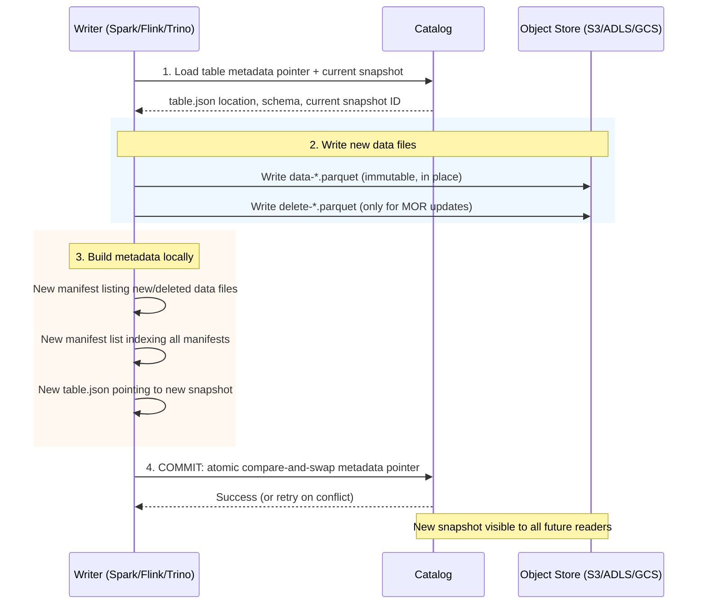

Apache Iceberg is an open table format for analytic data lakes that brings relational-database ACID guarantees to object storage (S3, ADLS, GCS). Before Iceberg, data lakes built on Hive-style partitioning faced a familiar set of pains: a `CREATE TABLE ...

<!--more-->

## What it Is

Apache Iceberg is an open table format for analytic data lakes that brings relational-database ACID guarantees to object storage (S3, ADLS, GCS). Before Iceberg, data lakes built on Hive-style partitioning faced a familiar set of pains: a `CREATE TABLE ... PARTITIONED BY` statement produced a directory tree where adding a column meant rewriting every partition, concurrent writes could corrupt reads, and query planners had to list directories to find data. Iceberg solves all three at once by treating a table as a tree of immutable metadata files rooted in a single atomic pointer held by a catalog. The result is a table that behaves like a relational database table - serializable isolation, full schema evolution without rewrites, and O(1) scan planning - while sitting entirely on cheap object storage. It is not a database or a query engine; it is the storage layer that Spark, Flink, Trino, Snowflake, DuckDB, and dozens of other engines share.

## The Metadata Hierarchy

Every Iceberg table is a four-level tree of immutable files. The root is a single JSON metadata file whose location is the only thing the catalog tracks.

```javascript
Catalog (REST / Glue / HMS / Nessie / Polaris)
  |
  +-- Table Metadata (table.json) — schema, partition spec, current snapshot ID
        |
        +-- Snapshot (one per commit) — points to a manifest list
              |
              +-- Manifest List (Avro) — index of manifests with partition ranges
                    |
                    +-- Manifest (Avro) — per-file entries: path, size, column stats
                          |
                          +-- Data Files (Parquet/Avro/ORC) + Delete Files (V2+)
```

The catalog holds a single atomic pointer: the location of the current table metadata file. A commit is an atomic swap of that pointer via compare-and-swap. Readers always see a consistent snapshot because they load the metadata file at read time and navigate the tree from there - no locks, no dirty reads. Every metadata level is immutable: a new snapshot writes a new manifest list, new manifests for changed files, and a new metadata file. Unchanged manifests are reused by pointer, not copied. This is the insight that makes Iceberg efficient: a commit rewrites only the pointer and the metadata nodes that actually changed, not the whole table.

**The catalog is the switching point.** Because the catalog stores only a pointer to the current metadata file, the catalog itself never holds table data. Writers write data files directly to object storage, build new metadata locally, and atomically swap the catalog pointer in one retryable operation. Reads load the pointer, walk the metadata tree from there, and are completely unaffected by concurrent writes - they see the snapshot they picked up at read start.

**Hidden partitioning** means users query on data columns and Iceberg derives partition values automatically via transform functions (identity, bucket, truncate, year/month/day/hour). Partition values are stored in metadata (partition tuples), never exposed in queries. The manifest list carries per-manifest partition ranges, so scan planning reads only manifests whose ranges overlap the query predicate - O(1) partition pruning that does not grow with file count. Changing the partition spec is a metadata-only operation; old data keeps the old spec, new data uses the new one.

> **💡 Insight: The catalog-pointer design decouples reads from writes completely.**

> Because the catalog holds only a pointer - not the data itself - a commit is never more than a CAS swap of a URI in a key-value store. Writers write data files directly to S3, build metadata locally, and atomically flip the catalog pointer. Readers load the pointer at read start and walk the tree from there, never seeing in-flight writes. This is the same architectural trick that Git uses for branch pointers: the commit is immutable once created, and switching branches is a pointer swap. The consequence is that Iceberg achieves serializable isolation on top of an eventually-consistent object store without any distributed lock service.

## The Write Path

When a writer (Spark, Flink, Trino) commits a transaction, it follows a five-step protocol that makes the commit atomic and leaves readers undisturbed.



**What makes it atomic:** Step 4 is a compare-and-swap on the catalog's metadata pointer. The writer sends "my new metadata file is at path X, but only if the current metadata is still path Y." If another writer committed in between, the CAS fails, the writer retries (up to 4 times by default) by reloading the new metadata and rebasing its changes on top. There is no distributed lock, no two-phase commit, no window where readers see partial state.

**Time travel** works because every metadata file carries a snapshot log - the full history of snapshots with their timestamps and parent IDs. Querying `SELECT * FROM table FOR SYSTEM_TIME AS OF '2026-06-01 00:00:00'` tells the engine to walk back from the current snapshot chain to the snapshot whose timestamp is closest to the requested time without exceeding it. The engine loads that snapshot's metadata tree and reads its data files directly. Old snapshots are physically deleted only when you run `expireSnapshots` - until then, they are fully queryable at zero extra storage cost for the data itself (the data files are shared across snapshots via pointer reuse).

## What You Build With It

This is the heart of the report: the real patterns teams build on Iceberg, each with the trap that follows if you do not handle it.

### CDC Pipelines with Merge-on-Read

The canonical streaming pattern: Kafka topic -> Flink sink -> Iceberg table with upsert semantics. Set `write.delete.mode = merge-on-read` and `write.update.mode = merge-on-read`, enable upsert on the Flink Iceberg sink, and the pipeline auto-deduplicates by primary key. Writes are fast because Iceberg does not rewrite data files - it writes small position-delete files marking the old row positions plus new data files with the updated rows.

**The trap:** delete files accumulate. A partition with 1 million updated rows produces 1 million delete file entries if compaction does not run. Every subsequent read must apply all delete files to produce correct results - query performance degrades linearly with delete file count. Schedule periodic `rewriteDataFiles` to merge small files back into clean 512 MB Parquet files that absorb the deletes. Run compaction on a separate cluster from streaming to avoid commit-conflict thrashing.

**The gotcha in practice:** Position deletes add roughly 5-10% read overhead with few deletes, but 30-50% with many. Equality deletes are worse - 50-100% overhead because every row must be checked against every active equality predicate. Always compact equality deletes aggressively. The V3 upgrade to binary deletion vectors (RoaringBitmap) cuts read overhead to 2-5% and shrinks delete files by roughly 10x.

### Schema Evolution Without Pain

Iceberg tracks columns by unique numeric ID, not by name or position. This means every schema change - add column, drop column, rename, reorder, widen type - is metadata only. No data rewrite, no downtime, no `ALTER TABLE ... WRITE ORDERED BY` dance.

```sql
ALTER TABLE events ADD COLUMN user_agent string;
ALTER TABLE events DROP COLUMN deprecated_flag;
ALTER TABLE events ALTER COLUMN event_count SET DATA TYPE bigint;
```

**The trap:** Old data files written under the previous schema have NULL for new columns, which is expected. But dropping a column does not reclaim storage - the column's data is still in the Parquet files. A `REWRITE DATA FILES` operation is required to physically drop the column data. Monitor storage bloat from dropped columns on append-heavy tables.

### Time-Travel Queries for Auditing and Rollback

Every commit creates a new immutable snapshot. Query any historical point with `SELECT * FROM table FOR SYSTEM_TIME AS OF '2026-06-15 00:00:00'` or `FOR SYSTEM_VERSION AS OF 12345`. This is not a CDC log stored separately - it is the table itself, fully queryable at any snapshot point.

**The trap:** The default `history.expire.max-snapshot-age-ms` is 5 days. Snapshots older than that are deleted by `expireSnapshots`. If you need longer time-travel windows (compliance audits, rollback windows), increase this property before you need it. Also, old snapshots share data files with current ones (via pointer reuse), so they do not double storage - but they do prevent garbage collection of the shared files. A table with 2 years of snapshots may have no data files cleaned up because every file is referenced by at least one retained snapshot.

### Hidden Partitioning

Partition columns are derived automatically from data columns via transform functions. You partition by `days(ts)` or `bucket(256, user_id)`, and users query by `ts` or `user_id` directly - they never need to know the partition column exists. The manifest list stores per-manifest partition value ranges, so query planning reads only the manifests that overlap the query predicate. Changing the partition spec is a metadata-only operation: old data keeps the old spec, new data uses the new one, and queries prune correctly across both.

```sql
CREATE TABLE events (
  ts TIMESTAMP, user_id BIGINT, event STRING
) USING iceberg
PARTITIONED BY (days(ts), bucket(16, user_id));
```

**The trap:** Hidden partitioning means nobody writes WHERE clauses on partition columns, which is great for users but bad for operations. A schema migration that widens a partition column's type is not metadata-only - it requires rewriting the affected partition files. Always plan partition columns as part of capacity planning, not as an afterthought.

### Incremental Reads

Iceberg supports incremental read via the `iceberg.incremental` read API: given start and end snapshot IDs, return only the rows that changed between them. This enables change-data-capture readers that consume Iceberg tables as a streaming source without Kafka in the middle.

**The trap:** Incremental reads work correctly only when the table uses V2 format with row-level deletes. V1 tables express deletes as new snapshots that exclude the deleted files - the incremental reader sees the old file disappear and the new file appear, but cannot distinguish an update from a delete-plus-reinsert. Always use V2 tables for any pipeline that feeds incremental readers downstream.

### Compaction as First-Class Maintenance

Iceberg provides four maintenance operations that run from any engine via table procedures:

| Operation | Command | Purpose | Cadence |
|---|---|---|---|
| Compact data | `rewriteDataFiles()` | Merge small files to 512 MB targets | Hourly (streaming) / daily (batch) |
| Rewrite manifests | `rewriteManifests()` | Merge small manifests to 8 MB targets | Weekly or after 500+ manifests |
| Expire snapshots | `expireSnapshots()` | Delete old snapshots, free storage | Daily |
| Delete orphans | `deleteOrphanFiles()` | Remove files with no snapshot reference | Daily |

**The trap: order matters.** Run compaction before snapshot expiration. Expiration before compaction deletes source files that compaction still references, causing compaction to fail partway through with missing-file errors. The execution order is: `rewriteDataFiles` -> `expireSnapshots` -> `deleteOrphanFiles` -> `rewriteManifests`.

**The deeper trap:** Compaction shares the same partition space as the streaming writer. If both run concurrently on the same partition, they conflict at commit time (the CAS fails), both retry, and throughput collapses. Always schedule compaction on different partitions than the streaming workload, or run it during write lulls.

## Copy-on-Write vs Merge-on-Read

This is the single most impactful configuration decision in Iceberg. There is no universally correct choice - the tradeoff is write speed vs read speed.

**Copy-on-Write (default).** On UPDATE/DELETE/MERGE, every data file containing matching rows is rewritten in full. A single row update in a 512 MB Parquet file rewrites all 512 MB. Read performance is optimal: no delete files, no merge overhead, the query engine reads data files directly. Use COW for append-heavy OLAP workloads with low update frequency and high read:write ratios.

**Merge-on-Read (opt-in, V2+).** Writers never rewrite data files. Instead, they write small delete files alongside the original data files. At read time, the engine merges data and delete files to produce correct results. A single row update writes a ~64 KB position-delete file instead of rewriting 512 MB. MOR is roughly 50-150x faster per row update than COW and ~5-10x faster for CDC batches of 10K upserts (exact ratios depend on delete-file count and read-time filter selectivity). Use MOR for high-throughput CDC, frequent point updates, or any workload where write latency is the bottleneck.

**The MOR trap, restated:** delete files grow without bound unless compaction runs. A read that must apply 100K delete files performs poorly. The solution is not to avoid MOR but to run compaction on schedule and consider V3 deletion vectors (RoaringBitmap) for the upgrade path - they cut delete-file size by ~10x and read overhead from 30-50% down to 2-5%.

**Full partition overwrites** see no benefit from MOR - both COW and MOR rewrite the full partition. The choice only matters for partial updates and deletes.

## Scaling and Availability

**The small file problem is the biggest operational risk.** A streaming CDC job with 24 partitions, 32 Flink subtasks, and 2 checkpoints per minute produces 1,536 files per minute - roughly 2.2 million files per day. At a 512 MB target file size, that is ~1,080 GB/day in tiny 500 KB files instead of efficient 512 MB files. The fix is `rewriteDataFiles` running on a separate cluster and tuning `spark.sql.adaptive.advisoryPartitionSizeInBytes` at write time.

**Orphan files** accumulate when a writer crashes after writing data files but before committing the metadata. A streaming job failing at 50 GB/hour with the default 3-day retention window leaves 3.6 TB of stranded data before `deleteOrphanFiles` triggers. For streaming tables with writer timeouts under one hour, reduce the retention threshold to hours instead of days.

**Catalog throughput** varies by implementation. Hive Metastore bottlenecks at roughly 10,000 tables per instance. REST-based catalogs (Polaris, Nessie) scale to 100,000+ tables with 1-10 ms cached latency. AWS Glue supports up to 1 million tables per account but is rate-limited to 1,000 requests per second with no built-in Iceberg cache - cold-cache stampedes after deployments can cascade into throttling across all concurrent readers.

**Commit-conflict thrashing** happens when multiple writers (compaction + streaming) target the same partition. Iceberg retries up to 4 times by default, but sustained conflicts on a hot partition can degrade throughput by an order of magnitude. The fix is operational: separate compaction and streaming clusters, schedule compaction on cold partitions, or set `write.distribution-mode = range` to spread writes evenly.

## When to Use Iceberg and When Not To

**Great for:** analytic lakehouses, data warehousing on object storage, streaming CDC pipelines, multi-engine environments (Spark + Trino + Snowflake + DuckDB sharing the same tables), schema-on-read with full schema evolution, and any workload that needs ACID on S3 without running a database.

**Wrong for:** OLTP workloads with point lookups and millisecond latency (Iceberg's read path resolves delete files per scan, which adds overhead that OLTP cannot tolerate), single-row transactional updates at database scale (the commit overhead of the metadata tree makes row-by-row updates 100x slower than Postgres or MySQL), high-frequency DDL (each `ALTER TABLE` rewrites the metadata file), and workloads that need foreign keys, unique constraints, or stored procedures.

**Notably absent from the wrong list:** high-ingestion append workloads. Iceberg excels at these because appends are the cheapest write path (no delete files, no rewrite). The metadata overhead of a new snapshot per commit is negligible at batch scales, and the small file problem is solvable with compaction.

## Landscape and Editions

Iceberg is defined by its specification, which currently has four versions. V1 through V3 are adopted; V4 is under development.

| Version | Key Additions |
|---|---|
| V1 | Base format: snapshots, schema evolution, hidden partitioning, time travel |
| V2 | Row-level deletes (position + equality), UPDATE/DELETE/MERGE, MOR |
| V3 | Binary deletion vectors, Variant/geometry/geography types, nanosecond timestamps, default column values, table encryption keys |
| V4 | Relative paths in metadata (relocate tables without rewriting metadata) |

The catalog is the pluggable component that determines where and how Iceberg tables are registered. The landscape is converging on the REST Catalog specification as the universal interoperability contract.

- **Apache Polaris** (graduated to TLP April 2026, 2,011 stars) is the Snowflake-donated REST catalog implementation. Fastest-moving OSS catalog with Snowflake-native interoperability.
- **Project Nessie** (1,481 stars) is the only catalog with Git-like branching: branches, tags, merges on top of Iceberg tables. Pick Nessie if you need experimental branches for ETL pipelines before merging to production.
- **AWS Glue Data Catalog** is the managed option for AWS users. First 1 million objects and 1 million requests per month are free; above that, $1.00 per 100,000 objects and $1.00 per million requests. Includes managed compaction (billed per DPU-hour).
- **Hive Metastore** is the legacy option. Roughly 10,000 table limit per instance. Migrate to a REST catalog when possible.
- **Unity Catalog** (Databricks, now open-source under Apache-2.0) provides Delta-Iceberg interoperability via UniForm.
- **Snowflake Open Catalog** is a managed Polaris instance bundled with Snowflake.

**Compute engine support** is broad. Spark is the reference implementation. Flink is the first-class streaming writer. Snowflake supports all three specs. DuckDB accesses Iceberg via the `duckdb_iceberg` extension (MIT, 420 stars). Trino, StarRocks, ClickHouse, and Doris all support V2 with experimental V3 support. Databricks and BigQuery support Iceberg tables but with limitations (UniForm bridging, BigLake table wrappers).

## Where It Is Heading

**Iceberg V3** is the near-term upgrade path. Binary deletion vectors replace Avro position deletes with RoaringBitmaps - roughly 10x smaller and 10x faster to merge. The Variant type, nanosecond timestamps, and table encryption keys make Iceberg viable for workloads that previously required proprietary formats. The deletion vector upgrade alone is worth the migration for any table running MOR with position deletes, because it cuts read overhead from 30-50% to 2-5%.

**Polaris** graduated from the Apache Incubator in April 2026 and is now a top-level project. With Snowflake's backing and multi-engine support (Spark, Trino, StarRocks, Doris all certified as Polaris clients), it is becoming the default catalog choice for new deployments. The REST Catalog specification that Polaris implements is increasingly the single wire protocol for Iceberg - the storage equivalent of JDBC for databases.

**Interoperability** is the long-term trend. Delta Lake and Iceberg can already share tables via UniForm (Unity Catalog). V4's relative paths will allow table relocation without rewriting metadata - key for cross-region replication and multi-cloud deployments. The lakehouse format war (Iceberg vs Delta vs Hudi) is resolving toward Iceberg as the consensus open standard: Snowflake, AWS, Google Cloud, and Databricks all support it natively, and the REST Catalog spec gives engines and catalogs a clean interface to evolve independently.

## References

1. [Apache Iceberg Specification](https://github.com/apache/iceberg/blob/main/format/spec.md)
1. [Apache Iceberg Configuration Documentation](https://iceberg.apache.org/docs/latest/configuration/)
1. [Apache Polaris](https://polaris.apache.org/)
1. [Project Nessie](https://projectnessie.org/)
1. [AWS Glue Data Catalog Pricing](https://aws.amazon.com/glue/pricing/)
1. [Apache Iceberg GitHub Repository](https://github.com/apache/iceberg)
1. [DuckDB Iceberg Extension](https://github.com/duckdb/duckdb_iceberg)
