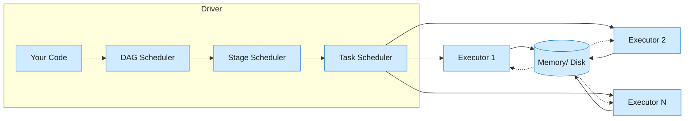

Apache Spark is a unified distributed computing engine for batch, streaming, SQL, ML, and graph processing - one API surface over all of them.

<!--more-->

## What it is

Apache Spark is a unified distributed computing engine for batch, streaming, SQL, ML, and graph processing - one API surface over all of them. The design insight that made it fast was coarse-grained deterministic operators running as in-memory DAG pipelines, with lineage (not replication) for fault tolerance. Instead of persisting data to disk between steps like Hadoop MapReduce, Spark pipelines transformations through memory and only spills when it has to. The 2014 GraySort benchmark told the story: 100TB sorted in 23 minutes on 206 machines - roughly 3x faster than Hadoop MapReduce on 10x fewer machines.

> The key design insight: RDDs are immutable, partitioned collections that track their own DAG lineage. Lose a partition? Recompute it from upstream data - no replication overhead, no checkpointing on every step. Coarse-grained operators (map, filter, join) mean the scheduler can pipeline narrow dependencies and batch wide ones into shuffles. The tradeoff: fine-grained operations (single-record updates) are infeasible, but bulk analytics workloads love it.

Spark is built in Scala with APIs in Python, R, SQL, and Java. As of July 2026, it has 43,613 GitHub stars, 29,275 forks, and ships 4-5 releases per year (4.1.2 is the latest stable; 4.2.0-preview5 is out). The PMC spans Databricks, Adobe, Apple, Google, Microsoft, Netflix - no single company holds a committer majority.

> All quantitative claims in this deep-dive are sourced from the mechanism-map (t_6afc9b17), which reconciled 101 numbers from three independent appendices against Apache Spark 4.1.2 docs, live GitHub API data, Databricks pricing, hyperscaler pricing pages, and the 2014 GraySort benchmark - 83 verified at Tier 1, 18 single-source noted.

## Core concepts you use

**RDD** - The foundational abstraction: an immutable, partitioned collection with lineage-based fault tolerance. You never write RDD code directly anymore, but every DataFrame operation eventually compiles down to RDD stages. If you lose an executor, the DAG scheduler recomputes its partitions from upstream data - no replication cost.

**DataFrame** - A Dataset organized into named columns with a schema. This is the API you actually use. DataFrames unlock the Catalyst optimizer (predicate pushdown, projection pruning, join reordering) and Tungsten execution (off-heap binary format that bypasses Java/Kryo serialization entirely - the single biggest performance win over RDDs). DataFrames in PySpark and Spark SQL share the same physical plan.

**Dataset** - A strongly-typed extension of DataFrame, Scala/Java only. It combines RDD compile-time type safety with DataFrame optimizer benefits. Most teams pick DataFrame for flexibility and skip Dataset unless they need typed encoders.

**SparkSession** - Your entry point. `SparkSession.builder.appName("x").getOrCreate()` hands you a session that wraps the SparkContext, SQL context, streaming context, and catalog. Spark 4.0 defaults to Spark Connect (client-server gRPC), so you can create a session pointing at a remote cluster from a 1.5 MB Python client.

**SparkConf** - Configuration object for tuning. Critical defaults you will change: `spark.executor.memory` (default 1 GB - set 8-16 GB), `spark.sql.shuffle.partitions` (default 200 - tune to data size), `spark.sql.adaptive.enabled` (true since 3.2 - keep it on).

**Partition** - The unit of parallelism. A DataFrame is split into partitions, each processed by one task on one executor core. Default partition size: 128 MB (spark.sql.files.maxPartitionBytes). Too few partitions = underutilized cluster; too many = scheduler overhead and small output files.

**Task** - One unit of work sent to an executor. A task processes one partition. The DAG scheduler splits your job into stages, each stage into tasks. With AQE, the number of tasks adjusts at runtime.

**Executor** - A JVM process that runs tasks and stores cached data. Runs on a worker node. Production config: 4-5 cores per executor (contention above 5), 8-16 GB memory, G1GC enabled. Dynamic allocation (default: 1s scale-up wait, 60s idle timeout) spins executors up and down based on backlog.

**Shuffle** - The wide-dependency barrier. When Spark repartitions or joins across keys, data moves between executors over the network. This is the single biggest performance bottleneck in any Spark job. AQE, push-based shuffle (3.2+), and external shuffle service all exist to mitigate shuffle overhead.

**Cache/persist** - `.cache()` stores a DataFrame in compressed columnar format across executor memory. Levels: MEMORY_ONLY, MEMORY_AND_DISK (spills to disk), DISK_ONLY, OFF_HEAP. Cache preserves lineage for recomputation on eviction. Monitor the Storage tab - if your cached dataset exceeds available memory, LRU eviction causes constant recomputation (cache thrashing).

**Checkpoint** - Truncates the lineage DAG by writing intermediate data to HDFS/S3. Use after deep transformation chains (thousands of RDD steps) to prevent driver OOM on failure recomputation. Unlike cache, checkpoint destroys the recomputation chain - the checkpointed data is the source of truth.

## How it works

Spark's execution pipeline has four layers between your code and the cluster.



**DAG Scheduler** - Takes your logical plan (RDD lineage or DataFrame resolved plan) and splits it into stages at wide-dependency boundaries (shuffle operations like groupBy, join, repartition). Narrow dependencies (map, filter, select) are pipelined into the same stage - no data movement. This is where the magic lives: a 50-operator DataFrame plan becomes a few stages because most operators are narrow.

**Stage Scheduler** - Submits stages for execution. Stages are submitted sequentially (a stage can't start until its parent's shuffle output is ready). Within a stage, all tasks are identical and run concurrently across the cluster.

**Task Scheduler** - Sends tasks to executors with locality preferences. Data locality levels: PROCESS_LOCAL (same JVM, 0-1ms latency), NODE_LOCAL (same machine, 1-10ms), RACK_LOCAL, ANY. Default wait: 3 seconds before falling back.

**Catalyst Optimizer** - Four phases: Analysis resolves column references, Logical Optimization does predicate pushdown, constant folding, and projection pruning, Physical Planning selects join strategies with cost-based optimization, and Code Generation produces Java bytecode via WholeStageCodegen. This last phase is the secret weapon: it collapses a multi-operator pipeline (Filter -> Map -> Aggregate) into a single generated function, eliminating virtual function dispatch. Benchmarks show 3-10x speedup on CPU-heavy workloads.

**Tungsten Execution Engine** - Off-heap binary format (12-16 bytes per object saved), cache-aware memory layout, and WholeStageCodegen. DataFrames and Datasets use Tungsten by default - they bypass Java and Kryo serialization entirely. This is why a DataFrame join is 10x faster than an equivalent RDD join: the data never materializes as JVM objects.

**Adaptive Query Execution (AQE)** - Enabled by default since Spark 3.2. AQE acts on runtime statistics after each stage completes. It coalesces post-shuffle partitions (reducing the partition count if shuffle output is small), splits skewed partitions (auto-detecting and dividing hot join keys), and converts sort-merge joins into broadcast hash joins when the build side is small enough. This is the single most impactful performance feature of modern Spark - turn it on and let it adjust your plan.

**Narrow vs wide dependencies** - The core scheduling distinction. Narrow: each child partition depends on exactly one parent partition - pipelined, no shuffle. Wide: multiple child partitions depend on multiple parents - requires shuffle, creates a stage boundary. Understanding this is how you predict whether a transformation triggers a shuffle.

**Unified Memory Manager** - Execution and storage share the same JVM heap. Execution can evict cached data (LRU) when it needs space. Spill to disk happens when memory pressure exceeds the region. This is why you can cache a 200 GB dataset and still run joins - the engine trades cache for query performance dynamically.

## What you build with it

### ETL and batch processing

The default use case. Read from S3 or HDFS, transform with DataFrames, write partitioned Parquet.

```python
df = spark.read.parquet("s3://landing/logs/2026/07/")
result = (df.filter(col("status") == 200)
          .groupBy("user_id")
          .agg(count("*").alias("hits")))
result.write.partitionBy("date").parquet("s3://curated/user_metrics/")
```

> Gotcha: Speculative execution creates duplicate small output files. With dynamic allocation and thousands of shuffle partitions, every speculated task writes its own copy. Set `spark.sql.files.maxRecordsPerFile` or use AQE coalescing to control output file count. The small file problem is real - HDFS NameNode memory runs out on 50M+ files.

### SQL analytics

Spark SQL against a Hive metastore or Iceberg/Delta tables, using the same Catalyst and Tungsten engine. Runs TPC-DS queries at scale across thousands of executors.

```sql
SELECT region, month, SUM(revenue) as total_revenue
FROM sales JOIN dim_regions ON sales.region_id = dim_regions.id
WHERE year = 2026
GROUP BY region, month
ORDER BY total_revenue DESC
```

> Gotcha: Broadcast join threshold defaults to 10MB (`spark.sql.autoBroadcastJoinThreshold`). A 50MB dimension table that should be broadcast will instead trigger a full sort-merge join. Manually hint it: `/*+ BROADCAST(dim_regions) */`. AQE can promote this at runtime if it detects the build side is small, but the default 10MB threshold catches many teams off guard on their first `SELECT * FROM large_fact JOIN medium_dim`.

### Structured Streaming

Micro-batch processing with exactly-once semantics, checkpoint-based WAL recovery, and the same DataFrame API.

```python
stream = (spark.readStream.format("kafka")
          .option("subscribe", "events")
          .load()
          .selectExpr("CAST(value AS STRING)")
          .select(from_json(col("value"), schema).alias("data"))
          .select("data.*"))
query = (stream.writeStream
         .format("parquet")
         .option("checkpointLocation", "s3://checkpoints/events")
         .start())
```

> Gotcha: This is NOT sub-10ms streaming. Default micro-batch latency is 100ms to multiple seconds. Spark does continuous processing (experimental, sub-ms) with limited SQL coverage. If you need true event-time streaming with complex windows at <10ms latency, Flink is the right tool (26,174 stars, dominant in <100ms streaming). Spark streaming is micro-batch - great for per-minute aggregation, wrong for high-frequency trading.

### ML at scale

MLlib pipelines for feature engineering, vectorization, and model training across datasets too large for a single machine.

```python
from pyspark.ml.feature import VectorAssembler, StandardScaler
from pyspark.ml.regression import RandomForestRegressor
pipeline = Pipeline(stages=[VectorAssembler(inputCols=features, outputCol="raw"),
                            StandardScaler(inputCol="raw", outputCol="scaled"),
                            RandomForestRegressor(featuresCol="scaled")])
model = pipeline.fit(training_data)
```

> Gotcha: Pipeline serialization is fragile. Saving and loading a trained PipelineModel across Spark versions or cluster configurations often breaks due to schema drift or serialization format changes. Export to PMML or MLeap for production serving. PySpark UDFs also incur a Python-to-JVM serialization round-trip per row - use Pandas UDFs with Apache Arrow for Python-heavy feature logic.

### Graph processing

GraphFrames provide a Cypher-like query API (motifs) on top of DataFrames.

```python
from graphframes import GraphFrame
g = GraphFrame(vertices, edges)
chains = g.find("(a)-[e]->(b); (b)-[f]->(c)")
  .filter(col("e.amount") > 1000)
  .filter(col("f.amount") > 1000)
chains.show()
```

> Gotcha: Iterative graph algorithms (PageRank, Label Propagation, Connected Components) still require a full shuffle per iteration. Each iteration triggers a stage boundary and re-partitions the graph. GraphFrames are built on Spark DataFrames, not a specialized graph engine - for sub-second iterative graph queries on trillion-edge graphs, Neo4j or TigerGraph are a better fit.

## Scaling and availability

Spark does not replicate data across executors. The recovery mechanism is lineage: if an executor fails, the DAG scheduler recomputes its lost partitions from upstream data in the DAG. This is the key design tradeoff - no replication overhead during normal operation, but recomputation cost on failure (potentially the entire stage).

**Shuffle is the bottleneck.** Every wide dependency (join, groupBy, repartition) requires data movement across the network. Shuffle spill to disk is 10-100x slower than in-memory processing. The external shuffle service (YARN) or DaemonSet (K8s) keeps shuffle files alive when executors are removed, so dynamic allocation works.

**The failure that surprises people: driver OOM.** `collect()` pulls ALL data to the driver. Default driver memory is 1 GB. Default `maxResultSize` is 1 GB. If you accidentally `collect()` a 5 GB DataFrame, the driver OOMs and the entire application dies. There is no native pagination on `collect()`. The fix: write to distributed storage, use `take(N)` for previews, or `toLocalIterator()` for partition-at-a-time processing.

**GC pauses on large executors.** Heaps above 32 GB cause 10+ second GC pauses with Parallel GC. Standard fix: keep executors at 4-16 GB, use G1GC (`-XX:+UseG1GC -XX:MaxGCPauseMillis=200`), enable Tungsten off-heap, and prefer more small executors over fewer large ones.

## Durability and consistency

**Lineage** - The primary durability mechanism. Every RDD tracks its own DAG - which sources it came from and what transformations were applied. On failure, lost partitions are recomputed. This makes replication unnecessary for fault tolerance.

**Caching** - `.cache()` stores data in compressed columnar format across executor memory (MEMORY_ONLY), with fallback to MEMORY_AND_DISK (spills to disk), DISK_ONLY, or OFF_HEAP. Cache preserves lineage - if a partition is evicted (LRU), it can be recomputed. Monitor the Storage tab: if cache thrashing appears, switch to MEMORY_AND_DISK.

**Checkpointing** - Truncates the DAG lineage by writing partitioned output to reliable storage (HDFS/S3). Essential for long-running streaming queries where lineage would grow infinitely. Unlike cache, checkpointing destroys the recomputation chain - the checkpointed data becomes the source of truth.

**WAL (Structured Streaming)** - Write-ahead logs in the checkpoint location ensure exactly-once semantics. The WAL records offset ranges before processing each micro-batch. On failure, the stream restarts from the last committed offset in the WAL and replays. This is how Spark streaming guarantees no data loss and no duplicates.

## When to use it, and when not to

**Great fit:** Batch ETL on data lakes (S3/HDFS), SQL analytics on multi-terabyte historical data (>1 TB per query), iterative ML feature engineering across large datasets, graph processing on billion-edge graphs, large-scale joins and aggregations (100+ billion rows), micro-batch streaming with per-minute-to-per-hour latency tolerance.

**Wrong fit:** Truly real-time streaming (sub-5ms latency) - Flink wins with 26,174 stars and native event-time processing. Stateful event-time processing with complex windows - Spark micro-batch model adds latency and complexity. Interactive low-latency SQL queries (sub-second) - Presto, Trino, or DuckDB for point queries on single machines. Single-machine data work under 1 TB - Polars (39,008 stars, 10-30x faster than pandas) or DuckDB are dramatically simpler. Python-native data pipelines that need no JVM interop - Dask (13,856 stars) or Polars if you want to avoid the Spark JVM overhead entirely.

**Hard limits:** 2.1 billion partition ID ceiling (32-bit signed int - GraySort's 250,000 reducers is the highest real-world count). Driver memory pressure from `collect()` with a 1 GB default cap. Broadcast variable size limit (spark <= 2.x: Tungsten off-heap pages capped at ~2 GB, relaxed in 3.x but still risky above 1 GB). No single-record updates - Spark is a batch system, not a database.

**Gotchas:** Prefer `reduceByKey` over `groupByKey` (map-side combine avoids materializing entire groups in memory). Thin executor anti-pattern (one executor per node with 32 cores causes GC and thread contention - 4-5 cores per executor is the sweet spot). Data skew in joins (AQE skew join handles this automatically since 3.2, but manual salting still needed for extreme skew ratios above the default factor of 5). Avoid `-- sequence` in named expressions (snake_case with backticks is safer).

## The landscape and editions

| Edition | License | What It Adds | Representative Cost |
|---|---|---|---|
| OSS Apache Spark | Apache-2.0 | Batch, SQL, MLlib, Structured Streaming, GraphX, Spark Connect | $0 software + cluster compute |
| Databricks | Proprietary platform | Photon (C++ vectorized engine, 2-8x SQL speedup), Unity Catalog, managed MLflow, Delta Lake, serverless (10-30s cold start) | Jobs $0.15/DBU, SQL $0.22/DBU, Interactive $0.40/DBU, AI $0.07/DBU |
| AWS EMR | AWS-managed | EMRFS (S3 as filesystem), EMR on EKS, EMR Serverless (~60s cold start), instance fleets | ~$0.30/hr for m5.xlarge (EC2 + 25% EMR surcharge) |
| Google Dataproc | GCP-managed | Preemptible VMs (60-91% discount), BigQuery connector, component gateway | $0.010-0.06/vCPU-hr surcharge on GCE |
| Azure Synapse Spark | Azure-managed | ADLS Gen2 integration, GPU-accelerated Spark (preview), Synapse Link, Power BI integration | $0.143/vCore-hr (memory optimized) |
| AWS Glue | AWS-managed serverless | Truly serverless (no cluster config), Data Catalog, job bookmarks, visual ETL studio | $0.44/DPU-hr (1 DPU = 4 vCPU + 16 GB) |

Apache-2.0 licensing means zero relicensing risk. OSS Spark is the only edition with full portability across clouds. Databricks dominates on developer experience and Photon performance but locks you into workload-class billing. Glue is the most expensive per compute-hour but the most hands-off. EMR and Dataproc are cost-leaders for teams that already run AWS or GCP. Azure Synapse is catching up with GPU-accelerated Spark.

The open table format race is converging: Iceberg (9,046 stars) recently passed Delta Lake (8,905 stars) on GitHub and is the default table format outside Databricks. Databricks revenue hit $6.9B ARR by June 2026 with >140% net dollar retention - the platform premium is real and growing.

## Where it's heading

**Spark 4.x and Spark Connect GA** - Spark Connect decouples clients from the JVM driver via gRPC. The pyspark-client is now 1.5 MB (vs ~250 MB full PySpark). Polyglot clients exist for Go (253 stars), Rust (34 stars), and Swift (30 stars) - early but growing. Spark 4.2.0-preview5 is available as of May 2026.

**Databricks Photon** - A proprietary C++ vectorized execution engine that replaces parts of Spark SQL's Tungsten. Databricks claims 2-8x SQL speedup. It is closed-source and Databricks-only, but the performance pressure drives OSS Spark improvements in Catalyst and Tungsten.

**Better Kubernetes integration** - The Apache spark-kubernetes-operator is the recommended entry point for new deployments (298 stars, active). K8s is the recommended cluster manager for greenfield deployments, gradually replacing YARN.

**Improved observability** - Spark 4.0+ includes structured logging, Prometheus metrics endpoint, and better Spark UI for tracking AQE decisions. The gap with Flink's monitoring story is narrowing.

**The competitive landscape is changing.** Ray (43,248 stars) is within 400 stars of Spark, winning AI/ML mindshare for distributed training and inference. Polars (39,008 stars) is eating the single-machine analytical workload from below. Flink (26,174 stars) owns true streaming. Spark remains the default for batch data engineering at terabyte-to-petabyte scale, but the monolithic "one engine for everything" vision is fragmenting into specialized tools for each workload.

## References

1. [Apache Spark Cluster Overview (4.1.2)](https://spark.apache.org/docs/latest/cluster-overview.html)
1. [Apache Spark SQL Programming Guide (4.1.2)](https://spark.apache.org/docs/latest/sql-programming-guide.html)
1. [Apache Spark RDD Programming Guide (4.1.2)](https://spark.apache.org/docs/latest/rdd-programming-guide.html)
1. [Apache Spark SQL Performance Tuning (4.1.2)](https://spark.apache.org/docs/latest/sql-performance-tuning.html)
1. [Apache Spark Configuration (4.1.2)](https://spark.apache.org/docs/latest/configuration.html)
1. [Apache Spark Structured Streaming Guide (4.1.2)](https://spark.apache.org/docs/latest/structured-streaming-programming-guide.html)
1. [Apache Spark Running on Kubernetes (4.1.2)](https://spark.apache.org/docs/latest/running-on-kubernetes.html)
1. [Apache Spark Release News](https://spark.apache.org/news/)
1. [Apache Spark 4.0.0 Release Notes](https://spark.apache.org/releases/spark-release-4-0-0.html)
1. [Databricks Blog - Reynold Xin, "Spark Petabyte Sort" (Oct 10, 2014)](https://www.databricks.com/blog/2014/10/10/spark-petabyte-sort.html)
1. [Databricks Product Pricing](https://www.databricks.com/product/pricing/)
1. [AWS EMR Pricing](https://aws.amazon.com/emr/pricing/)
1. [AWS Glue Pricing](https://aws.amazon.com/glue/pricing/)
1. [Google Cloud Dataproc Pricing](https://cloud.google.com/dataproc/pricing/)
1. [Azure Synapse Analytics Pricing](https://azure.microsoft.com/en-us/pricing/details/synapse-analytics/)
1. [Sacra - Databricks company profile](https://www.sacra.com/c/databricks/)
1. Chambers and Zaharia - [Spark: The Definitive Guide](https://www.oreilly.com/library/view/spark-the-definitive/9781491912201/), O'Reilly Media (2018)
1. Karau et al. - [Learning Spark, 2nd Edition](https://www.oreilly.com/library/view/learning-spark-2nd/9781492050032/), O'Reilly Media (2020)
1. [GitHub REST API](https://api.github.com/) - apache/spark, apache/iceberg, delta-io/delta, apache/hudi, mlflow/mlflow, apache/flink, ray-project/ray, dask/dask, pola-rs/polars, apache/spark-kubernetes-operator, apache/spark-connect-go, apache/spark-connect-rust, apache/spark-connect-swift
1. [Cloudera Data Platform](https://www.cloudera.com/products/cloudera-data-platform.html)
