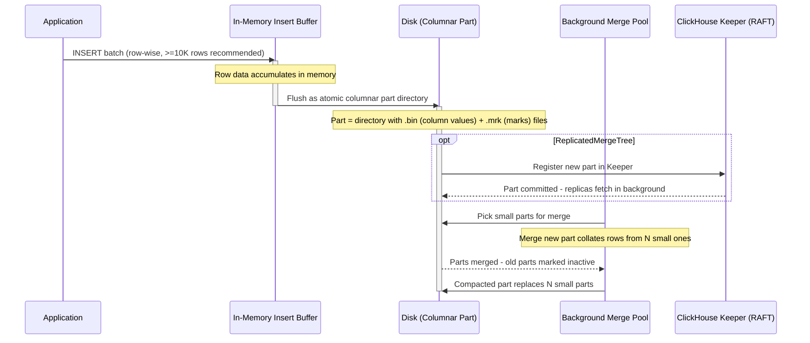

ClickHouse is a column-oriented OLAP database that turns analytical queries over billions of rows into sub-second responses.

<!--more-->

## What it is

ClickHouse is a column-oriented OLAP database that turns analytical queries over billions of rows into sub-second responses. It is the tool you reach for when PostgreSQL is fast enough on your 10-million-row table but chokes on 100 million, and when you need to serve aggregated queries to a dashboard, not point lookups for a user-facing feature. ClickHouse stores data one column at a time instead of one row at a time, which means a query that asks for `SUM(revenue)` across a year reads exactly one column off disk - not the other 50 columns in the table, not the primary key index, not the toast storage. It runs on a single binary (no separate coordinator, no Hadoop dependency), uses SQL as its query language, and optimizes for scans and aggregations rather than single-row operations.

> [!TIP]
> **The one big design choice: row-wise inserts plus columnar merge-tree storage.** Most databases pick one storage model (row-oriented for OLTP, columnar for OLAP). ClickHouse accepts row-oriented INSERT batches for fast ingestion, then converts those rows into compressed columnar files on disk via an LSM-like background merge process. This means ingestion is fast (batch writes hit RAM first, flush to disk as atomic part directories) and reads are fast (column pruning, SIMD vectorized execution, sparse primary indexes). The cost is that individual row mutations are expensive - updating one row in a 10 GB data part rewrites the entire part.

## Core concepts

These are the primitives you actually reach for when you build with ClickHouse:

- **MergeTree engine family.** Eight base table engines that share the same storage and merge logic but differ in how they collapse rows during background merges. `MergeTree` is the general-purpose default. `ReplacingMergeTree` deduplicates by sorting key. `SummingMergeTree` sums numeric columns of same-key rows. `AggregatingMergeTree` stores aggregate function states for incremental rollups. Each engine has a `Replicated` variant that adds multi-master replication via ClickHouse Keeper.
- **Partitioning key (`PARTITION BY`).** Splits data into directory-level partitions so queries can skip entire partition subtrees. A common choice is `toYYYYMM(event_time)` for monthly partitions. The key constraint: never partition finer than hourly - each partition accumulates its own unmerged parts and partitions never merge with each other.
- **Ordering key (`ORDER BY`).** Controls how rows are sorted within a part and serves as the sparse primary index. A query that filters on the leading column of the ordering key reads only the relevant granules (8,192-row blocks). Unlike a b-tree index, there is only one physical sort order per table - choose the most common filter column first.
- **Data skipping indexes (`INDEX ... TYPE`).** Secondary indexes on granules: min-max summaries, bloom filters, set indexes, or token-based N-gram indexes. They skip granules at read time without scanning them. Useful for high-cardinality filter columns that are not the first column of the ordering key.
- **Materialized views.** INSERT-triggered tables, not query-time materializations. When data arrives in the source table, the MV's SELECT fires and writes the result to a target table (usually an `AggregatingMergeTree`). The view is always fresh by construction - no periodic REFRESH, no lag beyond the INSERT itself.
- **Projections.** An alternative to materialized views that lives inside the source table. A projection stores a reordered or pre-aggregated copy of the data in a hidden column group, and the query optimizer picks it automatically when the query pattern matches. Simpler to manage than MVs because there is no separate table lifecycle.

## How it works

ClickHouse's architecture centers on the merge-tree storage model - a write path optimized for batches and a read path built for columnar scans.



**The write path.** An INSERT arrives as a block of row-oriented data (the default `max_insert_block_size` is 1,048,576 rows). The block lands in an in-memory buffer. On flush - triggered by buffer size or a configurable interval - ClickHouse writes the block atomically to disk as a new part directory. Each part directory contains one `.bin` file per column (the actual columnar data, compressed with LZ4/ZSTD), one `.mrk` (mark) file per column (sparse index positions within the column), and a primary index file (`primary.idx`). There is no central WAL file in the LSM-sense: ClickHouse achieves crash safety through part atomicity - a part is either fully written or not present. Background merges (controlled by `background_pool_size`) continuously pick small parts and compact them into larger ones, sorting rows by the ordering key and applying any engine-specific collapse logic (deduplication, summing, aggregation). The merge is the only mutation mechanism for on-disk data.

**The read path.** A SELECT statement hits the query planner, which determines which columns to read (column pruning) and which partitions to scan (partition pruning based on the `WHERE` clause against the partitioning key). Within each surviving partition, the sparse primary index identifies which 8,192-row granules match the filter. For each matched granule, the relevant `.bin` columns are decompressed and processed in vectorized batches using SIMD instructions - ClickHouse processes data in tight loops over CPU registers, not row-by-row interpretation. The example query on the ClickHouse intro page scans 100 million rows in 92 milliseconds by reading only the requested columns and skipping the rest.

## What you build with it

### Event analytics with materialized views

The most common ClickHouse pattern: raw event data lands in a `MergeTree`, and a materialized view continuously aggregates it into minute or hourly buckets in an `AggregatingMergeTree`.

```sql
CREATE MATERIALIZED VIEW events_hourly
ENGINE = AggregatingMergeTree
ORDER BY (event_type, toStartOfHour(event_time))
AS SELECT
    event_type,
    toStartOfHour(event_time) AS hour,
    countState(*) AS events,
    uniqState(user_id) AS unique_users
FROM raw_events
GROUP BY event_type, hour;
```

**The gotcha:** Materialized view INSERTs are not atomic with the source table. If the MV SELECT fails (bad data, schema mismatch), the source INSERT succeeds silently and you lose those events in the aggregated view. Monitor `system.materialized_views` for lag and failed inserts.

### Time-series rollups with AggregatingMergeTree

For metric data at scale - think millions of time series from server metrics, IoT sensors, or application telemetry - the `AggregatingMergeTree` engine collapses rows with the same sorting key by combining aggregate function states. A `-State` combinator stores intermediate state (a HyperLogLog sketch for distinct counts, a t-digest for quantiles), and a `-Merge` combinator finalizes it on read.

```sql
CREATE TABLE metrics_1min (
    metric_name String,
    ts DateTime,
    val_count AggregateFunction(count),
    val_sum AggregateFunction(sum, Float64)
) ENGINE = AggregatingMergeTree
ORDER BY (metric_name, ts);
```

**The gotcha:** Choose the ordering key carefully. Dimensions outside the ordering key are not deterministic during merges - v24+ blocks such schemas by default with `allow_dimensions_outside_sorting_key = 0`. Every aggregation column you query must be explicitly defined with the correct `AggregateFunction` type.

### Log observability

ClickHouse is increasingly the backend for log platforms (Grafana Loki's storage layer was designed around it). It ingests log data at roughly ~500 MB/s per node, compresses it 6-10x, and can run full-text searches using `hasToken` with bloom filter indexes or the full-text index (v24.6+).

```sql
CREATE TABLE logs (
    timestamp DateTime,
    level LowCardinality(String),
    message String,
    service String,
    trace_id UUID
) ENGINE = MergeTree
PARTITION BY toDate(timestamp)
ORDER BY (service, timestamp)
INDEX msg_bloom message TYPE tokenbf_v1(256, 3, 0) GRANULARITY 1;
```

**The gotcha:** LIKE `'%text%'` scans every row in the selected partitions - there is no built-in inverted index. Use `hasToken()`, bloom filter indexes, or the full-text index (v24.6+) for text search. On wide tables, every column read inflates I/O even if you only need the message field.

### Real-time dashboards

The use case that gave ClickHouse its reputation: dashboards that need to refresh in under a second over tens of billions of rows. A well-designed table with monthly partitioning, a concise ordering key, and a materialized view for the pre-aggregated view can serve HTTP-level dashboard queries at 50-200 concurrent connections on a 16-core node.

**The gotcha:** A single heavy aggregation on a high-cardinality column (50M unique user IDs) can exhaust `max_memory_usage` (default 10 GB per query) and starve other queries. Mitigate with `max_bytes_before_external_group_by` to spill to disk, or pre-aggregate with materialized views. Use Workload Scheduling (v24+) to reserve resources.

### Feature stores

ML pipelines use ClickHouse to compute batch features - aggregations over user event histories that are materialized into feature vectors for model inference. The columnar storage means computing 50 features over 500M user events reads exactly the columns you need, and the sparsity of ML features maps naturally to columnar compression.

**The gotcha:** ClickHouse is not a good online feature store. Point lookups for a single user read an entire 8,192-row granule, and on a wide feature table (100+ columns) that means reading megabytes for one row. Use ClickHouse for batch feature computation, then load features into Redis or RocksDB for online serving.

## Scaling and availability

ClickHouse scales horizontally through distributed tables and sharding, and survives node failures through multi-master replication coordinated by ClickHouse Keeper.

**Distributed tables.** A `Distributed` engine table is a scatter-gather proxy: it routes INSERTs to the right shard (based on a sharding key - typically a hash of the main entity ID) and merges query results from all shards at query time. Every distributed query pays a network round-trip + merge overhead, so for sub-100ms query targets, a single powerful node with local queries is often faster than a distributed cluster.

**Replication.** ReplicatedMergeTree variants use ClickHouse Keeper (a RAFT-based coordination service, ZooKeeper-compatible, C++ implementation) or legacy ZooKeeper. Each INSERT generates roughly 10 Keeper transactions. ClickHouse Keeper handles ~100,000 transactions per second (versus ZooKeeper's ~10,000), so Keeper is strongly preferred. Replication is asynchronous multi-master - a write goes to one replica and others catch up in the background. The `insert_quorum` setting controls how many replicas must acknowledge before the INSERT succeeds.

**The hot shard problem.** If the sharding key concentrates writes on one node (e.g., sharding by `cityHash64(user_id)` when one user generates 90% of events), that node becomes a bottleneck. Mitigations include weighted sharding, `SharedMergeTree` (the ClickHouse Cloud architecture with shared object storage), or manual partition rebalancing.

**The "too many parts" error.** The number one production killer. If every INSERT creates a new part and merges cannot keep up, ClickHouse throws `DB::Exception: Too many parts (N). Merges are processing significantly slower than inserts.` The hard limits: `max_parts_in_total` = 100,000 per table; `parts_to_throw_insert` = 300 per partition; `parts_to_delay_insert` = 150 per partition (triggers a 1s delay per excess part). Common root causes: inserting too many small batches (batch to at least 10K rows or use `async_insert`), partitioning by sub-hour granularity (partitions never merge with each other), or starved merge threads (large mutations consume the merge pool - kill with `KILL MUTATION`).

## Consistency and durability

ClickHouse's consistency model is designed for analytics, not transactions.

**Inserts.** The default synchronous insert mode writes each part atomically to disk. There is no separate WAL in the LSM sense - crash safety comes from part-atomicity: a partial part write is discarded on restart. With `async_insert = 1`, small inserts are buffered server-side and flushed in batches, which improves throughput but introduces a durability window - if the server crashes before the buffer flushes, those inserts are lost.

**Replicated consistency.** Replication is asynchronous by default: the INSERT returns to the client as soon as the local part is written, and replicas catch up in the background. For stronger guarantees, `insert_quorum=2` waits for a second replica to acknowledge before the client gets a response. There is no strict serializability across shards - distributed queries use eventual consistency for multi-shard reads.

**Mutations.** `ALTER TABLE ... UPDATE/DELETE` are asynchronous, non-rollbackable, and expensive. They rewrite entire data parts containing matching rows - updating a single row in a 10 GB part rewrites the entire 10 GB. Mutations run in the merge thread pool and compete with normal merges, so a large mutation can stall ingestion. Monitor progress through `system.mutations WHERE is_done = 0`. Lightweight updates (v24+, "patch parts") use column deltas plus row masks and are significantly more efficient, though they have compatibility constraints.

**What you can lose.** With default settings, a single-node setup can lose unflushed async buffers (up to ~1M rows). An unplanned restart during a merge loses nothing (old parts remain until the new part is fully written). In a replicated setup with `insert_quorum=0`, a replica failure before it fetches a part means that part is lost for that replica but served from other replicas.

## When to use and when not to

**Great fit:** Analytical queries over billions of rows where you need sub-second response times - dashboards, monitoring, observability, event analytics, time-series rollups. High-ingestion workloads (100K-1M rows/s per node) with append-heavy data. Log storage and query with 6-10x compression. Batch feature computation for ML pipelines. Any scenario where you query most rows but only a few columns.

**Wrong fit:** OLTP workloads requiring row-level operations, single-row point lookups under 1ms (ClickHouse reads entire granules), or frequent updates and deletes. Full-text search at Elasticsearch scale - LIKE `'%text%'` scans every row, and the full-text index (v24.6+) is still maturing. Transactional workloads that need ACID across rows or tables. High concurrency with many concurrent complex aggregations (5-20 on a 16C/64GB node is the ~range). Multi-region active-active deployments - ClickHouse does not natively support them.

**Hard limits that bite newcomers:**

- `max_memory_usage` defaults to 10 GB per query - a GROUP BY over 50M unique values can blow past it.
- Partitioning finer than monthly creates thousands of partition directories that never merge - each partition accumulates its own parts and has a hard cap of `parts_to_throw_insert` = 300.
- Joins are not ClickHouse's strength - they load the right-hand table into memory. Large joins exhaust memory.
- The `max_parts_in_total` ceiling of 100,000 per table is easy to hit with small frequent inserts or excessive partitioning.

## Editions and landscape

| Edition | License / Model | What it adds | Representative cost |
|---|---|---|---|
| OSS ClickHouse | Apache-2.0 | Maximum control, self-managed | $0 software, infra extra |
| ClickHouse Cloud Basic | Commercial SaaS | Managed scaling, backups, SQL console | $25.30/TB storage + $0.2181/compute-unit/hr |
| ClickHouse Cloud Scale | Commercial SaaS | Unlimited storage, configurable compute, 2+ AZs, private networking | $25.30/TB storage + $0.2985/compute-unit/hr |
| ClickHouse Cloud Enterprise | Commercial SaaS | SAML SSO, private regions, CMEK, HIPAA/PCI | $25.30/TB storage + $0.3903/compute-unit/hr |
| [Altinity.Cloud](http://altinity.cloud/) | Commercial managed | Kubernetes-native, BYOC option, LTS builds | Quote-based |
| Tinybird | Commercial managed | ClickHouse-backed serverless analytics, SQL-as-API | $49/mo Developer (0.5 vCPU, 25 GB) |
| BYOC | Commercial, customer VPC | ClickHouse Cloud in your AWS/GCP account | Custom pricing |

A production self-managed deployment with 3x i4i.2xlarge nodes (16 vCPU, 64 GB each) plus EBS storage runs approximately $1,200/month on AWS. ClickHouse Cloud Basic at the same compute tier starts at roughly $500/month depending on workload.

**Adjacent but different:** DuckDB (embedded in-process OLAP, not a server), Materialize (SQL streaming with incremental views), Quickwit (Rust search/analytics engine), Hydra (columnar Postgres extension). None of these are ClickHouse forks or competitors in the same deployment model.

## Where it is heading

**Query optimizer improvements.** ClickHouse's planner has historically been rule-based; v24+ introduced cost-based join ordering and predicate pushdown improvements. The trajectory is toward a more PostgreSQL-like optimizer that can handle complex multi-table queries without manual tuning.

**Parquet and Arrow native support.** ClickHouse can already read Parquet files via the `Parquet` table function, and Arrow-formatted data is gaining deeper integration for efficient interchange with data lakes and Spark.

**CDC connectors.** ClickPipes is ClickHouse Cloud's managed change-data-capture service. The OSS side has community connectors for Kafka, Debezium, and PostgreSQL logical replication that are becoming more tightly maintained.

**Keeper evolution.** ClickHouse Keeper continues to replace ZooKeeper as the default coordination layer. Upcoming releases focus on reducing per-insert transaction overhead and improving performance under high-partition-count workloads.

**SharedMergeTree.** ClickHouse Cloud's architecture - compute nodes accessing shared object storage (S3) - is making its way to OSS as `SharedMergeTree`. This decouples compute from storage, enabling instant read replicas and more flexible scaling.

## References

1. [ClickHouse Introduction](https://clickhouse.com/docs/intro)
1. [MergeTree Engine Family](https://clickhouse.com/docs/en/engines/table-engines/mergetree-family)
1. [MergeTree Table Engine Reference](https://clickhouse.com/docs/en/engines/table-engines/mergetree-family/mergetree)
1. [MergeTree Settings](https://clickhouse.com/docs/en/operations/settings/merge-tree-settings)
1. [Replication Documentation](https://clickhouse.com/docs/en/engines/table-engines/mergetree-family/replication)
1. [Materialized Views](https://clickhouse.com/docs/en/query-language/views)
1. [Distributed Engine](https://clickhouse.com/docs/en/engines/table-engines/special/distributed)
1. [Sizing and Hardware Recommendations](https://clickhouse.com/docs/en/guides/sizing-and-hardware-recommendations)
1. [ClickHouse vs PostgreSQL Comparison](https://clickhouse.com/comparison/postgresql)
1. [ClickHouse GitHub Repository](https://github.com/ClickHouse/ClickHouse)
1. [ClickHouse Pricing](https://clickhouse.com/pricing)
1. [Common Getting Started Issues](https://clickhouse.com/blog/common-getting-started-issues-with-clickhouse)
1. [ClickHouse Cloud Editions](https://clickhouse.com/docs/en/cloud/manage/plans)
