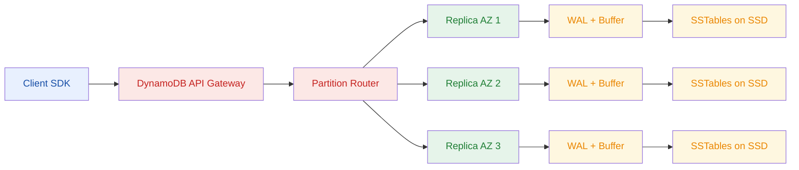
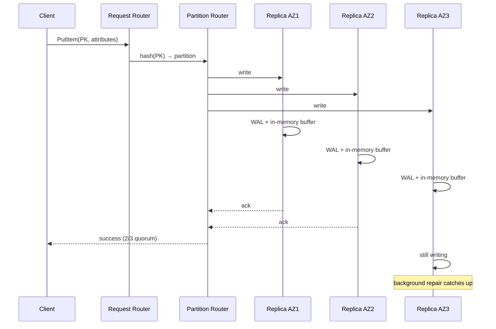

DynamoDB is a fully managed NoSQL key-value and document database built by AWS.

<!--more-->

## The Database That Taught the Cloud How to Scale

> [!TIP]
> DynamoDB's biggest bet is not about query power - it's about eliminating operational scaling. You never split a shard, never fail over a replica, never resize storage. The trade is that every query must go through a single partition key (plus an optional sort key), and if your access pattern cant be expressed as PK + optional SK filter, DynamoDB is the wrong tool. The entire design follows from this one constraint: predictable single-digit-millisecond latency at any scale comes from keeping each request on one partition.

DynamoDB is a fully managed NoSQL key-value and document database built by AWS. It is the database behind Amazon's own shopping cart (which processes millions of requests per second on Prime Day), and it powers some of the largest SaaS platforms, gaming backends, and ad-tech systems in production today. What makes it different from a traditional relational database is that it was designed from the ground up for operational simplicity: you define a schema around a single partition key (hash) and an optional sort key (range), and DynamoDB transparently distributes and replicates your data across three Availability Zones with no manual sharding, no replica management, and no storage provisioning.

The mental model is a distributed hash table with sorted range queries per key. If your workload fits that shape, DynamoDB is hard to beat. If it does not, the limitations (eventual-only secondary indexes, expensive scans, no JOINs) will frustrate you until you migrate off.

## Core Concepts

**Tables, Items, Keys.** A table is a collection of items, each up to 400 KB (including attribute names). Every item MUST have a partition key (1-2,048 bytes) - a hash key that determines which physical partition owns the item. An optional sort key (1-1,024 bytes) lets you run range queries (BETWEEN, begins_with, >, <) and do sorted reads within a partition key. The combination (PK + SK) is the primary key and must be unique. A table with only a partition key enforces uniqueness on the PK alone; a table with a composite key (PK + SK) can have many items sharing the same PK, differentiated by SK.

**Local Secondary Indexes (LSIs).** Up to 5 per table, defined at table creation (you cannot add them later). An LSI mirrors the base table using a different sort key but the same partition key. Crucially, LSIs support strongly consistent reads, making them the only secondary index type that does. The trade: each LSI shares the base table's partition throughput, and the item collection per partition key is capped at 10 GB.

**Global Secondary Indexes (GSIs).** Up to 20 per table, can be created or deleted at any time. A GSI has its OWN partition key (and optional sort key) - it is a separate table that DynamoDB maintains asynchronously. GSI queries are ALWAYS eventually consistent. The critical operational gotcha: if a GSI's write throughput is too low, it backpressures writes to the BASE table, causing throttling on writes that look healthy at the table level.

**Capacity Modes.** Three pricing models. *Provisioned*: you specify read and write capacity units ($0.00065/WCU-h, $0.00013/RCU-h). *On-demand*: pay per request ($0.625/M WRU, $0.125/M RRU). *Reserved*: commit to 1 or 3 years for up to 54-77% discount over provisioned. For steady-state workloads, provisioned is about 3.3x cheaper than on-demand at the 1TB + 5K WCU + 5K RCU reference point ($3,064/month vs $9,976/month). A table can switch between provisioned and on-demand up to 4 times per 24-hour window.

**Read/Write Units.** 1 WCU = one 1 KB write per second. 1 RCU = one 4 KB strongly consistent read per second, or two 4 KB eventually consistent reads (at 0.5 RCU each). Transactional operations cost 2x: 2 RCU per 4 KB, 2 WCU per 1 KB.

## How DynamoDB Works Internally

### Architecture Flow



**Consistent Hashing and Partitioning.** DynamoDB hashes the partition key through a consistent hashing ring to map items to logical partitions. Multiple logical partitions share a physical storage node. When a physical partition exceeds 10 GB (a limit that matters when LSIs are present, since every item under the same PK counts toward the 10 GB collection limit) or hits its throughput ceiling, DynamoDB splits it transparently - no downtime, no reprovisioning, no operator action. This is the operational promise: you never think about shards.

**Three-AZ Leaderless Replication.** Every partition is replicated across three Availability Zones in a leaderless, multi-master model. Any replica can serve reads and accept writes. There is no elected primary, no failover protocol, no replica promotion - the system is symmetric. Writes are acknowledged after 2 of 3 replicas confirm persistence to their Write-Ahead Log (WAL). The same 2/3 quorum is used for strongly consistent reads: DynamoDB reads from two replicas and returns the most recent value using internal vector-clock ordering.

**LSM Storage Engine.** Under each replica sits a Log-Structured Merge-tree (LSM-tree) engine writing to SSD. Writes hit an in-memory buffer and an append-only WAL for durability, then flush to immutable Sorted String Tables (SSTables). Background compaction merges SSTables to reclaim space and bound read amplification. Bloom filters (reportedly >95% hit rate) short-circuit point lookups on keys that do not exist. Because SSTables are sorted, range queries over sort keys are efficient without an index scan.

### Write Path (Sequence)



The client sends a PutItem, UpdateItem, or DeleteItem to the DynamoDB API endpoint. The Request Router (an AWS API Gateway layer) routes to the closest AZ-aware endpoint. The Partition Router hashes the partition key and maps to the partition's three storage nodes. Writes propagate concurrently to all three. Each node writes to its in-memory buffer and WAL first. After 2 of 3 acknowledge, the client receives success. Background read-repair and anti-entropy reconcile the third replica if it lagged. The entire round trip is under 10 ms p99 for items under 4 KB.

## What You Build With DynamoDB

Every pattern below follows the same constraint: you access data by partition key, optionally filtered or sorted by sort key. When you design around this shape, DynamoDB rewards you with sub-10 ms p99 and zero ops.

### Session Store

The simplest DynamoDB application. PK = session_id (a UUID), item = the full session blob as a document. Enable Time-To-Live (TTL) on a `expires` attribute - DynamoDB deletes expired sessions automatically (though deletion can lag up to 48 hours, so always check expiry in application code for security-sensitive operations).

```python
table.put_item(Item={"session_id": session_id, "data": blob, "expires": expiry_ts})
```

> ⚠ TTL deletion is NOT real-time. Expired sessions can be read for up to 48 hours after expiry. Never rely on TTL alone for security invalidation - check expiry in your read path.

### Event Sourcing with DynamoDB Streams

DynamoDB Streams captures every item-level change (INSERT, UPDATE, DELETE) as a time-ordered sequence. Each stream shard processes roughly 5 reads/second at 1 MB/s, with a total throughput of 25 MB/s per stream. The 24-hour retention is not configurable - if your consumers fall behind, events are lost.

```python
for record in stream_records:
    if record["eventName"] == "INSERT":
        handle_event(record["dynamodb"]["NewImage"])
```

For longer retention, use Kinesis Data Streams for DynamoDB (separate pricing at $0.10 per million CDC units), which integrates with KCL 2.x for checkpointed replay over days or weeks.

> ⚠ Stream events are eventually consistent by the time they arrive. A read immediately after a write may see the event from the stream before it appears in a strongly consistent read, or vice versa. Do not assume causal ordering between Streams and the base table.

### Game State and Leaderboards

A single item stores the full player state (position, inventory, health). A GSI on `score` or `level` serves the leaderboard query. The composite PK/SK pattern lets you store all a player's characters under one PK (`player_<id>`) differentiated by SK (`character_<name>`).

```python
# Write player state
table.put_item(Item={"pk": "player_abc123", "sk": "state", "score": 9500, "level": 12, "inventory": [...]})
# Query leaderboard (GSI on score)
leaderboard = gsi.query(IndexName="score-index", KeyConditionExpression=Key("score").gt(0), ScanIndexForward=False, Limit=100)
```

> ⚠ Leaderboard queries on a GSI are eventually consistent. A player who just set a high score may not appear in the GSI read for several hundred milliseconds. If you need read-your-writes on leaderboards, use a hybrid: write to base table, then use DAX for the read path (short TTL), or accept the eventual consistency.

### Meta-Index (Attribute Lookup)

Use a GSI on a metadata attribute (status, type, region) to find items by criteria other than the primary key. This is the access pattern behind "find all orders with status = PENDING" or "list all jobs in us-east-1".

```python
pending = gsi.query(IndexName="status-index", KeyConditionExpression=Key("status").eq("PENDING"))
```

> ⚠ GSI backpressure is the most common DynamoDB reliability surprise. If the GSI's write throughput is too low, DynamoDB throttles writes to the BASE table, even though the base table looks healthy. Always monitor ThrottledWriteEvents on every GSI. Provision GSIs generously or use auto-scaling on them independently.

### Time-Series Data

Use a composite sort key encoding a timestamp: `sk = "metric_<name>#<ISO-timestamp>"`. This exploits the natural sort order of SSTables, making range queries over a time window efficient. The hot partition problem appears when all writes target the same partition key (e.g., `pk = "sensor_123"`). Mitigate with write sharding - add a random suffix to spread writes across partitions.

```python
# Sharded time-series write
shard = random.randint(0, 9)
table.put_item(Item={"pk": f"sensor_123_{shard}", "sk": "reading#2026-07-17T12:00:00Z", "value": 42.5})
```

> ⚠ A partition key based on a TIMESTAMP (e.g., `pk = "2026-07-17"`) concentrates ALL writes on ONE partition, capping throughput at 1,000 WCU regardless of how much you provision. This is the single most common DynamoDB performance mistake. Always use a high-cardinality partition key or add a shard suffix.

## Scaling and Availability

### Partition Throughput

Every physical partition is capped at 3,000 RCU (strongly consistent) or 6,000 RCU-equivalent (eventually consistent) for reads, and 1,000 WCU for writes. If your access pattern concentrates traffic on a single partition key, 10,000 provisioned WCU on the table gives you exactly 1,000 usable WCU for that key. The rest is idle capacity.

**Adaptive Capacity.** DynamoDB's adaptive capacity mitigates this by detecting hot items and automatically isolating them onto dedicated physical partitions, up to the full partition throughput ceiling. It does not create extra capacity - it reallocates table-level throughput to where it is needed. For workloads with a few hot keys in an otherwise cool table, this works well. For workloads where ALL traffic hits one key (timestamp PK), it does not help.

### Burst Capacity

Unused provisioned throughput accumulates in a burst bucket for up to 300 seconds (5 minutes). A table running at 100% utilization sees zero accumulation, so any spike above provisioned throughput - even 105% for 30 seconds - causes immediate throttling. Standard practice is to provision at 70-80% target utilization and let auto-scaling add capacity during sustained traffic.

### DAX (DynamoDB Accelerator)

DAX is an in-memory cache that sits in front of DynamoDB, advertised as delivering up to 10x performance improvement (microsecond latency vs single-digit milliseconds). It works well for read-heavy, eventually-consistent workloads (session stores, product catalogs). But DAX caches local reads only - writes replicated from other Regions via Global Tables bypass DAX entirely, and stale data is served until the TTL expires.

> ⚠ DAX is dangerous with Global Tables. A write in us-west-2 is not visible to DAX in us-east-1 until the DAX TTL expires. Use short TTLs (30-60 seconds) for multi-region tables, or skip DAX entirely.

### Global Tables (Multi-Region)

Two replication modes. *MREC* (Multi-Region Eventually Consistent, default): replicates within 0.5-2.5 seconds in the same geographic area. No ordering guarantees across regions. *MRSC* (Multi-Region Strongly Consistent, GA June 2025): synchronous replication with RPO=0 across regions, requiring a witness Region. Multi-account support (GA February 2026) lets tables replicate across AWS accounts via replication groups.

Conflict resolution is Last Writer Wins (LWW) - the write with the later internal timestamp wins, and the losing write is silently discarded with no alert, no conflict log, no event.

> ⚠ LWW conflict resolution causes silent data loss in concurrent multi-region writes. If two regions increment a counter simultaneously, one increment disappears. Use application-level conflict resolution: route users to a single write Region, use versioned CRDT patterns, or accept that LWW means the last write to the same item wins unconditionally.

### Hot Key / Hot Partition

Ranked as the #1 failure mode in DynamoDB production. A single partition key receives disproportionate traffic and hits the 1,000 WCU / 3,000 RCU ceiling. Real scenario: a timestamp-based PK (e.g., `order_2026-07-17`) concentrates all writes on one partition. 10,000 WCU provisioned, 1,000 WCU actually usable, 90% of throughput is wasted.

Fix: write sharding (add a random suffix to the PK), use composite sort keys (PK = high-cardinality like user_id, SK = timestamp), or use UUID partition keys. Adaptive capacity helps but does not solve a single-key hotspot.

## Durability and Consistency

DynamoDB offers three read consistency levels. The cost and guarantees differ sharply:

**Eventually Consistent (default, 0.5 RCU per 4 KB).** Reads from any replica. May return stale data. This is the cheapest option and covers the vast majority of use cases: product catalogs, social feeds, leaderboards, dashboards.

**Strongly Consistent (1 RCU per 4 KB).** Reads from 2 of 3 replicas using vector-clock comparison. Returns the most up-to-date value. Only available on tables and LSIs - NOT on GSIs or Streams. If your application requires read-your-writes (you update a user's profile, then immediately read it back and expect the new value), you need strongly consistent reads on the base table.

**Transactional (2 RCU/WCU per unit).** ACID guarantees across up to 100 unique items and 4 MB total data. Transactions CAN span multiple tables in the same Region and account (a common misconception is that they are single-table only - they are not). Use TransactWriteItems for operations where partial failure is unacceptable: transferring funds between two accounts, updating order state and inventory atomically.

The honest tradeoff: strongly consistent reads cost 2x and are not available on GSIs. If your primary access pattern is GSI-based (which it often is, since GSIs let you query by non-key attributes), you are limited to eventual consistency. Applications that truly need strong consistency across secondary indexes should consider a different architecture - a relational database with a read replica, or a materialized view maintained by application code.

Transactions carry a 2x throughput cost and a 100-item cap. If you find yourself writing 50-item transactions at scale, DynamoDB's pricing will punish you and its latency will suffer. Consider whether the transactional workload belongs in a purpose-built database (like a relational store for multi-item ACID operations).

## When to Use and When Not To

**Reach for DynamoDB when:**

- Your access pattern is key-value: get by PK, query by PK + SK range.
- You need single-digit-millisecond p99 at any throughput scale.
- You want zero operational overhead - no sharding, no failovers, no storage management.
- Your workload has unpredictable traffic and you want pay-per-request pricing.
- You need multi-region active-active replication with simple configuration.

**Wrong fit (avoid DynamoDB when):**

- Your queries require JOINs, arbitrary filtering, aggregations, or full-text search. DynamoDB has no JOIN, no GROUP BY, no aggregation, no search index. Scan reads every item and consumes RCU for all of them.
- Your workload involves multi-item transactional operations at high throughput. Transactions cost 2x and cap at 100 items. A relational database is cheaper and faster for this pattern.
- Your data fits under 10 GB and you need flexible queries. Amazon RDS (or even a managed Postgres on Aurora) gives you far more query power with simpler operations at this scale.
- You need strongly consistent reads from secondary indexes. GSIs are always eventually consistent. If your access pattern requires strong consistency on secondary attributes, DynamoDB is the wrong tool.
- Your items regularly exceed 400 KB. You can work around it (short attribute names, vertical sharding by sort key), but DynamoDB is not designed for large document storage.

## DynamoDB vs the Landscape

| Database | API Model | Consistency | Self-Hosted | Managed AWS Option | Starting Cost | GitHub Stars |
|---|---|---|---|---|---|---|
| **DynamoDB (managed)** | KV + document | Strong + Eventual (GSI: eventual) | No | Yes | $0 (free tier: 25 GB, 25 WCU/RCU) | N/A (AWS) |
| **ScyllaDB Alternator** | DynamoDB-compatible | Tuneable | Yes (anywhere) | No | ~$200-800/node (EC2 spot) | 15,653 |
| **Apache Cassandra** | CQL (SQL-like) | Tuneable | Yes | Amazon Keyspaces | ~$0.60-1.20/WCU-month | 9,858 |
| **MongoDB Atlas** | Document (JSON) | Configurable | Partial (SSPL) | Yes (Atlas on AWS) | ~$57/mo (M10 cluster) | N/A (MongoDB) |

**ScyllaDB Alternator** is the closest competitor. It speaks the DynamoDB wire protocol and can serve as a drop-in replacement for self-hosted deployments. Where DynamoDB is fully managed and scales transparently, ScyllaDB gives you control over hardware and configuration at the cost of operational complexity. For workloads above 10-20 TB where DynamoDB's per-GB storage cost ($0.25/GB-month) becomes significant, Alternator on your own hardware can be cheaper.

**Apache Cassandra** uses CQL (a SQL-like query language), not DynamoDB's API. Its data model (partition key + clustering columns) is conceptually similar, but the consistency model is tuneable per-query (ONE, QUORUM, ALL, LOCAL_QUORUM) rather than the three fixed levels DynamoDB offers. Amazon Keyspaces provides a managed Cassandra experience on AWS, though its pricing model differs (per-WCU-month for writes, not the same as DynamoDB's per-table throughput model).

**MongoDB** is a document database with rich secondary indexes, aggregation pipelines, and a flexible schema. It is not a key-value store - it supports complex queries DynamoDB cannot. Atlas on AWS starts around $57/month for a basic cluster. The trade is that MongoDB's distributed operations (sharding, replica set management) require more hands-on tuning than DynamoDB's fully managed partitioning.

FoundationDB (16,510 stars, Apple-backed) and YugabyteDB (10,412 stars, Apache-2.0) are also in the distributed KV space but lack a managed AWS offering and native DynamoDB API compatibility.

## Where It's Heading

**Zero-ETL.** AWS is pushing DynamoDB as a source for analytics without pipeline management. Native integrations with OpenSearch (for search), Redshift (for analytics), and Athena (for ad-hoc queries) let you query DynamoDB data without exporting to S3 first. This removes the traditional Spark/EMR pipeline overhead but comes with latency - queries on live DynamoDB data are slower than on a pre-built data warehouse.

**Global Tables going multi-account.** The February 2026 GA of multi-account Global Tables is a signal that DynamoDB is becoming the data backbone for multi-tenant SaaS platforms. Replicating across accounts (not just regions) lets platform teams build cross-tenant features without manual data copying.

**MRSC (Strongly Consistent Global Tables).** GA in June 2025, MRSC allows synchronous cross-region replication with RPO=0 and a witness Region. The 400-table limit will likely increase as AWS gathers production feedback. This makes DynamoDB a candidate for disaster-recovery architectures that previously required Aurora Global Database or active-passive setups.

**S3 Export.** Native export to S3 at $0.10/GB means DynamoDB is increasingly used as an operational store with a built-in data lake pipeline. The 2026 roadmap likely includes higher export throughput (currently rate-limited) and incremental export support.

**Standard-IA Storage Class.** Launched to reduce storage cost by ~51% for cold data. Since DynamoDB storage is $0.25/GB-month (Standard) vs $0.10/GB-month (Standard-IA), teams with multi-TB datasets can use TTL or lifecycle policies to move older data to IA. Read costs are higher on IA ($0.155/M RRU vs $0.125/M), so the class is right for data that is written once and rarely read.

## References

1. [AWS DynamoDB Developer Guide - How It Works](https://docs.aws.amazon.com/amazondynamodb/latest/developerguide/HowItWorks.CoreComponents.html)
1. [AWS DynamoDB Developer Guide - Read Consistency](https://docs.aws.amazon.com/amazondynamodb/latest/developerguide/HowItWorks.ReadConsistency.html)
1. [AWS DynamoDB Developer Guide - Best Practices for Partition Keys](https://docs.aws.amazon.com/amazondynamodb/latest/developerguide/bp-partition-key-uniform-load.html)
1. [AWS DynamoDB Developer Guide - Global Tables](https://docs.aws.amazon.com/amazondynamodb/latest/developerguide/GlobalTables.html)
1. [AWS DynamoDB Developer Guide - Transactions](https://docs.aws.amazon.com/amazondynamodb/latest/developerguide/transactions.html)
1. [AWS DynamoDB Developer Guide - Streams](https://docs.aws.amazon.com/amazondynamodb/latest/developerguide/Streams.html)
1. [AWS DynamoDB Developer Guide - Limits](https://docs.aws.amazon.com/amazondynamodb/latest/developerguide/Limits.html)
1. [AWS DynamoDB Pricing Page](https://aws.amazon.com/dynamodb/pricing/)
1. [AWS DynamoDB SLA Page](https://aws.amazon.com/dynamodb/sla/)
1. [AWS Database Blog - MRSC Global Tables](https://aws.amazon.com/blogs/database/introducing-multi-region-strongly-consistent-global-tables-in-amazon-dynamodb/)
1. [AWS Database Blog - Multi-account Global Tables](https://aws.amazon.com/blogs/database/introducing-cross-account-support-for-amazon-dynamodb-global-tables/)
1. [DynamoDB Paper (Amazon 2007)](https://www.allthingsdistributed.com/files/amazon-dynamo-sosp2007.pdf)
1. [DynamoDB Local (Apache-2.0)](https://docs.aws.amazon.com/amazondynamodb/latest/developerguide/DynamoDBLocal.html)
