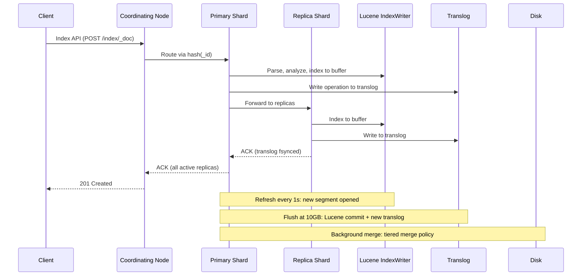
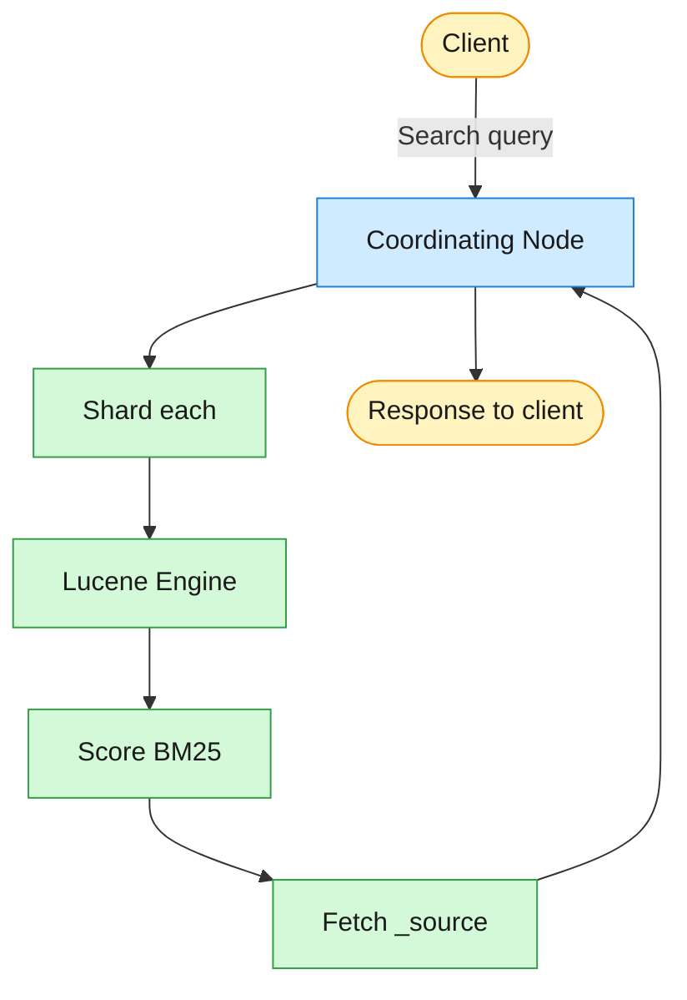

Elasticsearch is a distributed search and analytics engine built on Apache Lucene. You send JSON documents to a REST API, and within one second they become searchable across any field with ranking, aggregations, and geospatial queries.

<!--more-->

## Elasticsearch

### What it is

Elasticsearch is a distributed search and analytics engine built on Apache Lucene. You send JSON documents to a REST API, and within one second they become searchable across any field with ranking, aggregations, and geospatial queries. The engine hides a distributed inverted-index cluster behind a single endpoint, so a solo developer with curl can go from zero to full-text search in minutes, while a production cluster scales to petabytes across hundreds of nodes.

> [!TIP]
> **Key insight:** Elasticsearch's core design bet is that you trade a small write-delay for near-instant searchability. Documents land in an in-memory buffer, a one-second refresh opens a new Lucene segment, and they become visible without waiting for a full disk commit. This is what makes indexing throughput viable for time-series and logging workloads that ingest millions of events per second.

### Core concepts you use

**Index** - a logical namespace that holds documents of a similar shape (like a database table, but schema-flexible). You define mappings per index to control how fields are analyzed, indexed, and stored.

**Document** - a JSON object that is the unit of search and retrieval. Each document belongs to an index, has a unique `_id`, and carries `_source` (the original JSON) plus computed metadata (score, routing, version).

**Mapping** - the schema that defines how each field is indexed: `text` (full-text analyzed), `keyword` (exact-match, aggregatable), `integer`, `geo_point`, `dense_vector`, and dozens more. Mapping is either explicit (you define it) or dynamic (Elasticsearch infers it from the first document), and changing an existing mapping nearly always requires reindexing.

**Shard** - a Lucene index, the unit of parallelism and data distribution. An index is split into N primary shards at creation (default 1). Each shard holds a subset of the index's documents and runs on a single node.

**Replica** - a copy of a primary shard. Replicas provide failover (if the primary node dies) and read scaling (queries are load-balanced across primaries and replicas). Default is one replica per primary.

### How it works (and why it's fast)

**The inverted index.** Lucene builds an inverted index per shard: a sorted term dictionary maps each unique token to posting lists of (docID, term frequency, positions). When you search for "cloud deployment," Lucene looks up both terms in the dictionary, intersects the posting lists, scores each matching document by BM25 (term frequency-inverse document frequency with saturation), and returns the top N. The `_source` (original JSON) is stored separately and fetched only for the final result page.

**Segments and near-real-time refresh.** Each shard is a collection of immutable segments written by Lucene. When a document arrives, it lands in an in-memory buffer. Every second (the default `index.refresh_interval`), Lucene opens the buffer as a new segment and the document becomes searchable. No fsync, no full commit. This is why indexing is cheap and search is fast: the write-ahead log (translog) provides durability, while the refresh provides near-real-time visibility.

**Translog and flush.** The translog is a write-ahead log that persists every operation before it is acknowledged. With default `translog.durability=request`, each write fsyncs on the primary and every active replica before returning `201 Created`. When the translog reaches `flush_threshold_size` (10 GB in current 9.x), Elasticsearch triggers a Lucene commit: all buffered segments are fsynced to disk, the old translog generation is discarded, and a new generation starts. In older versions the threshold was 512 MB, which caused unnecessary I/O for large indices.

**Segment merge.** Small segments accumulate over time and degrade search speed (more files to open). A background tiered merge policy (Lucene 4+) combines segments into larger ones, preferring to merge segments of similar size. Force-merge read-only indices to 1 segment for best search performance; never force-merge actively writing indices.

**The write path.** Indexing a document is a replicated, write-ahead-logged operation. The coordinating node routes the doc to its primary shard by `hash(_id)`; the primary indexes it into an in-memory Lucene buffer and appends the raw operation to the `translog` before forwarding to the replicas. Only once every active replica has fsynced its translog does the primary acknowledge — so an accepted write survives a crash even before it becomes a searchable segment. The sequence below traces one `POST /index/_doc`, including the periodic refresh, flush, and merge that turn buffered writes into durable segments.



**Scatter-gather search.** A search query hits the coordinating node, which parses the DSL into a Lucene query, looks up the routing table, and fans out to every shard (primary or replica) in parallel. Each shard runs the query phase (collect matching docIDs, score by BM25), then the fetch phase (retrieve `_source` for the top N hits). The coordinating node merges partial results, applies global scoring, sorts, paginates, and returns the response.



### What you build with it

#### Full-text search

The original use case. Index product catalogs, documentation, support tickets, or anything you want users to type natural language into and get ranked results back.

```javascript
PUT /products
{
  "mappings": {
    "properties": {
      "title": { "type": "text", "analyzer": "english" },
      "description": { "type": "text" }
    }
  }
}
```

**Gotcha:** Text fields are analyzed by default. If you also need exact-match filters or aggregations on the same field, map it as multi-field with a `.keyword` sub-field. Without it, `"term": {"title": "Exact Match"}` returns no results because the analyzer lowercases and stems your value.

#### Logging and time-series (ELK)

The ELK stack (Elasticsearch, Logstash, Kibana) is the standard open-source observability pipeline. Agents ship structured logs with an `@timestamp` field; ILM (Index Lifecycle Management) auto-rolls time-based indices, moves hot data to warm nodes, and deletes old data.

```javascript
PUT /logs-2025.01.01/_doc/001
{ "@timestamp": "2025-01-01T12:00:00Z",
  "level": "ERROR",
  "message": "Connection refused",
  "service": "api-gateway" }
```

**Gotcha:** Time-series indices with no ILM policy fill the disk. Set up `rollover` on `max_primary_shard_size` (50 GB) or `max_age` (30d), plus `delete` phase after retention. Without rollover, a single shard grows until it hits the 2-billion-doc Lucene ceiling or the node runs out of disk.

#### Vector and hybrid search for RAG

Elasticsearch added `dense_vector` support in 7.x and matured it through 8.x with HNSW indexing, approximate nearest-neighbor (ANN) search, and hybrid scoring (combining vector similarity with BM25). This makes it a viable vector store for LLM retrieval-augmented generation.

```javascript
PUT /embeddings
{ "mappings": {
    "properties": {
      "vector": { "type": "dense_vector", "dims": 768, "similarity": "cosine" },
      "text": { "type": "text" },
      "source": { "type": "keyword" } } } }
```

**Gotcha:** Dense vector dimensions must be declared at index creation and cannot be changed. HNSW indexing builds an in-memory graph that consumes O(dims * num_vectors * 1.1) memory on the data node. For large vector collections (>10M), reserve dedicated nodes and size heap accordingly.

#### Analytics and aggregations

Elasticsearch's aggregation framework runs real-time analytics on indexed data without pre-computed cubes: terms by category, date histograms, percentiles, cardinality estimates, and complex bucket pipelines.

```javascript
GET /sales/_search
{ "size": 0,
  "aggs": {
    "by_category": { "terms": { "field": "category.keyword", "size": 10 } },
    "revenue_over_time": { "date_histogram": { "field": "date", "calendar_interval": "month" } } } }
```

**Gotcha:** Terms aggregations load all unique values into heap per shard. A high-cardinality field with millions of unique keywords can trigger OOM. Use the `cardinality` aggregation (HyperLogLog-based, ~5% error rate) for count-unique, and pre-bucket high-cardinality ranges as keyword fields during indexing.

#### Geospatial search

Index points (geo_point) or shapes (geo_shape) and query by distance, bounding box, or polygon intersection. Used for location-aware search, fleet tracking, and geofencing.

```javascript
GET /restaurants/_search
{ "query": {
    "geo_distance": {
      "location": { "lat": 40.7128, "lon": -74.0060 },
      "distance": "1km" } } }
```

**Gotcha:** `geo_point` is for single coordinates and uses efficient BKD trees for bounding-box and distance filters. `geo_shape` handles polygons and complex geometries but uses a slower indexing strategy and should only be used when you need polygon containment tests.

#### Auto-complete and suggest

The `completion` suggester builds a finite-state transducer (FST) in memory at index time, enabling prefix-based type-ahead with near-instant response times. Unlike `match_phrase_prefix` (which scans posting lists per keystroke), the completion suggester uses a pre-built trie.

```javascript
PUT /products
{ "mappings": {
    "properties": {
      "name": { "type": "completion" } } } }
```

**Gotcha:** Completion fields store the FST in JVM heap, not on disk. A dictionary with 1M unique terms consumes roughly 50-100 MB of heap. On large catalogs, reserve dedicated coordinating nodes for suggest requests so the FST memory does not compete with the indexing path.

### Scaling and availability

**Shard strategy.** The recommended shard size is 10-50 GB per shard, with a hard upper limit of 200M documents per shard (and a Lucene ceiling of 2.1B docIDs). Too many small shards wastes heap on metadata (each shard has a memory footprint). Too few large shards limits parallelism: a node can run multiple search threads but a single shard processes its work on one thread.

**Node roles.** A production cluster separates concerns across node types: master-eligible nodes manage cluster state and coordinate shard allocation (run at least three on separate hardware); data nodes store Lucene indices and run the query and indexing path (hot/warm/cold/frozen tiers separate by performance profile); coordinating nodes accept client requests and scatter-gather results but hold no data; ingest nodes run pipeline processors before indexing.

**Cluster coordination.** Elasticsearch 7+ runs Zen2 discovery with a fault-tolerant voting system. Master election uses a strict majority quorum `(N/2 + 1)` to prevent split-brain. Nodes that lose a master timeout isolate themselves instead of accepting writes, avoiding the pre-7.x split-brain scenario where two independent clusters served writes and produced irreconcilable data.

**GC pause cascade.** G1 mixed GC pauses (100-500 ms) can cause the cluster to interpret a node as dead. The node drops out, the cluster reallocates its shards, and a rebalance storm transfers gigabytes across the network while every non-affected node runs indexing and merges for the new copies. Mitigation: keep heap at or below 32 GB (compressed OOPs limit), pin GC overhead to under 15% CPU, and set `cluster.routing.allocation.node_concurrent_recoveries=2` to throttle rebalance throughput.

### When to use it, and when not to

**Great fit:** Full-text search with ranked results (the original design target). Observability pipelines (structured logs, metrics) where time-based indices pair with ILM for data lifecycle management. Application search for user-facing catalogs, documentation, and knowledge bases. Vector search as part of a RAG pipeline when you also need hybrid scoring (BM25 + cosine similarity). Real-time analytics on moderate cardinality dimensions (thousands to low millions of unique terms). Geospatial queries on indexed points with distance filters.

**Wrong fit:** Transactional workloads with strict ACID guarantees (Elasticsearch is eventually consistent; concurrent updates to the same document use optimistic concurrency control and can collide). OLAP-style star-schema join queries against petabytes (use a column-store like ClickHouse instead). Primary data store for financial or audit records that require read-after-write consistency (the 1s refresh window means a document may not be visible immediately). High-dimensional vector search above tens of millions of vectors with strict latency budgets (dedicated vector databases like Pinecone or Milvus may have lower P99 latency for pure ANN).

**Hard limits to plan for:**

- Max fields per index: 1000 (counts all mappers - objects, leaf, multi-fields, runtime)
- Max `from + size`: 10000 (use `search_after` or `scroll` for deep pagination)
- Max shards per node: 1000 (non-frozen); shards per index: 1024
- Lucene MAX_DOC per shard: 2,147,483,519
- JVM heap cap: 32 GB (compressed OOPs limit); set Xms=Xmx, no more than 50% of RAM
- Document size soft limit: 100 MB (enforced by `http.max_content_length`)
- Dynamic mapping will eagerly add fields; a production index MUST have explicit mappings to avoid mapping explosion

### The landscape / editions

| Edition | License | What you get | Cost signal |
|---|---|---|---|
| Elasticsearch core (v8.16+) | AGPLv3 | Full search + aggregations + ES | QL + TLS + RBAC + basic ML |
| Elasticsearch full (self-managed) | SSPL + ELv2 | Everything + advanced ML + Maps | Free (self-managed; SSPL not OSI-approved) |
| Elastic Cloud Hosted | SSPL/ELv2 | Managed on AWS/GCP/Azure, 60+ regions, BYOK, FedRAMP High, 99.95% SLA | ~$0.05/GB-RAM-hr (login-gated pricing) |
| Elastic Cloud Serverless | SSPL/ELv2 | Decoupled compute (VCU) + storage (S3), auto-scaling, scale-to-zero | VCU-based (pricing not public) |
| Amazon OpenSearch Service | Apache 2.0 | OpenSearch fork on AWS, KMS, Cognito, Auto-Tune, UltraWarm, multi-AZ | $0.128/hr (m6g.large), hot $0.30/GB-mo |
| OpenSearch self-managed | Apache 2.0 | Fork of ES 7.10.2, LF-governed, full security free, Lucene 10 | Free |
| Aiven for OpenSearch | Apache 2.0 | Managed on AWS/GCP/Azure/DO, SOC2/ISO 27001 | $40-275/mo |

The split story: Elastic changed its license from Apache 2.0 to SSPL+ELv2 in 2021. Amazon forked the last Apache-licensed version (7.10.2) into OpenSearch, which moved to the Linux Foundation in 2024. Elastic re-licensed the core to AGPLv3 in 2024 (v8.16+), narrowing the gap: if you need network-copyleft-exempt use, ES core (AGPLv3) is now free. The full distribution (SSPL/ELv2) still holds advanced ML and maps features. OpenSearch has a slower release cadence (~80 commits/wk vs ~340/wk for Elastic) but a clean Apache 2.0 license with no restrictions.

### Where it's heading

Vector search integration is the dominant trajectory. Elasticsearch 8.x matured HNSW indexing and native ANN queries; the next step is hybrid search as a first-class query type (combining BM25 text score with vector cosine similarity in a single ranked result). Elastic is also investing in ES\|QL, a piped query language that replaces the aggregation-DSL for analytics use cases, and in Agent Builder for LLM-driven retrieval workflows. The AGPLv3 re-licensing signals Elastic wants to compete for the SaaS audience without the SSPL compliance burden. On the OpenSearch side, the focus is on keeping parity with Elastic's search quality while emphasizing the clean Apache 2.0 path for regulated industries and government clouds.

## References

1. [Elasticsearch Reference (current)](https://www.elastic.co/guide/en/elasticsearch/reference/current/index.html)
1. [Index Modules - refresh, translog, merge](https://www.elastic.co/guide/en/elasticsearch/reference/current/index-modules.html)
1. [Index Modules - Translog](https://www.elastic.co/guide/en/elasticsearch/reference/current/index-modules-translog.html)
1. [Mapping limit settings](https://www.elastic.co/docs/reference/elasticsearch/index-settings/mapping-limit)
1. [Size your shards](https://www.elastic.co/docs/deploy-manage/production-guidance/optimize-performance/size-shards)
1. [Tune for search speed](https://www.elastic.co/docs/deploy-manage/production-guidance/optimize-performance/search-speed)
1. [Thread pool settings](https://www.elastic.co/guide/en/elasticsearch/reference/current/modules-threadpool.html)
1. [Discovery and cluster formation](https://www.elastic.co/guide/en/elasticsearch/reference/current/modules-discovery.html)
1. [Wait for active shards](https://www.elastic.co/guide/en/elasticsearch/reference/current/docs-index_.html#index-wait-for-active-shards)
1. [Apache Lucene Core](https://lucene.apache.org/core/)
1. [Elastic Cloud pricing](https://www.elastic.co/pricing)
1. [Amazon OpenSearch Service pricing](https://aws.amazon.com/opensearch-service/pricing/)
1. [Aiven for OpenSearch plans](https://aiven.io/opensearch/pricing)
