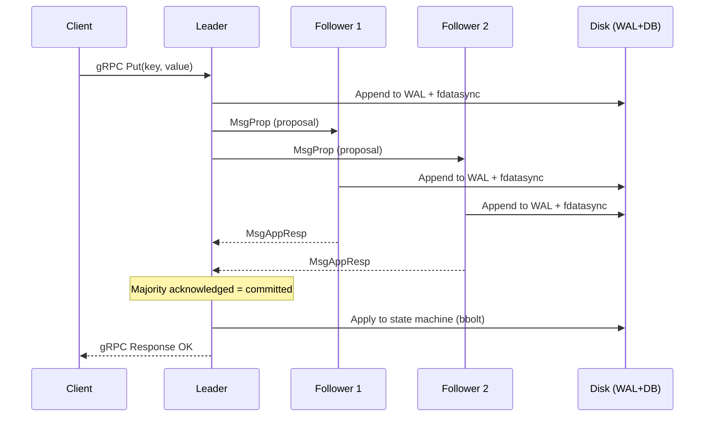
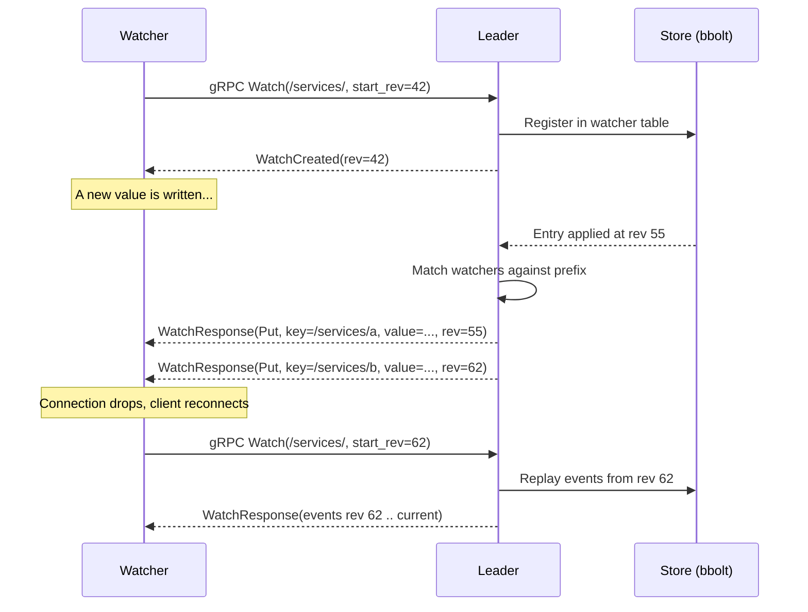

etcd is a strongly consistent, highly available distributed key-value store that solves the hardest problem in distributed systems - getting every node to agree on the same facts[1].

<!--more-->

## What is etcd

etcd is a strongly consistent, highly available distributed key-value store that solves the hardest problem in distributed systems - getting every node to agree on the same facts[1]. It is the foundation layer Kubernetes uses to store its entire control-plane state: which pods should run, what a Service's endpoints are, who has access to what. Every time you run `kubectl apply`, the resulting resource lands in etcd before anything else happens. You reach for etcd when your system needs a single source of truth that survives machine failures, network partitions, and restarts, and that every component can read with the absolute certainty that the data is current and authoritative. It is a coordination store, not a general-purpose database - it trades raw throughput and storage capacity for the strongest possible consistency guarantees.

> [!TIP]
> **The one big design choice: etcd uses a single active Raft leader.** Every write must go through exactly one node, which serializes all changes via a replicated log and fsyncs each entry to disk on a majority of servers before telling the client the write is committed. This single-writer design is the deliberate tradeoff that makes the strong consistency guarantee real - but it also caps write throughput at roughly one disk sync per commit, and the only path to higher throughput is a faster disk, not more servers.

## Core concepts

These are the primitives you actually reach for when you build on etcd:

- **Key-value pairs.** The atomic unit - an arbitrary string key with a binary value, stored in a flat namespace. Values are opaque bytes to etcd; whatever you put in is what comes out.
- **Revisions.** Every write gets a globally monotonically increasing revision number. The revision is the cluster's logical clock - you can use it to order events, detect concurrent changes, or subscribe to changes since a specific point in time.
- **Ranges and prefixes.** The KV API supports range queries and prefix listing. Most coordination patterns rely on prefix scans - listing all keys under `/services/myapp/` returns all registered instances.
- **Leases.** A time-to-live mechanism. A lease is a named timer that you attach keys to; when the lease expires, all attached keys are automatically deleted. Extend a lease with a periodic heartbeat to signal liveness - this is how Kubernetes detects node failure.
- **Watches.** A subscription to a key or prefix range. The server pushes every change to the subscribed set as a stream of events. Watches can start from any past revision, letting a newly-started consumer replay everything it missed.
- **Transactions.** A compare-and-swap (CAS) operation: atomically compare one or more key values (or their create/modify revisions), and conditionally execute a set of puts and deletes. This is the building block for locks, leader election, and distributed queues.
- **Services.** etcd's gRPC API is organized into five logical groups: KV (get/put/delete/ranges), Watch (stream changes), Lease (TTL management), Cluster (member management and health), and Maintenance (snapshots, defrag, size statistics).

## How it works

etcd is a Raft consensus cluster running a custom Go implementation[15]. A three-node cluster is the standard production configuration.



**The write path.** A client sends a Put to the leader via gRPC. The leader appends the entry to its Write-Ahead Log and fsyncs it to disk, then sends a MsgProp (proposal) to every follower. Each follower appends to its own WAL and fsyncs. Once the leader hears back from a majority of followers (two out of three in a three-node cluster), the entry is committed - it will survive any subsequent leader election. The leader applies the entry to its bbolt state machine and responds to the client. The minimum latency for a committed write is one network round-trip to the farthest majority member plus two disk fsyncs (the leader's and the slowest majority follower's).

**The storage engine.** etcd uses bbolt, a fork of BoltDB, as its on-disk backend[9]. bbolt is a single-writer, page-level B+tree embedded database. etcd stores an MVCC revision history inside bbolt: every write creates a new key revision, and old revisions are preserved until compaction removes them. An in-memory B-tree holds the key-to-revision mapping, so value size has minimal impact on memory consumption - only the keys and their metadata live in RAM.

**Read consistency levels.** Linearizable reads go through Raft[15] (quorum read) and return the most recently committed data. Serializable reads are served directly from any member's local bbolt store and are much cheaper - but may return data that is a few revisions behind the leader. In practice, most coordination use cases use serializable reads for the ~30% throughput advantage and only require linearizable reads for operations that need to see their own writes[1].

**The watch stream.** Clients subscribe to a key or prefix via gRPC. The leader registers the watcher in an in-memory table, and every committed write checks this table for matching watchers. Watches can resume from any past revision - if the connection drops, the client reconnects with the last revision it processed, and the server replays every event from that point forward. This at-least-once delivery model is how Kubernetes controllers never miss a state change even after a network blip.



## What you build with it

### Service discovery and Kubernetes backend

The dominant etcd use case. Services register themselves under a predictable prefix key (e.g., `/services/myapp/10.0.0.1:8080`) with a short TTL lease, and periodically refresh the lease to signal liveness. Consumers watch the prefix for changes - when a new instance appears, the watch fires and the consumer gets the updated list. This is exactly how Kubernetes tracks endpoints: every Service's pod IPs are written to etcd, and kube-proxy watches for changes to update iptables rules.

```bash
# Register a service instance with a 30-second lease
LEASE_ID=$(etcdctl lease grant 30 | cut -d' ' -f2)
etcdctl put /services/myapp/10.0.0.1:8080 '{"status":"ready"}' --lease=$LEASE_ID
# Extend the lease every 15 seconds (separate goroutine)
etcdctl lease keep-alive $LEASE_ID
```

> ⚠️ **Gotcha: lease expiry on sustained outages.** A network partition that separates a service from the etcd cluster means it cannot renew its lease. When the lease expires, etcd removes the key, and watchers see a deletion event. This is correct behavior for Kubernetes (dead nodes must be evicted), but it means a brief blip can cause cascading re-registrations. Use a lease TTL longer than your expected recovery time, and implement a backoff on re-registration to avoid a thundering herd.

### Distributed locks and leader election

etcd's transaction API makes it a natural lock server. A contender attempts a compare-and-swap that creates a lock key only if it does not exist. If the create succeeds, the contender holds the lock. The locked key is attached to a lease so the lock is automatically released if the holder crashes.

```bash
# Attempt to acquire a lock (CAS - only succeeds if key doesn't exist)
etcdctl txn --interactive
compares:
  create-revision /locks/myjob = "0"

success puts:
  put /locks/myjob 'holder=node-1' --lease=$LEASE_ID

failure puts:
  get /locks/myjob
```

For leader election specifically, etcd supports the same pattern through `etcdctl elect`, which provides a session-based leader candidacy where the leader is the first to create an election key and subsequent contenders watch for it to disappear.

> ⚠️ **Gotcha: locks are an advisory mechanism, not a correctness guarantee.** The lock gives you mutual exclusion only while the lease lives and only among participants that check the same key. A slow lease renewal (due to a GC pause or overload) can expire the lock while the holder still believes it holds it. Design your application so that holding the lock is an efficiency optimization, not the sole correctness mechanism - use fencing tokens or write version checks to guard against the stale-lock scenario.

### Configuration management

Store your configuration tree under a well-known key prefix. Applications watch the relevant subtree for changes and reload configuration on the fly without restarting. This is the pattern Kubernetes uses for ConfigMaps and Secrets - though in practice kubelet polls rather than watches directly.

```bash
# Write configuration atomically
etcdctl put /config/myapp/database '{"host":"db1","port":5432}'
etcdctl put /config/myapp/redis '{"host":"redis1","port":6379}'

# Watch for changes and reload
etcdctl watch /config/myapp/ --prefix
```

> ⚠️ **Gotcha: large values near 1.5 MB cause serious problems.** The maximum request size is 1.5 MB. A configuration value approaching this limit will saturate the network path during Raft replication across all followers, increasing commit latency for every other operation on the cluster. Keep individual values under 1 MB; for large config blobs, store a pointer in etcd and the blob itself in object storage.

### Distributed queues and barriers

A queue built on etcd creates sequential keys under a shared prefix using the transaction's CAS to generate unique, monotonically increasing names. Barriers use a similar pattern where all participants watch a single barrier key; when the barrier is lifted (the key is deleted), every watcher proceeds.

```bash
# Enqueue: create a sequential key (etcdctl does not have incr;
# use txn with compare-on-value to get ordering)
etcdctl put /queue/task-0001 '{"job":"process-order"}'

# Dequeue: list then delete the first key
KEYS=$(etcdctl get /queue/ --prefix --limit=1 --keys-only)
etcdctl del $(echo $KEYS | head -1)
```

> ⚠️ **Gotcha: queues are not production-grade.** etcd has no native queue semantics. The "list then delete" pattern is racy - two consumers can see the same key as the first entry. Use a real queue system (Kafka, RabbitMQ, Pulsar) for production messaging. etcd-backed queues are only appropriate for low-volume coordination tasks where occasional duplicate processing is acceptable, like distributing work among a small set of workers at startup.

## Scaling and availability

**etcd scales up, not out.** It is a single Raft[15] replication group. Every member holds the full keyspace, and all writes go through the single leader. The canonical benchmark on n1-standard-8 hardware (8 vCPUs, 16 GB RAM, SSD) shows ~50,000 writes per second[7] and ~185,000 serializable reads per second[7]. Write throughput is capped by the sequential fsync bottleneck - adding more nodes actually reduces write throughput slightly because more machines must acknowledge each commit before it is committed. Vertical scaling works: faster CPU for serialization, more RAM for a larger in-memory index and more watchers, and faster SSD for lower fsync latency.

**Reads scale out.** Serializable reads can be served by any member from its local store. Adding nodes linearly increases read capacity. This asymmetry - the ability to scale reads but not writes - is a direct consequence of the single-leader Raft design.

**The failure that surprises people: slow disk causes cascading leader elections.** Raft requires every commit to be fsynced to disk on both the leader and a majority of followers. The default heartbeat interval is 100 ms; if a node's disk takes longer than 10 ms to fsync, the node may miss heartbeats and trigger an unnecessary election. If the slow disk is on the leader, the followers detect the missed heartbeats after 1,000 ms (the default election timeout) and elect a new leader. The old leader may come back online and trigger yet another election. The result is a cascading series of leader elections that can make the cluster unavailable for writes for seconds or minutes. This is the single most common etcd production failure, and it is almost always caused by a noisy-neighbor process sharing the disk, a shared EBS volume with burst credit exhaustion, or an undersized SDD.

> ⚠️ The mitigation is straightforward: dedicate an SSD to etcd, monitor `etcd_disk_wal_fsync_duration_seconds` p99, and alert if it exceeds 10 ms. Do not co-locate etcd with general-purpose workloads.

**Availability model.** A three-node cluster tolerates one node failure. A five-node cluster tolerates two. In a network partition, the majority side continues operating; the minority side stops accepting writes. There is no split-brain - Raft guarantees at most one leader per term. If quorum is permanently lost (more than half the members gone), the cluster stops accepting writes until an operator restores from a snapshot.

## Durability and consistency

**etcd is a CP system under the CAP theorem.** It chooses consistency and partition tolerance over availability. When a partition splits the cluster, the minority side becomes unavailable for writes until the partition heals.

**Durability is a knob, but the default is safe.** Every committed write is fsynced to disk on a majority of members before the client gets an acknowledgment[1]. If the leader crashes immediately after responding, the committed data is safe because a majority of members have it. The cost is that every write waits for a disk sync - this is the single largest component of write latency.

**The honest tradeoff: compaction and defragmentation.** etcd preserves every key revision in the MVCC history until compaction removes it. Without compaction, the database grows without bound. Compaction drops old revisions but does not reclaim disk space - it creates internal fragmentation in the bbolt file. Reclaiming space requires defragmentation, which blocks the member on reads and writes for the duration of the operation. The operational pattern is a rolling defrag: compact first (safe, incremental), then defrag one member at a time while routing traffic to the others.

```bash
# Compact all revisions older than revision 10000000
etcdctl compact 10000000

# Defrag one member (this blocks reads and writes on this member)
etcdctl defrag --endpoints=https://member1:2379
```

## When to use it, and when not to

**Great fit:**

- Cluster-wide, strongly consistent configuration and metadata store - exactly what Kubernetes needs
- Distributed coordination: leader election, distributed locking, service discovery, leases for liveness checking where correctness matters more than throughput
- Small-to-medium state that must survive restarts and be consistently readable by all members (under a few gigabytes of data)
- Watch-based change notification (push, not poll) for event-driven architectures

**Wrong fit:**

- **High-volume data storage.** etcd is not a database. The practical maximum database size is ~8 GB, and write throughput is capped at roughly 50K QPS. Do not use it to store application records, logs, product catalogs, or anything above a few gigabytes.
- **Message queues.** etcd has no native queue primitives. The "list then delete" workaround is racy and does not handle backpressure, rebalancing, or exactly-once delivery. Use Kafka, RabbitMQ, or Pulsar.
- **Writes above 50K QPS.** If your workload needs 100K writes per second, etcd's single-leader bottleneck will be the constraint. Consider a sharded database or a horizontally-scalable coordination layer.
- **Globally distributed clusters.** etcd is a single-datacenter tool. Cross-continent round-trip times (80-400 ms) push Raft latencies into unusable territory for any write-heavy workload. Some teams run stretched clusters with tuned election timeouts, but the latency cost is steep.
- **Large values.** Values near 1.5 MB cause network saturation and slow replication. Store blob pointers in etcd, not the blobs themselves.

**Hard limits:**

- Max key size: 32 KB (bbolt limitation, not configurable)[8]
- Max request size: 1.5 MB (configurable via `MaxRequestBytes`)[8]
- Max transaction operations: 128 (configurable via `MaxTxnOps`)[8]
- Default database quota: 2 GB (configurable up to ~8 GB practical max)[8]
- Max watchings tested: 10 million at 4.7 GB memory

## Landscape and editions

etcd is Apache-2.0 licensed, CNCF Graduated (since 2020), and maintained by Red Hat/IBM. The current stable is v3.7.0[10] (2026-07-08), with v3.5 LTS used by Kubernetes 1.28-1.34. The project has ~52,000 GitHub stars and 1,100+ contributors[11].

| Edition | What it is | Cost |
|---|---|---|
| Open-source (canonical) | Apache-2.0, self-managed via [etcd.io](http://etcd.io/) | Infrastructure cost only (~$300/mo for 3 c5.xlarge nodes) |
| AWS EKS (bundled) | Managed etcd as k8s control-plane store | $0.10/hr/cluster (~$73/mo); Provisioned tiers add $1.65-$13.90/hr |
| GKE / AKS / DOKS | Fully managed, etcd abstracted away | No separate etcd charge (bundled in k8s cost) |
| Self-managed (kubeadm, etcdadm) | Full control, no vendor lock-in | Infrastructure + operational burden |

**One representative cost:** AWS EKS at $0.10 per cluster per hour (~$73/month)[13] is the cheapest path for most users since the etcd control plane is bundled - you pay the EKS cluster fee regardless. Self-hosting on 3 c5.xlarge nodes runs roughly $300/month in compute alone.

**Alternatives in the coordination space:** Apache ZooKeeper[5] (Zab consensus, used by Hadoop/Kafka legacy - footprint shrinking as Kafka KRaft replaces it), HashiCorp Consul (Raft consensus, stronger in service mesh and multi-datacenter), and RedisRaft (in-memory, not durable by default). etcd's first-class Kubernetes integration, Raft's simplicity over Zab, and CNCF ecosystem keep it the dominant option for the k8s control plane and for any system that needs a small, strongly consistent coordination store embedded in a Kubernetes-native architecture.

## Where it's heading

etcd v3.7[10] (2026-07-08) focused on security: 5 GHSA-published RBAC and auth advisories fixed, plaintext credentials in WAL eliminated, and CRL bypass on gRPC listeners closed. The v2store API was fully removed - anyone still on a v2 client must migrate now. Performance improvements include up to 2x faster lease and user/role operations via a shared-buffer read transaction mode.

v3.8 will continue deprecating the remaining v2store handling paths and remove the `MaxSnapshots` config field. Learner (non-voting) member support and large-cluster scalability are areas of ongoing work. No v4 has been announced - the Raft algorithm and gRPC API surface are stable.

The Kubernetes relationship is stable and not under threat. KEP-2496 (etcdadm)[14] is the active SIG-Cluster-Lifecycle effort for etcd lifecycle management. No "replace etcd" KEP has moved past draft. The pluggable storage backend that some blogs speculated about does not exist. etcd's position as the k8s control-plane store is not changing in the near term.

In the wider coordination-service landscape, ZooKeeper's footprint is shrinking as Kafka KRaft mode (GA since 3.5+) removes the ZooKeeper dependency, and Consul owns the HashiCorp+service-mesh niche. etcd persists because of Raft's simplicity, its first-class Kubernetes integration, and the depth of its operational tooling. The secret to etcd's long-term relevance is embarrassingly simple: it is the answer to the question "what does Kubernetes use for its control plane?", and Kubernetes is not going anywhere.

## References

1. [etcd official documentation (v3.5) - performance guide](https://etcd.io/docs/v3.5/op-guide/performance/)
1. [etcd official documentation (v3.5) - hardware recommendations](https://etcd.io/docs/v3.5/op-guide/hardware/)
1. [etcd official documentation (v3.5) - tuning](https://etcd.io/docs/v3.5/op-guide/tuning/)
1. [etcd official documentation (v3.5) - configuration flags](https://etcd.io/docs/v3.5/op-guide/configuration/)
1. [etcd official documentation (v3.5) - learning why (comparison chart)](https://etcd.io/docs/v3.5/learning/why/)
1. [etcd official documentation (v3.5) - watch memory benchmark](https://etcd.io/docs/v3.5/benchmarks/etcd-3-watch-memory-benchmark/)
1. [etcd official documentation (v3.5) - storage memory benchmark](https://etcd.io/docs/v3.5/benchmarks/etcd-storage-memory-benchmark/)
1. [etcd source code - embed/config.go](https://github.com/etcd-io/etcd/blob/main/server/embed/config.go)
1. [etcd source code - bbolt bucket.go](https://github.com/etcd-io/bbolt/blob/main/bucket.go)
1. [etcd v3.7 CHANGELOG](https://github.com/etcd-io/etcd/blob/main/CHANGELOG/CHANGELOG-3.7.md)
1. [etcd GitHub repository](https://github.com/etcd-io/etcd)
1. [CNCF etcd project page](https://www.cncf.io/projects/etcd/)
1. [AWS EKS pricing](https://aws.amazon.com/eks/pricing/)
1. [KEP-2496: etcdadm](https://github.com/kubernetes/enhancements/tree/master/keps/sig-cluster-lifecycle/etcdadm/2496-etcdadm)
1. [Raft consensus algorithm](https://raft.github.io/)
1. [etcd security advisories](https://github.com/etcd-io/etcd/security/advisories)
