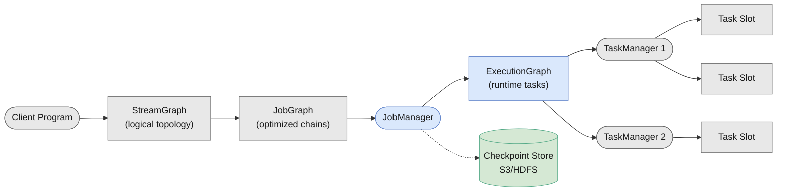
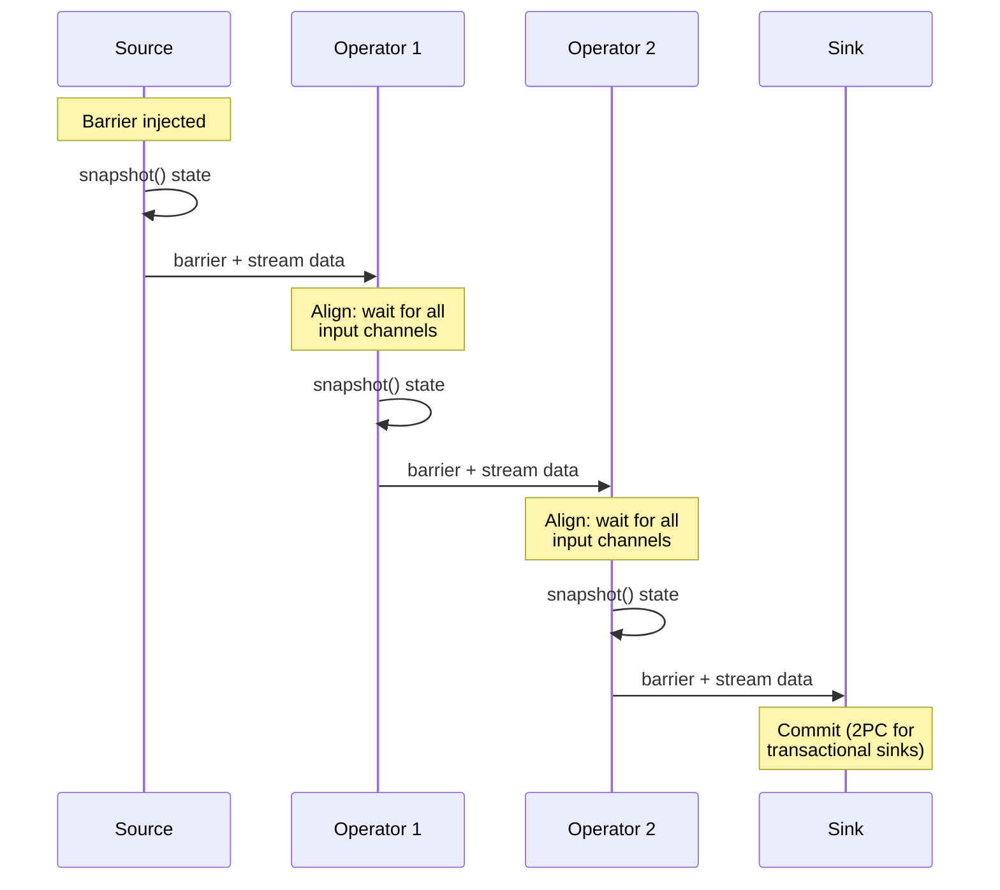

Apache Flink is a stream processor that treats every computation as a continuous flow of events, whether the data is bounded (a batch file) or unbounded (a Kafka topic).

<!--more-->

## What It Is

Apache Flink is a stream processor that treats every computation as a continuous flow of events, whether the data is bounded (a batch file) or unbounded (a Kafka topic). Where most systems see a batch where you wait for data to arrive and then process it, Flink sees a stream where events have already happened and processing never stops. This is not a naming trick - Flink runs the same runtime for batch and streaming workloads, so there is no batch engine layered on top of a streaming one. The job graph, the state backends, the checkpointing mechanism, and the exactly-once guarantees are identical in both modes.

> [!TIP]
> **The defining insight is that batch is just a bounded stream.** Most stream processors treat batch as the first-class citizen and retrofit streaming as an add-on. Flink does the reverse: the streaming runtime is the foundation, and bounded streams (batches) are just streams that eventually terminate. This means Flink's fault tolerance, backpressure handling, and state management work the same way whether your pipeline runs for five seconds or five months.

Flink started as a research project at TU Berlin in 2009, entered the Apache Incubator in 2014, and became a top-level ASF project in 2015. It was one of the first open-source systems to prove that high-throughput, low-latency, exactly-once stream processing at scale was practical. Today it powers production pipelines at Uber, Alibaba, Netflix, and most of the Fortune 500 that process events in real time.

## Core Concepts

### Streams

A stream is an immutable, potentially unbounded sequence of events. Flink distinguishes two kinds: **bounded streams** (a fixed dataset, read once) and **unbounded streams** (continuous ingestion). The bounded/unbounded distinction is Flink's native approach to batch - you give a bounded source connector and Flink treats it as a stream that will eventually drain.

### Operators

Operators are the processing steps in a pipeline. The common ones you reach for:

- **Map/FlatMap/Filter** - stateless transforms, one event at a time.
- **KeyBy** - partitions the stream by a key, guarantees that all events for the same key land on the same subtask. This is how you get per-key state.
- **Window** - groups events into finite buckets (tumbling, sliding, session) for aggregation. This is where most streaming complexity lives.
- **ProcessFunction** - the most powerful operator: full access to per-event state, timers, and side outputs. Use it when nothing else fits.

### Parallelism and Task Slots

Every operator runs in parallel across N subtasks, where N is the operator's **parallelism**. Each subtask is a thread. A **task slot** is a fixed-size unit of compute capacity in a TaskManager - each slot runs one subtask at a time. If a job has 8 subtasks and 4 slots per TaskManager, it needs 2 TaskManagers.

### Windows

Windows are Flink's mechanism for computing over finite slices of an unbounded stream. There are three common types:

- **Tumbling windows** - fixed, non-overlapping intervals. Every 5 minutes, aggregate everything.
- **Sliding windows** - overlapping intervals that emit more frequently than they advance. Every 1 minute, aggregate the last 5 minutes.
- **Session windows** - variable-width intervals separated by inactivity gaps. Good for user sessions.

The critical choice is whether the window runs on **event time** (the timestamp in the data) or **processing time** (wall-clock arrival). Event time is correct but requires watermarks and tolerates late data; processing time is simple but wrong under backpressure or lag.

### State

State is what makes Flink stateful. Every operator can maintain:

- **ValueState, ListState, MapState, ReducingState, AggregatingState** - per-key or per-operator managed state that survives failures via checkpointing.
- **Operator state** - non-keyed state shared across all events flowing through a subtask (used by connectors like Kafka for partition offsets).

State is not a cache - it is durable and checkpointed. If the job crashes, Flink restores every subtask's state from the last successful checkpoint.

## How It Works

### Architecture

Flink jobs run on a cluster with three roles:



The **Client** builds the logical StreamGraph and compiles it into a JobGraph of chained operators. The **JobManager** (JM) expands it into an ExecutionGraph - one ExecutionVertex per subtask - and distributes work to **TaskManager** (TM) slots. Each slot is a thread; the JM coordinates checkpoints, recovery, and rebalancing.

### Checkpoint Barriers

The mechanism that makes exactly-once practical is Flink's aligned checkpoint barrier. A barrier is a special record injected into the source stream. It travels downstream operator by operator, and each operator, on receiving the barrier, snapshots its state before continuing.



Each operator freezes its incoming channels on receiving a barrier, waits for the barrier on every other channel (alignment), snapshots state, then releases the channels. The barrier guarantees that no event after it is included in the checkpoint, and no event before it is excluded. The result is a consistent cut of the entire pipeline's state at one logical instant.

> [!TIP]
> **Unaligned checkpoints (Flink 2.0+) skip the alignment wait.** Under backpressure, the fast channel's barrier can block waiting for the slow channel's barrier, stalling the operator. Unaligned checkpoints bypass buffered records - the in-flight data becomes part of the checkpoint. Checkpoints are larger, but the operator never stalls.

### Watermarks

Event-time processing needs a way to know when all events for a certain time window have arrived. Watermarks are the mechanism: a monotonically increasing marker that flows with the stream. A watermark at timestamp T means "no more events with timestamp <= T will follow." Events that arrive after the watermark with timestamps before T are late data - Flink can discard them, send them to a side output, or process them within a configurable `allowedLateness`.

### State Backends

Where state lives determines performance, durability, and memory pressure:

- **HashMapStateBackend** - state on the JVM heap. Fastest (~10x faster random access than RocksDB), but limited by heap size (~50-200 GB before GC becomes crippling). No incremental checkpoints.
- **EmbeddedRocksDBStateBackend** - state serialized to RocksDB on local disk, off-heap. Handles state larger than memory (disk capacity). Incremental checkpoints via changelog. ~10x slower than heap for random access due to ser/deser + LSM compaction.
- **ForStStateBackend (2.x)** - state backed by remote storage (S3, HDFS). Similar performance to RocksDB but storage is effectively unlimited.

The choice is a memory-performance tradeoff: HashMap for high-throughput, moderate-state jobs; RocksDB for large-state, production-critical jobs where GC pauses are unacceptable.

## What You Build With It

### Event-Time Analytics

The canonical Flink use case. Ingest events from Kafka, window them by their own timestamps (not arrival time), and emit aggregates.

```sql
-- Flink SQL: tumbling window, hourly pageview count by URL
SELECT url,
       TUMBLE_END(event_time, INTERVAL '1' HOUR) AS window_end,
       COUNT(*) AS views
FROM pageviews
GROUP BY url, TUMBLE(event_time, INTERVAL '1' HOUR)
```

> [!TIP]
> **Gotcha: watermark lag.** If your source produces sparse data, watermarks stall. A Kafka partition with no events for 30 minutes means the watermark stops advancing - downstream windows never fire. Set `idleTimeout` on the source to advance watermarks despite idle partitions.

### Streaming ETL

Transform and enrich a stream as it passes through. The pattern is a chain of stateless maps or keyed lookups.

```java
// Java DataStream API: enrich with side data
stream
    .keyBy(order -> order.customerId)
    .process(new KeyedProcessFunction<>() {
        // cache customer profile in ValueState
    })
```

> [!TIP]
> **Gotcha: state growth from unbounded keys.** If you key by user ID and never clean state, each unique user accumulates state that lives until the job stops. Use `TimeToLive` (TTL) configuration on state descriptors to expire stale keys.

### Change Data Capture (CDC)

Capture row-level changes from a database (via Debezium or Flink CDC connectors) and stream them into a lake or downstream systems. Flink reads the binlog as a stream, converts each row event to a change record, and can upsert into a materialized view.

```sql
-- Flink SQL: CDC from MySQL to Elasticsearch
CREATE TABLE cdc_orders WITH (
    'connector' = 'mysql-cdc',
    'hostname' = '...', 'database-name' = 'orders'
);
INSERT INTO orders_es SELECT * FROM cdc_orders;
```

> [!TIP]
> **Gotcha: schema evolution.** CDC connectors emit the full row after each change, but if the source table's schema changes (a column added, a type changed), Flink needs a savepoint and a restart with the updated schema DDL. There is no live schema evolution through the CDC connector.

### Real-Time ML Feature Engineering

Compute sliding-window aggregates that feed ML models. Example: a 5-minute window of user activity features emitted every 30 seconds, joined with the model's serving request.

```sql
-- Flink SQL: sliding window features
SELECT user_id,
       AVG(amount) OVER 5_MINUTE_SLIDING AS avg_spend,
       COUNT(*) OVER 5_MINUTE_SLIDING AS tx_count
FROM transactions
```

> [!TIP]
> **Gotcha: window explosion.** A sliding window with a small slide step (e.g., 30s window advancing every 1s) creates N windows per key simultaneously. For RocksDB-backed state, each window is a separate key/value pair. At 10M keys and 30 overlapping windows, that is 300M state entries. Prefer tumbling windows with pre-aggregation where the semantics allow it.

### Fraud Detection

Identify suspicious patterns in real time. The pattern is a `keyBy` on the entity (account, device, IP) plus a `ProcessFunction` with timers that fire after a time interval.

```java
stream
    .keyBy(txn -> txn.cardId)
    .process(new FraudDetectFunction())
    // Function checks: N transactions in M minutes from M+1 geos
```

> [!TIP]
> **Gotcha: hot keys.** A popular card or account gets all its transactions on one subtask. That subtask processes events at bottleneck speed while others are idle. Mitigate with a two-phase aggregate: pre-aggregate per-subsidiary key, then re-key by the original key for the final check.

### Session Analysis

Group user activity into sessions bounded by idle gaps rather than fixed clock boundaries.

```sql
-- Flink SQL: session window, 5-minute inactivity gap
SELECT user_id,
       SESSION_END(event_time, INTERVAL '5' MINUTE) AS session_end,
       COUNT(*) AS events,
       SUM(revenue) AS total_revenue
FROM clickstream
GROUP BY user_id, SESSION(event_time, INTERVAL '5' MINUTE)
```

> [!TIP]
> **Gotcha: session window state explosion.** Session windows merge when a new event falls within the gap of an existing session. Each merge triggers state reads. With high-cardinality keys (millions of anonymous visitors), session window state on RocksDB can blow up. Consider pre-aggregating anonymous traffic to reduce cardinality.

## Scaling and Availability

### Parallelism

Scaling a Flink job means increasing the parallelism on the bottleneck operators. Each subtask is one thread in one slot. Flink distributes key groups - the atomic unit of state redistribution - across subtasks by hashing the key against `maxParallelism` (ceiling 32,768).

```bash
# Set parallelism at submit time
flink run -p 16 my-job.jar
```

### The Failure That Surprises People: Checkpoint Alignment Stall Under Backpressure

A healthy job with aligned checkpoints injects a barrier into all source channels at once. Barriers travel at stream speed. If one channel is backlogged (a downstream operator is saturated), its barrier arrives late. The other, faster channels align - they stall, waiting. Now checkpoints take longer because the alignment phase dominates. If checkpoints fail slower than they succeed, the job enters a restart loop.

```text
metrics timeline:
  - backPressuredTimeMsPerSecond:  >800ms (alarm)
  - checkpoint alignment duration:  spikes to minutes
  - checkpoint timeout:             restarts cascade
```

**Mitigations:**

- Enable unaligned checkpoints (`enableUnalignedCheckpoints()`) when backpressure is structural. Larger checkpoint payload but no alignment stall.
- Scale out the bottleneck operator.
- Buffer debloating (Flink 2.0+) adjusts network buffer sizes dynamically to prevent over-commit.

### Regional Failure Recovery

Flink partitions a job into pipelined regions - connected subgraphs that can fail independently. On failure, only the affected region and its downstream consumers restart. The default streaming failover strategy is `region`, and the default restart strategy (with checkpointing enabled) is `exponential-delay`.

### Hard Limits

| Limit | Value | Context |
|---|---|---|
| Max parallelism | 32,768 (2^15) | Hard ceiling for key-group redistribution |
| RocksDB key/value | 2 GiB per key | JNI byte[] limit; merge ListState before hitting this |
| HashMap state | ~50-200 GB | JVM heap bound; GC becomes debilitating past this |
| Tasks per job (pragmatic) | ~100,000 | JM becomes scheduling bottleneck beyond this |

## Durability and Consistency

### Exactly-Once vs At-Least-Once

With checkpointing enabled, Flink's default is **exactly-once** (`execution.checkpointing.mode: EXACTLY_ONCE`). The checkpoint barrier mechanism guarantees each event is processed exactly once per operator in the path. At-least-once mode exists only when checkpointing is disabled or explicitly configured.

**Requirements for exactly-once:**

- Checkpointing enabled.
- Every operator assigned a unique ID via `uid("name")`. Without this, Flink cannot map old state to new operators on upgrade - state is silently lost.
- Sinks support idempotent writes or participate in a two-phase commit (Kafka transactional producer, JDBC `XADataSource`).

### Checkpoints vs Savepoints

| Property | Checkpoint | Savepoint |
|---|---|---|
| Trigger | Automatic, periodic | Manual (`flink savepoint`) |
| Lifecycle | Overwritten on next success | Persistent until deleted |
| State format | Can be incremental (RocksDB) | Full copy |
| Use case | Fault recovery | Code upgrade, rescale, schema migration |

> [!TIP]
> **Production foot-gun: forgetting uid().** If you upgrade a running job and the new operator topology cannot map to the old one (no `uid()` set), Flink starts the new job from empty state. No error, no warning - just silent state loss. Always set `uid("...")` on every operator in production.

## When to Use and When Not To

**Great fit:**

- Real-time event processing from Kafka/Pulsor/Kinesis where sub-second to sub-minute latency is a requirement.
- Pipelines that need exactly-once guarantees across failures (financial transactions, fraud detection, inventory counts).
- Stateful transforms that survive a crash: per-key aggregates, session windows, feature engineering.
- CDC pipelines that materialize a read-replica or lake from a database change stream.
- Streaming ETL where the transform is complex enough to need the DataStream or Table API.

**Wrong fit:**

- One-shot batch ETL on a schedule (hourly Hive-style). Use Spark or Trino - they are simpler and cheaper for bounded workloads.
- Event processing where you can tolerate data loss or duplicate delivery. A lightweight microservice with a transactional outbox may cost less operational complexity.
- Pipelines with ultra-low latency (<10ms end-to-end). Flink's checkpoint overhead and serialization add tens of milliseconds minimum.
- Stateful workloads where the state fits in a few MB on a single machine. A single-process application with WAL recovery is simpler.

**Hard limits to know:**

- Max parallelism is 32,768. Plan your key group granularity before you hit it.
- RocksDB state size is disk-bound, but random access is ~10x slower than heap state. Do not put hot-path state in RocksDB if heap is feasible.
- Jobs with >100 tasks stress the JM scheduler. Flink 1.14+ scheduler optimization helps, but the bottleneck shifts from JM heap (30 GiB to 2 GiB) to network buffer allocation and heartbeat traffic.
- A single hot key bottlenecks one subtask. Flink cannot auto-rebalance within a key group.

## Landscape and Editions

| Edition | License | Key Differentiator | Cost (Approximate) |
|---|---|---|---|
| Apache Flink OSS | Apache 2.0 | Full stream processor, self-managed | Compute infra only |
| Confluent Cloud for Flink | Proprietary (SaaS) | Serverless SQL-first, Kafka integration | $0.21/CFU-hour |
| AWS Managed Service for Flink | Proprietary wrapper | 3-AZ HA, IAM, CloudWatch, 1-sec billing | $0.11/KPU-hour |
| Google Cloud Dataflow | Proprietary (Beam SDK) | Flink-derived runner, Beam SDK, Dataflow Prime | ~$0.039/vCPU-hr + $0.005/GB-RAM-hr |
| Ververica Platform | Proprietary | Enterprise control plane, RBAC, CRDs | Quote-based |

The managed landscape is consolidating. Confluent switched to CFU billing in 2026. AWS rebranded from Kinesis Data Analytics to Managed Service for Apache Flink. Both moves signal that Flink is now a standalone product, not an add-on to a Kafka or Kinesis pipeline.

## Where It's Heading

Flink 2.3.0 (June 2026) ships a native S3 filesystem plugin that replaces Hadoop/Presto-based plugins. The numbers are real: 2.17x throughput improvement, 1.85x faster average checkpoints, 2.15x faster P99 checkpoints, and a JAR 5-7x smaller. This matters because S3 is the dominant checkpoint store, and every checkpoint byte saved means lower latency for the write phase.

The ForSt state backend - state backed by remote storage - is still maturing. If it achieves RocksDB-competitive performance, it eliminates the local-disk capacity planning problem entirely. That would let operators run Flink on spot instances without worrying about losing local state.

Flink Agents (0.3.0, June 2026) point to a sidecar model for Flink observability - out-of-process metrics agents that do not compete with operator threads for CPU. Expect this to become the standard deployment pattern on Kubernetes.

The roadmap direction is clear: reduce operational surface area. The native S3 FS, ForSt, unaligned checkpoints, adaptive scheduling, and buffer debloating all target the same goal - a Flink job that needs less tuning, fewer knobs, and fewer ops interventions to stay healthy.

## References

1. [Apache Flink 2.1.1 Architecture](https://nightlies.apache.org/flink/flink-docs-release-2.1/docs/concepts/flink-architecture/)
1. [Apache Flink 2.1.1 Stateful Stream Processing](https://nightlies.apache.org/flink/flink-docs-release-2.1/docs/concepts/stateful-stream-processing/)
1. [Apache Flink 2.1.1 Checkpoints](https://nightlies.apache.org/flink/flink-docs-release-2.1/docs/ops/state/checkpoints/)
1. [Apache Flink 2.1.1 Savepoints](https://nightlies.apache.org/flink/flink-docs-release-2.1/docs/ops/state/savepoints/)
1. [Apache Flink 2.1.1 State Backends](https://nightlies.apache.org/flink/flink-docs-release-2.1/docs/ops/state/state_backends/)
1. [Apache Flink 2.1.1 Task Failure Recovery](https://nightlies.apache.org/flink/flink-docs-release-2.1/docs/ops/state/task_failure_recovery/)
1. [Apache Flink 2.1.1 Backpressure Monitoring](https://nightlies.apache.org/flink/flink-docs-release-2.1/docs/ops/monitoring/back_pressure/)
1. [Apache Flink 2.1.1 Fault Tolerance](https://nightlies.apache.org/flink/flink-docs-release-2.1/docs/learn-flink/fault_tolerance/)
1. [Apache Flink 2.1.1 Memory Setup](https://nightlies.apache.org/flink/flink-docs-release-2.1/docs/deployment/memory/mem_setup_tm/)
1. [Apache Flink 2.1.1 Config](https://nightlies.apache.org/flink/flink-docs-release-2.1/docs/deployment/config/)
1. [Flink Blog - How We Improved Scheduler Performance for Large-Scale Jobs (Jan 2022)](https://flink.apache.org/2022/01/04/how-we-improved-scheduler-performance-for-large-scale-jobs-part-one/)
1. [Flink Blog - Apache Flink 2.3.0 Release (Jun 2026)](https://flink.apache.org/2026/06/25/apache-flink-2.3.0-release-announcement/)
1. [Flink Blog - Native S3 FS (Jun 2026)](https://flink.apache.org/2026/06/26/announcing-native-s3-fs/)
1. [Flink Blog - Apache Flink Agents 0.3.0 (Jun 2026)](https://flink.apache.org/2026/06/19/apache-flink-agents-0.3.0-release-announcement/)
1. [GitHub - apache/flink](https://github.com/apache/flink)
1. [GitHub - apache/flink-kubernetes-operator](https://github.com/apache/flink-kubernetes-operator)
1. [Confluent Cloud Flink Billing](https://docs.confluent.io/cloud/current/flink/concepts/flink-billing.html)
1. [AWS Managed Service for Apache Flink Pricing](https://aws.amazon.com/managed-service-apache-flink/pricing/)
1. [Amazon EMR Pricing](https://aws.amazon.com/emr/pricing/)
1. [Alibaba Cloud Realtime Compute](https://www.alibabacloud.com/product/realtime-compute)
