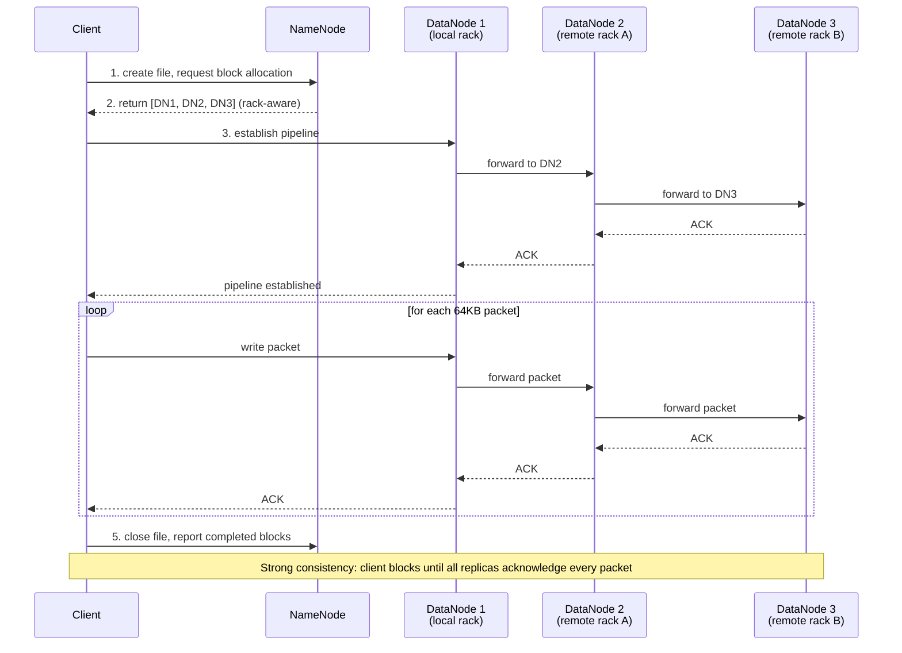
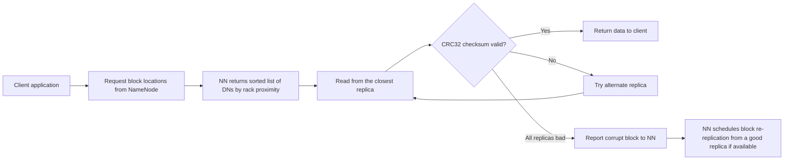

Hadoop is the distributed storage and batch compute framework that made big-data processing accessible and industry-standard.

<!--more-->

## What it is

Hadoop is the distributed storage and batch compute framework that made big-data processing accessible and industry-standard. Its mental model is a filesystem that stripes data across commodity servers, keeping all the metadata on a single authoritative node (the NameNode), while the compute framework (MapReduce, later Spark) runs co-located on the same machines for data locality. Hadoop launched the "data lake" concept - a single repository that holds raw data in its native format, processing it in place rather than ETL-ing into a purpose-built DB. Over the past decade it has both powered the modern data stack and been disrupted by it, as cloud object storage and compute separation (S3 + Spark/Trino) increasingly replace the monolith.

> [!TIP]
> **Hadoop's core insight was that moving compute to data is cheaper than moving data to compute.** By striping large files across cheap machines and scheduling computation beside the data, Hadoop made petabyte-scale batch processing affordable on hardware that previously could not handle it.

## Core concepts

**HDFS blocks and replication.** Files in HDFS are split into blocks (128 MB default, configurable per file). Each block is replicated across DataNodes - 3 copies by default, placed with rack awareness: two replicas on one rack, the third on a different rack. This gives both fault tolerance (a rack failure cannot destroy all copies) and read locality (clients can read from a local replica).

**NameNode and DataNodes.** The NameNode is the metadata master - it holds the entire filesystem namespace in memory: the file-to-block mapping and the block-to-DataNode mapping. User data never flows through it. DataNodes are the workers; each stores blocks on local disk (typically JBOD arrays) and reports block locations to the NameNode via 3-second heartbeats. The NameNode's heap size is the cluster's ultimate scaling ceiling.

**YARN resource manager.** YARN (Yet Another Resource Negotiator) was Hadoop v2's replacement for the monolithic JobTracker. It splits resource management into three roles: the ResourceManager (cluster-level scheduler), NodeManagers (per-node container managers), and ApplicationMasters (per-job coordinators). Two scheduler implementations are available: CapacityScheduler (fixed queue-based) and FairScheduler (dynamic share-based).

**MapReduce job stages.** The original batch compute model: Input splits are read from HDFS into independent map tasks (split -> map), intermediate results are shuffled and sorted across the network (shuffle), then reduce tasks aggregate by key (reduce). Each stage reads from HDFS or the previous stage's output; intermediate spill files are written to local disk, not HDFS, to avoid replication overhead.

**Spark on HDFS.** Spark replaced MapReduce as the dominant compute engine for most workloads, running on YARN, Kubernetes, or standalone. It reads and writes data via HDFS InputFormat/OutputFormat, preserving data locality. Spark avoids MapReduce's disk-spill overhead by keeping intermediate data in memory, but the same HDFS block model and NameNode limits apply.

> [!TIP]
> **The important mental model shift from MapReduce to Spark:** MapReduce spilled every intermediate step to disk; Spark keeps it in memory. But both read input from HDFS, and both benefit from collocating compute with the DataNodes that hold the data.

## How it works

### HDFS Write Path - Replication Pipeline

**The key insight:** The client only talks to the first DataNode. The entire chained pipeline (DN1 -> DN2 -> DN3) happens internally. Packets are 64 KB, and each DN concurrently receives from upstream and writes to downstream. If a DataNode fails mid-write, the pipeline removes it, selects a replacement DN, and continues from the last acknowledged offset. The client blocks until every replica confirms - HDFS provides strong consistency, not eventual.

**Write failure handling.** When a DN fails during a write, the pipeline is torn down to the last healthy node. The NameNode allocates a replacement DN from a different rack, and the write resumes. The failed DN, when it recovers, is told by the NameNode to delete the partial block (block reports reveal the discrepancy). This is the mechanism that makes HDFS resilient to hardware failures during the write path itself.

### HDFS Read Path

**Rack awareness and data locality.** The NameNode knows the rack topology (via `net.topology.script.file.name`) and uses it to prefer local reads. In a multi-rack cluster, the first replica is on the writer's local rack; the second and third are on different racks. A reader in the same rack as a replica reads locally (no cross-rack bandwidth). The read path tries the closest replica first, then falls back. CRC32 checksums on every 512-byte chunk are verified; on mismatch, the client fetches from the next-closest replica and reports the corrupt block to the NameNode, which schedules re-replication.

### High Availability (Active/Standby with QJM + ZooKeeper)

The NameNode is a single point of failure. Hadoop 2.x solved this with Quorum Journal Manager (QJM) HA: two NameNodes (Active + Standby) share a write-ahead log stored on 3+ JournalNodes. The Active NN writes each EditLog entry to a majority of JournalNodes; the Standby NN continuously tails the EditLog, applying mutations to its own in-memory namespace. On Active failure, ZooKeeper Failover Controllers (ZKFC) on each NN host detect the failure via ZooKeeper ephemeral locks and promote the Standby. The failover is transparent to clients because they are configured with a logical nameservice that maps to both NNs. The Standby also performs checkpoints (merging EditLog into FsImage), replacing the old Secondary NameNode role from Hadoop 1.x.

## What you build with it

**Batch ETL.** The classic Hadoop workload: ingest terabytes of logs, raw events, or database dumps nightly; transform with MapReduce or Spark; write back to HDFS or an external data warehouse. Pattern: hourly/daily batch windows, large input sets (100 GB+), predictable throughput. Gotcha: small input files explode NameNode metadata - pre-coalesce into larger files before ingestion (128 MB+ per file).

**Large-scale log processing.** HDFS took over from syslog-based log storage because it provided durable, append-friendly storage at commodity hardware prices. Typical setup: Flume or Kafka feeds logs into HDFS as sequence files or Avro. Gotcha: each log line written as a separate tiny file kills the NameNode. Batch log collection into larger HDFS files or use HBase for random-access log query.

**Data lake storage.** HDFS as the single source of truth for raw and processed data, sitting under Hive, Spark, Presto/Trino, and other query engines. Pattern: land raw data in "bronze" zone, transform to "silver" (cleaned), aggregate to "gold" (analytics-ready). Gotcha: the data lake becomes a metadata swamp. Without Hive Metastore governance + Iceberg/Hudi table format controls, directory-list-based query planning kills performance and names proliferate into unmanageable state.

**Historical analytics.** Running recurring SQL (via Hive/Spark SQL/Trino) over large historical datasets - clickstream analysis, financial reporting, ML feature generation. Pattern: queries scan hundreds of GB to TBs; results are aggregated summaries. Gotcha: Trino/Presto is much faster than Hive for interactive query; Hive is still better for long-running batch that can tolerate higher latency. Plan the engine to the workload.

> [!TIP]
> **The small-files problem is the most common cause of Hadoop production pain.** A 1 KB file costs the same NameNode metadata (roughly 300 bytes) as a 128 MB file. 100 million 1 KB files consume 30 GB of NameNode heap for metadata alone - and the same 30 GB supports billions of 128 MB files with no extra cost. Always batch small records into larger files before writing to HDFS.

## Scaling and availability

**NameNode single-bottleneck scaling.** The NameNode holds the entire namespace in Java heap memory. Each file costs approximately 150 bytes for its inode entry plus 150 bytes per block entry - roughly 300 bytes per single-block file. A 64 GB heap gives a practical ceiling around 100 million files. Real deployments have hit 75 million files on a 64 GB NN. This is the primary scaling constraint: you cannot add more NameNodes to serve more files (federation exists but is complex and splits namespaces rather than sharing them).

**NN HA with ZooKeeper + QJM.** Active NN writes EditLog to a quorum of 3+ JournalNodes. Standby NN tails the log, keeping its in-memory state current. On Active failure, ZKFC acquires a ZooKeeper ephemeral lock and promotes Standby to Active. No data loss on failover because the Standby has applied all committed EditLog entries. Without HA, a NameNode failure takes the cluster down until manual restart.

**Heartbeat and failure detection.** DataNodes send heartbeats every 3 seconds. The NameNode declares a DN dead after 10.5 minutes of silence (2 x 300s recheck-interval + 10 x 3s heartbeat-interval). During this window, writes to that DN are retried and reads fall back to other replicas, but the NameNode does not re-replicate the DN's blocks until it is declared dead. This long window is intentional - it avoids unnecessary re-replication from transient network blips.

**Replication storm protection.** When a mass Node failure exposes thousands of under-replicated blocks, `dfs.namenode.replication.work.multiplier.per.iteration` (default 10) throttles how many re-replication tasks the NameNode schedules per heartbeat. Without this throttle, the sudden re-replication demand saturates cluster network and disk I/O, potentially cascading into further failures.

**YARN data-locality scheduling.** YARN's ResourceManager schedules containers on NodeManagers closest to the data the job needs. When a container request comes in for an HDFS block, YARN checks which NodeManager is on the same host, then same rack, then off-rack. Locality is best-effort: if the local NM has no resources, YARN schedules off-rack (with a configurable delay wait). This is how Hadoop keeps the "move compute to data" promise alive even under resource contention.

**Rack awareness must be configured.** HDFS does not auto-detect rack topology. Without setting `net.topology.script.file.name` to a script that maps IP/hostname to rack, all nodes land in `/default-rack`. All three replicas may then go to the same rack, making a single-rack failure a data-loss event. This is the most common topology-related production incident.

**Cold-start latency.** On restart, the NameNode loads FsImage from disk and applies all pending EditLog transactions. For large clusters (100M+ blocks), the subsequent Safe Mode period - where HDFS serves reads only until 99.9% of blocks report in from DataNodes - can last 30-60 minutes. The Standby NN avoids this by continuously applying edits in real time.

## When to use and when NOT to use

**Great for:**

- Large batch jobs (100 GB+ inputs) where throughput matters more than latency
- Append-heavy write workloads (logs, events, raw data landing)
- On-premises data lakes where S3/object-storage equivalent is not available or costs more
- Cold/archival storage on cheap HDDs, especially with Erasure Coding (Hadoop 3.x) to cut storage overhead by ~50% vs. 3x replication
- Organizations that need full control over the stack for compliance (Kerberos + Ranger + Atlas + TLS + KMS)

**NOT for:**

- Small files or workloads producing many small outputs (NameNode heap pressure is a hard cap around 100M files)
- Low-latency queries (HDFS adds 10-30ms for each NameNode RPC before data transfer even starts)
- Frequent random updates (HDFS is append-only by design; small random writes are expensive rename-delete cycles)
- Transactional workloads (no row-level consistency; the filesystem is at the file/block level)
- Cloud-native deployments where S3, ADLS, or GCS provide cheaper, auto-scaling object storage with no NameNode bottleneck

**Hard limits:**

- ~100 million files on a 64 GB NameNode heap (the NN must hold every file and block entry in RAM)
- 10.5 minute DataNode failure detection window before re-replication begins
- 128 MB default block size (the file is effectively padded to the block boundary)
- `fs.trash.interval` defaults to 0 - `hdfs dfs -rm` is an immediate, permanent delete unless you set this

## Landscape

**Apache Hadoop OSS** is the reference implementation, currently at 3.5.0 (April 2026) under the Apache-2.0 license. It is in mature maintenance mode - no major architectural changes are expected. All major features (QJM HA, Erasure Coding, YARN federation, Ozone) are already shipped.

**Cloudera CDP** is the dominant commercial distribution, resulting from the Cloudera + Hortonworks merger (Jan 2019) and the subsequent $5.3B KKR/CD&R acquisition (Oct 2021). CDP is the only end-to-end hybrid Hadoop offering (on-prem + cloud), bundling HDFS, HBase, Hive, Impala, Spark, Kafka, Flink, NiFi, Ozone, Iceberg, Ranger, Atlas, and Knox. CDP added the Verta ML platform in June 2024. Pricing is $0.04-$0.20/CCU-hour on CDP Public Cloud.

**Amazon EMR** is AWS's managed Hadoop/Spark service, currently on Hadoop 3.3.6 (EMR 7.13.0). It offers the widest OSS version catalog of any cloud service and the tightest S3 integration via EMRFS. EMR supports EC2, EKS, Outposts, and Serverless deployment modes. Representative cost: $0.105/hr EMR uplift + EC2 (c4.2xlarge total ~$0.503/hr).

**Azure HDInsight** is Microsoft's managed Hadoop/Spark service. It provides native Azure AD integration, ADLS Gen2 access via ABFS, and Enterprise Security Package (ESP). However, Microsoft is shifting strategic investment toward Fabric (Synapse + OneLake), and HDInsight is de-emphasized. Prices are hidden behind the Azure portal.

**GCP Managed Service for Apache Spark (ex-Dataproc)** is GCP's Spark-first (not Hadoop-first) offering. Its Lightning Engine claims up to 4.9x speedup vs. OSS Spark. It supports GPU instances (L4/A100), serverless per-second DCU billing ($0.06/DCU-hr standard), BigQuery integration, and cluster mode at $0.010/vCPU-hr.

**Where it is heading.** Hadoop as a monolithic deployment is declining for greenfield projects. The industry is moving toward compute-storage separation (S3/ADLS/GCS + Spark/Trino on Kubernetes or serverless), which eliminates the NameNode bottleneck, scales storage and compute independently, and avoids the operational cost of managing HDFS and YARN. Apache Iceberg has become the standard table format for object-storage-based data lakes, and Trino (ex-Presto) has largely replaced Hive for interactive SQL. However, Hadoop still powers a massive installed base - many of the largest on-prem data lakes in finance, telecom, and government remain HDFS-based, and CDP continues to sell to enterprises that need hybrid on-prem/cloud deployments with full compliance tooling.

## References

1. [Apache HDFS Design Document](https://hadoop.apache.org/docs/stable/hadoop-project-dist/hadoop-hdfs/HdfsDesign.html)
1. [Apache Hadoop High Availability with QJM](https://hadoop.apache.org/docs/stable/hadoop-project-dist/hadoop-hdfs/NameNodeHAWithQJM.html)
1. [Apache Hadoop 3.x Release Notes](https://hadoop.apache.org/docs/stable/)
1. [Apache YARN Documentation](https://hadoop.apache.org/docs/stable/hadoop-yarn/hadoop-yarn-site/YARN.html)
1. [HDFS Configuration (hdfs-default.xml)](https://hadoop.apache.org/docs/stable/hadoop-project-dist/hadoop-hdfs/hdfs-default.xml)
1. [NNThroughputBenchmark Wiki](https://cwiki.apache.org/confluence/display/HADOOP2/NameNode+Throughput+Benchmark)
1. [Apache Hadoop PoweredBy Wiki](https://cwiki.apache.org/confluence/display/HADOOP2/PoweredBy)
1. [Apache Hadoop Auth Examples](https://hadoop.apache.org/docs/stable/hadoop-auth/index.html)
1. [Apache Hive Deployments](https://hive.apache.org/)
1. [Cloudera CDP Pricing](https://www.cloudera.com/products/pricing.html)
1. [Amazon EMR Pricing](https://aws.amazon.com/emr/pricing/)
1. [GCP Dataproc Pricing](https://cloud.google.com/dataproc/pricing)
