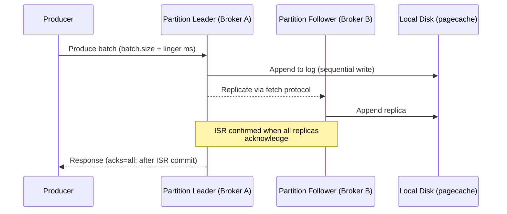
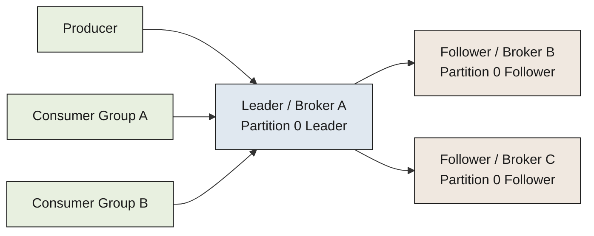
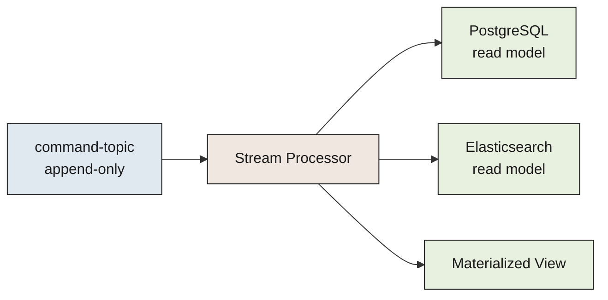

Apache Kafka is a distributed commit log that acts as the central nervous system for event-driven systems. It is not a traditional message queue (though you can use it as one).

<!--more-->

## What Is Apache Kafka

Apache Kafka is a distributed commit log that acts as the central nervous system for event-driven systems. It is not a traditional message queue (though you can use it as one). It is a partitioned, replicated, append-only log that decouples producers from consumers, preserves every message for a configurable retention window, and replays history at will.

> [!TIP]
> **The one big insight.** Kafka treats the log as the source of truth, not a transient delivery mechanism. Every message is written to durable storage and kept for a configurable time (or until storage limits are met). Consumers are stateless pull clients that track their own position in the log. This means new consumers can rewind to any point in the retention window, multiple consumers can read the same data independently, and a crashed consumer resumes from its last committed offset - no broker-side delivery tracking, no redelivery logic, no state.

The pitch: You have multiple microservices, a database change stream, click events from 10,000 frontend servers, and three analytics pipelines that each need the same data. A traditional message broker would route each message to one consumer and discard it. Kafka writes it once, keeps it for days or weeks, and lets every consumer read at its own pace at its own speed. Confluent's Open Messaging Benchmark (2020, 3x i3en.2xlarge, RF=3, acks=all) measured 605 MB/s peak produce throughput with 5 ms p99 latency at 200 MB/s - roughly 200,000 1 KB messages per second per broker.

The project has 33,192 GitHub stars, 15,356 forks, and 1,709 all-time contributors (all live-verified via GitHub API, 2026-07-13). Latest stable release: 4.3.1.

## The Core Concepts You Use

Every pattern you build with Kafka maps to four abstractions.

**Topic.** A named category or feed. Think of it as a table in a database - producers write to it, consumers read from it. A topic can have any number of producers and any number of independent consumer groups. Example topic: `page-visits`, `order-events`, `db.accounts.public.users`.

**Partition.** Each topic is split into one or more partitions. A partition is an ordered, immutable sequence of records. Records within a partition have a strict order; records across partitions do not. Partitions are the unit of parallelism: more partitions mean more concurrent consumers, but also more files and more leader-election work. A partition lives on exactly one broker (the leader) with N replicas on other brokers.

**Consumer Group.** A set of consumers that collaborate to read a topic. Each partition is assigned to exactly one consumer in the group. If you have 8 partitions and 3 consumers, one consumer gets 3 or 4 partitions and the others balance the rest. Add a fourth consumer during a rebalance and partitions redistribute. Consumer groups are the unit of horizontal scaling on the read side.

**Offset.** A sequential 64-bit integer that identifies each record within a partition. Consumers commit their current offset to an internal topic (`__consumer_offsets`, 50 partitions by default, RF=3). On restart, they resume from the last committed offset. This is how Kafka tracks progress without broker-side delivery state.

Supporting pieces: **Brokers** are the servers that store partitions and serve requests. **Leaders** handle all reads and writes for a partition; **followers** replicate data from the leader and take over if the leader fails. The **controller** (one per cluster, elected via KRaft Raft consensus) manages partition leaders and cluster metadata.

## How It Works

Kafka's performance comes from three design choices, each amplifying the others.

### Sequential I/O

Data is written to the log as an append-only sequence. On spinning disks, sequential writes are ~600 MB/s while random writes are ~100 KB/s - a 6,000x difference (from Kafka's original design doc, 2011-era hardware). On modern NVMe SSDs (i3en.2xlarge), one disk delivers 300-650 MB/s sequential. Kafka never seeks: it appends to the end of the log and reads large linear chunks.

The OS pagecache is Kafka's primary cache. Data written to disk stays in the pagecache; consumers that are caught up read directly from RAM without touching the disk. A consumer reading at line speed (25 Gbps NIC, ~3,100 MB/s) sees zero disk I/O as long as data is hot in cache.

### Zero-Copy (sendfile)

When a consumer fetches data, Kafka uses the Linux `sendfile()` system call to transfer data from the pagecache directly to the NIC, bypassing the application buffer entirely. Data is copied into the pagecache exactly once (on the write path) and reused on every consumption.

> ⚠ **The TLS gotcha.** `sendfile()` is disabled when TLS/SSL is enabled. SSL libraries operate in user space and Kafka does not support in-kernel SSL sendfile. If you use TLS on the broker-client link (and you should for production), you trade zero-copy for encryption. The throughput impact varies: on modern hardware with AES-NI, expect roughly 10-20% reduction from the unencrypted baseline.

### Batching

Producers batch messages in memory before sending (controlled by `batch.size` and `linger.ms`). A high-throughput producer sends batches of 1,000+ messages in a single TCP request. The broker appends the batch to the log in one operation. Consumers fetch large chunks (up to 50 MB by default per fetch request). Batching amortizes the per-message overhead across thousands of records.

### Write Path



### Replication Topology



## What You Build With It

Six patterns. Each is the short version of what a team actually reaches for when they set up Kafka.

### Event Sourcing

Store every state change as an event in the order it happened. The current state is a projection: replay the event stream to reconstruct it at any point in time.

```java
// Producer: append an order-placed event
producer.send(new ProducerRecord<>("order-events", orderId, 
    new OrderPlacedEvent(orderId, userId, items, total)));
```

```java
// Consumer: rebuild the read model
consumer.subscribe(Arrays.asList("order-events"));
for (ConsumerRecord<String, Event> record : consumer.poll()) {
    if (record.value() instanceof OrderPlacedEvent) {
        updateOrderSummary(record.key(), record.value());
        updateInventory(record.value().items);
    }
    consumer.commitSync();
}
```

> [!TIP]
> **Hot partition.** If you key by `orderId` and one user places 10,000 orders, all 10,000 events hit the same partition. That partition's broker saturates; the other brokers sit idle. Mitigation: use a random partitioner or a compound key (`(userId % 10) + orderId`) when you expect skewed keys. Confluent recommends 300+ partitions for large clusters to spread the load.

### Log Aggregation

Every service writes structured events to a central topic. Multiple consumers (SIEM, analytics, search index) read independently at their own pace.

```java
// Microservice logs structured event
producer.send(new ProducerRecord<>("app-logs", 
    serviceName, logEvent.toJson()));
```

```yaml
# Filebeat config snippet
output.kafka:
  hosts: ["broker1:9092", "broker2:9092"]
  topic: "app-logs"
  partition.round_robin:
    reachable_only: false
```

> [!TIP]
> **Message size limits.** The default `message.max.bytes` is ~977 KB (1,001,212 bytes). Producer `max.request.size` defaults to 1 MB. If a single log line (or worse, a stack trace) exceeds this, the producer throws a `RecordTooLargeException`. The practical production ceiling is ~16 MB with tuning on both broker and producer sides. For large payloads, store them in S3 and put the URI in the message.

### CQRS (Command Query Responsibility Segregation)

Write commands go to one topic (the command stream). A projection process reads the command stream, computes the new state, and writes it to a read-optimized database. Read queries hit the database, never Kafka.



The command stream is the source of truth. The read model is derived and rebuildable at any time.

> [!TIP]
> **Rebalance storm.** When a stream processor crashes and rejoins, all consumers stop, partitions reassign, and every consumer resumes from its last committed offset. Under high throughput (200+ MB/s), the backlog grows during the rebalance, creating a catch-up loop that can take minutes. Mitigation: cooperative rebalancing (KIP-848, GA in Kafka 4.0, ~5x faster rebalances), static group membership, and higher `session.timeout.ms` (default 45s, bump to 90-120s for stateful processors).

### Stream Processing (Kafka Streams / ksqlDB)

Build stateful transformations, aggregations, and joins over live event streams without a separate processing cluster.

```java
// Kafka Streams: count page views per URL, windowed by minute
KStream<String, PageView> views = builder.stream("page-views");
views.groupByKey()
     .windowedBy(TimeWindows.ofSizeWithNoGrace(Duration.ofMinutes(1)))
     .count()
     .toStream()
     .to("page-view-counts");
```

Processing happens inside the application process. State is stored in local RocksDB (backed by Kafka changelog topics). On rebalance, state stores must be rebuilt from the changelog - at 100 GB this takes 10-30 minutes.

> [!TIP]
> **State store recovery.** Kafka Streams uses RocksDB for local state. On rebalance, a consumer that inherits a new partition must replay the changelog topic from the beginning to rebuild the local store. The fix: `num.standby.replicas=1` keeps a hot standby on another node so the new owner copies state locally instead of replaying from the changelog.

### CDC (Change Data Capture)

Debezium (or another CDC connector) reads the database's transaction log and emits each row change as a Kafka event. Downstream consumers react to the change stream.

```json
// Debezium CDC event (auto-generated from PostgreSQL WAL)
{
  "op": "u",           // operation: c=create, u=update, d=delete
  "before": {"id": 42, "status": "pending"},
  "after": {"id": 42, "status": "shipped"},
  "source": {"db": "orders", "table": "shipments", "lsn": 23847123}
}
```

> ⚠ **Schema evolution break.** When the source database adds a column, Debezium's schema change event can break downstream consumers that expect a fixed schema. Mitigation: set `FORWARD_TRANSITIVE` or `BACKWARD_TRANSITIVE` compatibility on the Schema Registry; always have a dead-letter topic for events that fail deserialization. Monitor DLQ size: if it grows, your schema compatibility policy is too strict (or your consumers are not catching up).

### Async Messaging (Traditional Queue)

A producer emits a message; one consumer in a group processes it. Kafka makes this work at any scale, but the mental model is different from RabbitMQ or SQS.

```python
# Producer (Python)
producer.send('email-tasks', value={'to': user.email, 'template': 'welcome'})

# Consumer
for msg in consumer:
    send_email(msg.value['to'], msg.value['template'])
    consumer.commit()
```

> [!TIP]
> **Ordering and parallelism.** Within a partition, order is guaranteed. Across partitions, it is not. If you need strict ordering for a given entity (e.g., all events for user 123 must process in order), key by that entity: Kafka hashes the key to determine the partition. But this means at most one consumer in the group can process that partition. The tradeoff: ordering vs. parallelism. If you need both, consider Kafka Streams with a custom partitioner or accept partition-level ordering as the contract.

## Scaling

### Partitioning

Every topic is split into N partitions. Partitions are the unit of parallelism: a topic with 12 partitions can be consumed by at most 12 consumers in one group (not counting standbys). On the broker side, each partition is a directory of segment files. Practical experience suggests 20,000 partitions per broker as a safe ceiling; 100,000 is possible with KRaft but leader-election time and metadata size grow nonlinearly. Per-cluster limits: ~200,000 with KRaft, ~100,000 with ZooKeeper (deprecated in 4.x).

### Replication and ISR

Each partition has one leader and N-1 followers. Followers pull from the leader using the same fetch protocol as consumers. The In-Sync Replica (ISR) set contains followers that are fully caught up (within `replica.lag.time.max.ms`, default 30s). A message is considered committed only when all ISR replicas have it. Only ISR members are eligible for leader election.

In production: replication factor 3, `min.insync.replicas=2`. This means at least 2 replicas (leader + 1 follower) must acknowledge every write. If the ISR shrinks to 1, `acks=all` producers fail.

### Failover

On broker failure, the controller detects the loss (KRaft: ~1-3 seconds, ZooKeeper: ~10-30 seconds) and promotes an ISR follower to leader for each orphaned partition. Clients see `NOT_LEADER` or `LEADER_NOT_AVAILABLE` errors and refresh metadata.

### The Failure That Surprises People

**Rebalance under load.** A consumer in a high-throughput group (200+ MB/s) disconnects, triggering a rebalance. All consumers stop processing while the group coordinator reassigns partitions. The backlog grows. When consumers resume, they read at max speed to catch up. If one consumer gets more partitions than its thread pool can handle, it lags. The lag triggers another rebalance. The fix: KIP-848 (server-side rebalancing, GA in Kafka 4.0) reduces rebalance time by ~5x. Static group membership (`group.instance.id`) avoids the full stop on a single known failure.

**Unclean leader election.** If the partition leader crashes and no ISR follower exists, `unclean.leader.election.enable=true` promotes a non-ISR follower - data written to the old leader that never reached the promoted follower is lost forever. Default is `false` in modern Kafka. Keep it false.

**Disk-full crash.** If the retention cleaner cannot delete segments fast enough to keep pace with the produce rate, the disk fills and the broker crashes. Monitor at 80/90/95% of capacity. Use `log.retention.bytes` to cap per-partition storage. Multiple `log.dirs` spread the I/O. Tiered Storage (KIP-405, GA in 4.3) offloads old segments to S3, reducing local disk requirements by 80-90%.

## Durability

### Acks Settings

The producer controls durability at the message level via `acks`:

- **acks=0** - fire and forget. The producer does not wait for any acknowledgement. Highest throughput, possible data loss on broker crash. Useful for metrics or logs you can afford to lose.
- **acks=1** - wait for the leader to acknowledge (default). The leader writes to pagecache and replies. If the leader crashes before the follower replicates, the message is lost.
- **acks=all** (or `acks=-1`) - wait for all ISR replicas to acknowledge. Combined with `min.insync.replicas=2`, this gives you strong durability. The cost is one additional network round-trip to followers; throughput impact is ~5-15% vs acks=1 on modern hardware.

### Exactly-Once Semantics

Kafka provides three layers of EOS guarantee, each with a different cost.

**Idempotent producer** (`enable.idempotence=true`). The producer tags each batch with a producer ID (PID) and sequence number. The broker deduplicates identical sequences, eliminating duplicates from producer retries. Throughput overhead: 5-10%.

**Transactions** (`transactional.id`). Allows atomic writes across multiple partitions and topics. A consumer with `isolation.level=read_committed` sees only committed transactions. Enables the classic "exactly-once" stream processing pattern: read from topic A, transform, write to topic B, commit the consumer offset - all as one atomic unit. Throughput overhead: 15-25% vs non-transactional.

```java
producer.initTransactions();
producer.beginTransaction();
producer.send(topicA, record1);
producer.send(topicB, record2);
producer.sendOffsetsToTransaction(offsetsMap, consumerGroup);
producer.commitTransaction();
```

> ⚠ **When to use EOS.** Start with at-least-once semantics (idempotent producer + idempotent consumers via dedup keys). This covers 90% of use cases. Add transactions only when the business contract requires exactly-once delivery (financial reconciliation, inventory counts). The 15-25% throughput hit is real; do not pay it without evidence you need it.

### What You Can Lose and When

| Scenario | Data at risk | Prevention |
|---|---|---|
| acks=0, broker crash | All in-flight messages | Use acks=all |
| acks=1, leader crash before replication | Messages in leader's log not yet replicated | Use acks=all + min.insync.replicas=2 |
| Unclean leader election enabled | All messages on old leader not in promoted follower | Set unclean.leader.election.enable=false |
| Disk full, no Tiered Storage | All segments on the full disk | Monitor thresholds, set log.retention.bytes, enable Tiered Storage |
| Transaction timeout exceeded | Partial transaction rolled back | Keep `transaction.timeout.ms` within 2x your max expected duration |

## When to Use It, and When Not To

**Great fit:**

- High-throughput event streaming (100K+ msg/s per broker, 600+ MB/s cluster)
- Decoupling microservices via persistent event streams (each consumer reads independently, multiple consumer groups share one topic)
- Change data capture from databases (Debezium + Kafka = a unified change stream for search, cache, analytics, audit)
- Log aggregation and metrics (durable, replayable, any number of consumers)
- Event sourcing and CQRS (the log is the source of truth; read models are derived)
- Stream processing with state (Kafka Streams, ksqlDB - stateful joins, windows, aggregations)
- System of record for event-driven architectures (the log keeps a durable, ordered history)

**Wrong fit:**

- Simple point-to-point messaging (under 10K msg/s). RabbitMQ or SQS is simpler, cheaper, and has better latency at low throughput
- Strict exactly-once delivery to a single consumer without idempotent sinks. Kafka's EOS guarantees depend on the sink being idempotent (Kafka-to-Kafka is safe; Kafka-to-database requires the consumer to handle duplicates)
- Low-latency (sub-millisecond) request-response messaging. Even a hot, cached Kafka fetch is ~1-2 ms; RabbitMQ or Redis do sub-millisecond at low throughput
- Datasets under 100 GB / 100 msg/s. Kafka's operational overhead (3 brokers, ZooKeeper/KRaft, monitoring, YAML configs) is not worth it at that scale. Use SQS, RabbitMQ, or a simple Redis Stream
- Messages larger than 10 MB. Kafka's batching and memory model assumes small records. For large blobs, store them in object storage and reference the URI

**Hard limits:**

| Limit | Value | Rationale |
|---|---|---|
| Max message size (practical) | ~16 MB | Brokers and producers need heap tuning beyond this |
| Max partitions per broker | 20,000 (practical) / 100,000 (absolute with KRaft) | Leader election time + metadata grow nonlinearly |
| Max partitions per cluster | ~200,000 (KRaft) | Metadata log bottleneck |
| Max consumer group size | ~2,000 consumers | Rebalance overhead prohibitive beyond this |
| Max topic count | ~10,000 | Metadata overhead + controller load |
| Default message.max.bytes | ~977 KB (1,001,212 bytes) | Tune upward for larger payloads |

## The Landscape

| Edition | License | Managed? | Key Differentiator | Cost (representative) |
|---|---|---|---|---|
| Apache Kafka (upstream) | Apache-2.0 | Self-managed | Reference implementation, KIP-driven, full control | $0 (software) + infra cost |
| Confluent Cloud / Platform | Apache-2.0 core + CCL for Schema Registry, Connectors, ksqlDB | Yes (Cloud) + Platform (self-managed) | Schema Registry, ksqlDB, Cluster Linking, RBAC, 100+ Connectors | ~$640/mo (3 CKU Standard) |
| AWS MSK (Provisioned) | Apache-2.0 (AWS runs upstream) | Yes (AWS) | Native VPC, IAM auth, CloudWatch, GA tiered storage | $0.21/broker-hour (m5.large) - ~$560/mo for 3 brokers + 1 TB |
| AWS MSK (Serverless) | Apache-2.0 (AWS runs upstream) | Yes (AWS) | Auto-scaling, no partition management | $0.75/cluster-hour floor (~$547/mo minimum) |
| Redpanda | BSL 1.1 | Yes (Cloud) + self-managed | C++ rewrite, no JVM, single binary, lower tail latency | Contact sales |
| WarpStream / AutoMQ | Apache-2.0 | Yes + self-managed | Object-storage-native, no local disks, S3 economics | Contact sales |
| Aiven for Apache Kafka | Apache-2.0 (runs upstream) | Yes (multi-cloud) | Multi-cloud managed OSS; RBAC + audit logs included | ~$142/mo (Startup-4) |
| Upstash Kafka | Proprietary (managed) | Yes (serverless) | Pay-per-request; edge/serverless workloads | $0.20-0.30/mo (entry tier) |

The license landscape matters. Kafka core is Apache-2.0 (unrestricted). Confluent's value-add components (Schema Registry, ksqlDB, Control Center) are under the Confluent Community License (CCL), which restricts SaaS competition. Redpanda uses BSL 1.1 (converts to Apache-2.0 after 4 years). WarpStream and AutoMQ are Apache-2.0.

## Where It's Heading

**KRaft is the default.** ZooKeeper was removed entirely in Kafka 4.0 (2025). KRaft controllers use Raft consensus for metadata, supporting ~200,000 partitions vs ZooKeeper's ~100,000, with failover in ~1-3 seconds instead of ~10-30 seconds. Expect further metadata scalability improvements as KRaft matures.

**Tiered Storage (KIP-405) is GA.** Kafka 4.3 ships production-ready tiered storage, offloading old segments to S3/GCS/Azure. This cuts local disk requirements by 80-90% and makes long retention (months to years) economically viable. The broker's local disk becomes a hot cache for recent data; older data streams from object storage on read. The biggest operational pain point for large Kafka deployments is being addressed.

**KIP-848 - new consumer protocol.** Server-side rebalancing (Consumer Group Protocol v2) replaces the stop-the-world protocol with ~5x faster rebalances. GA in Kafka 4.0. For teams with stateful stream processors or consumer groups over 50 members, this is the most impactful operational improvement in years.

**KIP-932 - queues for Kafka.** Share groups introduce traditional queue semantics (multiple consumers processing the same partition, per-message ack, message locking with timeout) inside Kafka. Preview in 3.9, GA expected in 4.3+. For teams that want Kafka's durability and scale but need queue-like consumer flexibility, this eliminates the "one partition, one consumer" constraint.

**12-month outlook.** Expect KRaft partition limits to push past 200,000; tiered storage to become the default retention strategy for new deployments; and the ecosystem (Debezium, Kafka Streams, ksqlDB) to converge on KIP-848's fast rebalancing as the standard. Confluent continues to monetize the enterprise features (RBAC, audit logs, cross-cluster replication) while upstream Kafka closes the gap on basic operations. The Kafka vs. Redpanda vs. WarpStream competition is healthy: each pushes the others to improve performance and simplify operations.

## References

1. [Kafka 4.3 Design Documentation](https://kafka.apache.org/43/design/design/)
1. [Kafka 4.3 Getting Started](https://kafka.apache.org/43/getting-started/)
1. [Kafka 4.3 Operations - KRaft](https://kafka.apache.org/43/operations/kraft/)
1. [Kafka 4.3 Operations - Tiered Storage](https://kafka.apache.org/43/operations/tiered-storage/)
1. [KIP-405: Kafka Tiered Storage](https://cwiki.apache.org/confluence/display/KAFKA/KIP-405%3A+Kafka+Tiered+Storage)
1. [KIP-848: Next Generation Consumer Rebalance Protocol](https://cwiki.apache.org/confluence/display/KAFKA/KIP-848:+The+Next+Generation+of+the+Consumer+Rebalance+Protocol)
1. [KIP-932: Queues for Kafka](https://cwiki.apache.org/confluence/display/KAFKA/KIP-932%3A+Queues+for+Kafka)
1. [GitHub - apache/kafka](https://github.com/apache/kafka)
1. [Confluent Open Messaging Benchmark](https://www.confluent.io/blog/open-messaging-benchmark-results/)
1. [Kafka Producer Configs (4.3)](https://kafka.apache.org/43/documentation/#producerconfigs)
1. [Kafka Broker Configs (4.3)](https://kafka.apache.org/43/documentation/#brokerconfigs)
1. [Debezium Documentation](https://debezium.io/documentation/)
1. [Kafka Streams Documentation](https://kafka.apache.org/43/documentation/streams/)
1. [Confluent Cloud Pricing](https://www.confluent.io/pricing/)
1. [AWS MSK Pricing](https://aws.amazon.com/msk/pricing/)
