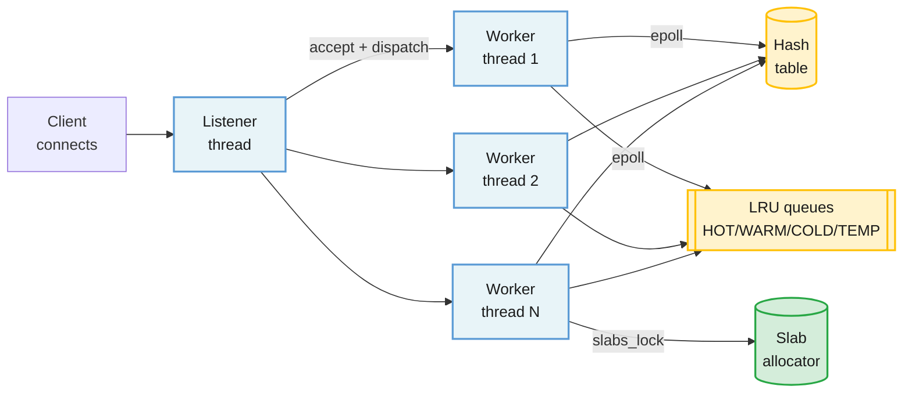
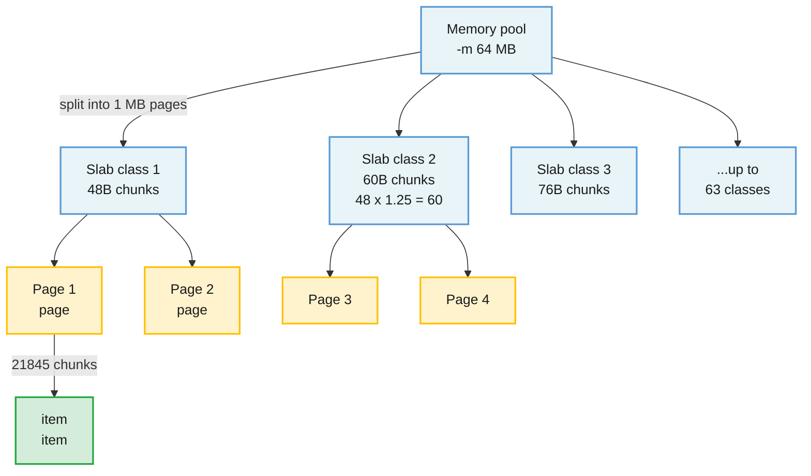

Memcached is a high-performance, distributed memory object caching system. It keeps your dataset entirely in RAM and serves cache lookups in under a millisecond. You treat it as a giant, shared hash table that a fleet of backend servers can all reach across the network.

<!--more-->

## What Is Memcached

Memcached is a high-performance, distributed memory object caching system. It keeps your dataset entirely in RAM and serves cache lookups in under a millisecond. You treat it as a giant, shared hash table that a fleet of backend servers can all reach across the network. It has no persistence, no replication, no authentication by default, and no clustering logic on the server side. Strip away everything that makes a database a database, and what remains is the fastest way to read a value from memory by key.

The one design choice that defines Memcached is that it does not trust the client to free memory. Instead, it pre-allocates all the memory you give it into fixed-size slabs, and when those fill up it evicts the least-recently-used data automatically. That means you never have to think about garbage collection or out-of-memory crashes, but you also must accept that keys can disappear at any time, even before their TTL expires.

> [!TIP]
> **Memcached is a cache that evicts on you, not a database that saves from you.** Every value you store can be gone the next time you ask for it, and that is not a bug - it is the contract. Design your application around that contract and you get sub-millisecond reads at millions of operations per second on a single node.

## Core Concepts You Use

**get / set / delete.** The three fundamental operations. `get <key>` returns a stored value or nothing. `set <key> <flags> <exptime> <bytes>` writes a value. `delete <key>` removes it. Response to a miss is silence plus `END`, not an error. This shapes how you write code: a cache miss and a nonexistent key look the same, so every read path must have a fallback.

**TTL (exptime).** Expiration time as a Unix timestamp (absolute) or a relative offset in seconds. Values over 30 days (2,592,000 seconds) are treated as absolute timestamps. Granularity is one second. A TTL of 0 means never expire (until eviction gets it). Important: expiration is lazy - expired items are only removed on access or during the background crawler sweep, not at the exact second they expire.

**CAS (Check And Set).** A 64-bit unique identifier returned by `gets` and verified by `cas`. Think of it as an optimistic lock: you read a value, get its CAS token, compute a new value, and write it back with the same token. If another client modified the value between your read and write, the CAS token will not match and the write fails atomically. This is how you build safe concurrent operations without a mutex.

**Increment / Decrement.** Atomic 64-bit integer math on stored values. This is the building block for counters, rate-limiter tokens, and leaderboard scores. The value must be stored as a decimal integer string. A single `incr` call on a cache-hot key does in under 100 microseconds what a read-modify-write cycle would take three network round-trips to do.

**Slabs.** The slab allocator is not something you configure directly, but its behavior affects everything. Memcached pre-chunks memory into slab classes, each holding items within a size range. A slab class for 64-byte items, one for 128-byte items, one for 256, and so on up. The growth factor between classes defaults to 1.25x and is configurable. If you store a mix of 64-byte and 512-byte values, each goes into its own slab class, and the LRU eviction runs independently per class. Slab calcification - where one class hogs all the free pages while another starves - is the most common operational surprise.

## How It Works

### The Event Loop

A single process running on a port (default 11211) listens for TCP connections. The default threading model is a single-threaded event loop built on libevent. With `-t N` you get one listener thread plus N worker threads, each running its own epoll loop. The multi-threaded model uses a global lock per hash-table bucket (a secondary lock table), per-LRU locks, and a global slab-allocation lock. Lock ordering is strict: `item_lock -> lru_lock -> slabs_lock`. Atomic refcounts on each item avoid full item locks for common read patterns.



The key insight is that Memcached is not single-threaded the way Redis is. It uses a threaded dispatch model where each worker owns its own event loop and runs reads and writes in its own thread. The lock contention that matters is on the hash table and the LRU, and the segmented lock design keeps it manageable up to about 32 threads. Beyond 64 threads the documentation explicitly warns of degraded performance - the lock overhead dominates.

### The Slab Allocator

Before Memcached serves a single request, it allocates all of its memory (-m flag, default 64 MB) into 1 MB pages. Each page belongs to one slab class. Within a slab class, pages are subdivided into chunks of a uniform size determined by the growth factor.



When you store a 60-byte value, it lands in slab class 1 (48-byte chunks) only if that class is the closest fit that is smaller than your value. If the value is 50 bytes, it goes into class 2 (60-byte chunks). The 10 bytes of internal fragmentation is the price of never having to compact or defragment memory. The `slab_automove` background thread can reassign pages between slab classes if one class is under heavy eviction pressure while another is nearly empty. This mitigates slab calcification but does not eliminate it entirely - a sudden traffic shift to a new key-size distribution still requires a restart to fully rebalance in pathological cases.

### The LRU Eviction System

Prior to version 1.6, each slab class had a single LRU list. Items entered at the head and were evicted from the tail. The problem was that a one-read wonder - a key accessed once then never again - pushed out a repeatedly accessed key just because both sat on the same list.

Starting with 1.6, each slab class has four LRU queues:

- **HOT:** new items land here. If an item in HOT is accessed again, it moves to WARM. If HOT fills up, the tail item moves to COLD.
- **WARM:** items accessed at least twice. Protected from eviction by both a capacity cap (default 32% of the slab class) and an age cap (10% of COLD's age). An item at the tail of WARM that exceeds the age cap moves back to COLD.
- **COLD:** the eviction candidate pool. Unbounded by default. Items at the tail are evicted when memory pressure demands it. A hit on a COLD item moves it to WARM.
- **TEMP:** a special queue for short-TTL items (enabled with `-o temporary_ttl=N`). Items with a TTL below N seconds go here and are never bumped or evicted - they sit until they expire and are cleaned up by the crawler. This prevents a flood of short-lived items from polluting HOT/WARM/COLD.

A background `lru_maintainer` thread moves items between queues, freeing expired items, and controlling the `lru_crawler`. Because items are repositioned only every 60 seconds (`ITEM_UPDATE_INTERVAL`), the LRU structure is amortized, not exact. This tradeoff - accepting staleness in the LRU ordering for dramatically reduced lock contention - is why Memcached can serve millions of requests per second on moderate hardware.

### Network & Protocol

The default protocol is a plain-text ASCII protocol over TCP. Commands are human-readable: `get mykey\r\n`, response `VALUE mykey 0 5\r\nhello\r\nEND\r\n`. A binary protocol is available but less common. Since 1.6, meta commands (`mg`, `ms`, `md`, `ma`) provide a unified flags-based interface that reduces round-trips: a single `mg` can get a key and auto-vivify it on miss, or atomically update its TTL without a separate `touch` command.

## What You Build With It

### A Caching Layer

This is what Memcached was built for. Your application checks the cache first; on a miss it computes or fetches the real value, stores it in Memcached with a TTL, and returns it.

```javascript
cache = memcache.Client(['10.0.0.1:11211', '10.0.0.2:11211'])
def get_user(user_id):
    key = f"user:{user_id}"
    data = cache.get(key)
    if data is None:
        data = db.fetch_user(user_id)
        cache.set(key, data, time=3600)
    return data
```

> [!TIP]
> **The gotcha is the thundering herd.** When a popular key expires and every request misses simultaneously, they all hit the database at once. Mitigate with probabilistic early expiry: if the TTL is 3600 seconds, treat the key as stale after 3500 seconds with a probability that increases with age. One request regenerates, the rest see the still-fresh value.

### A Session Store

Stateless applications need somewhere to put session data. Memcached is a natural fit - fast, shared across nodes, and sessions have a natural TTL (session lifetime). The risk is that a node failure drops every session hashed to that node. Mitigate by either using a replicated pool (via mcrouter) or by designing sessions to tolerate loss (a login page is a UX inconvenience, not a data loss).

### A Rate Limiter

Atomic increment is all you need for a sliding-window rate limiter. Store a key like `ratelimit:user:42:1715894400` (minute bucket), increment it per request, and check the count before processing.

```javascript
key = f"ratelimit:{user_id}:{int(time.time() / 60)}"
count = cache.incr(key, 1)
if count == 1:
    cache.expire(key, 60)
if count > 100:
    return 429  # Too Many Requests
```

> [!TIP]
> **Clock skew across nodes matters.** Consistent hashing may route the same user to different nodes for different requests, giving them separate rate-limit buckets. Pin the user's rate-limit keys to a single node with hash tagging, or accept the over-counting during rebalance and set your limit 10-20% lower than the hard cap.

### A Leaderboard / Counter

Atomic increment and decrement make Memcached a natural fit for real-time counters: page views, like counts, concurrent player counts. The value is returned by the `incr` command itself, so you can atomically increment and read in one call.

Where Memcached stops is sorted leaderboards. It has no sorted-set data structure. For a top-100 leaderboard, you must either keep the sorted list in your application layer or use Redis. Memcached is a counter store, not a ranking engine.

### A Distributed Lock

You can build a simple lock with `add` (which fails if the key exists):

```javascript
lock_id = str(uuid.uuid4())
if cache.add(f"lock:resource:42", lock_id, time=10):
    # got the lock
    try:
        do_work()
    finally:
        # release only if we still hold it
        val = cache.get(f"lock:resource:42")
        if val and val.decode() == lock_id:
            cache.delete(f"lock:resource:42")
else:
    # didn't get the lock, retry or skip
```

> ⚠ **This is an efficiency lock, not a correctness lock.** A GC pause longer than the TTL causes the lock to expire; another process acquires it; the original process wakes and deletes the lock the second process holds. Use CAS (`gets`/`cas`) to verify ownership before release, and accept that distributed locks on Memcached are a fence for coordination work, not a guarantee for mutually exclusive access to external resources. For correctness-critical locking use ZooKeeper or etcd.

### A Temporary Store (TEMP LRU)

The `-o temporary_ttl=N` feature gives you a dedicated queue for short-lived items. These items are never bumped on access and never evicted - they sit in the TEMP LRU until they expire and are cleaned up by the background crawler. This is ideal for one-time tokens, CAPTCHA challenges, idempotency keys, and nonce storage where the item lives a few seconds and is never read more than once.

## Scaling and Failure Modes

**Memcached has no server-side clustering.** Every node is completely independent. There is no gossip protocol, no leader election, no replication, no shared-nothing auto-sharding. Scaling is handled entirely by the client.

**Consistent hashing.** The client library hashes each key onto the ring of server nodes. When a node is added or removed, only keys on the affected nodes are remapped - the default of `1/N` keys relocate. This is a massive improvement over naive `key % N` hashing, which remaps every key on any node change. The `ketama` algorithm is the standard implementation.

**The failure that surprises people: cold start.** You provision new nodes for a cluster, the traffic arrives, and every key misses because the cache is empty. All the reads fall through to the database, which was sized for a warm cache hit rate. The database gets overwhelmed, latencies spike, and the application falls over. This is the thundering herd amplified to cluster scale.

Mitigations include:

- **Pre-warming:** replay production traffic against a new node before moving it into the serving pool.
- **Two-level cache (L1 L2):** an in-process L1 cache (say 5-10 MB per application instance) absorbs the first requests after a cold start while the L2 Memcached warms up.
- **Gradual warm-up pools (mcrouter):** add new nodes to a warm-up pool that receives a fraction of traffic, then migrate them into the main pool once populated.
- **The `mg` auto-vivify flag:** meta-get can request the proxy to auto-fill a key on miss, reducing cascading back-to-backs.

**Hot keys.** A single key that accounts for 5% of all cache reads can saturate one node's network interface or CPU. Since keys are distributed by hashing, a popular key pins its node. Mitigations are application-level: sub-partition the key (`user:42:count` becomes `user:42:0` through `user:42:7`), or add an in-process L1 cache that absorbs the hot key's reads before they reach the network.

**Consistent hashing rebalance misses.** When a node joins the cluster, the keys that now map to it were previously mapped to the surviving nodes. Those keys are all cache misses on the new node, imposing a temporary load spike. Using mcrouter's replicated pool with a warm-up pool mitigates this: the new node serves a fraction of traffic gradually, not all its assigned keys at once.

## When To Use It, And When Not To

**Great fit:**

- Read-heavy workloads where sub-millisecond latency matters and occasional cache misses are acceptable.
- Key-value lookup patterns with simple data (strings up to 1 MB, typically much smaller).
- Session storage where loss means re-login, not data corruption.
- Real-time counters and rate limiters that need atomic increment.
- An L2 cache shared across many application servers, sitting between your L1 (in-process heap) and your database.
- Multi-GET batch reads for dashboards or feed assembly.

**Wrong fit:**

- Data you cannot afford to lose. Memcached has no persistence, no replication, and evicts on memory pressure. If the cluster restarts, every key is gone. Use Redis (RDB/AOF) or a database.
- Data that must survive an individual node failure. A single Memcached node going down loses its entire key set. Use Redis Sentinel / Cluster with replication, or a distributed cache with replication.
- Sorted structures (leaderboards, range queries, prefix scans). Memcached has a flat key-value model. Use Redis sorted sets or SortedSet-like stores.
- Pub/sub or message queues. Memcached has no pub/sub primitives. Use Redis pub/sub, RabbitMQ, or Kafka.
- Sub-millisecond TTL precision. Memcached granularity is one second. For millisecond-level expiration, use Redis or implement the expiry in your application layer.
- Data that must be available during a node rebalance. If you cannot tolerate read misses during cluster topology changes, use a replicated cache layer (ElastiCache for Redis with replication groups, not Memcached).

**Hard limits to know:**

- Key length: 250 bytes max. Keep keys short and clean.
- Value size: 1 MB default, configurable up to 1 GB. Values above ~512 KB use chunked storage.
- Connections: 1024 default. Raise with `-c` in production (10,000+ is common).
- Threads: `-t` default is 4. Above 64 is documented as harmful. Match to physical cores.
- Memory: default 64 MB. Always set `-m` explicitly in production.

## The Landscape

Memcached is a BSD 3-Clause project with 14,148 stars and 95 open issues on GitHub (as of July 2026). The top maintainer, dormando, has contributed 1,180 commits. The latest stable release is 1.6.45 (July 2026). The project had 4 security releases in 11 weeks from May to July 2026 (CVE-2026-47783, CVE-2026-47784, two heap overflow fixes). Docker pulls have reached approximately 13 billion.

**Managed editions:**

- **AWS ElastiCache for Memcached:** node-based ($0.017/hr for t3.micro to $0.437/hr for r7g.xlarge) or serverless ($0.125/GB-hour + $0.0034/million ECPUs). No replication, no failover.
- **GCP Memorystore for Memcached:** pinned to versions 1.5.16 and 1.6.15 - which predate every 2026 CVE patch. If you use GCP Memorystore, you are running unpatched software. Consider self-managing or migrating to AWS.
- **Azure:** no first-class managed Memcached service. Run it on VMs or AKS.

**Federation proxies:**

- **mcrouter (Meta):** production-grade proxy with support for shadow, replicated, warm-up, and failover pools. MIT license, 3,335 stars, actively maintained (last push July 2026).
- **Built-in proxy (1.6.26+):** a Lua-configurable routing frontend compiled in with the `enable-proxy` configure flag. The maintainer's answer to the orphaned-proxy problem - no third-party deployment required.
- **twemproxy (Twitter):** a general-purpose proxy used at scale. Mostly dormant (last push 2024).

**Competition:**

- **Valkey (26,537 stars, BSD-3):** the Linux Foundation fork of Redis. Full replication, persistence, sorted sets, pub/sub - a superset of Memcached's capabilities at a performance cost of roughly 10-15% for raw get/set.
- **Garnet (Microsoft Research, 11,908 stars, MIT):** Redis-protocol cache with multi-threaded architecture. Not Memcached-protocol native.
- **DragonflyDB:** a multi-threaded Redis-API alternative with partial Memcached compatibility.

A representative cost: a 10-node ElastiCache cluster of r7g.xlarge instances (26.32 GiB memory per node, ~263 GiB total, 4 vCPU) costs $0.437/hr per node = $4.37/hr or approximately $3,200/month. The equivalent self-managed on EC2 with r7g.xlarge reserved instances would be roughly 40-50% less.

## Where It's Heading

The 1.6.x line is mature and stable. The 2026 security release cadence (4 releases in 11 weeks) shows that maintenance is active but security-driven rather than feature-driven. The most significant recent addition is the built-in proxy (1.6.26+), which fills the gap that previously required mcrouter or twemproxy.

The serverless pricing model from AWS (ElastiCache Serverless) is the biggest shift in how Memcached is consumed. Pay-per-ECPU-request pricing eliminates capacity planning for variable-load workloads, though at a premium over node-based pricing for steady-state traffic.

The CVE cluster in mid-2026 (two SASL side-channels CVSS 8.1, two heap overflow fixes) is a reminder that Memcached's design as a simple, trusted-internal-network tool is incompatible with modern security requirements. TLS and SASL are bolted on, not designed in. Future versions may move toward better defaults (TLS by default, SASL disabled by default, the metadata dump endpoint locked down out of the box).

For production teams evaluating a cache layer in 2026, the decision is less about Memcached vs Redis in terms of raw performance (both are fast enough for most workloads) and more about whether you need replication, persistence, and data structures (Redis/Valkey) or the simplest, fastest key-value path with no moving parts (Memcached). The cluster of security fixes and GCP's stuck-on-vintage-version position push the "set it and forget it" calculus toward managed Redis alternatives for teams that do not want to think about patching.

## References

1. [Memcached source repository](https://github.com/memcached/memcached)
1. [memcached(1) man page](https://github.com/memcached/memcached/blob/master/doc/memcached.1)
1. [Protocol documentation](https://github.com/memcached/memcached/blob/master/doc/protocol.txt)
1. [Threading model documentation](https://github.com/memcached/memcached/blob/master/doc/threads.txt)
1. [New LRU system documentation](https://github.com/memcached/memcached/blob/master/doc/new_lru.txt)
1. [Slab allocator source (slabs.c)](https://github.com/memcached/memcached/blob/master/slabs.c)
1. [Hash table source (memcached.h)](https://github.com/memcached/memcached/blob/master/memcached.h)
1. [ScyllaDB benchmark: 3M GET/s on Memcached](https://www.scylladb.com/2020/06/01/performance-evaluation-of-memcached-like-workloads/)
1. [mcrouter repository](https://github.com/facebook/mcrouter)
1. [Built-in proxy introduction](https://memcached.org/blog/proxy-intro/)
1. [AWS ElastiCache pricing](https://aws.amazon.com/elasticache/pricing/)
1. [GCP Memorystore pricing](https://cloud.google.com/memorystore/docs/memcached/pricing)
1. [Docker Hub - memcached](https://hub.docker.com/_/memcached)
1. [CVE-2026-47783 / CVE-2026-47784 (SASL timing side-channels)](https://nvd.nist.gov/)
1. [1.6.44 security release notes](https://github.com/memcached/memcached/blob/master/doc/ReleaseNotes1644.md)
1. [1.6.45 release notes](https://github.com/memcached/memcached/blob/master/doc/ReleaseNotes1645.md)
