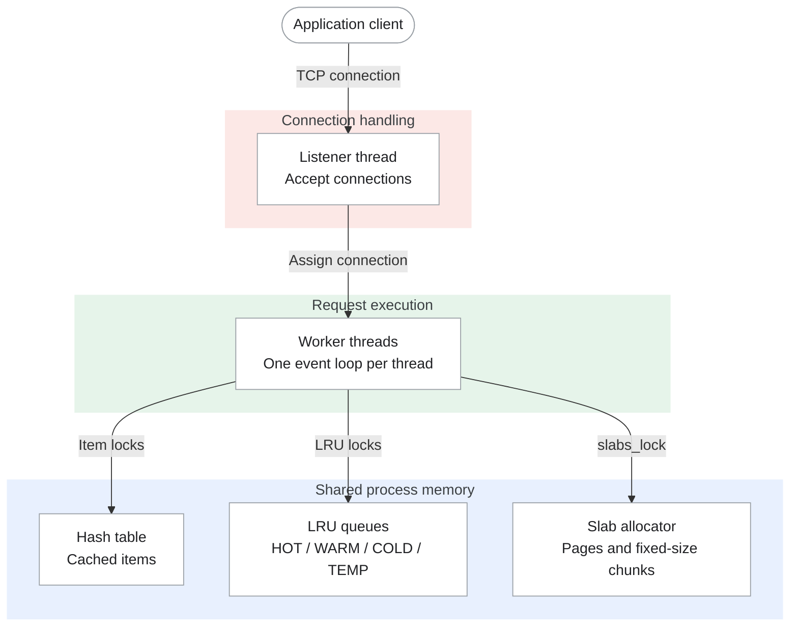
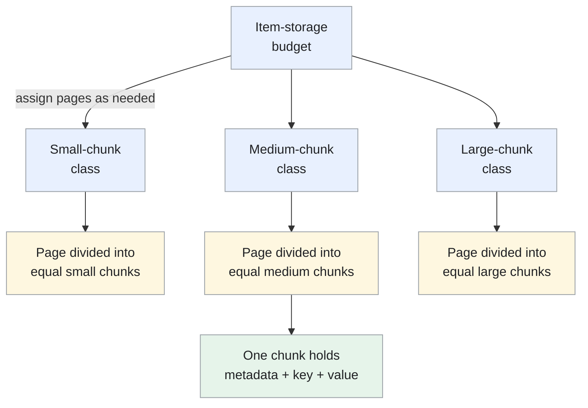

Memcached is a high-performance, distributed memory object caching system. It keeps your dataset entirely in RAM and serves cache lookups in under a millisecond. You treat it as a giant, shared hash table that a fleet of backend servers can all reach across the network.

<!--more-->

## Overview {#what-is-memcached}

Memcached is a high-performance, distributed memory object caching system. It keeps your dataset entirely in RAM and serves cache lookups in under a millisecond. You treat it as a giant, shared hash table that a fleet of backend servers can all reach across the network. It has no persistence, no replication, no authentication by default, and no clustering logic on the server side. Strip away everything that makes a database a database, and what remains is the fastest way to read a value from memory by key.

Memcached manages cached items within a memory budget using fixed-size chunks grouped into slab classes. When a class runs out of space, it can evict older items to make room. This keeps allocation predictable, but it also means a key can disappear before its TTL expires. The application must be able to fetch or rebuild a missing value.

> [!TIP]
> **Memcached is a cache that evicts on you, not a database that saves from you.** Every value you store can be gone the next time you ask for it, and that is not a bug - it is the contract. Design your application around that contract and you get sub-millisecond reads at millions of operations per second on a single node.

## Core concepts {#core-concepts-you-use}

- **get / set / delete.** Read a value, store a value, or remove it. In the [basic text protocol](https://docs.memcached.org/protocols/basic/), a `get` miss returns `END` without a value, rather than an error. Every read path therefore needs a fallback to the database or another source of truth.

- **TTL (expiration).** The [protocol's expiration field](https://github.com/memcached/memcached/blob/master/doc/protocol.txt) accepts a relative number of seconds up to 30 days; larger values are Unix timestamps. `0` disables expiration, but not eviction. Expiration has roughly one-second precision. An expired item is treated as a miss; its memory is reclaimed on access or by background cleanup, rather than necessarily at the instant it expires.

- **CAS (check and set).** `gets` returns the value and a 64-bit version token. Send that token with `cas` when writing an updated value. If another client changed the item in between, the write fails instead of overwriting their update. This is optimistic concurrency for a single cached item; callers must handle conflicts and missing keys.

- **Increment / decrement.** `incr` and `decr` atomically update a stored unsigned 64-bit integer, represented as a decimal string. They are useful for counters and rate-limit buckets. One command replaces a client-side read/modify/write sequence, but it fails if the key is missing. Initialize the counter separately and remember that it can be evicted.

- **Slabs.** The [memory-allocation guide](https://docs.memcached.org/serverguide/performance/#how-memory-gets-allocated-for-items) explains how pages are divided into fixed-size chunks. Each item uses the smallest class that fits its metadata, key, and value. Classes have separate eviction queues, so one can be under pressure while another has spare space. The `-f` option controls the growth factor between chunk sizes; its default is `1.25`.

## Internal architecture {#how-it-works}

### Connection handling and worker threads {#the-event-loop}

A Memcached process normally listens on TCP port `11211`. A listener hands connections to worker threads; `-t` defaults to four workers. Each worker runs a libevent loop and handles requests for its assigned connections. The workers share the hash table, eviction queues, and slab allocator, with locks protecting access to shared state. The project's [threading notes](https://github.com/memcached/memcached/blob/master/doc/threads.txt) explain this division and the lock ordering.



The listener, workers and shared memory belong to one Memcached process. The worker box represents the whole pool: each worker can access all three shared structures. The arrows show access paths, not a lock-acquisition sequence.

The useful comparison with [Redis]({{ '/designs/tech-redis/' | relative_url }}) is **where commands execute**. Memcached workers can process requests in parallel. Redis executes ordinary commands on its main thread, while [I/O and background work can use other threads](https://github.com/redis/redis/blob/8.0/redis.conf#L1215). Calling the entire Redis server single-threaded hides that distinction.

More Memcached workers do not automatically mean more throughput: they still contend for shared data. The [man page](https://github.com/memcached/memcached/blob/master/doc/memcached.1) recommends against 64 or more workers and generally against exceeding the CPU-core count. Choose the thread count from measurements of your workload, not a fixed scaling rule.

### Memory allocation {#the-slab-allocator}

The `-m` option sets the item-storage budget, which defaults to 64 MB; it is not a cap on the process's total memory. By default, the allocator obtains pages as needed rather than allocating the whole budget at startup. Pages are normally 1 MB and are assigned to slab classes, each with a fixed chunk size. The [original allocation guide](https://docs.memcached.org/serverguide/performance/#how-memory-gets-allocated-for-items) introduces the layout; [`slabs.c`](https://github.com/memcached/memcached/blob/master/slabs.c) shows the allocation and size-selection logic.



For example, if a complete item needs 112 bytes and the smallest fitting chunk in your configuration is 128 bytes, 16 bytes are unused. These are illustrative sizes, not default class sizes. The important rule is to count the item's metadata and key as well as its value; a 60-byte value cannot fit in a 48-byte chunk.

The tradeoff is predictable allocation with some internal fragmentation. A class can also run out of chunks while another has spare capacity. Slab reassignment and `slab_automove` can move pages between classes to relieve this imbalance, but they do not make every free chunk usable by every item size. Inspect `stats slabs` and `stats items` before tuning the growth factor or memory budget.

### Cache eviction (LRU) {#the-lru-eviction-system}

LRU stands for **least recently used**. It is an eviction policy: when the cache needs space, it chooses which items to remove based on their access history. Memcached uses a segmented version of that policy rather than one exact ordering of every cached item.

With a single list per slab class, a scan of one-off keys can displace values that are used repeatedly. Segmentation protects active items from that pattern.

The [segmented LRU design](https://github.com/memcached/memcached/blob/master/doc/new_lru.txt) gives each slab class HOT, WARM, and COLD queues, plus an optional TEMP queue:

- **HOT:** new items enter here. At the tail, active items move to WARM; inactive items flow to COLD.
- **WARM:** repeatedly accessed items stay protected within memory and age limits. Older, inactive items move to COLD.
- **COLD:** items at the tail are eviction candidates under memory pressure. Active items can return to WARM.
- **TEMP:** with `-o temporary_ttl=N`, items whose TTL is at most N seconds use a separate queue. They are neither reprioritized nor evicted; they expire in place. Keep N small to avoid exhausting memory.

The background `lru_maintainer` moves items between queues and can coordinate the `lru_crawler` to reclaim expired entries. This reduces locking on the read path, at the cost of an approximate rather than exact recency order.

### Client protocols {#network--protocol}

The default protocol is a plain-text ASCII protocol over TCP. Commands are human-readable: `get mykey\r\n`, response `VALUE mykey 0 5\r\nhello\r\nEND\r\n`. A binary protocol is available but less common. Since 1.6, meta commands (`mg`, `ms`, `md`, `ma`) provide a unified flags-based interface that reduces round-trips: a single `mg` can get a key and auto-vivify it on miss, or atomically update its TTL without a separate `touch` command.

## Usage patterns {#what-you-build-with-it}

### Cache-aside reads {#a-caching-layer}

This is what Memcached was built for. Your application checks the cache first; on a miss it computes or fetches the real value, stores it in Memcached with a TTL, and returns it.

```javascript
cache = memcache.Client(['10.0.0.1:11211', '10.0.0.2:11211'])
def get_user(user_id):
    key = f"user:{user_id}"
    data = cache.get(key)
    if data is None:
        data = db.fetch_user(user_id)
        cache.set(key, data, time=3600)
    return data
```

> [!TIP]
> **The gotcha is the thundering herd.** When a popular key expires and every request misses simultaneously, they all hit the database at once. Mitigate with probabilistic early expiry: if the TTL is 3600 seconds, treat the key as stale after 3500 seconds with a probability that increases with age. One request regenerates, the rest see the still-fresh value.

### Session caching {#a-session-store}

Stateless applications need somewhere to put session data. Memcached is a natural fit - fast, shared across nodes, and sessions have a natural TTL (session lifetime). The risk is that a node failure drops every session hashed to that node. Mitigate by either using a replicated pool (via mcrouter) or by designing sessions to tolerate loss (a login page is a UX inconvenience, not a data loss).

### Rate limiting {#a-rate-limiter}

Atomic increment is all you need for a sliding-window rate limiter. Store a key like `ratelimit:user:42:1715894400` (minute bucket), increment it per request, and check the count before processing.

```javascript
key = f"ratelimit:{user_id}:{int(time.time() / 60)}"
count = cache.incr(key, 1)
if count == 1:
    cache.expire(key, 60)
if count > 100:
    return 429  # Too Many Requests
```

> [!TIP]
> **Clock skew across nodes matters.** Consistent hashing may route the same user to different nodes for different requests, giving them separate rate-limit buckets. Pin the user's rate-limit keys to a single node with hash tagging, or accept the over-counting during rebalance and set your limit 10-20% lower than the hard cap.

### Counters {#a-leaderboard--counter}

Atomic increment and decrement make Memcached a natural fit for real-time counters: page views, like counts, concurrent player counts. The value is returned by the `incr` command itself, so you can atomically increment and read in one call.

Where Memcached stops is sorted leaderboards. It has no sorted-set data structure. For a top-100 leaderboard, you must either keep the sorted list in your application layer or use Redis. Memcached is a counter store, not a ranking engine.

### Best-effort coordination {#a-distributed-lock}

You can build a simple lock with `add` (which fails if the key exists):

```javascript
lock_id = str(uuid.uuid4())
if cache.add(f"lock:resource:42", lock_id, time=10):
    # got the lock
    try:
        do_work()
    finally:
        # release only if we still hold it
        val = cache.get(f"lock:resource:42")
        if val and val.decode() == lock_id:
            cache.delete(f"lock:resource:42")
else:
    # didn't get the lock, retry or skip
```

> ⚠ **This is an efficiency lock, not a correctness lock.** A GC pause longer than the TTL causes the lock to expire; another process acquires it; the original process wakes and deletes the lock the second process holds. Use CAS (`gets`/`cas`) to verify ownership before release, and accept that distributed locks on Memcached are a fence for coordination work, not a guarantee for mutually exclusive access to external resources. For correctness-critical locking use ZooKeeper or etcd.

### Short-lived cache entries {#a-temporary-store-temp-lru}

The `-o temporary_ttl=N` feature gives you a dedicated queue for short-lived items. These items are never bumped on access and never evicted - they sit in the TEMP LRU until they expire and are cleaned up by the background crawler. This is ideal for one-time tokens, CAPTCHA challenges, idempotency keys, and nonce storage where the item lives a few seconds and is never read more than once.

## Scaling and failure recovery {#scaling-and-failure-modes}

**Memcached has no server-side clustering.** Every node is completely independent. There is no gossip protocol, no leader election, no replication, no shared-nothing auto-sharding. Scaling is handled entirely by the client.

### Client-side sharding

**Consistent hashing.** The client library hashes each key onto the ring of server nodes. When a node is added or removed, only keys on the affected nodes are remapped - the default of `1/N` keys relocate. This is a massive improvement over naive `key % N` hashing, which remaps every key on any node change. The `ketama` algorithm is the standard implementation.

### Cold starts and cache warm-up

New cache nodes start empty. Reads fall through to the database, which may have been sized for a warm cache hit rate. The extra load can overwhelm the database and increase application latency. This is the thundering-herd problem at cluster scale.

Mitigations include:

- **Pre-warming:** replay production traffic against a new node before moving it into the serving pool.
- **Two-level cache (L1 L2):** an in-process L1 cache (say 5-10 MB per application instance) absorbs the first requests after a cold start while the L2 Memcached warms up.
- **Gradual warm-up pools (mcrouter):** add new nodes to a warm-up pool that receives a fraction of traffic, then migrate them into the main pool once populated.
- **The `mg` auto-vivify flag:** meta-get can request the proxy to auto-fill a key on miss, reducing cascading back-to-backs.

### Hot keys

A single key that accounts for 5% of all cache reads can saturate one node's network interface or CPU. Since keys are distributed by hashing, a popular key pins its node. Mitigations are application-level: sub-partition the key (`user:42:count` becomes `user:42:0` through `user:42:7`), or add an in-process L1 cache that absorbs the hot key's reads before they reach the network.

### Rebalancing

When a node joins the cluster, the keys that now map to it were previously mapped to the surviving nodes. Those keys are all cache misses on the new node, imposing a temporary load spike. Using mcrouter's replicated pool with a warm-up pool mitigates this: the new node serves a fraction of traffic gradually, not all its assigned keys at once.

## Suitability and constraints {#when-to-use-it-and-when-not-to}

### Suitable workloads

- Read-heavy workloads where sub-millisecond latency matters and occasional cache misses are acceptable.
- Key-value lookup patterns with simple data (strings up to 1 MB, typically much smaller).
- Session storage where loss means re-login, not data corruption.
- Real-time counters and rate limiters that need atomic increment.
- An L2 cache shared across many application servers, sitting between your L1 (in-process heap) and your database.
- Multi-GET batch reads for dashboards or feed assembly.

### Unsuitable workloads

- Data you cannot afford to lose. Memcached has no persistence, no replication, and evicts on memory pressure. If the cluster restarts, every key is gone. Use Redis (RDB/AOF) or a database.
- Data that must survive an individual node failure. A single Memcached node going down loses its entire key set. Use Redis Sentinel / Cluster with replication, or a distributed cache with replication.
- Sorted structures (leaderboards, range queries, prefix scans). Memcached has a flat key-value model. Use Redis sorted sets or SortedSet-like stores.
- Pub/sub or message queues. Memcached has no pub/sub primitives. Use Redis pub/sub, RabbitMQ, or Kafka.
- Sub-millisecond TTL precision. Memcached granularity is one second. For millisecond-level expiration, use Redis or implement the expiry in your application layer.
- Data that must be available during a node rebalance. If you cannot tolerate read misses during cluster topology changes, use a replicated cache layer (ElastiCache for Redis with replication groups, not Memcached).

Benchmark candidate caches with your own keys, value sizes, hit rate, and client behavior. Choose based on recovery and data-model requirements before comparing raw throughput.

### Configuration limits

- Key length: 250 bytes max. Keep keys short and clean.
- Value size: 1 MB default, configurable up to 1 GB. Values above ~512 KB use chunked storage.
- Connections: 1024 default. Raise with `-c` in production (10,000+ is common).
- Threads: `-t` defaults to 4. The [man page](https://github.com/memcached/memcached/blob/master/doc/memcached.1) discourages 64 or more workers; benchmark before increasing the count.
- Memory: default 64 MB. Always set `-m` explicitly in production.

## Deployment options and alternatives {#the-landscape}

### Project and releases

Memcached is an open-source project under the [BSD 3-Clause license](https://github.com/memcached/memcached/blob/master/LICENSE). Its [repository](https://github.com/memcached/memcached) tracks development and issues; the [official Docker image](https://hub.docker.com/_/memcached) lists supported container tags.

For the July 2026 release snapshot, [1.6.45 shipped on July 9](https://github.com/memcached/memcached/wiki/ReleaseNotes1645). Releases [1.6.42](https://github.com/memcached/memcached/wiki/ReleaseNotes1642) through [1.6.44](https://github.com/memcached/memcached/wiki/ReleaseNotes1644) also included security fixes. Check the [release index](https://github.com/memcached/memcached/wiki/ReleaseNotes) when choosing a version, rather than treating this article's snapshot as a patching recommendation.

Keep cache nodes on private networks, use supported authentication and encryption, and verify the provider's patch policy. The [configuration guide](https://docs.memcached.org/serverguide/configuring/) covers the server's access and security settings.

### Managed services

- **[AWS ElastiCache for Memcached](https://aws.amazon.com/elasticache/pricing/):** choose node-based capacity or serverless billing by stored data and request ECPUs. AWS's N. Virginia example uses `$0.125/GB-hour` and `$0.0034/million ECPUs` for serverless Memcached. Node-based Memcached does not provide native replication; high availability needs an explicit design rather than assuming Redis-style replicas.
- **[Google Cloud Memorystore for Memcached](https://docs.cloud.google.com/memorystore/docs/memcached/supported-versions):** the documented engine versions are 1.5.16 and 1.6.15. Google also documents regular patch updates and critical security patches outside the normal maintenance period. An older displayed engine version alone does not prove an instance is unpatched. Review the [maintenance policy](https://docs.cloud.google.com/memorystore/docs/memcached/about-maintenance) and feature support for your deployment.
- **Azure / self-managed:** running Memcached on [Azure VMs](https://learn.microsoft.com/en-us/azure/virtual-machines/overview) leaves software installation, patching, and cache recovery with your team. The same ownership tradeoff applies when you run the server yourself on other infrastructure.

### Routing proxies

- **[mcrouter (Meta)](https://github.com/facebook/mcrouter):** a Memcached-protocol router with replicated pools, traffic shadowing, failover, and cold-cache warm-up. These are proxy capabilities, not replication built into each Memcached node.
- **[Memcached's built-in proxy](https://docs.memcached.org/features/proxy/):** a Lua-configurable routing frontend shipped with the project. It can centralize backend routing without adding a separate proxy implementation to your stack. The [proxy introduction](https://memcached.org/blog/proxy-intro/) explains the design and its separation from the cache nodes.
- **[twemproxy](https://github.com/twitter/twemproxy):** a lightweight proxy for Memcached and Redis. Check its supported commands and current project activity before adopting it; it is not interchangeable with mcrouter or the built-in proxy.

### Alternative cache systems

- **[Redis]({{ '/designs/tech-redis/' | relative_url }}) / [Valkey](https://valkey.io/):** consider them when the application needs richer data structures, replication, or persistence as well as caching. Compare those requirements before comparing raw `get`/`set` throughput.
- **[Garnet (Microsoft Research)](https://microsoft.github.io/garnet/):** a thread-scalable cache store using the Redis RESP protocol and supporting many Redis commands. Redis-client compatibility does not imply Memcached-client compatibility.
- **[Dragonfly](https://www.dragonflydb.io/docs/managing-dragonfly/flags):** another multi-threaded alternative with Redis APIs and a Memcached listener. Check the supported commands and protocol configuration against the client your application actually uses.

### Cost considerations

For a cost illustration, the [AWS Memcached pricing example](https://aws.amazon.com/elasticache/pricing/#Pricing_examples) uses `$0.437/hour` for `cache.r7g.xlarge` in N. Virginia. Ten nodes at that rate for 730 hours cost about `$3,190/month` in node charges alone. Compare node-based, managed, and serverless options using the same stored data, request volume, and deployment requirements; include data transfer, redundancy, and operational effort.
