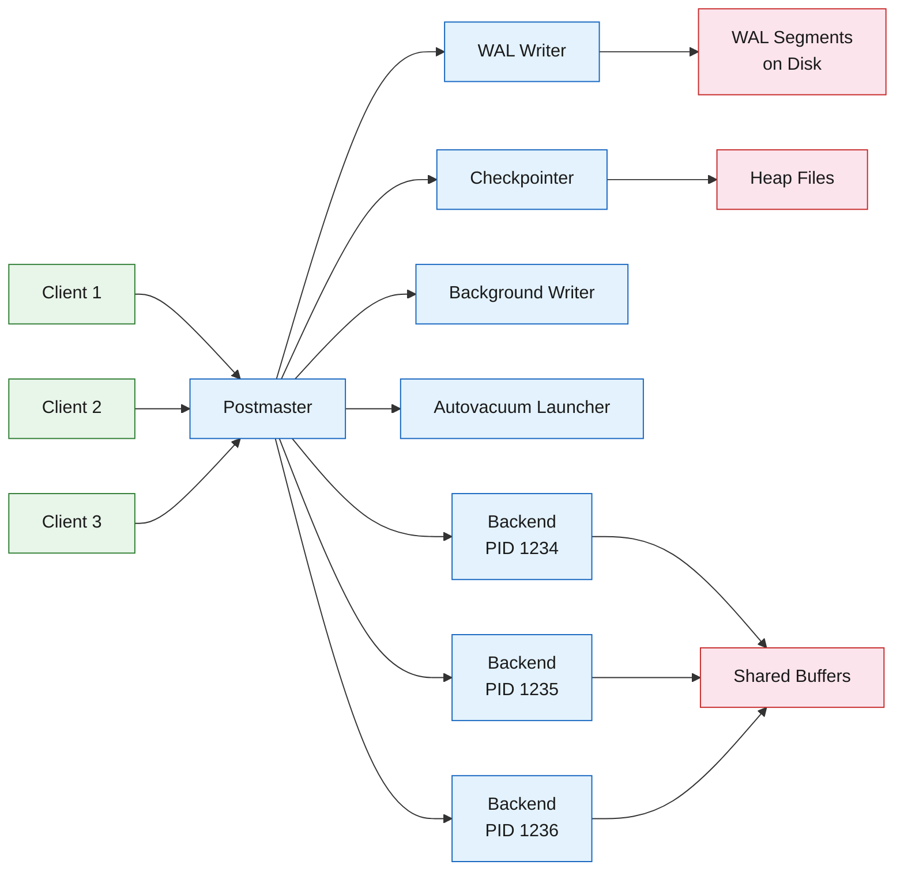
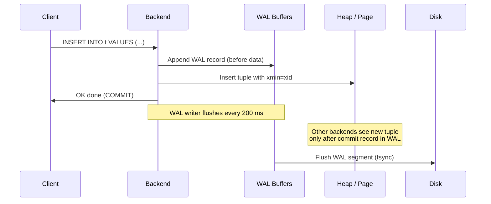

PostgreSQL is a single-node relational database that wins on correctness, extensibility, and community trust.

<!--more-->

## What it is

PostgreSQL is a single-node relational database that wins on correctness, extensibility, and community trust. It gives you ACID transactions, a rich type system (arrays, JSONB, range types, custom types), a planner that can handle 100-join queries, and an extension ecosystem that turns it into a vector database, time-series engine, full-text search engine, or message queue without changing the backend.

> [!TIP]
> **The big idea is MVCC.** Every row carries invisible version-markers (xmin, xmax) that let readers see a consistent snapshot of the database without locking writers. This means your web app can read and write the same table at the same time, and your analytics queries never block your API traffic. The tradeoff is that old row versions accumulate as "dead tuples" and need a background janitor (VACUUM) to reclaim space - a system you must learn to manage or it becomes a production incident.

PostgreSQL started in 1986 at UC Berkeley as POSTGRES, a research project. It went open-source in 1996 and has shipped a stable release every year since. PG 18.4 is current as of May 2026; PG 19 BETA1 landed June 4, 2026.

## Core concepts you use

**Tables and rows live in a heap.** There is no clustered index - rows live wherever INSERT puts them. If you want data physically ordered, you use CLUSTER or an index-organized storage via an extension.

**Every row carries invisible system columns.** xmin (creating transaction), xmax (deleting/updating transaction), and the associated commit counters (cmin, cmax) let the MVCC system decide what a transaction should see. You can query these with SELECT xmin, xmax, ... but usually you do not need to.

**Indexes are optional and secondary.** You choose the access method per index. The default is B-tree (sorted tree, for = / < / > / <= / >= and anchored LIKE). Hash indexes (equality only) are write-optimised but small. GiST handles geospatial and full-text containment (@>, <@). GIN is the multi-value workhorse for JSONB, arrays, and tsvector - fast containment lookups but slower writes. BRIN is the secret weapon for append-only time-series: it stores min/max summaries per block range (default 128 pages), giving you a tiny index that skips most blocks during scans.

**Every table has TOAST.** When a row exceeds ~2 KB, wide columns (text, JSONB, bytea, geometry) are compressed and stored in a separate TOAST table, invisible to you. The 8 KB page limit means wide-row storage is automatic, but fetching TOAST attributes costs an extra page read.

**Extensions are first-class.** CREATE EXTENSION pgvector; installs vector similarity search. CREATE EXTENSION postgis; installs geospatial types. CREATE EXTENSION pg_cron; gives you cron inside the database. Extensions are not sidecars - they declare types, operators, indexes, and background workers that feel native.

**Schemas are namespaces inside a database.** You use them to organize tables, functions, and types. The search_path setting controls schema resolution, like $PATH in a shell.

## How it works (and why you can trust it)

### Process-per-connection model

When a client connects, the postmaster forks a new backend process. That process owns the connection until it disconnects. This is expensive - each idle process consumes ~5-10 MB of RAM - but it means a crash in one connection cannot take down the others. The practical ceiling is ~300 direct connections before you need PgBouncer (transaction pooling).

```text
Client 1 → postmaster → backend PID 1234  (private memory, ~5-10 MB)
Client 2 → postmaster → backend PID 1235
Client 3 → postmaster → backend PID 1236
```

Alongside client backends, the postmaster starts background workers: the checkpointer (fsyncs dirty buffers), the WAL writer (flushes the write-ahead log to disk), the autovacuum launcher (spawns janitors), and the bgwriter (evicts old buffers). All of these share the shared buffer pool via the same buffer management subsystem.



### MVCC and the write path

When you UPDATE a row, PostgreSQL does not overwrite it in place. It marks the original row as dead (sets xmax = current transaction) and inserts a new row version (with xmin = current transaction). Readers that started before your transaction began see the old row - they check xmin/xmax against their snapshot of running transactions. Your transaction sees the new row.

The INSERT path works like this:



The critical detail is that WAL flushing makes the INSERT durable before the heap page even reaches disk. On crash recovery, PostgreSQL replays WAL from the last checkpoint. This is redo-only recovery - there is no undo phase for aborted transactions because aborted tuples are simply marked with a rollback flag in the commit log (pg_xact).

### Why vacuum is not optional

Every UPDATE and DELETE leaves a dead tuple behind. Dead tuples waste space, inflate indexes, and let old transaction IDs accumulate. PostgreSQL has two vacuum modes:

- **VACUUM** (concurrent, lazy): scans pages with dead tuples, makes space reusable, updates the visibility map, freezes old xids. It does NOT shrink the file on disk - space is reclaimed for future inserts within the same table, but the OS file size stays.
- **VACUUM FULL** (exclusive lock): rewrites the entire table into a compact form and shrinks the file. It locks the table, blocking all reads and writes. Use it for the surgical case where you actually need disk space returned to the OS, or after a mass-delete operation.

Autovacuum runs in the background with 3 workers by default. It triggers when a table accumulates 50 dead tuples plus 20% of its row count (autovacuum_vacuum_threshold = 50, autovacuum_vacuum_scale_factor = 0.2). For busy tables, the 20% threshold means autovacuum may not kick in until the table is 20% bloat - tune this down to 5-10% for write-heavy workloads.

The existential threat is **transaction ID wraparound**. PostgreSQL's transaction counter is 32 bits - about 4 billion xids. When the difference between the current xid and the oldest frozen xid (stored in pg_database.datfrozenxid) approaches 2 billion, PostgreSQL enters emergency anti-wraparound mode. Every backend that touches a database with unfrozen xids will stop whatever it is doing and run VACUUM. If vacuum cannot keep up, the database shuts down to prevent data loss. This is the #1 failure mode for unsupervised PostgreSQL deployments at scale.

### WAL replication in three forms

**Physical streaming replication** ships the raw WAL from a primary to one or more standbys. The standby applies each WAL record in continuous recovery mode. In synchronous mode, the primary waits for at least one standby to confirm fsync before acknowledging the COMMIT to the client. This adds ~0.5-10 ms of latency per commit depending on network RTT. In asynchronous mode, the standbys lag behind the primary by at most a few WAL segments (second-scale). Replication slots prevent the primary from recycling WAL segments that a disconnected standby still needs - but the default max_slot_wal_keep_size is -1 (unlimited), meaning one idle subscriber can fill your disk.

**Logical replication** decodes WAL into row-level change sets (INSERT, UPDATE, DELETE) and applies them to a different table or database on the subscriber. It uses a publish/subscribe model. DDL changes are not replicated - schema changes on the publisher must be applied manually on every subscriber, or the subscription will break.

**Cascading replication** lets a standby feed WAL to other standbys, reducing load on the primary.

For production HA, Patroni (8,602 GitHub stars) manages leader election via a distributed consensus store (etcd, Consul, ZooKeeper). Its failsafe_mode prevents split-brain when the DCS partition leaves a leader running without quorum.

## What you build with it

### Transactional web application backend

The most common use: a Django, Rails, or Spring Boot app backed by PostgreSQL. Your ORM handles connections through PgBouncer, and you write raw SQL for the 5% of queries that need it.

The gotcha is that ORMs are generous with connections and even more generous with long-running transactions. A dashboard page that opens a transaction, runs three slow queries, does application logic, and renders a template holds MVCC snapshots open for seconds. This prevents VACUUM from reclaiming dead tuples in any table those queries touched. Set idle_in_transaction_session_timeout = 60000 to kill stragglers.

### Time-series data (with BRIN)

When you append sensor readings, logs, or metrics in chronological order, BRIN indexes are your best friend. A BRIN index on (created_at) stores the min and max value per 128-page block range (~1 MB per range). It is hundreds of times smaller than a B-tree and makes range scans on the time column skip most of the table.

```sql
CREATE TABLE events (
    id bigserial,
    created_at timestamptz NOT NULL DEFAULT now(),
    payload jsonb
) WITH (autovacuum_vacuum_scale_factor = 0.05);

CREATE INDEX idx_events_created_brin
    ON events USING brin (created_at)
    WITH (pages_per_range = 64);
```

BRIN breaks silently if you backfill - inserting old data creates overlapping ranges and the index becomes almost as expensive as a full scan. BRIN is also pointless for UPDATE-heavy tables because moving tuple positions invalidates the range summary.

### JSONB document store

PostgreSQL's JSONB is not a toy. It uses a decomposed binary representation, supports GIN indexing (including path-specific indexes), and can handle workloads that would otherwise need MongoDB.

```sql
CREATE TABLE docs (id bigserial, data jsonb);
CREATE INDEX idx_docs_gin ON docs USING gin (data jsonb_path_ops);

SELECT * FROM docs
WHERE data @> '{"status": "active", "region": "us-east-1"}';
```

The jsonb_path_ops index is smaller and faster than the default jsonb_ops for containment queries (@>). The tradeoff is that it cannot do existence queries (?). Choose jsonb_ops (default) if you need both patterns.

Write throughput on GIN-indexed JSONB is bounded by ~1,000 writes/s per table. Beyond that, the GIN pending list and vacuum overhead start pinning CPU. Batch writes into fewer larger transactions when possible.

### Vector search (with pgvector)

pgvector (22,184 GitHub stars, more than PostgreSQL itself) adds vector similarity search as a native index type. With 2,000 dimensions on the vector type, 4,000 on halfvec, and 64,000 on bit, it covers most embedding use cases. The HNSW index gives you approximate nearest-neighbor search with configurable recall.

```sql
CREATE EXTENSION vector;
CREATE TABLE embeddings (
    id bigserial,
    embedding vector(768)
);
CREATE INDEX ON embeddings USING hnsw (embedding vector_cosine_ops)
    WITH (m = 16, ef_construction = 64);

SELECT * FROM embeddings
ORDER BY embedding <=> '[0.1, 0.2, ...]' -- cosine distance
LIMIT 10;
```

The gotcha is memory: an HNSW graph for 1 million rows at 768 dimensions can consume several gigabytes. If maintenance_work_mem is too small, pgvector emits a NOTICE and the build completes but performance degrades. Set maintenance_work_mem high enough to fit the working graph before building the index.

### Full-text search

PostgreSQL's built-in full-text search (tsvector / tsquery) uses dictionary-based stemming, ranking, and GIN indexes. It handles most single-node search needs without Elasticsearch.

```sql
CREATE TABLE articles (id bigserial, title text, body text);
CREATE INDEX idx_articles_fts ON articles USING gin(
    to_tsvector('english', title || ' ' || body)
);

SELECT title, ts_rank(to_tsvector('english', body), query) AS rank
FROM articles, to_tsquery('english', 'postgresql & performance') query
WHERE to_tsvector('english', title || ' ' || body) @@ query
ORDER BY rank DESC
LIMIT 20;
```

The gotcha is write amplification: every UPDATE to a row with a GIN FTS index rewrites the entire tsvector. For high-write update patterns, consider offloading FTS to Elasticsearch or handling tsvector updates asynchronously.

## Scaling PostgreSQL

### Read scaling with replicas

Read replicas (physical standby nodes) are the standard way to scale reads. You set up streaming replication, and application logic routes SELECT queries to the replica pool. Each standby requires a replication slot and a WAL sender process. The default max_replication_slots and max_wal_senders are both 10, so you can have up to 10 direct standbys (plus cascading, which counts against the sender limit on the node it connects to).

### Write scaling with partitioning

Declarative partitioning (range, list, hash) has been built-in since PG 10. Partition pruning works only on the partition key - a query that does not filter on the partition key scans every partition. Once a table exceeds ~2,000 partitions, planning time degrades noticeably because the planner enumerates each partition.

Partitioning does not give you distributed writes across machines. It is a single-node organisational tool for data lifecycle (DROP PARTITION is faster than DELETE) and for minimising the impact of VACUUM freeze. For horizontal write scaling, you need Citus (distributed PG) or a distributed SQL engine like YugabyteDB or CockroachDB.

### The surprise failure: replication slot disk fill

The most common and most surprising failure in production PostgreSQL is a replication slot consuming all available disk space. This happens when a standby goes offline but its slot is not removed. The primary cannot recycle the WAL segments the slot references (because the standby might come back and need them), so WAL accumulates until the disk fills. The default max_slot_wal_keep_size is -1 (unlimited). Set it:

```text
max_slot_wal_keep_size = 10GB
```

And monitor pg_replication_slots for slots whose restart_lsn has not advanced in hours.

### HA with Patroni

Patroni automates failover. It monitors the primary, promotes a replica when the primary dies, and uses a DCS (etcd, Consul, ZooKeeper) to coordinate. The failsafe_mode option prevents the major split-brain scenario: if Patroni loses DCS connectivity while the primary is still running, it shuts down the primary to guarantee no two nodes accept writes.

For async replication, failover may lose the last few transactions (those in WAL that arrived on the primary but not yet on the standby that becomes the new primary). For zero-loss failover, you need synchronous replication with at least one synchronous standby - but that adds latency on every write.

## When to use / when not to

Great fit:

- Transactional web application backend (standard RDBMS workload, ACID needed, joins expected)
- Single-node analytics on tens of GB to low TB of data (1,600 columns, 32 TB per table, powerful planner)
- Time-series with append-mostly workloads and BRIN indexes
- Mixed workload: JSONB document store + relational joins in the same database
- Vector search for sub-million-scale embedding retrieval (pgvector with HNSW)
- Full-text search for single-node scale

Wrong fit:

- Multi-region writes requiring low latency everywhere (PostgreSQL is a single-primary database; for multi-region writes, use CockroachDB, Spanner, YugabyteDB, or DynamoDB Global Tables)
- Extreme write throughput beyond ~100K writes/s per node (consider ScyllaDB, Cassandra, or sharding with Citus)
- Blob storage beyond a few TB (object storage is cheaper and faster for images, videos, large files; use the 1 GB TOAST limit as a sharp ceiling)
- Real-time streaming with high-throughput change data capture (Debezium on PG works but Kafka with its own log is simpler for pub/sub at scale)
- Embedding-only workloads at 10M+ vectors that fit in memory (dedicated vector databases like Qdrant, Weaviate, Pinecone are more memory-efficient per vector; PG adds ACID overhead you may not need)

Hard limits to know:

| Limit | Value | What breaks |
|---|---|---|
| Relation size | 32 TB (8 KB BLCKSZ) | Per-table; partition for larger |
| Columns per table | 1,600 | Tuple must fit on one 8 KB page |
| Field size | 1 GB | Via TOAST; hard per-column boundary |
| Identifier length | 63 bytes | Table/column/index names |
| Query parameters | 65,535 | Prepared statements |
| Partitions per table | ~2,000 practical | Planning time degrades |
| Connections (direct) | ~300 with no PgBouncer | RAM per connection + process overhead |

## The landscape / editions

PostgreSQL OSS is free (BSD-style license). What you pay for is operations, not the software.

| Edition | What you get | Representative cost |
|---|---|---|
| PostgreSQL OSS (PGDG) | Core engine, all extensions, full control | Free (you manage ops) |
| AWS RDS for PostgreSQL | Multi-AZ, automated backup, PITR, read replicas | db.r6g.xlarge: $329/mo |
| AWS Aurora PostgreSQL | 6-way replicated storage, fast clone, Serverless v2 | db.r6g.xlarge: $493/mo |
| GCP Cloud SQL for PostgreSQL | Auto HA, PITR, cross-region replicas, managed PgBouncer | 4 vCPU: ~$165-330/mo |
| Azure PostgreSQL Flexible | Burstable/GP/MemOpt, Citus integration, geo-backup | GP 4 vCore: $288/mo |
| Supabase | Auth, Realtime, Storage, Edge Functions on PG | Pro: $25/mo (8 GB) |
| Neon | Serverless PG, storage/compute separation, branching, scale-to-zero | Launch: $5/mo (10 GB) |
| Crunchy Bridge | Managed PG on dedicated NVMe, HA, PITR | Hobby-0: $9/mo; Standard-4: $70/mo |
| TimescaleDB (Tiger Data) | Hypertables, native compression, continuous aggregates | $0.177/GB-month |

The hyperscaler editions (AWS, GCP, Azure) support the latest PG version within 30-60 days of upstream GA. The developer-tier platforms (Neon, Supabase, Crunchy Bridge) compete on DX - branching (Neon), Realtime subscriptions (Supabase), and bare-metal performance (Crunchy). For distributed SQL compatibility, YugabyteDB and CockroachDB speak the PostgreSQL wire protocol but use their own storage engines and do not support PG extensions.

## Where it's heading

**PostgreSQL 19 is in beta.** The final release is expected late 2026. Notable features include removal of MD5 authentication (deprecated in PG 18), more parallel query paths, and improvements to logical replication (replicating DDL and sequences).

**pgvector continues to outpace PostgreSQL's own GitHub stars** - it has grown from a side project to the defining PG extension of this decade. The 0.8.x release added halfvec, bit, and sparsevec types. The next frontiers are full multi-vector indexing (ColBERT-style late interaction) and disk-optimised indexes for billion-scale datasets.

**Neon's storage-compute separation is changing expectations.** By putting WAL on object storage (S3-compatible) and attaching compute to ephemeral pageservers, Neon lets you scale to zero when idle and branch the database like code. Expect the hyperscalers to adopt similar architectures in the coming years.

**PostgreSQL as a platform** (Supabase, FerretDB, ParadeDB) is the biggest trend. Rather than running PG as a backend to your app, you run your app as an extension of PG - auth, realtime, file storage, search, and queues all inside or adjacent to the database. This works brilliantly for small-to-mid-size teams and removes the operational overhead of five different services.

**CloudNativePG (8,972 stars) is becoming the default Kubernetes operator** for self-hosted PG. It manages backup, recovery, replication, and rolling updates via Kubernetes CRDs, and is increasingly the choice for organisations that want cloud-level automation without cloud lock-in.

## References

1. [PostgreSQL 18 Documentation](https://www.postgresql.org/docs/18/)
1. [PostgreSQL 18 Limits (Appendix K)](https://www.postgresql.org/docs/18/limits.html)
1. [PostgreSQL 18 Runtime Configuration - Connections](https://www.postgresql.org/docs/18/runtime-config-connection.html)
1. [PostgreSQL 18 Runtime Configuration - WAL](https://www.postgresql.org/docs/18/runtime-config-wal.html)
1. [PostgreSQL 18 Runtime Configuration - Autovacuum](https://www.postgresql.org/docs/18/runtime-config-autovacuum.html)
1. [PostgreSQL 18 Routine Vacuuming](https://www.postgresql.org/docs/18/routine-vacuuming.html)
1. [PostgreSQL 18 WAL Configuration](https://www.postgresql.org/docs/18/wal-configuration.html)
1. [PostgreSQL 18 Logical Replication](https://www.postgresql.org/docs/18/logical-replication.html)
1. [PostgreSQL 18 Table Partitioning](https://www.postgresql.org/docs/18/ddl-partitioning.html)
1. [PostgreSQL 18 Index Types - BRIN](https://www.postgresql.org/docs/18/indexes-brin.html)
1. [PostgreSQL 18 Concurrency Control (MVCC)](https://www.postgresql.org/docs/18/mvcc.html)
1. [pgvector v0.8.5 GitHub Repository](https://github.com/pgvector/pgvector)
1. [Patroni HA Documentation](https://patroni.readthedocs.io/)
1. [TimescaleDB Documentation](https://docs.timescale.com/)
1. [Citus Distributed PostgreSQL](https://github.com/citusdata/citus)
1. [PostgreSQL 18 Security (CVE List)](https://www.postgresql.org/support/security/)
1. [Neon Serverless PostgreSQL](https://neon.tech/)
1. [Supabase Pricing](https://supabase.com/pricing)
1. [Crunchy Bridge Pricing](https://www.crunchydata.com/pricing)
1. [PostgreSQL GitHub Repository](https://github.com/postgres/postgres)
