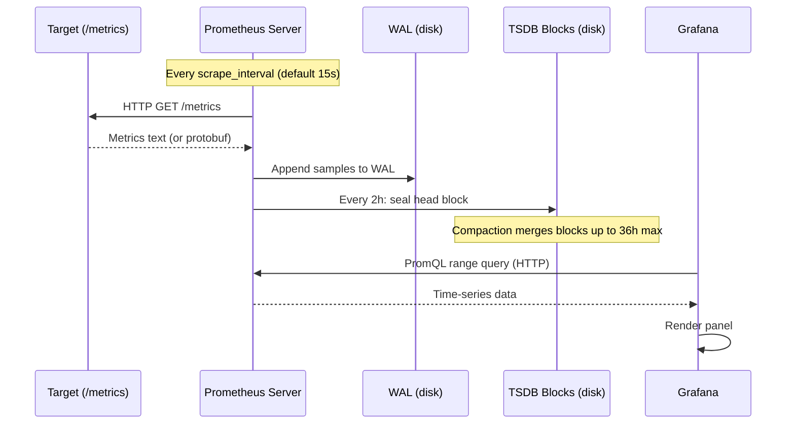
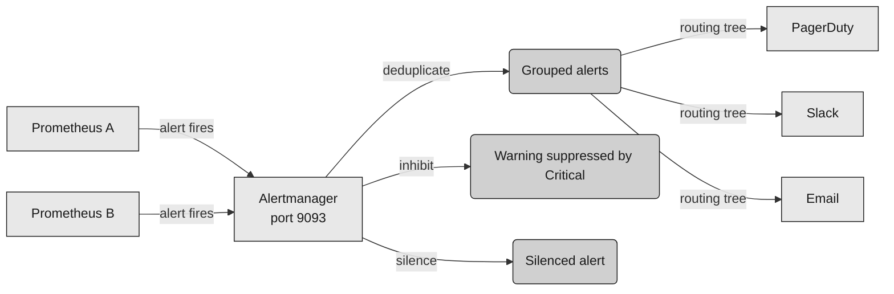

Prometheus is a pull-based monitoring system that scrapes HTTP metrics endpoints on a schedule, stores the data in its own time-series database, and evaluates PromQL queries for dashboards and alerts.

<!--more-->

## What it is

Prometheus is a pull-based monitoring system that scrapes HTTP metrics endpoints on a schedule, stores the data in its own time-series database, and evaluates PromQL queries for dashboards and alerts. Grafana is the visualization layer that connects to Prometheus (and dozens of other datasources) to render dashboards, set up alerting rules, and provide a unified observability interface. Together they form the dominant open-source monitoring stack - Prometheus owns the data ingestion and storage, Grafana owns the user interface. Kubernetes ships with Prometheus metrics out of the box, and most of the cloud-native ecosystem is instrumented for Prometheus.

> [!TIP]
> **The pull model is the defining choice.** Prometheus decides when to scrape each target, on its own schedule. This means it sees exact scrape latency and target health directly - a target that is slow to respond shows up in `prometheus_target_interval_length_seconds` before your pager goes off. It also avoids the monitoring mesh problem: targets do not push to a central collector, so there is no battle over which side controls the send rate, no disk-buffer sizing at every agent, and no hairpin network routing. The tradeoff is that short-lived jobs (batch workers, cron tasks) cannot be scraped in time, which is why Prometheus provides the Pushgateway as an explicit intermediary for those cases.

## Core concepts

These are the primitives you reach for when you build on Prometheus and Grafana:

- **Metric types.** Counter (monotonically increasing, for rates), Gauge (up-and-down values, for current state), Histogram (configurable buckets, for latency distributions), and Summary (pre-computed quantiles, for latency SLOs where you need client-side aggregation). Every metric carries a name and labels.
- **Labels.** Key-value pairs attached to every sample. Labels are the identity of a time series - `http_requests_total{method="POST",handler="/api/orders"}` is a different series from `{method="GET"}`. Labels are how you slice, filter, and aggregate in PromQL.
- **PromQL.** The query language. `rate(http_requests_total[5m])` gives you per-second request rate averaged over 5 minutes. `histogram_quantile(0.99, rate(http_request_duration_seconds_bucket[5m]))` gives you p99 latency. The language is compact and composition-based.
- **Service discovery.** Prometheus discovers targets dynamically through integrations with Kubernetes, Consul, EC2, GCE, DNS, or file-based discovery. Each discovered target gets labels from its environment (pod name, node, namespace) that you can use for routing, filtering, or aggregation.
- **Recording rules.** Pre-computed PromQL expressions stored as new time series. Instead of computing `rate(http_requests_total[5m]) by (service)` on every dashboard load, you compute it every scrape interval and store the result. This is the canonical way to make dashboards fast.
- **Datasources.** Grafana's abstraction over storage backends. Each panel is bound to a datasource - Prometheus, Loki, Tempo, MySQL, CloudWatch, and 100+ others. All queries route through the Grafana server in proxy mode, never directly from the browser.
- **Dashboards and panels.** A dashboard is a JSON model containing panels (charts, tables, stats, logs), variables (dropdown selectors for filtering), annotations (events overlaid on graphs), and time range settings. Each panel fires an independent query - 20 panels means 20 queries to Prometheus.

## How it works

Prometheus is a single binary that simultaneously scrapes targets, writes to its TSDB, evaluates rules, and serves queries. Grafana is a separate service that connects to Prometheus as a datasource and renders dashboards.



**The scrape and write path.** Prometheus runs a scrape loop that ticks every `scrape_interval` (default 15s). For each target in its service-discovery list, it HTTP GETs the `/metrics` endpoint. The response is parsed into samples - a sample is a metric name, a set of labels, a float value, and a timestamp. Samples are appended to the Write-Ahead Log (WAL) on disk for durability, in 128 MB segments. Every two hours, the in-memory head block is sealed to disk as a new ULID-named block directory containing chunks, an index, and metadata. The **compactor** runs in the background merging overlapping blocks into larger ones, up to a maximum block duration of 36 hours. Older blocks are deleted based on retention (default 15 days) or a size limit (`--storage.tsdb.retention.size`). The TSDB in Prometheus 3.x uses a prefix-trie (radix tree) index that improves high-cardinality lookups by an estimated 20-40% over the previous hash-based approach.

**The Prometheus alerting pipeline.** Prometheus evaluates alerting rules as part of its rule evaluation cycle. When a rule fires, it sends the alert to Alertmanager (a separate binary, usually deployed as a HA pair on port 9093). Alertmanager deduplicates identical alerts from HA Prometheus pairs, groups them by configurable keys (alertname, cluster), suppresses warnings when the corresponding critical alert is active (inhibition), applies time-bounded silences, and routes notifications through a tree of matchers to receivers: PagerDuty, Slack, email, OpsGenie, webhooks. The alert is re-notified every `repeat_interval` (default 4 hours) if it persists.



**Grafana query path.** When a dashboard panel loads, Grafana sends a Prometheus range query through its backend proxy to the configured Prometheus server. The proxy handles authentication, CORS, and rate limiting. Prometheus evaluates the PromQL expression against its TSDB and returns a time-series response. Grafana converts the response to a dataframe, applies any configured transformations (join, filter, rename, reduce), and renders the visualization. Grafana has no built-in query cache in the OSS edition - two identical panels on the same dashboard result in two separate Prometheus queries. Enterprise editions add Redis or Memcached caching.

## What you build with it

### Infrastructure monitoring with node_exporter and kube-state-metrics

The most common Prometheus deployment. You install node_exporter on every machine, which exposes CPU, memory, disk, network, and load metrics at standard paths. For Kubernetes, kube-state-metrics exports pod, deployment, service, and node states. Prometheus discovers these targets via Kubernetes service discovery and scrapes them on the standard interval.

```yaml
scrape_configs:
  - job_name: 'kubernetes-pods'
    kubernetes_sd_configs:
      - role: pod
    relabel_configs:
      - source_labels: [__meta_kubernetes_pod_label_app]
        action: keep
        regex: my-app
```

> ⚠️ **Gotcha: default scrape interval of 15s can overwhelm a cluster.** Scraping 500 pods every 15 seconds means 2,000 scrape requests per minute to the cluster. If your Prometheus server is under-dimensioned, scrape failures compound - missed scrapes increase the gap between data points, which makes `rate()` produce unreliable results for short windows. Raise the scrape interval to 30s or 60s for non-critical targets, or use `scrape_timeout` to fail a slow scrape fast instead of blocking the loop.

### Application instrumentation with RED and USE methods

Instrument your own services by exposing an `/metrics` endpoint with the `prometheus_client` library. The established methodology: RED (Rate, Errors, Duration) for user-facing services and USE (Utilization, Saturation, Errors) for infrastructure.

```python
from prometheus_client import Counter, Histogram, start_http_server

REQUEST_COUNT = Counter('http_requests_total', 'Total requests', ['method', 'endpoint', 'status'])
REQUEST_DURATION = Histogram('http_request_duration_seconds', 'Request latency', ['method', 'endpoint'],
                             buckets=[0.01, 0.05, 0.1, 0.5, 1, 2.5, 5, 10])

REQUEST_DURATION.labels(method='GET', endpoint='/orders').observe(0.042)
REQUEST_COUNT.labels(method='GET', endpoint='/orders', status='200').inc()
```

> ⚠️ **Gotcha: cardinality explosion from user-specific labels.** Never put `user_id`, `customer_id`, `email`, `request_id`, `ip_address`, or any unbounded label on a metric. Each unique label value creates a new time series. A label like `user_id` on a `requests_total` metric with 100,000 users means 100,000 series per endpoint per method - and Prometheus stores every series for the full retention period after the user stops making requests. Use a relabel rule with `labeldrop` to strip dangerous labels before they enter the TSDB, or aggregate them via recording rules.

### Custom exporters

When a system does not expose Prometheus metrics natively, you write an exporter - a small HTTP server that probes the target system and translates its state into Prometheus metric format. The Prometheus ecosystem has hundreds of community exporters: Postgres, MySQL, Redis, RabbitMQ, NGINX, HAProxy, JMX, Blackbox (for ping/HTTP/TCP probes), and SNMP.

```bash
# Blackbox exporter probes an external endpoint
curl 'http://blackbox:9115/probe?target=example.com&module=http_2xx'
```

> ⚠️ **Gotcha: exporter scraping can load the target.** A Prometheus scraping a PostgreSQL exporter every 15 seconds means one `SELECT` query per scrape interval on pg_stat_activity, pg_locks, and similar views. A misconfigured exporter running full-table scans on every scrape can crash the database. Always benchmark exporter queries at your scrape interval, and add a `scrape_timeout` that fails fast if the target is slow.

### Dashboard as code with Grafana provisioning

Manage dashboards through YAML files on disk instead of the Grafana UI. This enables GitOps workflows where dashboard changes go through code review, and the dashboard state is always reproducible from version control.

```yaml
apiVersion: 1
providers:
  - name: 'default'
    orgId: 1
    folder: ''
    type: file
    options:
      path: /etc/grafana/provisioning/dashboards
```

```json
{
  "title": "Service Overview",
  "panels": [
    {"title": "Request Rate", "type": "timeseries",
     "targets": [{"expr": "rate(http_requests_total[5m])", "datasource": "Prometheus"}]}
  ]
}
```

> ⚠️ **Gotcha: provisioning vs UI save flapping.** If `allowUiUpdates: true` is set in the provisioning config, a user saving a dashboard via the UI triggers the provisioning sync to regenerate the dashboard from the on-disk JSON every 30 seconds - the user sees their changes disappear. Set `allowUiUpdates: false` for provisioned dashboards, or use Grafana 13+ Git Sync which adds bidirectional sync with PR workflow.

### Multi-cluster federation and global views

When you run multiple Prometheus servers across regions or clusters, federation lets a central Prometheus pull aggregated data from each regional instance via the `/federate` endpoint. The central server selects which time series to pull using the `match[]` parameter.

```bash
scrape_configs:
  - job_name: 'federate'
    scrape_interval: 30s
    honor_labels: true
    metrics_path: '/federate'
    params:
      'match[]':
        - '{job="node",__name__=~"node_cpu_seconds_total|node_memory_MemTotal_bytes"}'
    static_configs:
      - targets: ['us-east-prometheus:9090', 'eu-west-prometheus:9090']
```

> ⚠️ **Gotcha: federation only works with pre-aggregated data.** You cannot federate raw high-cardinality metrics - each unique series from each region is transmitted over the federation link. Central Prometheus also cannot merge HA pair deduplication, handle cross-cluster cardinality merging, or provide long retention of raw data. For true global query views, use Thanos (sidecar + S3/GCS backend) or Grafana Mimir.

## Scaling and availability

**Prometheus is a single-server architecture by design.** It does not scale horizontally on its own. A single Prometheus server on adequate hardware (16-32 cores, NVMe storage) handles roughly 1 million active series at an ingestion rate of 500K-1M samples per second, using about 1-2 KB of RAM per active series. Default retention is 15 days. The hard limits: query timeout at 2 minutes default, max concurrent queries at 20. When you exceed these boundaries, Prometheus will OOM, slow down, or drop remote writes under backpressure.

**The failure that surprises people: label cardinality explosion leading to an OOM death spiral.** This is the single most common Prometheus production failure. A metric with an unbounded label (pod IP, customer ID, user session) generates a new series on every unique value. In Kubernetes, each pod restart creates a new `instance` label - 100 pods with 10 restarts per day and 30 metrics each creates 30,000 dead series per day. These series sit on disk for the full 15-day retention. As the series count climbs, the TSDB index grows, memory consumption increases, and eventually Prometheus OOMs. On restart, Prometheus replays the WAL - which loads all those stale series back into memory - and OOMs again. The mitigation is a combination of `labeldrop` relabeling to strip dangerous labels, `hashmod` relabeling for many-instance services, recording rules to aggregate at scrape time, and `--storage.tsdb.retention.size` as a circuit breaker.

**Scaling beyond a single server: Thanos and Mimir.** Thanos adds a sidecar to Prometheus that uploads blocks to object storage (S3, GCS) and provides a global query layer (Thanos Query) that spans multiple Prometheus instances. It is CNCF Incubating, Apache-2.0 licensed, and vendor-neutral. Grafana Mimir is a fork of the now-maintenance-mode Cortex that provides a horizontally-scalable, multi-tenant Prometheus-compatible backend. Mimir claims support for 1 billion active series (vendor claim), uses a memberlist hash ring for ingester discovery, and is AGPL-3.0 licensed. VictoriaMetrics is a third alternative claiming 7x less RAM and storage versus Prometheus and Thanos (vendor claim, no independent benchmark corroboration).

**Grafana HA is straightforward.** Grafana is stateless - the Grafana server only needs a shared Postgres database for dashboard and user state. Run multiple Grafana replicas behind a load balancer pointing at the same database. The practical limit is roughly 200-500 concurrent users per instance. Grafana enterprise adds Redis caching and session persistence.

**The hot label problem in query performance.** A dashboard with 20 panels each querying 7 days of a high-cardinality metric will result in 20 concurrent Prometheus queries, each scanning millions of series. Without caching (OSS Grafana has none), every dashboard refresh repeats the full load. Recording rules are the canonical solution: pre-compute the expensive query every scrape interval and store the result as a new series.

## When to use it, and when not to

**Great fit:**

- Infrastructure monitoring for VM-based or Kubernetes deployments with standard exporters (node_exporter, kube-state-metrics, cAdvisor)
- Application instrumentation with the RED (Rate/Errors/Duration) method for HTTP services and the USE (Utilization/Saturation/Errors) method for infrastructure resources
- Short-term metric retention (days to weeks) for operational dashboards, alerting, and capacity planning
- Environments where a pull model makes sense - you control the targets and can expose `/metrics` endpoints
- Any cloud-native stack already running Kubernetes, which ships with Prometheus metrics

**Wrong fit:**

- **Prometheus is not a log or trace system.** It ingests numeric time series. If you need full-text search on log text or distributed trace spans, use Loki (logs) or Tempo (traces) - both from the Grafana ecosystem.
- **Long-term storage (months to years).** A single Prometheus server at 1 million series ingests roughly 3-6 TB per year. Use Thanos or Mimir with object storage for cost-effective long-term retention.
- **High-cardinality workloads.** Metrics with millions of unique label combinations (user-level metrics, session-level tracking) will OOM Prometheus. Use a metrics aggregation layer or sample the data before ingestion.
- **Event-based monitoring.** Short-lived jobs that complete before the next scrape cycle are invisible to the pull model. Use the Pushgateway for batch jobs, or consider a push-based system for ephemeral workloads.
- **Hard real-time alerting.** The scrape interval (15s default) plus rule evaluation interval means the minimum detection latency is 15-30 seconds. For sub-second anomaly detection, use a streaming system.

**Hard limits:**

- Active series: ~1 million per single Prometheus server (practical)
- Ingestion rate: ~500K-1M samples/s on 16-32 cores with NVMe
- Default retention: 15 days (configurable)
- Query timeout: 2 minutes default (`--query.timeout`)
- Max concurrent queries: 20 default (`--query.max-concurrency`)
- Staleness lookback: 5 minutes (`--query.lookback-delta`)
- Label cardinality per metric: no hard cap, but ~10,000 distinct values is the practical ceiling before performance degrades

## Editions and landscape

| Edition | License | Type | Key differentiator | Cost |
|---|---|---|---|---|
| Prometheus OSS | Apache-2.0 | Single-server TSDB (v3.13.1) | De facto standard, pull model, PromQL | Free (self-host) |
| Thanos | Apache-2.0 | Sidecar + global S3/GCS view (v0.42.1) | CNCF Incubating, vendor-neutral | Free (self-host) |
| Grafana Mimir | AGPL-3.0 | Scale-out Mimir-compatible (mimir-3.1.3) | Most active fork, 1B series claim | Free (self-host) |
| VictoriaMetrics | Apache-2.0 | Single or cluster (v1.147.0) | Claims 7x efficiency (vendor claim) | Free + Enterprise |
| Grafana Cloud | Commercial | SaaS (powered by Mimir) | Zero-ops, LGTM stack, AI Assistant | $0-$19/mo + usage |
| AWS Managed Prometheus | Commercial | AWS-managed | VPC endpoint, IAM integration | $0.90/10M samples ingested |
| GCP Managed Prometheus | Commercial | GCP-managed | Cheapest cloud option, GKE integration | $0.06/million samples |

**License impact.** Prometheus, Alertmanager, Thanos, and VictoriaMetrics are Apache-2.0 - permissive, no copyleft concerns. Grafana (since v8.0, June 2021), Mimir, Loki, and Tempo are AGPL-3.0 - copyleft applies to network-served derivatives. Most operators are unaffected, but companies shipping modified versions must publish changes.

**One representative cost figure.** At 1 million samples per month on the managed cloud providers: GCP GMP costs ~$60, AWS AMP costs ~$90, and Grafana Cloud Pro at 50K active series runs roughly $349/month. Self-hosting a single Prometheus server costs the hardware (~$200-500/month on cloud VMs) plus operational labor.

## Where it's heading

**Prometheus 3.x (November 2024) was the first major release in seven years.** The headline changes: native histograms (off by default via feature flag, enables histograms without predefined bucket boundaries), an OpenTelemetry metrics ingestion endpoint (`/api/v1/otlp/v1/metrics`), and the prefix-trie index replacing the hash-based TSDB index for high-cardinality lookups. Prometheus 3.x is backward-compatible with existing configuration and TSDB blocks.

**OpenTelemetry compatibility is the defining trend.** Prometheus 3.x can ingest OTel metrics natively. The Prometheus ecosystem is converging with OTel rather than competing - the Prometheus metric format is recognized as an OTel exporter, and the push-based OTLP endpoint survives alongside the pull model. Grafana Alloy (1,962 stars) is Grafana Labs' unified telemetry collector built on the OTel Collector, aiming to replace the separate exporters ecosystem with one Grafana-controlled agent.

**Grafana 13.x (2026) shipped Dynamic Dashboards GA** - a new layout engine with bidirectional Git Sync. The schema is incompatible with Grafana 12 and earlier, meaning a downgrade breaks all dashboards. The Grafana Cloud AI Assistant (at $20/user/month for 40M tokens) adds natural-language query generation and anomaly explanation.

**The persistent debate: pull vs push.** Prometheus's pull model is deeply embedded in the CNCF ecosystem, but the rise of OTel and edge computing (IoT, ephemeral serverless) challenges it. Prometheus 3.x's OTLP ingestion endpoint is a pragmatic compromise - it absorbs push-based workloads without abandoning the pull model that makes Prometheus Prometheus.

## References

1. [Prometheus official documentation - overview](https://prometheus.io/docs/introduction/overview/)
1. [Prometheus official documentation - configuration](https://prometheus.io/docs/prometheus/latest/configuration/configuration/)
1. [Prometheus official documentation - querying basics](https://prometheus.io/docs/prometheus/latest/querying/basics/)
1. [Prometheus official documentation - storage](https://prometheus.io/docs/prometheus/latest/storage/)
1. [Prometheus blog - v3.0 announcement](https://prometheus.io/blog/2024/11/14/prometheus-3-0/)
1. [Alertmanager configuration](https://prometheus.io/docs/alerting/latest/configuration/)
1. [Prometheus federation documentation](https://prometheus.io/docs/operating/federation/)
1. [Grafana official documentation - datasources](https://grafana.com/docs/grafana/latest/datasources/)
1. [Grafana official documentation - provisioning](https://grafana.com/docs/grafana/latest/administration/provisioning/)
1. [Grafana whats new in v13.0](https://grafana.com/docs/grafana/latest/whatsnew/whats-new-in-v13-0/)
1. [Grafana whats new in v13.1](https://grafana.com/docs/grafana/latest/whatsnew/whats-new-in-v13-1/)
1. [Grafana Cloud pricing](https://grafana.com/pricing/)
1. [AWS Managed Prometheus pricing](https://aws.amazon.com/prometheus/pricing/)
1. [GCP Managed Prometheus pricing](https://cloud.google.com/stackdriver/pricing)
1. [CNCF Prometheus project page](https://www.cncf.io/projects/prometheus/)
1. [CNCF Thanos project page](https://www.cncf.io/projects/thanos/)
1. [Prometheus GitHub repository](https://github.com/prometheus/prometheus)
1. [Grafana GitHub repository](https://github.com/grafana/grafana)
1. [Grafana Alloy](https://github.com/grafana/alloy)
1. [prometheus_client library](https://github.com/prometheus/client_python)
