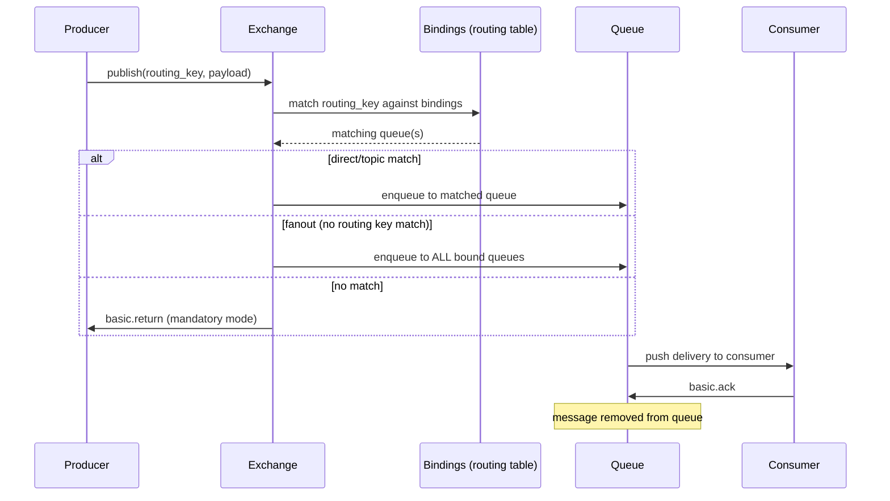

RabbitMQ is a message broker implementing the AMQP 0-9-1 protocol. Think of it as an in-memory forwarding engine with optional persistence: producers publish messages to exchanges, exchanges use bindings to route messages to queues, and consumers pull or get pushed messages from those queues.

<!--more-->

## What is RabbitMQ?

RabbitMQ is a message broker implementing the AMQP 0-9-1 protocol. Think of it as an in-memory forwarding engine with optional persistence: producers publish messages to exchanges, exchanges use bindings to route messages to queues, and consumers pull or get pushed messages from those queues. Unlike Kafka's append-only log (optimized for replay and streaming), RabbitMQ optimizes for flexible routing, selective delivery, and near-real-time work distribution. It was first released in 2007 by Rabbit Technologies (acquired by VMware/Pivotal in 2010, now part of Broadcom) and has become the default message broker for services that need to decouple producers from consumers without replaying entire streams.

> **Design insight:** RabbitMQ's core bet is that routing should be programmable. Instead of producers knowing which consumer gets a message, a producer only knows the exchange and routing key. The exchange, bindings, and queue topology define where the message goes. This lets ops teams reshuffle consumer topology - add new consumers, split queues, route to different data centers - without touching producer code. The exchange-binding indirection is what makes RabbitMQ a broker, not just a queue.

## Core Concepts

**Exchanges** are the entry point. A producer never writes to a queue directly; it publishes to an exchange with a routing key. The exchange type determines how routing happens:

- **Direct** - exact routing key match. The simplest: `routing_key = "order.created"` reaches queues bound with `"order.created"`.
- **Topic** - wildcard matching with `*` (one word) and `#` (zero or more words). `"order.*.created"` matches `"order.eu.created"` but not `"order.eu.payment.created"`. The routing table is trie-based for efficient matching.
- **Fanout** - broadcasts to every bound queue, ignoring the routing key entirely. O(1) per queue regardless of binding count.
- **Headers** - matches on message header key-value pairs, not routing key. Rarely used; topic exchanges cover most header-based use cases with simpler semantics.

**Queues** are ordered collections of messages (FIFO within a single consumer). Key properties: durable (survives restart) vs transient (lost on restart), exclusive (auto-deleted when the declaring connection closes), auto-delete (deleted when last consumer cancels). Queue names are up to 255 bytes of UTF-8 characters, and names starting with `amq.` are reserved.

**Bindings** are the glue. A binding connects an exchange to a queue with a routing key pattern. Multiple bindings can route to the same queue; a single binding can use `#` to match all routing keys. The routing table lives on each exchange, and rebinding is instant - no queue drain needed.

**Channels** are lightweight multiplexed connections over a single TCP socket. A client opens one TCP connection and creates multiple channels (default limit 2047, configurable via `channel_max`) for concurrent publishing and consuming without the overhead of separate TCP sockets. Each channel is logically independent: a channel error doesn't affect other channels on the same connection.

**Virtual Hosts (vhosts)** provide namespace isolation within a single RabbitMQ node. Separate vhosts have separate exchanges, queues, bindings, users, and permissions. A single RabbitMQ cluster can serve multiple applications or environments without shared artifacts.

## How RabbitMQ Works

The AMQP 0-9-1 write path is a chain of four hops, each with a specific responsibility:



RabbitMQ is built on **Erlang/OTP** using the actor model. Every queue is an independent Erlang process with its own mailbox, state, and GC. This means:

- A single slow queue cannot block other queues at the process level (credit-based flow control propagates backpressure separately).
- Queue-to-queue isolation is baked into the runtime: a heavy GC pause on one queue doesn't stop a neighbor.
- The Erlang VM's preemptive scheduler means no queue can monopolize a core.

**Metadata** lives in a Raft-based Khepri store (as of RabbitMQ 4.3.0, replacing the old Mnesia-based store). Exchange definitions, queue declarations, bindings, users, and permissions are stored in Khepri across the cluster. Actual message data is in per-queue data files on disk or in the Erlang process memory.

**Consumer dispatch** defaults to round-robin across competing consumers. With prefetch (`basic.qos`), a consumer receives up to N unacknowledged messages before RabbitMQ stops sending. This prevents fast consumers from being starved by slow ones in a competing-consumers setup.

## What You Build with RabbitMQ

### Task Queue (Work Queues)

The canonical pattern: multiple workers consume from a single queue, each picking off one message at a time. RabbitMQ distributes messages in round-robin by default.

```python
# Consumer: worker with prefetch=1
channel.basic_qos(prefetch_count=1)
channel.basic_consume(queue='task_queue', on_message_callback=callback)
channel.start_consuming()
```

> **Production gotcha:** Round-robin dispatch assumes all messages take the same processing time. If one task takes 10s and another 1s, workers get uneven load. Set `prefetch_count=1` so a worker gets at most one unacked message at a time - RabbitMQ only hands a worker a new message after the previous one is acked. This keeps all workers equally busy regardless of task duration.

### Pub/Sub (Broadcast)

A fanout exchange broadcasts every message to all bound queues. Each consumer gets its own queue (often auto-deleted, exclusive), so they all see every message.

```python
channel.exchange_declare(exchange='logs', exchange_type='fanout')
result = channel.queue_declare(queue='', exclusive=True)
channel.queue_bind(exchange='logs', queue=result.method.queue)
```

> **Production gotcha:** Fanout exchanges with many queues (100+) create 100x message duplication. Memory usage scales linearly with bound queue count. If different consumers need different subsets of messages, use topic exchanges instead.

### Routing

Topic exchanges let you route by event category. A producer publishes with a routing key like `"order.eu.created"`, and consumers bind with patterns like `"order.#"` (all orders) or `"order.eu.*"` (EU orders only).

```python
# Producer
channel.basic_publish(exchange='orders', routing_key='order.eu.created', body=msg)
# Consumer: EU orders only
channel.queue_bind(exchange='orders', queue=my_queue, routing_key='order.eu.*')
```

> **Production gotcha:** Topic exchange routing uses a trie, so binding count impacts throughput at high volume (~50K+ msg/s). Each incoming message traverses the trie for every matching binding. At 100K msg/s with 1000 bindings, expect measurable CPU overhead on the exchange Erlang process.

### RPC (Request-Reply)

RabbitMQ natively supports the RPC pattern: the client creates a callback queue, publishes with `reply_to` and `correlation_id`, and waits for a response on the callback queue.

```python
# Client
result = channel.queue_declare(queue='', exclusive=True)
channel.basic_publish(exchange='', routing_key='rpc_queue',
    properties=pika.BasicProperties(
        reply_to=result.method.queue,
        correlation_id=str(uuid.uuid4())
    ), body=request)
```

> **Production gotcha:** A single callback queue shared by multiple clients still works (the `correlation_id` disambiguates responses), but if one consumer is slow on the callback queue, all clients wait. Use a per-client callback queue or a dedicated callback exchange at high volume.

### Priority Queues

Classic queues with `x-max-priority` (0-255, but 2-4 recommended) maintain an internal sub-queue per priority level. Inside each level, messages are FIFO. Quorum queues in 4.3+ have priority always enabled at 32 levels (0-31) using **strict priority ordering**: higher-priority messages are always delivered before lower-priority ones, and a sustained stream of high-priority messages can starve lower-priority messages indefinitely. (Pre-4.3 classic queues used a 2:1 dispatch ratio across two internal buckets; quorum queues do not interleave.)

```python
args = {"x-max-priority": 3}
channel.queue_declare(queue='priority_queue', arguments=args)
channel.basic_publish(exchange='', routing_key='priority_queue',
    properties=pika.BasicProperties(priority=2), body=msg)
```

> **Production gotcha:** Each priority level adds in-memory overhead per queue. Using 255 levels on 10,000 queues is 2.55M sub-queues. Use 2-4 levels. Head-of-line blocking also occurs: if a low-priority message reaches the head during consumer prefetch drain, higher-priority messages behind it wait.

### Delayed Messages

Two approaches: (a) per-message TTL on a queue with a Dead Letter Exchange (official, documented), and (b) the `rabbitmq_delayed_message_exchange` plugin (community-maintained). The TTL+DLX approach has head-of-line blocking: a message with 10s TTL ahead of one with 1s TTL must expire first.

```python
# TTL+DLX approach: message expires in queue, routes to DLX
args = {
    "x-message-ttl": 10000,         # 10 seconds
    "x-dead-letter-exchange": "delayed_processing"
}
channel.queue_declare(queue='delay_queue', arguments=args)
```

> **Production gotcha:** The `rabbitmq_delayed_message_exchange` plugin avoids head-of-line blocking but holds ALL delayed messages in-memory on a single node. If that node crashes, all pending delayed messages are lost. The plugin is not replicated and not part of RabbitMQ core. For production at scale, the TTL+DLX approach with separate queues per TTL bucket is safer.

### Dead Letter Queues

Messages are republished to a Dead Letter Exchange on four events: (1) `basic.reject`/`basic.nack` with `requeue=false`, (2) per-message TTL expiry, (3) queue length limit exceeded, (4) delivery-limit exceeded (quorum queues only, default 20 in 4.0+).

```python
args = {
    "x-dead-letter-exchange": "dlx_main",
    "x-dead-letter-routing-key": "dead"
}
channel.queue_declare(queue='main_queue', arguments=args)
```

> **Production gotcha:** An infinite DLQ loop happens when a dead-lettered message routes back to the original queue - it gets rejected again, cycles back, and saturates the node. Always configure a TTL on the DLQ (via `x-message-ttl`) so dead messages eventually expire. With quorum queues, the `delivery-limit` cap (default 20) provides a natural circuit breaker.

### Streams

RabbitMQ Streams (3.9+, enhanced in 4.x) are append-only logs modeled on Kafka's design, bypassing AMQP 0-9-1 overhead entirely. They use a single-file-per-segment on-disk format (default segment size 500MB) with Bloom filters for offset-based lookups (16-255 byte filters). Unlike queues, streams are non-destructive: multiple consumers read the same message at different offsets.

> **Production gotcha:** Streams trade latency for throughput. A queue delivers in microseconds; a stream delivers in milliseconds. Streams also use more disk (they keep compacted segments) and have a different management surface (no management UI auto-refresh for stream metrics in some versions). Use streams for event sourcing and replay; use classic/quorum queues for work distribution.

## Scaling and Availability

**Memory Watermark Flow Control** is the single most surprising gotcha in production RabbitMQ. The `vm_memory_high_watermark` defaults to 0.6 (60% of available RAM). When exceeded, ALL publishing connections on ALL cluster nodes are blocked. Consumers continue to receive and ack, but no new messages can be published anywhere in the cluster. This is not a local node throttle - it is cluster-wide.

> **Critical gotcha:** The watermark does NOT prevent OOM. It is a throttle point, not a memory cap. The Erlang VM can be OOM-killed by Linux if memory grows past physical RAM before the watermark alarm propagates. In containerized environments (K8s), use an absolute value (`vm_memory_high_watermark.absolute = 4GB`) instead of relative. The cascade pattern: one slow consumer fills its queue -> queue memory grows -> watermark breached -> all publishers blocked cluster-wide. Mitigation: set per-queue max-length, use TTL, monitor queue depth.

**Disk Free Limit** (`disk_free_limit`, default 50 MB) is a HARD stop. When free space drops below the limit, ALL producers are blocked cluster-wide. Unlike the memory watermark (where consumers keep working), the disk alarm blocks new publications entirely while allowing consumers to drain in-flight messages. Checked every 10 seconds normally, up to 10 times per second near the limit.

> **Critical gotcha:** 50 MB is dangerously low for production. Transient messages paged to disk under memory pressure can exhaust 50 MB between 10-second checks. Set `disk_free_limit.absolute` to at least the amount of installed RAM.

**Clustering** in RabbitMQ 4.3+ is Raft-based throughout. The old Mnesia metadata store and partition handling strategies (`pause_minority`, `autoheal`, `ignore`) have been removed. Khepri (Raft-based) manages all cluster metadata. Quorum queues and streams were already Raft-based. The adaptive failure detector (Aten library) replaces TCP heartbeats for faster, more accurate node failure detection.

**Quorum Queues** are the production default since 4.0. They replace classic mirrored queues with a Raft-based consensus approach:

- 3 replicas = tolerates 1 failure; 5 replicas = 2 failures; 7 replicas = 3 failures.
- 2-node cluster = 0 fault tolerance (no majority possible without a tiebreaker).
- Delivery-limit (default 20) breaks the infinite-redelivery problem that classic queues had.

**Cluster Partition Modes** (pre-4.3) are gone. In 4.3+, a cluster that loses quorum goes down and requires operator intervention to restart with a surviving majority. There is no autoheal or pause_minority mode anymore - the design philosophy is that a split cluster should halt, not serve inconsistent data.

**Cluster size recommendation:** 3-7 nodes, always odd. A single node is fine for dev; 2 nodes provide zero fault tolerance (minority cannot form a quorum). Beyond 7 nodes, write throughput degrades from the added Raft consensus overhead on metadata operations.

## Durability and Consistency

RabbitMQ has a nuanced durability model, often misunderstood because of the single word "persistent" appearing in different contexts.

**Durable queues** survive server restarts. The queue metadata (name, bindings, arguments) is persisted. **Transient queues** are gone after a restart. A durable queue does NOT imply all messages survive - message durability is a separate setting.

**Persistent messages** (set `delivery_mode=2` or `pika.BasicProperties(delivery_mode=pika.spec.PERSISTENT_DELIVERY_MODE)`) are written to disk via write-ahead logging before the broker confirms receipt. Non-persistent messages live only in memory (or paged to disk under memory pressure with classic queue v2). A broker crash while publishing persistent messages may lose messages that were in-flight but not yet fsynced.

**Publisher Confirms** are the production-grade durability mechanism. The channel enters confirm mode (`channel.confirm_delivery()`), and RabbitMQ sends a `basic.ack` to the publisher after the message has been routed to all matching queues and (for persistent messages) written to disk. This gives you at-least-once delivery semantics:

- Publisher publishes -> waits for confirm -> knows message is safe.
- Publisher publishes -> connection drops before confirm -> publisher re-publishes (may produce duplicates downstream).
- Use de-duplication on the consumer side or idempotent processing to handle the duplicates.

**Consumer Acknowledgements** replace the non-existent "visibility timeout" (that is an SQS concept). When RabbitMQ delivers a message to a consumer, it becomes "unacked" in the queue. The consumer must explicitly acknowledge:

- `basic.ack` - message processed successfully, permanently removed.
- `basic.nack` with `requeue=true` - message returned to queue for re-delivery (may go to another consumer).
- `basic.nack` with `requeue=false` - message dead-lettered or discarded.
- `basic.reject` - same as nack but for a single message.

If a consumer disconnects without acking, all its unacked messages are re-queued for delivery to another consumer. This is NOT a visibility timeout - there is no time budget; the broker only counts on the consumer's connection liveness.

**At-least-once vs at-most-once delivery:**

- At-most-once: publish with no confirms, consumer auto-acks before processing. Fast but a crash between auto-ack and actual processing loses the message.
- At-least-once: publisher confirms + consumer acks after processing. A crash between processing and ack causes re-delivery. This is the production default and the safest mode.
- Exactly-once: not supported across broker boundaries. The closest you get is idempotent consumers on top of at-least-once delivery.

**Ordering Guarantees:** RabbitMQ guarantees FIFO ordering WITHIN a single queue with a single consumer. Ordering breaks with:

- Multiple consumers on the same queue (competing consumers redistribute messages).
- Priority queues (higher-priority messages skip ahead).
- Delayed messages (TTL expiry reorders).
- Consumer disconnect/reconnect (unacked messages are re-queued at the head).

If ordering matters, use one consumer per queue or partition by key across multiple queues.

## When to Use RabbitMQ - And When Not To

**Great fit:**

- You need flexible routing (topic, direct, fanout) that the producer should not know about. Exchange-binding indirection lets ops reshuffle without touching producer code.
- You need work distribution across workers with varying capacity. Prefetch-based dispatch keeps all workers busy regardless of individual task duration.
- You need a drop-in message broker with broad language support. AMQP 0-9-1 clients exist for every major language, and most are mature, well-maintained, and documented.
- You need per-message routing decisions (headers-based routing, TTL-per-message, priority-per-message).
- You need DLQ semantics for failed messages (TTL expiry, rejection, delivery-limit).
- You need a single-node message broker for moderate throughput (<50K msg/s) with minimal operational overhead.

**Wrong fit:**

- You need to replay messages from hours or days ago. RabbitMQ queues are consumptive: once acked, the message is gone. Streams add replay but at higher latency (milliseconds vs microseconds) and with different management surfaces. Kafka is the replay tool.
- You need exactly-once delivery across producer-consumer boundaries. RabbitMQ cannot prevent duplicates during publisher or consumer failures. You must build idempotency at the application layer.
- You need to store billions of messages in queues. RabbitMQ queues are not designed as a storage system. Extended queue growth degrades performance (disk I/O, management UI, memory pressure).
- You need global ordering across multiple queues. Each queue is independent. Cross-queue ordering is not guaranteed.
- You need throughput above 150K persistent msg/s on a single node. The single-queue process becomes a bottleneck. Partitioning into multiple queues or using Streams helps, but Kafka and Pulsar handle higher throughput with less operational effort at scale.
- You need geo-distributed replication. RabbitMQ clustering assumes low-latency LAN links. Cross-region clustering causes frequent leader elections and aborted writes. Use Shovel (WAN-aware, configurable reconnection) or Federation for cross-region, not native clustering.

**Compared to Kafka and Pulsar:** RabbitMQ is a broker, not a log. Kafka gives you message replay, higher sustained throughput, and stronger ordering guarantees within a partition, but at the cost of more complex topology (partitions, consumer groups, offset management) and no per-message routing. Pulsar combines a log with a broker layer but adds JVM overhead and operational complexity. RabbitMQ is the simplest to operate at moderate scale - a single node with a few queues handles most backend workloads without needing a cluster.

## Landscape and Editions

| Edition | License | Operator | What It Adds | Cost | Best For |
|---|---|---|---|---|---|
| OSS RabbitMQ | MPL 2.0 | Self-hosted | The full broker, no feature gating | Infra cost only (EC2, EBS) | Full control, in-house ops |
| VMware Tanzu RabbitMQ | Commercial | Broadcom | 24/7 support, warm-standby federation, multi-site clustering, schema validation, JMS queues | ~$10K+/yr/cluster [citation needed] | Enterprise SLA, compliance |
| CloudAMQP | Hosted | 84codes AB | Zero-infra setup, VPC add-on ($99/mo), dedicated instances | $19/mo (10M msgs, shared) [source stale: Jun 2024] | Small teams, fast start |
| Amazon MQ for RabbitMQ | Hosted | AWS | AWS-native (VPC, IAM, CloudWatch, Multi-AZ), EBS storage | $0.288/hr (~$207/mo) m5.large single | AWS shops, Multi-AZ |
| Alibaba Cloud RMQ | Hosted | Alibaba | APAC/China region presence | Contact sales | APAC workloads |

OSS RabbitMQ and VMware Tanzu are the same binary - Tanzu adds a support contract and commercial-only features (warm-standby federation, multi-site clustering, schema validation, JMS queues). CloudAMQP offers both RabbitMQ and their in-house LavinMQ (Crystal-language AMQP broker) on shared plans. Amazon MQ runs RabbitMQ 3.x on EBS-only storage (no local NVMe) with m7g Graviton instances ~5% cheaper than m5 Intel.

## Where It's Heading

RabbitMQ 4.3.2 (June 2026) marked the final removal of Mnesia and legacy partition handling strategies - a clean break from the pre-4.x architecture. The near-term roadmap centers on three themes:

**Khepri maturity.** The Raft-based metadata store replaced Mnesia in 4.3.0, and subsequent releases have focused on stability and observability. Expect improved Khepri metrics in the management API (leader term, commit latency, snapshot size) and better tooling for inspecting Khepri state during cluster recovery.

**Quorum queue adoption as default.** With classic queues still available (including classic v2 which auto-pages to disk), the recommendation from the RabbitMQ team continues to shift toward quorum queues for production workloads. Quorum queues get Raft-based consensus, delivery-limit, priority, and sub-second recovery at 10M messages. Classic queues are maintained for compatibility but receive fewer new features.

**Streams ecosystem growth.** Streams (introduced in 3.9, enhanced in 4.x) are being positioned as the RabbitMQ-native answer to Kafka use cases. The Streams protocol is a separate AMQP 1.1-based protocol (super-streams, filtering, offset-tracking). Expect better management UI support for streams, expanded client library support (Super Streams partitioning in more languages), and performance optimization (Bloom filter tuning, segment compaction).

**Community health.** RabbitMQ has 13,746 GitHub stars and 4,018 forks with 251 open issues. The project is actively maintained by Broadcom with regular quarterly releases. Erlang/OTP 27.0 is the minimum for RabbitMQ 4.x. The RabbitMQ website docs are Apache 2.0 licensed and actively updated. After the Broadcom acquisition, the project has maintained its OSS release cadence and the Tanzu commercial layer provides the revenue model for sustained engineering investment.

**Cloud adoption.** Amazon MQ for RabbitMQ continues to be the primary managed path for AWS shops, though it runs RabbitMQ 3.x (not yet 4.x) on EBS-only storage. CloudAMQP remains the independent managed option with newer RabbitMQ versions. Expect AWS to add RabbitMQ 4.x support as the 4.x ecosystem stabilizes.

## References

1. [RabbitMQ Documentation - Exchanges](https://www.rabbitmq.com/docs/exchanges)
1. [RabbitMQ Documentation - Queues](https://www.rabbitmq.com/docs/queues)
1. [RabbitMQ Documentation - Memory](https://www.rabbitmq.com/docs/memory)
1. [RabbitMQ Documentation - Disk Alarms](https://www.rabbitmq.com/docs/disk-alarms)
1. [RabbitMQ Documentation - Partitions](https://www.rabbitmq.com/docs/partitions)
1. [RabbitMQ Documentation - Dead Letter Exchanges](https://www.rabbitmq.com/docs/dlx)
1. [RabbitMQ Documentation - TTL](https://www.rabbitmq.com/docs/ttl)
1. [RabbitMQ Documentation - Priority Queues](https://www.rabbitmq.com/docs/priority)
1. [RabbitMQ Documentation - Networking](https://www.rabbitmq.com/docs/networking)
1. [RabbitMQ GitHub Repository](https://github.com/rabbitmq/rabbitmq-server)
1. [RabbitMQ GitHub Releases](https://github.com/rabbitmq/rabbitmq-server/releases)
1. [RabbitMQ Streams Documentation](https://www.rabbitmq.com/docs/streams)
1. [CloudAMQP Pricing (Wayback 2024-06-15)](https://web.archive.org/web/20240615000000/https://www.cloudamqp.com/plans.html)
1. [AWS Amazon MQ Pricing](https://aws.amazon.com/amazon-mq/pricing/)
1. [Apache AMQP 0-9-1 Specification](https://www.amqp.org/resources/specifications)
