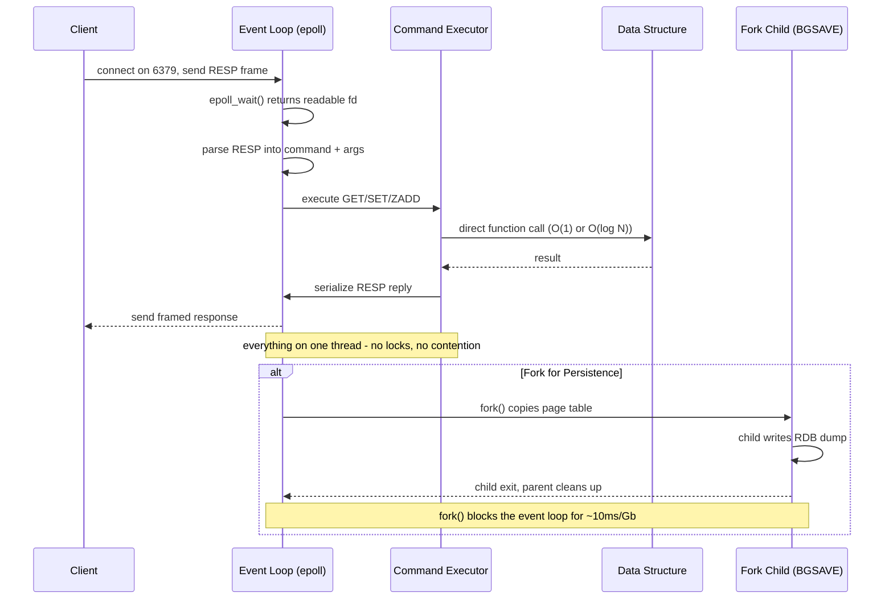
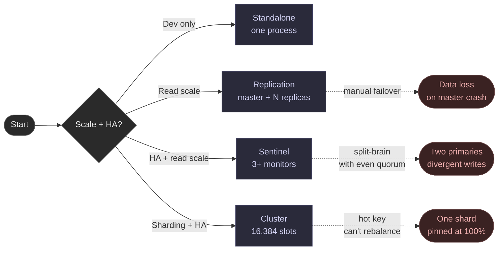

Redis is an in-memory key-value store where every command runs on a single thread and the entire server is a hash table of keys mapped to data structures. There is no query optimizer, no transaction manager, no buffer pool. A command is a direct function call against the structure in memory.

<!--more-->

## What It Is

Redis is an in-memory key-value store where every command runs on a single thread and the entire server is a hash table of keys mapped to data structures. There is no query optimizer, no transaction manager, no buffer pool. A command is a direct function call against the structure in memory.

> The one design choice that explains Redis. Single-threaded event loop + in-memory data + rich data structures = simple, fast, and predictable by construction. Every operation is atomic because there is no interleaving. The cost is that a single slow command blocks the entire server. Redis is designed so every operation is O(1) or O(log N); the one blocking operation (fork for persistence) runs in a child process.

Most teams start with Redis as a cache and stay for the data structures: sorted sets for leaderboards, streams for event logs, geospatial indexes for proximity search. The hard part is not learning the API; it is internalizing that Redis trades durability and horizontal scale for consistent single-digit-millisecond latency, and that you must design around what cannot be rebalanced (a hot key on one shard).

## The Core Concepts You Use

Redis gives you more than key-value pairs. The value type defines what you can do with it, and the complexity model is explicit.

| Data Structure | Key Operations | Complexity | What You Build With It |
|---|---|---|---|
| String | GET, SET, INCR | O(1) | Cache entries, counters, session tokens, distributed locks |
| Hash | HGET, HSET, HGETALL | O(1) / O(N) on HGETALL | User profiles, objects, any struct you would store as JSON |
| List | LPUSH, BRPOP, LRANGE | O(1) head/tail / O(N) range | Queues, work queues, recent-items lists, chat history |
| Set | SADD, SISMEMBER | O(1) | Tags, deduplication, access-control groups |
| Sorted Set | ZADD, ZRANK, ZREVRANGE | O(log N) | Leaderboards, rate-limiter sliding windows, proximity indexes |
| Stream | XADD, XREADGROUP, XRANGE | O(1) append / O(log N) range | Event sourcing, message queues with consumer groups, audit logs |
| Geospatial | GEOADD, GEOSEARCH, GEODIST | O(log N) | Proximity search, location-based ranking, delivery radius queries |
| Bitmap | SETBIT, GETBIT, BITCOUNT | O(1) / O(N) BITCOUNT | Feature flags, daily-active-user rollups, bloom-like presence |
| HyperLogLog | PFADD, PFCOUNT | O(1) | Approximate unique counts of billions of events (0.81% error) |
| Array (8.8+) | ARRGET, ARRSET, ARRSUM | O(1) random access | Real-time anomaly detection, contiguous-index data |

Every key maps to one of 16,384 hash slots via CRC16 mod 16384. Hash tags like `{user:1000}:profile` force related keys into the same slot, which is required for multi-key operations in Cluster mode.

Memory optimization that matters: a hash with 100 elements takes about 1.7 MB versus 11 MB for 100 separate string keys (roughly 6.5x savings), because small hashes use compact listpack encoding. The thresholds are configurable: `hash-max-listpack-entries 512`, `hash-max-listpack-value 64`.

## How It Works (and Why It's Fast)

Redis runs a single-threaded event loop using I/O multiplexing (epoll on Linux, kqueue on macOS). Client connections, command parsing, execution, and reply serialization all happen on one thread. I/O threads (Redis 6+) offload network read and write to separate cores, but command execution stays on the main thread.



**The protocol.** RESP (Redis Serialization Protocol) is a framed text format. Simple strings start with `+OK`, bulk strings with `$6\r\nfoobar\r\n`, arrays with `*N`. RESP2 was the standard through Redis 5. RESP3 (Redis 6+, opt-in via `HELLO 3`) adds typed replies (maps, sets, booleans, null) so clients no longer guess types from the wire format.

**The single-threaded implication.** No locks means no contention, no context-switch overhead, and no concurrency bugs in the core path. It also means the entire server stalls on one slow command. Production Redis demands SLOWLOG monitoring (`SLOWLOG GET 10` catches p99 spikes) and setting `lua-time-limit` to 1000ms (default 5000ms is too generous for a blocking script).

**Lua scripting.** Embedded Lua 5.1 runs inside the event loop thread. Scripts are atomic by construction: no other command runs while a script executes. The sandbox is not a security boundary (CVEs have demonstrated RCE through Lua). Treat EVAL as trusted code only.

## What You Build With It

### Caching (the canonical case, with the hot-key surprise)

Cache-aside is the pattern: `GET key` on miss, fetch from DB, `SET key value EX TTL`. The SET with EX and NX has been atomic since Redis 2.6.12.

```bash
GET user:1000:profile
> (nil)
SET user:1000:profile '{"name":"alice"}' EX 300 NX
> OK
```

**Its one gotcha: the hot key.** A single key that gets 80% of traffic lands on exactly one hash slot, one shard, one core. That core pins at 100%. Cluster mode cannot rebalance a single key. Mitigations: (a) key sharding on the client side (write to `key:0` through `key:99`, read from a random sub-key), (b) client-side cache (Caffeine, Guava), (c) read replicas with READONLY mode.

**The thundering herd.** When a hot key expires, N concurrent requests all miss and hammer the DB simultaneously. Mitigations: probabilistic early expiration at TTL x 0.9 (stale-while-revalidate), SET NX mutex so only one client warms the cache, or never expire truly hot keys.

### Distributed Locks (SET NX, Lua, and the Kleppmann debate)

`SET key value NX PX 30000` creates the key only if it does not exist, with a 30-second TTL. Release uses a Lua script that checks ownership before DEL, preventing a client from deleting another client's lock.

```bash
SET lock:payment:1000 "e8a2f9" NX PX 30000
> OK
EVAL "if redis.call('GET', KEYS[1]) == ARGV[1] then redis.call('DEL', KEYS[1]) return 1 else return 0 end" 1 lock:payment:1000 "e8a2f9"
```

**Its one gotcha: timing assumptions break under pauses.** Martin Kleppmann's 2016 critique shows that a GC pause on the lock holder can cause a lease to expire, a second client acquires the lock, and the first resumes thinking it holds it. Redlock (acquiring on a majority of N independent nodes, typically 5) inherits the same timing sensitivity. The robust fix is fencing tokens: a monotonically increasing counter that the protected resource enforces, so ordering does not depend on timing. For many applications, PostgreSQL's `SELECT ... FOR UPDATE` or advisory locks are simpler and safer.

### Leaderboards (Sorted Sets, ZINCRBY, ZREVRANGE)

ZINCRBY updates a score atomically. ZREVRANGE returns the top N. ZRANK gives a player their position. Everything is O(log N).

```bash
ZINCRBY leaderboard:game1 100 player_alice
ZREVRANGE leaderboard:game1 0 4 WITHSCORES
```

**Its one gotcha: tie-breaking feels wrong.** Same score sorts lexicographically by member name. "bob" beats "alice" even at equal score, which looks like a bug. Encode the tiebreaker into the score: `actual_score * 10^9 + (MAX_TIMESTAMP - timestamp)` so the first to reach a score ranks higher.

### Rate Limiting (Fixed Window vs Sliding Window)

**Fixed window (INCR + EXPIRE):** One key per window. O(1). Boundary burst lets a user send 100 requests at 14:00:59 and another 100 at 14:01:01 = 200 in two seconds. Acceptable for most APIs.

```bash
INCR ratelimit:user:1000:14:01
EXPIRE ratelimit:user:1000:14:01 60
```

**Its one gotcha: the sliding-window memory blowup.** The sorted-set version (every request as a member) at 100 req/s x 60s = 6,000 members x 85 bytes = ~500 KB per user. At 100K users, 50 GB. A list-based sliding window (LPUSH + LTRIM) uses less memory and trims naturally. Use the sorted-set version only when boundary-burst violations are contractually unacceptable.

### Proximity Search (Geospatial, GEOADD, GEOSEARCH)

GEOADD stores latitude and longitude as a 52-bit geohash in a sorted set score. GEOSEARCH (Redis 6.2+) queries by radius or bounding box. O(log N) per operation.

```bash
GEOADD stores:loc 40.7128 -74.0060 "store_101"
GEOSEARCH stores:loc FROMLONLAT -73.985 40.748 BYRADIUS 5000 km WITHDIST
```

**Its one gotcha: flat-Earth approximation degrades at poles and the date line.** Redis's geohash uses a flat-Earth model. At the equator, ~0.6m precision. Near poles or across the 180th meridian, distances degrade to ~0.5% error at 500 km. For city-scale queries this is fine. For global-scale spatial search, use PostGIS or Elasticsearch. Also note GEORADIUS is deprecated since 6.2; use GEOSEARCH.

### Message Queues (Streams and the PEL Balloon)

Streams are append-only logs with consumer groups, acknowledgment, and replay. PEL (Pending Entries List) tracks every unacknowledged message.

```bash
XADD orders:stream * order_id 1001 user_id alice amount 49.99
XREADGROUP GROUP fulfillment worker1 COUNT 1 STREAMS orders:stream >
```

**Its one gotcha: the PEL grows unbounded if a consumer crashes.** At ~100 bytes per pending entry, a consumer that dies mid-stream at 1M msg/s leaves ~60 GB of PEL metadata after 10 minutes. No automatic reclamation. Use XCLAIM with JUSTID to periodically reclaim orphaned entries, monitor XPENDING with an alerting cron, and set MAXLEN to trim the stream.

Redis Streams are not Kafka. Streams are memory-first (optionally persisted via AOF/RDB), and async replication means acknowledged writes can be lost during failover. Use Streams for at-most-once or best-effort at-least-once messaging; use Kafka for guaranteed ordered delivery with disk retention.

### Pub/Sub (Fire-and-Forget, Silent Disconnect)

PUBLISH is fire-and-forget. No message storage, no persistence, no replay. O(1) per delivery.

```bash
PUBLISH alerts:critical "db:primary down"
SUBSCRIBE alerts:critical
```

**Its one gotcha: the silent disconnect.** A slow subscriber fills the client output buffer. When it hits the default limit (32 MB soft, 8 MB hard, 60s timeout), Redis drops the connection. The subscriber reconnects and sees an empty channel. No error anywhere. Monitor `CLIENT LIST` for pubsub connections and bump `client-output-buffer-limit pubsub` to 128 MB for bursty channels. In Cluster mode, PUBLISH reaches only the local node; use SPUBLISH / SSUBSCRIBE (Redis 7.0+) for cluster-wide delivery.

## Scaling and Availability

Redis has four deployment modes with different failure profiles.



**Standalone.** One process, no HA. Works for dev laptops and disposable caches.

**Replication (Master-Replica).** Async since Redis 2.8. The master streams every command to replicas, which apply it on their own I/O thread. Replicas serve reads but are eventually consistent: sub-ms lag in the same DC, seconds under high write load. Partial resync (PSYNC2, v4.0+) sends only the delta if the master's replication backlog covers the gap. The backlog defaults to 1 MB; raise to 100 MB+ for large datasets. `WAIT numreplicas timeout` blocks the master until N replicas acknowledge a write.

**The lag surprise.** Under high write volume, the replica's single I/O thread cannot keep up. A lagging replica serves stale data for seconds. Monitor `INFO replication` (`master_repl_offset - slave_repl_offset`); alert if lag exceeds 5 seconds of write rate.

**Sentinel.** Three or more Sentinel processes (quorum of 2) monitor the master. On ODOWN (quorum agrees the master is down), a leader Sentinel promotes a replica. Split-brain is possible with even-numbered clusters: always use 3 or 5 Sentinels, quorum = majority.

**Redis Cluster.** The key space divides into 16,384 hash slots. Clients compute `CRC16(key) mod 16384` locally and connect directly to the owning node (no proxy). Slot ownership is gossiped via a binary heartbeat protocol on port +10000. Practical maximum: ~1,000 master nodes (~500 recommended). Cluster mode uses only database 0.

The failure that surprises people in cluster mode: **the hot shard.** Even in a 100-node cluster, one key's traffic concentrates on one shard. Cluster rebalances slots, not keys. A viral user, a promoted post, or a cached report at 50,000 req/s pins one core and the cluster's aggregate throughput stops scaling.

Other cluster failures: **rebalance storm** (5 million MIGRATE commands when moving 500 slots x 10K keys = ~40s of ASK redirects affecting 5-10% of requests; stage in 10-50 slot batches), **gossip pressure** (O(N^2) message overhead at ~1000 nodes), **failover data loss** (last ~500ms-1s of writes not replicated before primary crash; mitigate with `min-replicas-to-write 1` + `min-replicas-max-lag 10`).

## Durability and Persistence

Redis trades durability for speed. Every write goes to kernel buffers immediately. The question is when it hits disk.

| Mode | Data Loss Window | Throughput Impact | When to Use |
|---|---|---|---|
| None | All data lost on restart | Max throughput | Pure cache, disposable data |
| RDB (snapshot) | Since last save (default up to 1h) | Fork pause during BGSAVE | Disaster recovery, off-host backup |
| AOF everysec | Up to 1s | 1-5% overhead | Default production durability |
| AOF always | Minimal | 100-1000x slower on cloud EBS | Rare: only when zero-loss required |
| RDB + AOF | AOF durability + RDB restart speed | AOF overhead only | Recommended for most production use |

**The fork problem.** When Redis forks for BGSAVE or AOF rewrite, the parent copies its page table. On a 50 GB instance, fork() blocks the event loop for 500ms to 2 seconds. Copy-on-Write doubles memory pressure during the child's lifetime. Mitigations: keep nodes at or under 20 GB, set `vm.overcommit_memory=1`, use diskless replication, disable Transparent Huge Pages (THP causes jemalloc-unfriendly compactions and 100-1000ms latency spikes).

## When to Use It, and When Not To

**Good fit:**

- Caching layer in front of a relational database (the canonical use case, and Redis is optimized for it)
- Leaderboards and real-time scoring (sorted sets are purpose-built)
- Rate limiting and counters (INCR + EXPIRE or the list-based sliding window)
- Session stores with TTL (hash + EXPIRE, but watch for eviction killing active sessions under `allkeys-lru`)
- Pub/Sub for ephemeral notifications (chat, live alerts, webhook fanout)
- Lightweight message queuing with consumer groups (Streams, under 10M pending entries)
- Geospatial proximity search within tight radius bounds

**Wrong fit:**

- Durable storage of critical data (Redis trades durability for speed; use PostgreSQL or MemoryDB with Multi-AZ)
- Complex queries, joins, or aggregations (Redis has no query layer)
- Datasets that do not fit in RAM (Redis is an in-memory store; disk spillover is Redis Cloud Flex only)
- Multi-node transactions requiring cross-shard atomicity (Cluster mode forbids multi-key operations across slots)
- Set-and-forget message delivery with replay (use Kafka if you cannot lose messages; Streams lose data on failover)
- Workloads needing sub-100-microsecond p99 on large sorted sets, streams, or geospatial queries (Redis excels at sub-ms p50, but p99 degrades under load on complex data structures)

**Hard limits:** 512 MB max key/value size, 2^32 - 1 elements per set/list/zset (about 4.3 billion), max 256 databases (default 16 in standalone, only database 0 in Cluster), ~1,000 cluster nodes practical max, 10,000 default max clients (configurable to ~65,535).

## Landscape and Editions

The most important fact about Redis in 2026: BSD-3-Clause ended at Redis 7.2. Everything after is source-available. Valkey (the Linux Foundation fork of Redis 7.2.4) is BSD-3 and drop-in compatible.

| Line | License | OSI-Compliant |
|---|---|---|
| Redis 7.2.x and earlier | BSD-3-Clause | Yes |
| Redis 7.4.x (Community Edition) | RSALv2 + SSPLv1 (dual) | No |
| Redis 8.0+ | RSALv2 + SSPLv1 + AGPLv3 (tri) | AGPLv3 is OSI-approved |
| Valkey all versions | BSD-3-Clause | Yes |

**What this means for you.** Running Redis internally: none of the post-2024 licenses matter. Providing Redis as a paid managed service: pay Redis Inc., take AGPLv3, or use Valkey (BSD-3, free for any use).

Valkey 9.1.0 ships 712 commits over the last 12 months (vs Redis 8.8.0 at 506). AWS offers ElastiCache Valkey at ~20% cheaper than the Redis engine (`cache.r7g.large` Valkey at $0.1752/hr vs Redis at $0.219/hr). GCP Memorystore for Valkey starts at $0.0616/hr for 2.5 GB. Redis Cloud Pro ($200/mo minimum) is the only option with Active-Active CRDTs. AWS MemoryDB (`db.r6g.large` at ~$0.196/hr) provides durable Multi-AZ with strong consistency at roughly 2x ElastiCache.

Valkey still lacks modules parity: `valkey-search` targets 1.0 by early 2027, `valkey-json` by end 2026. Redis 8.8 ships all former Stack modules (RediSearch, RedisJSON, RedisBloom, RedisTimeSeries, Vector Sets) built into core.

## Where It Is Heading

Redis 8.8 (May 2026) added the Array type and folded all Stack modules into core. The 2-month release cadence continues. Redis 9.0 (Q4 2026/Q1 2027) may consolidate the eight active stable lines.

Valkey is the story to watch. It trails Redis on modules (no built-in vector search, no JSON module) but leads on commit velocity (712 vs 506). If `valkey-search` 1.0 ships on schedule, Redis Inc.'s module advantage weakens significantly.

The real fight is the vector / AI use case. Redis Inc. positions Array and Vector Sets as the in-memory AI data plane. Valkey needs BSD-3 module parity to stay competitive. AWS is likely to end Redis-engine support for ElastiCache by 2028 (v5 is already in Extended Support at +80% premium). Expect RESP3 adoption to spread as clients upgrade and the Cluster-proxy RESP3 support matures.

## References

1. [Redis internals - event library](https://redis.io/docs/latest/developer/internals/event-library/)
1. [RESP protocol specification](https://redis.io/docs/latest/reference/protocol-spec/)
1. [Redis data types](https://redis.io/docs/latest/develop/data-types/)
1. [Persistence documentation](https://redis.io/docs/latest/operate/oss_and_stack/management/persistence/)
1. [Redis cluster specification](https://redis.io/docs/latest/operate/oss_and_stack/reference/cluster-spec/)
1. [Distributed locks with Redis](https://redis.io/docs/latest/develop/use-case/distributed-locks/)
1. [Redis licensing blog (dual source-available)](https://redis.io/blog/redis-adopts-dual-source-available-licensing/)
1. [Redis 8.8 announcement (Array type)](https://redis.io/blog/announcing-redis-8-8/)
1. [Valkey project (BSD-3 fork, Linux Foundation)](https://valkey.io/)
1. [Martin Kleppmann - How to do distributed locking](https://martin.kleppmann.com/2016/02/08/how-to-do-distributed-locking.html)
1. [Redis ACL documentation](https://redis.io/docs/latest/operate/oss_and_stack/management/security/acl/)
1. [Streams intro and consumer groups](https://redis.io/docs/latest/develop/data-types/streams/)
1. [Redis.conf defaults](https://raw.githubusercontent.com/redis/redis/refs/heads/7.4/redis.conf)
1. [Redis benchmarking](https://redis.io/docs/latest/operate/oss_and_stack/management/optimization/benchmarking/)
1. [Redis latency diagnosis (fork times)](https://redis.io/docs/latest/operate/oss_and_stack/management/optimization/latency/)
